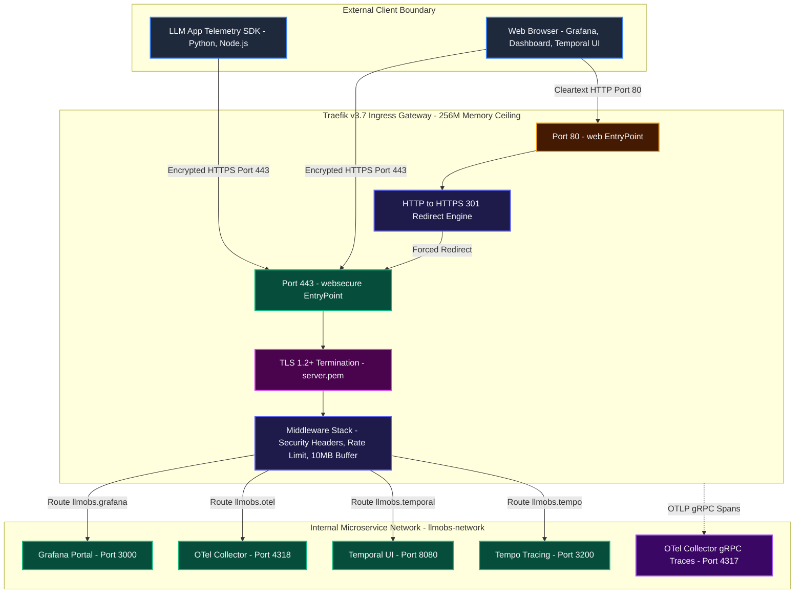
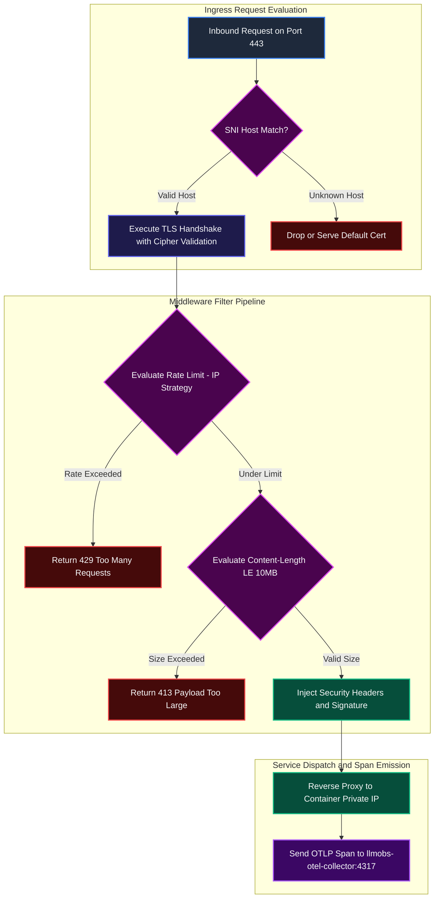

# ADR-0014: Traefik Edge Proxy Gateway, Ingress Security and Centralized Container Logging Architecture

| Field | Value |
|---|---|
| **Document ID** | ADR-0014 |
| **Status** | **Accepted (Implemented)** |
| **Author(s)** | Principal Infrastructure Architect |
| **Target Repository** | `Chief-Strategist-J/llm-obs-infra` |
| **Date** | 2026-09-08 |
| **Version** | 1.0.0 |
| **Scope** | Edge Reverse Proxy (`llmobs-traefik`), Logging Infrastructure (`x-logging`, `x-audit-logging`), and Dynamic Ingress Security (`config/traefik/dynamic.yml`) |
| **Validated against** | Traefik v3.7, Docker Engine 24.0+, OpenTelemetry v0.100.0+ |

---

## 1. Executive Summary

This Architecture Decision Record (ADR) formalizes the design, security boundaries, resource caps, and observability pipelines implemented at lines 1–65 of `docker-compose.yml`:
1. **Centralized Log Volume Bounding (`x-logging`, `x-audit-logging`)**: Establishes reusable YAML anchors enforcing rotational file limits and size thresholds to prevent daemon disk exhaustion.
2. **Edge Reverse Proxy Gateway (`llmobs-traefik`)**: Standardizes on Traefik v3.7 as the single ingress point for all web portals, telemetry collectors, tracing endpoints, and dashboards.
3. **Mandatory HTTPS and Zero-Trust TLS Termination**: Enforces automatic HTTP-to-HTTPS redirect on port 80 to port 443 with TLS 1.2+ minimum cipher restrictions.
4. **Ingress Protection Middlewares**: Deploys layered defense-in-depth filters: IP rate limiting (100–500 req/sec), 10 MB payload buffering caps, and strict HTTP security headers (HSTS, CSP, XSS protection, server token suppression).
5. **Memory Resource Governance**: Binds Traefik to a hard Docker cgroup limit of `256M` (reservation `64M`) in adherence with ADR-0011 Decision 4.
6. **Self-Observability via Distributed Tracing**: Configures native OTLP gRPC span export from Traefik into the local OpenTelemetry Collector (`llmobs-otel-collector:4317`).

---

## 2. Context and Problem Statement

The `llm-obs-infra` stack runs multi-tenant observability services—Grafana, Tempo, OpenTelemetry Collector, Temporal UI, and Service Registry—on a shared Linux host (15 GB RAM, 4 CPU cores, single bridge network `llmobs-network`).

Prior to establishing this architecture, the platform faced critical vulnerabilities:
1. **Unbounded Container Logs**: Containers writing unstructured logs without file count or size caps could consume all remaining disk space on `/dev/sda2`, causing cascading filesystem failures across ClickHouse, Kafka, and PostgreSQL.
2. **Exposed Service Ports & Direct Cleartext HTTP**: Internal HTTP services risked exposure directly to the host network without TLS encryption, leaving API keys, trace payloads, and authentication cookies exposed to local packet inspection.
3. **Denial-of-Service (DoS) and Large Payload Memory Spikes**: Without edge buffering and rate limiting, malicious or misconfigured clients could flood internal services with multi-gigabyte POST bodies, exhausting memory buffers inside downstream Go or Java services.
4. **Unbounded Gateway Memory Consumption**: Operating Traefik without Docker `deploy.resources` left the edge proxy vulnerable to heap ballooning during traffic surges, threatening host stability.
5. **Observability Blind Spots**: Edge routing latencies and proxy rejections (HTTP 429, 413, 502) were invisible to the central distributed tracing system.

---

## 3. Architecture Decisions

### 3.1 Centralized Container Logging Architecture (`x-logging` and `x-audit-logging`)

All containers across `docker-compose.yml` inherit logging parameters from two standardized YAML anchors declared at lines 1–13:

```yaml
x-logging: &default-logging
  driver: "json-file"
  options:
    max-size: "50m"
    max-file: "3"

x-audit-logging: &audit-logging
  driver: "json-file"
  options:
    max-size: "100m"
    max-file: "10"
    tag: "audit-{{.Name}}"
```

- **`default-logging`**: Applied to all standard service workloads (Traefik, Redis, Kafka, ClickHouse, Tempo, OTel Collector, Grafana, Temporal, Service Registry). Bounds disk usage to $50\text{ MB} \times 3 = 150\text{ MB}$ maximum log footprint per container.
- **`audit-logging`**: Dedicated to stateful compliance engines (AlloyDB Omni). Allocates $100\text{ MB} \times 10 = 1000\text{ MB}$ with mandatory container tagging (`audit-{{.Name}}`) for forensic ingestion.

---

### 3.2 Ingress Gateway and Dual Provider Topology

The gateway container is configured via static CLI flags coupled with dynamic file and Docker providers:

```yaml
  llmobs-traefik:
    image: traefik:v3.7
    container_name: llmobs-traefik-gateway
    restart: unless-stopped
    logging: *default-logging
    deploy:
      resources:
        limits:
          memory: 256M
        reservations:
          memory: 64M
    command:
      - "--api.insecure=true"
      - "--providers.docker=true"
      - "--providers.docker.exposedbydefault=false"
      - "--providers.docker.network=llmobs-network"
      - "--providers.file.directory=/etc/traefik/dynamic"
      - "--providers.file.watch=true"
      - "--entrypoints.web.address=:80"
      - "--entrypoints.websecure.address=:443"
      - "--entrypoints.web.http.redirections.entrypoint.to=websecure"
      - "--entrypoints.web.http.redirections.entrypoint.scheme=https"
      - "--accesslog=true"
      - "--accesslog.format=json"
      - "--accesslog.fields.headers.defaultmode=keep"
      - "--serversTransport.insecureSkipVerify=true"
      - "--tracing.otlp=true"
      - "--tracing.otlp.grpc.endpoint=llmobs-otel-collector:4317"
      - "--tracing.otlp.grpc.insecure=true"
```

1. **Provider Isolation (`exposedbydefault=false`)**: Traefik ignores containers unless explicitly opted in via `traefik.enable=true`. This prevents unintentional exposure of internal backends like Kafka or Redis.
2. **Dual Provider Strategy**:
   - **Docker Provider**: Watches Docker socket events on `llmobs-network` to dynamically register container endpoints based on service labels.
   - **File Provider (`/etc/traefik/dynamic`)**: Watches `config/traefik/dynamic.yml` with live hot-reloading (`file.watch=true`) for TLS certificates, custom headers, rate limiters, circuit breakers, and buffering middleware.
3. **Universal TLS Redirection**: Any connection arriving on port 80 (`entrypoints.web`) is permanently redirected (HTTP 301) to port 443 (`entrypoints.websecure`).

---

### 3.3 Container Resource Governance (ADR-0011 Compliance)

In accordance with ADR-0011 Decision 4:
- **`limits.memory: 256M`**: Hard container cgroup boundary. As a compiled Go binary, Traefik's idle RSS is 20–50 MB. A 256 MB limit provides 5x headroom for TLS session caches, route tables, and buffered request headers.
- **`reservations.memory: 64M`**: Guaranteed host physical allocation ensuring the gateway is never starved of memory by analytical queries in ClickHouse or AlloyDB.

---

### 3.4 Ingress Security Middleware Pipeline

Defined in `config/traefik/dynamic.yml` and mounted at `/etc/traefik/dynamic/dynamic.yml:ro`:

1. **Strict Transport Security and Header Hardening (`security-headers`)**:
   - `HSTS` (31536000s / 1 year, includeSubdomains, preload).
   - `X-Content-Type-Options: nosniff`.
   - `X-Frame-Options: SAMEORIGIN` with `frameDeny: true`.
   - `Permissions-Policy: camera=(), microphone=(), geolocation=()`.
   - Header anonymization: Masks `Server` and strips `X-Powered-By`.
   - Network signatures: Injects `X-LLMObs-Network-Signature` and `X-LLMObs-HMAC-Auth` verification stamps.
2. **Rate Limiting Engine**:
   - General endpoints (`rate-limit`): 100 req/s average, 200 burst.
   - High-throughput telemetry ingest (`rate-limit-ingest`): 500 req/s average, 1000 burst.
3. **Payload Buffering Bounds (`payload-limit`)**:
   - `maxRequestBodyBytes: 10485760` (10 MB). Rejects oversized payloads with HTTP 413.
   - `memRequestBodyBytes: 2097152` (2 MB). Buffers up to 2 MB in RAM; spills excess to disk to prevent RAM exhaustion.

---

### 3.5 Distributed Tracing and Access Logging

- **OTLP Trace Instrumentation**: Sends spans for every incoming HTTP request to `llmobs-otel-collector:4317` over gRPC. Spans include gateway latency, TLS handshake duration, and downstream dispatch status.
- **Structured JSON Access Logs**: Emits structured JSON logs to stdout (`accesslog.format=json`), maintaining client headers for security auditability.

---

## 4. High-Level and Low-Level Architecture Diagrams

### 4.1 High-Level Design (HLD): Edge Routing and Ingress Perimeter



---

### 4.2 Low-Level Design (LLD): Middleware Evaluation and Filter Lifecycle



---

## 5. Consequences

### 5.1 Positive Consequences
- **Single Ingress IP & Port**: All internal ports (3000, 4318, 8080, 3200) can remain internal to `llmobs-network` without host binding in production.
- **Zero Cleartext Transmission**: Port 80 redirection guarantees that unencrypted traffic cannot traverse public or perimeter networks.
- **DDoS and OOM Shielding**: The 10 MB payload cap and 500 req/s rate limits protect down-stream services (ClickHouse, OTel Collector, AlloyDB) from buffer overflows.
- **Deterministic Disk Usage**: The JSON logging bounds prevent runaway container logs from consuming disk space.
- **Trace Continuity**: Edge latency is transparently visible in Grafana Tempo dashboards through native OTLP span emission.

### 5.2 Negative Consequences and Trade-Offs
- **Single Point of Failure (Dev Stack)**: In development, a single Traefik container acts as the gateway. For production, `docker-compose.prod.yml` scales services behind an external load balancer.
- **Self-Signed Certificate Friction**: In local testing, clients must use `-k` (`--insecure`) with `curl` or trust `./config/certs/server.pem`.
- **Payload Buffering Overhead**: Spilling request bodies above 2 MB to temporary disk storage introduces slight disk I/O on large trace batches.

---

## 6. Operational Runbook

### 6.1 Inspect Traefik Live Routes and Health
```bash
# Query internal Traefik API for active HTTP routers
curl -s http://localhost:31411/api/http/routers | jq .

# Verify Traefik container memory usage against the 256M limit
docker stats --no-stream llmobs-traefik-gateway
```

### 6.2 Test Edge Redirection and TLS Handshake
```bash
# Verify HTTP port 80 redirects to HTTPS 443
curl -I http://localhost:31410/ -H "Host: llmobs.gateway"

# Verify TLS 1.2+ certificate validity
openssl s_client -connect localhost:31419 -servername llmobs.gateway -tls1_2 < /dev/null
```

### 6.3 Verify Rate Limiting Rejections (HTTP 429)
```bash
# Send rapid burst of requests to trigger rate limiting
for i in {1..250}; do
  curl -k -s -o /dev/null -w "%{http_code}\n" https://localhost:31419/ -H "Host: llmobs.gateway"
done | sort | uniq -c
```

---

## 7. References

| Document | URL |
|---|---|
| Traefik v3 Documentation | https://doc.traefik.io/traefik/ |
| Traefik OpenTelemetry Tracing | https://doc.traefik.io/traefik/observability/tracing/opentelemetry/ |
| Traefik Buffering Middleware | https://doc.traefik.io/traefik/middlewares/http/buffering/ |
| Traefik RateLimit Middleware | https://doc.traefik.io/traefik/middlewares/http/ratelimit/ |
| Docker json-file Logging Driver | https://docs.docker.com/engine/logging/drivers/json-file/ |
| ADR-0011: Infrastructure Resource Optimization | [ADR-0011](adr-0011-infrastructure-resource-optimization.md) |
| ADR-0013: OTel Collector Configuration | [ADR-0013](adr-0013-otel-collector-configuration.md) |
