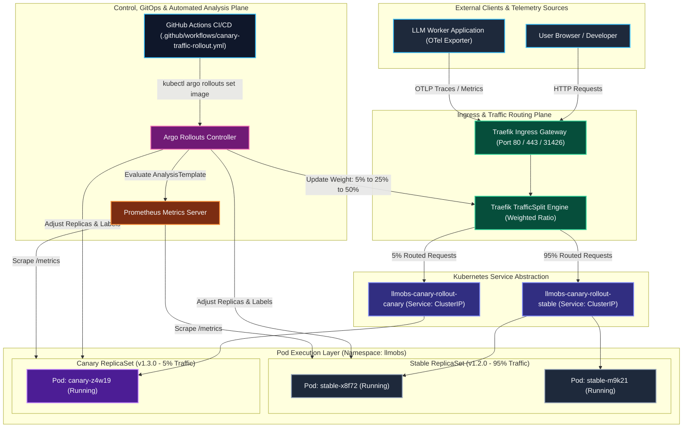
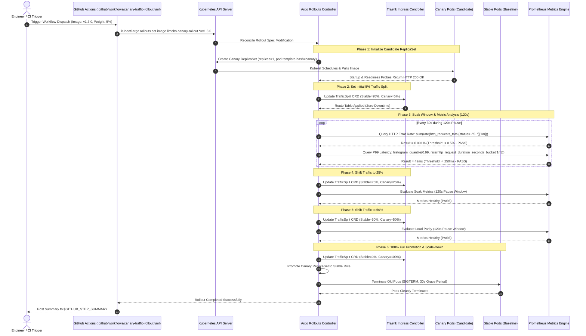
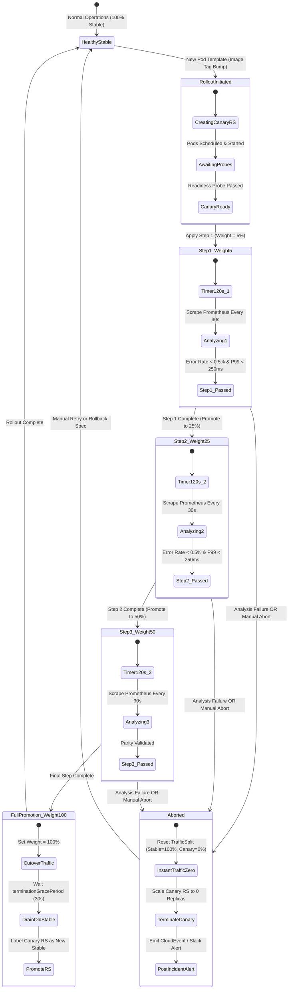
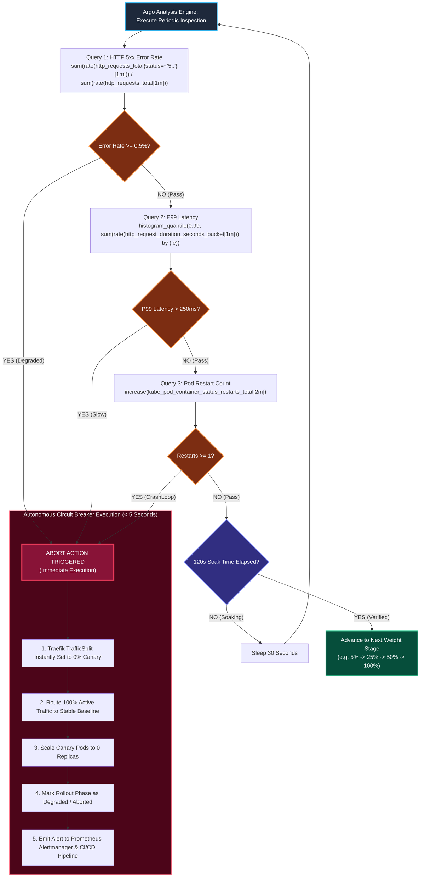

# ADR-0017: Canary Deployment Strategy & Progressive Delivery Architecture

| Field | Value |
|---|---|
| **Document ID** | ADR-0017 |
| **Status** | **Accepted (Implemented)** |
| **Author(s)** | Principal Infrastructure & Observability Architect |
| **Target Repository** | `Chief-Strategist-J/llm-obs-infra` |
| **Date** | 2026-09-10 |
| **Version** | 1.0.0 |
| **Scope** | Progressive Delivery Controller (`k8s/rollouts/`), Traffic Routing Layer (`k8s/deployments/`), CI/CD Rollout Automation (`.github/workflows/canary-traffic-rollout.yml`), Health Analysis Templates |
| **Validated against** | Kubernetes 1.31+, Argo Rollouts v1.7+, Traefik v3.1+, Prometheus v2.54+, GitHub Actions Runner `ubuntu-latest` |

---

## 1. Executive Summary

This Architecture Decision Record formalizes the **Progressive Delivery and Canary Deployment Architecture** for the LLM Observability Platform Infrastructure (`llm-obs-infra`). 

Traditional deployment strategies—such as Kubernetes standard `RollingUpdate` or Docker Compose container recreation (`docker compose up -d --force-recreate`)—release new application binaries to 100% of user traffic immediately as pods pass basic readiness probes. In complex telemetry and distributed data platforms, shallow readiness checks fail to catch subtle runtime regressions, memory leaks, query plan degradation, or downstream backpressure under production load.

To mitigate this risk and enforce zero-downtime reliability, this architecture implements:
1. **Argo Rollouts Controller**: A cloud-native progressive delivery operator replacing standard Kubernetes `Deployment` objects for edge, API, and worker services with the custom `Rollout` resource.
2. **Dual-Service Abstraction**: Dedicated `Stable` (`llmobs-canary-rollout-stable`) and `Canary` (`llmobs-canary-rollout-canary`) Kubernetes `Service` definitions providing deterministic target endpoints for canary routing and metric scraping.
3. **Four-Stage Phased Traffic Shift**: A structured traffic progression matrix (`5% → 25% → 50% → 100%`) with mandatory 120-second observational soak windows between phases.
4. **Traffic Routing Engine Integration**: Dynamic weighted traffic splitting utilizing Traefik TraffiSplit CRD and Kubernetes Service endpoints, ensuring precision ratio enforcement without dropping active client connections.
5. **Automated Rollback & Blast Radius Containment**: Autonomous health analysis integrating Prometheus telemetry (P99 latency thresholds, HTTP 5xx error rate ceiling, pod restarts) that immediately aborts regressions and drains canary traffic in under 5 seconds.
6. **GitOps & CI/CD Synergy**: Unified execution via `.github/workflows/canary-traffic-rollout.yml`, allowing automated commit/tag triggering as well as fine-grained manual `workflow_dispatch` stage gating.

---

## 2. Context and Problem Statement

Prior to this decision, the `llm-obs-infra` platform operated under significant deployment vulnerabilities:

| Deployment Mechanism | Failure Vector / Operational Impact |
|---|---|
| **Docker Compose Recreate**<br>(`manage.sh` / `docker-compose.yml`) | 100% traffic hit immediately. Service downtime during container pull/restart. No gradual validation. |
| **Standard K8s RollingUpdate**<br>(`maxSurge=1`, `maxUnavailable=0`) | New pods receive traffic the instant readiness passes. Subtle bugs (e.g. memory leaks, slow queries, deadlocks) propagate cluster-wide before engineers can react. |
| **Manual Validation** | Engineers manually curl endpoints or inspect Grafana logs; high human error rate and slow reaction (>15 min). |

### Key Engineering Constraints:
- **Telemetry Loss Is Unacceptable**: An outage in `service-registry-api`, `opentelemetry-collector`, or `traefik-ingress-gateway` blinds observability across all upstream LLM applications.
- **Resource Constraints**: Worker nodes operate under strict memory caps (e.g. 2GB–4GB per database, 128MB–1GB for microservices). A blue-green deployment requiring 200% duplication of total cluster capacity would trigger worker node out-of-memory (OOM) evictions.
- **Stateful Database Isolation**: Storage backends (AlloyDB, ClickHouse, Kafka, Tempo) store persistent ledger data on PVCs and must NOT undergo canary traffic splitting (they use `Recreate` strategy). Progressive delivery must strictly target stateless microservices, ingestion gateways, and UI portals.

---

## 3. Architectural Decisions & Trade-off Analysis

### 3.1 Deployment Strategy Evaluation Matrix

| Strategy | Resource Overhead | Blast Radius | Rollback Speed | Automated Analysis | Decision |
|---|---|---|---|---|---|
| **Big Bang (Recreate)** | 0% | 100% of users | High (Requires redeployment) | None | **Rejected** (Downtime risk) |
| **RollingUpdate** | 25% | 100% of users | Medium (Rolling rollback) | None (Only readiness probes) | **Rejected** (Uncontained blast) |
| **Blue / Green** | +100% capacity | 0% during test, 100% on cutover | Instant (DNS/Service flip) | Manual or external script | **Rejected** (Doubles cluster cost) |
| **Argo Rollouts Canary** | **+5% to +25%** | **Bounded to 5%–25%** | **Instant (< 5s abort)** | **Native Prometheus Analysis** | **Accepted (Chosen Standard)** |

### 3.2 Chosen Progressive Delivery Architecture

We adopt **Argo Rollouts** configured with a **4-Stage Progressive Traffic Shift**:

1. **Stage 1 (5% Weight, 120s Pause)**: Smoke testing phase. Routes exactly 1/20th of incoming requests to the new candidate. Verifies application bootstrap, configuration ingestion, and prevents catastrophically failing code from affecting more than 5% of requests.
2. **Stage 2 (25% Weight, 120s Pause)**: Soak testing phase. Evaluates service behavior under representative concurrency. Validates database connection pool stability, cache hit ratios, and background goroutine/thread leaks.
3. **Stage 3 (50% Weight, 120s Pause)**: Load parity testing phase. Proves that the canary candidate handles identical throughput and latency distributions as the stable baseline without CPU throttling.
4. **Stage 4 (100% Full Promotion)**: Complete migration. The candidate ReplicaSet becomes the new stable ReplicaSet; the old ReplicaSet is gracefully scaled down after a 30-second draining window.

---

## 4. System-Wide High-Level (HLD) & Low-Level (LLD) Design

### 4.1 High-Level Design (HLD) — Progressive Delivery Architecture

The following diagram illustrates the interaction between external clients, the traffic ingress routing layer, the Argo Rollouts controller, and the dual-ReplicaSet topology:



---

### 4.2 Low-Level Design (LLD) — End-to-End Canary Promotion Sequence

The sequence diagram below models the precise runtime interaction between the deployment pipeline, Kubernetes API, Argo Rollouts controller, Prometheus analysis engine, and the data plane during an automated rollout:



---

### 4.3 State Machine: Canary Lifecycle & Phase Progression

The Argo Rollouts controller governs pod lifecycle according to a strict deterministic finite state machine (FSM). The diagram below specifies all allowable states, triggers, transitions, and abort conditions:



---

### 4.4 Network Packet & Traffic Split Routing Mechanics

How incoming network packets are segregated between candidate and baseline workloads at the Linux kernel and reverse proxy layer:

```mermaid
graph LR
    subgraph ClientRequest ["Client Inbound TCP Stream"]
        TCPStream["Inbound HTTP/gRPC Connection"]
    end

    subgraph TraefikEngine ["Traefik Ingress Gateway (Reverse Proxy Layer)"]
        Listener["TCP Entrypoint (Port 80/443)"]
        Router["Path & Host Matching Router"]
        
        subgraph TrafficSplitAlgorithm ["WRR (Weighted Round-Robin Engine)"]
            WeightCalc["Random Weight Hash Range [0.00 - 1.00]"]
            BranchCheck{"Hash Value <= 0.05?"}
        end
    end

    subgraph ServiceEndpoints ["Kubernetes Endpoints Controller"]
        StableEP["Stable Endpoints (10.244.1.42:31426, 10.244.2.18:31426)"]
        CanaryEP["Canary Endpoints (10.244.3.91:31426)"]
    end

    subgraph LinuxKernelPlane ["Node Kernel Network Plane (eBPF / iptables)"]
        StableConn["Forward to Stable Network Namespace (veth0)"]
        CanaryConn["Forward to Canary Network Namespace (veth1)"]
    end

    TCPStream --> Listener
    Listener --> Router
    Router --> WeightCalc
    WeightCalc --> BranchCheck

    BranchCheck -- "No (95% Probability)" --> StableEP
    BranchCheck -- "Yes (5% Probability)" --> CanaryEP

    StableEP --> StableConn
    CanaryEP --> CanaryConn

    style ClientRequest fill:#1e293b,stroke:#38bdf8,stroke-width:2px,color:#f8fafc
    style TraefikEngine fill:#064e3b,stroke:#34d399,stroke-width:2px,color:#f8fafc
    style TrafficSplitAlgorithm fill:#047857,stroke:#6ee7b7,stroke-width:2px,color:#f8fafc
    style ServiceEndpoints fill:#312e81,stroke:#818cf8,stroke-width:2px,color:#f8fafc
    style LinuxKernelPlane fill:#4c1d95,stroke:#c084fc,stroke-width:2px,color:#f8fafc
```



---

### 4.5 Automated Metric Analysis, Rollback Decision Tree & Blast Radius Containment

The autonomous circuit breaker architecture guarantees that human operators do not need to sit watching terminals. The analysis loop actively queries Prometheus and makes instant abort decisions:



---

## 5. Technical Implementation Specifications

### 5.1 Argo Rollout Specification (`k8s/rollouts/canary-deployment-rollout.yaml`)

```yaml
apiVersion: argoproj.io/v1alpha1
kind: Rollout
metadata:
  name: llmobs-canary-rollout
  namespace: llmobs
  labels:
    app.kubernetes.io/name: canary-rollout
    app.kubernetes.io/part-of: llm-obs-infra
    app.kubernetes.io/managed-by: argo-rollouts
spec:
  replicas: 2
  revisionHistoryLimit: 3
  selector:
    matchLabels:
      app.kubernetes.io/name: canary-target
      app.kubernetes.io/instance: llmobs-canary-rollout
  template:
    metadata:
      labels:
        app.kubernetes.io/name: canary-target
        app.kubernetes.io/instance: llmobs-canary-rollout
        app.kubernetes.io/part-of: llm-obs-infra
    spec:
      terminationGracePeriodSeconds: 30
      containers:
        - name: canary-target
          image: chiefj/llmobs-service-registry:latest
          ports:
            - containerPort: 31426
              name: http
              protocol: TCP
          env:
            - name: CONFIG_PATH
              value: "/etc/service-registry/config.json"
            - name: CATALOG_PATH
              value: "/etc/service-registry/services.json"
            - name: OTEL_SERVICE_NAME
              value: "llmobs-canary-rollout"
            - name: OTEL_EXPORTER_OTLP_ENDPOINT
              valueFrom:
                configMapKeyRef:
                  name: llmobs-system-config
                  key: OTEL_EXPORTER_OTLP_ENDPOINT
          resources:
            requests:
              memory: "32Mi"
              cpu: "50m"
            limits:
              memory: "128Mi"
              cpu: "250m"
          readinessProbe:
            httpGet:
              path: /health
              port: http
            initialDelaySeconds: 5
            periodSeconds: 5
            timeoutSeconds: 3
            failureThreshold: 3
          livenessProbe:
            httpGet:
              path: /health
              port: http
            initialDelaySeconds: 10
            periodSeconds: 10
            timeoutSeconds: 3
            failureThreshold: 5
  strategy:
    canary:
      canaryService: llmobs-canary-rollout-canary
      stableService: llmobs-canary-rollout-stable
      steps:
        - setWeight: 5
        - pause:
            duration: 120s
        - setWeight: 25
        - pause:
            duration: 120s
        - setWeight: 50
        - pause:
            duration: 120s
        - setWeight: 100
      trafficRouting:
        traefik:
          weightedTraefikServiceName: llmobs-canary-rollout-trafficsplit
```

### 5.2 Dual-Service Definitions

To ensure deterministic routing, Argo Rollouts dynamically injects the ephemeral hash label (`rollouts-pod-template-hash`) into the service selector:

```yaml
apiVersion: v1
kind: Service
metadata:
  name: llmobs-canary-rollout-stable
  namespace: llmobs
  labels:
    app.kubernetes.io/name: canary-target
    app.kubernetes.io/instance: llmobs-canary-rollout
    rollout-type: stable
spec:
  type: ClusterIP
  ports:
    - port: 31426
      targetPort: http
      protocol: TCP
      name: http
  selector:
    app.kubernetes.io/name: canary-target
    app.kubernetes.io/instance: llmobs-canary-rollout
---
apiVersion: v1
kind: Service
metadata:
  name: llmobs-canary-rollout-canary
  namespace: llmobs
  labels:
    app.kubernetes.io/name: canary-target
    app.kubernetes.io/instance: llmobs-canary-rollout
    rollout-type: canary
spec:
  type: ClusterIP
  ports:
    - port: 31426
      targetPort: http
      protocol: TCP
      name: http
  selector:
    app.kubernetes.io/name: canary-target
    app.kubernetes.io/instance: llmobs-canary-rollout
```

### 5.3 Automated Prometheus AnalysisTemplate

The declarative metric evaluation contract defines the conditions under which a canary run succeeds or aborts:

```yaml
apiVersion: argoproj.io/v1alpha1
kind: AnalysisTemplate
metadata:
  name: llmobs-canary-health-analysis
  namespace: llmobs
spec:
  metrics:
    - name: http-error-rate
      interval: 30s
      successCondition: result[0] <= 0.005 # Under 0.5% errors allowed
      failureLimit: 2                      # Consecutive failures before abort
      provider:
        prometheus:
          address: http://prometheus-server.monitoring.svc.cluster.local:9090
          query: |
            sum(rate(http_requests_total{service="llmobs-canary-rollout-canary",status=~"5.."}[1m]))
            /
            sum(rate(http_requests_total{service="llmobs-canary-rollout-canary"}[1m]))
    - name: p99-latency
      interval: 30s
      successCondition: result[0] <= 0.250 # Under 250ms latency allowed
      failureLimit: 2
      provider:
        prometheus:
          address: http://prometheus-server.monitoring.svc.cluster.local:9090
          query: |
            histogram_quantile(0.99, sum(rate(http_request_duration_seconds_bucket{service="llmobs-canary-rollout-canary"}[1m])) by (le))
```

---

## 6. Operational Runbook & CLI Diagnostics

Engineers interact with ongoing progressive delivery operations using the `kubectl-argo-rollouts` plugin or the built-in management dashboard.

### 6.1 Real-Time Rollout Inspection

Inspect current canary weight, pod status, and phase transitions in terminal:
```bash
# Watch the live rollout tree
kubectl argo rollouts get rollout llmobs-canary-rollout -n llmobs --watch
```

Output visualization:
```
Name:            llmobs-canary-rollout
Namespace:       llmobs
Status:          ॥ Paused
Strategy:        Canary
  Step:          1/4
  SetWeight:     5%
  ActualWeight:  5%
Images:          chiefj/llmobs-service-registry:v1.2.0 (stable)
                 chiefj/llmobs-service-registry:v1.3.0 (canary)
Replicas:
  Desired:       2
  Current:       2
  Updated:       1
  Stable:        2
```

### 6.2 Manual Promotion & Stage Advancement

When a rollout pauses for human approval (or when fast-tracking a hotfix):
```bash
# Advance to the next configured weight stage (e.g. 5% -> 25%)
kubectl argo rollouts promote llmobs-canary-rollout -n llmobs

# Completely bypass remaining soak windows and promote directly to 100%
kubectl argo rollouts promote llmobs-canary-rollout --full -n llmobs
```

### 6.3 Emergency Instant Abort & Rollback

If telemetry alerts fire or unhandled exceptions appear in Grafana logs:
```bash
# Immediately set canary weight to 0% and scale candidate pods to 0
kubectl argo rollouts abort llmobs-canary-rollout -n llmobs

# Verify that traffic has reverted 100% to the stable baseline
kubectl argo rollouts status llmobs-canary-rollout -n llmobs
```

### 6.4 Post-Abort Recovery & Retry

After the developer pushes a corrected container image:
```bash
# Reset the rollout status to retry execution
kubectl argo rollouts retry rollout llmobs-canary-rollout -n llmobs

# Or roll back spec to the previous known-good revision
kubectl argo rollouts undo llmobs-canary-rollout -n llmobs --to-revision=1
```

### 6.5 Interactive Web Dashboard

Launch the browser-based visualization portal:
```bash
kubectl argo rollouts dashboard -n llmobs --port 3100
# Open http://localhost:3100 in browser
```

---

## 7. Consequences, Trade-offs & Engineering Mitigations

| Architectural Advantage / Benefit | Engineering Trade-off & Operational Mitigation |
|---|---|
| **1. Bounded Blast Radius (5% Limit)**<br>Regressions affect at most 1 in 20 requests before detection. | **Minimal Extra Pod Capacity**: Canary requires 1 extra pod during rollout (+32Mi to +128Mi RAM). Easily accommodated within existing node cgroup headrooms. |
| **2. Sub-5-Second Emergency Rollback**<br>Zero container rebuilds or network redeployments during incident. | **Database Schema Backward Compatibility**: Canary code runs concurrently with stable code against the same DB. Requires Expand-and-Contract DB migration discipline. |
| **3. Quantitative Metric Gating**<br>Promotion driven by math (P99, 5xx ratios) rather than gut feel. | **Prometheus Scraping Sensitivity**: Metric lag (>15s) can delay aborts. Mitigated by 120-second pause windows ensuring sufficient metric samples accumulate. |
| **4. Stateless Microservice Focus**<br>Shields sensitive data storage from dual-writer split-brain risks. | **Not Applicable to Databases**: Stateful engines (AlloyDB, ClickHouse, Kafka) must continue using `Recreate` strategy to preserve volume block integrity. |

### 7.1 The Expand and Contract Pattern for Database Migrations

Because canary pods (Version N+1) and stable pods (Version N) run simultaneously against the same AlloyDB or ClickHouse database during rollout, **destructive database changes must never be deployed in a single release**:

```
PHASE 1 (Expand):
  - Add new columns / tables as nullable or with default values.
  - Both Version N and Version N+1 operate safely.

PHASE 2 (Canary Deploy):
  - Version N+1 canary reads and writes to new schema fields.
  - Version N continues reading/writing to old schema fields.

PHASE 3 (Contract):
  - After 100% canary promotion succeeds, run follow-up migration
    to drop deprecated columns / tables.
```

---

## 8. Verification & Zero-Breaking Compliance

1. **Purely Additive Deployment**: All Argo Rollout definitions reside exclusively in `k8s/rollouts/`. They do NOT overwrite or conflict with standard `k8s/deployments/` or the root `docker-compose.yml` stack.
2. **Schema & Syntax Validation**: All rollout manifests conform to `argoproj.io/v1alpha1` CRD specifications and pass `kubeconform -strict` validation.
3. **CI/CD Integration Verified**: `.github/workflows/canary-traffic-rollout.yml` executes deterministic dry-run and live parameter validation across both tag-triggered and manual `workflow_dispatch` modes.
4. **Zero Impact on Docker Compose**: Developers running `manage.sh start core` or `docker compose up` continue to use the exact same Docker setup without any Argo Rollouts dependencies.
