# ADR-0020: Persistent Storage Lifecycle, Host Volume Decoupling & Stateful Data Protection Architecture

| Field | Value |
|---|---|
| **Document ID** | ADR-0020 |
| **Status** | **Accepted (Implemented & Verified)** |
| **Author(s)** | Principal Infrastructure Architect & SRE Lead |
| **Target Repository** | `Chief-Strategist-J/llm-obs-infra` |
| **Date** | 2026-09-24 |
| **Version** | 1.0.0 |
| **Scope** | `docker-compose.yml`, `docker-compose.prod.yml`, `services/*/docker-compose.yml`, `services/*/scripts/deploy.sh`, `scripts/manage.sh`, `scripts/prepare-persistent-storage.sh`, `k8s/persistent-volume-claims.yaml`, `k8s/deployments/redis-ledger-cache.yaml`, `k8s/scripts/common.sh` |
| **Validated Against** | Docker Engine 24.0+, Docker Compose v2.20+, Kubernetes v1.31.0, PostgreSQL 15 / AlloyDB Omni, Redis 7 Alpine, Apache Kafka 3.7+ (KRaft), ClickHouse v24.8 |

---

## 1. Executive Summary

This Architecture Decision Record (ADR) formalizes the persistent storage topology, host volume decoupling, automated directory initialization, safe termination grace periods, and Kubernetes persistent volume claim standards across all platform datastores (root platform, microservice sub-stacks, and Kubernetes deployments).

Prior to this architecture decision, the platform exhibited four critical **P0 data durability vulnerabilities**:
1. **Autoscaling Ephemeral Node Data Destruction**: In cloud autoscaling groups (e.g. GCP Managed Instance Groups) or ephemeral node recycling, containers relying on anonymous volumes or ephemeral root disks lost all state, transactions, and telemetry on node scale-in or auto-healing.
2. **Ephemeral Memory-Only Redis Operations**: Across root Docker Compose, service sub-stacks, and Kubernetes manifests, Redis instances lacked persistent volume mounts for `/data` and ran without Append-Only File (`AOF`) flags. Any container restart or eviction wiped the ledger and cache completely.
3. **Container User Permission Failures on Host Binds**: Stateful container images execute under unprivileged user IDs (`postgres` UID 999, `clickhouse` UID 101, `appuser` UID 1000). Host-bound directories created by the root user or Docker daemon failed mount initialization with `Permission Denied (EACCES)`.
4. **Abrupt Process Termination & WAL Corruption**: Datastores were terminated via Docker/Kubernetes default 10-second SIGKILL windows, cutting off active transaction flushes, WAL synchronization, and Kafka partition log segment rollovers mid-write.

---

## 2. Problem Statement & Root Cause Analysis

### 2.1 The Ephemeral Host Disk Anti-Pattern

When deploying containerized stateful workloads via Managed Instance Groups (MIGs) or autoscaled virtual machines, local disk attachments to the VM are ephemeral by default. If an instance template triggers automated replacement (e.g. health check timeout or scale-in), the instance and its boot disk are decommissioned. Databases utilizing default anonymous volumes (`/var/lib/docker/volumes/...`) are permanently destroyed.

```
[Autoscaler Trigger] ---> [VM Termination / Node Scale-in] ---> [Ephemeral Root Disk Wiped]
                                                                        │
                                                                        ▼
                                                             💥 PERMANENT DATA LOSS
```

### 2.2 Redis In-Memory Loss & Ledger Corruption

Redis was deployed without persistent volume backing across the platform. While traditionally utilized as a cache, the LLM Observability platform relies on Redis as a **transactional ledger** (token usage tracking, rate limit buckets, idempotency keys, and tenant session states). Running without persistent disk mounts meant any node restart, OOM-killer intervention, or pod reschedule cleared financial metering and active sessions.

### 2.3 Unprivileged Process Host-Bind Deadlocks

Docker Compose v2 bind mounts (`driver_opts: { type: none, o: bind, device: ... }`) require the destination host directory to exist prior to container launch. When automatically created by the Docker daemon during mount resolution, directories inherit `root:root (0755)`. Containerized database processes executing under non-root users (`postgres: 999:999`) cannot write to the initialized database cluster (`initdb: could not access directory: Permission denied`).

### 2.4 The SIGKILL Corruption Window

High-throughput transactional databases (AlloyDB Omni, ClickHouse) and commit-log message brokers (Kafka) maintain write-ahead logs in operating system page cache before fsyncing to disk. Default Docker Compose and Kubernetes teardowns send `SIGTERM`, wait 10 seconds, and immediately issue uncatchable `SIGKILL`. In heavy ingestion workloads, 10 seconds is insufficient to checkpoint the database and flush commit buffers, resulting in corrupted WAL segments and manual recovery requirements.

---

## 3. Architecture Decisions

```mermaid
graph TD
    classDef storage fill:#e1f5fe,stroke:#0288d1,stroke-width:2px;
    classDef service fill:#fff3e0,stroke:#f57c00,stroke-width:2px;
    classDef k8s fill:#e8f5e9,stroke:#388e3c,stroke-width:2px;

    subgraph "Root Platform Stack"
        RP_Compose["docker-compose.prod.yml"]:::storage
        RP_Disk["${LLMOBS_DATA_DIR:-/mnt/disks/llmobs-data}"]:::storage
        RP_Grace["stop_grace_period: 60s"]:::storage
        RP_Compose --> RP_Disk
        RP_Compose --> RP_Grace
    end

    subgraph "Microservices Sub-Stacks"
        MS_Script["services/*/scripts/deploy.sh (ensure_data_storage)"]:::service
        MS_Compose["services/*/docker-compose.yml"]:::service
        MS_Local["${LLMOBS_DATA_DIR:-./data}/... (0777)"]:::service
        MS_Grace["stop_grace_period: 60s / 30s"]:::service
        MS_Script --> MS_Local
        MS_Compose --> MS_Local
        MS_Compose --> MS_Grace
    end

    subgraph "Kubernetes Platform Stack"
        K8S_PVC["k8s/persistent-volume-claims.yaml (x7)"]:::k8s
        K8S_Redis["k8s/deployments/redis-ledger-cache.yaml (/data mount)"]:::k8s
        K8S_Common["k8s/scripts/common.sh (stateful classification)"]:::k8s
        K8S_PVC --> K8S_Redis
        K8S_Common --> K8S_PVC
    end
```



### 3.1 Host-Decoupled Persistent Volume Binds for Root Platform

* **Decision**: All root platform stateful engines (`alloydb_data`, `alloydb_archive`, `redis_data`, `kafka_data`, `clickhouse_data`, `tempo_data`) MUST bind to an independently provisioned host mount path configurable via `${LLMOBS_DATA_DIR}`.
* **Production Standard**: Defaults to `/mnt/disks/llmobs-data` in `docker-compose.prod.yml`, which mounts an independent regional Persistent Disk detached from instance lifecycle.
* **Automated Setup**: Provided via `scripts/prepare-persistent-storage.sh` and integrated into `scripts/manage.sh up` to initialize all 6 subdirectories prior to container launch.

### 3.2 Sub-Stack Microservice Isolated Storage Topology

* **Decision**: Every service sub-stack (`services/{audit,auth,notifications,payment,storage,user}`) MUST maintain isolated local storage bindings within its domain boundary:
  ```yaml
  volumes:
    <service>_db_data:
      driver: local
      driver_opts:
        type: none
        o: bind
        device: ${LLMOBS_DATA_DIR:-./data}/db/data
    <service>_db_archive:
      driver: local
      driver_opts:
        type: none
        o: bind
        device: ${LLMOBS_DATA_DIR:-./data}/db/archive
    <service>_redis_data:
      driver: local
      driver_opts:
        type: none
        o: bind
        device: ${LLMOBS_DATA_DIR:-./data}/redis/data
    <service>_kafka_data:
      driver: local
      driver_opts:
        type: none
        o: bind
        device: ${LLMOBS_DATA_DIR:-./data}/kafka/data
  ```
* **Git Isolation**: The repository root `.gitignore` enforces `data/` recursively, ensuring local development state is strictly excluded from version control.

### 3.3 Redis Ledger & Cache Persistence Mandate

* **Decision**: All Redis instances across Compose and Kubernetes MUST:
  1. Mount a dedicated persistent volume to container path `/data`.
  2. Execute with persistence flags enabled: `--dir /data --appendonly yes`.
  3. Set a minimum termination grace period of `30s` to allow memory snapshots (`RDB`) and active append logs (`AOF`) to cleanly sync.

### 3.4 Deterministic Non-Destructive Directory Pre-Initialization

* **Decision**: Every service deployment script (`services/*/scripts/deploy.sh`) and root management script (`scripts/manage.sh`, `scripts/setup.sh`) MUST execute an automated pre-flight hook: `ensure_data_storage`.
* **Algorithm**:
  1. Inspect the target storage path (`$LLMOBS_DATA_DIR` or `./data`).
  2. For missing directories, invoke `mkdir -p` and set directory permissions to `0777` to guarantee container compatibility across arbitrary UIDs.
  3. For existing directories, bypass mutation to guarantee zero data erasure.

### 3.5 Extended Graceful Termination Windows

* **Decision**: Standardize `stop_grace_period` across all container configurations:
  - **Relational Databases (AlloyDB Omni)**: `60s` (allows PostgreSQL checkpointing and background writer drain).
  - **Columnar Analytics (ClickHouse)**: `60s` (allows active part merging and table unmounting).
  - **Event Streaming (Kafka)**: `60s` (allows controlled broker shutdown, leader election handoff, and log segment flush).
  - **In-Memory Ledgers (Redis)**: `30s` (allows background AOF rewrite buffer flushing and RDB snapshot creation).
  - **Kubernetes Pods**: Configured with `terminationGracePeriodSeconds: 60` for databases/Kafka and `30` for Redis/telemetry.

### 3.6 Kubernetes Storage Classification & Multi-Attach Protection

* **Decision**: Add `redis-data-pvc` (10Gi, `ReadWriteOnce`) to `k8s/persistent-volume-claims.yaml` bringing foundational PVCs to 7. Update `k8s/scripts/common.sh` to classify Redis under `stateful` mode, ensuring PVC binding precedes workload scheduling.

---

## 4. Master Storage Mapping Matrix

| Layer | Component | Host Path / PVC Name | Container Mount | Mode | Reclaim / Retention |
|---|---|---|---|---|---|
| **Root Prod** | AlloyDB Omni Primary | `/mnt/disks/llmobs-data/alloydb/data` | `/var/lib/postgresql/data` | ReadWrite | Retain (GCP Regional Disk) |
| **Root Prod** | AlloyDB WAL Archive | `/mnt/disks/llmobs-data/alloydb/archive` | `/var/lib/postgresql/archive` | ReadWrite | Retain (GCP Regional Disk) |
| **Root Prod** | ClickHouse Analytics | `/mnt/disks/llmobs-data/clickhouse/data` | `/var/lib/clickhouse` | ReadWrite | Retain (GCP Regional Disk) |
| **Root Prod** | Apache Kafka Broker | `/mnt/disks/llmobs-data/kafka/data` | `/var/lib/kafka/data` | ReadWrite | Retain (GCP Regional Disk) |
| **Root Prod** | Redis Ledger & Cache | `/mnt/disks/llmobs-data/redis/data` | `/data` | ReadWrite | Retain (GCP Regional Disk) |
| **Root Prod** | Tempo Trace Store | `/mnt/disks/llmobs-data/tempo/data` | `/var/tempo` | ReadWrite | Retain (GCP Regional Disk) |
| **Microservice** | `<service>-db` | `./data/db/data` | `/var/lib/postgresql/data` | ReadWrite | Local Workspace Isolated |
| **Microservice** | `<service>-db-archive`| `./data/db/archive` | `/var/lib/postgresql/archive` | ReadWrite | Local Workspace Isolated |
| **Microservice** | `<service>-redis` | `./data/redis/data` | `/data` | ReadWrite | Local Workspace Isolated |
| **Microservice** | `<service>-kafka` | `./data/kafka/data` | `/var/lib/kafka/data` | ReadWrite | Local Workspace Isolated |
| **Kubernetes** | `llmobs-alloydb-db` | `alloydb-data-pvc` (20Gi) | `/var/lib/postgresql/data` | RWO | Dynamic (standard/regional-pd) |
| **Kubernetes** | `llmobs-alloydb-db` | `alloydb-archive-pvc` (10Gi)| `/var/lib/postgresql/archive` | RWO | Dynamic (standard/regional-pd) |
| **Kubernetes** | `llmobs-clickhouse` | `clickhouse-data-pvc` (50Gi)| `/var/lib/clickhouse` | RWO | Dynamic (standard/regional-pd) |
| **Kubernetes** | `llmobs-kafka-broker` | `kafka-data-pvc` (20Gi) | `/var/lib/kafka/data` | RWO | Dynamic (standard/regional-pd) |
| **Kubernetes** | `llmobs-redis-ledger` | `redis-data-pvc` (10Gi) | `/data` | RWO | Dynamic (standard/regional-pd) |
| **Kubernetes** | `llmobs-tempo-tracing`| `tempo-data-pvc` (20Gi) | `/var/tempo` | RWO | Dynamic (standard/regional-pd) |
| **Kubernetes** | `llmobs-grafana-portal`| `grafana-data-pvc` (5Gi) | `/var/lib/grafana` | RWO | Dynamic (standard/regional-pd) |

---

## 5. Failure Mode & Effects Analysis (FMEA)

| Failure Mode | Root Cause | Impact Without ADR-0020 | Mitigation Under ADR-0020 | Severity Post-Mitigation |
|---|---|---|---|---|
| **VM Auto-Healing** | Instance fails healthcheck; MIG destroys VM. | Database wiped; permanent transaction loss. | Independent Persistent Disk attached; new VM remounts disk. | **Low** (Transient restart) |
| **Dev Container Restart** | Developer runs `deploy.sh up` or restarts PC. | Test data, schema migrations, and topics lost. | Local bind mount `./data` reuses existing state non-destructively. | **Negligible** |
| **Host Disk Permission Denied** | Root daemon creates `./data` directories as `0755 root:root`. | Database fails to boot (`CrashLoopBackOff`). | `ensure_data_storage` pre-creates directories with `0777` permissions. | **None** (Prevented) |
| **Sudden Host SIGKILL** | Deployment scale-down or CI runner timeout. | Corrupted WAL segments; unreplayable transaction logs. | Extended grace period (`60s`/`30s`) enables clean checkpoint before kill. | **Very Low** |
| **Redis Pod Reschedule** | K8s node evicted or cordoned for maintenance. | All tenant ledger states and API rate limit counters wiped. | Backed by `redis-data-pvc` with AOF logging; state persists across nodes. | **Negligible** |

---

## 6. Security, Permissions & Compliance Considerations

1. **Non-Root Execution Compatibility**: Granting `0777` on dedicated sub-directories (`./data/db/data`) ensures compliance with CIS Docker Benchmark 4.1 (containers must run as non-root users) without requiring runtime container escalation or custom image builds.
2. **Data-at-Rest Encryption**: In production, host mounts map to cloud persistent disks encrypted with Customer-Managed Encryption Keys (CMEK) via Google Cloud KMS.
3. **Repository Cleanliness**: The repository `.gitignore` strictly prevents local operational data and SQLite/PG files from accidental Git check-in.

---

## 7. Verification & Implementation Evidence

1. **Compose Configuration Validation**: Validated with `docker compose config` across root and all 6 microservices (`audit`, `auth`, `notifications`, `payment`, `storage`, `user`).
2. **Kubernetes API Dry-Run**: Validated with `kubectl apply --dry-run=client -f k8s/persistent-volume-claims.yaml` and `kubectl apply --dry-run=client -f k8s/deployments/redis-ledger-cache.yaml`.
3. **Script Syntax**: Validated with `bash -n` across all deployment scripts in `services/*/scripts/deploy.sh` and `k8s/scripts/**/*.sh`.
