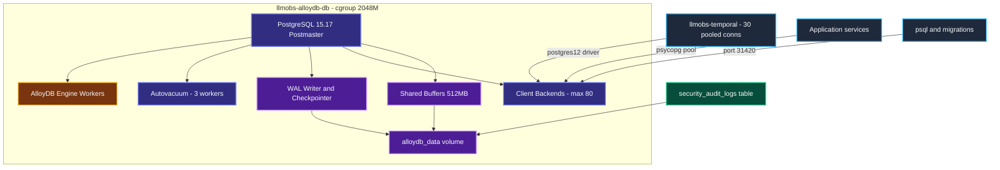
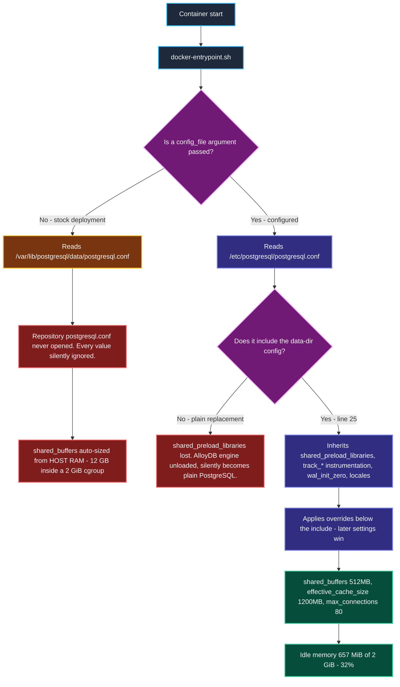
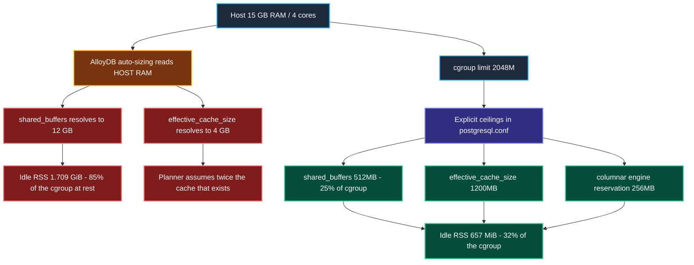
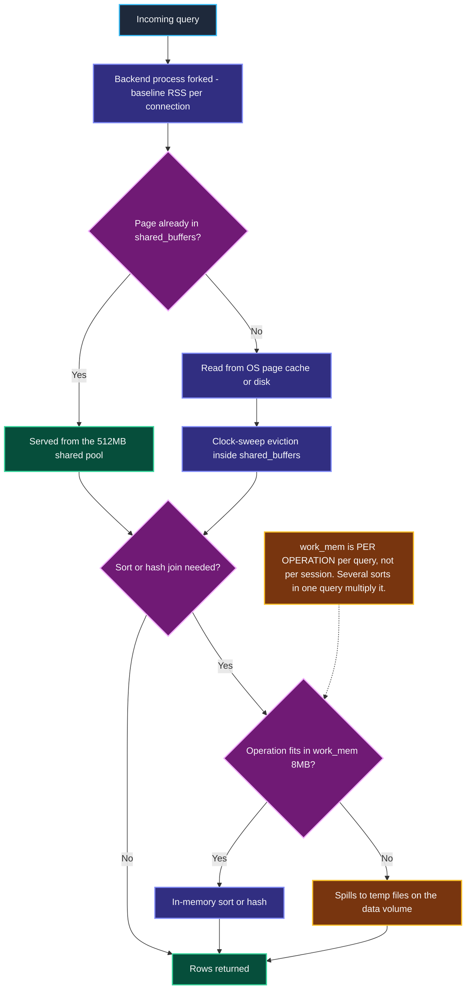
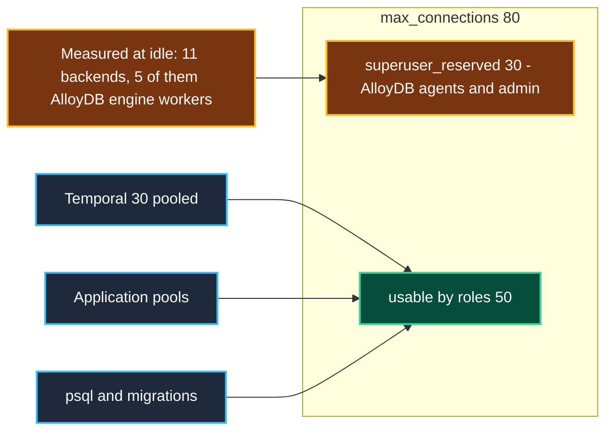
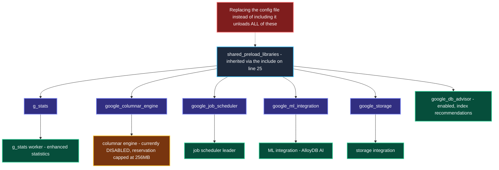
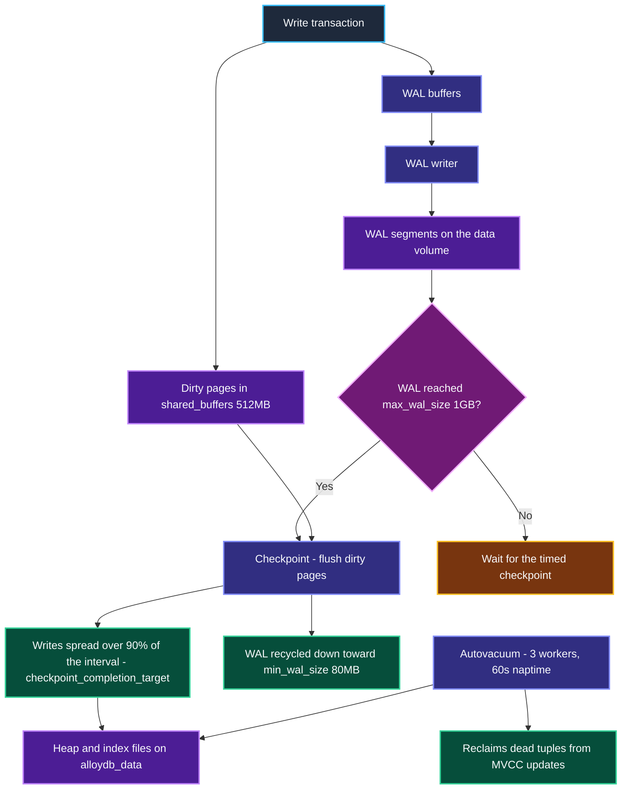
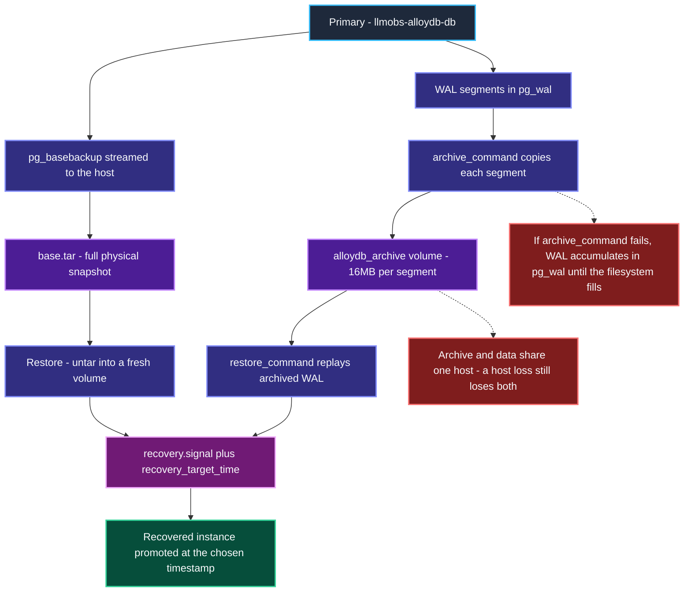
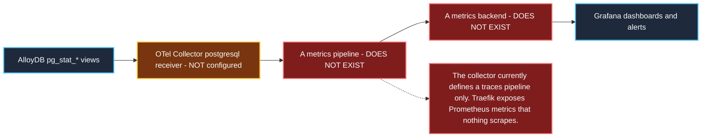
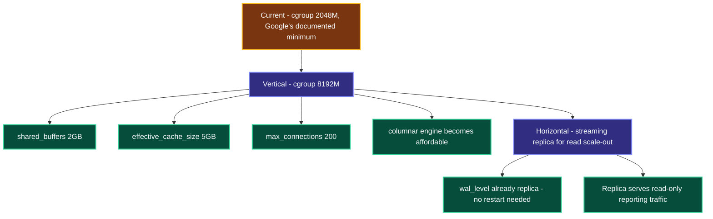

# AlloyDB Omni Comprehensive Architecture, Component Deep-Dive & Operational Guide

> **Validated against AlloyDB Omni 15 (`google/alloydbomni:15`, PostgreSQL 15.17)**, booted under the production `2048M` cgroup. Every **AlloyDB Default** stated in this document is a *measured* value read from `pg_settings` on that image, not a figure quoted from documentation. Several differ dramatically from stock PostgreSQL.
>
> Companion guides: [`clickhouse-configuration-guide.md`](file:///home/btpl-lap-22/live/llm-obs-infra/docs/configDoc/clickhouse-configuration-guide.md) · [`kafka-configuration-guide.md`](file:///home/btpl-lap-22/live/llm-obs-infra/docs/configDoc/kafka-configuration-guide.md)

## 0. How to Read the Diagrams

Every diagram uses one consistent colour language, so a path can be followed by colour alone. Diagrams avoid `<br/>` line breaks, undirected `---` links and `|` characters inside labels, all three of which break GitHub's Mermaid renderer.

| Colour | Meaning | Used for |
|---|---|---|
| 🟦 **Slate / blue** | Input or client | Connecting services, env vars, compose definitions, shipped defaults |
| 🟪 **Indigo** | Processing | Postgres backends, planner, engine extensions |
| 🟣 **Purple** | Storage | Shared buffers, WAL, data volume, audit tables |
| 🟥 **Magenta** | Decision gate | Connection admission, config resolution branches |
| 🟩 **Green** | Safe / configured outcome | The path this configuration produces |
| 🟧 **Amber** | Caution | Works but needs care: reservations, inherited settings, unused features |
| 🟥 **Red** | Failure | OOM kill, config silently ignored, engine unloaded |

The recurring contrast is **red versus green**: red is what the stock image produces inside a 2 GiB cgroup, green is what this configuration produces instead.

---

## 1. Executive Master Parameter Reference Specifications

To avoid scrolling back and forth between sections, this master reference provides an immediate, unified list of every AlloyDB parameter, its definitions, expected environment values, currently configured values, outcomes, trade-offs, and system impacts.

### 1.1 Master Parameter Specifications & Expected Values List

1. **Parameter**: `command: postgres -c config_file=...` and the `postgresql.conf` bind mount
   - **Definition**: The two compose settings that make `config/alloydb/postgresql.conf` the server's actual configuration file.
   - **Expected Values**: Mount at `/etc/postgresql/postgresql.conf:ro` plus `-c config_file=` pointing at it
   - **Currently Configured Value**: Both present (`docker-compose.yml` lines 287-292)
   - **Outcome / System Impact**: PostgreSQL's `config_file` defaults to `/var/lib/postgresql/data/postgresql.conf`, which lives **inside the `alloydb_data` volume**. Without both settings the repository file is never read.
   - **Why & When to Configure It**: **This was the headline defect.** The file existed, was tracked, and was referenced by ADR-0011 and the security documentation, but was mounted nowhere — so every value in it was silently ignored and the container ran stock defaults.
   - **Scaling & Troubleshooting**: Confirm activation with `SHOW config_file` — it must return `/etc/postgresql/postgresql.conf`, not the data-directory path. If it returns the data-directory path, nothing in the repo config is in effect.

---

2. **Parameter**: `include` of the data-directory config
   - **Definition**: First directive in `config/alloydb/postgresql.conf`, pulling in the config AlloyDB Omni generates at initdb time before applying any override.
   - **Expected Values**: `include = '/var/lib/postgresql/data/postgresql.conf'`
   - **Currently Configured Value**: Present (`config/alloydb/postgresql.conf` line 25)
   - **Outcome / System Impact**: Preserves `shared_preload_libraries`, the `track_*` instrumentation family, `wal_init_zero` and the locale settings that AlloyDB writes into the data directory.
   - **Why & When to Configure It**: **The line is load-bearing.** Replacing the config file rather than including it drops `shared_preload_libraries='g_stats,google_columnar_engine,google_job_scheduler,google_ml_integration,google_storage'` and unloads the entire AlloyDB engine — turning AlloyDB Omni into plain PostgreSQL, silently.
   - **Scaling & Troubleshooting**: Verify with `SHOW shared_preload_libraries` after any config change. It must list all five libraries. `SELECT count(*) FROM pg_settings WHERE name LIKE 'google%'` should return **73**.

---

3. **Parameter**: `shared_buffers`
   - **Definition**: Shared memory PostgreSQL reserves for caching data pages, allocated at startup.
   - **Expected Values**: Dev (2 GiB cgroup): `512MB` | Prod (8 GiB): `2GB` | Rule: 25% of the memory actually available to the container
   - **Currently Configured Value**: `512MB` (`config/alloydb/postgresql.conf` line 44)
   - **Outcome / System Impact**: **Measured idle container memory fell from 1.709 GiB (85.4% of the cgroup) to 657 MiB (32%)** once this was set.
   - **Why & When to Configure It**: **The single most important fix in this configuration.** AlloyDB Omni auto-sizes `shared_buffers` from **host RAM, not the cgroup**. On this 15 GB host it resolved to **12 GB inside a 2 GiB container** — six times the container limit. Shared memory is mapped lazily, so the container does not die instantly; it simply runs permanently near the OOM boundary and dies under load.
   - **Scaling & Troubleshooting**: Must track the container limit. Formula: `shared_buffers = cgroup x 0.25`. Verify with `SELECT pg_size_pretty(setting::bigint*8192) FROM pg_settings WHERE name='shared_buffers'`. A value in the multiple-GB range on a 2 GiB container means this file is not being read.

---

4. **Parameter**: `effective_cache_size`
   - **Definition**: Planner hint describing how much OS page cache plus shared buffers the planner should assume is available. Allocates nothing.
   - **Expected Values**: Dev: `1200MB` | Prod (8 GiB): `5GB` | Rule: roughly 60% of memory available to the container
   - **Currently Configured Value**: `1200MB` (`config/alloydb/postgresql.conf` line 55)
   - **Outcome / System Impact**: Inherited value was **4 GB**, also derived from host RAM. The planner would assume twice the cache that actually exists and under-cost index scans that must in fact hit disk.
   - **Why & When to Configure It**: Purely a planner input, but a wrong one produces systematically bad plans. It is the cheapest correctness fix in the file — zero runtime cost.
   - **Scaling & Troubleshooting**: Too high causes the planner to favour index scans that thrash disk; too low pushes it toward sequential scans. Inspect plan choices with `EXPLAIN (ANALYZE, BUFFERS)`.

---

5. **Parameter**: `max_connections`
   - **Definition**: Maximum concurrent client connections, including superuser and reserved slots.
   - **Expected Values**: Dev: `80` | Prod: `200` | Stock AlloyDB default: `100`
   - **Currently Configured Value**: `80` (`config/alloydb/postgresql.conf` line 38)
   - **Outcome / System Impact**: **AlloyDB Omni sets `superuser_reserved_connections = 30`** — PostgreSQL's own default is 3 — so non-superuser roles receive only `max_connections - 30`. At 80 that leaves **50** for application roles.
   - **Why & When to Configure It**: Temporal alone holds 30 pooled connections (20 on the default store plus 10 on visibility, see `config/temporal/temporal.yaml`). At the value ADR-0011 proposed (60) a non-superuser application role would have had exactly 30 available and zero headroom.
   - **Scaling & Troubleshooting**: Raising it costs shared bookkeeping, not per-backend memory, so it is a cheap knob. The expensive coupling is `work_mem`: worst case is `max_connections x work_mem x operations per query`. Check headroom with `SELECT count(*) FROM pg_stat_activity`.

---

6. **Parameter**: `work_mem`
   - **Definition**: Memory allowed per sort, hash join or similar operation — **per operation, per query, not per session**.
   - **Expected Values**: Dev: `8MB` | Prod: `16MB` | PostgreSQL default: `4MB`
   - **Currently Configured Value**: `8MB` (`config/alloydb/postgresql.conf` line 48)
   - **Outcome / System Impact**: A query with several sorts and hash joins allocates a multiple of this value; a heavily parallel query multiplies again per worker.
   - **Why & When to Configure It**: `4MB` spills routine analytical sorts to disk. `8MB` is a modest lift that keeps worst-case exposure bounded at `80 x 8MB` for single-operation queries.
   - **Scaling & Troubleshooting**: Raise per session (`SET work_mem = '64MB'`) for known heavy reporting queries rather than globally. Detect spilling with `log_temp_files` or `EXPLAIN (ANALYZE)` showing `external merge Disk`.

---

7. **Parameter**: `maintenance_work_mem`
   - **Definition**: Memory for maintenance operations: `VACUUM`, `CREATE INDEX`, `ALTER TABLE ADD FOREIGN KEY`.
   - **Expected Values**: Dev: `64MB` | Prod: `256MB` | PostgreSQL default: `64MB`
   - **Currently Configured Value**: `64MB` (`config/alloydb/postgresql.conf` line 50)
   - **Outcome / System Impact**: Matches the stock default; declared so the value is explicit rather than inherited.
   - **Why & When to Configure It**: Only up to `autovacuum_max_workers` (3) instances can be live at once, so the realistic ceiling is 192MB.
   - **Scaling & Troubleshooting**: Raise temporarily in a session before a large index build. Raising it globally multiplies by the autovacuum worker count.

---

8. **Parameter**: `google_columnar_engine.memory_size_in_mb`
   - **Definition**: Memory the AlloyDB columnar engine reserves for its column store.
   - **Expected Values**: Dev (2 GiB cgroup): `256` | Prod (8 GiB): `1024` | AlloyDB default: `1024`
   - **Currently Configured Value**: `256` (`config/alloydb/postgresql.conf` line 62)
   - **Outcome / System Impact**: The engine is currently **off** (`google_columnar_engine.enabled = off`), so nothing is allocated today. The default reservation of `1024` is **half this container** and would be claimed the moment anyone enables it.
   - **Why & When to Configure It**: Same class of defect as `shared_buffers` — a ceiling sized for a managed AlloyDB instance rather than a 2 GiB container. Capping it now means enabling the engine cannot silently blow the cgroup.
   - **Scaling & Troubleshooting**: Enabling the columnar engine on a 2 GiB container is not advisable regardless; it is a feature for analytical workloads with real memory. Check state with `SHOW google_columnar_engine.enabled`.

---

9. **Parameter**: `deploy.resources.limits.memory` & `reservations.memory`
   - **Definition**: Hard Linux kernel `cgroups` memory boundary around the AlloyDB container, plus a soft scheduling reservation.
   - **Expected Values**: Dev: `2048M` limit, `512M` reservation | Prod: `8192M` limit
   - **Currently Configured Value**: Limit `2048M`, reservation `512M` (`docker-compose.yml` lines 273, 275)
   - **Outcome / System Impact**: Google documents **2 GB as the hard minimum** for AlloyDB Omni; the container will not start reliably below it. This is therefore a floor, not a tuned value.
   - **Why & When to Configure It**: Every memory value in this guide is derived from `2048M`. Changing it means revisiting `shared_buffers`, `effective_cache_size` and the columnar reservation together.
   - **Scaling & Troubleshooting**: AlloyDB Omni has **no headroom at this size** for the Columnar Engine or AlloyDB AI, which Google sizes at 8 GB per vCPU. Monitor with `docker stats` and `dmesg | grep -i oom`.

---

10. **Parameter**: `security-audit.sql` mounted into `/docker-entrypoint-initdb.d/`
    - **Definition**: Bootstrap SQL creating the `security_audit_logs` table and its indexes on first initialisation.
    - **Expected Values**: Mounted as `10-security-audit.sql:ro`
    - **Currently Configured Value**: Mounted (`docker-compose.yml` line 293)
    - **Outcome / System Impact**: **Verified:** `to_regclass('public.security_audit_logs')` now resolves after a fresh boot. Previously the table existed in no deployed database.
    - **Why & When to Configure It**: The file was tracked and referenced by compliance documentation, but mounted nowhere, so every write to it failed — silenced by `|| true` in `gdpr-erasure.sh`. Security audit finding **H-01**.
    - **Scaling & Troubleshooting**: `/docker-entrypoint-initdb.d/` runs **only when the data directory is empty**. On an existing `alloydb_data` volume the table must be created manually — see §8.4§.

---

11. **Parameter**: `listen_addresses` & `port`
    - **Definition**: Interface and TCP port the server binds.
    - **Expected Values**: Containerised: `'*'` and `5432`
    - **Currently Configured Value**: `'*'` and `5432` (`config/alloydb/postgresql.conf` lines 28-29)
    - **Outcome / System Impact**: Binds all interfaces inside the container network namespace so Temporal and application services on `llmobs-network` can connect.
    - **Why & When to Configure It**: Matches the inherited value; declared for explicitness alongside the compose port publication.
    - **Scaling & Troubleshooting**: Actual exposure is governed by the compose port map and `pg_hba.conf`, not by this directive.

---

12. **Parameter**: `wal_level`, `max_wal_size`, `min_wal_size`, `checkpoint_completion_target`
    - **Definition**: Write-ahead log verbosity, the WAL size that triggers a checkpoint, the floor WAL is shrunk to, and how much of the checkpoint interval is used to spread writes.
    - **Expected Values**: `replica` / `1GB` / `80MB` / `0.9`
    - **Currently Configured Value**: exactly those (`config/alloydb/postgresql.conf` lines 65-68)
    - **Outcome / System Impact**: `replica` keeps physical replication and PITR possible without the overhead of `logical`. `0.9` spreads checkpoint I/O across 90% of the interval, avoiding write spikes on a shared disk.
    - **Why & When to Configure It**: `max_wal_size` bounds WAL growth on a host at 72% disk usage. These match the inherited values and are declared so WAL behaviour is explicit rather than accidental.
    - **Scaling & Troubleshooting**: Frequent `checkpoints are occurring too frequently` warnings in the log mean `max_wal_size` is too small. Raising it trades disk for fewer checkpoints.

---

13. **Parameter**: `random_page_cost` & `effective_io_concurrency`
    - **Definition**: Planner cost of a non-sequential page fetch relative to a sequential one, and how many concurrent I/O requests the storage can service.
    - **Expected Values**: SSD: `1.1` and `200` | Spinning disk: `4.0` and `2` | Inherited AlloyDB values: `4` and `128`
    - **Currently Configured Value**: `1.1` and `200` (`config/alloydb/postgresql.conf` lines 72-73)
    - **Outcome / System Impact**: Tells the planner that random reads on this SSD-backed host cost nearly the same as sequential ones, so index scans are correctly preferred.
    - **Why & When to Configure It**: The inherited `random_page_cost = 4` is a spinning-disk assumption and systematically pushes the planner toward sequential scans on SSD.
    - **Scaling & Troubleshooting**: Both are planner inputs and allocate nothing. Validate with `EXPLAIN (ANALYZE, BUFFERS)` on a representative query before and after.

---

14. **Parameter**: `superuser_reserved_connections`
    - **Definition**: Connection slots held back for superusers so an administrator can always get in.
    - **Expected Values**: PostgreSQL default: `3` | AlloyDB Omni default: `30`
    - **Currently Configured Value**: *Not overridden* — inherits `30`
    - **Outcome / System Impact**: Consumes 30 of the 80 configured slots. **Verified:** only 11 backends exist at idle, of which 5 are AlloyDB engine workers.
    - **Why & When to Configure It**: Left at the vendor default deliberately. AlloyDB reserves generously for its own agents, and fighting that without knowing which agents need it risks starving the engine. `max_connections` was raised instead.
    - **Scaling & Troubleshooting**: The application currently connects as `admin`, which **is** a superuser, so it can draw on the reserved pool and the reservation is invisible. De-privileging the app role — which security hardening should do — makes the 30-slot reservation immediately real.

---

15. **Parameter**: `POSTGRES_USER`, `POSTGRES_PASSWORD`, `POSTGRES_DB`
    - **Definition**: Standard PostgreSQL image bootstrap variables creating the superuser role and initial database.
    - **Expected Values**: `admin` / a strong secret from `.env` / `llm_observability`
    - **Currently Configured Value**: those three (`docker-compose.yml` lines 279-281)
    - **Outcome / System Impact**: **Verified:** `admin` is created as a **superuser** (`pg_user.usesuper = true`), alongside AlloyDB's internal `alloydbadmin` (superuser) and `alloydbmetadata` (not superuser).
    - **Why & When to Configure It**: They drive the first-boot `initdb` and are what `/docker-entrypoint-initdb.d/` scripts run against.
    - **Scaling & Troubleshooting**: The duplicate `ALLOYDB_USER` / `ALLOYDB_PASSWORD` / `ALLOYDB_DB` variables alongside them are **not read by this image** — they are stack convention. Only the `POSTGRES_*` triple has any effect.

---

16. **Parameter**: `healthcheck`
    - **Definition**: Container liveness probe using `pg_isready`.
    - **Expected Values**: interval `5s`, timeout `5s`, retries `15`, `start_period 20s`
    - **Currently Configured Value**: those (`docker-compose.yml` lines 297-302)
    - **Outcome / System Impact**: `start_period: 20s` covers first-boot `initdb`, which is much slower than a restart. Measured: fresh init reaches ready in ~6-7s, restart in ~2s.
    - **Why & When to Configure It**: `pg_isready` checks the postmaster accepts connections without running a query, so it is cheap at a 5s interval.
    - **Scaling & Troubleshooting**: The probe ends in `|| exit 0`, so it **can never report unhealthy** — it always exits zero. That is a real defect, tracked as security audit **H-02**, and is deliberately left to that track rather than changed here.

---

17. **Parameter**: `logging: *audit-logging`
    - **Definition**: Docker log driver for this container, using the stricter audit anchor rather than the default one.
    - **Expected Values**: `100m` x `10` (current) or `20m` x `5` (ADR-0011 proposal)
    - **Currently Configured Value**: the `x-audit-logging` anchor (`docker-compose.yml` line 269)
    - **Outcome / System Impact**: Up to **1 GB** of container log for AlloyDB alone — the largest single log allocation in the stack.
    - **Why & When to Configure It**: AlloyDB is the audit-relevant datastore, so its stdout is retained longer than other services'.
    - **Scaling & Troubleshooting**: This bounds **stdout only**. PostgreSQL's own logging is off by default here — `log_statement = none`, `log_min_duration_statement = -1`, `log_connections = off` — so there is no in-container log file growing beside it.

---

18. **Parameter**: `ssl` and PostgreSQL statement logging
    - **Definition**: In-transit encryption, and the `log_connections` / `log_disconnections` / `log_statement` / `log_min_duration_statement` family.
    - **Expected Values**: Hardened: `ssl = on`, `log_connections = on`, `log_min_duration_statement = 1000`
    - **Currently Configured Value**: **Not set** — inherits `ssl = off`, `log_connections = off`, `log_statement = none`, `log_min_duration_statement = -1`
    - **Outcome / System Impact**: No TLS between services, and no record of who connected or what ran. **Verified:** `pg_hba.conf` does require `scram-sha-256` for all non-loopback connections, and `password_encryption` is `scram-sha-256`, so credentials are not sent in clear.
    - **Why & When to Configure It**: Deliberately **out of scope here**. These are authentication and audit controls, not resource configuration, and belong with security audit **H-01**.
    - **Scaling & Troubleshooting**: Enabling `log_min_duration_statement` is the cheapest observability win available and pairs naturally with this platform's purpose; enabling `ssl` requires certificate provisioning that Traefik currently handles at the edge.

---
19. **Parameter**: `statement_timeout`
    - **Definition**: Wall-clock ceiling on a single statement, after which it is cancelled.
    - **Expected Values**: Dev: `120s` | Interactive API tier: `30s` | Migrations and manual VACUUM: `0` per session | PostgreSQL default: `0` (unlimited)
    - **Currently Configured Value**: `120s` (`config/alloydb/postgresql.conf`)
    - **Outcome / System Impact**: A runaway statement can no longer hold a connection slot and its locks indefinitely. This is what makes the connection-exhaustion runbook rare rather than routine.
    - **Why & When to Configure It**: Deliberately generous. Temporal's auto-setup runs schema DDL over this same connection and index builds are legitimately slow. **It does not apply to autovacuum**, which runs as a background worker.
    - **Scaling & Troubleshooting**: Raise per session (`SET statement_timeout = 0`) for migrations, `pg_repack` or manual `VACUUM` — never globally. Cancellations surface as `ERROR: canceling statement due to statement timeout`.

---

20. **Parameter**: `idle_in_transaction_session_timeout`
    - **Definition**: Terminates a session that has an open transaction but has been idle for this long.
    - **Expected Values**: Dev: `300s` | Strict: `60s` | PostgreSQL default: `0` (unlimited)
    - **Currently Configured Value**: `300s` (`config/alloydb/postgresql.conf`)
    - **Outcome / System Impact**: **The most valuable of the three guardrails.** An idle-in-transaction session pins its locks *and* holds back the vacuum horizon, so autovacuum cannot reclaim any row version newer than its snapshot — bloat grows for as long as it sits there.
    - **Why & When to Configure It**: A crashed or paused client leaves exactly this state, and nothing else in the stack detects it.
    - **Scaling & Troubleshooting**: Find offenders with `SELECT pid, state, xact_start FROM pg_stat_activity WHERE state = 'idle in transaction'`. This timeout largely removes the need for the manual backend-killing step in the connection runbook.

---

21. **Parameter**: `lock_timeout`
    - **Definition**: How long a statement waits to acquire a lock before giving up.
    - **Expected Values**: Dev: `30s` | Strict online DDL: `5s` | PostgreSQL default: `0` (unlimited)
    - **Currently Configured Value**: `30s` (`config/alloydb/postgresql.conf`)
    - **Outcome / System Impact**: Prevents a queue of blocked statements forming behind one slow `ALTER TABLE`, which is how a single DDL turns into a full outage.
    - **Why & When to Configure It**: Long enough not to break Temporal's schema setup, short enough that a lock conflict fails fast instead of cascading.
    - **Scaling & Troubleshooting**: Surfaces as `ERROR: canceling statement due to lock timeout`. Inspect the blocker with `SELECT pg_blocking_pids(pid), * FROM pg_stat_activity WHERE wait_event_type = 'Lock'`.

---

22. **Parameter**: `google_db_advisor.enabled`
    - **Definition**: AlloyDB's index and query advisor.
    - **Expected Values**: `on`
    - **Currently Configured Value**: *Not overridden* — inherits `on`
    - **Outcome / System Impact**: Collects workload statistics and surfaces index recommendations at negligible cost.
    - **Why & When to Configure It**: Useful and cheap, so left enabled.
    - **Scaling & Troubleshooting**: Recommendations are advisory and never applied automatically.

---

23. **Parameter**: `pg_stat_statements` (`.max`, `.track`, `.track_utility`)
    - **Definition**: Extension aggregating execution statistics per normalised statement — calls, total and mean time, rows, and shared-buffer hit ratio.
    - **Expected Values**: `.max` `5000` | `.track` `top` | `.track_utility` `off`
    - **Currently Configured Value**: `5000`, `top`, `off` (`config/alloydb/postgresql.conf`), with the extension created by `config/alloydb/init-extensions.sql`
    - **Outcome / System Impact**: **Verified:** preloaded and collecting, with the AlloyDB engine intact alongside it — `SHOW shared_preload_libraries` lists all six and `google_*` GUCs still number 73.
    - **Why & When to Configure It**: `log_min_duration_statement` says *which* statement was slow and *when*; it cannot tell you which statement costs the most in aggregate. Ranking requires this extension, so the two are only useful together.
    - **Scaling & Troubleshooting**: Top offenders: `SELECT queryid, calls, round(mean_exec_time::numeric,1) AS avg_ms, round(total_exec_time::numeric) AS total_ms, query FROM pg_stat_statements ORDER BY total_exec_time DESC LIMIT 20`. Reset a baseline with `SELECT pg_stat_statements_reset()`. Requires a **restart**, not a reload.

---

24. **Parameter**: `archive_mode`, `archive_command`, `archive_timeout`
    - **Definition**: Continuous WAL archiving — the mechanism that turns `wal_level = replica` from a theoretical capability into actual point-in-time recovery.
    - **Expected Values**: `on` | a command that copies each segment to durable storage | `3600` (RPO ceiling in seconds)
    - **Currently Configured Value**: `on`, copy into the `alloydb_archive` volume, `3600` (`config/alloydb/postgresql.conf`)
    - **Outcome / System Impact**: **Verified by an actual restore drill** (§8): a base backup plus archived WAL was recovered to a chosen timestamp, and a write made after that timestamp was correctly discarded.
    - **Why & When to Configure It**: Before this, losing `alloydb_data` lost every workflow Temporal had ever recorded. `wal_level = replica` alone recovers nothing.
    - **Scaling & Troubleshooting**: **If `archive_command` fails, PostgreSQL retries forever and WAL accumulates in `pg_wal` until the filesystem fills and the database stops.** Watch `SELECT * FROM pg_stat_archiver` — `failed_count` must stay at 0. The archive is **not self-pruning**; see the `pg_archivecleanup` step in §8.3§. Budget roughly 16MB per hour of write activity, plus 16MB per forced switch.

---

25. **Parameter**: `autovacuum`, `autovacuum_max_workers`, `autovacuum_freeze_max_age`, `log_autovacuum_min_duration`
    - **Definition**: The background process reclaiming dead row versions produced by MVCC, and the age at which a table is force-vacuumed to prevent transaction-ID wraparound.
    - **Expected Values**: `on` / `3` / `200000000` / `10s`
    - **Currently Configured Value**: those four (`config/alloydb/postgresql.conf`)
    - **Outcome / System Impact**: Each worker may use up to `maintenance_work_mem`, so the realistic ceiling is 3 x 64MB. Declared explicitly so the wraparound horizon is visible rather than implied.
    - **Why & When to Configure It**: Temporal's workflow tables are update-heavy, so every update leaves a dead tuple that is both bloat and wraparound pressure. Disabling or starving autovacuum eventually forces the database into a read-only protective shutdown.
    - **Scaling & Troubleshooting**: Track the horizon with `SELECT datname, age(datfrozenxid) FROM pg_database ORDER BY 2 DESC` — investigate above ~150M, act well before the 200M force threshold and long before the 2-billion hard stop. `log_autovacuum_min_duration` makes slow vacuums visible, usually the first symptom.

---

26. **Parameter**: `deploy.resources.limits.cpus` & `reservations.cpus`
    - **Definition**: CFS quota bounding the container's CPU share, and a soft scheduling floor.
    - **Expected Values**: Dev: limit `2.0`, reservation `0.5` | Prod: limit `4.0`
    - **Currently Configured Value**: limit `"2.0"`, reservation `"0.5"` (`docker-compose.yml`)
    - **Outcome / System Impact**: **Verified** applied as `NanoCpus=2000000000`. Previously only memory was bounded, so a runaway query or an aggressive autovacuum could saturate all 4 host cores and starve the nine co-resident services.
    - **Why & When to Configure It**: The guide repeatedly notes the host is shared; bounding memory alone leaves the other contended resource open. 2.0 of 4 cores lets PostgreSQL use parallelism while guaranteeing headroom.
    - **Scaling & Troubleshooting**: Too low and `max_parallel_workers_per_gather` cannot be used effectively. Watch throttling with `docker stats` and, inside the container, `cat /sys/fs/cgroup/cpu.stat`. **Disk I/O is still unbounded** — see §9.2§.

---

## 2. System-Wide AlloyDB High-Level (HLD) & Low-Level (LLD) Design

### 2.1 System Integration Configuration & Python Code

```yaml
llmobs-alloydb:
  image: google/alloydbomni:15
  container_name: llmobs-alloydb-db
  restart: unless-stopped
  logging: *audit-logging
  deploy:
    resources:
      limits:
        memory: 2048M
      reservations:
        memory: 512M
  ports:
    - "31420:5432"
  environment:
    - POSTGRES_USER=admin
    - POSTGRES_PASSWORD=${ALLOYDB_PASSWORD:?set in .env}
    - POSTGRES_DB=llm_observability
  command:
    - "postgres"
    - "-c"
    - "config_file=/etc/postgresql/postgresql.conf"
  volumes:
    - ./config/alloydb/postgresql.conf:/etc/postgresql/postgresql.conf:ro
    - ./config/alloydb/security-audit.sql:/docker-entrypoint-initdb.d/10-security-audit.sql:ro
    - alloydb_data:/var/lib/postgresql/data
  healthcheck:
    test: ["CMD-SHELL", "pg_isready -h 127.0.0.1 -U admin -d llm_observability || exit 0"]
    interval: 5s
    start_period: 20s
```

```python
import psycopg2

conn = psycopg2.connect(
    host='localhost', port=31420, user='admin',
    password=os.environ['ALLOYDB_PASSWORD'], dbname='llm_observability',
)
cur = conn.cursor()

cur.execute("SHOW config_file")
config_file = cur.fetchone()[0]
assert config_file == '/etc/postgresql/postgresql.conf', (
    f'repo config is NOT active, server is reading {config_file}')

cur.execute("SHOW shared_preload_libraries")
libs = cur.fetchone()[0]
for required in ('g_stats', 'google_columnar_engine', 'google_job_scheduler',
                 'google_ml_integration', 'google_storage'):
    assert required in libs, f'AlloyDB engine library {required} was unloaded'

CGROUP_BYTES = 2048 * 1024 ** 2
cur.execute("""
    SELECT name, setting::bigint * 8192
    FROM pg_settings
    WHERE name IN ('shared_buffers', 'effective_cache_size')
""")
for name, value_bytes in cur.fetchall():
    share = value_bytes / CGROUP_BYTES
    flag = 'OK' if share < 1 else 'EXCEEDS CGROUP'
    print(f'{name:22s} {value_bytes / 2**20:8.0f} MiB  {share:6.1%} of cgroup  {flag}')

cur.execute("SELECT count(*) FROM pg_settings WHERE name LIKE 'google%'")
print('google_* GUCs loaded:', cur.fetchone()[0])
```

---

### 2.2 System High-Level Design (HLD) — Transactional Store Architecture

AlloyDB Omni is the transactional store for the platform. It backs Temporal's workflow state and the application's operational tables, inside a `2048M` cgroup on a 15 GB / 4-core host shared with nine other services.



---

### 2.3 System Low-Level Design (LLD) — Configuration Resolution Order

This is the mechanism the headline fix operates on. PostgreSQL resolves its configuration in a strict order, and the stock deployment never reached the repository file at all.



> **Two independent failure modes, both silent.** Not mounting the file leaves the container on host-derived defaults. Mounting it *without* the `include` unloads the AlloyDB engine and leaves you running plain PostgreSQL under an AlloyDB image name. Neither produces an error; both are only visible by querying `pg_settings`.

---

## 3. Memory Architecture Deep-Dive

### 3.1 Memory Configuration & Python Inspection Code

```ini
include = '/var/lib/postgresql/data/postgresql.conf'

shared_buffers = 512MB
work_mem = 8MB
maintenance_work_mem = 64MB
effective_cache_size = 1200MB
google_columnar_engine.memory_size_in_mb = 256
```

```python
import psycopg2

conn = psycopg2.connect(host='localhost', port=31420, user='admin',
                        password=os.environ['ALLOYDB_PASSWORD'], dbname='llm_observability')
cur = conn.cursor()

CGROUP = 2048 * 1024 ** 2

cur.execute("SELECT setting::bigint * 8192 FROM pg_settings WHERE name = 'shared_buffers'")
shared_buffers = cur.fetchone()[0]

cur.execute("SELECT setting::bigint * 1024 FROM pg_settings WHERE name = 'work_mem'")
work_mem = cur.fetchone()[0]

cur.execute("SELECT setting::int FROM pg_settings WHERE name = 'max_connections'")
max_conns = cur.fetchone()[0]

assert shared_buffers < CGROUP, 'shared_buffers exceeds the container limit'

worst_case = shared_buffers + max_conns * work_mem
print(f'shared_buffers      {shared_buffers / 2**20:7.0f} MiB')
print(f'work_mem x conns    {max_conns * work_mem / 2**20:7.0f} MiB  ({max_conns} x {work_mem / 2**20:.0f} MiB)')
print(f'worst case          {worst_case / 2**20:7.0f} MiB of {CGROUP / 2**20:.0f} MiB cgroup')

cur.execute("""
    SELECT current_setting('max_connections')::int
         - current_setting('superuser_reserved_connections')::int
""")
print('slots available to non-superuser roles:', cur.fetchone()[0])
```

---

### 3.2 Memory High-Level Design (HLD)

AlloyDB Omni sizes itself from the machine it can see. Inside a cgroup it sees the **host**, so two of its ceilings land far outside the container before a single query runs.



---

### 3.3 Memory Low-Level Design (LLD) — Where a Query's Memory Comes From



---

### 3.4 Memory Detailed Configuration Breakdown

Full definitions, per-environment expected values and scaling guidance live once in [§1.1](#11-master-parameter-specifications--expected-values-list). This table states only what each parameter does *in this component*.

| Parameter | Configured | Role in this component | Full specification |
|---|---|---|---|
| `shared_buffers` | `512MB` | The page cache itself. Auto-sizing read host RAM and produced 12 GB inside a 2 GiB cgroup | §1.1 item 3 |
| `effective_cache_size` | `1200MB` | The planner's view of total cache; the inherited 4 GB was host-derived | §1.1 item 4 |
| `work_mem` | `8MB` | Per sort or hash operation - the multiplier against `max_connections` | §1.1 item 6 |
| `maintenance_work_mem` | `64MB` | VACUUM and index builds; multiplies by `autovacuum_max_workers` | §1.1 item 7 |
| `google_columnar_engine.memory_size_in_mb` | `256` | Columnar reservation, claimed only if the engine is enabled | §1.1 item 8 |

---

## 4. Connection & Session Architecture

### 4.1 Connection Configuration & Python Pool Code

```ini
max_connections = 80
# superuser_reserved_connections = 30 is inherited from AlloyDB Omni
```

```python
import psycopg2
from psycopg2 import pool

conn = psycopg2.connect(host='localhost', port=31420, user='admin',
                        password=os.environ['ALLOYDB_PASSWORD'], dbname='llm_observability')
cur = conn.cursor()

cur.execute("""
    SELECT current_setting('max_connections')::int,
           current_setting('superuser_reserved_connections')::int
""")
max_conns, reserved = cur.fetchone()
usable = max_conns - reserved
print(f'max_connections {max_conns}, reserved {reserved}, usable by app roles {usable}')

TEMPORAL_POOLED = 30
assert usable > TEMPORAL_POOLED, 'no headroom left once Temporal takes its pool'

cur.execute("""
    SELECT coalesce(backend_type, 'unknown'), count(*)
    FROM pg_stat_activity GROUP BY 1 ORDER BY 2 DESC
""")
for backend_type, count in cur.fetchall():
    print(f'{count:3d}  {backend_type}')

app_pool = pool.ThreadedConnectionPool(
    minconn=2,
    maxconn=min(20, usable - TEMPORAL_POOLED),
    host='localhost', port=31420, user='admin',
    password=os.environ['ALLOYDB_PASSWORD'], dbname='llm_observability',
)
```

---

### 4.2 Connection High-Level Design (HLD)



> **The reservation is the trap.** PostgreSQL reserves 3 slots for superusers by default; AlloyDB Omni reserves **30**. It is invisible today only because the application connects as `admin`, which is a superuser and may draw on the reserved pool. The moment security hardening gives the application a non-superuser role — which it should — the effective budget drops by 30 with no other change. ADR-0011's proposed `max_connections = 60` would have left exactly 30 usable against Temporal's 30.

---

### 4.3 Connection Detailed Configuration Breakdown

Full definitions, per-environment expected values and scaling guidance live once in [§1.1](#11-master-parameter-specifications--expected-values-list). This table states only what each parameter does *in this component*.

| Parameter | Configured | Role in this component | Full specification |
|---|---|---|---|
| `max_connections` | `80` | Total slots, inclusive of the reservation | §1.1 item 5 |
| `superuser_reserved_connections` | `30` (inherited) | Withheld from non-superuser roles, leaving 50 usable | §1.1 item 14 |
| `statement_timeout` | `120s` | Bounds a runaway statement that would otherwise hold a slot | §1.1 item 19 |
| `idle_in_transaction_session_timeout` | `300s` | Releases sessions that pin locks and block vacuum | §1.1 item 20 |
| `lock_timeout` | `30s` | Stops lock pile-ups forming behind slow DDL | §1.1 item 21 |

---

## 5. AlloyDB Engine Extensions

### 5.1 Engine Inspection Python Code

```python
import psycopg2

conn = psycopg2.connect(host='localhost', port=31420, user='admin',
                        password=os.environ['ALLOYDB_PASSWORD'], dbname='llm_observability')
cur = conn.cursor()

cur.execute("SHOW shared_preload_libraries")
loaded = [lib.strip() for lib in cur.fetchone()[0].split(',')]
print('preloaded engine libraries:', loaded)

cur.execute("""
    SELECT name, setting
    FROM pg_settings
    WHERE name IN ('google_columnar_engine.enabled',
                   'google_columnar_engine.memory_size_in_mb',
                   'google_columnar_engine.enable_auto_columnarization',
                   'google_db_advisor.enabled')
    ORDER BY name
""")
for name, setting in cur.fetchall():
    print(f'{name:52s} {setting}')

cur.execute("""
    SELECT backend_type, count(*)
    FROM pg_stat_activity
    WHERE backend_type NOT IN ('client backend', 'autovacuum launcher',
                               'background writer', 'checkpointer', 'walwriter')
    GROUP BY 1 ORDER BY 1
""")
print('AlloyDB engine background workers:')
for backend_type, count in cur.fetchall():
    print(f'  {count}  {backend_type}')
```

---

### 5.2 Engine High-Level Design (HLD)



---

### 5.3 Engine Detailed Configuration Breakdown

Full definitions, per-environment expected values and scaling guidance live once in [§1.1](#11-master-parameter-specifications--expected-values-list). This table states only what each parameter does *in this component*.

| Parameter | Configured | Role in this component | Full specification |
|---|---|---|---|
| `shared_preload_libraries` | five AlloyDB libraries plus `pg_stat_statements` | The engine itself; the one setting that must be restated rather than inherited | §1.1 item 2 |
| `google_columnar_engine.enabled` | `off` (inherited) | Column store, redundant here because ClickHouse owns analytical scans | §1.1 item 8 |
| `google_db_advisor.enabled` | `on` (inherited) | Index and query recommendations, advisory only | §1.1 item 22 |
| `pg_stat_statements.max` / `.track` | `5000` / `top` | Ranks the statements `log_min_duration_statement` flags | §1.1 item 23 |

---

## 6. WAL, Checkpoints, Autovacuum & Physical Storage

### 6.1 Storage Configuration & Python Maintenance Code

```ini
wal_level = replica
max_wal_size = 1GB
min_wal_size = 80MB
checkpoint_completion_target = 0.9
random_page_cost = 1.1
effective_io_concurrency = 200
```

```python
import psycopg2

conn = psycopg2.connect(host='localhost', port=31420, user='admin',
                        password=os.environ['ALLOYDB_PASSWORD'], dbname='llm_observability')
cur = conn.cursor()

cur.execute("SELECT pg_size_pretty(pg_database_size(current_database()))")
print('database size:', cur.fetchone()[0])

cur.execute("""
    SELECT checkpoints_timed, checkpoints_req,
           round(checkpoint_write_time / 1000.0) AS write_seconds
    FROM pg_stat_bgwriter
""")
timed, requested, write_seconds = cur.fetchone()
print(f'checkpoints timed {timed}, requested {requested}, write {write_seconds}s')
if requested > timed:
    print('WARNING: more requested than timed checkpoints - raise max_wal_size')

cur.execute("""
    SELECT relname,
           n_dead_tup,
           n_live_tup,
           last_autovacuum
    FROM pg_stat_user_tables
    WHERE n_dead_tup > 0
    ORDER BY n_dead_tup DESC
    LIMIT 10
""")
print('bloat candidates:')
for relname, dead, live, last_vac in cur.fetchall():
    print(f'  {relname:32s} dead={dead:<8} live={live:<8} last_autovacuum={last_vac}')

cur.execute("""
    SELECT relname, pg_size_pretty(pg_total_relation_size(relid)) AS total
    FROM pg_catalog.pg_statio_user_tables
    ORDER BY pg_total_relation_size(relid) DESC LIMIT 10
""")
print('largest tables:')
for relname, total in cur.fetchall():
    print(f'  {relname:32s} {total}')
```

---

### 6.2 Storage High-Level Design (HLD)



---

### 6.3 Storage Detailed Configuration Breakdown

Full definitions, per-environment expected values and scaling guidance live once in [§1.1](#11-master-parameter-specifications--expected-values-list). This table states only what each parameter does *in this component*.

| Parameter | Configured | Role in this component | Full specification |
|---|---|---|---|
| `wal_level` | `replica` | Enables both PITR and a future streaming standby | §1.1 item 12 |
| `max_wal_size` / `min_wal_size` | `1GB` / `80MB` | Checkpoint trigger and WAL recycling floor | §1.1 item 12 |
| `checkpoint_completion_target` | `0.9` | Spreads checkpoint I/O across a shared disk | §1.1 item 12 |
| `archive_mode` / `archive_command` / `archive_timeout` | `on` / copy to volume / `3600` | Makes PITR real rather than merely possible | §1.1 item 24 |
| `random_page_cost` / `effective_io_concurrency` | `1.1` / `200` | SSD planner costs; inherited values assumed spinning disk | §1.1 item 13 |
| `autovacuum`, `autovacuum_max_workers`, `autovacuum_freeze_max_age` | `on`, `3`, `200000000` | Reclaims MVCC dead tuples and bounds wraparound | §1.1 item 25 |

---

## 7. Native AlloyDB Emergency CLI Commands & Incident Runbooks

### 7.1 Standard Verification Block

```bash
# Is the repository config actually in effect? Must NOT be the data-dir path.
docker exec llmobs-alloydb-db psql -U admin -d llm_observability -tAc "SHOW config_file"

# Did the AlloyDB engine survive the config change? Must list all five libraries.
docker exec llmobs-alloydb-db psql -U admin -d llm_observability -tAc "SHOW shared_preload_libraries"
docker exec llmobs-alloydb-db psql -U admin -d llm_observability -tAc \
  "SELECT count(*) FROM pg_settings WHERE name LIKE 'google%'"

# Are the memory ceilings inside the cgroup?
docker exec llmobs-alloydb-db psql -U admin -d llm_observability -c \
  "SELECT name, setting, unit FROM pg_settings
   WHERE name IN ('shared_buffers','effective_cache_size','work_mem',
                  'maintenance_work_mem','max_connections',
                  'google_columnar_engine.memory_size_in_mb') ORDER BY name"

# Audit schema present?
docker exec llmobs-alloydb-db psql -U admin -d llm_observability -tAc \
  "SELECT to_regclass('public.security_audit_logs')"

# Actual container footprint against the 2048M limit
docker stats --no-stream llmobs-alloydb-db
```

Expected: `config_file=/etc/postgresql/postgresql.conf`, all five preload libraries, **73** `google_*` GUCs, `shared_buffers=65536` (8kB units, 512MB), `max_connections=80`, a non-null audit table, and roughly **650-780 MiB** of the 2 GiB limit at idle.

---

### 7.2 Emergency Incident 1: Container OOM-Killed (Exit 137)

```bash
docker inspect llmobs-alloydb-db --format '{{.State.ExitCode}} OOMKilled={{.State.OOMKilled}}'
dmesg | grep -i -A3 'killed process.*postgres'

docker exec llmobs-alloydb-db psql -U admin -d llm_observability -tAc \
  "SELECT pg_size_pretty(setting::bigint*8192) FROM pg_settings WHERE name='shared_buffers'"

docker exec llmobs-alloydb-db psql -U admin -d llm_observability -c \
  "SELECT pid, usename, state, wait_event_type,
          pg_size_pretty(pg_total_relation_size(0)) AS ignore, query
   FROM pg_stat_activity WHERE state <> 'idle' ORDER BY query_start LIMIT 10"
```

**Resolution order:** first confirm `SHOW config_file` returns the mounted path. If it returns the data-directory path the container is running host-derived defaults and `shared_buffers` will be in the multi-GB range — that is the cause, and the fix is the mount plus `-c config_file=`, not more RAM. Only if the config *is* active should you lower `shared_buffers` further or raise the cgroup.

---

### 7.3 Emergency Incident 2: Connection Exhaustion

```bash
docker exec llmobs-alloydb-db psql -U admin -d llm_observability -c \
  "SELECT usename, application_name, state, count(*)
   FROM pg_stat_activity GROUP BY 1,2,3 ORDER BY 4 DESC"

docker exec llmobs-alloydb-db psql -U admin -d llm_observability -tAc \
  "SELECT 'used '||count(*)||' of '||current_setting('max_connections')
        ||' (reserved '||current_setting('superuser_reserved_connections')||')'
   FROM pg_stat_activity"

# Reclaim connections leaked by a crashed client
docker exec llmobs-alloydb-db psql -U admin -d llm_observability -c \
  "SELECT pg_terminate_backend(pid) FROM pg_stat_activity
   WHERE state = 'idle' AND state_change < now() - interval '1 hour'"
```

**Resolution order:** `FATAL: sorry, too many clients already` means `max_connections` is exhausted. `FATAL: remaining connection slots are reserved for non-replication superuser connections` means a **non-superuser** role hit AlloyDB's 30-slot reservation while superuser slots remained — raise `max_connections`, do not cut the reservation.

---

### 7.4 Emergency Incident 3: Audit Table Missing on an Existing Volume

`/docker-entrypoint-initdb.d/` runs **only when the data directory is empty**. On a volume created before the mount existed, the table must be created by hand:

```bash
docker exec -i llmobs-alloydb-db psql -U admin -d llm_observability \
  < config/alloydb/security-audit.sql

docker exec llmobs-alloydb-db psql -U admin -d llm_observability -tAc \
  "SELECT to_regclass('public.security_audit_logs')"
```

The script is written with `CREATE TABLE IF NOT EXISTS` and `CREATE INDEX IF NOT EXISTS`, so running it against an already-initialised database is safe and idempotent.

---

### 7.5 Emergency Incident 4: Disk Pressure or Table Bloat

```bash
df -h /
docker exec llmobs-alloydb-db psql -U admin -d llm_observability -c \
  "SELECT relname, pg_size_pretty(pg_total_relation_size(relid)) AS total, n_dead_tup
   FROM pg_stat_user_tables ORDER BY pg_total_relation_size(relid) DESC LIMIT 15"

docker exec llmobs-alloydb-db psql -U admin -d llm_observability -c \
  "SELECT pg_size_pretty(sum(size)) AS wal_bytes FROM pg_ls_waldir()"

# Reclaim space from a bloated table without an exclusive lock
docker exec llmobs-alloydb-db psql -U admin -d llm_observability -c \
  "VACUUM (ANALYZE, VERBOSE) public.some_table"
```

**Resolution order:** growing `n_dead_tup` with an old `last_autovacuum` means autovacuum cannot keep up — raise `autovacuum_max_workers`, remembering each worker may take `maintenance_work_mem`. Do **not** reach for `VACUUM FULL` on a live system; it takes an `ACCESS EXCLUSIVE` lock and rewrites the table.

---

### 7.6 Symptom → Lever Reference

| Symptom | Change | Do Not |
|---|---|---|
| `Exit 137` / OOM-killed | First check `SHOW config_file`; if unmounted, fix the mount | Add RAM before confirming the config is even being read |
| `shared_buffers` shows multiple GB | The config file is not active — restore mount and `-c config_file=` | Edit the data-directory config inside the volume |
| `SHOW shared_preload_libraries` is empty or short | The config replaced instead of included the data-dir file | Set `shared_preload_libraries` by hand to paper over it |
| `sorry, too many clients already` | Raise `max_connections` | Raise `work_mem` at the same time — they multiply |
| `remaining connection slots are reserved` | Raise `max_connections` | Cut `superuser_reserved_connections` blindly |
| Sorts spilling to disk | Raise `work_mem` per session | Raise it globally — it multiplies by connections and operations |
| `checkpoints are occurring too frequently` | Raise `max_wal_size` | Lower `checkpoint_completion_target` |
| Table bloat, dead tuples climbing | Raise `autovacuum_max_workers` | Disable autovacuum |
| `security_audit_logs does not exist` | Apply the SQL manually — §7.4 | Assume the initdb.d mount fixed an existing volume |

---

### 7.7 Validated Gotchas

| # | Gotcha | Consequence | Handling |
|---|---|---|---|
| 1 | **`config_file` defaults inside the data volume.** PostgreSQL reads `/var/lib/postgresql/data/postgresql.conf`, not any file you merely bind-mount. | The repository `postgresql.conf` was tracked, documented and referenced by ADR-0011 — and completely inert. | Mount it **and** pass `-c config_file=`. Both are required. §2.3 |
| 2 | **AlloyDB auto-sizes from HOST RAM, not the cgroup.** | `shared_buffers` resolved to 12 GB inside a 2 GiB container; idle RSS sat at 85% of the limit. | Set `shared_buffers` and `effective_cache_size` explicitly from the cgroup. §3.2 |
| 3 | **Replacing the config unloads the AlloyDB engine.** `shared_preload_libraries` lives in the data-directory config. | AlloyDB Omni silently degrades to plain PostgreSQL under an AlloyDB image name. | Keep the `include` on line 25 first. Verify with `SHOW shared_preload_libraries`. §2.3 |
| 4 | **`superuser_reserved_connections` is 30, not 3.** | Non-superuser roles get `max_connections - 30`. Invisible while the app connects as a superuser. | Size `max_connections` against the *usable* figure. §4.2 |
| 5 | **`/docker-entrypoint-initdb.d/` only runs on an empty data directory.** | Adding the audit-schema mount does nothing for an existing `alloydb_data` volume. | Apply the SQL manually. It is idempotent. §7.4 |
| 6 | **`FATAL: database "alloydbadmin" does not exist` appears in the log.** | Looks alarming during startup triage. | **Pre-existing stock-image behaviour** — reproduced on an unmodified container. Benign; an internal agent probes for a database absent in single-container Omni. |
| 7 | **The healthcheck ends in `\|\| exit 0`.** | It can never report unhealthy, so orchestration never learns the database is down. | Real defect, tracked as security audit **H-02**; deliberately left to that track. §8 |
| 8 | **`ALLOYDB_USER` / `ALLOYDB_PASSWORD` / `ALLOYDB_DB` are not read by this image.** | Changing them appears to do nothing. | Only the `POSTGRES_*` triple drives bootstrap. §1.1 item 15 |

---

### 7.8 Testing a Config Change Before Committing

```bash
docker run -d --name adb-test --memory 2048m \
  -e POSTGRES_USER=admin -e POSTGRES_PASSWORD="$ALLOYDB_PASSWORD" -e POSTGRES_DB=llm_observability \
  -v "$PWD/config/alloydb/postgresql.conf:/etc/postgresql/postgresql.conf:ro" \
  -v "$PWD/config/alloydb/security-audit.sql:/docker-entrypoint-initdb.d/10-security-audit.sql:ro" \
  -v adb_test_data:/var/lib/postgresql/data \
  google/alloydbomni:15 \
  postgres -c config_file=/etc/postgresql/postgresql.conf

until docker exec adb-test pg_isready -U admin -d llm_observability >/dev/null 2>&1; do sleep 1; done

docker exec adb-test psql -U admin -d llm_observability -tAc "SHOW config_file"
docker exec adb-test psql -U admin -d llm_observability -tAc "SHOW shared_preload_libraries"
docker stats --no-stream adb-test

docker rm -f adb-test && docker volume rm -f adb_test_data
```

Always use a **throwaway volume**. Reusing `alloydb_data` skips `initdb` and hides first-boot behaviour.

---

## 8. Backup, Point-In-Time Recovery & Disaster Recovery

Before the changes documented here, `wal_level = replica` made PITR *theoretically possible* and nothing implemented it. If `alloydb_data` had been lost, **nothing came back** — every workflow Temporal had ever recorded was in that volume alone.

### 8.1 Recovery Objectives

| Objective | Value | Determined by |
|---|---|---|
| **RPO** (worst-case data loss) | **1 hour** | `archive_timeout = 3600` forces a WAL switch even when a 16MB segment has not filled |
| **RPO** (typical, under load) | minutes | A busy segment fills and archives long before the hour elapses |
| **RTO** (measured in the drill) | **under 1 minute** for a ~100MB database | Base-backup restore plus WAL replay; scales with database size and WAL volume |
| **Retention** | **unbounded — must be pruned** | The archive is not self-pruning. See §8.3§ |
| **Off-host durability** | **none** | Archive and data both live on the same host. See §8.4§ |

### 8.2 Backup & Recovery High-Level Design



### 8.3 Taking Backups

```bash
# Base backup, streamed to the host. Deliberately NOT written to a container
# volume: a fresh named volume is root-owned and PostgreSQL (uid 999) cannot
# write to it - the same trap archive_command hits.
docker exec llmobs-alloydb-db pg_basebackup -U admin -D - -Ft -X fetch -P \
  > backups/alloydb-base-$(date +%Y%m%dT%H%M%S).tar

# Archive health. failed_count MUST be 0 - a non-zero value means WAL is
# piling up in pg_wal and the filesystem will eventually fill.
docker exec llmobs-alloydb-db psql -U admin -d llm_observability -xc \
  "SELECT archived_count, failed_count, last_archived_wal, last_failed_wal, last_failed_time
   FROM pg_stat_archiver"

# Prune archived WAL older than the oldest base backup you intend to keep.
# NOT automatic. Without this the archive grows without bound.
docker exec llmobs-alloydb-db bash -c \
  '/usr/lib/postgresql/15/bin/pg_archivecleanup /var/lib/postgresql/archive <OLDEST_WAL_TO_KEEP>'
```

`<OLDEST_WAL_TO_KEEP>` is the `backup_label` WAL name from the oldest base backup you still want to be able to restore from. Everything older is deleted.

### 8.4 Verified Restore Drill

This procedure was **executed, not drafted**. A row written after the recovery target was confirmed absent from the restored instance.

```bash
# 1. Unpack the base backup into a fresh volume, owned by uid 999.
docker volume create adb_restore_data
docker run --rm -i -v adb_restore_data:/restore --entrypoint bash google/alloydbomni:15 \
  -c 'tar -x -C /restore && chown -R 999:999 /restore && chmod 700 /restore' < base.tar

# 2. Point recovery at the archive and the target timestamp.
docker run --rm -v adb_restore_data:/restore --entrypoint bash google/alloydbomni:15 -c "
  printf \"restore_command = 'cp /var/lib/postgresql/archive/%%f %%p'\n\
recovery_target_time = '2026-09-07 19:14:12+00'\n\
recovery_target_action = 'promote'\n\" >> /restore/postgresql.auto.conf
  touch /restore/recovery.signal
  chown 999:999 /restore/postgresql.auto.conf /restore/recovery.signal"

# 3. Start the restored instance with the archive mounted read-only.
#    NOTE the config mount - see the warning below.
docker run -d --name adb-restore --memory 2048m \
  -v adb_restore_data:/var/lib/postgresql/data \
  -v alloydb_archive:/var/lib/postgresql/archive:ro \
  -v "$PWD/config/alloydb/postgresql.conf:/etc/postgresql/postgresql.conf:ro" \
  google/alloydbomni:15 postgres -c config_file=/etc/postgresql/postgresql.conf

# 4. Confirm where recovery stopped.
docker logs adb-restore 2>&1 | grep -E "starting point-in-time|recovery stopping|redo done"
```

Observed during the drill:

```
LOG:  starting point-in-time recovery to 2026-09-07 19:14:12.021766+00
LOG:  consistent recovery state reached at 0/51CDCE8
LOG:  recovery stopping before commit of transaction 949, time 2026-09-07 19:14:13.340696+00
LOG:  redo done at 0/60002F8
LOG:  database system is ready to accept connections
```

Rows written before the target survived; the row written after it did not.

> **Restore gotcha found during the drill.** The first restore was started **without** the config mount and `-c config_file=`, so it fell back to the data-directory config captured inside the base backup. `shared_preload_libraries` came back **without `pg_stat_statements`**, and `shared_buffers` would have reverted to the host-derived 12 GB. **A restored instance must be started with the same mount and command as the primary**, or it silently loses every override in this guide. Step 3 above includes them.

### 8.5 What Is Still Missing

| Gap | Consequence | Status |
|---|---|---|
| **No scheduled base backup** | The commands in §8.3§ are manual. Nothing runs them. | Needs a cron or scheduled job; the stack has no scheduler |
| **No off-host copy** | `alloydb_archive` and `alloydb_data` live on the same disk. Losing the host loses both, and PITR with it. | Needs object storage or an off-host target |
| **No automated archive pruning** | The archive grows until the disk fills, on a host already at 72%. | `pg_archivecleanup` must be scheduled |
| **Drill is manual** | Recovery is verified as of this writing, not continuously. | Needs periodic re-drilling to stay trustworthy |

**This is a real but incomplete capability.** Recovery is now possible and proven; it is not yet automated, off-host, or self-maintaining. Treat the RPO/RTO figures in §8.1§ as achievable-on-demand, not as an operating guarantee.

---

## 9. Availability, Monitoring & Remaining Architecture Gaps

### 9.1 Availability — Single Point of Failure

**AlloyDB is currently a single point of failure for all Temporal workflow state.** There is no standby, no automatic failover, and no promotion procedure. Earlier text listing a streaming replica under future scaling described an aspiration, not a configuration.

What exists today, and what a standby would need:

| Element | Status |
|---|---|
| `wal_level = replica` | **Done** — no restart needed to add a standby |
| WAL archive a standby could bootstrap from | **Done** — §9 |
| A configured standby instance | **Missing** |
| Replication role and `pg_hba` entry for it | **Missing** — `pg_hba.conf` grants replication only over loopback |
| `max_wal_senders` / replication slot | **Missing** |
| Promotion procedure and a documented failover trigger | **Missing** |
| Application-side reconnect and read/write split | **Missing** |

Until those exist, the honest availability posture is: **restore from backup, with the RTO in §8.1§**. A host or volume failure means an outage of that length, not a failover.

### 9.2 Monitoring — Nothing Is Wired

Every metric this guide tells an operator to check — `pg_stat_archiver.failed_count`, `checkpoints_req` versus `checkpoints_timed`, `n_dead_tup`, `age(datfrozenxid)`, connection counts — is **only reachable by hand**. None reaches a dashboard or fires an alert.

The blocker is architectural, not effort:



**Verified:** `config/otel-collector/otel-collector-config.yaml` declares a `traces` pipeline and nothing else — no metrics receiver, no metrics exporter, no metrics backend anywhere in the stack. `config/traefik/traefik.yml` enables a Prometheus endpoint that nothing scrapes.

The AlloyDB half is small once a metrics pipeline exists:

```yaml
# config/otel-collector/otel-collector-config.yaml
receivers:
  postgresql:
    endpoint: llmobs-alloydb:5432
    username: ${env:ALLOYDB_USER}
    password: ${env:ALLOYDB_PASSWORD}
    databases: [llm_observability]
    collection_interval: 30s
    tls:
      insecure: true

service:
  pipelines:
    metrics:            # <-- this pipeline does not exist yet
      receivers: [postgresql]
      processors: [memory_limiter, batch]
      exporters: [<a metrics backend>]
```

Choosing that backend is a stack-level decision — it affects Kafka and ClickHouse equally, both of which have the same blind spot — so it is named here rather than decided here.

**Alerts worth defining once metrics exist:** `pg_stat_archiver.failed_count > 0` (WAL piling up, disk will fill), `age(datfrozenxid) > 150000000` (wraparound pressure), non-superuser connections above 40 of 50 usable, and dead tuples growing while `last_autovacuum` stays old.

### 9.3 No Connection Pooler

The 80-slot budget is fully committed: 30 reserved for superusers, 30 for Temporal, leaving roughly 20 for everything else. That is arithmetic with no margin, and each additional application replica multiplies its own pool against it.

A transaction-mode PgBouncer in front of AlloyDB would decouple client connections from backend connections, letting hundreds of clients share ~20 server connections. It is deliberately **not** added here because it changes the connection topology for Temporal and needs verification first:

- Transaction mode breaks session-scoped features — `SET` outside a transaction, advisory locks, `LISTEN`/`NOTIFY`, and prepared statements without `max_prepared_statements` tuning.
- Temporal's `postgres12` driver behaviour under transaction pooling must be confirmed before it goes in front of workflow state.
- It adds a component on the critical path of every query.

Until then, the mitigation is the §1.1 item 19-21 guardrails: bounded statements, no indefinite idle-in-transaction sessions, and bounded lock waits.

### 9.4 Disk I/O Is Still Unbounded

CPU is now bounded (§1.1 item 26) and memory always was. **Block I/O is not.** On a host at 72% disk usage shared with nine services — including ClickHouse, which spills large sorts to the same disk — a checkpoint burst or an aggressive `VACUUM` can still starve neighbours.

Compose supports `blkio_config` (weights and device read/write limits) in non-swarm mode. It is not set for any service in this stack, so applying it to AlloyDB alone would only shift contention. Like the metrics backend, this is a stack-level decision.

---

## 10. Scale-Out & Scope Boundaries

### 10.1 Vertical Scaling Path



**`2048M` is Google's documented hard minimum for AlloyDB Omni, not a tuned value.** There is no headroom for the Columnar Engine or AlloyDB AI, which Google sizes at 8 GB per vCPU. Unlike ClickHouse, AlloyDB has **no `docker-compose.prod.yml` override at all** — production would inherit the 2 GiB development floor. That is a gap worth closing before any production use.

### 10.2 Scope Boundaries

| Item | Why Not Covered Here | Owner |
|---|---|---|
| `ssl = off` — no in-transit encryption | Transport security, not resource configuration. `pg_hba.conf` does require `scram-sha-256` for all non-loopback connections, so credentials are not sent in clear | Security audit **H-01** |
| `log_connections`, `log_disconnections`, `log_statement`, `log_min_duration_statement` all disabled | Audit logging, not resource configuration | Security audit **H-01** |
| Healthcheck ends in `\|\| exit 0` and cannot fail | Orchestration correctness | Security audit **H-02** |
| `admin` is a superuser and the application connects as it | Privilege separation. Note this is what currently hides the 30-slot reservation | Security audit |
| No `docker-compose.prod.yml` override for AlloyDB | Production sizing decision, needs its own ADR | §8.1 |
| ClickHouse, Kafka, Redis, OTel Collector, Temporal, Tempo, Grafana, Traefik | Separate services | [`clickhouse-configuration-guide.md`](file:///home/btpl-lap-22/live/llm-obs-infra/docs/configDoc/clickhouse-configuration-guide.md), [`kafka-configuration-guide.md`](file:///home/btpl-lap-22/live/llm-obs-infra/docs/configDoc/kafka-configuration-guide.md), ADR-0011 |
