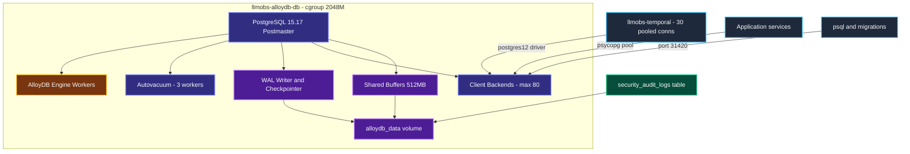
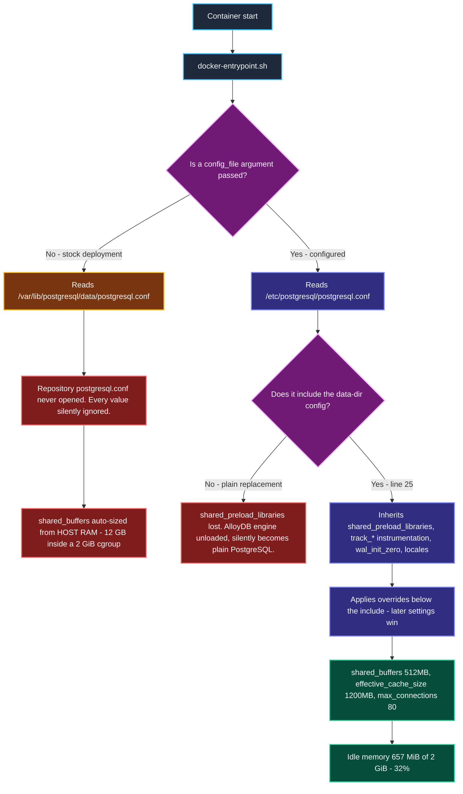
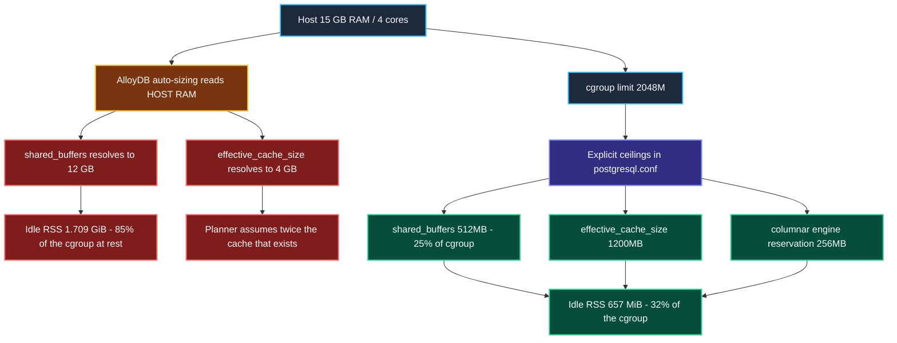
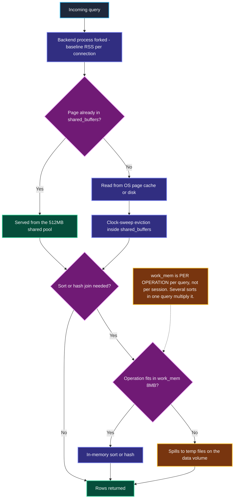
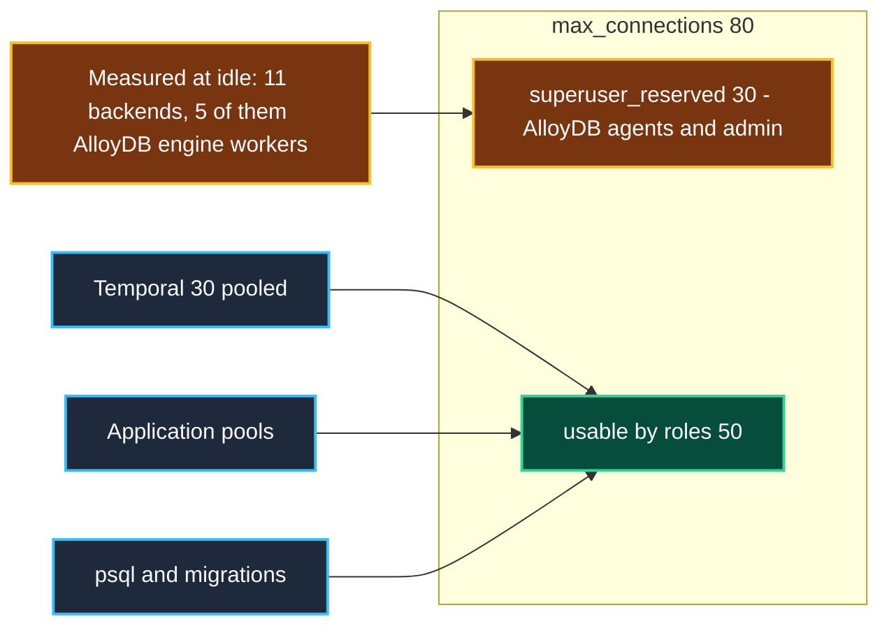
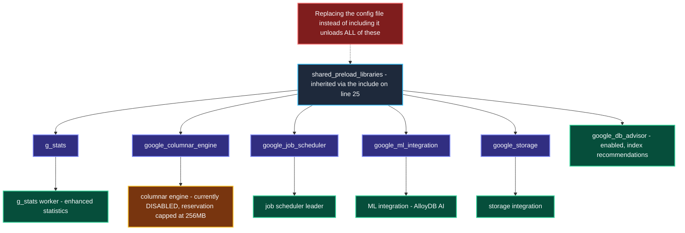
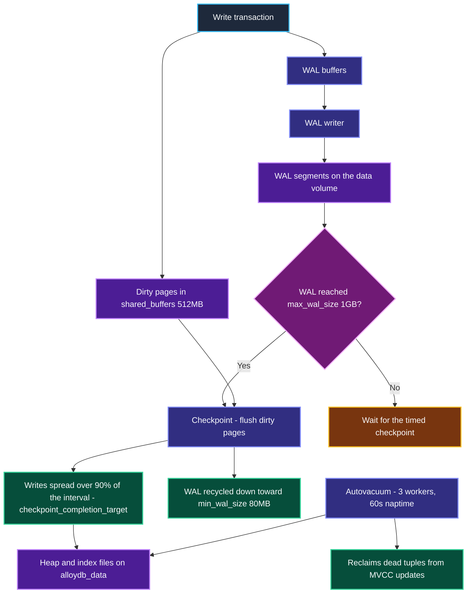
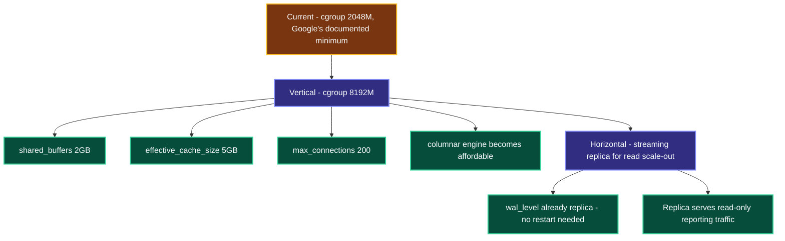

# AlloyDB Omni Comprehensive Architecture, Component Deep-Dive & Operational Guide

> **Validated against AlloyDB Omni 15 (`google/alloydbomni:15`, PostgreSQL 15.17)**, booted under the production `2048M` cgroup. Every **AlloyDB Default** stated in this document is a *measured* value read from `pg_settings` on that image, not a figure quoted from documentation. Several differ dramatically from stock PostgreSQL.
>
> Companion guides: [`clickhouse-configuration-guide.md`](file:///home/btpl-lap-22/live/llm-obs-infra/docs/configDoc/clickhouse-configuration-guide.md) · [`kafka-configuration-guide.md`](file:///home/btpl-lap-22/live/llm-obs-infra/docs/configDoc/kafka-configuration-guide.md)

## 0. How to Read the Diagrams

Every diagram uses one consistent colour language, so a path can be followed by colour alone. Diagrams avoid `<br/>` line breaks, undirected `---` links and `|` characters inside labels, all three of which break GitHub's Mermaid renderer.

| Colour | Meaning | Used for |
|---|---|---|
| 🟦 **Slate / blue** | Input or client | Connecting services, env vars, compose definitions, shipped defaults |
| 🟪 **Indigo** | Processing | Postgres backends, planner, engine extensions |
| 🟣 **Purple** | Storage | Shared buffers, WAL, data volume, audit tables |
| 🟥 **Magenta** | Decision gate | Connection admission, config resolution branches |
| 🟩 **Green** | Safe / configured outcome | The path this configuration produces |
| 🟧 **Amber** | Caution | Works but needs care: reservations, inherited settings, unused features |
| 🟥 **Red** | Failure | OOM kill, config silently ignored, engine unloaded |

The recurring contrast is **red versus green**: red is what the stock image produces inside a 2 GiB cgroup, green is what this configuration produces instead.

---

## 1. Executive Master Parameter Reference Specifications

To avoid scrolling back and forth between sections, this master reference provides an immediate, unified list of every AlloyDB parameter, its definitions, expected environment values, currently configured values, outcomes, trade-offs, and system impacts.

### 1.1 Master Parameter Specifications & Expected Values List

1. **Parameter**: `command: postgres -c config_file=...` and the `postgresql.conf` bind mount
   - **Definition**: The two compose settings that make `config/alloydb/postgresql.conf` the server's actual configuration file.
   - **Expected Values**: Mount at `/etc/postgresql/postgresql.conf:ro` plus `-c config_file=` pointing at it
   - **Currently Configured Value**: Both present (`docker-compose.yml` lines 287-292)
   - **Outcome / System Impact**: PostgreSQL's `config_file` defaults to `/var/lib/postgresql/data/postgresql.conf`, which lives **inside the `alloydb_data` volume**. Without both settings the repository file is never read.
   - **Why & When to Configure It**: **This was the headline defect.** The file existed, was tracked, and was referenced by ADR-0011 and the security documentation, but was mounted nowhere — so every value in it was silently ignored and the container ran stock defaults.
   - **Scaling & Troubleshooting**: Confirm activation with `SHOW config_file` — it must return `/etc/postgresql/postgresql.conf`, not the data-directory path. If it returns the data-directory path, nothing in the repo config is in effect.

---

2. **Parameter**: `include` of the data-directory config
   - **Definition**: First directive in `config/alloydb/postgresql.conf`, pulling in the config AlloyDB Omni generates at initdb time before applying any override.
   - **Expected Values**: `include = '/var/lib/postgresql/data/postgresql.conf'`
   - **Currently Configured Value**: Present (`config/alloydb/postgresql.conf` line 25)
   - **Outcome / System Impact**: Preserves `shared_preload_libraries`, the `track_*` instrumentation family, `wal_init_zero` and the locale settings that AlloyDB writes into the data directory.
   - **Why & When to Configure It**: **The line is load-bearing.** Replacing the config file rather than including it drops `shared_preload_libraries='g_stats,google_columnar_engine,google_job_scheduler,google_ml_integration,google_storage'` and unloads the entire AlloyDB engine — turning AlloyDB Omni into plain PostgreSQL, silently.
   - **Scaling & Troubleshooting**: Verify with `SHOW shared_preload_libraries` after any config change. It must list all five libraries. `SELECT count(*) FROM pg_settings WHERE name LIKE 'google%'` should return **73**.

---

3. **Parameter**: `shared_buffers`
   - **Definition**: Shared memory PostgreSQL reserves for caching data pages, allocated at startup.
   - **Expected Values**: Dev (2 GiB cgroup): `512MB` | Prod (8 GiB): `2GB` | Rule: 25% of the memory actually available to the container
   - **Currently Configured Value**: `512MB` (`config/alloydb/postgresql.conf` line 44)
   - **Outcome / System Impact**: **Measured idle container memory fell from 1.709 GiB (85.4% of the cgroup) to 657 MiB (32%)** once this was set.
   - **Why & When to Configure It**: **The single most important fix in this configuration.** AlloyDB Omni auto-sizes `shared_buffers` from **host RAM, not the cgroup**. On this 15 GB host it resolved to **12 GB inside a 2 GiB container** — six times the container limit. Shared memory is mapped lazily, so the container does not die instantly; it simply runs permanently near the OOM boundary and dies under load.
   - **Scaling & Troubleshooting**: Must track the container limit. Formula: `shared_buffers = cgroup x 0.25`. Verify with `SELECT pg_size_pretty(setting::bigint*8192) FROM pg_settings WHERE name='shared_buffers'`. A value in the multiple-GB range on a 2 GiB container means this file is not being read.

---

4. **Parameter**: `effective_cache_size`
   - **Definition**: Planner hint describing how much OS page cache plus shared buffers the planner should assume is available. Allocates nothing.
   - **Expected Values**: Dev: `1200MB` | Prod (8 GiB): `5GB` | Rule: roughly 60% of memory available to the container
   - **Currently Configured Value**: `1200MB` (`config/alloydb/postgresql.conf` line 55)
   - **Outcome / System Impact**: Inherited value was **4 GB**, also derived from host RAM. The planner would assume twice the cache that actually exists and under-cost index scans that must in fact hit disk.
   - **Why & When to Configure It**: Purely a planner input, but a wrong one produces systematically bad plans. It is the cheapest correctness fix in the file — zero runtime cost.
   - **Scaling & Troubleshooting**: Too high causes the planner to favour index scans that thrash disk; too low pushes it toward sequential scans. Inspect plan choices with `EXPLAIN (ANALYZE, BUFFERS)`.

---

5. **Parameter**: `max_connections`
   - **Definition**: Maximum concurrent client connections, including superuser and reserved slots.
   - **Expected Values**: Dev: `80` | Prod: `200` | Stock AlloyDB default: `100`
   - **Currently Configured Value**: `80` (`config/alloydb/postgresql.conf` line 38)
   - **Outcome / System Impact**: **AlloyDB Omni sets `superuser_reserved_connections = 30`** — PostgreSQL's own default is 3 — so non-superuser roles receive only `max_connections - 30`. At 80 that leaves **50** for application roles.
   - **Why & When to Configure It**: Temporal alone holds 30 pooled connections (20 on the default store plus 10 on visibility, see `config/temporal/temporal.yaml`). At the value ADR-0011 proposed (60) a non-superuser application role would have had exactly 30 available and zero headroom.
   - **Scaling & Troubleshooting**: Raising it costs shared bookkeeping, not per-backend memory, so it is a cheap knob. The expensive coupling is `work_mem`: worst case is `max_connections x work_mem x operations per query`. Check headroom with `SELECT count(*) FROM pg_stat_activity`.

---

6. **Parameter**: `work_mem`
   - **Definition**: Memory allowed per sort, hash join or similar operation — **per operation, per query, not per session**.
   - **Expected Values**: Dev: `8MB` | Prod: `16MB` | PostgreSQL default: `4MB`
   - **Currently Configured Value**: `8MB` (`config/alloydb/postgresql.conf` line 48)
   - **Outcome / System Impact**: A query with several sorts and hash joins allocates a multiple of this value; a heavily parallel query multiplies again per worker.
   - **Why & When to Configure It**: `4MB` spills routine analytical sorts to disk. `8MB` is a modest lift that keeps worst-case exposure bounded at `80 x 8MB` for single-operation queries.
   - **Scaling & Troubleshooting**: Raise per session (`SET work_mem = '64MB'`) for known heavy reporting queries rather than globally. Detect spilling with `log_temp_files` or `EXPLAIN (ANALYZE)` showing `external merge Disk`.

---

7. **Parameter**: `maintenance_work_mem`
   - **Definition**: Memory for maintenance operations: `VACUUM`, `CREATE INDEX`, `ALTER TABLE ADD FOREIGN KEY`.
   - **Expected Values**: Dev: `64MB` | Prod: `256MB` | PostgreSQL default: `64MB`
   - **Currently Configured Value**: `64MB` (`config/alloydb/postgresql.conf` line 50)
   - **Outcome / System Impact**: Matches the stock default; declared so the value is explicit rather than inherited.
   - **Why & When to Configure It**: Only up to `autovacuum_max_workers` (3) instances can be live at once, so the realistic ceiling is 192MB.
   - **Scaling & Troubleshooting**: Raise temporarily in a session before a large index build. Raising it globally multiplies by the autovacuum worker count.

---

8. **Parameter**: `google_columnar_engine.memory_size_in_mb`
   - **Definition**: Memory the AlloyDB columnar engine reserves for its column store.
   - **Expected Values**: Dev (2 GiB cgroup): `256` | Prod (8 GiB): `1024` | AlloyDB default: `1024`
   - **Currently Configured Value**: `256` (`config/alloydb/postgresql.conf` line 62)
   - **Outcome / System Impact**: The engine is currently **off** (`google_columnar_engine.enabled = off`), so nothing is allocated today. The default reservation of `1024` is **half this container** and would be claimed the moment anyone enables it.
   - **Why & When to Configure It**: Same class of defect as `shared_buffers` — a ceiling sized for a managed AlloyDB instance rather than a 2 GiB container. Capping it now means enabling the engine cannot silently blow the cgroup.
   - **Scaling & Troubleshooting**: Enabling the columnar engine on a 2 GiB container is not advisable regardless; it is a feature for analytical workloads with real memory. Check state with `SHOW google_columnar_engine.enabled`.

---

9. **Parameter**: `deploy.resources.limits.memory` & `reservations.memory`
   - **Definition**: Hard Linux kernel `cgroups` memory boundary around the AlloyDB container, plus a soft scheduling reservation.
   - **Expected Values**: Dev: `2048M` limit, `512M` reservation | Prod: `8192M` limit
   - **Currently Configured Value**: Limit `2048M`, reservation `512M` (`docker-compose.yml` lines 273, 275)
   - **Outcome / System Impact**: Google documents **2 GB as the hard minimum** for AlloyDB Omni; the container will not start reliably below it. This is therefore a floor, not a tuned value.
   - **Why & When to Configure It**: Every memory value in this guide is derived from `2048M`. Changing it means revisiting `shared_buffers`, `effective_cache_size` and the columnar reservation together.
   - **Scaling & Troubleshooting**: AlloyDB Omni has **no headroom at this size** for the Columnar Engine or AlloyDB AI, which Google sizes at 8 GB per vCPU. Monitor with `docker stats` and `dmesg | grep -i oom`.

---

10. **Parameter**: `security-audit.sql` mounted into `/docker-entrypoint-initdb.d/`
    - **Definition**: Bootstrap SQL creating the `security_audit_logs` table and its indexes on first initialisation.
    - **Expected Values**: Mounted as `10-security-audit.sql:ro`
    - **Currently Configured Value**: Mounted (`docker-compose.yml` line 293)
    - **Outcome / System Impact**: **Verified:** `to_regclass('public.security_audit_logs')` now resolves after a fresh boot. Previously the table existed in no deployed database.
    - **Why & When to Configure It**: The file was tracked and referenced by compliance documentation, but mounted nowhere, so every write to it failed — silenced by `|| true` in `gdpr-erasure.sh`. Security audit finding **H-01**.
    - **Scaling & Troubleshooting**: `/docker-entrypoint-initdb.d/` runs **only when the data directory is empty**. On an existing `alloydb_data` volume the table must be created manually — see §9.4.

---

11. **Parameter**: `listen_addresses` & `port`
    - **Definition**: Interface and TCP port the server binds.
    - **Expected Values**: Containerised: `'*'` and `5432`
    - **Currently Configured Value**: `'*'` and `5432` (`config/alloydb/postgresql.conf` lines 28-29)
    - **Outcome / System Impact**: Binds all interfaces inside the container network namespace so Temporal and application services on `llmobs-network` can connect.
    - **Why & When to Configure It**: Matches the inherited value; declared for explicitness alongside the compose port publication.
    - **Scaling & Troubleshooting**: Actual exposure is governed by the compose port map and `pg_hba.conf`, not by this directive.

---

12. **Parameter**: `wal_level`, `max_wal_size`, `min_wal_size`, `checkpoint_completion_target`
    - **Definition**: Write-ahead log verbosity, the WAL size that triggers a checkpoint, the floor WAL is shrunk to, and how much of the checkpoint interval is used to spread writes.
    - **Expected Values**: `replica` / `1GB` / `80MB` / `0.9`
    - **Currently Configured Value**: exactly those (`config/alloydb/postgresql.conf` lines 65-68)
    - **Outcome / System Impact**: `replica` keeps physical replication and PITR possible without the overhead of `logical`. `0.9` spreads checkpoint I/O across 90% of the interval, avoiding write spikes on a shared disk.
    - **Why & When to Configure It**: `max_wal_size` bounds WAL growth on a host at 72% disk usage. These match the inherited values and are declared so WAL behaviour is explicit rather than accidental.
    - **Scaling & Troubleshooting**: Frequent `checkpoints are occurring too frequently` warnings in the log mean `max_wal_size` is too small. Raising it trades disk for fewer checkpoints.

---

13. **Parameter**: `random_page_cost` & `effective_io_concurrency`
    - **Definition**: Planner cost of a non-sequential page fetch relative to a sequential one, and how many concurrent I/O requests the storage can service.
    - **Expected Values**: SSD: `1.1` and `200` | Spinning disk: `4.0` and `2` | Inherited AlloyDB values: `4` and `128`
    - **Currently Configured Value**: `1.1` and `200` (`config/alloydb/postgresql.conf` lines 72-73)
    - **Outcome / System Impact**: Tells the planner that random reads on this SSD-backed host cost nearly the same as sequential ones, so index scans are correctly preferred.
    - **Why & When to Configure It**: The inherited `random_page_cost = 4` is a spinning-disk assumption and systematically pushes the planner toward sequential scans on SSD.
    - **Scaling & Troubleshooting**: Both are planner inputs and allocate nothing. Validate with `EXPLAIN (ANALYZE, BUFFERS)` on a representative query before and after.

---

14. **Parameter**: `superuser_reserved_connections`
    - **Definition**: Connection slots held back for superusers so an administrator can always get in.
    - **Expected Values**: PostgreSQL default: `3` | AlloyDB Omni default: `30`
    - **Currently Configured Value**: *Not overridden* — inherits `30`
    - **Outcome / System Impact**: Consumes 30 of the 80 configured slots. **Verified:** only 11 backends exist at idle, of which 5 are AlloyDB engine workers.
    - **Why & When to Configure It**: Left at the vendor default deliberately. AlloyDB reserves generously for its own agents, and fighting that without knowing which agents need it risks starving the engine. `max_connections` was raised instead.
    - **Scaling & Troubleshooting**: The application currently connects as `admin`, which **is** a superuser, so it can draw on the reserved pool and the reservation is invisible. De-privileging the app role — which security hardening should do — makes the 30-slot reservation immediately real.

---

15. **Parameter**: `POSTGRES_USER`, `POSTGRES_PASSWORD`, `POSTGRES_DB`
    - **Definition**: Standard PostgreSQL image bootstrap variables creating the superuser role and initial database.
    - **Expected Values**: `admin` / a strong secret / `llm_observability`
    - **Currently Configured Value**: those three (`docker-compose.yml` lines 279-281)
    - **Outcome / System Impact**: **Verified:** `admin` is created as a **superuser** (`pg_user.usesuper = true`), alongside AlloyDB's internal `alloydbadmin` (superuser) and `alloydbmetadata` (not superuser).
    - **Why & When to Configure It**: They drive the first-boot `initdb` and are what `/docker-entrypoint-initdb.d/` scripts run against.
    - **Scaling & Troubleshooting**: The duplicate `ALLOYDB_USER` / `ALLOYDB_PASSWORD` / `ALLOYDB_DB` variables alongside them are **not read by this image** — they are stack convention. Only the `POSTGRES_*` triple has any effect.

---

16. **Parameter**: `healthcheck`
    - **Definition**: Container liveness probe using `pg_isready`.
    - **Expected Values**: interval `5s`, timeout `5s`, retries `15`, `start_period 20s`
    - **Currently Configured Value**: those (`docker-compose.yml` lines 297-302)
    - **Outcome / System Impact**: `start_period: 20s` covers first-boot `initdb`, which is much slower than a restart. Measured: fresh init reaches ready in ~6-7s, restart in ~2s.
    - **Why & When to Configure It**: `pg_isready` checks the postmaster accepts connections without running a query, so it is cheap at a 5s interval.
    - **Scaling & Troubleshooting**: The probe ends in `|| exit 0`, so it **can never report unhealthy** — it always exits zero. That is a real defect, tracked as security audit **H-02**, and is deliberately left to that track rather than changed here.

---

17. **Parameter**: `logging: *audit-logging`
    - **Definition**: Docker log driver for this container, using the stricter audit anchor rather than the default one.
    - **Expected Values**: `100m` x `10` (current) or `20m` x `5` (ADR-0011 proposal)
    - **Currently Configured Value**: the `x-audit-logging` anchor (`docker-compose.yml` line 269)
    - **Outcome / System Impact**: Up to **1 GB** of container log for AlloyDB alone — the largest single log allocation in the stack.
    - **Why & When to Configure It**: AlloyDB is the audit-relevant datastore, so its stdout is retained longer than other services'.
    - **Scaling & Troubleshooting**: This bounds **stdout only**. PostgreSQL's own logging is off by default here — `log_statement = none`, `log_min_duration_statement = -1`, `log_connections = off` — so there is no in-container log file growing beside it.

---

18. **Parameter**: `ssl` and PostgreSQL statement logging
    - **Definition**: In-transit encryption, and the `log_connections` / `log_disconnections` / `log_statement` / `log_min_duration_statement` family.
    - **Expected Values**: Hardened: `ssl = on`, `log_connections = on`, `log_min_duration_statement = 1000`
    - **Currently Configured Value**: **Not set** — inherits `ssl = off`, `log_connections = off`, `log_statement = none`, `log_min_duration_statement = -1`
    - **Outcome / System Impact**: No TLS between services, and no record of who connected or what ran. **Verified:** `pg_hba.conf` does require `scram-sha-256` for all non-loopback connections, and `password_encryption` is `scram-sha-256`, so credentials are not sent in clear.
    - **Why & When to Configure It**: Deliberately **out of scope here**. These are authentication and audit controls, not resource configuration, and belong with security audit **H-01**.
    - **Scaling & Troubleshooting**: Enabling `log_min_duration_statement` is the cheapest observability win available and pairs naturally with this platform's purpose; enabling `ssl` requires certificate provisioning that Traefik currently handles at the edge.

---
## 2. System-Wide AlloyDB High-Level (HLD) & Low-Level (LLD) Design

### 2.1 System Integration Configuration & Python Code

```yaml
llmobs-alloydb:
  image: google/alloydbomni:15
  container_name: llmobs-alloydb-db
  restart: unless-stopped
  logging: *audit-logging
  deploy:
    resources:
      limits:
        memory: 2048M
      reservations:
        memory: 512M
  ports:
    - "31420:5432"
  environment:
    - POSTGRES_USER=admin
    - POSTGRES_PASSWORD=password
    - POSTGRES_DB=llm_observability
  command:
    - "postgres"
    - "-c"
    - "config_file=/etc/postgresql/postgresql.conf"
  volumes:
    - ./config/alloydb/postgresql.conf:/etc/postgresql/postgresql.conf:ro
    - ./config/alloydb/security-audit.sql:/docker-entrypoint-initdb.d/10-security-audit.sql:ro
    - alloydb_data:/var/lib/postgresql/data
  healthcheck:
    test: ["CMD-SHELL", "pg_isready -h 127.0.0.1 -U admin -d llm_observability || exit 0"]
    interval: 5s
    start_period: 20s
```

```python
import psycopg2

conn = psycopg2.connect(
    host='localhost', port=31420, user='admin',
    password='password', dbname='llm_observability',
)
cur = conn.cursor()

cur.execute("SHOW config_file")
config_file = cur.fetchone()[0]
assert config_file == '/etc/postgresql/postgresql.conf', (
    f'repo config is NOT active, server is reading {config_file}')

cur.execute("SHOW shared_preload_libraries")
libs = cur.fetchone()[0]
for required in ('g_stats', 'google_columnar_engine', 'google_job_scheduler',
                 'google_ml_integration', 'google_storage'):
    assert required in libs, f'AlloyDB engine library {required} was unloaded'

CGROUP_BYTES = 2048 * 1024 ** 2
cur.execute("""
    SELECT name, setting::bigint * 8192
    FROM pg_settings
    WHERE name IN ('shared_buffers', 'effective_cache_size')
""")
for name, value_bytes in cur.fetchall():
    share = value_bytes / CGROUP_BYTES
    flag = 'OK' if share < 1 else 'EXCEEDS CGROUP'
    print(f'{name:22s} {value_bytes / 2**20:8.0f} MiB  {share:6.1%} of cgroup  {flag}')

cur.execute("SELECT count(*) FROM pg_settings WHERE name LIKE 'google%'")
print('google_* GUCs loaded:', cur.fetchone()[0])
```

---

### 2.2 System High-Level Design (HLD) — Transactional Store Architecture

AlloyDB Omni is the transactional store for the platform. It backs Temporal's workflow state and the application's operational tables, inside a `2048M` cgroup on a 15 GB / 4-core host shared with nine other services.



---

### 2.3 System Low-Level Design (LLD) — Configuration Resolution Order

This is the mechanism the headline fix operates on. PostgreSQL resolves its configuration in a strict order, and the stock deployment never reached the repository file at all.



> **Two independent failure modes, both silent.** Not mounting the file leaves the container on host-derived defaults. Mounting it *without* the `include` unloads the AlloyDB engine and leaves you running plain PostgreSQL under an AlloyDB image name. Neither produces an error; both are only visible by querying `pg_settings`.

---

## 3. Memory Architecture Deep-Dive

### 3.1 Memory Configuration & Python Inspection Code

```ini
include = '/var/lib/postgresql/data/postgresql.conf'

shared_buffers = 512MB
work_mem = 8MB
maintenance_work_mem = 64MB
effective_cache_size = 1200MB
google_columnar_engine.memory_size_in_mb = 256
```

```python
import psycopg2

conn = psycopg2.connect(host='localhost', port=31420, user='admin',
                        password='password', dbname='llm_observability')
cur = conn.cursor()

CGROUP = 2048 * 1024 ** 2

cur.execute("SELECT setting::bigint * 8192 FROM pg_settings WHERE name = 'shared_buffers'")
shared_buffers = cur.fetchone()[0]

cur.execute("SELECT setting::bigint * 1024 FROM pg_settings WHERE name = 'work_mem'")
work_mem = cur.fetchone()[0]

cur.execute("SELECT setting::int FROM pg_settings WHERE name = 'max_connections'")
max_conns = cur.fetchone()[0]

assert shared_buffers < CGROUP, 'shared_buffers exceeds the container limit'

worst_case = shared_buffers + max_conns * work_mem
print(f'shared_buffers      {shared_buffers / 2**20:7.0f} MiB')
print(f'work_mem x conns    {max_conns * work_mem / 2**20:7.0f} MiB  ({max_conns} x {work_mem / 2**20:.0f} MiB)')
print(f'worst case          {worst_case / 2**20:7.0f} MiB of {CGROUP / 2**20:.0f} MiB cgroup')

cur.execute("""
    SELECT current_setting('max_connections')::int
         - current_setting('superuser_reserved_connections')::int
""")
print('slots available to non-superuser roles:', cur.fetchone()[0])
```

---

### 3.2 Memory High-Level Design (HLD)

AlloyDB Omni sizes itself from the machine it can see. Inside a cgroup it sees the **host**, so two of its ceilings land far outside the container before a single query runs.



---

### 3.3 Memory Low-Level Design (LLD) — Where a Query's Memory Comes From



---

### 3.4 Memory Detailed Configuration Breakdown

1. **Parameter**: `shared_buffers`
   - **Definition**: Shared memory reserved at startup for caching data pages.
   - **Expected Values**: Dev: `512MB` | Prod (8 GiB): `2GB`
   - **Currently Configured Value**: `512MB` (`config/alloydb/postgresql.conf` line 44)
   - **Outcome / System Impact**: Measured idle memory fell from **1.709 GiB (85.4%)** to **657 MiB (32%)** of the cgroup.
   - **Why & When to Configure It**: AlloyDB auto-sized this to **12 GB from host RAM** inside a 2 GiB container.
   - **Scaling & Troubleshooting**: Formula `cgroup x 0.25`. A multi-GB value on a 2 GiB container proves the config file is not being read.

---

2. **Parameter**: `effective_cache_size`
   - **Definition**: Planner estimate of total cache available. Allocates nothing.
   - **Expected Values**: Dev: `1200MB` | Prod: `5GB`
   - **Currently Configured Value**: `1200MB` (`config/alloydb/postgresql.conf` line 55)
   - **Outcome / System Impact**: Replaces an inherited 4 GB estimate that assumed host RAM.
   - **Why & When to Configure It**: An over-large value makes the planner under-cost index scans that must hit disk.
   - **Scaling & Troubleshooting**: Pure planner input; validate with `EXPLAIN (ANALYZE, BUFFERS)`.

---

3. **Parameter**: `work_mem`
   - **Definition**: Memory per sort or hash operation, per query.
   - **Expected Values**: Dev: `8MB` | Prod: `16MB` | PostgreSQL default: `4MB`
   - **Currently Configured Value**: `8MB` (`config/alloydb/postgresql.conf` line 48)
   - **Outcome / System Impact**: Worst case `80 x 8MB` for single-operation queries; realistically far lower.
   - **Why & When to Configure It**: `4MB` spills routine analytical sorts to disk unnecessarily.
   - **Scaling & Troubleshooting**: Raise per session for heavy reports rather than globally; it multiplies by connections **and** by operations within a query.

---

4. **Parameter**: `google_columnar_engine.memory_size_in_mb`
   - **Definition**: Reservation for the AlloyDB columnar column store.
   - **Expected Values**: Dev: `256` | Prod: `1024` | AlloyDB default: `1024`
   - **Currently Configured Value**: `256` (`config/alloydb/postgresql.conf` line 62)
   - **Outcome / System Impact**: Nothing allocated today because the engine is off; caps the exposure if it is ever enabled.
   - **Why & When to Configure It**: The default reservation is half this container — the same class of defect as `shared_buffers`.
   - **Scaling & Troubleshooting**: Enabling the columnar engine at 2 GiB is inadvisable; Google sizes AlloyDB AI features at 8 GB per vCPU.

---
## 4. Connection & Session Architecture

### 4.1 Connection Configuration & Python Pool Code

```ini
max_connections = 80
# superuser_reserved_connections = 30 is inherited from AlloyDB Omni
```

```python
import psycopg2
from psycopg2 import pool

conn = psycopg2.connect(host='localhost', port=31420, user='admin',
                        password='password', dbname='llm_observability')
cur = conn.cursor()

cur.execute("""
    SELECT current_setting('max_connections')::int,
           current_setting('superuser_reserved_connections')::int
""")
max_conns, reserved = cur.fetchone()
usable = max_conns - reserved
print(f'max_connections {max_conns}, reserved {reserved}, usable by app roles {usable}')

TEMPORAL_POOLED = 30
assert usable > TEMPORAL_POOLED, 'no headroom left once Temporal takes its pool'

cur.execute("""
    SELECT coalesce(backend_type, 'unknown'), count(*)
    FROM pg_stat_activity GROUP BY 1 ORDER BY 2 DESC
""")
for backend_type, count in cur.fetchall():
    print(f'{count:3d}  {backend_type}')

app_pool = pool.ThreadedConnectionPool(
    minconn=2,
    maxconn=min(20, usable - TEMPORAL_POOLED),
    host='localhost', port=31420, user='admin',
    password='password', dbname='llm_observability',
)
```

---

### 4.2 Connection High-Level Design (HLD)



> **The reservation is the trap.** PostgreSQL reserves 3 slots for superusers by default; AlloyDB Omni reserves **30**. It is invisible today only because the application connects as `admin`, which is a superuser and may draw on the reserved pool. The moment security hardening gives the application a non-superuser role — which it should — the effective budget drops by 30 with no other change. ADR-0011's proposed `max_connections = 60` would have left exactly 30 usable against Temporal's 30.

---

### 4.3 Connection Detailed Configuration Breakdown

1. **Parameter**: `max_connections`
   - **Definition**: Total concurrent connection slots, inclusive of reserved ones.
   - **Expected Values**: Dev: `80` | Prod: `200` | AlloyDB default: `100`
   - **Currently Configured Value**: `80` (`config/alloydb/postgresql.conf` line 38)
   - **Outcome / System Impact**: 50 slots for non-superuser roles after AlloyDB's 30-slot reservation.
   - **Why & When to Configure It**: Must exceed Temporal's 30 pooled connections plus application pools with real headroom.
   - **Scaling & Troubleshooting**: Cheap to raise (shared bookkeeping only); the expensive coupling is `work_mem`. `FATAL: sorry, too many clients already` means this is exhausted; `FATAL: remaining connection slots are reserved` means a non-superuser hit the reservation wall.

---

2. **Parameter**: `superuser_reserved_connections`
   - **Definition**: Slots withheld from non-superuser roles.
   - **Expected Values**: PostgreSQL default `3` | AlloyDB Omni default `30`
   - **Currently Configured Value**: *Not overridden* — inherits `30`
   - **Outcome / System Impact**: Consumes 30 of 80 slots. Measured idle usage is 11 backends total.
   - **Why & When to Configure It**: Left at the vendor default deliberately; AlloyDB reserves for its own agents and lowering it blindly risks starving them.
   - **Scaling & Troubleshooting**: If connection pressure appears while `pg_stat_activity` shows few backends, this reservation is the cause. Raise `max_connections` rather than cutting the reservation.

---

## 5. AlloyDB Engine Extensions

### 5.1 Engine Inspection Python Code

```python
import psycopg2

conn = psycopg2.connect(host='localhost', port=31420, user='admin',
                        password='password', dbname='llm_observability')
cur = conn.cursor()

cur.execute("SHOW shared_preload_libraries")
loaded = [lib.strip() for lib in cur.fetchone()[0].split(',')]
print('preloaded engine libraries:', loaded)

cur.execute("""
    SELECT name, setting
    FROM pg_settings
    WHERE name IN ('google_columnar_engine.enabled',
                   'google_columnar_engine.memory_size_in_mb',
                   'google_columnar_engine.enable_auto_columnarization',
                   'google_db_advisor.enabled')
    ORDER BY name
""")
for name, setting in cur.fetchall():
    print(f'{name:52s} {setting}')

cur.execute("""
    SELECT backend_type, count(*)
    FROM pg_stat_activity
    WHERE backend_type NOT IN ('client backend', 'autovacuum launcher',
                               'background writer', 'checkpointer', 'walwriter')
    GROUP BY 1 ORDER BY 1
""")
print('AlloyDB engine background workers:')
for backend_type, count in cur.fetchall():
    print(f'  {count}  {backend_type}')
```

---

### 5.2 Engine High-Level Design (HLD)



---

### 5.3 Engine Detailed Configuration Breakdown

1. **Parameter**: `shared_preload_libraries`
   - **Definition**: Libraries loaded into the postmaster at startup; the AlloyDB engine itself.
   - **Expected Values**: `g_stats,google_columnar_engine,google_job_scheduler,google_ml_integration,google_storage`
   - **Currently Configured Value**: Inherited via the `include` (`config/alloydb/postgresql.conf` line 25)
   - **Outcome / System Impact**: **Verified** present after the config change, with **73** `google_*` GUCs registered.
   - **Why & When to Configure It**: Never set this directly here — it is generated into the data-directory config at initdb time and inherited. Setting it manually risks drifting from what the image expects.
   - **Scaling & Troubleshooting**: `SHOW shared_preload_libraries` is the single fastest check that a config change did not silently downgrade AlloyDB to plain PostgreSQL. Requires a restart to change.

---

2. **Parameter**: `google_columnar_engine.enabled`
   - **Definition**: Whether the columnar column store is active.
   - **Expected Values**: 2 GiB container: `off` | Analytical deployments with 8 GB+: `on`
   - **Currently Configured Value**: *Not overridden* — inherits `off`
   - **Outcome / System Impact**: No column store is built, and the 256MB reservation is not claimed.
   - **Why & When to Configure It**: Analytical scan acceleration lives in ClickHouse in this architecture, so the columnar engine is redundant here as well as unaffordable.
   - **Scaling & Troubleshooting**: Enabling it on a 2 GiB container will claim the reservation immediately and compete directly with `shared_buffers`.

---

3. **Parameter**: `google_db_advisor.enabled`
   - **Definition**: AlloyDB's index and query advisor.
   - **Expected Values**: `on`
   - **Currently Configured Value**: *Not overridden* — inherits `on`
   - **Outcome / System Impact**: Collects workload statistics and surfaces index recommendations at negligible cost.
   - **Why & When to Configure It**: Useful and cheap; left enabled.
   - **Scaling & Troubleshooting**: Its recommendations are advisory only and never applied automatically.

---
## 6. WAL, Checkpoints, Autovacuum & Physical Storage

### 6.1 Storage Configuration & Python Maintenance Code

```ini
wal_level = replica
max_wal_size = 1GB
min_wal_size = 80MB
checkpoint_completion_target = 0.9
random_page_cost = 1.1
effective_io_concurrency = 200
```

```python
import psycopg2

conn = psycopg2.connect(host='localhost', port=31420, user='admin',
                        password='password', dbname='llm_observability')
cur = conn.cursor()

cur.execute("SELECT pg_size_pretty(pg_database_size(current_database()))")
print('database size:', cur.fetchone()[0])

cur.execute("""
    SELECT checkpoints_timed, checkpoints_req,
           round(checkpoint_write_time / 1000.0) AS write_seconds
    FROM pg_stat_bgwriter
""")
timed, requested, write_seconds = cur.fetchone()
print(f'checkpoints timed {timed}, requested {requested}, write {write_seconds}s')
if requested > timed:
    print('WARNING: more requested than timed checkpoints - raise max_wal_size')

cur.execute("""
    SELECT relname,
           n_dead_tup,
           n_live_tup,
           last_autovacuum
    FROM pg_stat_user_tables
    WHERE n_dead_tup > 0
    ORDER BY n_dead_tup DESC
    LIMIT 10
""")
print('bloat candidates:')
for relname, dead, live, last_vac in cur.fetchall():
    print(f'  {relname:32s} dead={dead:<8} live={live:<8} last_autovacuum={last_vac}')

cur.execute("""
    SELECT relname, pg_size_pretty(pg_total_relation_size(relid)) AS total
    FROM pg_catalog.pg_statio_user_tables
    ORDER BY pg_total_relation_size(relid) DESC LIMIT 10
""")
print('largest tables:')
for relname, total in cur.fetchall():
    print(f'  {relname:32s} {total}')
```

---

### 6.2 Storage High-Level Design (HLD)



---

### 6.3 Storage Detailed Configuration Breakdown

1. **Parameter**: `wal_level`
   - **Definition**: How much information is written to the write-ahead log.
   - **Expected Values**: `replica` (physical replication and PITR) | `logical` (CDC) | `minimal` (no replication)
   - **Currently Configured Value**: `replica` (`config/alloydb/postgresql.conf` line 65)
   - **Outcome / System Impact**: Keeps physical replication and point-in-time recovery possible without the extra WAL volume `logical` produces.
   - **Why & When to Configure It**: Raise to `logical` only if change-data-capture into Kafka or ClickHouse is ever added; it materially increases WAL volume on a disk-constrained host.
   - **Scaling & Troubleshooting**: Changing it requires a restart. `minimal` would break any future replica and is not worth the small saving.

---

2. **Parameter**: `max_wal_size` & `min_wal_size`
   - **Definition**: WAL accumulation that triggers a checkpoint, and the floor WAL is recycled down to.
   - **Expected Values**: Dev: `1GB` / `80MB` | Write-heavy prod: `4GB` / `512MB`
   - **Currently Configured Value**: `1GB` and `80MB` (`config/alloydb/postgresql.conf` lines 66-67)
   - **Outcome / System Impact**: Bounds WAL growth on a host already at 72% disk usage.
   - **Why & When to Configure It**: Too small forces frequent requested checkpoints, which produce write spikes and I/O contention with the nine other services.
   - **Scaling & Troubleshooting**: If the log shows `checkpoints are occurring too frequently`, or `pg_stat_bgwriter.checkpoints_req` exceeds `checkpoints_timed`, raise `max_wal_size`. The cost is disk.

---

3. **Parameter**: `checkpoint_completion_target`
   - **Definition**: Fraction of the checkpoint interval over which dirty-page writes are spread.
   - **Expected Values**: `0.9` (modern default and recommendation)
   - **Currently Configured Value**: `0.9` (`config/alloydb/postgresql.conf` line 68)
   - **Outcome / System Impact**: Smooths checkpoint I/O instead of issuing a burst, which matters on shared storage.
   - **Why & When to Configure It**: Lower values concentrate writes and cause latency spikes visible to every other container on the same disk.
   - **Scaling & Troubleshooting**: Leave at `0.9`. Values above `0.9` risk the next checkpoint starting before the previous finished.

---

4. **Parameter**: `random_page_cost` & `effective_io_concurrency`
   - **Definition**: Planner cost of a random page fetch relative to sequential, and the number of concurrent I/O requests the storage can service.
   - **Expected Values**: SSD: `1.1` / `200` | Spinning disk: `4.0` / `2` | Inherited AlloyDB values: `4` / `128`
   - **Currently Configured Value**: `1.1` and `200` (`config/alloydb/postgresql.conf` lines 72-73)
   - **Outcome / System Impact**: The inherited `4` is a spinning-disk assumption and systematically discourages index scans on SSD.
   - **Why & When to Configure It**: Both allocate nothing; they only change plan selection. This is the cheapest performance correction in the file.
   - **Scaling & Troubleshooting**: Revert to `4` only if this ever runs on rotational storage. Validate with `EXPLAIN (ANALYZE, BUFFERS)` before and after.

---

5. **Parameter**: `autovacuum`, `autovacuum_max_workers`, `autovacuum_naptime`
   - **Definition**: The background process reclaiming dead tuples produced by PostgreSQL's MVCC updates and deletes.
   - **Expected Values**: `on` / `3` / `60s` (defaults)
   - **Currently Configured Value**: *Not overridden* — inherits `on`, `3`, `60s`
   - **Outcome / System Impact**: Each worker may use up to `maintenance_work_mem` (64MB), so the realistic ceiling is 192MB.
   - **Why & When to Configure It**: Left at defaults deliberately. Temporal's workflow tables are update-heavy and depend on healthy autovacuum; disabling or starving it causes unbounded table bloat.
   - **Scaling & Troubleshooting**: Watch `pg_stat_user_tables.n_dead_tup`. Growing dead tuples with an old `last_autovacuum` means the workers cannot keep up — raise `autovacuum_max_workers` before touching anything else, and remember it multiplies `maintenance_work_mem`.

---
## 7. Native AlloyDB Emergency CLI Commands & Incident Runbooks

### 7.1 Standard Verification Block

```bash
# Is the repository config actually in effect? Must NOT be the data-dir path.
docker exec llmobs-alloydb-db psql -U admin -d llm_observability -tAc "SHOW config_file"

# Did the AlloyDB engine survive the config change? Must list all five libraries.
docker exec llmobs-alloydb-db psql -U admin -d llm_observability -tAc "SHOW shared_preload_libraries"
docker exec llmobs-alloydb-db psql -U admin -d llm_observability -tAc \
  "SELECT count(*) FROM pg_settings WHERE name LIKE 'google%'"

# Are the memory ceilings inside the cgroup?
docker exec llmobs-alloydb-db psql -U admin -d llm_observability -c \
  "SELECT name, setting, unit FROM pg_settings
   WHERE name IN ('shared_buffers','effective_cache_size','work_mem',
                  'maintenance_work_mem','max_connections',
                  'google_columnar_engine.memory_size_in_mb') ORDER BY name"

# Audit schema present?
docker exec llmobs-alloydb-db psql -U admin -d llm_observability -tAc \
  "SELECT to_regclass('public.security_audit_logs')"

# Actual container footprint against the 2048M limit
docker stats --no-stream llmobs-alloydb-db
```

Expected: `config_file=/etc/postgresql/postgresql.conf`, all five preload libraries, **73** `google_*` GUCs, `shared_buffers=65536` (8kB units, 512MB), `max_connections=80`, a non-null audit table, and roughly **650-780 MiB** of the 2 GiB limit at idle.

---

### 7.2 Emergency Incident 1: Container OOM-Killed (Exit 137)

```bash
docker inspect llmobs-alloydb-db --format '{{.State.ExitCode}} OOMKilled={{.State.OOMKilled}}'
dmesg | grep -i -A3 'killed process.*postgres'

docker exec llmobs-alloydb-db psql -U admin -d llm_observability -tAc \
  "SELECT pg_size_pretty(setting::bigint*8192) FROM pg_settings WHERE name='shared_buffers'"

docker exec llmobs-alloydb-db psql -U admin -d llm_observability -c \
  "SELECT pid, usename, state, wait_event_type,
          pg_size_pretty(pg_total_relation_size(0)) AS ignore, query
   FROM pg_stat_activity WHERE state <> 'idle' ORDER BY query_start LIMIT 10"
```

**Resolution order:** first confirm `SHOW config_file` returns the mounted path. If it returns the data-directory path the container is running host-derived defaults and `shared_buffers` will be in the multi-GB range — that is the cause, and the fix is the mount plus `-c config_file=`, not more RAM. Only if the config *is* active should you lower `shared_buffers` further or raise the cgroup.

---

### 7.3 Emergency Incident 2: Connection Exhaustion

```bash
docker exec llmobs-alloydb-db psql -U admin -d llm_observability -c \
  "SELECT usename, application_name, state, count(*)
   FROM pg_stat_activity GROUP BY 1,2,3 ORDER BY 4 DESC"

docker exec llmobs-alloydb-db psql -U admin -d llm_observability -tAc \
  "SELECT 'used '||count(*)||' of '||current_setting('max_connections')
        ||' (reserved '||current_setting('superuser_reserved_connections')||')'
   FROM pg_stat_activity"

# Reclaim connections leaked by a crashed client
docker exec llmobs-alloydb-db psql -U admin -d llm_observability -c \
  "SELECT pg_terminate_backend(pid) FROM pg_stat_activity
   WHERE state = 'idle' AND state_change < now() - interval '1 hour'"
```

**Resolution order:** `FATAL: sorry, too many clients already` means `max_connections` is exhausted. `FATAL: remaining connection slots are reserved for non-replication superuser connections` means a **non-superuser** role hit AlloyDB's 30-slot reservation while superuser slots remained — raise `max_connections`, do not cut the reservation.

---

### 7.4 Emergency Incident 3: Audit Table Missing on an Existing Volume

`/docker-entrypoint-initdb.d/` runs **only when the data directory is empty**. On a volume created before the mount existed, the table must be created by hand:

```bash
docker exec -i llmobs-alloydb-db psql -U admin -d llm_observability \
  < config/alloydb/security-audit.sql

docker exec llmobs-alloydb-db psql -U admin -d llm_observability -tAc \
  "SELECT to_regclass('public.security_audit_logs')"
```

The script is written with `CREATE TABLE IF NOT EXISTS` and `CREATE INDEX IF NOT EXISTS`, so running it against an already-initialised database is safe and idempotent.

---

### 7.5 Emergency Incident 4: Disk Pressure or Table Bloat

```bash
df -h /
docker exec llmobs-alloydb-db psql -U admin -d llm_observability -c \
  "SELECT relname, pg_size_pretty(pg_total_relation_size(relid)) AS total, n_dead_tup
   FROM pg_stat_user_tables ORDER BY pg_total_relation_size(relid) DESC LIMIT 15"

docker exec llmobs-alloydb-db psql -U admin -d llm_observability -c \
  "SELECT pg_size_pretty(sum(size)) AS wal_bytes FROM pg_ls_waldir()"

# Reclaim space from a bloated table without an exclusive lock
docker exec llmobs-alloydb-db psql -U admin -d llm_observability -c \
  "VACUUM (ANALYZE, VERBOSE) public.some_table"
```

**Resolution order:** growing `n_dead_tup` with an old `last_autovacuum` means autovacuum cannot keep up — raise `autovacuum_max_workers`, remembering each worker may take `maintenance_work_mem`. Do **not** reach for `VACUUM FULL` on a live system; it takes an `ACCESS EXCLUSIVE` lock and rewrites the table.

---

### 7.6 Symptom → Lever Reference

| Symptom | Change | Do Not |
|---|---|---|
| `Exit 137` / OOM-killed | First check `SHOW config_file`; if unmounted, fix the mount | Add RAM before confirming the config is even being read |
| `shared_buffers` shows multiple GB | The config file is not active — restore mount and `-c config_file=` | Edit the data-directory config inside the volume |
| `SHOW shared_preload_libraries` is empty or short | The config replaced instead of included the data-dir file | Set `shared_preload_libraries` by hand to paper over it |
| `sorry, too many clients already` | Raise `max_connections` | Raise `work_mem` at the same time — they multiply |
| `remaining connection slots are reserved` | Raise `max_connections` | Cut `superuser_reserved_connections` blindly |
| Sorts spilling to disk | Raise `work_mem` per session | Raise it globally — it multiplies by connections and operations |
| `checkpoints are occurring too frequently` | Raise `max_wal_size` | Lower `checkpoint_completion_target` |
| Table bloat, dead tuples climbing | Raise `autovacuum_max_workers` | Disable autovacuum |
| `security_audit_logs does not exist` | Apply the SQL manually — §7.4 | Assume the initdb.d mount fixed an existing volume |

---

### 7.7 Validated Gotchas

| # | Gotcha | Consequence | Handling |
|---|---|---|---|
| 1 | **`config_file` defaults inside the data volume.** PostgreSQL reads `/var/lib/postgresql/data/postgresql.conf`, not any file you merely bind-mount. | The repository `postgresql.conf` was tracked, documented and referenced by ADR-0011 — and completely inert. | Mount it **and** pass `-c config_file=`. Both are required. §2.3 |
| 2 | **AlloyDB auto-sizes from HOST RAM, not the cgroup.** | `shared_buffers` resolved to 12 GB inside a 2 GiB container; idle RSS sat at 85% of the limit. | Set `shared_buffers` and `effective_cache_size` explicitly from the cgroup. §3.2 |
| 3 | **Replacing the config unloads the AlloyDB engine.** `shared_preload_libraries` lives in the data-directory config. | AlloyDB Omni silently degrades to plain PostgreSQL under an AlloyDB image name. | Keep the `include` on line 25 first. Verify with `SHOW shared_preload_libraries`. §2.3 |
| 4 | **`superuser_reserved_connections` is 30, not 3.** | Non-superuser roles get `max_connections - 30`. Invisible while the app connects as a superuser. | Size `max_connections` against the *usable* figure. §4.2 |
| 5 | **`/docker-entrypoint-initdb.d/` only runs on an empty data directory.** | Adding the audit-schema mount does nothing for an existing `alloydb_data` volume. | Apply the SQL manually. It is idempotent. §7.4 |
| 6 | **`FATAL: database "alloydbadmin" does not exist` appears in the log.** | Looks alarming during startup triage. | **Pre-existing stock-image behaviour** — reproduced on an unmodified container. Benign; an internal agent probes for a database absent in single-container Omni. |
| 7 | **The healthcheck ends in `\|\| exit 0`.** | It can never report unhealthy, so orchestration never learns the database is down. | Real defect, tracked as security audit **H-02**; deliberately left to that track. §8 |
| 8 | **`ALLOYDB_USER` / `ALLOYDB_PASSWORD` / `ALLOYDB_DB` are not read by this image.** | Changing them appears to do nothing. | Only the `POSTGRES_*` triple drives bootstrap. §1.1 item 15 |

---

### 7.8 Testing a Config Change Before Committing

```bash
docker run -d --name adb-test --memory 2048m \
  -e POSTGRES_USER=admin -e POSTGRES_PASSWORD=test -e POSTGRES_DB=llm_observability \
  -v "$PWD/config/alloydb/postgresql.conf:/etc/postgresql/postgresql.conf:ro" \
  -v "$PWD/config/alloydb/security-audit.sql:/docker-entrypoint-initdb.d/10-security-audit.sql:ro" \
  -v adb_test_data:/var/lib/postgresql/data \
  google/alloydbomni:15 \
  postgres -c config_file=/etc/postgresql/postgresql.conf

until docker exec adb-test pg_isready -U admin -d llm_observability >/dev/null 2>&1; do sleep 1; done

docker exec adb-test psql -U admin -d llm_observability -tAc "SHOW config_file"
docker exec adb-test psql -U admin -d llm_observability -tAc "SHOW shared_preload_libraries"
docker stats --no-stream adb-test

docker rm -f adb-test && docker volume rm -f adb_test_data
```

Always use a **throwaway volume**. Reusing `alloydb_data` skips `initdb` and hides first-boot behaviour.

---

## 8. Scale-Out & Scope Boundaries

### 8.1 Vertical Scaling Path



**`2048M` is Google's documented hard minimum for AlloyDB Omni, not a tuned value.** There is no headroom for the Columnar Engine or AlloyDB AI, which Google sizes at 8 GB per vCPU. Unlike ClickHouse, AlloyDB has **no `docker-compose.prod.yml` override at all** — production would inherit the 2 GiB development floor. That is a gap worth closing before any production use.

### 8.2 Scope Boundaries

| Item | Why Not Covered Here | Owner |
|---|---|---|
| `ssl = off` — no in-transit encryption | Transport security, not resource configuration. `pg_hba.conf` does require `scram-sha-256` for all non-loopback connections, so credentials are not sent in clear | Security audit **H-01** |
| `log_connections`, `log_disconnections`, `log_statement`, `log_min_duration_statement` all disabled | Audit logging, not resource configuration | Security audit **H-01** |
| Healthcheck ends in `\|\| exit 0` and cannot fail | Orchestration correctness | Security audit **H-02** |
| `admin` is a superuser and the application connects as it | Privilege separation. Note this is what currently hides the 30-slot reservation | Security audit |
| No `docker-compose.prod.yml` override for AlloyDB | Production sizing decision, needs its own ADR | §8.1 |
| ClickHouse, Kafka, Redis, OTel Collector, Temporal, Tempo, Grafana, Traefik | Separate services | [`clickhouse-configuration-guide.md`](file:///home/btpl-lap-22/live/llm-obs-infra/docs/configDoc/clickhouse-configuration-guide.md), [`kafka-configuration-guide.md`](file:///home/btpl-lap-22/live/llm-obs-infra/docs/configDoc/kafka-configuration-guide.md), ADR-0011 |
