# ClickHouse Comprehensive Architecture, Component Deep-Dive & Operational Guide

> **Validated against ClickHouse `26.8.2.7`** (`clickhouse/clickhouse-server:latest`), booted under the production `4096M` cgroup. Every **ClickHouse Default** stated in this document is a *measured* value read from `system.server_settings.default` on that image — not a figure quoted from documentation. Several differ from the commonly published defaults.
>
> Decision record: [`docs/architectureDoc/adr-0012-clickhouse-configuration.md`](file:///home/btpl-lap-22/live/llm-obs-infra/docs/architectureDoc/adr-0012-clickhouse-configuration.md)

## 0. How to Read the Diagrams

Every diagram in this guide uses one consistent colour language, so a path can be followed by colour alone. Diagrams avoid `<br/>` line breaks, undirected `---` links and `|` characters inside labels, all three of which break GitHub's Mermaid renderer.

| Colour | Meaning | Used for |
|---|---|---|
| 🟦 **Slate / blue** | Input or client | Incoming requests, env vars, compose definitions, shipped defaults |
| 🟪 **Indigo** | Processing | Query pipeline stages, engine internals, merge work |
| 🟣 **Purple** | Storage | MergeTree parts, caches, volumes, system log tables, spill files |
| 🟥 **Magenta** | Decision gate | A threshold or branch: admission, spill, TTL conflict checks |
| 🟩 **Green** | Safe / configured outcome | The path this configuration produces — bounded, recoverable |
| 🟧 **Amber** | Caution | Works but needs care: headroom, generated files, unpublished listeners |
| 🟥 **Red** | Failure | `Exit 137`, `MEMORY_LIMIT_EXCEEDED`, `BAD_ARGUMENTS`, rejected inserts |

The recurring pattern is **red versus green**: red is what the shipped defaults produce on this host, green is what the configuration in this guide produces instead.

---

## 1. Executive Master Parameter Reference Specifications

To avoid scrolling back and forth between sections, this master reference provides an immediate, unified list of every ClickHouse parameter, its definitions, expected environment values, currently configured values, outcomes, trade-offs, and system impacts.

### 1.1 Master Parameter Specifications & Expected Values List

1. **Parameter**: `deploy.resources.limits.memory` & `reservations.memory`
   - **Definition**: Establishes the hard Linux kernel `cgroups` memory boundary around the ClickHouse container process, plus a soft scheduling reservation.
   - **Expected Values**: Dev: `4096M` limit, `1024M` reservation | Prod: `8192M` limit, `2048M` reservation | Enterprise: `32768M`+ limit
   - **Currently Configured Value**: Limit: `4096M`, Reservation: `1024M` (in `docker-compose.yml`) / Limit: `8192M`, Reservation: `2048M` (Prod Override in `docker-compose.prod.yml`)
   - **Outcome / System Impact**: Guarantees ClickHouse cannot exceed 4 GB of host RAM, preserving headroom for the nine co-resident services on the 15 GB host.
   - **Why & When to Configure It**: ClickHouse documents degraded behaviour below 16 GB RAM; 4 GiB is an aggressive constraint that must be paired with every ceiling below.
   - **Scaling & Troubleshooting**: **Every value in this guide is derived from `4096M`.** Changing it invalidates `max_server_memory_usage`, `mark_cache_size` and `max_memory_usage`. Monitor exit status `137` via `docker ps -a` or `dmesg | grep -i oom`. Formula: `max_server_memory_usage = cgroup limit x 0.875`.

---

2. **Parameter**: `max_server_memory_usage`
   - **Definition**: Global ceiling for the ClickHouse internal memory tracker — the sum of all concurrent queries, caches, merges, mutations and background pools.
   - **Expected Values**: Dev (4 GiB cgroup): `3758096384` (3.5 GiB) | Prod (8 GiB cgroup): `7516192768` (7 GiB) | Enterprise (32 GiB): `30064771072` (28 GiB)
   - **Currently Configured Value**: `3758096384` (3.5 GiB, in `config/clickhouse/config.d/custom.xml`)
   - **Outcome / System Impact**: Caps the tracker at 87.5% of the cgroup, leaving 512 MiB for allocator fragmentation, thread stacks and untracked allocations.
   - **Why & When to Configure It**: The measured default is `0` (unlimited). Without it there is no catchable exception boundary and the kernel OOM killer is the only backstop — which is unrecoverable and kills every in-flight query.
   - **Scaling & Troubleshooting**: Converts `Exit 137` into a catchable `MEMORY_LIMIT_EXCEEDED` thrown at the requesting query. **Never exceed ~90% of the cgroup.** Monitor `SELECT formatReadableSize(value) FROM system.metrics WHERE metric='MemoryTracking'`.

---

3. **Parameter**: `max_server_memory_usage_to_ram_ratio`
   - **Definition**: Ratio-based memory ceiling; the effective limit is `min(ratio x detected RAM, max_server_memory_usage)`. ClickHouse reads the cgroup limit, not host RAM.
   - **Expected Values**: Standard: `0.9` | Shared cgroup with a sidecar: `0.8` | Dedicated host: `0.95`
   - **Currently Configured Value**: `0.9` (in `config/clickhouse/config.d/custom.xml`)
   - **Outcome / System Impact**: **No behaviour change today** — `0.9` is already the measured default, and `0.9 x 4 GiB = 3.68 GiB` sits above the absolute 3.5 GiB, so the absolute value wins.
   - **Why & When to Configure It**: Declared purely as a self-correcting safety net: if the container limit is ever lowered below ~3.9 GiB without editing parameter 2, this re-derives a safe ceiling automatically.
   - **Scaling & Troubleshooting**: Do not treat it as an active tuning knob. It only binds when the cgroup shrinks below the absolute value. Verify with `SELECT name, value FROM system.server_settings WHERE name LIKE 'max_server_memory%'`.

---

4. **Parameter**: `mark_cache_size`
   - **Definition**: Size ceiling of the LRU cache holding MergeTree sparse-index *marks* — the entries that allow a query to skip granules instead of scanning a column end to end.
   - **Expected Values**: Dev (4 GiB cgroup): `536870912` (512 MiB) | Prod (8 GiB): `1073741824` (1 GiB) | Enterprise (32 GiB): `5368709120` (5 GiB, the default)
   - **Currently Configured Value**: `536870912` (512 MiB, in `config/clickhouse/config.d/custom.xml`)
   - **Outcome / System Impact**: Frees roughly 4.5 GiB of potential tracker pressure and removes the primary `Exit 137` cause on this host.
   - **Why & When to Configure It**: The measured default is `5368709120` — **5 GiB, larger than the entire 4096M container**. The cache is a bounded LRU and does not leak, but its ceiling is set above its enclosure, so under sustained load it grows past the cgroup before it ever evicts.
   - **Scaling & Troubleshooting**: **Must never be `0`**; the documented floor is ~500 MB. Colder cache means more index re-reads on wide scans. Monitor `SELECT value FROM system.events WHERE event='MarkCacheMisses'`. Raise only together with the container limit.

---

5. **Parameter**: `uncompressed_cache_size`
   - **Definition**: Ceiling for the cache of *decompressed* column blocks, sitting above the compressed data held in the Linux OS page cache.
   - **Expected Values**: Analytical scan workloads: `0` (disabled) | Repeated small point reads: `1073741824` (1 GiB) | Image default: `2147483648` (2 GiB)
   - **Currently Configured Value**: `0` (disabled, in `config/clickhouse/config.d/custom.xml`)
   - **Outcome / System Impact**: Removes a 2 GiB latent exposure equal to half the container budget.
   - **Why & When to Configure It**: **The shipped image sets this to 2 GiB — not the 8 GiB commonly quoted.** It is only populated when a query sets `use_uncompressed_cache=1`, but zeroing the ceiling makes it unreachable from either direction.
   - **Scaling & Troubleshooting**: Unlike the mark cache, `0` is a legal value here — verified, the server boots clean and reads back `0`. Enable only alongside `use_uncompressed_cache=1` for workloads doing many repeated tiny reads over identical blocks.

---

6. **Parameter**: `max_concurrent_queries`
   - **Definition**: Maximum number of queries permitted to execute simultaneously across the entire server.
   - **Expected Values**: Dev (4 core): `16` | Prod (8 core): `32` | Enterprise (32 core): `128` | Measured default: `0` (unlimited)
   - **Currently Configured Value**: `16` (in `config/clickhouse/config.d/custom.xml`)
   - **Outcome / System Impact**: 16 slots equals 4 per CPU core. Bounds the thread-count x per-query-memory product *before* allocation begins.
   - **Why & When to Configure It**: **The single most important setting in this configuration.** Concurrency is a multiplier, not an additive cost: each query fans out to `max_threads` (4) and may hold `max_memory_usage` (2 GiB). At 100 admitted queries the worst case is 400 threads on 4 cores and ~200 GiB of demand.
   - **Scaling & Troubleshooting**: **Raise only together with `queue_max_wait_ms`** — never alone. Rule of thumb: `4 x CPU cores`. Symptom of being too low: `TOO_MANY_SIMULTANEOUS_QUERIES` roughly 3 seconds after a dashboard refresh. Monitor `SELECT value FROM system.metrics WHERE metric='Query'`.

---

7. **Parameter**: `queue_max_wait_ms`
   - **Definition**: How long an incoming query waits for a free execution slot when `max_concurrent_queries` is saturated, before failing.
   - **Expected Values**: Dev: `3000` (3s) | Latency-tolerant dashboards: `10000` (10s) | Fail-fast API tier: `500` | Measured default: `0` (no wait)
   - **Currently Configured Value**: `3000` (in `config/clickhouse/users.d/override.xml`)
   - **Outcome / System Impact**: Converts transient saturation into up to 3 seconds of latency instead of an immediate error. Only sustained saturation surfaces a failure.
   - **Why & When to Configure It**: **Mandatory partner to `max_concurrent_queries`.** Grafana refreshes many panels at once; without a queue those bursts become instant errors even though they drain in well under a second.
   - **Scaling & Troubleshooting**: **Shipping the concurrency cap without this is a downgrade, not an improvement.** Never set to `0` while `max_concurrent_queries` is bounded. Too high and clients appear to hang rather than failing cleanly.

---

8. **Parameter**: `max_execution_time`
   - **Definition**: Wall-clock ceiling on a single query's execution, after which it is cancelled with `TIMEOUT_EXCEEDED`.
   - **Expected Values**: Dev: `300` (5 min) | Interactive dashboard tier: `60` | Batch/ETL sessions: `1800` | Measured default: `0` (unlimited)
   - **Currently Configured Value**: `300` (in `config/clickhouse/users.d/override.xml`)
   - **Outcome / System Impact**: Guarantees every one of the 16 execution slots is reclaimed within 5 minutes. Verified firing during validation (`Code: 159 ... TIMEOUT_EXCEEDED`).
   - **Why & When to Configure It**: Exists **because of** the concurrency cap. Once only 16 slots exist a slot is a scarce resource, and one stuck query holding it indefinitely becomes an availability problem rather than a nuisance.
   - **Scaling & Troubleshooting**: Override per session with `SET max_execution_time = 1800` for known long analytical work rather than raising the global default. Never set to `0` while the concurrency cap is bounded.

---

9. **Parameter**: `max_connections`
   - **Definition**: Maximum simultaneously open client sockets across the HTTP (8123) and native (9000) interfaces.
   - **Expected Values**: Dev: `512` | High panel fan-out: `1024` | Measured default: `4096`
   - **Currently Configured Value**: `512` (in `config/clickhouse/config.d/custom.xml`)
   - **Outcome / System Impact**: Bounds the cost of idle and handshaking sockets — buffers and session contexts allocated *before any query runs*.
   - **Why & When to Configure It**: Prevents a client connection-pool bug from exhausting the `262144` file-descriptor `ulimit`. Set deliberately far above the 16 query slots so it is **never** the limiter; `max_concurrent_queries` is.
   - **Scaling & Troubleshooting**: Lowering to ~32 looks tidier but causes connection refusals under Grafana panel fan-out. Monitor `SELECT metric, value FROM system.metrics WHERE metric IN ('TCPConnection','HTTPConnection')`. Keep well below the `nofile` ulimit.

---

10. **Parameter**: `keep_alive_timeout`
    - **Definition**: Seconds an idle HTTP connection is held open for reuse before the server closes it.
    - **Expected Values**: Pooled clients (this stack): `300` | Ephemeral/serverless clients: `10` to `30` | Measured default: `30`
    - **Currently Configured Value**: `300` (in `config/clickhouse/config.d/custom.xml`)
    - **Outcome / System Impact**: Eliminates per-panel TCP and TLS reconnect overhead on every Grafana dashboard refresh.
    - **Why & When to Configure It**: Deliberately retained **above** the default. Every HTTP client here is long-lived and pooled — the Grafana ClickHouse datasource and the OTel exporter — so socket reuse strictly beats reconnect churn.
    - **Scaling & Troubleshooting**: The usual argument against a long keep-alive is socket exhaustion, which `max_connections` already bounds at 512. Lower toward `30` only if clients become short-lived.

---

11. **Parameter**: `max_memory_usage`
    - **Definition**: Peak memory a **single query** may hold before it is aborted with `MEMORY_LIMIT_EXCEEDED`.
    - **Expected Values**: Dev (4 GiB cgroup): `2147483648` (2 GiB) | Prod (8 GiB): `4294967296` (4 GiB) | Measured default: `0` (unlimited)
    - **Currently Configured Value**: `2147483648` (2 GiB, in `config/clickhouse/users.d/override.xml`)
    - **Outcome / System Impact**: Stops one pathological query — an unbounded `GROUP BY` on a high-cardinality span attribute — from consuming the whole server budget alone.
    - **Why & When to Configure It**: 16 slots x 2 GiB = 32 GiB theoretical is **intentional oversubscription**. Real queries never approach their cap; budgeting `3.5 GiB / 16 = 224 MiB` each would reject ordinary analytical work. `max_server_memory_usage` is the real backstop and fails the *newest* query, not the server.
    - **Scaling & Troubleshooting**: Raise only alongside the container limit. Prefer lowering `max_bytes_before_external_group_by` first — spilling to disk is almost always better than failing.

---

12. **Parameter**: `max_bytes_before_external_group_by` & `max_bytes_before_external_sort`
    - **Definition**: Thresholds past which aggregation or sort state is flushed to `/var/lib/clickhouse/tmp` instead of being held entirely in RAM.
    - **Expected Values**: Dev: `1073741824` (1 GiB each) | Prod: `2147483648` (2 GiB each) | Measured default: `0` (spilling disabled)
    - **Currently Configured Value**: `1073741824` for both (in `config/clickhouse/users.d/override.xml`)
    - **Outcome / System Impact**: Large aggregations and sorts over span data complete slowly rather than throwing at 2 GiB.
    - **Why & When to Configure It**: Set to **exactly half of `max_memory_usage`**, the ClickHouse-documented ratio: the merge phase of a spilled aggregation needs roughly as much memory again as the spill threshold, so half the per-query cap keeps that merge inside the cap.
    - **Scaling & Troubleshooting**: **Always maintain the `= max_memory_usage / 2` relationship** when changing either. Consumes host disk transiently (65 GB free). On an analytics box, completion beats speed.

---

13. **Parameter**: `max_memory_usage_for_all_queries`
    - **Definition**: Legacy aggregate memory cap across all concurrent queries belonging to a single user.
    - **Expected Values**: Any (obsolete) | Measured default: `0`
    - **Currently Configured Value**: `3221225472` (3 GiB, in `config/clickhouse/users.d/override.xml`)
    - **Outcome / System Impact**: Effectively a no-op. `max_server_memory_usage` enforces the same boundary server-wide and more accurately.
    - **Why & When to Configure It**: Retained deliberately, not by oversight: the image tag is unpinned (`:latest`), and an obsolete setting produces a startup warning rather than an error.
    - **Scaling & Troubleshooting**: Safe to delete once the image tag is pinned. Do not treat it as an active control or reason about capacity using it.

---

14. **Parameter**: `use_uncompressed_cache`
    - **Definition**: Per-query switch controlling whether results populate the uncompressed block cache. This is the setting that governs *usage*; `uncompressed_cache_size` only sets the ceiling.
    - **Expected Values**: Analytical scans: `0` | Repeated point reads: `1` | Measured default: `0`
    - **Currently Configured Value**: `0` (in `config/clickhouse/users.d/override.xml`)
    - **Outcome / System Impact**: No behaviour change — already the default. Pairs with `uncompressed_cache_size=0` so the 2 GiB exposure is unreachable from both the usage and the ceiling direction.
    - **Why & When to Configure It**: Declared explicitly so the intent survives an image bump that might change the shipped default, and so the disabled cache reads as a decision rather than an oversight.
    - **Scaling & Troubleshooting**: Enabling this with `uncompressed_cache_size=0` does nothing. Both must change together.

---

15. **Parameter**: `max_threads`
    - **Definition**: Number of threads a single query may fan out across during a scan.
    - **Expected Values**: Auto-detected (recommended): `auto(N)` where N = CPU cores | Constrained multi-tenant: `2` | Measured default: `auto(4)` on this host
    - **Currently Configured Value**: *Not set* — inherits `auto(4)`
    - **Outcome / System Impact**: 16 slots x 4 threads = 64 threads under full saturation on 4 physical cores.
    - **Why & When to Configure It**: Left at auto deliberately. **This is the multiplier that makes `max_concurrent_queries` matter** — the two together define the real thread ceiling.
    - **Scaling & Troubleshooting**: Reducing it lowers per-query fan-out but serialises every scan. Prefer tuning `max_concurrent_queries`, which bounds the same product without penalising single-query latency.

---

16. **Parameter**: `listen_host`
    - **Definition**: The interface address the server binds all of its listeners to.
    - **Expected Values**: Containerised: `0.0.0.0` | Dual-stack: `::` | Measured default: `localhost` only
    - **Currently Configured Value**: `0.0.0.0` (in `config/clickhouse/config.d/custom.xml`)
    - **Outcome / System Impact**: Binds all interfaces **inside the container network namespace**. Real reachability is governed by compose port publication and the Docker network, not by this directive.
    - **Why & When to Configure It**: Required. The default binds loopback only, which would make ClickHouse unreachable from Grafana and every other container on `llmobs-network`.
    - **Scaling & Troubleshooting**: Do not attempt access restriction here — it belongs in the user `<networks>` element and at the network layer. Verify listeners with `ss -ltn` inside the container.

---

17. **Parameter**: `http_port` & `tcp_port`
    - **Definition**: Listener ports for the two primary client protocols — HTTP and the ClickHouse native TCP protocol.
    - **Expected Values**: Standard: `8123` / `9000` | TLS-terminating: add `https_port 8443` / `tcp_port_secure 9440` | Measured default: `8123` / `9000`
    - **Currently Configured Value**: `8123` and `9000` (in `config/clickhouse/config.d/custom.xml`)
    - **Outcome / System Impact**: No behaviour change — both match the defaults. HTTP serves Grafana and the `/ping` healthcheck; native serves `clickhouse-client` and native writers.
    - **Why & When to Configure It**: Declared for explicitness so the compose port mapping has a greppable counterpart in the server config.
    - **Scaling & Troubleshooting**: Changing either requires updating the compose port map **and** the healthcheck URL in lockstep. **Verified: the server also listens on 9004 (MySQL wire), 9005 (PostgreSQL wire) and 9009 (interserver)** — none published.

---

18. **Parameter**: `default_database`
    - **Definition**: The database an unqualified query resolves against when the client names none.
    - **Expected Values**: This stack: `llm_telemetry_analytics` | Measured default: `default`
    - **Currently Configured Value**: `llm_telemetry_analytics` (in `config/clickhouse/config.d/custom.xml`)
    - **Outcome / System Impact**: **Verified:** `SELECT currentDatabase()` returns `llm_telemetry_analytics`. Grafana panels and ingest writers can omit `USE` and the database prefix.
    - **Why & When to Configure It**: Must stay in sync with `CLICKHOUSE_DB` in compose — that environment variable is what actually *creates* the database; this directive only *selects* it.
    - **Scaling & Troubleshooting**: If the two diverge the server starts normally but every unqualified query fails with `UNKNOWN_DATABASE`. Change both together.

---
19. **Parameter**: `<ttl>` on `query_log`, `part_log`, `trace_log`, `metric_log`, `asynchronous_metric_log`, `query_thread_log`
    - **Definition**: A MergeTree `TTL ... DELETE` clause applied at system-table creation, causing expired partitions of ClickHouse self-telemetry to be dropped in the background.
    - **Expected Values**: Dev: `3 DAY` (high-frequency) / `7 DAY` (query-shaped) | Prod: `7 DAY` / `30 DAY` | Measured default: none, except `query_log` at `30 DAY`
    - **Currently Configured Value**: `7 DAY DELETE` for `query_log` and `part_log`; `3 DAY DELETE` for `trace_log`, `metric_log`, `asynchronous_metric_log`, `query_thread_log` (in `config/clickhouse/config.d/custom.xml`)
    - **Outcome / System Impact**: Bounds `clickhouse_data` growth from self-telemetry to a rolling 3-7 day window. All seven TTLs verified present in `system.tables.engine_full` after boot.
    - **Why & When to Configure It**: **This is the largest unmanaged disk consumer in the service.** `metric_log` alone writes a wide row every second — roughly 86,400 rows/day of several hundred columns on a completely idle server — and nothing reclaims it by default.
    - **Scaling & Troubleshooting**: **A config TTL applies at table creation only.** Rolling this config onto a volume with pre-existing tables requires retroactive `ALTER TABLE ... MODIFY TTL` (see §10.2). Shortening the window is linear disk savings; lengthening costs linear disk.

---

20. **Parameter**: `<engine>` with inline `ttl` for `opentelemetry_span_log`
    - **Definition**: The full table definition for the span log, with retention expressed **inside** the engine clause rather than as a sibling `<ttl>` element.
    - **Expected Values**: Dev: `ttl finish_date + INTERVAL 7 DAY DELETE` | Prod: `ttl finish_date + INTERVAL 30 DAY DELETE` | Measured default: custom engine shipped by the image, **with no TTL**
    - **Currently Configured Value**: `engine MergeTree partition by toYYYYMM(finish_date) order by (finish_date, finish_time_us) ttl finish_date + INTERVAL 7 DAY DELETE`
    - **Outcome / System Impact**: Bounds this platform's own span telemetry at 7 days, matched to `query_log` so the two correlate during debugging.
    - **Why & When to Configure It**: **Get this wrong and the server does not boot.** ClickHouse rejects a sibling `<ttl>` when `<engine>` is present with `Code: 36 BAD_ARGUMENTS`, and because `config.d` *merges into* the shipped `config.xml` the conflict is invisible from our file alone.
    - **Scaling & Troubleshooting**: Keep the `partition by` and `order by` clauses exactly as shipped — they exist because this table has no `event_time`, only `finish_date`/`finish_time_us`. Change only the interval. The retroactive form keys off `finish_date`, **not** `event_date`.

---

21. **Parameter**: `<logger>` `<size>` & `<count>`
    - **Definition**: Rotation size and retained-file count for the **in-container** file log at `/var/log/clickhouse-server/`.
    - **Expected Values**: Dev: `100M` x `3` | Prod: `200M` x `5` | Measured default: `1000M` x `10` (approximately 10 GB)
    - **Currently Configured Value**: `100M` and `3` (in `config/clickhouse/config.d/custom.xml`)
    - **Outcome / System Impact**: Caps a previously unbounded ~10 GB disk consumer at 300 MB, doubled by the parallel `clickhouse-server.err.log`.
    - **Why & When to Configure It**: That path is **not a volume**. It grows inside the container writable layer — invisible to `docker system df -v` volume accounting and *not* covered by the `x-logging` block in `docker-compose.yml`, which bounds stdout only.
    - **Scaling & Troubleshooting**: Bounded rather than disabled: it is the only place a startup crash before console attachment is recorded, and is exactly how the `<engine>`/`<ttl>` defect was diagnosed. Raise `<count>` for deeper crash history.

---

22. **Parameter**: `<logger>` `<level>` & `<console>`
    - **Definition**: Log verbosity, and whether the server also writes to stdout in addition to the file log.
    - **Expected Values**: Dev/Prod: `information` | Active diagnosis: `debug` | Deep tracing: `trace` | Measured default: `trace` / `false`
    - **Currently Configured Value**: `information` and `true` (in `config/clickhouse/config.d/custom.xml`)
    - **Outcome / System Impact**: Makes `docker logs llmobs-clickhouse-analytics` the primary diagnostic surface, with the bounded file log as the crash-time fallback.
    - **Why & When to Configure It**: `information` is the useful floor without per-query spam. `console=true` routes output to the Docker `json-file` driver, which the compose `x-logging` block already bounds at 50m x 3.
    - **Scaling & Troubleshooting**: Raise to `debug` only transiently and lower it again — the 300 MB file-log budget is consumed in minutes at that level.

---

23. **Parameter**: `flush_interval_milliseconds`
    - **Definition**: How often buffered system-log rows are flushed from memory into their backing MergeTree table.
    - **Expected Values**: Standard: `7500` | Low-loss forensics: `1000` | Low-overhead: `30000` | Measured default: `7500`, except `asynchronous_metric_log` at `7000`
    - **Currently Configured Value**: `7500` on all seven system log tables (in `config/clickhouse/config.d/custom.xml`)
    - **Outcome / System Impact**: Bounds how much self-telemetry is lost if the server dies before a flush. Normalises the odd `7000` default on `asynchronous_metric_log` to match its peers.
    - **Why & When to Configure It**: Declared alongside each `<ttl>` because a system-log node must carry its full definition when overridden; leaving it out would not inherit cleanly across the `config.d` merge.
    - **Scaling & Troubleshooting**: Lowering it produces more frequent, smaller parts and therefore more merge pressure — a contributor to `TOO_MANY_PARTS` on busy servers. Raising it widens the loss window on crash.

---

24. **Parameter**: `collect_interval_milliseconds`
    - **Definition**: How often `metric_log` samples a complete metric snapshot row.
    - **Expected Values**: Standard: `1000` | Quieter dev: `5000` | High-resolution debugging: `500` | Measured default: `1000`
    - **Currently Configured Value**: `1000` (in `config/clickhouse/config.d/custom.xml`)
    - **Outcome / System Impact**: Governs `metric_log` row volume directly — approximately 86,400 wide rows per day at this setting, on an idle server.
    - **Why & When to Configure It**: Left at the default because this is an observability platform; the volume is bounded by the 3-day TTL instead of by coarsening resolution.
    - **Scaling & Troubleshooting**: Raising it is the correct lever if `metric_log` disk growth becomes a problem *and* the TTL is already short. It trades metric resolution for disk.

---

25. **Parameter**: `image`
    - **Definition**: The container image and tag the ClickHouse service runs.
    - **Expected Values**: Dev: `clickhouse/clickhouse-server:latest` | Prod (recommended): a pinned tag such as `clickhouse/clickhouse-server:26.8.2.7`
    - **Currently Configured Value**: `clickhouse/clickhouse-server:latest` (in `docker-compose.yml`)
    - **Outcome / System Impact**: The effective engine version — and its shipped defaults — can change on any `docker compose pull` with no code change.
    - **Why & When to Configure It**: This entire configuration is validated against **26.8.2.7**. The unpinned tag is also the reason the obsolete `max_memory_usage_for_all_queries` is retained rather than deleted.
    - **Scaling & Troubleshooting**: **Pin to an explicit version before production.** After any version bump re-run the §10.1 verification block and re-read `system.server_settings.default` — shipped defaults genuinely move between releases.

---

26. **Parameter**: `volumes` — `config.d`, `users.d`, `clickhouse_data`
    - **Definition**: The three storage bindings: server config (read-only), user and profile config (writable), and the persistent data directory.
    - **Expected Values**: `config.d` always `:ro` | `users.d` **must** be writable unless `CLICKHOUSE_SKIP_USER_SETUP=1` | data always a named volume
    - **Currently Configured Value**: `./config/clickhouse/config.d:...:ro`, `./config/clickhouse/users.d:...` (writable), `clickhouse_data:/var/lib/clickhouse`
    - **Outcome / System Impact**: `clickhouse_data` holds MergeTree parts, system log tables, the access-control store and `/tmp` spill files. Losing it loses all telemetry and resets system-log tables.
    - **Why & When to Configure It**: `config.d` is `:ro` because nothing should rewrite server settings at runtime. `users.d` must be writable because the entrypoint regenerates `default-user.xml` there on **every** boot.
    - **Scaling & Troubleshooting**: **Verified: mounting `users.d` as `:ro` exits the container immediately** with `/entrypoint.sh: line 122: .../default-user.xml: Read-only file system`. Do not "harden" it; use `CLICKHOUSE_SKIP_USER_SETUP=1` instead.

---

27. **Parameter**: `ports` — `PORT_CLICKHOUSE_HTTP` & `PORT_CLICKHOUSE_NATIVE`
    - **Definition**: Host-to-container port publication for the HTTP and native client protocols.
    - **Expected Values**: Dev: `31421:8123`, `31422:9000` | Prod: unpublished, reachable only via the container network
    - **Currently Configured Value**: `31421:8123` and `31422:9000` (in `docker-compose.yml`)
    - **Outcome / System Impact**: Grafana reaches ClickHouse over `llmobs-network`, not these ports; publication exists for local `clickhouse-client` use and debugging.
    - **Why & When to Configure It**: Only the two protocols actually used are published. **Verified: the server additionally listens on 9004 (MySQL wire), 9005 (PostgreSQL wire) and 9009 (interserver)** — deliberately left unpublished.
    - **Scaling & Troubleshooting**: Publishing 9004/9005 would expose two further wire protocols to the host network. In production, drop the published ports entirely and route through Traefik.

---

28. **Parameter**: `ulimits.nofile`
    - **Definition**: Per-process file-descriptor ceiling applied to the container.
    - **Expected Values**: ClickHouse recommendation: `262144` | Docker default: `1024` | Very large deployments: `500000`+
    - **Currently Configured Value**: soft `262144` / hard `262144` (in `docker-compose.yml`)
    - **Outcome / System Impact**: Provides the descriptor headroom that lets `max_connections` sit safely at 512 without contention.
    - **Why & When to Configure It**: ClickHouse's own documented recommendation. Every column of every MergeTree part is a separate file, and every client socket is another descriptor — the default 1024 is exhausted quickly.
    - **Scaling & Troubleshooting**: Raise before raising `max_connections` substantially or adding many wide tables. Symptom of exhaustion: `Too many open files` in the error log. Check with `SELECT value FROM system.asynchronous_metrics WHERE metric='OSOpenFiles'`.

---

29. **Parameter**: `healthcheck`
    - **Definition**: Docker container liveness probe against the ClickHouse HTTP `/ping` endpoint.
    - **Expected Values**: Dev: interval `5s`, timeout `5s`, retries `10`, `start_period 20s` | Prod: interval `10s`, `start_period 60s` for large volumes
    - **Currently Configured Value**: `wget --spider http://localhost:8123/ping`, interval `5s`, timeout `5s`, retries `10`, start_period `20s`
    - **Outcome / System Impact**: **Verified: `/ping` returns the literal body `Ok.`** and `wget` is present in the image. `retries: 10` at a `5s` interval provides 50 seconds of failure tolerance after the start period.
    - **Why & When to Configure It**: `start_period: 20s` is what tolerates the two-phase entrypoint startup; without it the probe fails against the temporary server and thrashes the container.
    - **Scaling & Troubleshooting**: Unlike several peers in this stack, this healthcheck ends in `|| exit 1` and **can** genuinely fail. Lengthen `start_period` if a large `clickhouse_data` volume slows metadata load. Switch to `/replicas_status` once replication exists.

---

30. **Parameter**: `restart` & `logging`
    - **Definition**: Container restart policy, and the Docker log driver capturing container **stdout**.
    - **Expected Values**: Dev/Prod: `unless-stopped` | Log driver: `json-file` `50m` x `3` (dev), `10m` x `3` (recommended)
    - **Currently Configured Value**: `unless-stopped`, `json-file` via the shared `x-logging` anchor (`50m` x `3`)
    - **Outcome / System Impact**: Survives host reboots without overriding a deliberate `docker stop`. Bounds stdout at 150 MB.
    - **Why & When to Configure It**: **This bounds stdout only.** ClickHouse also writes an in-container file log that this driver never sees, bounded separately by parameter 21. The two together are the complete log budget.
    - **Scaling & Troubleshooting**: A crash-looping container under `unless-stopped` churns the 150 MB budget quickly. Check `docker inspect -f '{{.RestartCount}}' llmobs-clickhouse-analytics` when logs look truncated.

---

31. **Parameter**: `CLICKHOUSE_USER`, `CLICKHOUSE_PASSWORD` & `CLICKHOUSE_DB`
    - **Definition**: Entrypoint inputs that generate `users.d/default-user.xml` and create the initial database.
    - **Expected Values**: `default` / a strong secret / `llm_telemetry_analytics` | Measured defaults: `default` / empty / empty
    - **Currently Configured Value**: `default`, `llmobs_clickhouse_s3cret_2026`, `llm_telemetry_analytics` (in `docker-compose.yml`)
    - **Outcome / System Impact**: **These, not the XML file, are the real source of the account configuration.** `CLICKHOUSE_DB` additionally triggers the temporary-server startup phase that issues `CREATE DATABASE`.
    - **Why & When to Configure It**: Setting *any* of a password, a non-`default` user, or access management to non-zero causes the entrypoint to rewrite `users.d/default-user.xml` on every boot.
    - **Scaling & Troubleshooting**: The password is written in **plain text** — `system.users.auth_type` reports `plaintext_password`. There is no env-var route to a hashed credential; that requires `CLICKHOUSE_SKIP_USER_SETUP=1` and a hand-authored `password_sha256_hex`.

---

32. **Parameter**: `CLICKHOUSE_DEFAULT_ACCESS_MANAGEMENT`
    - **Definition**: Grants the configured account the ability to run `CREATE USER`, `GRANT` and `CREATE ROLE`.
    - **Expected Values**: Dev: `1` | Hardened/Prod: `0` | Measured default: `0`
    - **Currently Configured Value**: `1` (in `docker-compose.yml`)
    - **Outcome / System Impact**: **Verified:** the entrypoint maps this onto its internal `CLICKHOUSE_ACCESS_MANAGEMENT` at line 52, so the compose variable name is correct and `<access_management>1</access_management>` lands in the generated file. `system.grants` shows `READ`/`WRITE` with `grant_option: 1`.
    - **Why & When to Configure It**: Enables in-database user management for the shared account, which is convenient in development and dangerous elsewhere.
    - **Scaling & Troubleshooting**: Anyone holding the password escalates to a durable database administrator and can provision their own persistent credentials. Tracked as security audit finding **H-07**. Set to `0` to harden.

---

33. **Parameter**: `CLICKHOUSE_SKIP_USER_SETUP`
    - **Definition**: When `1`, the entrypoint skips user provisioning entirely and leaves `users.d/default-user.xml` untouched.
    - **Expected Values**: Dev: unset (`0`) | Hardened/Prod: `1` with a hand-authored user file | Measured default: `0`
    - **Currently Configured Value**: *Not set* — defaults to `0`
    - **Outcome / System Impact**: Because it is unset, the committed `default-user.xml` is regenerated on every boot. This is also why `users.d` cannot be mounted `:ro`.
    - **Why & When to Configure It**: It is the **only** supported way to make a hand-authored `default-user.xml` survive a restart — and therefore the required first step for remediating audit **H-07**.
    - **Scaling & Troubleshooting**: Setting it *without* first authoring a valid user file leaves the shipped passwordless `default` user in place. **Always verify `system.users` after enabling it.**

---

34. **Parameter**: `OTEL_SERVICE_NAME` & `OTEL_EXPORTER_OTLP_ENDPOINT`
    - **Definition**: Standard OpenTelemetry SDK environment variables, set uniformly across every service in this stack.
    - **Expected Values**: `llmobs-clickhouse-analytics` / `http://llmobs-otel-collector:4318` | Measured default: unset
    - **Currently Configured Value**: `llmobs-clickhouse-analytics` and `http://llmobs-otel-collector:4318` (in `docker-compose.yml`)
    - **Outcome / System Impact**: **ClickHouse does not consume these variables.** Its OpenTelemetry support is server-side and configured by `<opentelemetry_span_log>`, which records spans into a local system table rather than exporting them over OTLP.
    - **Why & When to Configure It**: Stack-wide naming convention rather than active ClickHouse configuration. Documented here so nobody assumes ClickHouse spans are reaching the collector.
    - **Scaling & Troubleshooting**: Actually shipping ClickHouse spans to the collector requires an external reader of `system.opentelemetry_span_log`; **no such exporter exists in this stack today.**

---

35. **Parameter**: `background_pool_size`
    - **Definition**: Number of threads performing background merges and mutations for MergeTree tables.
    - **Expected Values**: Default (recommended): `16` | Very small hosts: `8` | Large ingest clusters: `32`+ | Measured default: `16`
    - **Currently Configured Value**: *Not set* — inherits `16` (reviewed and deliberately left alone)
    - **Outcome / System Impact**: Merges keep part count down. A starved pool lets parts accumulate faster than they are merged.
    - **Why & When to Configure It**: Evaluated for reduction on this 4-core host and **rejected**: merges are I/O-bound, the pool is shared and demand-created, and ClickHouse's own documentation warns that a smaller pool makes background processes advance slower.
    - **Scaling & Troubleshooting**: Starving it risks `TOO_MANY_PARTS`, a far worse failure than transient merge-thread contention. **Can only be increased at runtime; lowering requires a restart.** Monitor `SELECT value FROM system.metrics WHERE metric='BackgroundMergesAndMutationsPoolTask'`.

---

36. **Parameter**: `max_thread_pool_size`
    - **Definition**: Upper bound on the global thread pool ClickHouse draws query-processing threads from.
    - **Expected Values**: Default (recommended): `10000` | Measured default: `10000`
    - **Currently Configured Value**: *Not set* — inherits `10000` (reviewed and deliberately left alone)
    - **Outcome / System Impact**: A ceiling, not a preallocation. Threads are created on demand and no memory is reserved by this value.
    - **Why & When to Configure It**: Evaluated for reduction and **rejected** as pure churn — the real thread ceiling is already `max_threads` x `max_concurrent_queries` = 64.
    - **Scaling & Troubleshooting**: Only relevant on servers with thousands of concurrent short queries. Monitor `SELECT value FROM system.metrics WHERE metric='GlobalThread'`.

---
## 2. System-Wide ClickHouse High-Level (HLD) & Low-Level (LLD) Design

### 2.1 System Integration Configuration & Python Code

```yaml
llmobs-clickhouse:
  image: clickhouse/clickhouse-server:latest
  container_name: llmobs-clickhouse-analytics
  restart: unless-stopped
  logging: *default-logging
  ulimits:
    nofile:
      soft: 262144
      hard: 262144
  deploy:
    resources:
      limits:
        memory: 4096M
      reservations:
        memory: 1024M
  ports:
    - "31421:8123"
    - "31422:9000"
  environment:
    CLICKHOUSE_DB: llm_telemetry_analytics
    CLICKHOUSE_USER: default
    CLICKHOUSE_PASSWORD: llmobs_clickhouse_s3cret_2026
    CLICKHOUSE_DEFAULT_ACCESS_MANAGEMENT: "1"
  volumes:
    - ./config/clickhouse/config.d:/etc/clickhouse-server/config.d:ro
    - ./config/clickhouse/users.d:/etc/clickhouse-server/users.d
    - clickhouse_data:/var/lib/clickhouse
  healthcheck:
    test: ["CMD-SHELL", "wget --no-verbose --spider http://localhost:8123/ping || exit 1"]
    interval: 5s
    timeout: 5s
    retries: 10
    start_period: 20s
```

```python
import clickhouse_connect

client = clickhouse_connect.get_client(
    host='localhost',
    port=31421,
    username='default',
    password='llmobs_clickhouse_s3cret_2026',
    database='llm_telemetry_analytics',
)

rows = client.query("""
    SELECT name, value, default
    FROM system.server_settings
    WHERE name IN ('max_connections', 'max_concurrent_queries',
                   'max_server_memory_usage', 'mark_cache_size',
                   'uncompressed_cache_size')
    ORDER BY name
""").result_rows

for name, value, default in rows:
    drift = 'DEFAULT' if value == default else f'overridden (default {default})'
    print(f"{name:32s} = {value:<14s} {drift}")

used, ceiling = client.query("""
    SELECT
        (SELECT value FROM system.metrics WHERE metric = 'MemoryTracking'),
        (SELECT value FROM system.server_settings WHERE name = 'max_server_memory_usage')
""").result_rows[0]

print(f"Tracker: {int(used) / 2**30:.2f} GiB used of {int(ceiling) / 2**30:.2f} GiB")
```

---

### 2.2 System High-Level Design (HLD) — Analytics Storage Architecture

ClickHouse is the columnar analytics store terminating the telemetry pipeline. It absorbs high-cardinality LLM span and metric data and serves interactive aggregates to Grafana, inside a `4096M` cgroup on a 15 GB / 4-core host shared with nine other services.

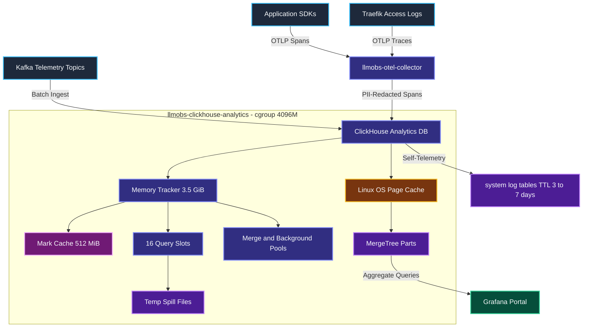

---

### 2.3 System Low-Level Design (LLD) — End-to-End Query Execution Flow

This traces a single query from client socket through admission control, memory accounting and column scan to result, showing every configured gate it must pass.

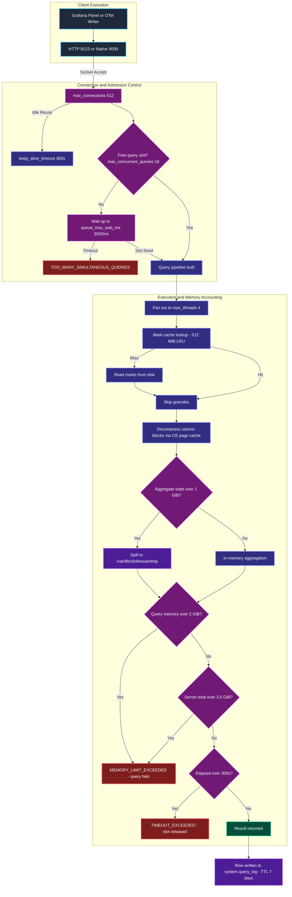

> **The critical ordering.** `max_memory_usage` fails *one* query. `max_server_memory_usage` fails the *newest* query. Only if both are absent or mis-sized does the Linux OOM killer terminate the container at `Exit 137` — which is unrecoverable and takes every in-flight query with it. Every memory parameter in this guide exists to keep failure on the left of that boundary.

---
## 3. Server Memory & Cache Architecture Deep-Dive

### 3.1 Memory Configuration & Python Inspection Code

```xml
<clickhouse>
    <!-- Hard total-server ceiling: 87.5% of the 4096M cgroup -->
    <max_server_memory_usage>3758096384</max_server_memory_usage>
    <max_server_memory_usage_to_ram_ratio>0.9</max_server_memory_usage_to_ram_ratio>

    <!-- Default is 5 GiB, which EXCEEDS the 4096M container -->
    <mark_cache_size>536870912</mark_cache_size>

    <!-- Image ships 2 GiB - half the container. Zeroed. -->
    <uncompressed_cache_size>0</uncompressed_cache_size>
</clickhouse>
```

```python
import clickhouse_connect

client = clickhouse_connect.get_client(
    host='localhost', port=31421, username='default',
    password='llmobs_clickhouse_s3cret_2026',
)

GIB = 2 ** 30
CGROUP_LIMIT = 4096 * 2 ** 20

ceiling = int(client.command(
    "SELECT value FROM system.server_settings WHERE name = 'max_server_memory_usage'"))
marks = int(client.command(
    "SELECT value FROM system.server_settings WHERE name = 'mark_cache_size'"))

assert ceiling < CGROUP_LIMIT, "tracker ceiling must sit BELOW the cgroup"
assert marks < ceiling, "mark cache ceiling must sit BELOW the tracker ceiling"

headroom = (CGROUP_LIMIT - ceiling) / 2 ** 20
print(f"cgroup            : {CGROUP_LIMIT / GIB:.2f} GiB")
print(f"tracker ceiling   : {ceiling / GIB:.2f} GiB ({ceiling / CGROUP_LIMIT:.1%} of cgroup)")
print(f"untracked headroom: {headroom:.0f} MiB")
print(f"mark cache        : {marks / GIB:.2f} GiB")

hits, misses = client.query("""
    SELECT
        (SELECT value FROM system.events WHERE event = 'MarkCacheHits'),
        (SELECT value FROM system.events WHERE event = 'MarkCacheMisses')
""").result_rows[0]
total = int(hits) + int(misses)
if total:
    print(f"mark cache hit rate: {int(hits) / total:.1%}")
```

---

### 3.2 Memory High-Level Design (HLD)

ClickHouse defaults assume a **16 GB machine it owns exclusively**. Inside a 4 GiB slice of a shared host, two shipped cache ceilings alone exceed or half-fill the entire container before a single query runs.

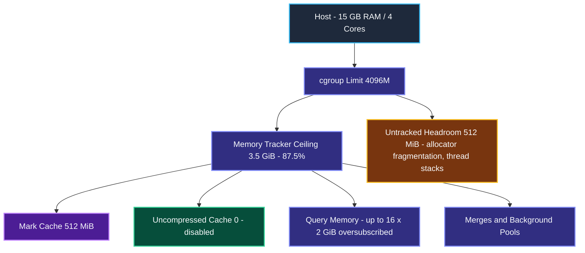

---

### 3.3 Memory Low-Level Design (LLD)

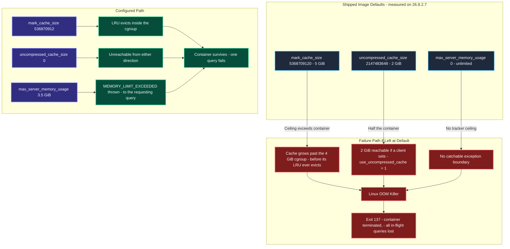

---

### 3.4 Memory & Cache Detailed Configuration Breakdown

Full definitions, per-environment expected values and scaling guidance live once in [§1.1](#11-master-parameter-specifications--expected-values-list). This table states only what each parameter does *in this component*.

| Parameter | Configured | Role in this component | Full specification |
|---|---|---|---|
| `max_server_memory_usage` | `3758096384` (3.5 GiB) | Global tracker ceiling at 87.5% of the cgroup, the catchable backstop before the OOM killer | §1.1 item 2 |
| `mark_cache_size` | `536870912` (512 MiB) | Sparse-index mark cache; its 5 GiB default ceiling exceeded the whole container | §1.1 item 4 |
| `uncompressed_cache_size` | `0` | Decompressed-block cache the image ships at 2 GiB, half the container | §1.1 item 5 |
| `max_server_memory_usage_to_ram_ratio` | `0.9` | Ratio guard that binds only if the cgroup shrinks; already the default | §1.1 item 3 |

---

## 4. Query Admission Control & Connection Architecture

### 4.1 Admission Configuration & Python Concurrency Code

```xml
<!-- config.d/custom.xml : server-wide admission -->
<max_connections>512</max_connections>
<keep_alive_timeout>300</keep_alive_timeout>
<max_concurrent_queries>16</max_concurrent_queries>
```

```xml
<!-- users.d/override.xml : what a queued query does -->
<queue_max_wait_ms>3000</queue_max_wait_ms>
<max_execution_time>300</max_execution_time>
```

```python
import concurrent.futures
import clickhouse_connect

def slow_query(n: int) -> str:
    """Occupy one of the 16 admission slots for ~2 seconds."""
    client = clickhouse_connect.get_client(
        host='localhost', port=31421, username='default',
        password='llmobs_clickhouse_s3cret_2026',
    )
    try:
        client.command("SELECT count() FROM numbers(400000000)")
        return f"query {n:02d}: admitted"
    except Exception as exc:
        if 'TOO_MANY_SIMULTANEOUS_QUERIES' in str(exc):
            return f"query {n:02d}: REJECTED after 3s in queue"
        raise

with concurrent.futures.ThreadPoolExecutor(max_workers=24) as pool:
    for outcome in pool.map(slow_query, range(24)):
        print(outcome)

admin = clickhouse_connect.get_client(
    host='localhost', port=31421, username='default',
    password='llmobs_clickhouse_s3cret_2026',
)
print("in-flight now:", admin.command(
    "SELECT value FROM system.metrics WHERE metric = 'Query'"))
print("rejected total:", admin.command(
    "SELECT sum(value) FROM system.events WHERE event LIKE '%Rejected%'"))
```

---

### 4.2 Admission Control High-Level Design (HLD)

Concurrency is the dominant memory-amplification risk on a 4-core host. A query fans out across `max_threads` and may allocate up to `max_memory_usage`, so concurrency is a **multiplier**, not an additive cost.

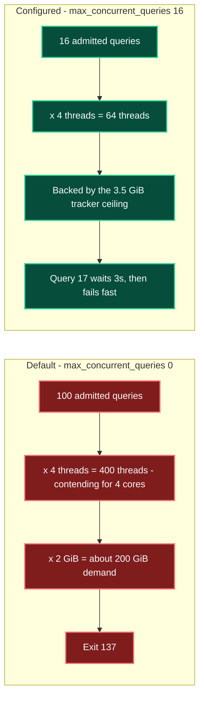

---

### 4.3 Admission Control Low-Level Design (LLD)

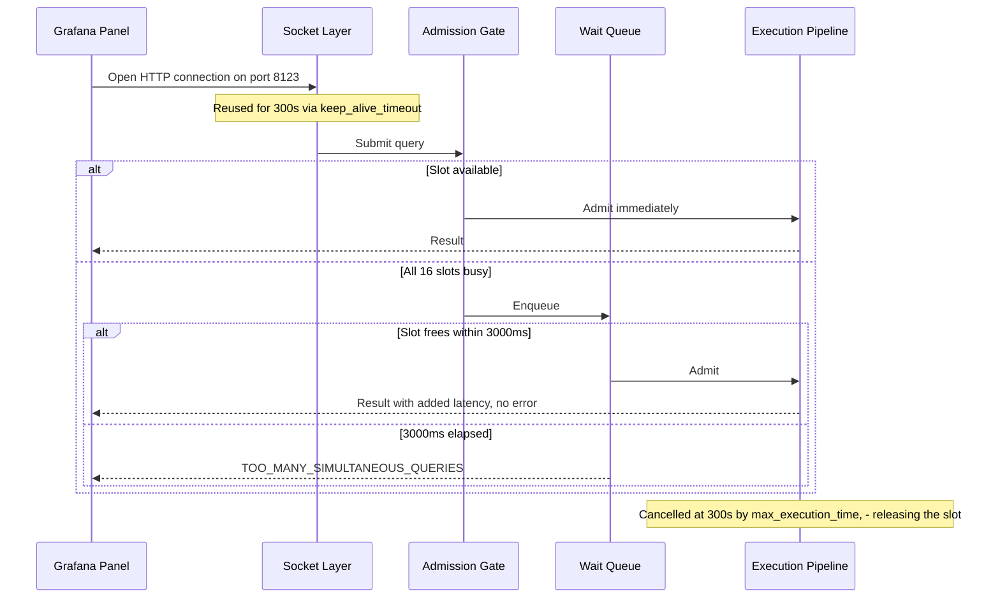

> **`max_concurrent_queries` and `queue_max_wait_ms` are one mechanism, not two settings.** Shipping the concurrency cap without the wait queue turns every Grafana dashboard refresh burst into immediate errors. They must always change together.

---

### 4.4 Admission Control Detailed Configuration Breakdown

Full definitions, per-environment expected values and scaling guidance live once in [§1.1](#11-master-parameter-specifications--expected-values-list). This table states only what each parameter does *in this component*.

| Parameter | Configured | Role in this component | Full specification |
|---|---|---|---|
| `max_concurrent_queries` | `16` | The admission gate — 4 slots per core, bounding threads x memory before allocation | §1.1 item 6 |
| `queue_max_wait_ms` | `3000` | Mandatory partner: turns burst saturation into latency rather than errors | §1.1 item 7 |
| `max_execution_time` | `300` | Reclaims a scarce slot from a runaway query | §1.1 item 8 |
| `max_connections` / `keep_alive_timeout` | `512` / `300` | Socket ceiling and pooled-client reuse; deliberately never the limiter | §1.1 items 9-10 |

---

## 5. Per-Query Resource Governance (Profile Layer)

### 5.1 Profile Configuration & Python Query Governance Code

```xml
<!-- users.d/override.xml : the `default` profile -->
<clickhouse>
    <profiles>
        <default>
            <max_memory_usage>2147483648</max_memory_usage>
            <max_memory_usage_for_all_queries>3221225472</max_memory_usage_for_all_queries>
            <max_bytes_before_external_group_by>1073741824</max_bytes_before_external_group_by>
            <max_bytes_before_external_sort>1073741824</max_bytes_before_external_sort>
            <queue_max_wait_ms>3000</queue_max_wait_ms>
            <max_execution_time>300</max_execution_time>
            <use_uncompressed_cache>0</use_uncompressed_cache>
        </default>
    </profiles>
</clickhouse>
```

```python
import clickhouse_connect

client = clickhouse_connect.get_client(
    host='localhost', port=31421, username='default',
    password='llmobs_clickhouse_s3cret_2026',
    database='llm_telemetry_analytics',
)

AGGREGATE = """
    SELECT service_name, quantile(0.99)(duration_ms)
    FROM spans
    GROUP BY service_name
"""

client.query(AGGREGATE)

try:
    client.query(AGGREGATE, settings={
        'max_bytes_before_external_group_by': 0,
        'max_bytes_before_external_sort': 0,
    })
except Exception as exc:
    assert 'MEMORY_LIMIT_EXCEEDED' in str(exc)
    print("without spill: MEMORY_LIMIT_EXCEEDED, as designed")

cap, spill = client.query("""
    SELECT
        (SELECT value FROM system.settings WHERE name = 'max_memory_usage'),
        (SELECT value FROM system.settings WHERE name = 'max_bytes_before_external_group_by')
""").result_rows[0]
assert int(spill) * 2 == int(cap), "spill threshold must be max_memory_usage / 2"
print(f"cap {int(cap) / 2**30:.0f} GiB, spill at {int(spill) / 2**30:.0f} GiB - invariant holds")

client.query("SELECT count() FROM spans", settings={'max_execution_time': 1800})
```

---

### 5.2 Profile High-Level Design (HLD)

Section 3 bounds the **server**. This layer bounds any **single query**. The two are intentionally oversubscribed against each other.

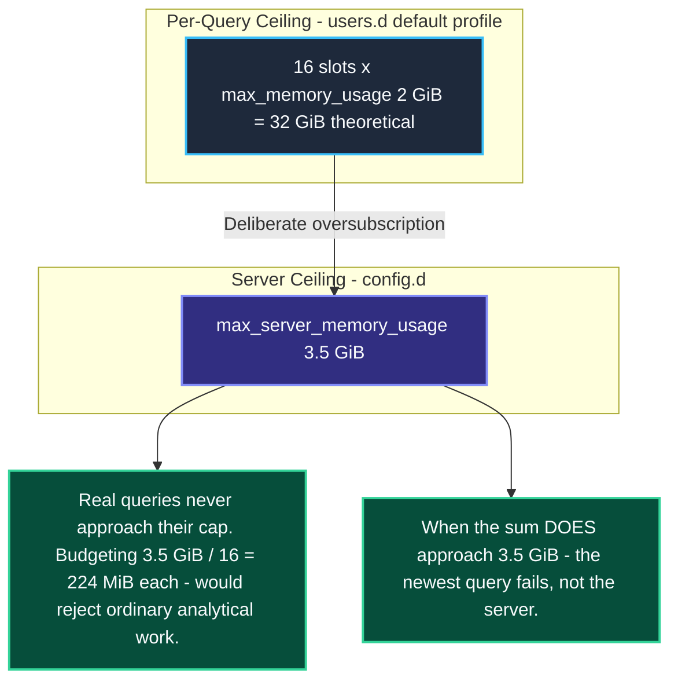

---

### 5.3 Profile Low-Level Design (LLD) — Spill Decision Path

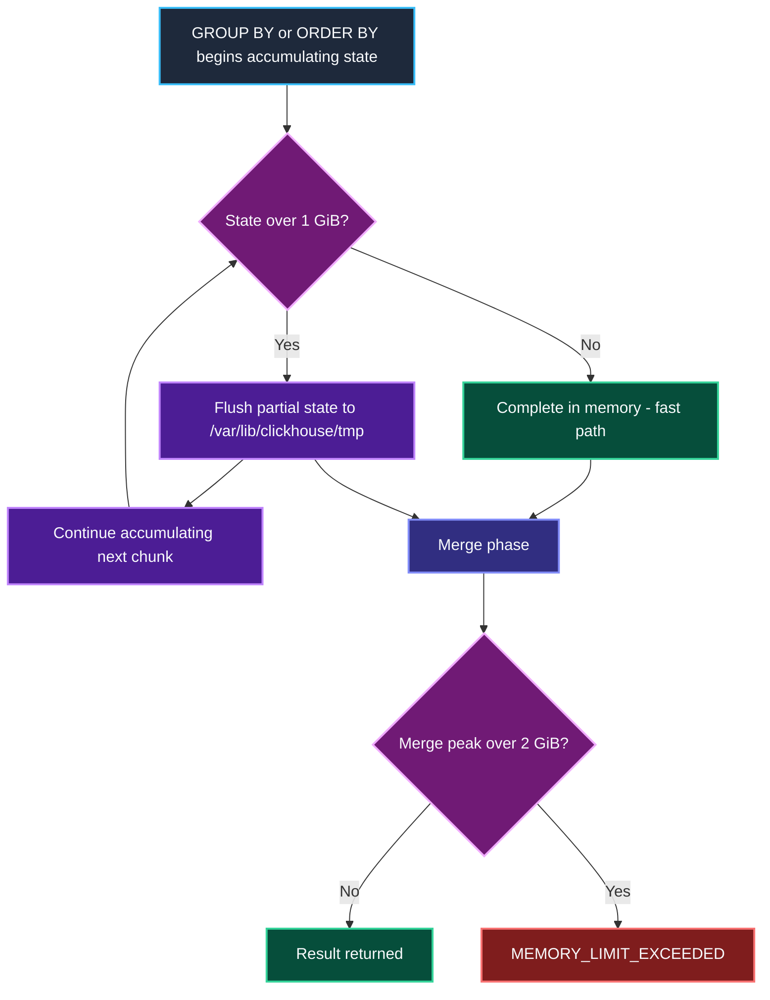

> **Why the spill threshold is exactly half of `max_memory_usage`:** the merge phase of a spilled aggregation needs roughly as much memory again as the spill threshold itself. Half the per-query cap keeps that merge inside the cap. This is the ClickHouse-documented ratio, not an arbitrary choice.

---

### 5.4 Profile Detailed Configuration Breakdown

Full definitions, per-environment expected values and scaling guidance live once in [§1.1](#11-master-parameter-specifications--expected-values-list). This table states only what each parameter does *in this component*.

| Parameter | Configured | Role in this component | Full specification |
|---|---|---|---|
| `max_memory_usage` | `2147483648` (2 GiB) | Per-query cap; deliberately oversubscribed against the server ceiling | §1.1 item 11 |
| `max_bytes_before_external_group_by` / `_sort` | `1073741824` each | Spill thresholds at exactly half the per-query cap | §1.1 item 12 |
| `max_memory_usage_for_all_queries` | `3221225472` | Obsolete legacy cap, retained only while the image tag is unpinned | §1.1 item 13 |
| `use_uncompressed_cache` | `0` | The switch that actually governs the uncompressed cache | §1.1 item 14 |

---

## 6. Container Lifecycle, Entrypoint & Access Provisioning

### 6.1 Container Configuration & Python Bootstrap Verification Code

```yaml
environment:
  CLICKHOUSE_DB: llm_telemetry_analytics
  CLICKHOUSE_USER: default
  CLICKHOUSE_PASSWORD: llmobs_clickhouse_s3cret_2026
  CLICKHOUSE_DEFAULT_ACCESS_MANAGEMENT: "1"
  # CLICKHOUSE_SKIP_USER_SETUP: "1"   <- required to own default-user.xml yourself
volumes:
  - ./config/clickhouse/config.d:/etc/clickhouse-server/config.d:ro
  - ./config/clickhouse/users.d:/etc/clickhouse-server/users.d      # MUST be writable
  - clickhouse_data:/var/lib/clickhouse
ulimits:
  nofile: { soft: 262144, hard: 262144 }
```

```python
import hashlib
import pathlib
import clickhouse_connect

REPO_USER_FILE = pathlib.Path('config/clickhouse/users.d/default-user.xml')

client = clickhouse_connect.get_client(
    host='localhost', port=31421, username='default',
    password='llmobs_clickhouse_s3cret_2026',
)

digest = hashlib.md5(REPO_USER_FILE.read_bytes()).hexdigest()
print(f"default-user.xml md5: {digest}")

for row in client.query("""
    SELECT name, auth_type, host_ip, storage
    FROM system.users
""").result_rows:
    print(f"user={row[0]} auth={row[1]} hosts={row[2]} storage={row[3]}")

escalation = client.query("""
    SELECT access_type, grant_option
    FROM system.grants
    WHERE user_name = 'default' AND grant_option = 1
    LIMIT 5
""").result_rows
print("privileges the password holder can re-grant:", escalation)
```

The entrypoint runs a **temporary** server before the real one, so a correct start emits the readiness banner twice. Counting it is the reliable way to know the real server is up:

```bash
docker logs llmobs-clickhouse-analytics 2>&1 | grep -c "Ready for connections"
```

Expect `2`, not `1`. Probing after the first event reaches a process that is about to exit. See §6.3.

---

### 6.2 Container Lifecycle High-Level Design (HLD)

Everything ClickHouse does is bounded first by the compose service definition, before a single XML directive is read.

```mermaid
graph TD
    CO["docker-compose.yml : llmobs-clickhouse"] --> IM["image clickhouse/clickhouse-server:latest"]
    CO --> RS["restart unless-stopped"]
    CO --> LG["logging json-file 50m x 3 - stdout only"]
    CO --> UL["ulimits nofile 262144"]
    CO --> DP["deploy limits 4096M / reservations 1024M"]
    CO --> PT["ports 31421 to 8123 and 31422 to 9000"]
    CO --> HC["healthcheck wget /ping every 5s"]

    CO --> V1["config.d mounted READ-ONLY"]
    CO --> V2["users.d mounted WRITABLE - mandatory"]
    CO --> V3["clickhouse_data named volume"]

    V1 --> X1["Server settings - sections 3, 4, 7, 8"]
    V2 --> X2["Profile and user settings - sections 5, 6"]
    V3 --> X3["MergeTree parts, system logs, access store, tmp spill"]

    style CO fill:#1e293b,stroke:#38bdf8,stroke-width:2px,color:#f8fafc
    style IM fill:#312e81,stroke:#818cf8,stroke-width:2px,color:#f8fafc
    style RS fill:#312e81,stroke:#818cf8,stroke-width:2px,color:#f8fafc
    style LG fill:#312e81,stroke:#818cf8,stroke-width:2px,color:#f8fafc
    style UL fill:#312e81,stroke:#818cf8,stroke-width:2px,color:#f8fafc
    style DP fill:#312e81,stroke:#818cf8,stroke-width:2px,color:#f8fafc
    style PT fill:#312e81,stroke:#818cf8,stroke-width:2px,color:#f8fafc
    style HC fill:#312e81,stroke:#818cf8,stroke-width:2px,color:#f8fafc
    style V1 fill:#4c1d95,stroke:#c084fc,stroke-width:2px,color:#f8fafc
    style V2 fill:#4c1d95,stroke:#c084fc,stroke-width:2px,color:#f8fafc
    style V3 fill:#4c1d95,stroke:#c084fc,stroke-width:2px,color:#f8fafc
    style X1 fill:#064e3b,stroke:#34d399,stroke-width:2px,color:#f8fafc
    style X2 fill:#064e3b,stroke:#34d399,stroke-width:2px,color:#f8fafc
    style X3 fill:#064e3b,stroke:#34d399,stroke-width:2px,color:#f8fafc
```

---

### 6.3 Container Lifecycle Low-Level Design (LLD) — Entrypoint Startup Sequence

The official image does **not** simply exec the server. It runs a two-phase startup that explains two behaviours which otherwise look like bugs.

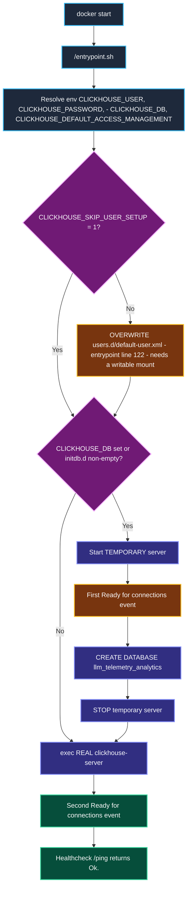

#### `default-user.xml` Is Generated, Not Authored

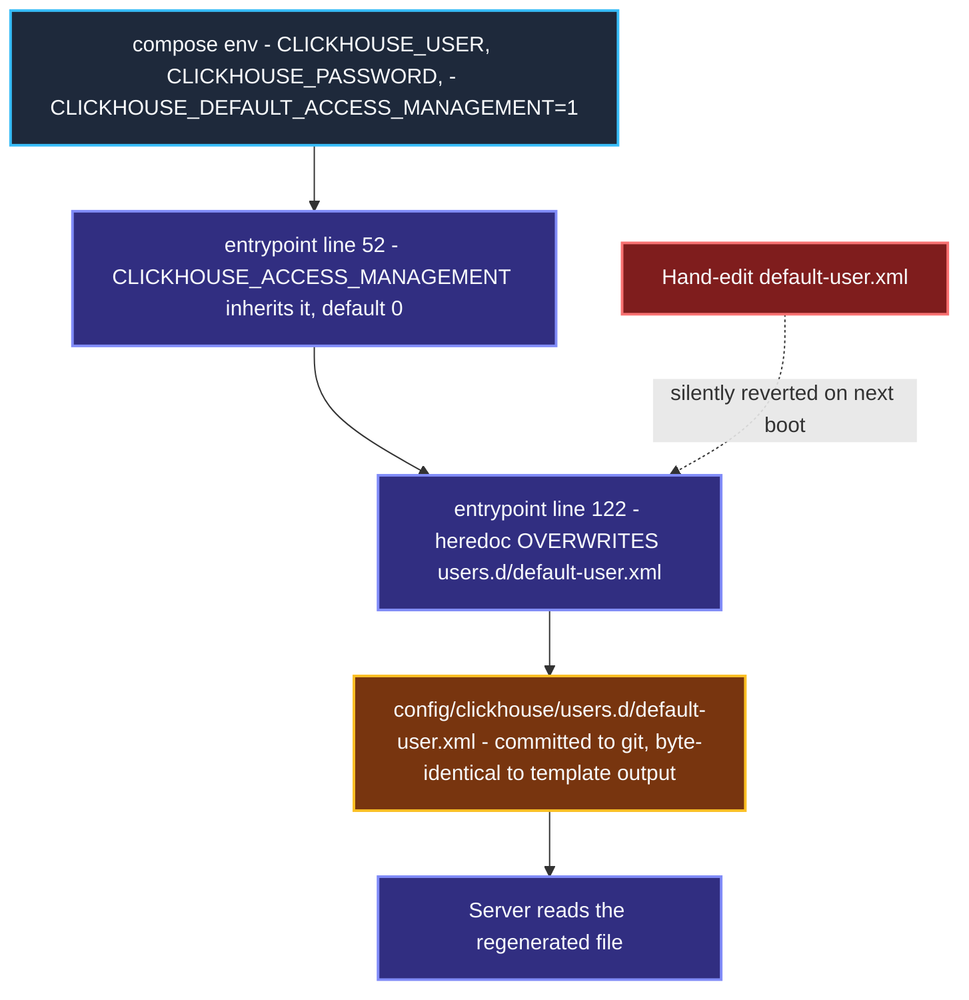

> **The file committed to this repository is byte-for-byte the entrypoint's generated output** for the current environment variables — confirmed by md5 comparison against the running container and against the heredoc in `/entrypoint.sh`. It is a **generated artifact**, not hand-written configuration.
>
> **Consequence:** editing `default-user.xml` to fix the `::/0` network scope or `access_management` achieves nothing; the entrypoint rewrites it on the next boot. Those values must be changed at their real source — the compose environment variables — or by taking ownership of the file with `CLICKHOUSE_SKIP_USER_SETUP=1`. This changes the remediation path for security audit finding **H-07**.

#### Generated User Directives

| Element | Value | Generated From | What It Means | Trade-off / Risk |
|---|---|---|---|---|
| `<default remove="remove">` | — | Template literal | Removes the built-in `default` user before redefining it, so the redefinition replaces rather than merges. | None. Without it the two definitions merge unpredictably. |
| User element name | `default` | `CLICKHOUSE_USER` | The account name is the **XML element name**, not an attribute. | Renaming the user renames the element; references to `<default>` must change too. |
| `<profile>` | `default` | Template literal | Binds the account to the `default` settings profile defined in `override.xml`. | **This is the link** that makes every §5 per-query limit apply to this account. |
| `<networks><ip>` | `::/0` | Template literal | Accepts connections from **any** address. | Audit **H-07**. Hardcoded in the template — unreachable without `CLICKHOUSE_SKIP_USER_SETUP=1`. |
| `<password>` | CDATA secret | `CLICKHOUSE_PASSWORD` | Plain text. **Verified:** `system.users.auth_type` = `plaintext_password`. | Never hashed by the template; prefer `password_sha256_hex` under a self-owned file. |
| `<quota>` | `default` | Template literal | Binds to the `default` quota. **Verified:** the only quota present. | The shipped quota declares no limits, so it constrains nothing today. |
| `<access_management>` | `1` | `CLICKHOUSE_DEFAULT_ACCESS_MANAGEMENT` | Permits `CREATE USER`, `GRANT`, `CREATE ROLE`. **Verified:** grants carry `grant_option: 1`. | Password holder escalates to durable DB administrator. Audit **H-07**. |

---

### 6.4 Container Lifecycle Detailed Configuration Breakdown

Full definitions, per-environment expected values and scaling guidance live once in [§1.1](#11-master-parameter-specifications--expected-values-list). This table states only what each parameter does *in this component*.

| Parameter | Configured | Role in this component | Full specification |
|---|---|---|---|
| `volumes` (`config.d`, `users.d`, `clickhouse_data`) | `:ro`, writable, named volume | `users.d` must be writable — the entrypoint rewrites `default-user.xml` every boot | §1.1 item 26 |
| `CLICKHOUSE_DEFAULT_ACCESS_MANAGEMENT` | `1` | Grants CREATE USER/GRANT to the shared account; audit H-07 | §1.1 item 32 |
| `healthcheck` | `/ping` every 5s, `start_period 20s` | Absorbs the two-phase entrypoint startup | §1.1 item 29 |
| `ulimits.nofile` | `262144` | Descriptor headroom that lets `max_connections` sit at 512 | §1.1 item 28 |

---

## 7. Network, Protocol & Endpoint Configuration

### 7.1 Endpoint Configuration & Python Client Code

```xml
<listen_host>0.0.0.0</listen_host>
<http_port>8123</http_port>
<tcp_port>9000</tcp_port>
<default_database>llm_telemetry_analytics</default_database>
```

```python
import clickhouse_connect
from clickhouse_driver import Client as NativeClient

http_client = clickhouse_connect.get_client(
    host='localhost', port=31421, username='default',
    password='llmobs_clickhouse_s3cret_2026',
)
print("default_database resolves to:", http_client.command("SELECT currentDatabase()"))

native_client = NativeClient(
    host='localhost', port=31422, user='default',
    password='llmobs_clickhouse_s3cret_2026',
    database='llm_telemetry_analytics',
)
print("native protocol rows:", native_client.execute("SELECT 1"))
```

To enumerate every listener the server actually opened:

```bash
docker exec llmobs-clickhouse-analytics ss -ltn
```

**Verified:** beyond 8123 and 9000 the image also binds **9004** (MySQL wire), **9005** (PostgreSQL wire) and **9009** (interserver) — none of which are published in `docker-compose.yml`, so they are reachable only from within `llmobs-network`.

---

### 7.2 Endpoint High-Level Design (HLD)

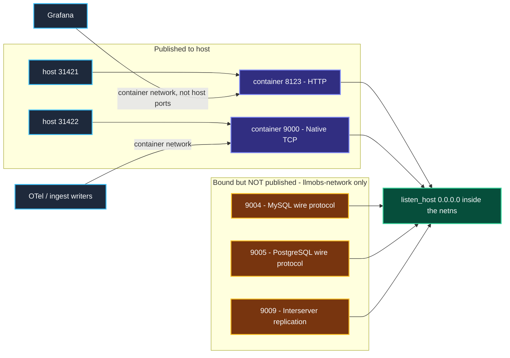

---

### 7.3 Endpoint Detailed Configuration Breakdown

Full definitions, per-environment expected values and scaling guidance live once in [§1.1](#11-master-parameter-specifications--expected-values-list). This table states only what each parameter does *in this component*.

| Parameter | Configured | Role in this component | Full specification |
|---|---|---|---|
| `listen_host` | `0.0.0.0` | Binds all interfaces inside the namespace; default is loopback only | §1.1 item 16 |
| `http_port` / `tcp_port` | `8123` / `9000` | Grafana and healthcheck use HTTP; native serves clients | §1.1 item 17 |
| `default_database` | `llm_telemetry_analytics` | Resolves unqualified queries; must track `CLICKHOUSE_DB` | §1.1 item 18 |
| `ports` (compose) | `31421:8123`, `31422:9000` | Publishes only the two protocols in use; 9004/9005/9009 stay internal | §1.1 item 27 |

---

## 8. System Log Retention & Physical Storage Management

### 8.1 Retention Configuration & Python TTL Verification Code

```xml
<!-- opentelemetry_span_log is the ONE table needing the engine form -->
<opentelemetry_span_log>
    <engine>
        engine MergeTree
        partition by toYYYYMM(finish_date)
        order by (finish_date, finish_time_us)
        ttl finish_date + INTERVAL 7 DAY DELETE
    </engine>
    <database>system</database>
    <table>opentelemetry_span_log</table>
    <flush_interval_milliseconds>7500</flush_interval_milliseconds>
</opentelemetry_span_log>

<!-- every other system log takes a plain sibling <ttl> -->
<query_log>
    <database>system</database>
    <table>query_log</table>
    <flush_interval_milliseconds>7500</flush_interval_milliseconds>
    <ttl>event_date + INTERVAL 7 DAY DELETE</ttl>
</query_log>

<metric_log>
    <database>system</database>
    <table>metric_log</table>
    <flush_interval_milliseconds>7500</flush_interval_milliseconds>
    <collect_interval_milliseconds>1000</collect_interval_milliseconds>
    <ttl>event_date + INTERVAL 3 DAY DELETE</ttl>
</metric_log>
```

```python
import re
import clickhouse_connect

client = clickhouse_connect.get_client(
    host='localhost', port=31421, username='default',
    password='llmobs_clickhouse_s3cret_2026',
)

EXPECTED = {
    'query_log': 7, 'part_log': 7, 'opentelemetry_span_log': 7,
    'trace_log': 3, 'metric_log': 3,
    'asynchronous_metric_log': 3, 'query_thread_log': 3,
}

client.command("SYSTEM FLUSH LOGS")

rows = client.query("""
    SELECT name, engine_full
    FROM system.tables
    WHERE database = 'system' AND name IN %(names)s
""", parameters={'names': tuple(EXPECTED)}).result_rows

for name, engine_full in rows:
    match = re.search(r'TTL (\w+) \+ toIntervalDay\((\d+)\)', engine_full)
    assert match, f"{name} has NO TTL - it will grow without bound"
    column, days = match.group(1), int(match.group(2))
    assert days == EXPECTED[name], f"{name}: expected {EXPECTED[name]}d, found {days}d"
    expected_col = 'finish_date' if name == 'opentelemetry_span_log' else 'event_date'
    assert column == expected_col, f"{name}: TTL on {column}, expected {expected_col}"
    print(f"{name:26s} TTL {days}d on {column}")

for row in client.query("""
    SELECT table, formatReadableSize(sum(bytes_on_disk)) AS size, sum(rows) AS rows
    FROM system.parts
    WHERE database = 'system' AND active
    GROUP BY table ORDER BY sum(bytes_on_disk) DESC
""").result_rows:
    print(row)
```

---

### 8.2 Retention High-Level Design (HLD)

ClickHouse writes its own observability data into `system.*_log` MergeTree tables inside the `clickhouse_data` volume. **Apart from `query_log`, they ship with no TTL and grow forever.** This is the largest unmanaged disk consumer in the service, entirely separate from the telemetry the platform actually stores.

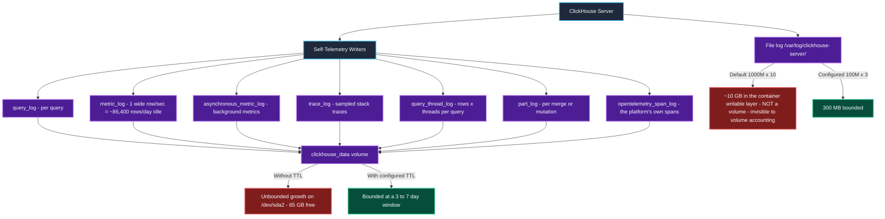

---

### 8.3 Retention Low-Level Design (LLD) — The `<engine>` / `<ttl>` Conflict

`config.d` files **merge into** the image's shipped `config.xml`; they do not replace it. This makes one retention configuration crash the server, and the conflict is invisible from our file alone.

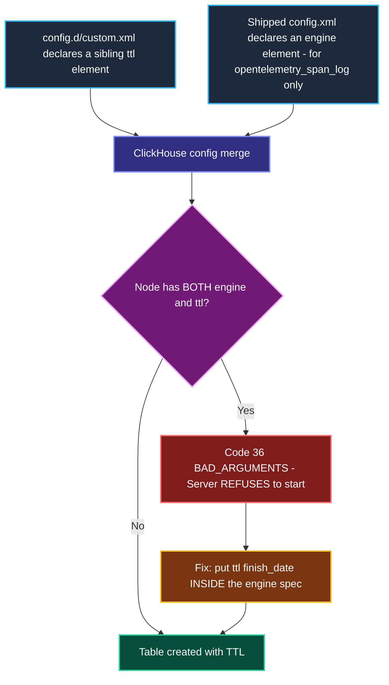

> `opentelemetry_span_log` is the only table in the stack needing this treatment — and it is the one this platform cares about most. It has no `event_time`; it is ordered on `finish_date` / `finish_time_us`, which is exactly why the image gives it a custom engine.

---

### 8.4 Retention Detailed Configuration Breakdown

Full definitions, per-environment expected values and scaling guidance live once in [§1.1](#11-master-parameter-specifications--expected-values-list). This table states only what each parameter does *in this component*.

| Parameter | Configured | Role in this component | Full specification |
|---|---|---|---|
| `<ttl>` on six system log tables | 3 or 7 days | Bounds self-telemetry growth in `clickhouse_data` | §1.1 item 19 |
| `<engine>` with inline `ttl` (`opentelemetry_span_log`) | `finish_date + 7 DAY` | The one table where a sibling `<ttl>` refuses to boot | §1.1 item 20 |
| `<logger>` `<size>` / `<count>` | `100M` x `3` | Bounds the in-container file log the compose driver never sees | §1.1 item 21 |
| `flush_interval_milliseconds` / `collect_interval_milliseconds` | `7500` / `1000` | Flush cadence and `metric_log` row rate | §1.1 items 23-24 |

---

## 9. MergeTree Storage, Granules, Marks & Merge Mechanics

Every memory and retention parameter in this guide ultimately governs MergeTree behaviour. This section explains the storage engine those parameters act on.

### 9.1 MergeTree Inspection Python Code

```python
import clickhouse_connect

client = clickhouse_connect.get_client(
    host='localhost', port=31421, username='default',
    password='llmobs_clickhouse_s3cret_2026',
    database='llm_telemetry_analytics',
)

for row in client.query("""
    SELECT table, partition, count() AS parts,
           formatReadableSize(sum(bytes_on_disk)) AS size,
           sum(rows) AS rows
    FROM system.parts
    WHERE active AND database = currentDatabase()
    GROUP BY table, partition
    HAVING parts > 1
    ORDER BY parts DESC
""").result_rows:
    print(row)

for row in client.query("""
    SELECT name,
           formatReadableSize(sum(data_compressed_bytes))   AS compressed,
           formatReadableSize(sum(data_uncompressed_bytes)) AS raw,
           round(sum(data_uncompressed_bytes) / sum(data_compressed_bytes), 2) AS ratio
    FROM system.columns
    WHERE database = currentDatabase()
    GROUP BY name ORDER BY sum(data_compressed_bytes) DESC LIMIT 10
""").result_rows:
    print(row)

print(client.query("""
    SELECT table, elapsed, progress, formatReadableSize(memory_usage) AS mem
    FROM system.merges
""").result_rows)

print(client.query("""
    SELECT table, name AS setting, value
    FROM system.merge_tree_settings
    CROSS JOIN (SELECT 'index_granularity' AS table)
    WHERE name = 'index_granularity'
""").result_rows)
```

---

### 9.2 MergeTree High-Level Design (HLD) — Parts, Granules & Marks

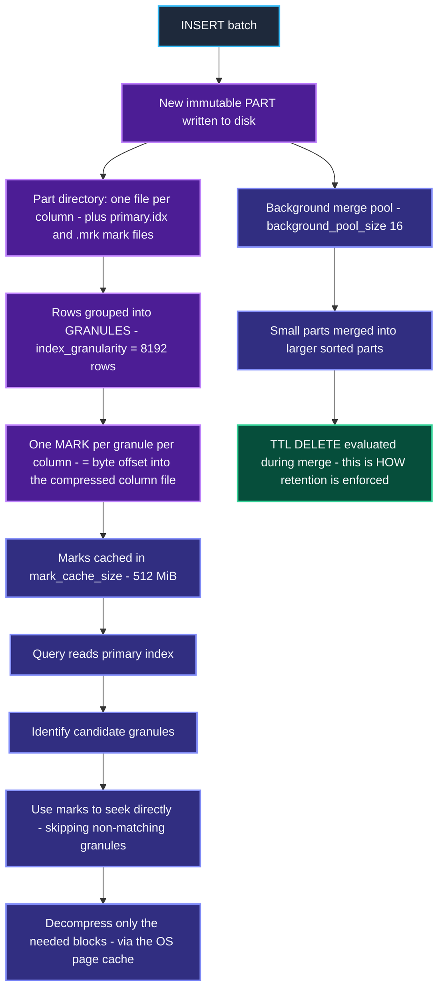

> **This is why `mark_cache_size` matters so much.** Marks are the index that makes granule skipping possible. A cache too small forces a disk read for the index itself on every scan; a cache whose *ceiling* exceeds the container kills the process. 512 MiB is the compromise.
>
> **And this is why TTL is not a scheduled job.** ClickHouse enforces `TTL ... DELETE` during background merges. If merges are starved — for example by shrinking `background_pool_size` — retention silently stops being enforced too.

---

### 9.3 MergeTree Low-Level Design (LLD) — Insert-to-Merge Lifecycle

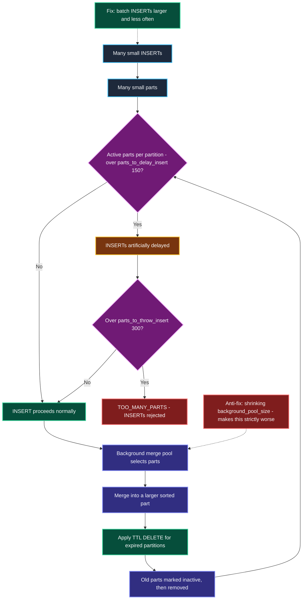

---

### 9.4 MergeTree Detailed Configuration Breakdown

Full definitions, per-environment expected values and scaling guidance live once in [§1.1](#11-master-parameter-specifications--expected-values-list). This table states only what each parameter does *in this component*.

| Parameter | Configured | Role in this component | Full specification |
|---|---|---|---|
| `background_pool_size` | `16` (inherited) | Merge threads — and what actually applies TTL retention | §1.1 item 35 |
| `index_granularity` | `8192` (inherited) | Rows per granule, so it sets how many marks the cache must hold | — |
| `parts_to_delay_insert` / `parts_to_throw_insert` | `150` / `300` (inherited) | The thresholds behind `TOO_MANY_PARTS` | — |

---

## 10. Native ClickHouse Emergency CLI Commands & Incident Runbooks

### 10.1 Standard Verification Block

```bash
# Boots clean - expect no output
docker logs llmobs-clickhouse-analytics 2>&1 | grep '<Error>'

# Server-level directives - sections 3, 4, 7
docker exec llmobs-clickhouse-analytics clickhouse-client --password "$CLICKHOUSE_PASSWORD" -q "
  SELECT name, value, default FROM system.server_settings
  WHERE name IN ('max_connections','max_concurrent_queries','keep_alive_timeout',
                 'max_server_memory_usage','max_server_memory_usage_to_ram_ratio',
                 'mark_cache_size','uncompressed_cache_size') FORMAT PrettyCompact"

# Profile-level directives - section 5
docker exec llmobs-clickhouse-analytics clickhouse-client --password "$CLICKHOUSE_PASSWORD" -q "
  SELECT name, value FROM system.settings
  WHERE name IN ('max_memory_usage','max_bytes_before_external_group_by',
                 'max_bytes_before_external_sort','queue_max_wait_ms',
                 'max_execution_time','use_uncompressed_cache') FORMAT PrettyCompact"

# System log TTLs - section 8
docker exec llmobs-clickhouse-analytics clickhouse-client --password "$CLICKHOUSE_PASSWORD" -q "SYSTEM FLUSH LOGS"
docker exec llmobs-clickhouse-analytics clickhouse-client --password "$CLICKHOUSE_PASSWORD" -q "
  SELECT name, extract(engine_full,'TTL[^S]*') AS ttl FROM system.tables
  WHERE database='system' AND name LIKE '%\_log' ORDER BY name FORMAT PrettyCompact"
```

Expected: `max_connections=512`, `max_concurrent_queries=16`, `mark_cache_size=536870912`, `uncompressed_cache_size=0`, `max_server_memory_usage=3758096384`, and a non-empty TTL on all seven tables.

---

### 10.2 Emergency Incident 1: Container OOM-Killed (`Exit 137`)

```bash
docker inspect llmobs-clickhouse-analytics --format '{{.State.ExitCode}} {{.State.OOMKilled}}'
dmesg | grep -i -A3 'killed process.*clickhouse'

docker exec llmobs-clickhouse-analytics clickhouse-client --password "$CLICKHOUSE_PASSWORD" -q "
  SELECT formatReadableSize(value) FROM system.metrics WHERE metric = 'MemoryTracking'"

docker exec llmobs-clickhouse-analytics clickhouse-client --password "$CLICKHOUSE_PASSWORD" -q "
  SELECT type, query_start_time, formatReadableSize(memory_usage) AS mem, left(query, 90) AS q
  FROM system.query_log
  WHERE event_time > now() - INTERVAL 30 MINUTE AND memory_usage > 1000000000
  ORDER BY memory_usage DESC LIMIT 10 FORMAT Vertical"
```

**Resolution order:** confirm `max_server_memory_usage` is still ~87.5% of the cgroup; if the tracker never approached its ceiling the kill came from *untracked* memory, so lower the ceiling rather than raising it. Never raise it above 90% of the cgroup.

---

### 10.3 Emergency Incident 2: Disk 100% Full on `/dev/sda2`

```bash
df -h /
docker system df -v | grep -i clickhouse

docker exec llmobs-clickhouse-analytics clickhouse-client --password "$CLICKHOUSE_PASSWORD" -q "
  SELECT database, table, formatReadableSize(sum(bytes_on_disk)) AS size
  FROM system.parts WHERE active GROUP BY database, table
  ORDER BY sum(bytes_on_disk) DESC LIMIT 15 FORMAT PrettyCompact"

# The in-container file log is NOT a volume and is easy to miss
docker exec llmobs-clickhouse-analytics du -sh /var/log/clickhouse-server/

# Force TTL enforcement now instead of waiting for a background merge
docker exec llmobs-clickhouse-analytics clickhouse-client --password "$CLICKHOUSE_PASSWORD" -q "
  ALTER TABLE system.metric_log MATERIALIZE TTL"
docker exec llmobs-clickhouse-analytics clickhouse-client --password "$CLICKHOUSE_PASSWORD" -q "
  ALTER TABLE system.trace_log  MATERIALIZE TTL"
```

**Retroactive TTLs** — required only when this config lands on a volume that already has system tables, because a config TTL applies at table *creation*:

```sql
ALTER TABLE system.query_log               MODIFY TTL event_date  + INTERVAL 7 DAY DELETE;
ALTER TABLE system.part_log                MODIFY TTL event_date  + INTERVAL 7 DAY DELETE;
ALTER TABLE system.trace_log               MODIFY TTL event_date  + INTERVAL 3 DAY DELETE;
ALTER TABLE system.metric_log              MODIFY TTL event_date  + INTERVAL 3 DAY DELETE;
ALTER TABLE system.query_thread_log        MODIFY TTL event_date  + INTERVAL 3 DAY DELETE;
ALTER TABLE system.asynchronous_metric_log MODIFY TTL event_date  + INTERVAL 3 DAY DELETE;
-- keys off finish_date, NOT event_date:
ALTER TABLE system.opentelemetry_span_log  MODIFY TTL finish_date + INTERVAL 7 DAY DELETE;
```

---

### 10.4 Emergency Incident 3: `TOO_MANY_PARTS` / Ingest Rejected

```bash
docker exec llmobs-clickhouse-analytics clickhouse-client --password "$CLICKHOUSE_PASSWORD" -q "
  SELECT table, partition, count() AS parts
  FROM system.parts WHERE active AND database = 'llm_telemetry_analytics'
  GROUP BY table, partition HAVING parts > 100 ORDER BY parts DESC FORMAT PrettyCompact"

docker exec llmobs-clickhouse-analytics clickhouse-client --password "$CLICKHOUSE_PASSWORD" -q "
  SELECT table, elapsed, progress FROM system.merges FORMAT PrettyCompact"

# Force a merge on the worst partition to buy time
docker exec llmobs-clickhouse-analytics clickhouse-client --password "$CLICKHOUSE_PASSWORD" -q "
  OPTIMIZE TABLE llm_telemetry_analytics.spans PARTITION '202609' FINAL"
```

**Resolution order:** the real fix is **fewer, larger INSERTs**. Do not raise `parts_to_throw_insert` and do not shrink `background_pool_size` — the second makes it worse and also stalls TTL enforcement.

---

### 10.5 Emergency Incident 4: Query Queue Saturation

```bash
docker exec llmobs-clickhouse-analytics clickhouse-client --password "$CLICKHOUSE_PASSWORD" -q "
  SELECT query_id, elapsed, formatReadableSize(memory_usage) AS mem, left(query, 80) AS q
  FROM system.processes ORDER BY elapsed DESC FORMAT Vertical"

docker exec llmobs-clickhouse-analytics clickhouse-client --password "$CLICKHOUSE_PASSWORD" -q "
  SELECT value FROM system.metrics WHERE metric = 'Query'"

# Kill one runaway query, releasing its admission slot
docker exec llmobs-clickhouse-analytics clickhouse-client --password "$CLICKHOUSE_PASSWORD" -q "
  KILL QUERY WHERE query_id = '<id>' SYNC"
```

**Resolution order:** if `TOO_MANY_SIMULTANEOUS_QUERIES` appears about 3 seconds after a dashboard refresh, raise `max_concurrent_queries` **and** `queue_max_wait_ms` together — never the concurrency cap alone.

---

### 10.6 Symptom → Lever Reference

| Symptom | Change | Do Not |
|---|---|---|
| `TOO_MANY_SIMULTANEOUS_QUERIES` after ~3s | Raise `max_concurrent_queries` **and** `queue_max_wait_ms` together | Raise the concurrency cap alone |
| `MEMORY_LIMIT_EXCEEDED` on one query | Raise `max_memory_usage`, or lower the spill thresholds so it spills sooner | Raise `max_server_memory_usage` above ~90% of the cgroup |
| `Exit 137` / container OOM-killed | Lower `max_server_memory_usage`, or raise the container limit | Ignore it — this is the kernel, not ClickHouse |
| Query killed at 5 minutes | Raise `max_execution_time`, or `SET` it per session | Set it to `0` while the concurrency cap is 16 |
| Slow wide scans after this change | Raise `mark_cache_size` **and** the container limit together | Raise the mark cache alone past the cgroup |
| `TOO_MANY_PARTS` | Batch inserts larger and less often | Shrink `background_pool_size` — it also stalls TTL |
| `clickhouse_data` filling | Shorten the §8.4 TTLs, then `MATERIALIZE TTL` | Disable `metric_log` — this is an observability platform |
| Container exits at entrypoint line 122 | Restore the writable `users.d` mount | Mount `users.d` as `:ro` |
| Hand-edits to `default-user.xml` keep reverting | Set `CLICKHOUSE_SKIP_USER_SETUP=1` | Keep re-editing the generated file |

---

### 10.7 Validated Gotchas

| # | Gotcha | Consequence | Handling |
|---|---|---|---|
| 1 | **`<ttl>` beside `<engine>` refuses to boot.** The shipped config gives `opentelemetry_span_log` a custom engine; `config.d` merges into it. | `Code: 36 BAD_ARGUMENTS` on metadata load — the server does not start. | Retention goes inside the engine spec for that one table, keyed on `finish_date`. §8.3. |
| 2 | **The image's defaults are not the published defaults.** `uncompressed_cache_size` is 2 GiB here (not 8 GiB); `max_concurrent_queries` is `0` (not `100`); `max_connections` is `4096` (not `1024`). | Tuning against documented defaults produces wrong sizing. | Always read `system.server_settings.default` on the actual image. |
| 3 | **Two `Ready for connections` events on startup.** The entrypoint runs a temporary server to create the database, stops it, then execs the real one. | Health-checking after the first event probes a process about to exit — spurious `Connection refused`. | Wait for the second event. `start_period: 20s` exists for this. §6.3. |
| 4 | **`config.d` merges, it does not replace.** | Conflicts with the shipped config are invisible from our file alone. | Inspect the target: `docker run --rm --entrypoint bash clickhouse/clickhouse-server:latest -c 'sed -n "1200,1600p" /etc/clickhouse-server/config.xml'` |
| 5 | **Config TTLs apply at table creation only.** | Rolling this config onto an existing volume silently leaves old tables unbounded. | Run the retroactive `ALTER TABLE ... MODIFY TTL` block in §10.3. |
| 6 | **`users.d/default-user.xml` is GENERATED, not authored.** The entrypoint rewrites it from the compose env vars on every boot; the committed file is byte-identical to that template output. | Hand-edits to the password, `<networks>` scope or `access_management` are silently reverted on restart. | Change the env vars, or take ownership with `CLICKHOUSE_SKIP_USER_SETUP=1`. §6.3. |
| 7 | **`users.d` cannot be mounted `:ro`.** | Container exits immediately: `/entrypoint.sh: line 122: .../default-user.xml: Read-only file system`. | Leave it writable. `config.d` is `:ro` and must stay so. §6.4. |
| 8 | **TTL is enforced during merges, not by a scheduler.** | Starving the merge pool silently stops retention as well as growing part count. | Never shrink `background_pool_size` to save CPU. §9.2. |

---

### 10.8 Testing a Config Change Before Committing

```bash
docker run -d --name ch-test --memory 4096m \
  -e CLICKHOUSE_DB=llm_telemetry_analytics -e CLICKHOUSE_USER=default \
  -e CLICKHOUSE_PASSWORD=test -e CLICKHOUSE_DEFAULT_ACCESS_MANAGEMENT=1 \
  --ulimit nofile=262144:262144 \
  -v "$PWD/config/clickhouse/config.d:/etc/clickhouse-server/config.d:ro" \
  -v "$PWD/config/clickhouse/users.d:/etc/clickhouse-server/users.d" \
  clickhouse/clickhouse-server:latest

# Wait for TWO "Ready for connections" events - see gotcha 3
docker logs ch-test 2>&1 | grep -c "Ready for connections"
docker logs ch-test 2>&1 | grep '<Error>'
docker rm -f ch-test
```

---
## 11. Multi-Node Scale-Out Architecture (Single-Node to Replicated Cluster)

### 11.1 Production Override Configuration & Connection Code

```yaml
# docker-compose.prod.yml
llmobs-clickhouse:
  deploy:
    resources:
      limits:
        memory: 8192M
      reservations:
        memory: 2048M
```

```python
import clickhouse_connect

client = clickhouse_connect.get_client(
    host='localhost', port=31421, username='default',
    password='llmobs_clickhouse_s3cret_2026',
)

CGROUP_PROD = 8192 * 2 ** 20

ceiling = int(client.command(
    "SELECT value FROM system.server_settings WHERE name = 'max_server_memory_usage'"))

if ceiling < CGROUP_PROD * 0.8:
    unused = (CGROUP_PROD - ceiling) / 2 ** 30
    print(f"WARNING: {unused:.1f} GiB of the prod cgroup is unreachable - "
          f"tracker ceiling is pinned at {ceiling / 2**30:.1f} GiB")
```

---

### 11.2 Scale-Out Architecture Design (HLD)

Scaling ClickHouse changes *which* parameters dominate: memory ceilings stop being the binding constraint and coordination becomes one.

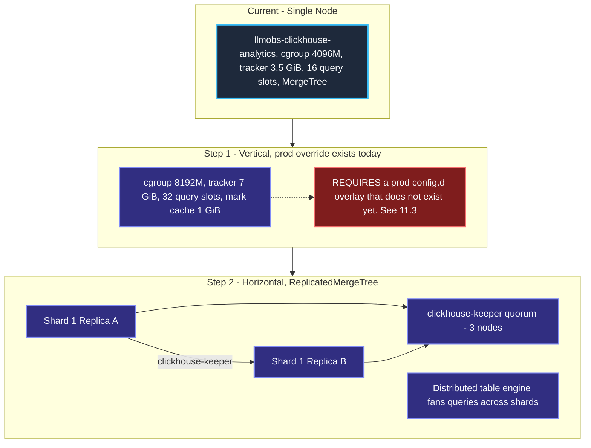

---

### 11.3 Known Gap — Production Memory Drift

`docker-compose.prod.yml` raises the container to `8192M`, but `max_server_memory_usage` is a hardcoded `3758096384` (3.5 GiB) in `config.d`. **Under the prod override ClickHouse would still cap itself at 3.5 GiB and leave roughly 4.5 GiB unused.**

Correcting it requires a prod-specific `config.d` overlay mount, which does not exist in the prod compose file today. Tracked as open item 1 in [ADR-0012 §9](file:///home/btpl-lap-22/live/llm-obs-infra/docs/architectureDoc/adr-0012-clickhouse-configuration.md).

---

### 11.4 Parameters That Change When Sharding

| Parameter | Single Node | Replicated Cluster |
|---|---|---|
| Table engine | `MergeTree` | `ReplicatedMergeTree` with a keeper path |
| Coordination | none | `clickhouse-keeper` quorum, 3 nodes minimum |
| Interserver port 9009 | bound, unused | **actively used** for replica data transfer |
| `max_concurrent_queries` | 16, server-wide | Per shard; a distributed query consumes a slot on **every** shard it touches |
| `max_memory_usage` | 2 GiB | Applies per shard — a distributed `GROUP BY` can hold this much on each |
| `max_server_memory_usage` | 3.5 GiB | Unchanged per node; sized to each node's own cgroup |
| System log TTLs | per node | Per node — each shard keeps its own `system.*_log` |
| Healthcheck | `/ping` | `/replicas_status` — detects replication lag, which `/ping` cannot |

---

## 12. Scope Boundaries

| Item | Why Not Covered Here | Owner |
|---|---|---|
| `default-user.xml` — `::/0` network scope, `access_management=1` | Authentication and authorisation rather than resource configuration. **§6.3 documents the mechanism**, which changes the remediation path: the file is generated, so it must be fixed at the env vars or via `CLICKHOUSE_SKIP_USER_SETUP=1` | Audit **H-07**, [`docs/securityDoc/audits/pending/`](file:///home/btpl-lap-22/live/llm-obs-infra/docs/securityDoc/audits/pending/) |
| TLS termination for 8123 / 9000 | Handled at Traefik today; ClickHouse-side TLS would add `https_port` / `tcp_port_secure` | ADR-0011, security track |
| Kafka, Redis, AlloyDB, OTel Collector, Temporal, Tempo, Grafana, Traefik | Separate services | [`kafka-configuration-guide.md`](file:///home/btpl-lap-22/live/llm-obs-infra/docs/configDoc/kafka-configuration-guide.md), ADR-0011 |
