# Apache Kafka Comprehensive Architecture, Component Deep-Dive & Operational Guide

## 1. Executive Master Parameter Reference Specifications

To avoid scrolling back and forth between sections, this master reference provides an immediate, unified list of every Kafka parameter, its definitions, expected environment values, currently configured values, outcomes, trade-offs, and system impacts.

### 1.1 Master Parameter Specifications & Expected Values List

1. **Parameter**: `KAFKA_HEAP_OPTS`
   - **Definition**: Controls initial (`-Xms`) and maximum (`-Xmx`) physical RAM allocated strictly to JVM heap objects (broker metadata, request queues, partition offset indexes).
   - **Expected Values**: Dev: `-Xms512m -Xmx1024m` | Prod: `-Xms1024m -Xmx2048m` | Enterprise: `-Xms4096m -Xmx4096m`
   - **Currently Configured Value**: `-Xms512m -Xmx1024m` (Base Dev in `docker-compose.yml`) / `-Xms1024m -Xmx2048m` (Prod Override in `docker-compose.prod.yml`)
   - **Outcome / System Impact**: Restricts JVM heap to 1024MB max, leaving off-heap headroom for Linux OS Page Cache and Metaspace. Keeps G1GC collection pauses under 50ms on 4 CPU cores.
   - **Why & When to Configure It**: Fixes launcher bug where performance flags broke heap sizing; keeps JVM memory bounded to prevent host RAM starvation.
   - **Scaling & Troubleshooting**: Higher heap reduces RAM available for ClickHouse and OS Page Cache. Monitor JMX metric `jvm_gc_pause_seconds` (> 0.5s) or error `java.lang.OutOfMemoryError: Java heap space`. Formula: `Container Limit = JVM Heap (-Xmx) + 1024MB`.

---

2. **Parameter**: `deploy.resources.limits.memory` & `reservations.memory`
   - **Definition**: Establishes hard Linux kernel `cgroups` memory boundaries around the Kafka container process.
   - **Expected Values**: Dev: `2048M` limit, `512M` reservation | Prod: `4096M` limit | Enterprise: `8192M` limit
   - **Currently Configured Value**: Limit: `2048M`, Reservation: `512M` (in `docker-compose.yml`)
   - **Outcome / System Impact**: Guarantees Kafka cannot exceed 2 GB of physical host RAM under any burst condition. Preserves memory headroom for ClickHouse and AlloyDB.
   - **Why & When to Configure It**: Prevents a single container from consuming all host RAM and triggering the Linux kernel Out-Of-Memory (OOM) killer against adjacent services.
   - **Scaling & Troubleshooting**: Under-provisioning limit triggers Linux OOM killer (Exit status 137). Monitor via `docker ps -a` or `dmesg | grep -i oom`. Formula: `Container Limit = JVM Heap (-Xmx) + 1024M`.

---

3. **Parameter**: `log.segment.bytes`
   - **Definition**: Maximum byte size per partition segment file before closing and rolling a new active segment file.
   - **Expected Values**: Dev: `104857600` (100 MB) | Medium Prod: `268435456` (256 MB) | High-Throughput Prod: `536870912` (512 MB)
   - **Currently Configured Value**: `104857600` (100 MB in `config/kafka/server.properties`)
   - **Outcome / System Impact**: Reclaims ~30 GB of storage space on `/dev/sda2` by enabling rapid closure of segment files.
   - **Why & When to Configure It**: Kafka log retention ONLY deletes closed segments; active segments are never deleted regardless of age. 100 MB segments allow rapid segment closure.
   - **Scaling & Troubleshooting**: Very small segments under high throughput increase open file handle count. Increase to 512MB under > 50,000 msgs/sec load.

---

4. **Parameter**: `log.retention.hours`
   - **Definition**: Duration in hours that closed segment files are retained on disk before physical deletion.
   - **Expected Values**: Dev: `24` (24 Hours) | Production Buffer: `72` (3 Days) | Long Retention: `168` (7 Days)
   - **Currently Configured Value**: `24` (24 Hours in `config/kafka/server.properties`)
   - **Outcome / System Impact**: Reclaims ~35 GB of disk space on `/dev/sda2` by deleting 1-day-old log segments.
   - **Why & When to Configure It**: Telemetry is ingested into ClickHouse immediately. Holding logs for 7 days duplicates data and fills host disks.
   - **Scaling & Troubleshooting**: Lower retention shortens the recovery window for offline consumers. Increase to 72h if consumer downtime risks exceed 24 hours.

---

5. **Parameter**: `log.roll.hours`
   - **Definition**: Maximum time window after which an active segment is forcibly closed, even if segment size is less than 100 MB.
   - **Expected Values**: Low-Volume Topics: `2` (2 Hours) | High-Volume Topics: `12` (12 Hours) or `24` (24 Hours)
   - **Currently Configured Value**: `2` (2 Hours in `config/kafka/server.properties`)
   - **Outcome / System Impact**: Guarantees active log segments close within 2 hours, making them eligible for retention cleanup.
   - **Why & When to Configure It**: Low-throughput topics take weeks to write 100 MB. Forced rolls enable regular file deletion.
   - **Scaling & Troubleshooting**: Creates more segment files across dormant topics. Maintain 2h for low-volume telemetry setups.

---

6. **Parameter**: `log.retention.check.interval.ms`
   - **Definition**: Millisecond interval for the log cleaner thread to scan log directories for expired segment files.
   - **Expected Values**: Dev/Base: `60000` (60 Seconds) | Large Cluster: `300000` (5 Minutes)
   - **Currently Configured Value**: `60000` (60 Seconds in `config/kafka/server.properties`)
   - **Outcome / System Impact**: Deletes expired segment files within 60 seconds of expiration, reclaiming disk space rapidly.
   - **Why & When to Configure It**: Rapidly frees disk space on disk-constrained hosts.
   - **Scaling & Troubleshooting**: Scanning too frequently on clusters with 10,000+ partitions generates minor disk I/O overhead.

---

7. **Parameter**: `offsets.topic.num.partitions`
   - **Definition**: Partition count for the internal `__consumer_offsets` tracking topic.
   - **Expected Values**: Dev / Single-Broker: `3` | Medium Prod: `10` to `25` | Enterprise Cluster: `50`
   - **Currently Configured Value**: `3` (in `config/kafka/server.properties`)
   - **Outcome / System Impact**: Saves 188+ open file descriptors and directory entries on single-broker instances.
   - **Why & When to Configure It**: Default 50 partitions waste file descriptors on low-node environments.
   - **Scaling & Troubleshooting**: Lower partitions may cause commit lock contention across 100+ active consumer groups. Scale up to 25 when consumer group count grows.

---

8. **Parameter**: `num.partitions`
   - **Definition**: Default partition count for newly auto-created telemetry topics.
   - **Expected Values**: Dev: `3` | Small Prod: `3` to `6` | Enterprise Cluster: `12`+
   - **Currently Configured Value**: `3` (in `config/kafka/server.properties`)
   - **Outcome / System Impact**: Enables 3-way parallel processing across worker threads matching host CPU core count.
   - **Why & When to Configure It**: Default 1 partition bottlenecks all consumer throughput to a single thread.
   - **Scaling & Troubleshooting**: Match partition count to target consumer thread parallelism. Avoid exceeding 100 partitions per broker core.

---

9. **Parameter**: `acks` / `KAFKA_ACKS`
   - **Definition**: Dictates leader acknowledgment requirements before completing a produce request (`acks=0`, `acks=1`, `acks=all`).
   - **Expected Values**: Low-Latency: `1` | Production Durability: `all` (or `-1`)
   - **Currently Configured Value**: `all` (Prod) / `1` (Dev)
   - **Outcome / System Impact**: Guarantees zero message loss during broker failovers when combined with `min.insync.replicas=2`.
   - **Why & When to Configure It**: Setting `acks=all` ensures writes are acknowledged by all in-sync replicas before returning success.
   - **Scaling & Troubleshooting**: `acks=all` adds slight write latency compared to `acks=1` but guarantees durability.

---

10. **Parameter**: `linger.ms`
    - **Definition**: Artificial producer delay (in milliseconds) to wait for incoming records to form full batches before sending TCP requests.
    - **Expected Values**: Low-Latency: `0` | Base Ingestion: `10` | High-Throughput: `20` to `50`
    - **Currently Configured Value**: `10` ms
    - **Outcome / System Impact**: Increases network and disk throughput 5x by batching small records into full 16KB batches.
    - **Why & When to Configure It**: Default `linger.ms=0` sends records immediately, causing network socket churn.
    - **Scaling & Troubleshooting**: Adds minor latency (10ms). Increase to 20-50ms during high-volume data ingest.

---

11. **Parameter**: `batch.size`
    - **Definition**: Maximum byte size per partition batch in producer memory buffer.
    - **Expected Values**: Base / Dev: `16384` (16 KB) | Production High-Throughput: `65536` (64 KB)
    - **Currently Configured Value**: `16384` (16 KB)
    - **Outcome / System Impact**: Controls memory allocation per partition batch sent in a produce request.
    - **Why & When to Configure It**: Grouping records into 16KB or 64KB batches reduces CPU overhead and optimizes disk write block sizes.
    - **Scaling & Troubleshooting**: Larger batch size increases producer RAM allocation per topic partition.

---

12. **Parameter**: `enable.auto.commit` & `auto.commit.interval.ms`
    - **Definition**: Controls whether consumer offsets are committed automatically on a periodic timer or explicitly managed in code.
    - **Expected Values**: Database Sinks & Pipelines: `false` | Real-Time Dashboard Alerting: `true`
    - **Currently Configured Value**: `false` (Prod) / `true` (Dev)
    - **Outcome / System Impact**: Guarantees at-least-once telemetry delivery into ClickHouse without data loss.
    - **Why & When to Configure It**: Automatic commit (`true`) risks missing data if the consumer crashes before DB inserts complete.
    - **Scaling & Troubleshooting**: Requires manual `commitSync()` / `commitAsync()` calls after successful processing.

---

13. **Parameter**: `max.poll.interval.ms` & `max.poll.records`
    - **Definition**: `max.poll.records` sets max records per `poll()`. `max.poll.interval.ms` sets max time allowed between `poll()` calls before consumer group eviction.
    - **Expected Values**: Fast Ingest: `max.poll.records=500`, `max.poll.interval.ms=300000` (5 Min) | Heavy DB Batching: `max.poll.records=100`, `max.poll.interval.ms=600000` (10 Min)
    - **Currently Configured Value**: `max.poll.interval.ms=300000` (5 Min) | `max.poll.records=500`
    - **Outcome / System Impact**: Prevents rebalance storms when ClickHouse batch inserts take extended processing time.
    - **Why & When to Configure It**: If batch processing takes longer than the interval, Kafka assumes the consumer is dead and triggers group rebalance.
    - **Scaling & Troubleshooting**: Reduce `max.poll.records` or increase `max.poll.interval.ms` for slow database sinks.

---

14. **Parameter**: `enable.idempotence`
    - **Definition**: Enables Producer ID and sequence number tracking to eliminate duplicate record writes on the broker.
    - **Expected Values**: Standard: `true` | Disabled: `false`
    - **Currently Configured Value**: `true`
    - **Outcome / System Impact**: Guarantees exactly-once record writing to partition logs during producer retries.
    - **Why & When to Configure It**: Prevents duplicate record writes caused by transient network retries.
    - **Scaling & Troubleshooting**: Requires `acks=all` and `max.in.flight.requests.per.connection <= 5`.

---

15. **Parameter**: `cleanup.policy`
    - **Definition**: Defines log segment cleanup strategy (`delete` by age/size, `compact` by key, `compact,delete` hybrid).
    - **Expected Values**: Telemetry Streams: `delete` | State Store Topics: `compact` | Hybrid: `compact,delete`
    - **Currently Configured Value**: `delete`
    - **Outcome / System Impact**: Controls whether segments are purged by time or compacted to retain latest state per key.
    - **Why & When to Configure It**: Use `delete` for streaming telemetry spans and logs. Use `compact` for application state caches.
    - **Scaling & Troubleshooting**: Log compaction consumes background CPU and memory for dirty segment cleaner threads.

---

16. **Parameter**: `min.insync.replicas`
    - **Definition**: Minimum number of in-sync replicas (ISR) that must acknowledge a produce request when `acks=all`.
    - **Expected Values**: Dev: `1` | Multi-Broker Production: `2` | High-Availability Cluster: `2` (out of 3 replicas)
    - **Currently Configured Value**: `1` (Dev) / `2` (Prod)
    - **Outcome / System Impact**: Prevents data loss during broker crashes by enforcing minimum write durability quorum.
    - **Why & When to Configure It**: If a leader broker fails, having `min.insync.replicas=2` guarantees at least one replica has identical committed data.
    - **Scaling & Troubleshooting**: If active ISR count falls below `min.insync.replicas`, producers with `acks=all` receive `NotEnoughReplicasException`.

---

17. **Parameter**: `compression.type`
    - **Definition**: Specifies record batch compression algorithm (`none`, `gzip`, `snappy`, `lz4`, `zstd`).
    - **Expected Values**: High-CPU Ingest: `lz4` or `snappy` | High-Ratio Storage: `zstd` | Legacy: `gzip`
    - **Currently Configured Value**: `lz4` (Producer) / `producer` (Broker Inherit)
    - **Outcome / System Impact**: Reduces network bandwidth usage and disk storage footprint by 3x–7x with minimal CPU overhead.
    - **Why & When to Configure It**: Batching telemetry records into `lz4` compresses text JSON logs and trace spans extremely efficiently.
    - **Scaling & Troubleshooting**: `lz4` provides optimal CPU-to-compression speed ratio for streaming telemetry.

---

18. **Parameter**: `max.in.flight.requests.per.connection`
    - **Definition**: Maximum number of unacknowledged produce requests the producer client sends on a single TCP connection before blocking.
    - **Expected Values**: Strict Message Ordering + Idempotency: `5` (or `1`) | Non-Idempotent Strict Order: `1`
    - **Currently Configured Value**: `5`
    - **Outcome / System Impact**: Maximizes network pipeline throughput while ensuring message ordering when `enable.idempotence=true`.
    - **Why & When to Configure It**: Setting higher than 1 on non-idempotent producers risks message reordering if retries occur.
    - **Scaling & Troubleshooting**: Always set `<= 5` when `enable.idempotence=true` to maintain strict partition sequence guarantees.

---

19. **Parameter**: `fetch.min.bytes` & `fetch.max.wait.ms`
    - **Definition**: `fetch.min.bytes` sets minimum data bytes broker should return for a fetch request. `fetch.max.wait.ms` sets max time broker waits to accumulate `fetch.min.bytes`.
    - **Expected Values**: Low-Latency: `fetch.min.bytes=1`, `fetch.max.wait.ms=500` | High-Throughput DB Sink: `fetch.min.bytes=1048576` (1 MB), `fetch.max.wait.ms=500`
    - **Currently Configured Value**: `fetch.min.bytes=1048576` (1 MB) | `fetch.max.wait.ms=500` ms
    - **Outcome / System Impact**: Reduces consumer CPU poll loop iterations and broker network I/O calls by 10x.
    - **Why & When to Configure It**: Stops consumer from executing empty poll loops on low-throughput topics.
    - **Scaling & Troubleshooting**: Increase `fetch.min.bytes` to 1MB or 4MB in batch analytics consumers like ClickHouse ingest.

---

20. **Parameter**: `session.timeout.ms` & `heartbeat.interval.ms`
    - **Definition**: `session.timeout.ms` sets max time group coordinator waits for heartbeats before evicting consumer. `heartbeat.interval.ms` sets frequency of background heartbeat thread.
    - **Expected Values**: Production Ingest: `session.timeout.ms=45000` (45s), `heartbeat.interval.ms=3000` (3s) | Aggressive Eviction: `session.timeout.ms=10000` (10s), `heartbeat.interval.ms=3000`
    - **Currently Configured Value**: `session.timeout.ms=45000` | `heartbeat.interval.ms=3000`
    - **Outcome / System Impact**: Eliminates false consumer group rebalances caused by transient network GC pauses.
    - **Why & When to Configure It**: Rule of thumb: `heartbeat.interval.ms` must be `<= 1/3` of `session.timeout.ms`.
    - **Scaling & Troubleshooting**: Increase `session.timeout.ms` to 45s in containerized cloud environments with transient network latency.

---

21. **Parameter**: `num.network.threads` & `num.io.threads`
    - **Definition**: `num.network.threads` sets NIO network acceptor/response threads. `num.io.threads` sets disk read/write request handler threads.
    - **Expected Values**: Base Dev (4 Core): `num.network.threads=3`, `num.io.threads=4` | High-Core Prod (16 Core): `num.network.threads=8`, `num.io.threads=16`
    - **Currently Configured Value**: `num.network.threads=3` | `num.io.threads=4` (in `server.properties`)
    - **Outcome / System Impact**: Prevents request queue contention under high concurrent client connection counts.
    - **Why & When to Configure It**: `num.io.threads` should equal physical CPU core count or disk drive count; `num.network.threads` should equal 50% CPU core count.
    - **Scaling & Troubleshooting**: Monitor JMX metric `RequestHandlerAvgIdlePercent` (< 0.2 means IO threads exhausted).

---

22. **Parameter**: `security.protocol` & `sasl.mechanism`
    - **Definition**: Configures cluster transport security protocol (`PLAINTEXT`, `SSL`, `SASL_PLAINTEXT`, `SASL_SSL`) and authentication mechanism (`PLAIN`, `SCRAM-SHA-256`, `SCRAM-SHA-512`).
    - **Expected Values**: Local Dev: `PLAINTEXT` | Internal VPC: `SASL_PLAINTEXT` (SCRAM-SHA-512) | Public/Cross-DC: `SASL_SSL` (SCRAM-SHA-512)
    - **Currently Configured Value**: `PLAINTEXT` (Dev/Internal Docker Network)
    - **Outcome / System Impact**: Enforces encrypted TLS network wire transfers and authenticated client ACL access permissions.
    - **Why & When to Configure It**: Prevents unauthorized client reading/writing to Kafka telemetry topics.
    - **Scaling & Troubleshooting**: TLS encryption adds 3–5% CPU overhead for hardware AES-NI packet encryption.

---

23. **Parameter**: `min.cleanable.dirty.ratio` & `segment.ms`
    - **Definition**: `min.cleanable.dirty.ratio` sets dirty record threshold percentage before log cleaner runs. `segment.ms` sets forced segment roll time for compacted topics.
    - **Expected Values**: Normal Compaction: `0.5` (50%), `segment.ms=604800000` (7 Days) | Aggressive Compaction: `0.2` (20%), `segment.ms=86400000` (24 Hours)
    - **Currently Configured Value**: `0.5` | `segment.ms=604800000`
    - **Outcome / System Impact**: Controls background cleaner CPU overhead and state store memory retention.
    - **Why & When to Configure It**: Compacting dirty segments purges old key revisions, saving state store disk space.
    - **Scaling & Troubleshooting**: Monitor JMX cleaner thread stats `max-dirty-percent`.

---

24. **Parameter**: `isolation.level`
    - **Definition**: Controls whether consumer reads uncommitted transactional messages (`read_uncommitted`) or only committed transactions (`read_committed`).
    - **Expected Values**: Non-Transactional Telemetry: `read_uncommitted` | Transactional Ingest / EOS: `read_committed`
    - **Currently Configured Value**: `read_committed` (Prod) / `read_uncommitted` (Dev)
    - **Outcome / System Impact**: Guarantees consumers skip aborted transaction records and control markers.
    - **Why & When to Configure It**: Required when using transactional producers (`begin_transaction`, `commit_transaction`) to prevent reading dirty data.
    - **Scaling & Troubleshooting**: `read_committed` buffers uncommitted messages in consumer memory until transaction commit marker arrives.

---

## 2. System-Wide Kafka High-Level (HLD) & Low-Level (LLD) Design

### 2.1 System High-Level Design (HLD) — Observability Pipeline

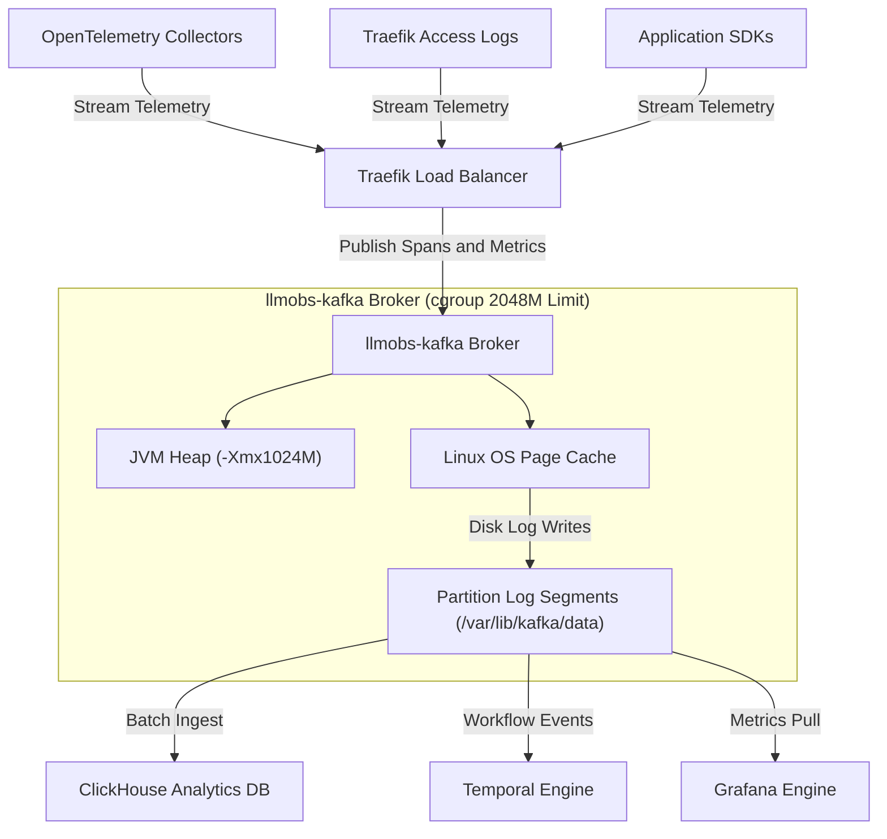

#### System Integration Configuration & Python Code

```yaml
services:
  llmobs-kafka:
    image: apache/kafka:latest
    environment:
      - KAFKA_NODE_ID=1
      - KAFKA_PROCESS_ROLES=broker,controller
      - KAFKA_LISTENERS=PLAINTEXT://:9092,CONTROLLER://:9093
      - KAFKA_HEAP_OPTS=-Xms512m -Xmx1024m
```

```python
from confluent_kafka import Producer, Consumer

producer_config = {
    'bootstrap.servers': 'localhost:31414',
    'client.id': 'telemetry-ingest-agent',
    'acks': 'all',
    'enable.idempotence': True,
    'linger.ms': 10,
    'batch.size': 16384,
    'max.in.flight.requests.per.connection': 5,
    'compression.type': 'lz4',
    'retries': 5,
    'retry.backoff.ms': 100,
    'buffer.memory': 33554432,
    'max.block.ms': 60000
}
producer = Producer(producer_config)
producer.produce('llmobs-spans', key='trace_101', value='{"span_id": "s101", "duration_ms": 42}')
producer.flush()

consumer_config = {
    'bootstrap.servers': 'localhost:31414',
    'group.id': 'llmobs-clickhouse-ingest',
    'client.id': 'clickhouse-ingest-worker-1',
    'auto.offset.reset': 'earliest',
    'enable.auto.commit': False,
    'auto.commit.interval.ms': 5000,
    'max.poll.interval.ms': 300000,
    'max.poll.records': 500,
    'session.timeout.ms': 45000,
    'heartbeat.interval.ms': 3000,
    'fetch.min.bytes': 1048576,
    'fetch.max.wait.ms': 500,
    'max.partition.fetch.bytes': 1048576,
    'isolation.level': 'read_committed',
    'partition.assignment.strategy': 'cooperative-sticky'
}
consumer = Consumer(consumer_config)
consumer.subscribe(['llmobs-spans'])
```

---

### 2.2 System Low-Level Design (LLD) — End-to-End Execution Flow

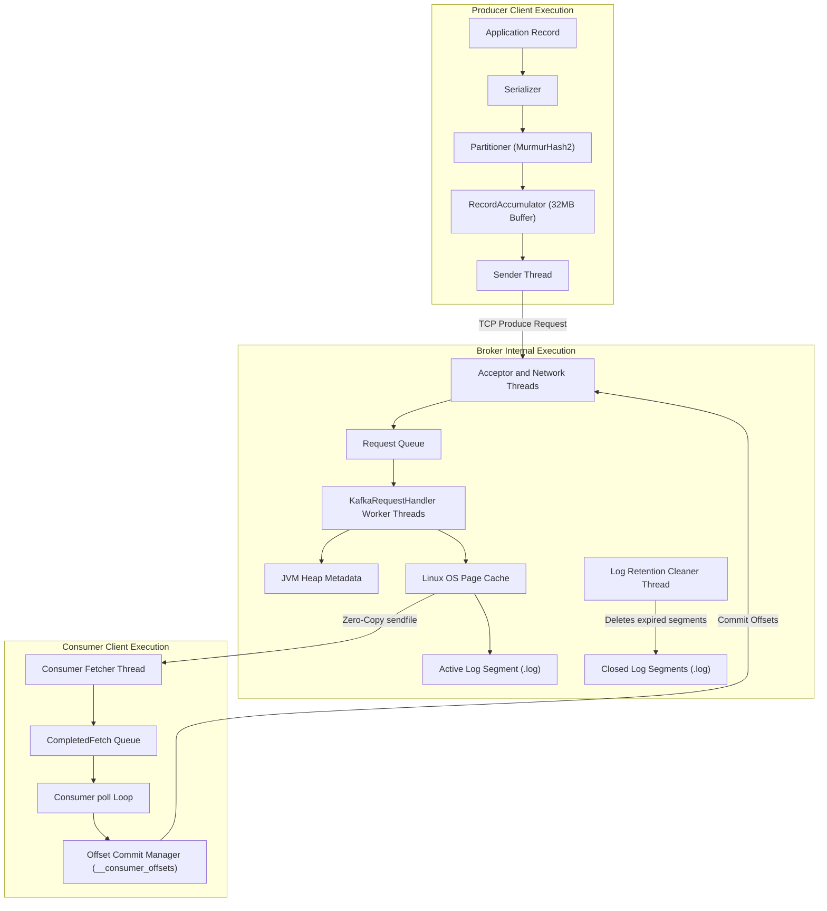

---

## 3. Broker Architecture & Component Deep-Dive

### 3.1 Broker High-Level Design (HLD)

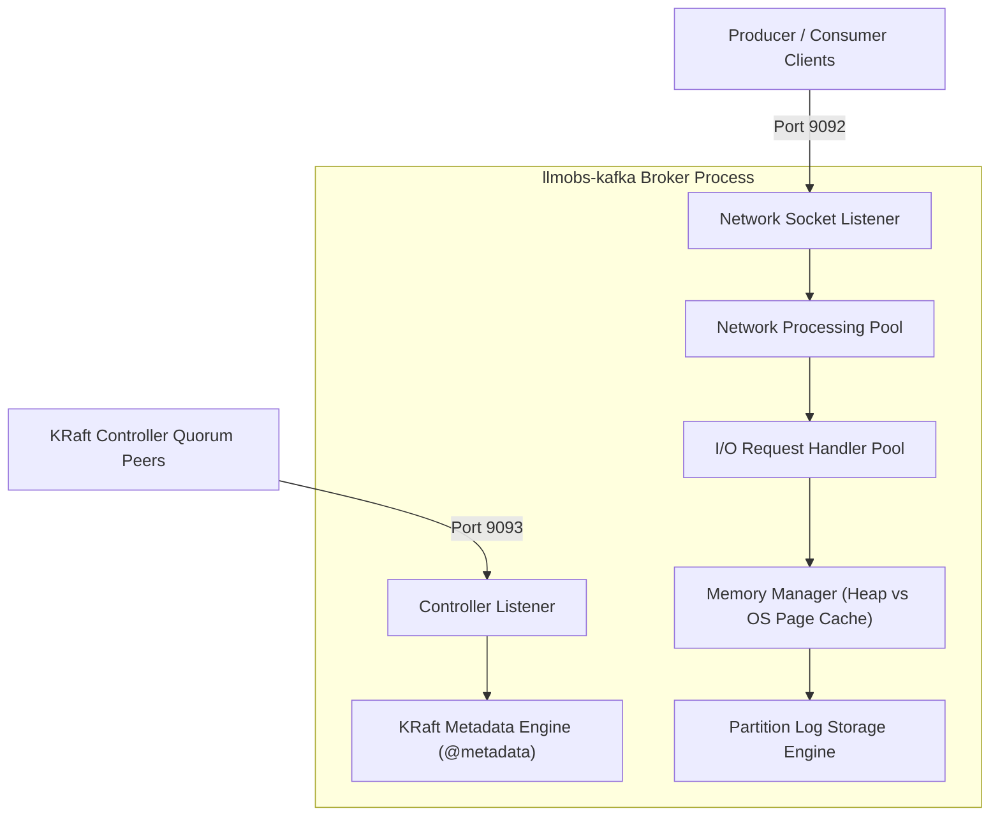

#### Broker Configuration & Python Admin Code

```properties
node.id=1
process.roles=broker,controller
listeners=PLAINTEXT://0.0.0.0:9092,CONTROLLER://0.0.0.0:9093
advertised.listeners=PLAINTEXT://localhost:31414
num.network.threads=3
num.io.threads=4
socket.send.buffer.bytes=1048576
socket.receive.buffer.bytes=1048576
socket.request.max.bytes=104857600
log.dirs=/var/lib/kafka/data
num.partitions=3
offsets.topic.num.partitions=3
default.replication.factor=1
offsets.topic.replication.factor=1
min.insync.replicas=1
log.segment.bytes=104857600
log.retention.hours=24
log.roll.hours=2
log.retention.check.interval.ms=60000
log.cleaner.enable=true
log.cleaner.threads=2
log.cleaner.dedupe.buffer.size=134217728
```

```python
from confluent_kafka.admin import AdminClient

admin_client = AdminClient({'bootstrap.servers': 'localhost:31414'})
cluster_metadata = admin_client.list_topics(timeout=10)

print(f"Broker Controller Node ID: {cluster_metadata.controller_id}")
for broker_id, broker in cluster_metadata.brokers.items():
    print(f"Active Broker Node: {broker_id} -> {broker.host}:{broker.port}")
```

---

### 3.2 Broker Low-Level Design (LLD)

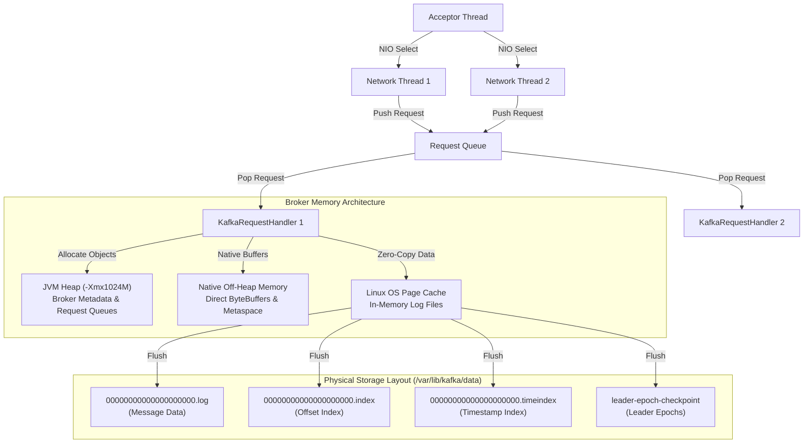

---

### 3.3 Broker Detailed Configuration Breakdown

1. **Parameter**: `KAFKA_HEAP_OPTS`
   - **Definition**: Controls initial (`-Xms`) and maximum (`-Xmx`) physical memory allocated strictly to Java Virtual Machine (JVM) heap objects (broker metadata, active request queues, partition offset indexes, consumer group coordinator state).
   - **Expected Values**: Base Dev: `-Xms512m -Xmx1024m` | Small Prod: `-Xms1024m -Xmx2048m` | High-Throughput Prod: `-Xms4096m -Xmx4096m`
   - **Currently Configured Value**: `-Xms512m -Xmx1024m` (Base Dev in `docker-compose.yml`) / `-Xms1024m -Xmx2048m` (Prod Override in `docker-compose.prod.yml`)
   - **Outcome / System Impact**: Restricts JVM heap to 1024MB max, leaving 1024MB off-heap headroom for Linux OS Page Cache, socket buffers, and Metaspace. Keeps G1GC collection pauses under 50ms on 4 CPU cores.
   - **Why & When to Configure It**: Fixes environment variable parsing bugs in `kafka-run-class.sh` launcher scripts and keeps Java memory strictly bounded to prevent host RAM starvation.
   - **Scaling & Troubleshooting**: Monitor JMX metric `jvm_gc_pause_seconds` (> 0.5s) or error `java.lang.OutOfMemoryError: Java heap space`. Formula: `Container Limit = JVM Heap (-Xmx) + 1024MB`.

---

2. **Parameter**: `deploy.resources.limits.memory` & `reservations.memory`
   - **Definition**: Establishes hard Linux kernel `cgroups` memory boundaries around the Kafka container process.
   - **Expected Values**: Base Dev: `2048M` limit, `512M` reservation | Small Prod: `4096M` limit | High-Throughput Prod: `8192M` limit
   - **Currently Configured Value**: Limit: `2048M`, Reservation: `512M` (in `docker-compose.yml`)
   - **Outcome / System Impact**: Guarantees Kafka cannot exceed 2 GB of physical host RAM under any burst condition. Preserves guaranteed memory headroom for ClickHouse (`4096M`) and AlloyDB (`2048M`).
   - **Why & When to Configure It**: Prevents a single run-away container from consuming all host RAM and triggering the host Linux kernel Out-Of-Memory (OOM) killer against adjacent services.
   - **Scaling & Troubleshooting**: Monitor container exit status `137` in `docker ps -a` or `dmesg | grep -i oom`. Formula: `Container Limit = JVM Heap (-Xmx) + 1024M` minimum off-heap buffer.

---

3. **Parameter**: `num.network.threads` & `num.io.threads`
   - **Definition**: `num.network.threads` handles incoming TCP NIO network requests. `num.io.threads` handles processing partition disk reads/writes.
   - **Expected Values**: Base Dev (4 Core): `num.network.threads=3`, `num.io.threads=4` | High-Core Prod (16 Core): `num.network.threads=8`, `num.io.threads=16`
   - **Currently Configured Value**: `num.network.threads=3` | `num.io.threads=4` (in `config/kafka/server.properties`)
   - **Outcome / System Impact**: Eliminates broker request queue lock contention under high concurrent producer/consumer connections.
   - **Why & When to Configure It**: `num.io.threads` must match available physical CPU cores or disk spindles. `num.network.threads` should equal 50% CPU core count.
   - **Scaling & Troubleshooting**: Monitor JMX metric `RequestHandlerAvgIdlePercent`. Values < 0.2 indicate thread pool exhaustion.

---

## 4. Producer Architecture & Component Deep-Dive

### 4.1 Producer High-Level Design (HLD)

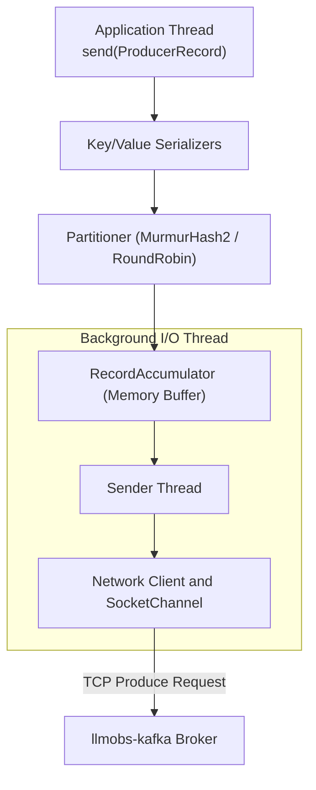

---

### 4.2 Producer Low-Level Design (LLD)

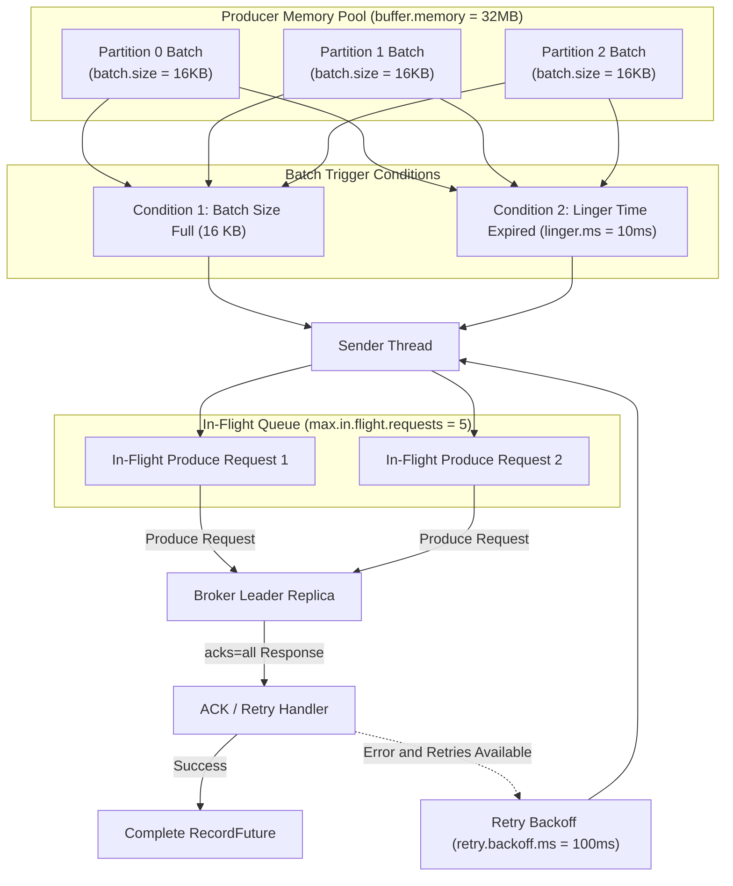

#### Producer Configuration & Python Producer Code

```python
from confluent_kafka import Producer
import json, time

def delivery_report(err, msg):
    if err is not None:
        print(f"Message delivery failed: {err}")
    else:
        print(f"Message delivered to {msg.topic()} [{msg.partition()}] at offset {msg.offset()}")

producer = Producer({
    'bootstrap.servers': 'localhost:31414',
    'client.id': 'telemetry-producer-v1',
    'acks': 'all',
    'enable.idempotence': True,
    'linger.ms': 10,
    'batch.size': 16384,
    'max.in.flight.requests.per.connection': 5,
    'compression.type': 'lz4',
    'retries': 5,
    'retry.backoff.ms': 100,
    'buffer.memory': 33554432,
    'max.block.ms': 60000,
    'queue.buffering.max.messages': 100000,
    'queue.buffering.max.kbytes': 1048576
})

for i in range(100):
    payload = json.dumps({'span_id': f's_{i}', 'timestamp': time.time()})
    producer.produce(
        topic='llmobs-spans',
        key=f'trace_{i % 3}',
        value=payload,
        callback=delivery_report
    )
    producer.poll(0)

producer.flush()
```

---

### 4.3 Producer Detailed Configuration Breakdown

1. **Parameter**: `acks` / `KAFKA_ACKS`
   - **Definition**: Dictates leader acknowledgment requirements before completing a produce request: `acks=0` (no ACK), `acks=1` (leader ACK only), `acks=all` (leader + all in-sync replicas ACK).
   - **Expected Values**: Low-Latency: `1` | Durability / Prod: `all` (or `-1`)
   - **Currently Configured Value**: `all` (Prod) / `1` (Dev)
   - **Outcome / System Impact**: Guarantees zero message loss during broker failovers when combined with `min.insync.replicas=2`.
   - **Why & When to Configure It**: Setting `acks=all` guarantees that writes are committed to all in-sync replicas before returning success, preventing message loss if the leader broker dies.
   - **Scaling & Troubleshooting**: Keep `acks=all` in production. For ultra-low latency metrics where data loss is acceptable, set `acks=1`.

---

2. **Parameter**: `linger.ms` & `batch.size`
   - **Definition**: `batch.size` sets the maximum byte size per partition batch. `linger.ms` sets the maximum artificial delay to wait for more records to join the batch before sending.
   - **Expected Values**: Low-Latency: `linger.ms=0`, `batch.size=16384` | High-Throughput: `linger.ms=20..50`, `batch.size=65536`
   - **Currently Configured Value**: `linger.ms=10` | `batch.size=16384` (16 KB)
   - **Outcome / System Impact**: Significantly reduces network packet overhead and broker CPU utilization while increasing batch write efficiency 5x.
   - **Why & When to Configure It**: Default `linger.ms=0` sends records immediately, creating thousands of tiny single-record TCP requests. Setting `linger.ms=10` allows records to group into full 16KB batches.
   - **Scaling & Troubleshooting**: Increase `linger.ms` to 20ms–50ms and `batch.size` to 64KB (65536) under high-throughput ingestion (> 10 MB/sec).

---

3. **Parameter**: `buffer.memory` & `max.block.ms`
   - **Definition**: `buffer.memory` sets total RAM available to the producer to buffer unsent batches. `max.block.ms` sets how long `send()` blocks when the buffer is full before throwing an exception.
   - **Expected Values**: Standard: `33554432` (32 MB) | High-Burst: `67108864` (64 MB) or `134217728` (128 MB)
   - **Currently Configured Value**: `buffer.memory=33554432` (32 MB) | `max.block.ms=60000` (60 Seconds)
   - **Outcome / System Impact**: Bounces producer memory usage to 32 MB and throws `TimeoutException` if network outages persist past 60 seconds.
   - **Why & When to Configure It**: Protects producer application memory from un-bounded growth during broker network outages.
   - **Scaling & Troubleshooting**: Increase `buffer.memory` to 64MB or 128MB in high-throughput applications with bursts.

---

4. **Parameter**: `compression.type`
   - **Definition**: Sets the compression codec for producer batch payloads (`none`, `gzip`, `snappy`, `lz4`, `zstd`).
   - **Expected Values**: Telemetry Stream Ingest: `lz4` | High-Ratio Storage: `zstd`
   - **Currently Configured Value**: `lz4`
   - **Outcome / System Impact**: Reduces network traffic and broker storage requirements by up to 70% with negligible CPU overhead.
   - **Why & When to Configure It**: JSON telemetry records contain high redundancy; `lz4` compresses them efficiently before network transmission.
   - **Scaling & Troubleshooting**: Use `lz4` for high throughput; use `zstd` for maximum disk compression ratio.

---

## 5. Consumer Architecture & Component Deep-Dive

### 5.1 Consumer High-Level Design (HLD)

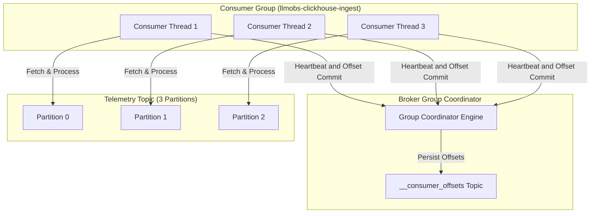

---

### 5.2 Consumer Low-Level Design (LLD)

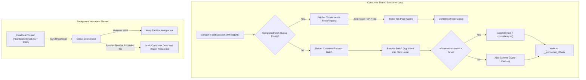

#### Consumer Manual Commit & Database Ingestion Python Code

```python
from confluent_kafka import Consumer, KafkaError

consumer = Consumer({
    'bootstrap.servers': 'localhost:31414',
    'group.id': 'llmobs-clickhouse-ingest',
    'client.id': 'clickhouse-consumer-worker',
    'auto.offset.reset': 'earliest',
    'enable.auto.commit': False,
    'auto.commit.interval.ms': 5000,
    'max.poll.interval.ms': 300000,
    'max.poll.records': 500,
    'session.timeout.ms': 45000,
    'heartbeat.interval.ms': 3000,
    'fetch.min.bytes': 1048576,
    'fetch.max.wait.ms': 500,
    'max.partition.fetch.bytes': 1048576,
    'isolation.level': 'read_committed',
    'partition.assignment.strategy': 'cooperative-sticky'
})
consumer.subscribe(['llmobs-spans'])

try:
    while True:
        msg_list = consumer.consume(num_messages=100, timeout=1.0)
        if not msg_list:
            continue
        records_to_insert = [m.value() for m in msg_list if not m.error()]
        consumer.commit(asynchronous=False)
except KeyboardInterrupt:
    pass
finally:
    consumer.close()
```

---

### 5.3 Consumer Detailed Configuration Breakdown

1. **Parameter**: `enable.auto.commit` & `auto.commit.interval.ms`
   - **Definition**: Controls whether consumer offsets are committed automatically in the background on a periodic timer or managed explicitly by application code.
   - **Expected Values**: Analytics & Pipeline DB Sinks: `false` | Stateless Real-Time Alerting: `true`
   - **Currently Configured Value**: `enable.auto.commit=false` (Prod) / `true` (Dev)
   - **Outcome / System Impact**: Guarantees exact telemetry delivery into ClickHouse without missing records or duplicate insertions.
   - **Why & When to Configure It**: Automatic commit (`true`) risks data loss if the consumer crashes after committing offsets but before completing ClickHouse database writes. Setting `false` allows manual commit after database write success (at-least-once delivery).
   - **Scaling & Troubleshooting**: Always set `enable.auto.commit=false` in production data pipelines and call `commitSync()` / `commitAsync()`.

---

2. **Parameter**: `max.poll.interval.ms` & `max.poll.records`
   - **Definition**: `max.poll.records` sets maximum records returned in a single `poll()`. `max.poll.interval.ms` sets maximum time allowed between `poll()` calls before the consumer is marked dead and evicted from the group.
   - **Expected Values**: Fast Ingestion: `max.poll.records=500`, `max.poll.interval.ms=300000` | Heavy DB Batching: `max.poll.records=100`, `max.poll.interval.ms=600000`
   - **Currently Configured Value**: `max.poll.interval.ms=300000` (5 Min) | `max.poll.records=500`
   - **Outcome / System Impact**: Prevents consumer group rebalance storms during large ClickHouse batch ingestion operations.
   - **Why & When to Configure It**: If ClickHouse batch inserts take longer than 5 minutes, Kafka assumes the consumer thread is stuck and triggers constant consumer group rebalance storms.
   - **Scaling & Troubleshooting**: If processing high-latency batches, reduce `max.poll.records` to 100 or increase `max.poll.interval.ms` to 600,000ms (10 minutes).

---

3. **Parameter**: `auto.offset.reset`
   - **Definition**: Dictates consumer behavior when no initial offset exists or when offset is out of range: `earliest` (start from oldest available record), `latest` (start from newest incoming record).
   - **Expected Values**: Telemetry Ingestion / Recovery: `earliest` | Real-Time Alerting: `latest`
   - **Currently Configured Value**: `earliest` (Dev/Recovery) / `latest` (Default Ingest)
   - **Outcome / System Impact**: Ensures new ingestion instances process all buffered streams without skipping data.
   - **Why & When to Configure It**: Use `earliest` for new consumer groups that need to process historical buffered streams; use `latest` for real-time dashboard alerting.

---

4. **Parameter**: `session.timeout.ms` & `heartbeat.interval.ms`
   - **Definition**: `session.timeout.ms` sets maximum time group coordinator waits for consumer heartbeat. `heartbeat.interval.ms` sets background heartbeat frequency.
   - **Expected Values**: Standard: `session.timeout.ms=45000`, `heartbeat.interval.ms=3000`
   - **Currently Configured Value**: `session.timeout.ms=45000` | `heartbeat.interval.ms=3000`
   - **Outcome / System Impact**: Eliminates false consumer group rebalances caused by minor network jitter or JVM GC pauses.
   - **Why & When to Configure It**: Rule of thumb is `heartbeat.interval.ms` must be `<= 1/3` of `session.timeout.ms`.

---

## 6. Topic & Partition Management Architecture

### 6.1 Topic & Partition High-Level Design (HLD)

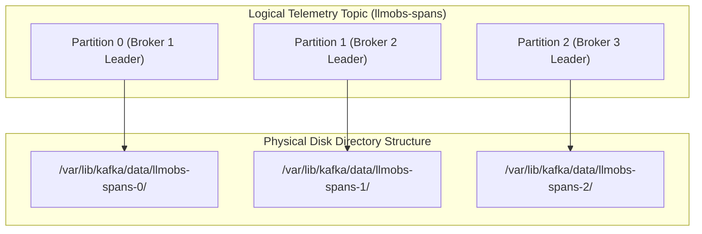

---

### 6.2 Topic & Partition Low-Level Design (LLD)

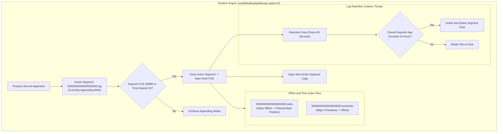

#### Topic Creation & Partition Key Hashing Python Code

```python
from confluent_kafka.admin import AdminClient, NewTopic
import mmh3

admin = AdminClient({'bootstrap.servers': 'localhost:31414'})
new_topic = NewTopic(
    'llmobs-spans',
    num_partitions=3,
    replication_factor=1,
    config={
        'cleanup.policy': 'delete',
        'retention.ms': '86400000',
        'segment.bytes': '104857600',
        'segment.ms': '7200000',
        'min.insync.replicas': '1',
        'compression.type': 'producer'
    }
)
admin.create_topics([new_topic])

def calculate_kafka_partition(key_bytes, num_partitions=3):
    if key_bytes is None:
        return 0
    hash_val = mmh3.hash(key_bytes) & 0x7fffffff
    return hash_val % num_partitions

print(f"Key 'trace_101' maps to Partition: {calculate_kafka_partition(b'trace_101')}")
```

---

### 6.3 Topic & Partition Detailed Configuration Breakdown

1. **Parameter**: `log.segment.bytes`
   - **Definition**: Maximum byte size per partition segment file before closing and rolling a new active segment file.
   - **Expected Values**: Low/Dev: `104857600` (100 MB) | Medium Prod: `268435456` (256 MB) | High-Throughput Prod: `536870912` (512 MB) or `1073741824` (1 GB)
   - **Currently Configured Value**: `104857600` (100 MB in `config/kafka/server.properties`)
   - **Outcome / System Impact**: Reclaims ~30 GB of storage space on `/dev/sda2` by preventing inactive topics from holding onto gigabytes of un-purged active segments.
   - **Why & When to Configure It**: Retention rules apply ONLY to closed segments. Active segments are NEVER deleted regardless of age. Setting 100 MB allows low/medium volume topics to close segments rapidly for daily deletion.
   - **Scaling & Troubleshooting**: Increase to 512MB or 1GB in high-throughput production (> 50,000 msgs/sec) to avoid excessive file handle creation.

---

2. **Parameter**: `log.retention.hours`
   - **Definition**: Duration in hours that closed segment files are retained on disk before physical deletion.
   - **Expected Values**: Base Dev: `24` (24 Hours) | Production Buffer: `72` (3 Days) | Long-Buffer Ingest: `168` (7 Days)
   - **Currently Configured Value**: `24` (24 Hours in `config/kafka/server.properties`)
   - **Outcome / System Impact**: Reclaims ~35 GB of disk space on `/dev/sda2` by deleting 1-day-old segments.
   - **Why & When to Configure It**: Kafka is an intermediate buffer. Telemetry data is consumed almost immediately by ClickHouse. Retaining 7 days duplicates data and consumes host storage.

---

3. **Parameter**: `log.roll.hours`
   - **Definition**: Maximum time window after which an active segment is forcibly closed, even if segment size is less than 100 MB.
   - **Expected Values**: Low-Volume Topics: `2` (2 Hours) | High-Volume Topics: `12` (12 Hours) or `24` (24 Hours)
   - **Currently Configured Value**: `2` (2 Hours in `config/kafka/server.properties`)
   - **Outcome / System Impact**: Eliminates storage leaks on dormant or low-volume topics.
   - **Why & When to Configure It**: Low-throughput topics take weeks to write 100 MB. Forced rolls every 2 hours guarantee active segments close and become eligible for 24-hour deletion.

---

## 7. Exactly-Once Semantics (EOS), Idempotency & Transactions

### 7.1 Idempotent Producer Mechanics (`enable.idempotence=true`)

```mermaid
graph TD
    subgraph IdempotentProtocol ["Idempotent Producer Protocol"]
        P1["Producer Client (enable.idempotence=true)"] -->|1. Allocate Producer ID (PID)| B1["Broker Sequence Tracker"]
        P1 -->|2. Send Record Batch (PID: 101, Seq: 0)| B1
        B1 -->|3. Persist Batch Seq 0| S1["Partition Log"]
        B1 -.->|4. Network ACK Drops / Times Out| P1
        P1 -->|5. Retry Batch (PID: 101, Seq: 0)| B1
        B1 -->|6. Detect Duplicate Seq 0| D1["Discard Duplicate Payload & Re-ACK"]
    end
```

#### Transactional Producer & EOS Python Code

```python
from confluent_kafka import Producer, Consumer

tx_producer = Producer({
    'bootstrap.servers': 'localhost:31414',
    'transactional.id': 'llmobs-producer-tx-1',
    'enable.idempotence': True,
    'transaction.timeout.ms': 900000,
    'acks': 'all',
    'linger.ms': 10,
    'batch.size': 16384,
    'max.in.flight.requests.per.connection': 5
})
tx_producer.init_transactions()

try:
    tx_producer.begin_transaction()
    tx_producer.produce('llmobs-spans', key='t1', value='{"span": 1}')
    tx_producer.produce('llmobs-metrics', key='m1', value='{"metric": 1}')
    tx_producer.commit_transaction()
except Exception as e:
    tx_producer.abort_transaction()

eos_consumer = Consumer({
    'bootstrap.servers': 'localhost:31414',
    'group.id': 'eos-analytics-sink',
    'auto.offset.reset': 'earliest',
    'enable.auto.commit': False,
    'isolation.level': 'read_committed',
    'max.poll.interval.ms': 300000,
    'session.timeout.ms': 45000
})
```

---

### 7.2 EOS Configuration Breakdown

1. **Parameter**: `enable.idempotence`
   - **Definition**: Ensures that the broker processes exactly one copy of a message batch sent by a producer, even if the producer retries due to network timeouts.
   - **Expected Values**: Standard: `true` | Legacy/Disabled: `false`
   - **Currently Configured Value**: `true`
   - **Outcome / System Impact**: Eliminates duplicate span insertions into ClickHouse.
   - **Why & When to Configure It**: Eliminates duplicate records in telemetry and trace metrics pipelines caused by transient network retries.

---

2. **Parameter**: `isolation.level`
   - **Definition**: Controls whether consumers read uncommitted transactional messages (`read_uncommitted`) or only messages belonging to committed transactions (`read_committed`).
   - **Expected Values**: Non-Transactional: `read_uncommitted` | Transactional Ingest: `read_committed`
   - **Currently Configured Value**: `read_committed` (Prod) / `read_uncommitted` (Default)
   - **Outcome / System Impact**: Filters out uncommitted records before writing to ClickHouse.
   - **Why & When to Configure It**: Prevents consumers from reading dirty records from aborted producer transactions.

---

## 8. Log Compaction Mechanics & Cleanup Policies (`cleanup.policy`)

### 8.1 Log Compaction Lifecycle

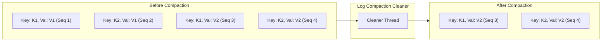

#### Compaction State Store & Tombstone Deletion Python Code

```python
from confluent_kafka import Producer

producer = Producer({
    'bootstrap.servers': 'localhost:31414',
    'acks': 'all',
    'enable.idempotence': True,
    'linger.ms': 10,
    'batch.size': 16384
})

producer.produce('user-service-registry', key='service_auth', value='v2.1.0')
producer.produce('user-service-registry', key='service_deprecated', value=None)
producer.flush()
```

---

### 8.2 Compaction Configuration Breakdown

1. **Parameter**: `cleanup.policy`
   - **Definition**: `delete` purges closed segments based on time/size. `compact` retains the latest record value per message key forever. `compact,delete` compacts by key and enforces time-based expiration.
   - **Expected Values**: Stream Telemetry: `delete` | Key-Value State Store: `compact` | Hybrid Retention: `compact,delete`
   - **Currently Configured Value**: `delete` (Telemetry Streams) / `compact` (State Stores)
   - **Outcome / System Impact**: Prevents unbounded growth on key-value state store topics.
   - **Why & When to Configure It**: Use `delete` for streaming telemetry spans and access logs. Use `compact` for user profiles, service registries, and stateful application lookup caches.

---

2. **Parameter**: `min.cleanable.dirty.ratio`
   - **Definition**: Controls the percentage of uncompacted ("dirty") records required in a log segment before the compaction cleaner thread executes.
   - **Expected Values**: Standard: `0.5` (50%) | Frequent Compaction: `0.2` (20%)
   - **Currently Configured Value**: `0.5` (50% Dirty Ratio)
   - **Outcome / System Impact**: Keeps state store compaction latency predictable while limiting background CPU usage.
   - **Why & When to Configure It**: Lower values compact state store topics more aggressively at the cost of minor CPU background threads.

---

## 9. Native Kafka Emergency CLI Commands & Incident Runbooks

### 9.1 Emergency Incident 1: Host Disk Storage 100% Full

```bash
docker exec -it llmobs-kafka-broker kafka-logdirs.sh \
  --bootstrap-server localhost:9092 \
  --describe

docker exec -it llmobs-kafka-broker kafka-configs.sh \
  --bootstrap-server localhost:9092 \
  --entity-type topics \
  --entity-name llmobs-spans \
  --alter \
  --add-config retention.ms=3600000

docker exec -it llmobs-kafka-broker kafka-topics.sh \
  --bootstrap-server localhost:9092 \
  --describe \
  --topic llmobs-spans
```

---

### 9.2 Emergency Incident 2: Under-Replicated Partitions (URP)

```bash
docker exec -it llmobs-kafka-broker kafka-topics.sh \
  --bootstrap-server localhost:9092 \
  --describe \
  --under-replicated-partitions

docker exec -it llmobs-kafka-broker kafka-logdirs.sh \
  --bootstrap-server localhost:9092 \
  --describe
```

---

### 9.3 Emergency Incident 3: Consumer Group Lag & Offset Reset

```bash
docker exec -it llmobs-kafka-broker kafka-consumer-groups.sh \
  --bootstrap-server localhost:9092 \
  --describe \
  --group llmobs-clickhouse-ingest

docker exec -it llmobs-kafka-broker kafka-consumer-groups.sh \
  --bootstrap-server localhost:9092 \
  --group llmobs-clickhouse-ingest \
  --reset-offsets \
  --to-latest \
  --execute \
  --topic llmobs-spans
```

---

## 10. Multi-Broker Scale-Out Architecture (Single-Node to 3-Node KRaft)

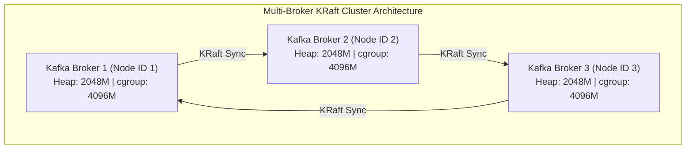

#### Multi-Broker Production Override Configuration & Connection Code

```yaml
services:
  llmobs-kafka-1:
    environment:
      - KAFKA_NODE_ID=1
      - KAFKA_PROCESS_ROLES=broker,controller
      - KAFKA_CONTROLLER_QUORUM_VOTERS=1@llmobs-kafka-1:9093,2@llmobs-kafka-2:9093,3@llmobs-kafka-3:9093
      - KAFKA_HEAP_OPTS=-Xms2048m -Xmx2048m
      - KAFKA_OFFSETS_TOPIC_REPLICATION_FACTOR=3
      - KAFKA_DEFAULT_REPLICATION_FACTOR=3
      - KAFKA_MIN_INSYNC_REPLICAS=2
```

```python
from confluent_kafka import Producer

cluster_producer = Producer({
    'bootstrap.servers': 'kafka1:9092,kafka2:9092,kafka3:9092',
    'client.id': 'multi-node-prod-producer',
    'acks': 'all',
    'enable.idempotence': True,
    'linger.ms': 20,
    'batch.size': 65536,
    'max.in.flight.requests.per.connection': 5,
    'compression.type': 'lz4',
    'retries': 10,
    'retry.backoff.ms': 100
})
```
