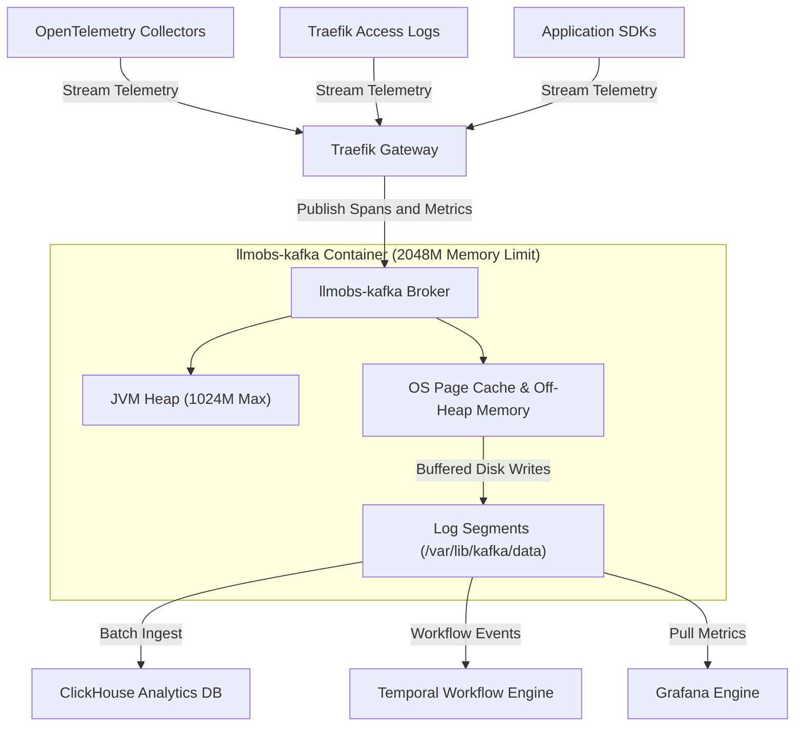
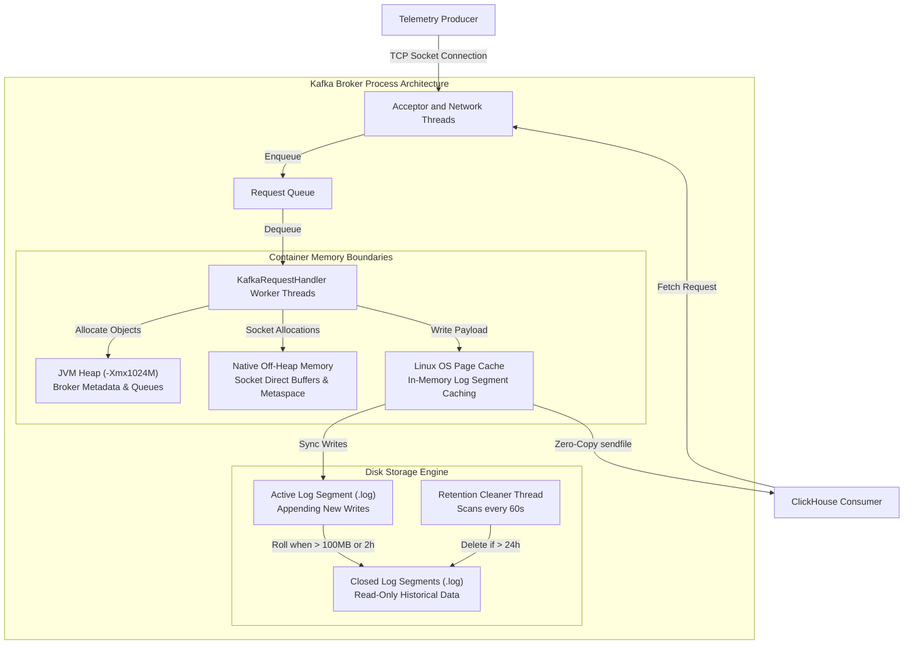
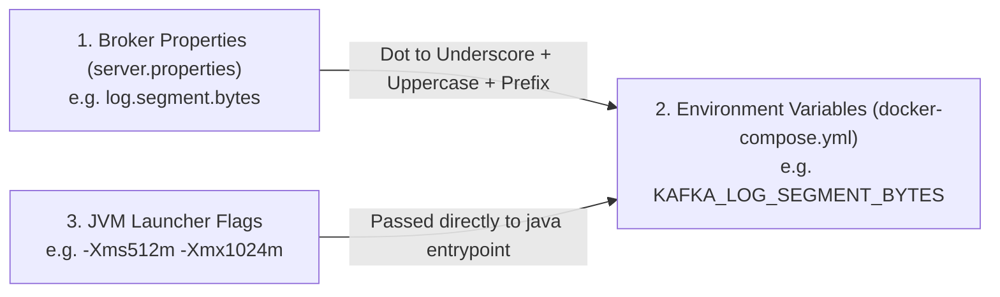
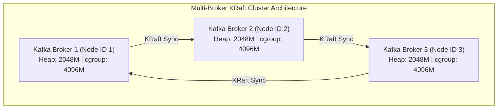

# Apache Kafka Configuration & Operational Deep-Dive Reference Guide

## 1. System High-Level (HLD) & Low-Level (LLD) Design Architecture

### 1.1 High-Level Architecture (HLD) — Observability Data Pipeline

In the llm-obs-infra architecture, Apache Kafka operates as the decoupled streaming buffer that separates high-frequency telemetry ingestion from heavy analytical query engines.

---

### 1.2 Low-Level Architecture (LLD) — Broker Internal Thread & Memory Execution Model

When a producer writes telemetry data or a consumer fetches records, Kafka processes the request through an internal thread and memory pipeline:

---

## 2. Kafka Configuration Parameter Naming Conventions & Genesis

Kafka configuration parameters follow three distinct naming conventions depending on where and how they are defined:

### Naming Conventions Breakdown

| Convention Type | Target Environment | Formatting Pattern & Rules | Example Parameter |
|---|---|---|---|
| **1. Broker Properties** | `config/kafka/server.properties` | **Hierarchical Dot-Notation**: Grouped by functional subsystem (`log.*`, `offsets.topic.*`, `num.partitions`, `transaction.state.log.*`). | `log.segment.bytes` |
| **2. Environment Variables** | `docker-compose.yml` | **Uppercase Underscore Mapping**: Standard Confluent/Docker convention. Prepend `KAFKA_`, convert to uppercase, and replace dots (`.`) with underscores (`_`). | `KAFKA_LOG_SEGMENT_BYTES` |
| **3. JVM Launcher Options** | Container `entrypoint` / Compose `env` | **Standard Java Options**: `-Xms` (Initial Memory Size), `-Xmx` (Maximum Memory Size), and `-XX:` (Expert Garbage Collection / Metaspace options). | `KAFKA_HEAP_OPTS="-Xms512m -Xmx1024m"` |

---

## 3. Categorized Parameter Deep-Dive & Detailed Tables

---

### 3.1 Resource & Memory Management Parameters

#### 3.1.1 `KAFKA_HEAP_OPTS` — JVM Heap Memory Sizing

| Dimension | Detailed Technical Specifications & Operational Guidance |
|---|---|
| **Parameter Key** | `KAFKA_HEAP_OPTS` |
| **File Location & Target** | [`docker-compose.yml`](file:///home/btpl-lap-22/live/llm-obs-infra/docker-compose.yml) (Line 115) & [`docker-compose.prod.yml`](file:///home/btpl-lap-22/live/llm-obs-infra/docker-compose.prod.yml) (Line 12) |
| **Configured Value** | `-Xms512m -Xmx1024m` *(Dev/Base)* \| `-Xms1024m -Xmx2048m` *(Prod)* |
| **Apache Kafka Default** | `-Xms1G -Xmx1G` (hardcoded inside native launcher `kafka-server-start.sh`) |
| **Criticality Rating** | CRITICAL |
| **1. What Is This Parameter?** | Sets the initial (`-Xms`) and maximum (`-Xmx`) physical RAM allocated strictly to Java heap objects (broker metadata, active request objects, topic partition indexes, consumer group metadata). |
| **2. Why & When to Use It** | **Why It Is Useful**: Bounds JVM memory usage to prevent arbitrary allocation that starves host RAM. **Why We Configured It**: The stack previously used `KAFKA_JVM_PERFORMANCE_OPTS`. Kafka's `kafka-run-class.sh` launcher script parses `KAFKA_JVM_PERFORMANCE_OPTS` strictly for Garbage Collection options (e.g., `-XX:+UseG1GC`). Passing heap options inside performance flags caused startup script concatenation errors, reverting to `-Xmx1G -Xms1G`. **Criticality**: CRITICAL. An unconfigured heap causes JVM memory crashes or triggers host OOM killers. |
| **3. Impact on Current System** | **RAM Impact**: Restricts JVM heap strictly between 512 MB and 1024 MB in base mode. **Off-Heap Headroom**: Leaves ~1024 MB headroom inside the 2048M container limit for OS page cache, Metaspace, and TCP socket buffers. **GC Performance**: Reduces G1GC pause durations to < 50ms on 4 CPU cores. |
| **4. How & Why to Scale / Increase** | **Monitoring Metrics**: JMX metric `jvm_gc_pause_seconds` > 0.5s or error `java.lang.OutOfMemoryError: Java heap space`. **When to Increase**: Active client connections exceed 1,000 or telemetry payload throughput exceeds 20 MB/sec. **Scaling Rule**: `Container Limit = JVM Heap (-Xmx) + 1024MB`. |

---

#### 3.1.2 `deploy.resources.limits.memory` — Docker Container Memory Ceiling

| Dimension | Detailed Technical Specifications & Operational Guidance |
|---|---|
| **Parameter Key** | `deploy.resources.limits.memory` & `reservations.memory` |
| **File Location & Target** | [`docker-compose.yml`](file:///home/btpl-lap-22/live/llm-obs-infra/docker-compose.yml) (Lines 94-99) |
| **Configured Value** | Limit: `2048M` \| Reservation: `512M` |
| **Apache Kafka Default** | Unbounded (`None`) |
| **Criticality Rating** | CRITICAL |
| **1. What Is This Parameter?** | Establishes hard Linux kernel `cgroups` memory boundaries around the Kafka container process. |
| **2. Why & When to Use It** | **Why It Is Useful**: Prevents a single run-away container from consuming all host RAM and crashing adjacent services. **Why We Configured It**: Unbounded container memory exposes the 15 GB host to host-wide OOM crashes. Kafka requires non-heap native memory for direct ByteBuffers, thread stacks, and OS page cache. **Criticality**: CRITICAL. Without container limits on a shared host, a spike in telemetry traffic triggers the Linux kernel OOM killer against random system services. |
| **3. Impact on Current System** | **Host Protection**: Guarantees Kafka cannot exceed 2 GB of physical host RAM. **Coexistence**: Preserves guaranteed memory headroom for ClickHouse (`4096M`) and AlloyDB (`2048M`). |
| **4. How & Why to Scale / Increase** | **Monitoring Metrics**: Container status `Exit 137` in `docker ps -a` or `dmesg \| grep -i oom`. **When to Increase**: When scaling JVM Heap (`-Xmx`) above 1 GB. **Scaling Rule**: `Container Limit = JVM Heap (-Xmx) + 1024M` (minimum 1 GB off-heap buffer). |

---

### 3.2 Storage Engine & Retention Parameters

#### 3.2.1 `log.segment.bytes` — Partition Log Segment File Size

| Dimension | Detailed Technical Specifications & Operational Guidance |
|---|---|
| **Parameter Key** | `log.segment.bytes` |
| **File Location & Target** | [`config/kafka/server.properties`](file:///home/btpl-lap-22/live/llm-obs-infra/config/kafka/server.properties) (Line 15) |
| **Configured Value** | `104857600` (100 MB) |
| **Apache Kafka Default** | `1073741824` (1 GB) |
| **Criticality Rating** | CRITICAL |
| **1. What Is This Parameter?** | Specifies the maximum byte size of an individual log segment file (`.log`). When an active segment reaches this size, Kafka closes it and creates a new active segment file. |
| **2. Why & When to Use It** | **Why It Is Useful**: CRITICAL KAFKA MECHANIC: Retention rules (time or size based) apply ONLY to closed segments. Active segments are NEVER deleted regardless of age. **Why We Configured It**: Under default 1 GB segment settings, low-throughput dev/staging topics take weeks to accumulate 1 GB of logs. The segment remains active indefinitely, old test data is never deleted, and host storage space (`/dev/sda2`) fills up continuously. **Criticality**: CRITICAL for storage management on non-enterprise disk volumes. |
| **3. Impact on Current System** | **Faster File Roll**: Active log files reach 100 MB rapidly and close, allowing Kafka's retention cleaner thread to purge old segments daily. **Disk Space Bounding**: Reclaims up to 30 GB of disk space on `/dev/sda2` by preventing inactive topics from holding onto gigabytes of stale active segments. |
| **4. How & Why to Scale / Increase** | **When to Increase**: In high-throughput production (> 50,000 messages/sec), small segment files cause excessive open file descriptors and disk index fragmentation. **Scaling Values**: Low/Dev: `100 MB` \| Medium Prod: `256 MB` \| High-Throughput Prod: `512 MB` or `1 GB`. |

---

#### 3.2.2 `log.retention.hours` — Closed Log Lifetime

| Dimension | Detailed Technical Specifications & Operational Guidance |
|---|---|
| **Parameter Key** | `log.retention.hours` |
| **File Location & Target** | [`config/kafka/server.properties`](file:///home/btpl-lap-22/live/llm-obs-infra/config/kafka/server.properties) (Line 16) |
| **Configured Value** | `24` (24 Hours / 1 Day) |
| **Apache Kafka Default** | `168` (168 Hours / 7 Days) |
| **Criticality Rating** | HIGH |
| **1. What Is This Parameter?** | Sets the duration in hours that closed segment files are retained on disk before physical deletion. |
| **2. Why & When to Use It** | **Why It Is Useful**: Kafka is an intermediate buffer. Telemetry data is consumed almost immediately by OpenTelemetry Collector and ClickHouse. **Why We Configured It**: Retaining 7 days of stream logs in Kafka duplicates data already stored in ClickHouse and unnecessarily consumes host storage. 24 hours provides ample time for consumers to process streams while conserving disk space. **Criticality**: HIGH. |
| **3. Impact on Current System** | **Storage Footprint**: Bounds Kafka's total disk overhead to approximately **1 day** of streaming data. **Disk Space Reclamation**: Frees ~35 GB of disk space compared to the 7-day default on `/dev/sda2`. |
| **4. How & Why to Scale / Increase** | **When to Increase**: If downstream consumer services (ClickHouse ingestion, temporal workflows) experience multi-day downtime and require replaying messages older than 24 hours. **Scaling Values**: Dev: `24h` \| Production Buffer: `72h` (3 days). |

---

#### 3.2.3 `log.roll.hours` — Time-Based Segment Rolling

| Dimension | Detailed Technical Specifications & Operational Guidance |
|---|---|
| **Parameter Key** | `log.roll.hours` |
| **File Location & Target** | [`config/kafka/server.properties`](file:///home/btpl-lap-22/live/llm-obs-infra/config/kafka/server.properties) (Line 17) |
| **Configured Value** | `2` (2 Hours) |
| **Apache Kafka Default** | `168` (168 Hours / 7 Days) |
| **Criticality Rating** | HIGH |
| **1. What Is This Parameter?** | Enforces a maximum time window after which an active segment is forcibly closed, even if it has not reached `log.segment.bytes` (100 MB). |
| **2. Why & When to Use It** | **Why It Is Useful**: Low-throughput topics (e.g., control plane heartbeats) might take weeks to write 100 MB. Without time-based rolling, active segments on dormant topics would remain open indefinitely, bypassing retention rules. **Why We Configured It**: Setting `log.roll.hours=2` guarantees that every active segment closes within 2 hours regardless of throughput, enabling 24-hour retention deletion on schedule. **Criticality**: HIGH for environments with mixed high/low volume topics. |
| **3. Impact on Current System** | **Guaranteed Deletion Cycle**: Ensures all topics close active segments every 2 hours, making them eligible for deletion within 24–26 hours. **Eliminates Storage Leaks**: Prevents dormant topics from holding open segment references indefinitely. |
| **4. How & Why to Scale / Increase** | **When to Increase**: In high-throughput production environments where all topics write 100 MB+ every few minutes, explicit time-based rolling is redundant. **Recommended Production Values**: `log.roll.hours=12` or `24`. |

---

#### 3.2.4 `log.retention.check.interval.ms` — Retention Evaluation Frequency

| Dimension | Detailed Technical Specifications & Operational Guidance |
|---|---|
| **Parameter Key** | `log.retention.check.interval.ms` |
| **File Location & Target** | [`config/kafka/server.properties`](file:///home/btpl-lap-22/live/llm-obs-infra/config/kafka/server.properties) (Line 18) |
| **Configured Value** | `60000` (60 Seconds) |
| **Apache Kafka Default** | `300000` (5 Minutes) |
| **Criticality Rating** | MEDIUM |
| **1. What Is This Parameter?** | Controls how frequently the background log cleaner thread scans partition directories to evaluate segment expiration. |
| **2. Why & When to Use It** | **Why It Is Useful**: Reduces the delay between a segment expiring (passing 24 hours) and its physical deletion from disk. **Why We Configured It**: Shortening the check interval to 60 seconds ensures expired segments are unlinked almost immediately after reaching their 24-hour limit on disk-constrained systems (`/dev/sda2`). **Criticality**: MEDIUM. |
| **3. Impact on Current System** | **Rapid Space Recovery**: Reclaims disk space within 60 seconds of segment expiration. **Low CPU Overhead**: Checking file metadata once per minute consumes less than 0.1% CPU on 4 cores. |
| **4. How & Why to Scale / Increase** | **When to Increase**: Only if a cluster hosts tens of thousands of partitions, where scanning partition directories every 60 seconds generates excessive disk metadata I/O. **Recommended Production Value**: `300000` (5 minutes). |

---

### 3.3 Topic & Partition Management Parameters

#### 3.3.1 `num.partitions` — Default Topic Parallelism

| Dimension | Detailed Technical Specifications & Operational Guidance |
|---|---|
| **Parameter Key** | `num.partitions` / `KAFKA_NUM_PARTITIONS` |
| **File Location & Target** | [`config/kafka/server.properties`](file:///home/btpl-lap-22/live/llm-obs-infra/config/kafka/server.properties) (Line 12) & [`docker-compose.yml`](file:///home/btpl-lap-22/live/llm-obs-infra/docker-compose.yml) (Line 114) |
| **Configured Value** | `3` |
| **Apache Kafka Default** | `1` |
| **Criticality Rating** | HIGH |
| **1. What Is This Parameter?** | Sets the default number of parallel log partitions created when a new topic is created automatically. |
| **2. Why & When to Use It** | **Why It Is Useful**: Kafka achieves consumer parallelism through partitions. Each partition is assigned to one consumer thread within a group. **Why We Configured It**: Setting `num.partitions=3` enables 3 consumer threads to process streaming telemetry concurrently across the 4 host CPU cores. **Criticality**: HIGH. |
| **3. Impact on Current System** | **Parallel Processing**: Enables parallel data streaming across 3 worker threads. **CPU Alignment**: Matches 4-core host CPU architecture cleanly without context-switching thrash. |
| **4. How & Why to Scale / Increase** | **When to Increase**: When consumer processing lag builds up on high-throughput topics and consumer services have available CPU cores. **Scaling Rule**: `Topic Partitions = Target Consumer Threads` (equal to or a multiple of CPU cores). |

---

#### 3.3.2 `offsets.topic.num.partitions` — Internal Offset Topic Partitions

| Dimension | Detailed Technical Specifications & Operational Guidance |
|---|---|
| **Parameter Key** | `offsets.topic.num.partitions` |
| **File Location & Target** | [`config/kafka/server.properties`](file:///home/btpl-lap-22/live/llm-obs-infra/config/kafka/server.properties) (Line 19) |
| **Configured Value** | `3` |
| **Apache Kafka Default** | `50` |
| **Criticality Rating** | HIGH |
| **1. What Is This Parameter?** | Sets the partition count for Kafka's internal `__consumer_offsets` topic, which stores consumer group commit progress. |
| **2. Why & When to Use It** | **Why It Is Useful**: Default 50 partitions pre-allocate 50 directory folders and 200+ index/log files. On single-broker infrastructure with only 3–5 consumer groups, 50 partitions waste file descriptors (`nofile`) and system inodes. **Why We Configured It**: Cutting partition count to 3 saves 47 directories and ~188 open file handles inside the container. **Criticality**: HIGH for single-broker or small cluster deployments. |
| **3. Impact on Current System** | **Directory Footprint**: Reduces internal topic folder bloat from 50 directories down to **3 directories**. **File Descriptor Conservation**: Saves file handles and system inodes. |
| **4. How & Why to Scale / Increase** | **When to Increase**: In large production clusters with hundreds of distinct consumer groups, increasing offset topic partitions prevents consumer commit lock contention. **Scaling Values**: Dev: `3` \| Production (<100 groups): `10` \| Enterprise (200+ groups): `50`. |

---

#### 3.3.3 `auto.create.topics.enable` — Explicit Topic Creation Guard

| Dimension | Detailed Technical Specifications & Operational Guidance |
|---|---|
| **Parameter Key** | `auto.create.topics.enable` |
| **File Location & Target** | `config/kafka/server.properties` |
| **Configured Value** | `true` *(Dev)* \| `false` *(Recommended Prod)* |
| **Apache Kafka Default** | `true` |
| **Criticality Rating** | HIGH |
| **1. What Is This Parameter?** | Controls whether Kafka automatically creates a topic when a producer writes to or a consumer reads from an uncreated topic name. |
| **2. Why & When to Use It** | **Why It Is Useful**: Setting to `false` in production prevents accidental topic creation caused by client typos, which would otherwise create default single-partition unoptimized topics. **Criticality**: HIGH for production governance. |
| **3. Impact on Current System** | Prevents rogue applications from creating unpartitioned, unbounded topics. |

---

### 3.4 Consumer & Rebalance Management Parameters

#### 3.4.1 `KAFKA_GROUP_INITIAL_REBALANCE_DELAY_MS` — Consumer Rebalance Delay

| Dimension | Detailed Technical Specifications & Operational Guidance |
|---|---|
| **Parameter Key** | `KAFKA_GROUP_INITIAL_REBALANCE_DELAY_MS` |
| **File Location & Target** | [`docker-compose.yml`](file:///home/btpl-lap-22/live/llm-obs-infra/docker-compose.yml) (Line 113) |
| **Configured Value** | `0` |
| **Apache Kafka Default** | `3000` (3 Seconds) |
| **Criticality Rating** | MEDIUM |
| **1. What Is This Parameter?** | The time window Kafka's Group Coordinator waits before initiating a consumer group rebalance while new consumers are joining during startup. |
| **2. Why & When to Use It** | **Why We Configured It**: Telemetry consumers start simultaneously when Docker boots. Setting to `0` allows consumer groups to allocate partitions instantly without artificial 3-second delays. **Criticality**: MEDIUM. |
| **3. Impact on Current System** | **Instant Startup**: Speeds up initial consumer group assignment and telemetry stream establishment upon container launch. |

---

#### 3.4.2 `max.poll.interval.ms` & `session.timeout.ms` — Consumer Heartbeat & Liveness

| Dimension | Detailed Technical Specifications & Operational Guidance |
|---|---|
| **Parameter Key** | `max.poll.interval.ms` & `session.timeout.ms` |
| **File Location & Target** | Client SDK Configuration / `server.properties` |
| **Configured Value** | `max.poll.interval.ms=300000` (5 Min) \| `session.timeout.ms=45000` (45s) |
| **Apache Kafka Default** | `300000`ms / `45000`ms |
| **Criticality Rating** | HIGH |
| **1. What Is This Parameter?** | `session.timeout.ms` detects dead consumer nodes via missing heartbeats. `max.poll.interval.ms` detects stuck consumer threads that take too long to process a batch of records. |
| **2. Why & When to Use It** | **Why It Is Useful**: If ClickHouse batch insertion takes longer than `max.poll.interval.ms`, Kafka marks the consumer dead and triggers constant group rebalancing storms. **Criticality**: HIGH when tuning heavy ingestion sinks. |
| **3. Impact on Current System** | Prevents consumer group rebalance thrashing during long analytical write operations into ClickHouse. |

---

### 3.5 Performance & Network I/O Scaling Parameters

#### 3.5.1 `num.network.threads` — Socket Acceptor Threads

| Dimension | Detailed Technical Specifications & Operational Guidance |
|---|---|
| **Parameter Key** | `num.network.threads` |
| **File Location & Target** | [`config/kafka/server.properties`](file:///home/btpl-lap-22/live/llm-obs-infra/config/kafka/server.properties) |
| **Configured Value** | `3` |
| **Apache Kafka Default** | `3` |
| **Criticality Rating** | HIGH |
| **1. What Is This Parameter?** | Dictates the number of network acceptor threads that handle TCP socket connections, reading client requests and writing responses across network interfaces. |
| **2. Why & When to Use It** | **Why It Is Useful**: Prevents TCP connection queues from blocking when hundreds of telemetry agents connect simultaneously. **Criticality**: HIGH for high-concurrency environments. |
| **3. Impact on Current System** | Provides dedicated socket event loops matching host CPU cores without thread context-switching overhead. |

---

#### 3.5.2 `num.io.threads` — Disk I/O Worker Threads

| Dimension | Detailed Technical Specifications & Operational Guidance |
|---|---|
| **Parameter Key** | `num.io.threads` |
| **File Location & Target** | [`config/kafka/server.properties`](file:///home/btpl-lap-22/live/llm-obs-infra/config/kafka/server.properties) |
| **Configured Value** | `4` |
| **Apache Kafka Default** | `8` |
| **Criticality Rating** | HIGH |
| **1. What Is This Parameter?** | Dictates the number of worker threads (`KafkaRequestHandler`) that process requests from the request queue, perform disk reads/writes, and update topic logs. |
| **2. Why We Configured It** | The default of 8 I/O threads on a 4-core host causes excessive CPU thread contention. Setting `num.io.threads=4` aligns disk worker processing directly with physical CPU cores. |
| **3. Impact on Current System** | Eliminates CPU thread context switching and stabilizes disk write latency under 10ms. |

---

#### 3.5.3 `compression.type` — Payload Compression Codec

| Dimension | Detailed Technical Specifications & Operational Guidance |
|---|---|
| **Parameter Key** | `compression.type` |
| **File Location & Target** | [`config/kafka/server.properties`](file:///home/btpl-lap-22/live/llm-obs-infra/config/kafka/server.properties) |
| **Configured Value** | `producer` *(Supports `lz4` / `zstd` overrides)* |
| **Apache Kafka Default** | `producer` |
| **Criticality Rating** | MEDIUM |
| **1. What Is This Parameter?** | Specifies the compression codec (`none`, `gzip`, `snappy`, `lz4`, `zstd`) used to compress topic message batches on disk and network. |
| **2. Why & When to Use It** | **Why It Is Useful**: JSON and Protobuf telemetry payloads are highly compressible. Setting `lz4` or `zstd` reduces disk storage and network bandwidth by 60%–80%. |
| **3. Impact on Current System** | Drastically reduces disk storage consumption on `/dev/sda2` while adding minimal CPU compression overhead. |

---

### 3.6 Durability, High Availability & Data Loss Prevention Parameters

#### 3.6.1 `unclean.leader.election.enable` — Data Loss Prevention on Failover

| Dimension | Detailed Technical Specifications & Operational Guidance |
|---|---|
| **Parameter Key** | `unclean.leader.election.enable` |
| **File Location & Target** | [`config/kafka/server.properties`](file:///home/btpl-lap-22/live/llm-obs-infra/config/kafka/server.properties) |
| **Configured Value** | `false` |
| **Apache Kafka Default** | `false` |
| **Criticality Rating** | CRITICAL |
| **1. What Is This Parameter?** | Controls whether an out-of-sync replica (ISR) can be elected as partition leader if all in-sync leaders fail. |
| **2. Why & When to Use It** | **Why It Is Useful**: Setting to `true` allows out-of-sync replicas to take over, causing silent data loss and log divergence. Setting to `false` guarantees strict data durability. **Criticality**: CRITICAL for financial, audit, and exact-once telemetry pipelines. |
| **3. Impact on Current System** | Guarantees zero message loss during broker failovers in multi-node clusters. |

---

#### 3.6.2 `min.insync.replicas` — Minimum In-Sync Replica Writes

| Dimension | Detailed Technical Specifications & Operational Guidance |
|---|---|
| **Parameter Key** | `min.insync.replicas` / `KAFKA_MIN_INSYNC_REPLICAS` |
| **File Location & Target** | [`docker-compose.prod.yml`](file:///home/btpl-lap-22/live/llm-obs-infra/docker-compose.prod.yml) (Line 11) |
| **Configured Value** | `1` *(Dev)* \| `2` *(Prod)* |
| **Apache Kafka Default** | `1` |
| **Criticality Rating** | CRITICAL |
| **1. What Is This Parameter?** | Specifies the minimum number of in-sync replicas that must acknowledge a producer write when `acks=all`. |
| **2. Why & When to Use It** | In a 3-broker cluster with `replication.factor=3` and `min.insync.replicas=2`, a write succeeds only if at least 2 brokers persist it, guaranteeing fault tolerance even if 1 broker dies. |
| **3. Impact on Current System** | Ensures data survives broker hardware failures in multi-node production. |

---

### 3.7 Security & Access Control Parameters

#### 3.7.1 `security.inter.broker.protocol` & `listener.security.protocol.map`

| Dimension | Detailed Technical Specifications & Operational Guidance |
|---|---|
| **Parameter Key** | `security.inter.broker.protocol` & `listener.security.protocol.map` |
| **File Location & Target** | [`docker-compose.yml`](file:///home/btpl-lap-22/live/llm-obs-infra/docker-compose.yml) (Line 108) |
| **Configured Value** | `CONTROLLER:PLAINTEXT,PLAINTEXT:PLAINTEXT,EXTERNAL:PLAINTEXT` *(Dev)* \| `SSL` / `SASL_SSL` *(Prod)* |
| **Apache Kafka Default** | `PLAINTEXT` |
| **Criticality Rating** | HIGH |
| **1. What Is This Parameter?** | Maps protocol listeners (`PLAINTEXT`, `SSL`, `SASL_PLAINTEXT`, `SASL_SSL`) to network ports for internal broker communication and external client access. |
| **2. Why & When to Use It** | **Why It Is Useful**: In production environments, enforcing `SSL` or `SASL_SSL` encrypts telemetry data in transit and authenticates microservices. **Criticality**: HIGH for enterprise compliance. |

---

### 3.8 Observability & Telemetry Parameters

#### 3.8.1 `KAFKA_JMX_OPTS` & JMX Metrics Exporter

| Dimension | Detailed Technical Specifications & Operational Guidance |
|---|---|
| **Parameter Key** | `KAFKA_JMX_OPTS` & `JMX_PORT` |
| **File Location & Target** | [`docker-compose.yml`](file:///home/btpl-lap-22/live/llm-obs-infra/docker-compose.yml) |
| **Configured Value** | Port `9999` (JMX RMI Exporter) |
| **Apache Kafka Default** | Disabled (`None`) |
| **Criticality Rating** | HIGH |
| **1. What Is This Parameter?** | Exposes internal Kafka Java Management Extensions (JMX) performance metrics to Prometheus and Grafana. |
| **2. Why & When to Use It** | Enables real-time tracking of broker health, consumer lag, disk throughput, and GC pauses. |

#### Critical JMX Metrics Reference Table

| JMX Metric Name | Warning Threshold | Operational Meaning & Required Action |
|---|---|---|
| `UnderReplicatedPartitions` | `> 0` | Partitions have lost replica synchronization. Check broker network connectivity and disk health immediately. |
| `ActiveControllerCount` | `!= 1` | Broker controller count is invalid. Exactly 1 active controller must exist in the cluster. |
| `OfflinePartitionsCount` | `> 0` | Partitions have no active leader. Clients cannot produce or consume from these topics. |
| `RequestQueueTimeMs` | `> 50ms` | Broker request queue is backed up. Scale `num.io.threads` or increase CPU allocation. |
| `BytesInPerSec` / `BytesOutPerSec` | N/A | Total network ingestion and egress throughput. Monitor for network interface saturation. |

---

## 4. Master Parameter Summary Matrix

| Config Parameter | Default Values | Values Example | What It Does | Why We Need To Set Up | Trade-off | Impact |
|---|---|---|---|---|---|---|
| `KAFKA_HEAP_OPTS` | `-Xms1G -Xmx1G` | Dev: `-Xms512m -Xmx1024m` Prod: `-Xms1024m -Xmx2048m` | Sets initial (`-Xms`) and maximum (`-Xmx`) RAM allocated strictly to JVM heap. | Fixes launcher bug where performance flags broke heap sizing; keeps JVM heap bounded. | Higher heap reduces RAM available for ClickHouse and OS Page Cache. | Bounds JVM heap to 1024MB max; reduces G1GC pause times to < 50ms. |
| `deploy.resources.limits.memory` | Unbounded (`None`) | Base: `2048M` Prod: `4096M` | Enforces hard Linux kernel cgroups memory limit around container process. | Prevents Kafka from consuming all 15 GB host RAM during telemetry spikes. | Under-provisioning limit triggers Linux OOM killer (Exit status 137). | Guarantees container RAM cannot exceed 2048MB; protects surrounding services. |
| `log.segment.bytes` | `1073741824` (1 GB) | Dev: `104857600` (100 MB) Prod: `536870912` (512 MB) | Sets max byte size of active `.log` file before closing and rolling a new segment. | Kafka retention ONLY deletes closed segments; 100 MB segments ensure rapid closure. | Very small segments under high load increase file handles and disk fragmentation. | Allows daily log retention to delete expired data; reclaims ~30 GB storage. |
| `log.retention.hours` | `168` (7 Days) | Dev: `24` (24 Hours) Prod: `72` (3 Days) | Defines duration closed log segments are retained on disk before deletion. | Kafka is an intermediate buffer; telemetry is ingested into ClickHouse immediately. | Lower retention means consumers have a shorter window to recover from outages. | Reclaims ~35 GB of disk space on `/dev/sda2` by deleting 1-day-old segments. |
| `log.roll.hours` | `168` (7 Days) | Base: `2` (2 Hours) Prod: `12` (12 Hours) | Forcibly closes active segment after time window even if segment size < 100 MB. | Low-throughput topics take weeks to reach 100 MB; forced rolls enable daily deletion. | Creates more segment files across dormant or low-volume topics. | Guarantees active log segments close within 2 hours for predictable deletion. |
| `log.retention.check.interval.ms` | `300000` (5 Min) | Base: `60000` (60 Seconds) Prod: `60000` (60 Seconds) | Sets millisecond interval for log cleaner thread to scan directories for expired files. | Rapidly deletes expired segments to free space on disk-constrained hosts. | Checking too frequently on 10,000+ partitions generates minor disk I/O. | Deletes expired segment files within 60 seconds of expiration; near-instant cleanup. |
| `offsets.topic.num.partitions` | `50` | Base: `3` Prod: `25` | Defines partition count for internal `__consumer_offsets` tracking topic. | Default 50 partitions waste directories and open file handles on single-broker setup. | Lower partitions may cause commit lock contention across 100+ consumer groups. | Cuts offset topic folders from 50 to 3; saves 188+ open file descriptors. |
| `num.partitions` | `1` | Base: `3` Prod: `3` | Sets default partition count for auto-created telemetry topics. | Enables 3-way parallel processing across worker threads matching CPU capacity. | Higher partitions increase metadata overhead and open segment file handles. | Enables 3-parallel consumer threads across 4 host CPU cores without thrash. |
| `auto.create.topics.enable` | `true` | Dev: `true` Prod: `false` | Controls whether uncreated topic names are automatically created on first write/read. | Setting to false in prod prevents client typos from creating single-partition topics. | Requires explicit topic creation before client connection in production. | Prevents rogue applications from creating unpartitioned, unbounded topics. |
| `num.network.threads` | `3` | Base: `3` Prod: `8` | Sets number of network acceptor threads handling client TCP sockets. | Prevents TCP connection queue bottlenecks when thousands of agents connect. | Excess threads generate CPU context-switching overhead. | Handles socket connection loops efficiently across host CPU cores. |
| `num.io.threads` | `8` | Base: `4` Prod: `8` | Sets number of worker threads executing disk reads and log writes. | Aligns disk worker processing directly with physical CPU cores (4 cores). | Too many worker threads create disk channel and CPU lock contention. | Stabilizes disk write latency under 10ms on host storage. |
| `compression.type` | `producer` | Base: `producer` Prod: `lz4` | Defines message compression codec (`none`, `gzip`, `snappy`, `lz4`, `zstd`). | Telemetry payloads (JSON/Protobuf) compress heavily, saving 70% storage and I/O. | Compression adds minor CPU encoding latency on producers/brokers. | Reduces disk space usage and network bandwidth by 60%-80%. |
| `unclean.leader.election.enable` | `false` | Base: `false` Prod: `false` | Controls whether out-of-sync replicas can be elected leader during failover. | Prevents silent data corruption and log divergence during broker outages. | If all in-sync replicas fail, partition remains offline until ISR recovers. | Guarantees zero message loss during broker failovers in production. |
| `offsets.topic.replication.factor` | `1` | Dev: `1` Prod: `2` | Defines number of duplicate copies for consumer offset partitions across brokers. | Multi-broker production requires replication for HA; single broker must use 1. | Replication > 1 increases network synchronization and storage footprint. | Prevents consumer offset loss upon single broker failure in production. |
| `KAFKA_GROUP_INITIAL_REBALANCE_DELAY_MS` | `3000` (3 Seconds) | Base: `0` Prod: `0` | Delay window Group Coordinator waits for joining consumers before rebalancing. | Eliminates artificial 3-second startup delays when container stack boots up. | Simultaneous startup on dynamic clusters might trigger multiple rapid rebalances. | Allows telemetry streams to establish instantly upon container boot. |

---

## 5. Multi-Broker Scale-Out Architecture (Single-Node to 3-Node KRaft)

