# Apache Kafka Configuration & Operational Deep-Dive Reference Guide

## 1. System High-Level (HLD) & Low-Level (LLD) Design Architecture

### 1.1 High-Level Architecture (HLD) — Observability Data Pipeline

In the `llm-obs-infra` architecture, Apache Kafka operates as the decoupled streaming buffer that separates high-frequency telemetry ingestion from heavy analytical query engines.

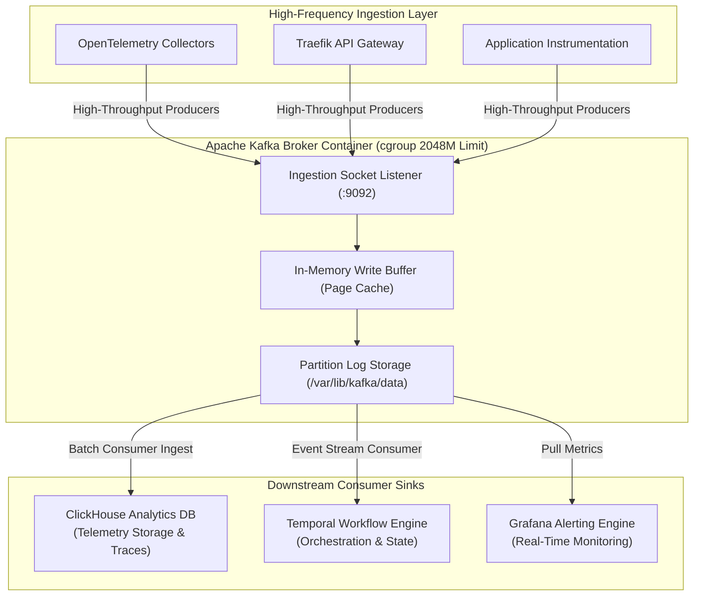

---

### 1.2 Low-Level Architecture (LLD) — Broker Internal Thread & Memory Execution Model

When a producer writes telemetry data or a consumer fetches records, Kafka processes the request through an internal thread and memory pipeline:

```mermaid
graph TB
    subgraph ProducerConsumer ["Client Producers & Consumers"]
        P["Telemetry Producer"]
        C["ClickHouse Consumer"]
    end

    subgraph BrokerProcess ["Kafka Broker Process Architecture"]
        subgraph NetworkLayer ["Network Thread Pool"]
            NThreads["Acceptor & Network Threads<br/>(NIO Selectors)"]
            ReqQueue["Request Queue"]
        end

        subgraph WorkerLayer ["I/O Worker Thread Pool"]
            Pool["KafkaRequestHandler Threads<br/>(Processes Produce/Fetch)"]
        end

        subgraph MemoryLayer ["Memory Architecture"]
            JVMHeap["JVM Heap (-Xmx1024M)<br/>• Metadata Cache<br/>• Consumer Group Coordinator<br/>• Active Request Objects"]
            NativeMem["Native Off-Heap Memory<br/>• Socket Direct Buffers<br/>• Metaspace & Thread Stacks"]
            PageCache["Linux OS Page Cache<br/>• In-Memory Log Segment Caching<br/>• Zero-Copy sendfile() Reads"]
        end

        subgraph LogLayer ["Disk Log Storage Engine"]
            ActiveSeg["Active Log Segment (.log)<br/>[Appending New Writes]"]
            ClosedSeg["Closed Log Segments (.log)<br/>[Read-Only Historical]"]
            Cleaner["Log Retention Cleaner Thread<br/>(Scans every 60s)"]
        end
    end

    P -->|TCP Connections| NThreads
    NThreads -->|Enqueue Request| ReqQueue
    ReqQueue -->|Dequeue| Pool
    Pool -->|Allocate Objects| JVMHeap
    Pool -->|Write Payload| PageCache
    PageCache -->|Flush / Sync| ActiveSeg
    ActiveSeg -->|Roll when > 100MB or 2h| ClosedSeg
    Cleaner -->|Delete if > 24h| ClosedSeg
    C -->|Fetch Request| NThreads
    PageCache -->|Zero-Copy sendfile()| C

    style JVMHeap fill:#1e293b,color:#fff
    style PageCache fill:#0f172a,color:#fff
    style ActiveSeg fill:#1e1b4b,color:#fff
```

---

## 2. Kafka Configuration Parameter Naming Conventions & Genesis

Kafka configuration parameters follow three distinct naming conventions depending on where and how they are defined:

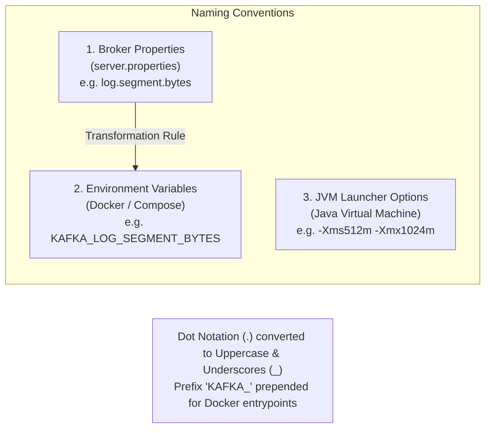

### 1. Broker Property Naming Convention (`server.properties`)
- **Hierarchical Dot-Notation**: Properties are grouped by functional subsystem:
  - `log.*`: Log storage engine, segment sizes, retention policies, and cleaner threads.
  - `offsets.topic.*`: Internal consumer offset tracking system.
  - `transaction.state.log.*`: Transactional messaging state logs.
  - `controller.*` & `process.roles`: KRaft consensus metadata engine.

### 2. Docker Environment Variable Naming Mapping (`docker-compose.yml`)
- Official Docker images map environment variables to `server.properties` using standard transformation rules:
  1. Prepend `KAFKA_` prefix.
  2. Convert all characters to uppercase.
  3. Replace all dots (`.`) with underscores (`_`).
  *Example*: `log.segment.bytes` becomes `KAFKA_LOG_SEGMENT_BYTES`.

### 3. Java Virtual Machine (JVM) Flag Conventions
- **`-Xms`**: eXtended Memory Size (Initial Java Heap allocated at startup).
- **`-Xmx`**: eXtended Memory Maximum (Maximum allowable Java Heap boundary).
- **`-XX:`**: eXtended eXpert parameters (Garbage collection tuning, Metaspace, and internal JVM flags).

---

## 3. Parameter-by-Parameter Deep-Dive & Operational Analysis

---

### 3.1 `KAFKA_HEAP_OPTS` — JVM Heap Memory Sizing

* **Configuration Key**: `KAFKA_HEAP_OPTS`
* **Target File**: [`docker-compose.yml`](file:///home/btpl-lap-22/live/llm-obs-infra/docker-compose.yml) (Line 115) & [`docker-compose.prod.yml`](file:///home/btpl-lap-22/live/llm-obs-infra/docker-compose.prod.yml) (Line 12)
* **Current Value**: `-Xms512m -Xmx1024m` *(Dev/Base)* | `-Xms1024m -Xmx2048m` *(Prod)*
* **Default Value**: `-Xms1G -Xmx1G` (in native `kafka-server-start.sh`)
* **Criticality Rating**: 🔴 **CRITICAL**

#### Parameter Mechanics Diagram

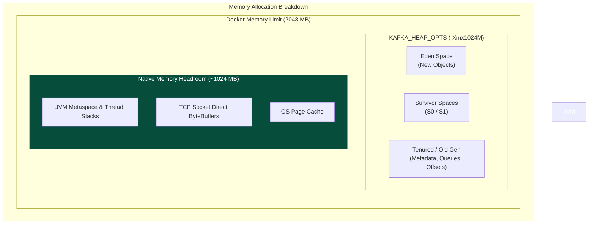

#### 1. What Is This Parameter?
`KAFKA_HEAP_OPTS` sets the initial (`-Xms`) and maximum (`-Xmx`) physical memory allocated strictly to the Java heap inside the Kafka broker container.

#### 2. Why & When to Use It (Usefulness & Criticality)
* **Why It Is Useful**: It prevents the JVM from allocating arbitrary memory and guarantees that heap allocations are bounded within host RAM limits.
* **Why We Configured It**: The stack previously used `KAFKA_JVM_PERFORMANCE_OPTS`. In Kafka's native launcher script (`kafka-run-class.sh`), performance flags are meant **only for Garbage Collection parameters** (e.g., `-XX:+UseG1GC`). Passing heap flags inside `KAFKA_JVM_PERFORMANCE_OPTS` caused the launcher to ignore them or fail flag concatenation, falling back to `-Xmx1G -Xms1G`.
* **Criticality**: 🔴 **CRITICAL**. An unconfigured heap will cause unpredictable JVM crashes or host RAM exhaustion.

#### 3. Impact on Current System
* **RAM Impact**: Limits Java heap strictly between **512 MB** and **1024 MB**.
* **Off-Heap Safety**: Reserves ~1024 MB within the 2048M Docker limit for OS page cache, direct socket buffers, and thread stacks.
* **GC Pauses**: Keeps G1GC collection pause times under 50ms on 4-core CPUs.

#### 4. How & Why to Scale / Increase It
* **Monitoring Metrics**:
  * JMX Metric: `jvm_gc_pause_seconds` > 0.5s.
  * Log error: `java.lang.OutOfMemoryError: Java heap space`.
* **When to Increase**: When client connections exceed 1,000 active sessions or when payload throughput exceeds 20 MB/sec.
* **Scaling Rule**: `Container Memory Limit = JVM Heap (-Xmx) + 1024MB`.

---

### 3.2 `deploy.resources.limits.memory` — Docker Container Memory Ceiling

* **Configuration Key**: `deploy.resources.limits.memory` & `reservations.memory`
* **Target File**: [`docker-compose.yml`](file:///home/btpl-lap-22/live/llm-obs-infra/docker-compose.yml) (Lines 94-99)
* **Current Value**: Limit: `2048M` | Reservation: `512M`
* **Default Value**: Unbounded (`None`)
* **Criticality Rating**: 🔴 **CRITICAL**

#### Linux cgroups Boundary Diagram

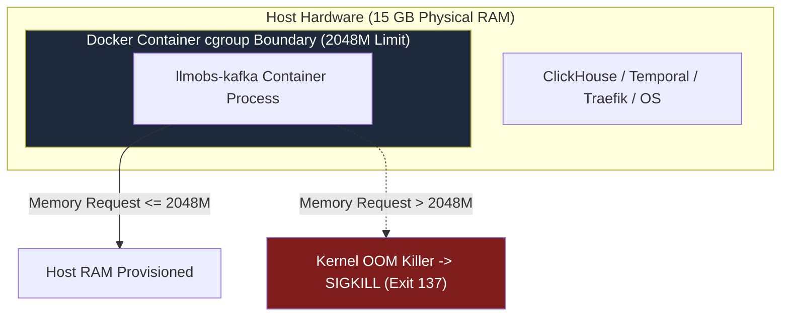

#### 1. What Is This Parameter?
Establishes hard Linux kernel `cgroups` memory boundaries around the Kafka container process.

#### 2. Why & When to Use It (Usefulness & Criticality)
* **Why It Is Useful**: It prevents a single run-away container from consuming all host RAM and crashing adjacent services.
* **Criticality**: 🔴 **CRITICAL**. Without container limits on a shared host with 15 GB RAM, a spike in telemetry traffic will trigger the host Linux kernel Out-Of-Memory (OOM) killer against random system services.

#### 3. Impact on Current System
* **Protection**: Guarantees Kafka cannot exceed 2 GB of physical host RAM.
* **Stability**: Ensures guaranteed memory allocation for ClickHouse (`4096M`) and AlloyDB (`2048M`).

---

### 3.3 `log.segment.bytes` — Partition Log Segment File Size

* **Configuration Key**: `log.segment.bytes`
* **Target File**: [`config/kafka/server.properties`](file:///home/btpl-lap-22/live/llm-obs-infra/config/kafka/server.properties) (Line 15)
* **Current Value**: `104857600` (100 MB)
* **Default Value**: `1073741824` (1 GB)
* **Criticality Rating**: 🔴 **CRITICAL**

#### Active vs Closed Segment Deletion Diagram

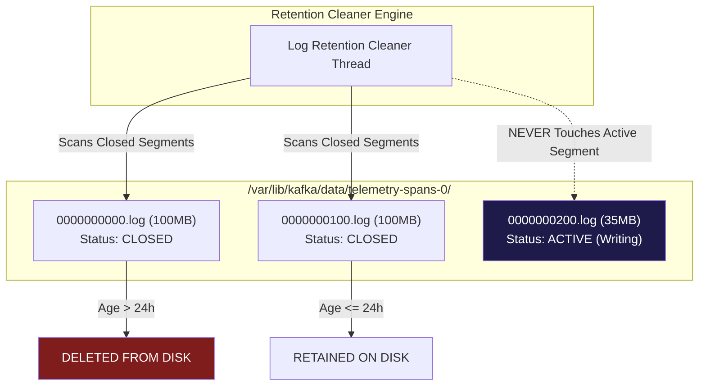

#### 1. What Is This Parameter?
Specifies the maximum size in bytes of an individual log segment file (`.log`). When a segment reaches this size, Kafka closes it and rolls a new active segment file.

#### 2. Why & When to Use It (Usefulness & Criticality)
* **Why It Is Useful**: **Kafka retention rules apply ONLY to closed segments. Active segments are NEVER deleted regardless of age.**
* **Why We Configured It**: Under default 1 GB segment settings, low-throughput dev/staging topics take weeks to write 1 GB of logs. The active segment remains open indefinitely, preventing old data from being deleted and causing severe storage bloat on host disk `/dev/sda2`.
* **Criticality**: 🔴 **CRITICAL** for storage management on non-enterprise disk volumes.

#### 3. Impact on Current System
* **Disk Reclamation**: Reclaims ~30 GB of storage space on host disk by closing segments at 100 MB boundaries so daily retention can purge them.

---

### 3.4 `log.retention.hours` — Closed Log Lifetime

* **Configuration Key**: `log.retention.hours`
* **Target File**: [`config/kafka/server.properties`](file:///home/btpl-lap-22/live/llm-obs-infra/config/kafka/server.properties) (Line 16)
* **Current Value**: `24` (24 Hours)
* **Default Value**: `168` (7 Days)
* **Criticality Rating**: 🟡 **HIGH**

#### Retention Lifecycle Diagram

```mermaid
gantt
    title Kafka Log Lifetime (24h Retention Window)
    dateFormat HH:mm
    axisFormat %H:%m

    section Stream Ingest
    Live Telemetry Buffer          :active, stream, 00:00, 24h
    section Closed Segment Deletion
    Segment 1 (0-6h) Retained      :done, seg1, 00:00, 06:00
    Segment 2 (6-12h) Retained     :done, seg2, 06:00, 12:00
    Segment 3 (12-18h) Retained    :done, seg3, 12:00, 18:00
    Segment 4 (18-24h) Retained    :done, seg4, 18:00, 24:00
    Segment 0 (>24h) Expired      :crit, seg0, 00:00, 01:00
```

#### 1. What Is This Parameter?
Sets the duration in hours that closed segment files are retained on disk before physical deletion.

#### 2. Why & When to Use It (Usefulness & Criticality)
* **Why It Is Useful**: Kafka is an intermediate buffer. Telemetry data is consumed almost immediately by OpenTelemetry Collector and ClickHouse.
* **Why We Configured It**: Retaining 7 days of stream logs in Kafka duplicates data already stored in ClickHouse and unnecessarily consumes host storage. 24 hours provides ample time for consumers to process streams while conserving disk space.
* **Criticality**: 🟡 **HIGH**.

---

### 3.5 `log.roll.hours` — Time-Based Segment Rolling

* **Configuration Key**: `log.roll.hours`
* **Target File**: [`config/kafka/server.properties`](file:///home/btpl-lap-22/live/llm-obs-infra/config/kafka/server.properties) (Line 17)
* **Current Value**: `2` (2 Hours)
* **Default Value**: `168` (7 Days)
* **Criticality Rating**: 🟡 **HIGH**

#### Low-Volume Forced Rolling Diagram

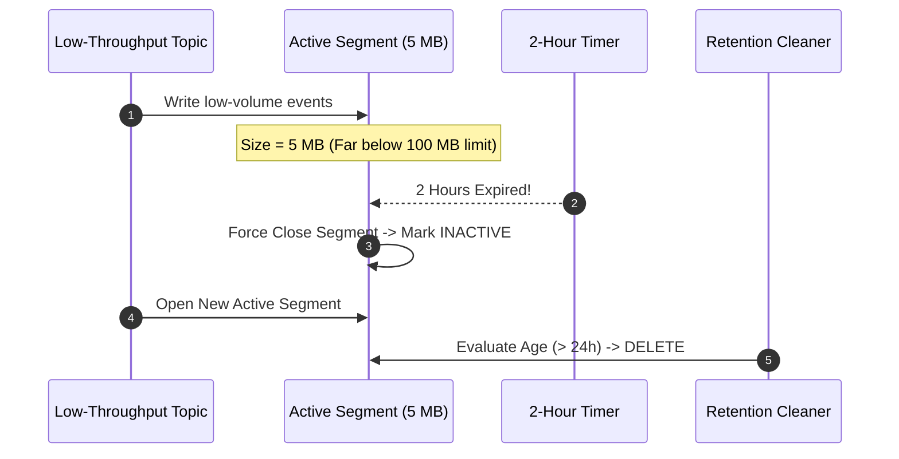

#### 1. What Is This Parameter?
Enforces a maximum time window after which an active segment is forcibly closed, even if it has not reached `log.segment.bytes` (100 MB).

#### 2. Why & When to Use It (Usefulness & Criticality)
* **Why It Is Useful**: Low-throughput topics (e.g., control plane heartbeats) might take weeks to write 100 MB. Without time-based rolling, active segments on dormant topics would remain open indefinitely, bypassing retention rules.
* **Criticality**: 🟡 **HIGH** for environments with mixed high/low volume topics.

---

### 3.6 `log.retention.check.interval.ms` — Retention Evaluation Frequency

* **Configuration Key**: `log.retention.check.interval.ms`
* **Target File**: [`config/kafka/server.properties`](file:///home/btpl-lap-22/live/llm-obs-infra/config/kafka/server.properties) (Line 18)
* **Current Value**: `60000` (60 Seconds)
* **Default Value**: `300000` (5 Minutes)
* **Criticality Rating**: 🔵 **MEDIUM**

#### Retention Check Loop Diagram

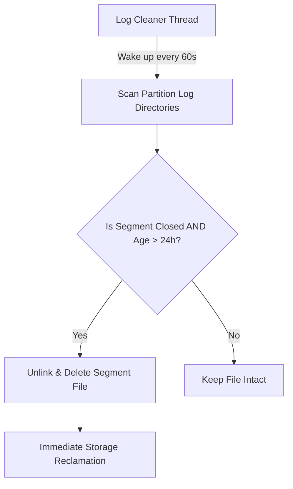

#### 1. What Is This Parameter?
Controls how frequently the background log cleaner thread scans partition directories to evaluate segment expiration.

#### 2. Why & When to Use It (Usefulness & Criticality)
* **Why It Is Useful**: Reduces the delay between a segment expiring (passing 24 hours) and its physical deletion from disk.
* **Criticality**: 🔵 **MEDIUM**.

---

### 3.7 `offsets.topic.num.partitions` — Internal Offset Topic Partitions

* **Configuration Key**: `offsets.topic.num.partitions`
* **Target File**: [`config/kafka/server.properties`](file:///home/btpl-lap-22/live/llm-obs-infra/config/kafka/server.properties) (Line 19)
* **Current Value**: `3`
* **Default Value**: `50`
* **Criticality Rating**: 🟡 **HIGH**

#### Internal Partition Reduction Diagram

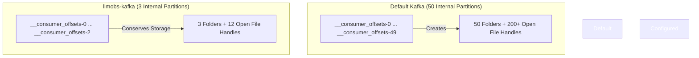

#### 1. What Is This Parameter?
Sets the partition count for Kafka's internal `__consumer_offsets` topic, which stores consumer group commit progress.

#### 2. Why & When to Use It (Usefulness & Criticality)
* **Why It Is Useful**: Default 50 partitions pre-allocate 50 directory folders and 200+ index/log files. On single-broker infrastructure with only 3–5 consumer groups, 50 partitions waste file descriptors (`nofile`) and system inodes.
* **Criticality**: 🟡 **HIGH** for resource-constrained hosts.

---

### 3.8 `num.partitions` — Default Topic Parallelism

* **Configuration Key**: `num.partitions` / `KAFKA_NUM_PARTITIONS`
* **Target File**: [`config/kafka/server.properties`](file:///home/btpl-lap-22/live/llm-obs-infra/config/kafka/server.properties) (Line 12) & [`docker-compose.yml`](file:///home/btpl-lap-22/live/llm-obs-infra/docker-compose.yml) (Line 114)
* **Current Value**: `3`
* **Default Value**: `1`
* **Criticality Rating**: 🟡 **HIGH**

#### CPU Alignment Diagram

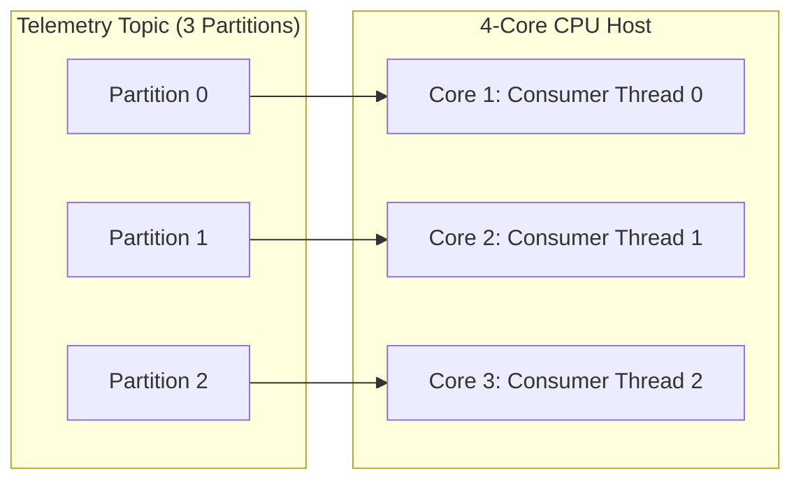

#### 1. What Is This Parameter?
Sets the default number of partitions created when a new topic is created automatically.

#### 2. Why & When to Use It (Usefulness & Criticality)
* **Why It Is Useful**: Kafka achieves consumer parallelism through partitions. Setting `num.partitions=3` enables 3 consumer threads to process streaming telemetry concurrently across the 4 host CPU cores.
* **Criticality**: 🟡 **HIGH**.

---

## 4. Master Parameter Summary Matrix

| Parameter Key | File Target | Configured Value | Default Value | Naming Genesis | Criticality | Primary Operational Impact |
|---|---|---|---|---|---|---|
| `KAFKA_HEAP_OPTS` | `docker-compose.yml` | `-Xms512m -Xmx1024m` | `-Xms1G -Xmx1G` | JVM Standard Flag (`-Xms`/`-Xmx`) | 🔴 CRITICAL | Bounds Java heap; fixes performance launcher bug |
| `limits.memory` | `docker-compose.yml` | `2048M` | Unbounded | Docker Compose Schema | 🔴 CRITICAL | Prevents container OOM host crash |
| `log.segment.bytes` | `server.properties` | `104857600` (100 MB) | `1073741824` (1 GB) | `log.*` Subsystem | 🔴 CRITICAL | Closes segment files quickly to trigger daily retention |
| `log.retention.hours` | `server.properties` | `24` (1 Day) | `168` (7 Days) | `log.*` Subsystem | 🟡 HIGH | Reclaims ~35 GB disk space by purging old streams |
| `log.roll.hours` | `server.properties` | `2` (2 Hours) | `168` (7 Days) | `log.*` Subsystem | 🟡 HIGH | Forces active segment rolls on dormant topics |
| `log.retention.check.interval.ms` | `server.properties` | `60000` (60s) | `300000` (5m) | `log.*` Subsystem | 🔵 MEDIUM | Triggers log cleaner scan every 60 seconds |
| `offsets.topic.num.partitions` | `server.properties` | `3` | `50` | `offsets.topic.*` Subsystem | 🟡 HIGH | Reduces internal offset folder & open file descriptor bloat |
| `num.partitions` | `server.properties` | `3` | `1` | Core Broker Directive | 🟡 HIGH | Enables 3-way parallel processing across 4 CPU cores |

---

## 5. Multi-Broker Scale-Out Architecture (Single-Node to 3-Node KRaft)

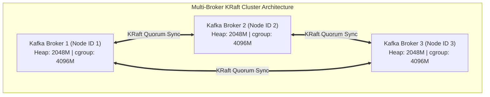
