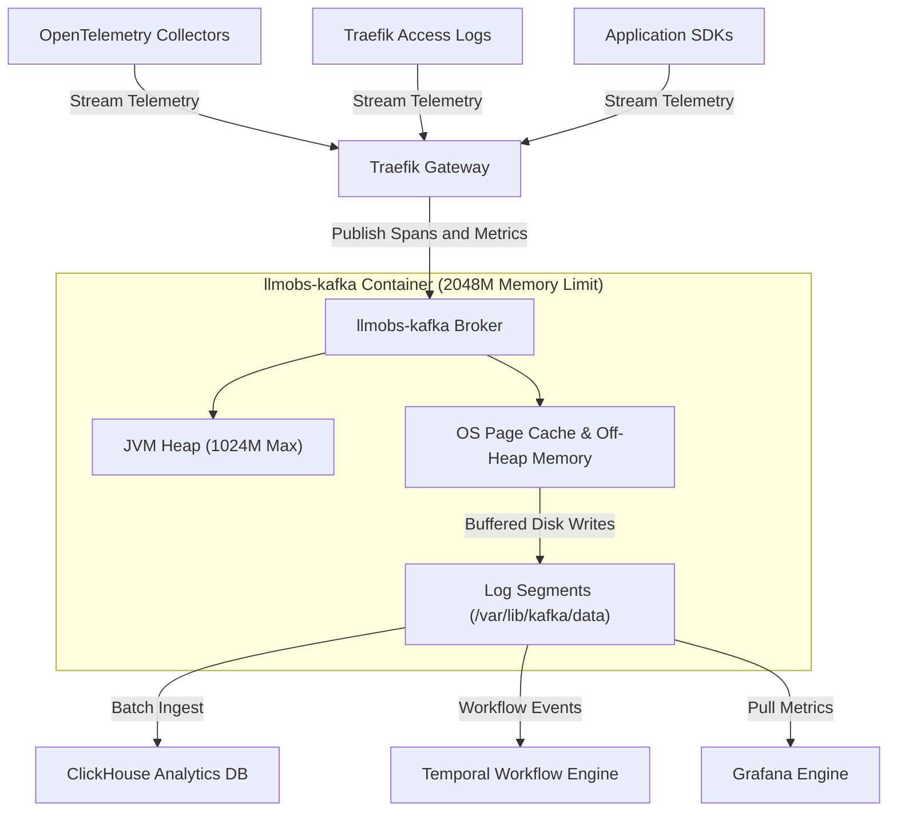
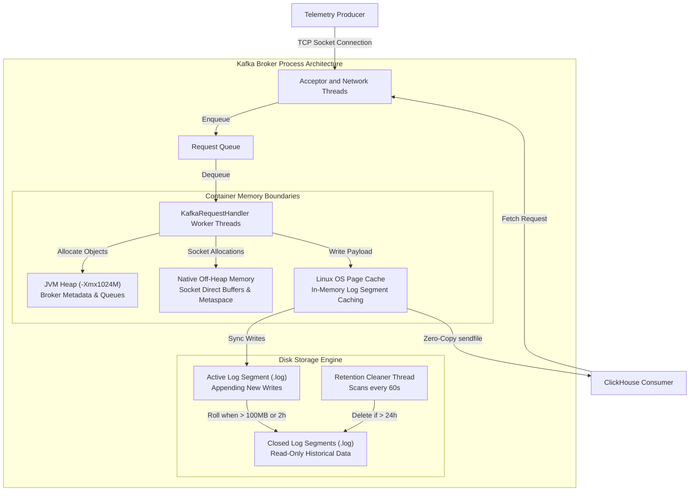
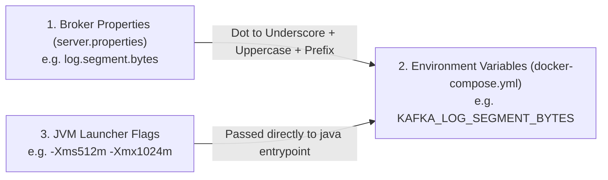
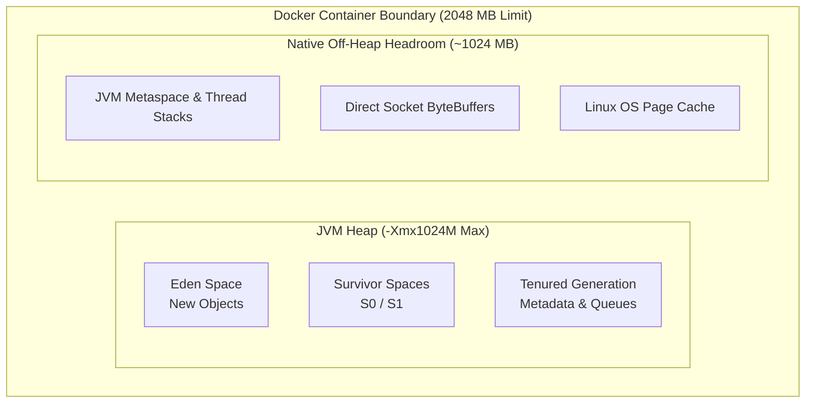
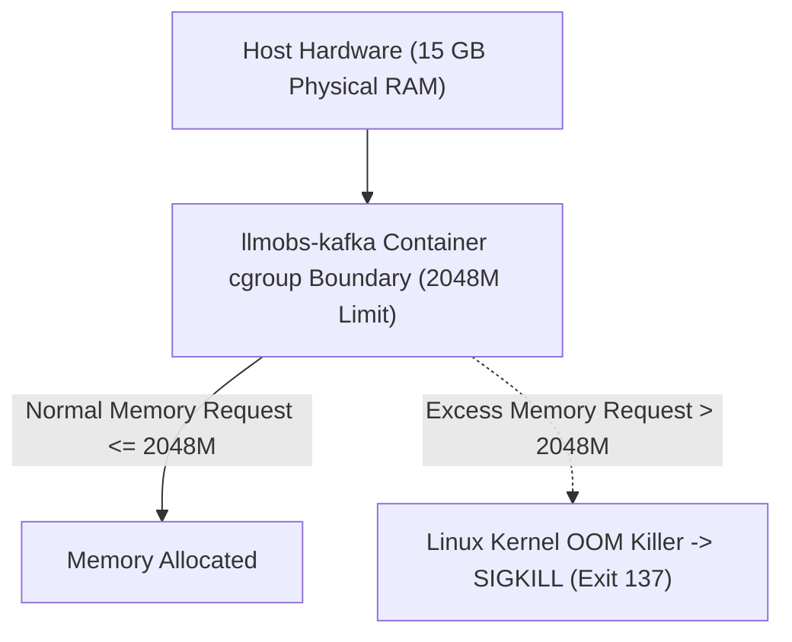
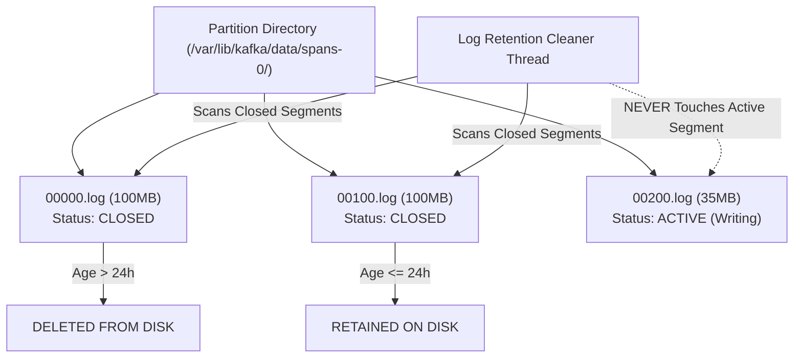
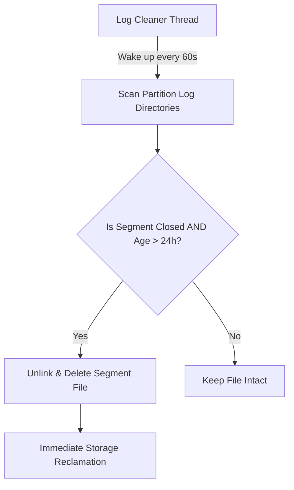
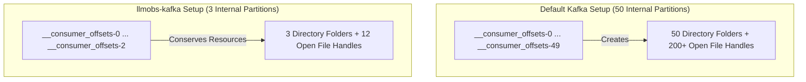
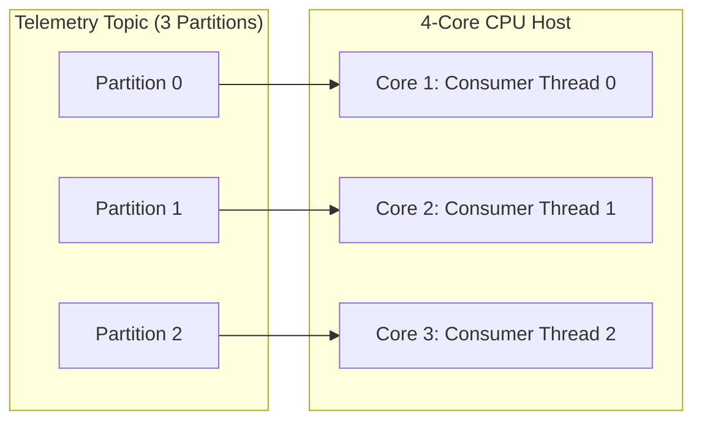
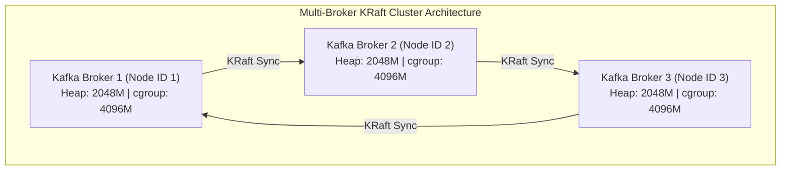

# Apache Kafka Configuration & Operational Deep-Dive Reference Guide

## 1. System High-Level (HLD) & Low-Level (LLD) Design Architecture

### 1.1 High-Level Architecture (HLD) — Observability Data Pipeline

In the `llm-obs-infra` architecture, Apache Kafka operates as the decoupled streaming buffer that separates high-frequency telemetry ingestion from heavy analytical query engines.

---

### 1.2 Low-Level Architecture (LLD) — Broker Internal Thread & Memory Execution Model

When a producer writes telemetry data or a consumer fetches records, Kafka processes the request through an internal thread and memory pipeline:

---

## 2. Kafka Configuration Parameter Naming Conventions & Genesis

Kafka configuration parameters follow three distinct naming conventions depending on where and how they are defined:

### Naming Conventions Breakdown

| Convention Type | Target Environment | Formatting Pattern & Rules | Example Parameter |
|---|---|---|---|
| **1. Broker Properties** | `config/kafka/server.properties` | **Hierarchical Dot-Notation**: Grouped by functional subsystem (`log.*`, `offsets.topic.*`, `num.partitions`, `transaction.state.log.*`). | `log.segment.bytes` |
| **2. Environment Variables** | `docker-compose.yml` | **Uppercase Underscore Mapping**: Standard Confluent/Docker convention. Prepend `KAFKA_`, convert to uppercase, and replace dots (`.`) with underscores (`_`). | `KAFKA_LOG_SEGMENT_BYTES` |
| **3. JVM Launcher Options** | Container `entrypoint` / Compose `env` | **Standard Java Options**: `-Xms` (Initial Memory Size), `-Xmx` (Maximum Memory Size), and `-XX:` (Expert Garbage Collection / Metaspace options). | `KAFKA_HEAP_OPTS="-Xms512m -Xmx1024m"` |

---

## 3. Parameter-by-Parameter Deep-Dive & Operational Tables

---

### 3.1 `KAFKA_HEAP_OPTS` — JVM Heap Memory Sizing

| Dimension | Detailed Technical Specifications & Operational Guidance |
|---|---|
| **Parameter Key** | `KAFKA_HEAP_OPTS` |
| **File Location & Target** | [`docker-compose.yml`](file:///home/btpl-lap-22/live/llm-obs-infra/docker-compose.yml) (Line 115) & [`docker-compose.prod.yml`](file:///home/btpl-lap-22/live/llm-obs-infra/docker-compose.prod.yml) (Line 12) |
| **Configured Value** | `-Xms512m -Xmx1024m` *(Dev/Base)* \| `-Xms1024m -Xmx2048m` *(Prod)* |
| **Apache Kafka Default** | `-Xms1G -Xmx1G` (hardcoded inside native launcher `kafka-server-start.sh`) |
| **Criticality Rating** | 🔴 **CRITICAL** |
| **Naming Convention Genesis** | Standard Java Virtual Machine (JVM) flags: `-Xms` (eXtended Memory Size) sets initial heap allocation at startup; `-Xmx` (eXtended Memory Maximum) sets upper heap boundary. |
| **1. What Is This Parameter?** | Sets the initial (`-Xms`) and maximum (`-Xmx`) physical RAM allocated strictly to Java heap objects (broker metadata, active request objects, topic partition indexes, consumer group metadata). |
| **2. Why & When to Use It** | **Why It Is Useful**: Bounds JVM memory usage to prevent arbitrary allocation that starves host RAM. **Why We Configured It**: The stack previously used `KAFKA_JVM_PERFORMANCE_OPTS`. Kafka's `kafka-run-class.sh` launcher script parses `KAFKA_JVM_PERFORMANCE_OPTS` strictly for Garbage Collection options (e.g., `-XX:+UseG1GC`). Passing heap options inside performance flags caused startup script concatenation errors, reverting to `-Xmx1G -Xms1G`. **Criticality**: 🔴 **CRITICAL**. An unconfigured heap causes JVM memory crashes or triggers host OOM killers. |
| **3. Impact on Current System** | **RAM Impact**: Restricts JVM heap strictly between 512 MB and 1024 MB in base mode. **Off-Heap Headroom**: Leaves ~1024 MB headroom inside the 2048M container limit for OS page cache, Metaspace, and TCP socket buffers. **GC Performance**: Reduces G1GC pause durations to < 50ms on 4 CPU cores. |
| **4. How & Why to Scale / Increase** | **Monitoring Metrics**: JMX metric `jvm_gc_pause_seconds` > 0.5s or error `java.lang.OutOfMemoryError: Java heap space`. **When to Increase**: Active client connections exceed 1,000 or telemetry payload throughput exceeds 20 MB/sec. **Scaling Rule**: `Container Limit = JVM Heap (-Xmx) + 1024MB`. **Scaling Procedure**: Update `KAFKA_HEAP_OPTS` in `docker-compose.yml` and raise container memory limit accordingly. |

---

### 3.2 `deploy.resources.limits.memory` — Docker Container Memory Ceiling

| Dimension | Detailed Technical Specifications & Operational Guidance |
|---|---|
| **Parameter Key** | `deploy.resources.limits.memory` & `reservations.memory` |
| **File Location & Target** | [`docker-compose.yml`](file:///home/btpl-lap-22/live/llm-obs-infra/docker-compose.yml) (Lines 94-99) |
| **Configured Value** | Limit: `2048M` \| Reservation: `512M` |
| **Apache Kafka Default** | Unbounded (`None`) |
| **Criticality Rating** | 🔴 **CRITICAL** |
| **Naming Convention Genesis** | Docker Compose Specification under `deploy.resources`. `limits` sets hard cgroup boundary; `reservations` sets soft minimum startup allocation. |
| **1. What Is This Parameter?** | Establishes hard Linux kernel `cgroups` memory boundaries around the Kafka container process. |
| **2. Why & When to Use It** | **Why It Is Useful**: Prevents a single run-away container from consuming all host RAM and crashing adjacent services. **Why We Configured It**: Unbounded container memory exposes the 15 GB host to host-wide OOM crashes. Kafka requires non-heap native memory for direct ByteBuffers, thread stacks, and OS page cache. **Criticality**: 🔴 **CRITICAL**. Without container limits on a shared host, a spike in telemetry traffic triggers the Linux kernel OOM killer against random system services. |
| **3. Impact on Current System** | **Host Protection**: Guarantees Kafka cannot exceed 2 GB of physical host RAM. **Coexistence**: Preserves guaranteed memory headroom for ClickHouse (`4096M`) and AlloyDB (`2048M`). |
| **4. How & Why to Scale / Increase** | **Monitoring Metrics**: Container status `Exit 137` in `docker ps -a` or `dmesg \| grep -i oom`. **When to Increase**: When scaling JVM Heap (`-Xmx`) above 1 GB. **Scaling Rule**: `Container Limit = JVM Heap (-Xmx) + 1024M` (minimum 1 GB off-heap buffer). |

---

### 3.3 `log.segment.bytes` — Partition Log Segment File Size

| Dimension | Detailed Technical Specifications & Operational Guidance |
|---|---|
| **Parameter Key** | `log.segment.bytes` |
| **File Location & Target** | [`config/kafka/server.properties`](file:///home/btpl-lap-22/live/llm-obs-infra/config/kafka/server.properties) (Line 15) |
| **Configured Value** | `104857600` (100 MB) |
| **Apache Kafka Default** | `1073741824` (1 GB) |
| **Criticality Rating** | 🔴 **CRITICAL** |
| **Naming Convention Genesis** | Kafka Storage Engine directive under `log.*` namespace. Defines maximum byte size per segment file before triggering segment roll. |
| **1. What Is This Parameter?** | Specifies the maximum byte size of an individual log segment file (`.log`). When an active segment reaches this size, Kafka closes it and creates a new active segment file. |
| **2. Why & When to Use It** | **Why It Is Useful**: **CRITICAL KAFKA MECHANIC**: Retention rules (time or size based) apply ONLY to closed segments. Active segments are NEVER deleted regardless of age. **Why We Configured It**: Under default 1 GB segment settings, low-throughput dev/staging topics take weeks to accumulate 1 GB of logs. The segment remains active indefinitely, old test data is never deleted, and host storage space (`/dev/sda2`) fills up continuously. **Criticality**: 🔴 **CRITICAL** for storage management on non-enterprise disk volumes. |
| **3. Impact on Current System** | **Faster File Roll**: Active log files reach 100 MB rapidly and close, allowing Kafka's retention cleaner thread to purge old segments daily. **Disk Space Bounding**: Reclaims up to 30 GB of disk space on `/dev/sda2` by preventing inactive topics from holding onto gigabytes of stale active segments. |
| **4. How & Why to Scale / Increase** | **When to Increase**: In high-throughput production (> 50,000 messages/sec), small segment files cause excessive open file descriptors and disk index fragmentation. **Scaling Values**: Low/Dev: `100 MB` \| Medium Prod: `256 MB` \| High-Throughput Prod: `512 MB` or `1 GB`. |

---

### 3.4 `log.retention.hours` — Closed Log Lifetime

| Dimension | Detailed Technical Specifications & Operational Guidance |
|---|---|
| **Parameter Key** | `log.retention.hours` |
| **File Location & Target** | [`config/kafka/server.properties`](file:///home/btpl-lap-22/live/llm-obs-infra/config/kafka/server.properties) (Line 16) |
| **Configured Value** | `24` (24 Hours / 1 Day) |
| **Apache Kafka Default** | `168` (168 Hours / 7 Days) |
| **Criticality Rating** | 🟡 **HIGH** |
| **Naming Convention Genesis** | Kafka Storage Engine directive under `log.*` namespace. Defines time-based deletion threshold for closed log segments. |
| **1. What Is This Parameter?** | Sets the duration in hours that closed segment files are retained on disk before physical deletion. |
| **2. Why & When to Use It** | **Why It Is Useful**: Kafka is an intermediate buffer. Telemetry data is consumed almost immediately by OpenTelemetry Collector and ClickHouse. **Why We Configured It**: Retaining 7 days of stream logs in Kafka duplicates data already stored in ClickHouse and unnecessarily consumes host storage. 24 hours provides ample time for consumers to process streams while conserving disk space. **Criticality**: 🟡 **HIGH**. |
| **3. Impact on Current System** | **Storage Footprint**: Bounds Kafka's total disk overhead to approximately **1 day** of streaming data. **Disk Space Reclamation**: Frees ~35 GB of disk space compared to the 7-day default on `/dev/sda2`. |
| **4. How & Why to Scale / Increase** | **When to Increase**: If downstream consumer services (ClickHouse ingestion, temporal workflows) experience multi-day downtime and require replaying messages older than 24 hours. **Scaling Values**: Dev: `24h` \| Production Buffer: `72h` (3 days). |

---

### 3.5 `log.roll.hours` — Time-Based Segment Rolling

| Dimension | Detailed Technical Specifications & Operational Guidance |
|---|---|
| **Parameter Key** | `log.roll.hours` |
| **File Location & Target** | [`config/kafka/server.properties`](file:///home/btpl-lap-22/live/llm-obs-infra/config/kafka/server.properties) (Line 17) |
| **Configured Value** | `2` (2 Hours) |
| **Apache Kafka Default** | `168` (168 Hours / 7 Days) |
| **Criticality Rating** | 🟡 **HIGH** |
| **Naming Convention Genesis** | Kafka Storage Engine directive under `log.*` namespace. Defines maximum time duration an active segment may remain open before forced closure. |
| **1. What Is This Parameter?** | Enforces a maximum time window after which an active segment is forcibly closed, even if it has not reached `log.segment.bytes` (100 MB). |
| **2. Why & When to Use It** | **Why It Is Useful**: Low-throughput topics (e.g., control plane heartbeats) might take weeks to write 100 MB. Without time-based rolling, active segments on dormant topics would remain open indefinitely, bypassing retention rules. **Why We Configured It**: Setting `log.roll.hours=2` guarantees that every active segment closes within 2 hours regardless of throughput, enabling 24-hour retention deletion on schedule. **Criticality**: 🟡 **HIGH** for environments with mixed high/low volume topics. |
| **3. Impact on Current System** | **Guaranteed Deletion Cycle**: Ensures all topics close active segments every 2 hours, making them eligible for deletion within 24–26 hours. **Eliminates Storage Leaks**: Prevents dormant topics from holding open segment references indefinitely. |
| **4. How & Why to Scale / Increase** | **When to Increase**: In high-throughput production environments where all topics write 100 MB+ every few minutes, explicit time-based rolling is redundant. **Recommended Production Values**: `log.roll.hours=12` or `24`. |

---

### 3.6 `log.retention.check.interval.ms` — Retention Evaluation Frequency

| Dimension | Detailed Technical Specifications & Operational Guidance |
|---|---|
| **Parameter Key** | `log.retention.check.interval.ms` |
| **File Location & Target** | [`config/kafka/server.properties`](file:///home/btpl-lap-22/live/llm-obs-infra/config/kafka/server.properties) (Line 18) |
| **Configured Value** | `60000` (60 Seconds) |
| **Apache Kafka Default** | `300000` (5 Minutes) |
| **Criticality Rating** | 🔵 **MEDIUM** |
| **Naming Convention Genesis** | Kafka Storage Engine directive under `log.*` namespace. Millisecond interval governing retention thread execution. |
| **1. What Is This Parameter?** | Controls how frequently the background log cleaner thread scans partition directories to evaluate segment expiration. |
| **2. Why & When to Use It** | **Why It Is Useful**: Reduces the delay between a segment expiring (passing 24 hours) and its physical deletion from disk. **Why We Configured It**: Shortening the check interval to 60 seconds ensures expired segments are unlinked almost immediately after reaching their 24-hour limit on disk-constrained systems (`/dev/sda2`). **Criticality**: 🔵 **MEDIUM**. |
| **3. Impact on Current System** | **Rapid Space Recovery**: Reclaims disk space within 60 seconds of segment expiration. **Low CPU Overhead**: Checking file metadata once per minute consumes less than 0.1% CPU on 4 cores. |
| **4. How & Why to Scale / Increase** | **When to Increase**: Only if a cluster hosts tens of thousands of partitions, where scanning partition directories every 60 seconds generates excessive disk metadata I/O. **Recommended Production Value**: `300000` (5 minutes). |

---

### 3.7 `offsets.topic.num.partitions` — Internal Offset Topic Partitions

| Dimension | Detailed Technical Specifications & Operational Guidance |
|---|---|
| **Parameter Key** | `offsets.topic.num.partitions` |
| **File Location & Target** | [`config/kafka/server.properties`](file:///home/btpl-lap-22/live/llm-obs-infra/config/kafka/server.properties) (Line 19) |
| **Configured Value** | `3` |
| **Apache Kafka Default** | `50` |
| **Criticality Rating** | 🟡 **HIGH** |
| **Naming Convention Genesis** | Consumer Group Coordinator directive under `offsets.topic.*` namespace. Defines internal partition count for consumer commit tracking. |
| **1. What Is This Parameter?** | Sets the partition count for Kafka's internal `__consumer_offsets` topic, which stores consumer group commit progress. |
| **2. Why & When to Use It** | **Why It Is Useful**: Default 50 partitions pre-allocate 50 directory folders and 200+ index/log files. On single-broker infrastructure with only 3–5 consumer groups, 50 partitions waste file descriptors (`nofile`) and system inodes. **Why We Configured It**: Cutting partition count to 3 saves 47 directories and ~188 open file handles inside the container. **Criticality**: 🟡 **HIGH** for single-broker or small cluster deployments. |
| **3. Impact on Current System** | **Directory Footprint**: Reduces internal topic folder bloat from 50 directories down to **3 directories**. **File Descriptor Conservation**: Saves file handles and system inodes. |
| **4. How & Why to Scale / Increase** | **When to Increase**: In large production clusters with hundreds of distinct consumer groups, increasing offset topic partitions prevents consumer commit lock contention. **Scaling Values**: Dev: `3` \| Production (<100 groups): `10` \| Enterprise (200+ groups): `50`. |

---

### 3.8 `num.partitions` — Default Topic Parallelism

| Dimension | Detailed Technical Specifications & Operational Guidance |
|---|---|
| **Parameter Key** | `num.partitions` / `KAFKA_NUM_PARTITIONS` |
| **File Location & Target** | [`config/kafka/server.properties`](file:///home/btpl-lap-22/live/llm-obs-infra/config/kafka/server.properties) (Line 12) & [`docker-compose.yml`](file:///home/btpl-lap-22/live/llm-obs-infra/docker-compose.yml) (Line 114) |
| **Configured Value** | `3` |
| **Apache Kafka Default** | `1` |
| **Criticality Rating** | 🟡 **HIGH** |
| **Naming Convention Genesis** | Core Kafka Broker directive. Defines default partition count for auto-created topics. |
| **1. What Is This Parameter?** | Sets the default number of parallel log partitions created when a new topic is created automatically. |
| **2. Why & When to Use It** | **Why It Is Useful**: Kafka achieves consumer parallelism through partitions. Each partition is assigned to one consumer thread within a group. **Why We Configured It**: Setting `num.partitions=3` enables 3 consumer threads to process streaming telemetry concurrently across the 4 host CPU cores. **Criticality**: 🟡 **HIGH**. |
| **3. Impact on Current System** | **Parallel Processing**: Enables parallel data streaming across 3 worker threads. **CPU Alignment**: Matches 4-core host CPU architecture cleanly without context-switching thrash. |
| **4. How & Why to Scale / Increase** | **When to Increase**: When consumer processing lag builds up on high-throughput topics and consumer services have available CPU cores. **Scaling Rule**: `Topic Partitions = Target Consumer Threads` (equal to or a multiple of CPU cores). |

---

## 4. Master Parameter Summary Matrix

| Parameter Key | Target File | Configured Value | Default Value | Naming Genesis | Criticality | Primary Operational Impact |
|---|---|---|---|---|---|---|
| `KAFKA_HEAP_OPTS` | `docker-compose.yml` | `-Xms512m -Xmx1024m` | `-Xms1G -Xmx1G` | JVM Flag (`-Xms`/`-Xmx`) | 🔴 CRITICAL | Bounds Java heap; fixes performance launcher bug |
| `limits.memory` | `docker-compose.yml` | `2048M` | Unbounded | Docker Compose Schema | 🔴 CRITICAL | Hard cgroup limit; prevents container OOM host crash |
| `log.segment.bytes` | `server.properties` | `104857600` (100 MB) | `1073741824` (1 GB) | `log.*` Subsystem | 🔴 CRITICAL | Closes segment files quickly to trigger daily retention |
| `log.retention.hours` | `server.properties` | `24` (1 Day) | `168` (7 Days) | `log.*` Subsystem | 🟡 HIGH | Reclaims ~35 GB disk space by purging old streams |
| `log.roll.hours` | `server.properties` | `2` (2 Hours) | `168` (7 Days) | `log.*` Subsystem | 🟡 HIGH | Forces active segment rolls on dormant topics |
| `log.retention.check.interval.ms` | `server.properties` | `60000` (60s) | `300000` (5m) | `log.*` Subsystem | 🔵 MEDIUM | Triggers log cleaner scan every 60 seconds |
| `offsets.topic.num.partitions` | `server.properties` | `3` | `50` | `offsets.topic.*` Subsystem | 🟡 HIGH | Reduces internal offset folder & open file descriptor bloat |
| `num.partitions` | `server.properties` | `3` | `1` | Core Broker Directive | 🟡 HIGH | Enables 3-way parallel processing across 4 CPU cores |

---

## 5. Multi-Broker Scale-Out Architecture (Single-Node to 3-Node KRaft)

