# Apache Kafka Comprehensive Architecture, Component Deep-Dive & Operational Guide

## 1. System-Wide Kafka High-Level (HLD) & Low-Level (LLD) Design

### 1.1 System High-Level Design (HLD) — Observability Data Pipeline Architecture

In the llm-obs-infra architecture, Apache Kafka serves as an asynchronous, distributed event-streaming buffer separating high-frequency telemetry ingestion from heavy downstream analytics engines.

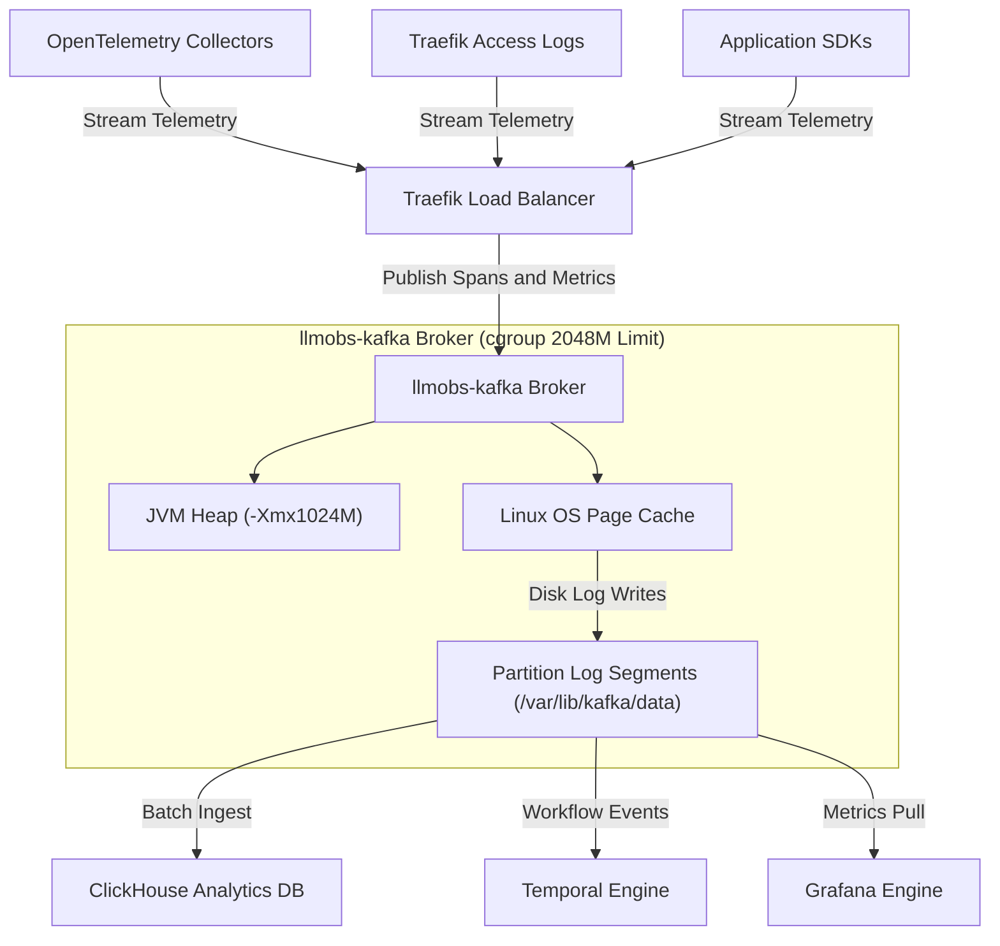

---

### 1.2 System Low-Level Design (LLD) — End-to-End Execution Flow

This diagram illustrates the complete internal mechanics of record processing from Producer client memory to Broker disk storage and Consumer fetch execution.

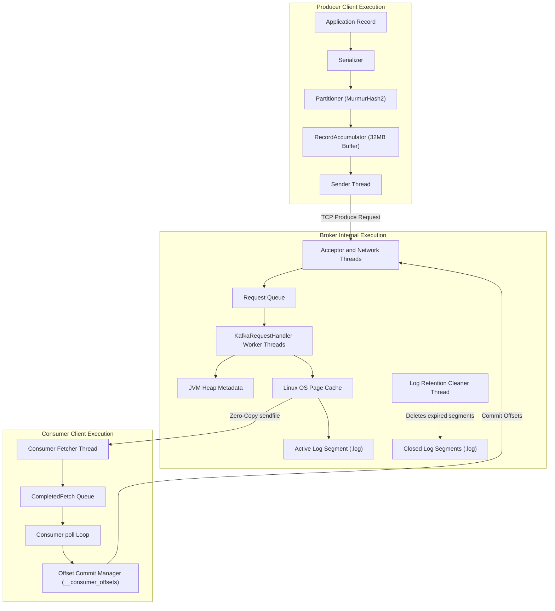

---

## 2. Kafka Configuration Parameter Naming Conventions & Genesis

Kafka configuration parameters follow three distinct naming conventions depending on where and how they are defined:

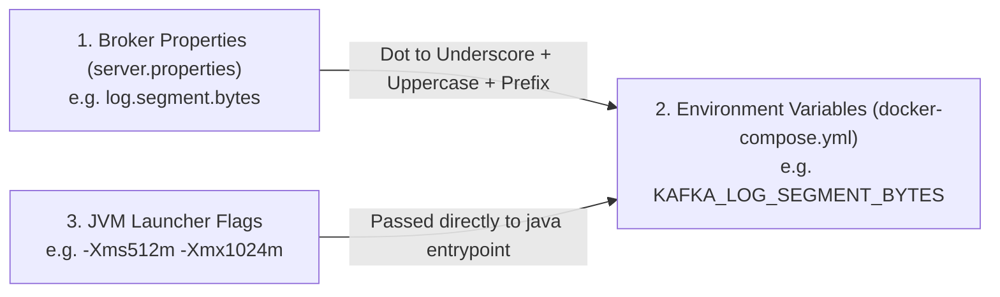

### Naming Conventions Breakdown

| Convention Type | Target Environment | Formatting Pattern & Rules | Example Parameter |
|---|---|---|---|
| **1. Broker Properties** | `config/kafka/server.properties` | **Hierarchical Dot-Notation**: Grouped by functional subsystem (`log.*`, `offsets.topic.*`, `num.partitions`, `transaction.state.log.*`). | `log.segment.bytes` |
| **2. Environment Variables** | `docker-compose.yml` | **Uppercase Underscore Mapping**: Standard Confluent/Docker convention. Prepend `KAFKA_`, convert to uppercase, and replace dots (`.`) with underscores (`_`). | `KAFKA_LOG_SEGMENT_BYTES` |
| **3. JVM Launcher Options** | Container `entrypoint` / Compose `env` | **Standard Java Options**: `-Xms` (Initial Memory Size), `-Xmx` (Maximum Memory Size), and `-XX:` (Expert Garbage Collection / Metaspace options). | `KAFKA_HEAP_OPTS="-Xms512m -Xmx1024m"` |

---

## 3. Broker Architecture & Component Deep-Dive

### 3.1 Broker High-Level Design (HLD)

The broker manages network sockets, metadata coordination via KRaft consensus, memory allocation between Java Heap and Native OS Page Cache, and log segment disk storage.

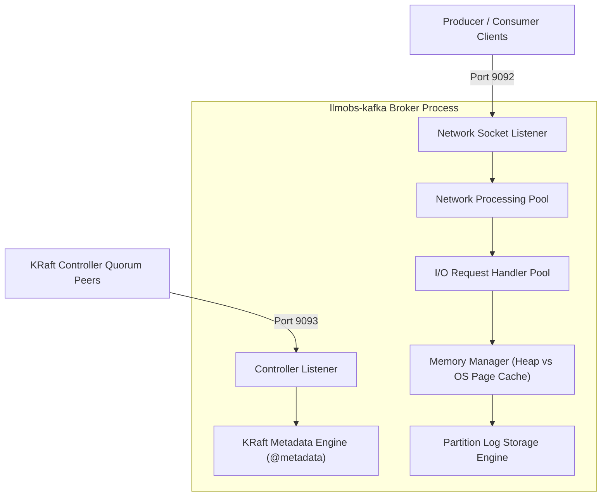

---

### 3.2 Broker Low-Level Design (LLD)

The low-level broker execution details the socket acceptor, request queues, thread pools, memory boundaries, and physical file layout on disk.

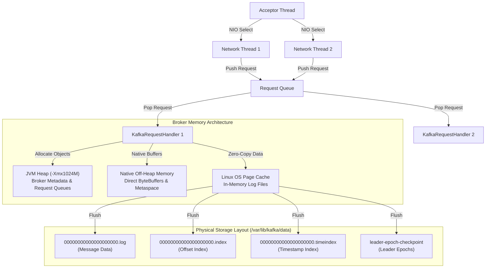

---

### 3.3 Broker Detailed Configuration Breakdown

| Dimension | Detailed Technical Specifications & Operational Guidance |
|---|---|
| **Parameter Key** | `KAFKA_HEAP_OPTS` |
| **File Location & Target** | [`docker-compose.yml`](file:///home/btpl-lap-22/live/llm-obs-infra/docker-compose.yml) (Line 115) & [`docker-compose.prod.yml`](file:///home/btpl-lap-22/live/llm-obs-infra/docker-compose.prod.yml) (Line 12) |
| **Configured Value** | `-Xms512m -Xmx1024m` *(Dev)* \| `-Xms1024m -Xmx2048m` *(Prod)* |
| **Apache Kafka Default** | `-Xms1G -Xmx1G` |
| **Criticality Rating** | CRITICAL |
| **1. What Is This Parameter?** | Sets initial (`-Xms`) and maximum (`-Xmx`) Java heap bounds for broker metadata, request queues, and connection objects. |
| **2. Why & When to Use It** | Prevents JVM memory allocation from exceeding host physical RAM limits and fixes environment flag parsing bugs. |
| **3. Impact on Current System** | Keeps JVM heap bounded to 1024MB; leaves 1024MB off-heap headroom for Linux OS Page Cache and socket buffers. |
| **4. How & Why to Scale / Increase** | Increase when active client connections exceed 1,000 or payload throughput exceeds 20 MB/sec. Formula: `Container Limit = JVM Heap + 1024MB`. |

| Dimension | Detailed Technical Specifications & Operational Guidance |
|---|---|
| **Parameter Key** | `deploy.resources.limits.memory` & `reservations.memory` |
| **File Location & Target** | [`docker-compose.yml`](file:///home/btpl-lap-22/live/llm-obs-infra/docker-compose.yml) (Lines 94-99) |
| **Configured Value** | Limit: `2048M` \| Reservation: `512M` |
| **Apache Kafka Default** | Unbounded (`None`) |
| **Criticality Rating** | CRITICAL |
| **1. What Is This Parameter?** | Hard Linux kernel `cgroups` memory boundary around the broker container process. |
| **2. Why & When to Use It** | Protects the host (15 GB RAM) from container memory starvation and Out-Of-Memory (OOM) crashes. |
| **3. Impact on Current System** | Limits total container RAM to 2048MB, ensuring ClickHouse (`4096M`) and AlloyDB (`2048M`) remain stable. |
| **4. How & Why to Scale / Increase** | Increase alongside JVM Heap scaling. Maintain at least 1 GB off-heap headroom above `-Xmx`. |

---

## 4. Producer Architecture & Component Deep-Dive

### 4.1 Producer High-Level Design (HLD)

The producer accepts records from application threads, serializes keys/values, assigns target partitions via MurmurHash2 algorithm, buffers records in memory batches, and asynchronously transmits batches to the broker.

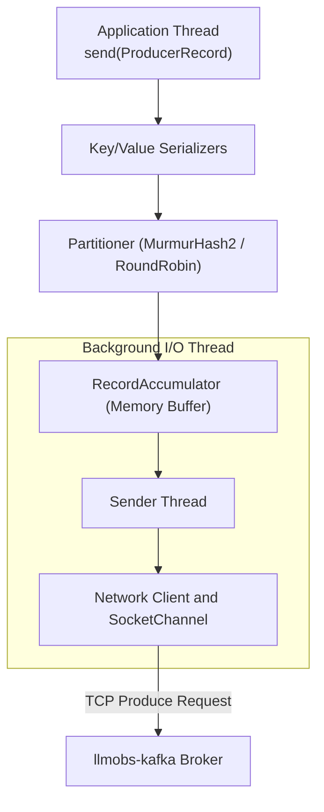

---

### 4.2 Producer Low-Level Design (LLD)

The low-level producer design reveals batching mechanics (`batch.size`, `linger.ms`), memory buffer pools (`buffer.memory`), inflight request tracking, retry logic, and acknowledgment handling.

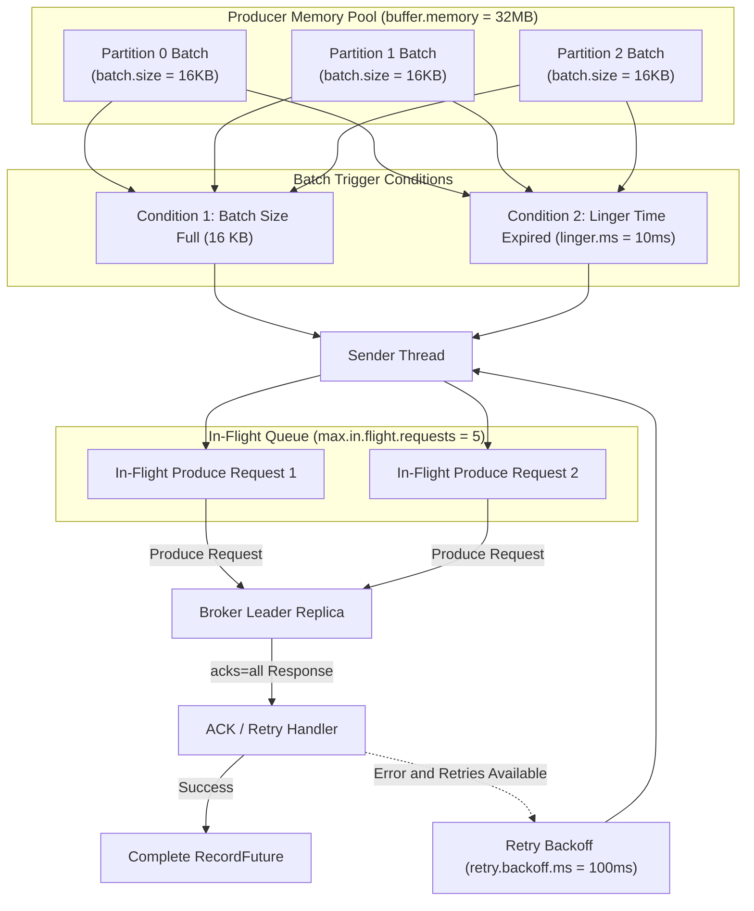

---

### 4.3 Producer Detailed Configuration Breakdown

| Dimension | Detailed Technical Specifications & Operational Guidance |
|---|---|
| **Parameter Key** | `acks` / `KAFKA_ACKS` |
| **File Location & Target** | Client Producer SDK Configuration |
| **Configured Value** | `all` (or `-1`) *(Prod)* \| `1` *(Dev)* |
| **Apache Kafka Default** | `all` (since Kafka 3.0) |
| **Criticality Rating** | CRITICAL |
| **1. What Is This Parameter?** | Dictates leader acknowledgment requirements before completing a produce request: `acks=0` (no ACK), `acks=1` (leader ACK only), `acks=all` (leader + all in-sync replicas ACK). |
| **2. Why & When to Use It** | Setting `acks=all` prevents message loss if the leader broker dies immediately after accepting a write. Use `acks=all` for all telemetry and trace producers. |
| **3. Impact on Current System** | Guarantees zero message loss in production when combined with `min.insync.replicas=2`. |
| **4. How & Why to Scale / Increase** | Keep `acks=all` in production. For ultra-low latency metrics where data loss is acceptable, set `acks=1`. |

| Dimension | Detailed Technical Specifications & Operational Guidance |
|---|---|
| **Parameter Key** | `linger.ms` & `batch.size` |
| **File Location & Target** | Client Producer SDK Configuration |
| **Configured Value** | `linger.ms=10` \| `batch.size=16384` (16 KB) |
| **Apache Kafka Default** | `linger.ms=0` \| `batch.size=16384` |
| **Criticality Rating** | HIGH |
| **1. What Is This Parameter?** | `batch.size` sets the maximum byte size per partition batch. `linger.ms` sets the maximum artificial delay to wait for more records to join the batch before sending. |
| **2. Why & When to Use It** | Default `linger.ms=0` sends records immediately, creating thousands of tiny single-record TCP requests. Setting `linger.ms=10` allows records to group into full 16KB batches, increasing network and disk throughput by up to 5x. |
| **3. Impact on Current System** | Significantly reduces network packet overhead and broker CPU utilization. |
| **4. How & Why to Scale / Increase** | Increase `linger.ms` to 20ms–50ms and `batch.size` to 64KB (65536) under high-throughput ingestion (> 10 MB/sec). |

| Dimension | Detailed Technical Specifications & Operational Guidance |
|---|---|
| **Parameter Key** | `buffer.memory` & `max.block.ms` |
| **File Location & Target** | Client Producer SDK Configuration |
| **Configured Value** | `buffer.memory=33554432` (32 MB) \| `max.block.ms=60000` (60 Seconds) |
| **Apache Kafka Default** | `buffer.memory=33554432` \| `max.block.ms=60000` |
| **Criticality Rating** | HIGH |
| **1. What Is This Parameter?** | `buffer.memory` sets total RAM available to the producer to buffer unsent batches. `max.block.ms` sets how long `send()` blocks when the buffer is full before throwing an exception. |
| **2. Why & When to Use It** | Protects producer application memory from un-bounded growth during broker network outages. |
| **3. Impact on Current System** | Bounces producer memory usage to 32 MB and throws `TimeoutException` if network outages persist past 60 seconds. |
| **4. How & Why to Scale / Increase** | Increase `buffer.memory` to 64MB or 128MB in high-throughput applications with bursts. |

---

## 5. Consumer Architecture & Component Deep-Dive

### 5.1 Consumer High-Level Design (HLD)

Consumers join Consumer Groups coordinated by a designated Broker Group Coordinator. Partitions are distributed among group members, and records are fetched in batches using long polling.

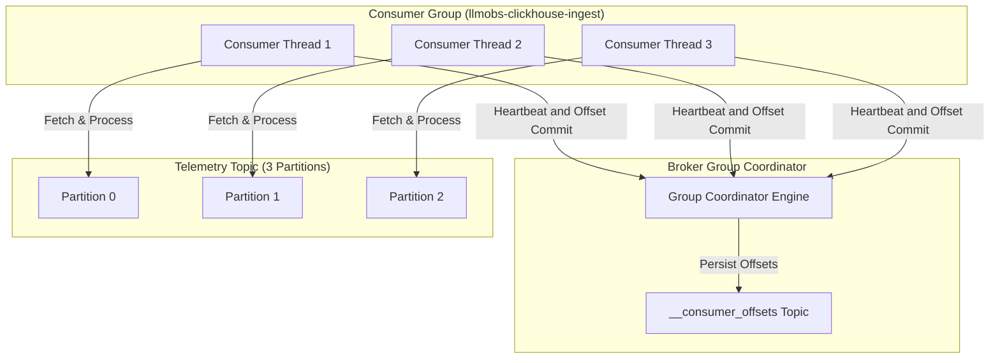

---

### 5.2 Consumer Low-Level Design (LLD)

The low-level consumer design illustrates group join protocol (`JoinGroup`/`SyncGroup`), poll execution, batch fetch queues, manual vs automatic offset commits, and consumer rebalance mechanics.

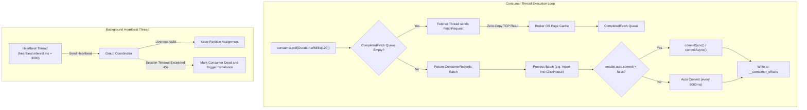

---

### 5.3 Consumer Detailed Configuration Breakdown

| Dimension | Detailed Technical Specifications & Operational Guidance |
|---|---|
| **Parameter Key** | `enable.auto.commit` & `auto.commit.interval.ms` |
| **File Location & Target** | Client Consumer SDK Configuration |
| **Configured Value** | `enable.auto.commit=false` *(Prod)* \| `true` *(Dev)* |
| **Apache Kafka Default** | `enable.auto.commit=true` \| `auto.commit.interval.ms=5000` |
| **Criticality Rating** | CRITICAL |
| **1. What Is This Parameter?** | Controls whether consumer offsets are committed automatically in the background on a periodic timer or managed explicitly by application code. |
| **2. Why & When to Use It** | Automatic commit (`true`) risks data loss if the consumer crashes after committing offsets but before completing ClickHouse database writes. Setting `false` allows manual commit after database write success (at-least-once delivery). |
| **3. Impact on Current System** | Guarantees exact telemetry delivery into ClickHouse without missing records. |
| **4. How & Why to Scale / Increase** | Always set `enable.auto.commit=false` in production data pipelines and call `commitSync()` / `commitAsync()`. |

| Dimension | Detailed Technical Specifications & Operational Guidance |
|---|---|
| **Parameter Key** | `max.poll.interval.ms` & `max.poll.records` |
| **File Location & Target** | Client Consumer SDK Configuration |
| **Configured Value** | `max.poll.interval.ms=300000` (5 Min) \| `max.poll.records=500` |
| **Apache Kafka Default** | `max.poll.interval.ms=300000` \| `max.poll.records=500` |
| **Criticality Rating** | HIGH |
| **1. What Is This Parameter?** | `max.poll.records` sets maximum records returned in a single `poll()`. `max.poll.interval.ms` sets maximum time allowed between `poll()` calls before the consumer is marked dead and evicted from the group. |
| **2. Why & When to Use It** | If ClickHouse batch inserts take longer than 5 minutes, Kafka assumes the consumer thread is stuck and triggers constant consumer group rebalance storms. |
| **3. Impact on Current System** | Prevents rebalance storms during large ClickHouse batch ingestion operations. |
| **4. How & Why to Scale / Increase** | If processing high-latency batches, reduce `max.poll.records` to 100 or increase `max.poll.interval.ms` to 600,000ms (10 minutes). |

| Dimension | Detailed Technical Specifications & Operational Guidance |
|---|---|
| **Parameter Key** | `auto.offset.reset` |
| **File Location & Target** | Client Consumer SDK Configuration |
| **Configured Value** | `earliest` *(Dev/Recovery)* \| `latest` *(Default Ingest)* |
| **Apache Kafka Default** | `latest` |
| **Criticality Rating** | HIGH |
| **1. What Is This Parameter?** | Dictates consumer behavior when no initial offset exists or when offset is out of range: `earliest` (start from oldest available record), `latest` (start from newest incoming record). |
| **2. Why & When to Use It** | Use `earliest` for new consumer groups that need to process historical buffered streams; use `latest` for real-time dashboard alerting. |
| **3. Impact on Current System** | Ensures new ingestion instances process all buffered streams without skipping data. |

---

## 6. Topic & Partition Management Architecture

### 6.1 Topic & Partition High-Level Design (HLD)

Topics are logical representations of event streams, physically divided into append-only log partitions distributed across brokers for horizontal scalability and high availability.

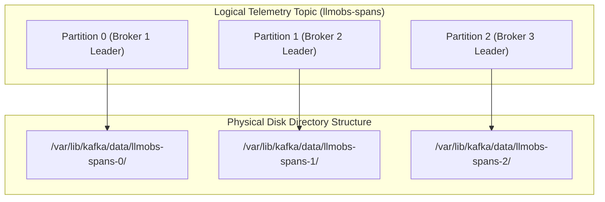

---

### 6.2 Topic & Partition Low-Level Design (LLD)

The low-level partition lifecycle shows log segment creation, active segment append operations, closed segment rolling, index file lookups, and log cleaner deletion execution.

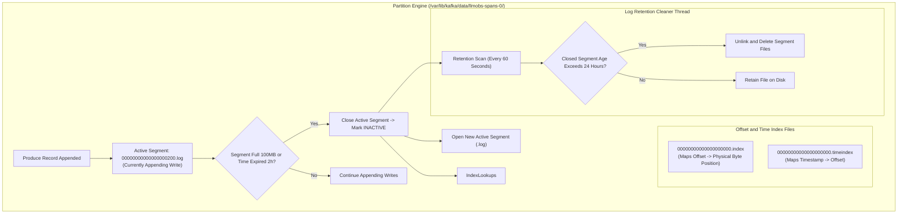

---

### 6.3 Topic & Partition Detailed Configuration Breakdown

| Dimension | Detailed Technical Specifications & Operational Guidance |
|---|---|
| **Parameter Key** | `log.segment.bytes` |
| **File Location & Target** | [`config/kafka/server.properties`](file:///home/btpl-lap-22/live/llm-obs-infra/config/kafka/server.properties) (Line 15) |
| **Configured Value** | `104857600` (100 MB) |
| **Apache Kafka Default** | `1073741824` (1 GB) |
| **Criticality Rating** | CRITICAL |
| **1. What Is This Parameter?** | Maximum byte size per partition segment file before closing and rolling a new active segment file. |
| **2. Why & When to Use It** | **Retention rules apply ONLY to closed segments. Active segments are NEVER deleted regardless of age.** Setting 100 MB allows low/medium volume topics to close segments rapidly for daily deletion. |
| **3. Impact on Current System** | Reclaims ~30 GB of storage space on `/dev/sda2` by preventing inactive topics from holding onto gigabytes of un-purged active segments. |
| **4. How & Why to Scale / Increase** | Increase to 512MB or 1GB in high-throughput production (> 50,000 msgs/sec) to avoid excessive file handle creation. |

| Dimension | Detailed Technical Specifications & Operational Guidance |
|---|---|
| **Parameter Key** | `log.retention.hours` |
| **File Location & Target** | [`config/kafka/server.properties`](file:///home/btpl-lap-22/live/llm-obs-infra/config/kafka/server.properties) (Line 16) |
| **Configured Value** | `24` (24 Hours / 1 Day) |
| **Apache Kafka Default** | `168` (168 Hours / 7 Days) |
| **Criticality Rating** | HIGH |
| **1. What Is This Parameter?** | Duration in hours that closed segment files are retained on disk before physical deletion. |
| **2. Why & When to Use It** | Kafka is an intermediate buffer. Telemetry data is consumed almost immediately by ClickHouse. Retaining 7 days duplicates data and consumes host storage. |
| **3. Impact on Current System** | Reclaims ~35 GB of disk space on `/dev/sda2` by deleting 1-day-old segments. |

| Dimension | Detailed Technical Specifications & Operational Guidance |
|---|---|
| **Parameter Key** | `log.roll.hours` |
| **File Location & Target** | [`config/kafka/server.properties`](file:///home/btpl-lap-22/live/llm-obs-infra/config/kafka/server.properties) (Line 17) |
| **Configured Value** | `2` (2 Hours) |
| **Apache Kafka Default** | `168` (168 Hours / 7 Days) |
| **Criticality Rating** | HIGH |
| **1. What Is This Parameter?** | Maximum time window after which an active segment is forcibly closed, even if segment size is less than 100 MB. |
| **2. Why & When to Use It** | Low-throughput topics take weeks to write 100 MB. Forced rolls every 2 hours guarantee active segments close and become eligible for 24-hour deletion. |
| **3. Impact on Current System** | Eliminates storage leaks on dormant or low-volume topics. |

---

## 7. Exactly-Once Semantics (EOS), Idempotency & Transactions

### 7.1 Idempotent Producer Mechanics (`enable.idempotence=true`)

When a network timeout occurs while a producer transmits a batch to the broker, the producer retries. Without idempotency, the broker accepts duplicate records.

```mermaid
graph TD
    subgraph Idempotent Producer Protocol
        P1["Producer Client (enable.idempotence=true)"] -->|1. Allocate Producer ID (PID)| B1["Broker Sequence Tracker"]
        P1 -->|2. Send Record Batch (PID: 101, Seq: 0)| B1
        B1 -->|3. Persist Batch Seq 0| S1["Partition Log"]
        B1 -.->|4. Network ACK Drops / Times Out| P1
        P1 -->|5. Retry Batch (PID: 101, Seq: 0)| B1
        B1 -->|6. Detect Duplicate Seq 0| D1["Discard Duplicate Payload & Re-ACK"]
    end
```

### 7.2 EOS Configuration Breakdown

| Dimension | Detailed Technical Specifications & Operational Guidance |
|---|---|
| **Parameter Key** | `enable.idempotence` |
| **File Location & Target** | Client Producer SDK Configuration |
| **Configured Value** | `true` |
| **Apache Kafka Default** | `true` (since Kafka 3.0) |
| **Criticality Rating** | CRITICAL |
| **1. What Is This Parameter?** | Ensures that the broker processes exactly one copy of a message batch sent by a producer, even if the producer retries due to network timeouts. |
| **2. Why & When to Use It** | Eliminates duplicate records in telemetry and trace metrics pipelines caused by transient network retries. |
| **3. Impact on Current System** | Eliminates duplicate span insertions into ClickHouse. |

| Dimension | Detailed Technical Specifications & Operational Guidance |
|---|---|
| **Parameter Key** | `isolation.level` |
| **File Location & Target** | Client Consumer SDK Configuration |
| **Configured Value** | `read_committed` *(Prod)* \| `read_uncommitted` *(Default)* |
| **Apache Kafka Default** | `read_uncommitted` |
| **Criticality Rating** | HIGH |
| **1. What Is This Parameter?** | Controls whether consumers read uncommitted transactional messages (`read_uncommitted`) or only messages belonging to committed transactions (`read_committed`). |
| **2. Why & When to Use It** | Prevents consumers from reading dirty records from aborted producer transactions. |

---

## 8. Log Compaction Mechanics & Cleanup Policies (`cleanup.policy`)

### 8.1 Log Compaction Lifecycle

Log compaction retains the latest value for each key within a partition log.

```mermaid
graph LR
    subgraph Before Compaction
        K1_V1["Key: K1, Val: V1 (Seq 1)"]
        K2_V1["Key: K2, Val: V1 (Seq 2)"]
        K1_V2["Key: K1, Val: V2 (Seq 3)"]
        K2_V2["Key: K2, Val: V2 (Seq 4)"]
    end

    subgraph Log Compaction Cleaner
        CleanerThread["Cleaner Thread"]
    end

    Before Compaction --> CleanerThread

    subgraph After Compaction
        K1_V2_Post["Key: K1, Val: V2 (Seq 3)"]
        K2_V2_Post["Key: K2, Val: V2 (Seq 4)"]
    end

    CleanerThread --> After Compaction
```

### 8.2 Compaction Configuration Breakdown

| Dimension | Detailed Technical Specifications & Operational Guidance |
|---|---|
| **Parameter Key** | `cleanup.policy` |
| **File Location & Target** | Topic Configuration / `server.properties` |
| **Configured Value** | `delete` *(Telemetry Streams)* \| `compact` *(State Stores)* |
| **Apache Kafka Default** | `delete` |
| **Criticality Rating** | HIGH |
| **1. What Is This Parameter?** | `delete` purges closed segments based on time/size. `compact` retains the latest record value per message key forever. `compact,delete` compacts by key and enforces time-based expiration. |
| **2. Why & When to Use It** | Use `delete` for streaming telemetry spans and access logs. Use `compact` for user profiles, service registries, and stateful application lookup caches. |

| Dimension | Detailed Technical Specifications & Operational Guidance |
|---|---|
| **Parameter Key** | `min.cleanable.dirty.ratio` |
| **File Location & Target** | `config/kafka/server.properties` |
| **Configured Value** | `0.5` (50% Dirty Ratio) |
| **Apache Kafka Default** | `0.5` |
| **Criticality Rating** | MEDIUM |
| **1. What Is This Parameter?** | Controls the percentage of uncompacted ("dirty") records required in a log segment before the compaction cleaner thread executes. |

---

## 9. Native Kafka Emergency CLI Commands & Incident Runbooks

### 9.1 Emergency Incident 1: Host Disk Storage 100% Full

When `/var/lib/kafka/data` hits 100%, Kafka locks active log segments or shuts down.

```bash
# Step 1: Identify top storage-consuming topics
docker exec -it llmobs-kafka-broker kafka-logdirs.sh \
  --bootstrap-server localhost:9092 \
  --describe

# Step 2: Dynamically override retention to 1 hour for the bloated topic
docker exec -it llmobs-kafka-broker kafka-configs.sh \
  --bootstrap-server localhost:9092 \
  --entity-type topics \
  --entity-name llmobs-spans \
  --alter \
  --add-config retention.ms=3600000

# Step 3: Verify retention cleaner purges closed log segments
docker exec -it llmobs-kafka-broker kafka-topics.sh \
  --bootstrap-server localhost:9092 \
  --describe \
  --topic llmobs-spans
```

---

### 9.2 Emergency Incident 2: Under-Replicated Partitions (URP)

```bash
# Step 1: List all under-replicated partitions across the cluster
docker exec -it llmobs-kafka-broker kafka-topics.sh \
  --bootstrap-server localhost:9092 \
  --describe \
  --under-replicated-partitions

# Step 2: Check broker disk directories for I/O errors or full drives
docker exec -it llmobs-kafka-broker kafka-logdirs.sh \
  --bootstrap-server localhost:9092 \
  --describe
```

---

### 9.3 Emergency Incident 3: Consumer Group Lag & Offset Reset

```bash
# Step 1: Inspect consumer group lag across all topics
docker exec -it llmobs-kafka-broker kafka-consumer-groups.sh \
  --bootstrap-server localhost:9092 \
  --describe \
  --group llmobs-clickhouse-ingest

# Step 2: Reset consumer group offsets to latest (skip broken buffer)
docker exec -it llmobs-kafka-broker kafka-consumer-groups.sh \
  --bootstrap-server localhost:9092 \
  --group llmobs-clickhouse-ingest \
  --reset-offsets \
  --to-latest \
  --execute \
  --topic llmobs-spans
```

---

## 10. Master Parameter Summary Matrix

| Config Parameter | Default Values | Values Example | What It Does | Why We Need To Set Up | Trade-off | Impact |
|---|---|---|---|---|---|---|
| `KAFKA_HEAP_OPTS` | `-Xms1G -Xmx1G` | Dev: `-Xms512m -Xmx1024m`<br/>Prod: `-Xms1024m -Xmx2048m` | Sets initial (`-Xms`) and maximum (`-Xmx`) RAM allocated strictly to JVM heap. | Fixes launcher bug where performance flags broke heap sizing; keeps JVM heap bounded. | Higher heap reduces RAM available for ClickHouse and OS Page Cache. | Bounds JVM heap to 1024MB max; reduces G1GC pause times to < 50ms. |
| `deploy.resources.limits.memory` | Unbounded (`None`) | Base: `2048M`<br/>Prod: `4096M` | Enforces hard Linux kernel cgroups memory limit around container process. | Prevents Kafka from consuming all 15 GB host RAM during telemetry spikes. | Under-provisioning limit triggers Linux OOM killer (Exit status 137). | Guarantees container RAM cannot exceed 2048MB; protects surrounding services. |
| `log.segment.bytes` | `1073741824` (1 GB) | Dev: `104857600` (100 MB)<br/>Prod: `536870912` (512 MB) | Sets max byte size of active `.log` file before closing and rolling a new segment. | Kafka retention ONLY deletes closed segments; 100 MB segments ensure rapid closure. | Very small segments under high load increase file handles and disk fragmentation. | Allows daily log retention to delete expired data; reclaims ~30 GB storage. |
| `log.retention.hours` | `168` (7 Days) | Dev: `24` (24 Hours)<br/>Prod: `72` (3 Days) | Defines duration closed log segments are retained on disk before deletion. | Kafka is an intermediate buffer; telemetry is ingested into ClickHouse immediately. | Lower retention means consumers have a shorter window to recover from outages. | Reclaims ~35 GB of disk space on `/dev/sda2` by deleting 1-day-old segments. |
| `log.roll.hours` | `168` (7 Days) | Base: `2` (2 Hours)<br/>Prod: `12` (12 Hours) | Forcibly closes active segment after time window even if segment size < 100 MB. | Low-throughput topics take weeks to reach 100 MB; forced rolls enable daily deletion. | Creates more segment files across dormant or low-volume topics. | Guarantees active log segments close within 2 hours for predictable deletion. |
| `log.retention.check.interval.ms` | `300000` (5 Min) | Base: `60000` (60 Seconds)<br/>Prod: `60000` (60 Seconds) | Sets millisecond interval for log cleaner thread to scan directories for expired files. | Rapidly deletes expired segments to free space on disk-constrained hosts. | Checking too frequently on 10,000+ partitions generates minor disk I/O. | Deletes expired segment files within 60 seconds of expiration; near-instant cleanup. |
| `offsets.topic.num.partitions` | `50` | Base: `3`<br/>Prod: `25` | Defines partition count for internal `__consumer_offsets` tracking topic. | Default 50 partitions waste directories and open file handles on single-broker setup. | Lower partitions may cause commit lock contention across 100+ consumer groups. | Cuts offset topic folders from 50 to 3; saves 188+ open file descriptors. |
| `num.partitions` | `1` | Base: `3`<br/>Prod: `3` | Sets default partition count for auto-created telemetry topics. | Enables 3-way parallel processing across worker threads matching CPU capacity. | Higher partitions increase metadata overhead and open segment file handles. | Enables 3-parallel consumer threads across 4 host CPU cores without thrash. |
| `acks` | `all` | Dev: `1`<br/>Prod: `all` | Producer acknowledgment requirements before completing write request. | Setting `all` guarantees message persistence across in-sync replicas before returning. | `acks=all` increases write latency slightly compared to `acks=1`. | Guarantees zero message loss during broker outages in production. |
| `linger.ms` | `0` | Base: `10`<br/>Prod: `20` | Artificial producer delay to wait for records to form full batch before sending. | Batching small records into 16KB batches increases network and disk throughput 5x. | Adds minor artificial delay (10ms) to record transmission. | Increases network ingestion throughput and reduces CPU socket overhead. |
| `batch.size` | `16384` (16 KB) | Base: `16384`<br/>Prod: `65536` (64 KB) | Maximum byte size per partition batch in producer memory buffer. | Controls memory batch size sent in a single produce request. | Larger batch size increases producer memory allocation per partition. | Optimizes disk sequential write blocks and network socket payloads. |
| `enable.auto.commit` | `true` | Dev: `true`<br/>Prod: `false` | Controls whether consumer commits offsets automatically or via manual code. | Manual commit (`false`) prevents data loss if consumer crashes mid-processing. | Requires explicit `commitSync()` or `commitAsync()` code handling. | Guarantees at-least-once processing into ClickHouse without data gaps. |
| `max.poll.interval.ms` | `300000` (5 Min) | Base: `300000`<br/>Prod: `600000` (10 Min) | Maximum time allowed between consumer `poll()` calls before eviction. | Prevents rebalance storms when ClickHouse batch inserts take extended time. | Setting too high delays failure detection when a consumer actually dies. | Eliminates consumer group rebalance storms during long database writes. |
| `enable.idempotence` | `true` | Base: `true`<br/>Prod: `true` | Enables Producer ID and sequence tracking to eliminate duplicate record writes. | Prevents duplicate record writes caused by producer network retries. | Negligible CPU overhead for sequence number validation. | Guarantees exact-once message writing to topic partition logs. |
| `cleanup.policy` | `delete` | Base: `delete`<br/>Prod: `delete` *(or `compact` for state)* | Defines topic log cleanup strategy (`delete`, `compact`, `compact,delete`). | Controls whether log segments are deleted by time or compacted by record key. | Compaction requires background CPU and memory for dirty segment cleaner threads. | Prevents unbounded growth on key-value state store topics. |

---

## 11. Multi-Broker Scale-Out Architecture (Single-Node to 3-Node KRaft)

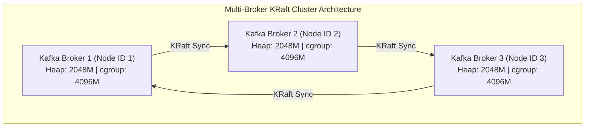
