# Apache Kafka Comprehensive Architecture, Component Deep-Dive & Operational Guide

## 1. Executive Master Parameter Reference Specifications

To avoid scrolling back and forth between sections, this master reference provides an immediate, unified list of every Kafka parameter, its definitions, expected environment values, currently configured values, outcomes, trade-offs, and system impacts.

### 1.1 Master Parameter Specifications & Expected Values List

1. **Parameter**: `KAFKA_HEAP_OPTS`
   - **Definition**: Controls initial (`-Xms`) and maximum (`-Xmx`) physical RAM allocated strictly to JVM heap objects (broker metadata, request queues, partition offset indexes).
   - **Expected Values**: Dev: `-Xms512m -Xmx1024m` | Prod: `-Xms1024m -Xmx2048m` | Enterprise: `-Xms4096m -Xmx4096m`
   - **Currently Configured Value**: `-Xms512m -Xmx1024m` (Base Dev in `docker-compose.yml`) / `-Xms1024m -Xmx2048m` (Prod Override in `docker-compose.prod.yml`)
   - **Outcome / System Impact**: Restricts JVM heap to 1024MB max, leaving off-heap headroom for Linux OS Page Cache and Metaspace. Keeps G1GC collection pauses under 50ms on 4 CPU cores.
   - **Why & When to Configure It**: Fixes launcher bug where performance flags broke heap sizing; keeps JVM memory bounded to prevent host RAM starvation.
   - **Scaling & Troubleshooting**: Higher heap reduces RAM available for OS Page Cache. Monitor JMX metric `jvm_gc_pause_seconds` (> 0.5s) or error `java.lang.OutOfMemoryError: Java heap space`. Formula: `Container Limit = JVM Heap (-Xmx) + 1024MB`.

---

2. **Parameter**: `deploy.resources.limits.memory` & `reservations.memory`
   - **Definition**: Establishes hard Linux kernel `cgroups` memory boundaries around the Kafka container process.
   - **Expected Values**: Dev: `2048M` limit, `512M` reservation | Prod: `4096M` limit | Enterprise: `8192M` limit
   - **Currently Configured Value**: Limit: `2048M`, Reservation: `512M` (in `docker-compose.yml`)
   - **Outcome / System Impact**: Guarantees Kafka cannot exceed 2 GB of physical host RAM under any burst condition. Preserves memory headroom for host processes.
   - **Why & When to Configure It**: Prevents a single container from consuming all host RAM and triggering the Linux kernel Out-Of-Memory (OOM) killer against adjacent services.
   - **Scaling & Troubleshooting**: Under-provisioning limit triggers Linux OOM killer (Exit status 137). Monitor via `docker ps -a` or `dmesg | grep -i oom`. Formula: `Container Limit = JVM Heap (-Xmx) + 1024M`.

---

3. **Parameter**: `log.segment.bytes`
   - **Definition**: Maximum byte size per partition segment file before closing and rolling a new active segment file.
   - **Expected Values**: Dev: `104857600` (100 MB) | Medium Prod: `268435456` (256 MB) | High-Throughput Prod: `536870912` (512 MB)
   - **Currently Configured Value**: `104857600` (100 MB in `config/kafka/server.properties`)
   - **Outcome / System Impact**: Reclaims ~30 GB of storage space on `/dev/sda2` by enabling rapid closure of segment files.
   - **Why & When to Configure It**: Kafka log retention ONLY deletes closed segments; active segments are never deleted regardless of age. 100 MB segments allow rapid segment closure.
   - **Scaling & Troubleshooting**: Very small segments under high throughput increase open file handle count. Increase to 512MB under > 50,000 msgs/sec load.

---

4. **Parameter**: `log.retention.hours`
   - **Definition**: Duration in hours that closed segment files are retained on disk before physical deletion.
   - **Expected Values**: Dev: `24` (24 Hours) | Production Buffer: `72` (3 Days) | Long Retention: `168` (7 Days)
   - **Currently Configured Value**: `24` (24 Hours in `config/kafka/server.properties`)
   - **Outcome / System Impact**: Reclaims ~35 GB of disk space on `/dev/sda2` by deleting 1-day-old log segments.
   - **Why & When to Configure It**: Kafka is an intermediate buffer. Retaining logs for 7 days duplicates data and fills host disks.
   - **Scaling & Troubleshooting**: Lower retention shortens the recovery window for offline consumers. Increase to 72h if consumer downtime risks exceed 24 hours.

---

5. **Parameter**: `log.roll.hours`
   - **Definition**: Maximum time window after which an active segment is forcibly closed, even if segment size is less than 100 MB.
   - **Expected Values**: Low-Volume Topics: `2` (2 Hours) | High-Volume Topics: `12` (12 Hours) or `24` (24 Hours)
   - **Currently Configured Value**: `2` (2 Hours in `config/kafka/server.properties`)
   - **Outcome / System Impact**: Guarantees active log segments close within 2 hours, making them eligible for retention cleanup.
   - **Why & When to Configure It**: Low-throughput topics take weeks to write 100 MB. Forced rolls enable regular file deletion.
   - **Scaling & Troubleshooting**: Creates more segment files across dormant topics. Maintain 2h for low-volume telemetry setups.

---

6. **Parameter**: `log.retention.check.interval.ms`
   - **Definition**: Millisecond interval for the log cleaner thread to scan log directories for expired segment files.
   - **Expected Values**: Dev/Base: `60000` (60 Seconds) | Large Cluster: `300000` (5 Minutes)
   - **Currently Configured Value**: `60000` (60 Seconds in `config/kafka/server.properties`)
   - **Outcome / System Impact**: Deletes expired segment files within 60 seconds of expiration, reclaiming disk space rapidly.
   - **Why & When to Configure It**: Rapidly frees disk space on disk-constrained hosts.
   - **Scaling & Troubleshooting**: Scanning too frequently on clusters with 10,000+ partitions generates minor disk I/O overhead.

---

7. **Parameter**: `offsets.topic.num.partitions`
   - **Definition**: Partition count for the internal `__consumer_offsets` tracking topic.
   - **Expected Values**: Dev / Single-Broker: `3` | Medium Prod: `10` to `25` | Enterprise Cluster: `50`
   - **Currently Configured Value**: `3` (in `config/kafka/server.properties`)
   - **Outcome / System Impact**: Saves 188+ open file descriptors and directory entries on single-broker instances.
   - **Why & When to Configure It**: Default 50 partitions waste file descriptors on low-node environments.
   - **Scaling & Troubleshooting**: Lower partitions may cause commit lock contention across 100+ active consumer groups. Scale up to 25 when consumer group count grows.

---

8. **Parameter**: `num.partitions`
   - **Definition**: Default partition count for newly auto-created topics.
   - **Expected Values**: Dev: `3` | Small Prod: `3` to `6` | Enterprise Cluster: `12`+
   - **Currently Configured Value**: `3` (in `config/kafka/server.properties`)
   - **Outcome / System Impact**: Enables 3-way parallel processing across worker threads matching host CPU core count.
   - **Why & When to Configure It**: Default 1 partition bottlenecks all consumer throughput to a single thread.
   - **Scaling & Troubleshooting**: Match partition count to target consumer thread parallelism. Avoid exceeding 100 partitions per broker core.

---

9. **Parameter**: `default.replication.factor` & `offsets.topic.replication.factor`
   - **Definition**: Defines default replica copy count for auto-created user topics and internal `__consumer_offsets`.
   - **Expected Values**: Single-Broker Dev: `1` | Multi-Node Production Cluster: `3`
   - **Currently Configured Value**: `1` (Dev Single-Node) / `3` (Prod Multi-Node)
   - **Outcome / System Impact**: Determines number of physical broker copies storing partition log data.
   - **Why & When to Configure It**: Replication factor of 3 ensures zero data loss if up to 2 brokers fail concurrently.
   - **Scaling & Troubleshooting**: Triples disk storage and network replication bandwidth requirement across nodes.

---

10. **Parameter**: `min.insync.replicas`
    - **Definition**: Minimum number of in-sync replicas (ISR) that must acknowledge a produce request when `acks=all`.
    - **Expected Values**: Dev: `1` | Multi-Broker Production: `2` | High-Availability Cluster: `2` (out of 3 replicas)
    - **Currently Configured Value**: `1` (Dev) / `2` (Prod)
    - **Outcome / System Impact**: Prevents data loss during broker crashes by enforcing minimum write durability quorum.
    - **Why & When to Configure It**: If a leader broker fails, having `min.insync.replicas=2` guarantees at least one replica has identical committed data.
    - **Scaling & Troubleshooting**: If active ISR count falls below `min.insync.replicas`, producers with `acks=all` receive `NotEnoughReplicasException`.

---

11. **Parameter**: `acks` / `KAFKA_ACKS`
    - **Definition**: Dictates leader acknowledgment requirements before completing a produce request (`acks=0`, `acks=1`, `acks=all`).
    - **Expected Values**: Low-Latency: `1` | Production Durability: `all` (or `-1`)
    - **Currently Configured Value**: `all` (Prod) / `1` (Dev)
    - **Outcome / System Impact**: Guarantees zero message loss during broker failovers when combined with `min.insync.replicas=2`.
    - **Why & When to Configure It**: Setting `acks=all` ensures writes are acknowledged by all in-sync replicas before returning success.
    - **Scaling & Troubleshooting**: `acks=all` adds slight write latency compared to `acks=1` but guarantees durability.

---

12. **Parameter**: `linger.ms`
    - **Definition**: Artificial producer delay (in milliseconds) to wait for incoming records to form full batches before sending TCP requests.
    - **Expected Values**: Low-Latency: `0` | Base Ingestion: `10` | High-Throughput: `20` to `50`
    - **Currently Configured Value**: `10` ms
    - **Outcome / System Impact**: Increases network and disk throughput 5x by batching small records into full 16KB batches.
    - **Why & When to Configure It**: Default `linger.ms=0` sends records immediately, causing network socket churn.
    - **Scaling & Troubleshooting**: Adds minor latency (10ms). Increase to 20-50ms during high-volume data ingest.

---

13. **Parameter**: `batch.size`
    - **Definition**: Maximum byte size per partition batch in producer memory buffer.
    - **Expected Values**: Base / Dev: `16384` (16 KB) | Production High-Throughput: `65536` (64 KB)
    - **Currently Configured Value**: `16384` (16 KB)
    - **Outcome / System Impact**: Controls memory allocation per partition batch sent in a produce request.
    - **Why & When to Configure It**: Grouping records into 16KB or 64KB batches reduces CPU overhead and optimizes disk write block sizes.
    - **Scaling & Troubleshooting**: Larger batch size increases producer RAM allocation per topic partition.

---

14. **Parameter**: `enable.auto.commit` & `auto.commit.interval.ms`
    - **Definition**: Controls whether consumer offsets are committed automatically on a periodic timer or explicitly managed in code.
    - **Expected Values**: Reliable Data Pipelines: `false` | Real-Time Dashboard Alerting: `true`
    - **Currently Configured Value**: `false` (Prod) / `true` (Dev)
    - **Outcome / System Impact**: Guarantees at-least-once delivery into target processing systems without data loss.
    - **Why & When to Configure It**: Automatic commit (`true`) risks missing data if the consumer crashes before processing completes.
    - **Scaling & Troubleshooting**: Requires manual `commitSync()` / `commitAsync()` calls after successful processing.

---

15. **Parameter**: `max.poll.interval.ms` & `max.poll.records`
    - **Definition**: `max.poll.records` sets max records per `poll()`. `max.poll.interval.ms` sets max time allowed between `poll()` calls before consumer group eviction.
    - **Expected Values**: Fast Ingest: `max.poll.records=500`, `max.poll.interval.ms=300000` (5 Min) | Heavy DB Batching: `max.poll.records=100`, `max.poll.interval.ms=600000` (10 Min)
    - **Currently Configured Value**: `max.poll.interval.ms=300000` (5 Min) | `max.poll.records=500`
    - **Outcome / System Impact**: Prevents rebalance storms when record processing takes extended time.
    - **Why & When to Configure It**: If record processing takes longer than the interval, Kafka assumes the consumer is dead and triggers group rebalance.
    - **Scaling & Troubleshooting**: Reduce `max.poll.records` or increase `max.poll.interval.ms` for slow processing sinks.

---

16. **Parameter**: `enable.idempotence`
    - **Definition**: Enables Producer ID and sequence number tracking to eliminate duplicate record writes on the broker.
    - **Expected Values**: Standard: `true` | Disabled: `false`
    - **Currently Configured Value**: `true`
    - **Outcome / System Impact**: Guarantees exactly-once record writing to partition logs during producer retries.
    - **Why & When to Configure It**: Prevents duplicate record writes caused by transient network retries.
    - **Scaling & Troubleshooting**: Requires `acks=all` and `max.in.flight.requests.per.connection <= 5`.

---

17. **Parameter**: `cleanup.policy`
    - **Definition**: Defines log segment cleanup strategy (`delete` by age/size, `compact` by key, `compact,delete` hybrid).
    - **Expected Values**: Telemetry Streams: `delete` | State Store Topics: `compact` | Hybrid: `compact,delete`
    - **Currently Configured Value**: `delete`
    - **Outcome / System Impact**: Controls whether segments are purged by time or compacted to retain latest state per key.
    - **Why & When to Configure It**: Use `delete` for streaming records and access logs. Use `compact` for application state caches.
    - **Scaling & Troubleshooting**: Log compaction consumes background CPU and memory for dirty segment cleaner threads.

---

18. **Parameter**: `compression.type`
    - **Definition**: Specifies record batch compression algorithm (`none`, `gzip`, `snappy`, `lz4`, `zstd`).
    - **Expected Values**: High-CPU Ingest: `lz4` or `snappy` | High-Ratio Storage: `zstd` | Legacy: `gzip`
    - **Currently Configured Value**: `lz4` (Producer) / `producer` (Broker Inherit)
    - **Outcome / System Impact**: Reduces network bandwidth usage and disk storage footprint by 3x–7x with minimal CPU overhead.
    - **Why & When to Configure It**: Batching records into `lz4` compresses text JSON records and trace spans efficiently.
    - **Scaling & Troubleshooting**: `lz4` provides optimal CPU-to-compression speed ratio for streaming telemetry.

---

19. **Parameter**: `max.in.flight.requests.per.connection`
    - **Definition**: Maximum number of unacknowledged produce requests the producer client sends on a single TCP connection before blocking.
    - **Expected Values**: Strict Message Ordering + Idempotency: `5` (or `1`) | Non-Idempotent Strict Order: `1`
    - **Currently Configured Value**: `5`
    - **Outcome / System Impact**: Maximizes network pipeline throughput while ensuring message ordering when `enable.idempotence=true`.
    - **Why & When to Configure It**: Setting higher than 1 on non-idempotent producers risks message reordering if retries occur.
    - **Scaling & Troubleshooting**: Always set `<= 5` when `enable.idempotence=true` to maintain strict partition sequence guarantees.

---

20. **Parameter**: `fetch.min.bytes` & `fetch.max.wait.ms`
    - **Definition**: `fetch.min.bytes` sets minimum data bytes broker should return for a fetch request. `fetch.max.wait.ms` sets max time broker waits to accumulate `fetch.min.bytes`.
    - **Expected Values**: Low-Latency: `fetch.min.bytes=1`, `fetch.max.wait.ms=500` | High-Throughput Sink: `fetch.min.bytes=1048576` (1 MB), `fetch.max.wait.ms=500`
    - **Currently Configured Value**: `fetch.min.bytes=1048576` (1 MB) | `fetch.max.wait.ms=500` ms
    - **Outcome / System Impact**: Reduces consumer CPU poll loop iterations and broker network I/O calls by 10x.
    - **Why & When to Configure It**: Stops consumer from executing empty poll loops on low-throughput topics.
    - **Scaling & Troubleshooting**: Increase `fetch.min.bytes` to 1MB or 4MB in batch analytics consumers.

---

21. **Parameter**: `session.timeout.ms` & `heartbeat.interval.ms`
    - **Definition**: `session.timeout.ms` sets max time group coordinator waits for heartbeats before evicting consumer. `heartbeat.interval.ms` sets frequency of background heartbeat thread.
    - **Expected Values**: Production Ingest: `session.timeout.ms=45000` (45s), `heartbeat.interval.ms=3000` (3s) | Aggressive Eviction: `session.timeout.ms=10000` (10s), `heartbeat.interval.ms=3000`
    - **Currently Configured Value**: `session.timeout.ms=45000` | `heartbeat.interval.ms=3000`
    - **Outcome / System Impact**: Eliminates false consumer group rebalances caused by transient network GC pauses.
    - **Why & When to Configure It**: Rule of thumb: `heartbeat.interval.ms` must be `<= 1/3` of `session.timeout.ms`.
    - **Scaling & Troubleshooting**: Increase `session.timeout.ms` to 45s in containerized cloud environments with transient network latency.

---

22. **Parameter**: `num.network.threads` & `num.io.threads`
    - **Definition**: `num.network.threads` sets NIO network acceptor/response threads. `num.io.threads` sets disk read/write request handler threads.
    - **Expected Values**: Base Dev (4 Core): `num.network.threads=3`, `num.io.threads=4` | High-Core Prod (16 Core): `num.network.threads=8`, `num.io.threads=16`
    - **Currently Configured Value**: `num.network.threads=3` | `num.io.threads=4` (in `config/kafka/server.properties`)
    - **Outcome / System Impact**: Prevents request queue contention under high concurrent client connection counts.
    - **Why & When to Configure It**: `num.io.threads` should equal physical CPU core count or disk drive count; `num.network.threads` should equal 50% CPU core count.
    - **Scaling & Troubleshooting**: Monitor JMX metric `RequestHandlerAvgIdlePercent` (< 0.2 means IO threads exhausted).

---

23. **Parameter**: `security.protocol` & `sasl.mechanism`
    - **Definition**: Configures cluster transport security protocol (`PLAINTEXT`, `SSL`, `SASL_PLAINTEXT`, `SASL_SSL`) and authentication mechanism (`PLAIN`, `SCRAM-SHA-256`, `SCRAM-SHA-512`).
    - **Expected Values**: Local Dev: `PLAINTEXT` | Internal VPC: `SASL_PLAINTEXT` (SCRAM-SHA-512) | Public/Cross-DC: `SASL_SSL` (SCRAM-SHA-512)
    - **Currently Configured Value**: `PLAINTEXT` (Dev/Internal Docker Network)
    - **Outcome / System Impact**: Enforces encrypted TLS network wire transfers and authenticated client ACL access permissions.
    - **Why & When to Configure It**: Prevents unauthorized client reading/writing to Kafka topics.
    - **Scaling & Troubleshooting**: TLS encryption adds 3–5% CPU overhead for hardware AES-NI packet encryption.

---

24. **Parameter**: `min.cleanable.dirty.ratio` & `segment.ms`
    - **Definition**: `min.cleanable.dirty.ratio` sets dirty record threshold percentage before log cleaner runs. `segment.ms` sets forced segment roll time for compacted topics.
    - **Expected Values**: Normal Compaction: `0.5` (50%), `segment.ms=604800000` (7 Days) | Aggressive Compaction: `0.2` (20%), `segment.ms=86400000` (24 Hours)
    - **Currently Configured Value**: `0.5` | `segment.ms=604800000`
    - **Outcome / System Impact**: Controls background cleaner CPU overhead and state store memory retention.
    - **Why & When to Configure It**: Compacting dirty segments purges old key revisions, saving state store disk space.
    - **Scaling & Troubleshooting**: Monitor JMX cleaner thread stats `max-dirty-percent`.

---

25. **Parameter**: `isolation.level`
    - **Definition**: Controls whether consumer reads uncommitted transactional messages (`read_uncommitted`) or only committed transactions (`read_committed`).
    - **Expected Values**: Non-Transactional Telemetry: `read_uncommitted` | Transactional Ingest / EOS: `read_committed`
    - **Currently Configured Value**: `read_committed` (Prod) / `read_uncommitted` (Dev)
    - **Outcome / System Impact**: Guarantees consumers skip aborted transaction records and control markers.
    - **Why & When to Configure It**: Required when using transactional producers (`begin_transaction`, `commit_transaction`) to prevent reading dirty data.
    - **Scaling & Troubleshooting**: `read_committed` buffers uncommitted messages in consumer memory until transaction commit marker arrives.

---

26. **Parameter**: `buffer.memory` & `max.block.ms`
    - **Definition**: `buffer.memory` sets total bytes available to producer for record accumulator buffering. `max.block.ms` sets max time `send()` blocks when accumulator is full.
    - **Expected Values**: Base Dev: `33554432` (32 MB) | High-Burst Production: `67108864` (64 MB) or `134217728` (128 MB)
    - **Currently Configured Value**: `33554432` (32 MB) | `max.block.ms=60000` (60 Seconds)
    - **Outcome / System Impact**: Bounds producer application RAM usage and throws `TimeoutException` if broker connection fails.
    - **Why & When to Configure It**: Protects producer applications from Out-Of-Memory crashes during network partition outages.
    - **Scaling & Troubleshooting**: Increase `buffer.memory` to 64MB or 128MB when handling large burst traffic spikes.

---

27. **Parameter**: `auto.offset.reset`
    - **Definition**: Controls consumer starting position when no valid initial offset is found in `__consumer_offsets` (`earliest`, `latest`, `none`).
    - **Expected Values**: Batch Ingestion / Data Backfill: `earliest` | Real-Time Monitoring: `latest`
    - **Currently Configured Value**: `earliest`
    - **Outcome / System Impact**: Ensures new consumer groups read from offset 0 rather than dropping historical topic records.
    - **Why & When to Configure It**: Use `earliest` to prevent data loss when deploying new consumer groups.
    - **Scaling & Troubleshooting**: `none` throws `NoOffsetForPartitionException` if no committed offset is located.

---

28. **Parameter**: `group.instance.id` (Static Membership)
    - **Definition**: Unique string identifier assigned to a consumer instance enabling static group membership protocol.
    - **Expected Values**: Dynamic Pods: `None` | Kubernetes StatefulSets / Container Instances: `instance-pod-0`, `instance-pod-1`
    - **Currently Configured Value**: `None` (Dynamic Membership)
    - **Outcome / System Impact**: Eliminates partition rebalances during rolling application container updates.
    - **Why & When to Configure It**: Allows restarting consumers to rejoin within `session.timeout.ms` and reclaim identical partition assignments without triggering group-wide rebalances.
    - **Scaling & Troubleshooting**: Requires setting `session.timeout.ms` to at least 45 seconds.

---

29. **Parameter**: `queued.max.requests` & `socket.request.max.bytes`
    - **Definition**: `queued.max.requests` sets max un-processed requests allowed in memory request queue. `socket.request.max.bytes` sets max byte payload allowed for a single network request.
    - **Expected Values**: Base Dev: `queued.max.requests=500`, `socket.request.max.bytes=104857600` (100 MB) | Production Cluster: `queued.max.requests=10000`, `socket.request.max.bytes=104857600`
    - **Currently Configured Value**: `500` | `104857600` (100 MB)
    - **Outcome / System Impact**: Prevents broker memory exhaustion from client request surges while enforcing request size bounds.
    - **Why & When to Configure It**: Protects broker JVM heap from unbounded request object queue accumulation.
    - **Scaling & Troubleshooting**: Monitor JMX metric `RequestQueueTimeMs`.

---

30. **Parameter**: `unclean.leader.election.enable`
    - **Definition**: Dictates whether out-of-sync replicas (non-ISR) can be elected as partition leader if all ISR replicas fail (`true` or `false`).
    - **Expected Values**: Financial / Loss-Averse Production: `false` | High-Availability Alerting: `true`
    - **Currently Configured Value**: `false`
    - **Outcome / System Impact**: Prevents silent data loss and log divergence during catastrophic broker outages.
    - **Why & When to Configure It**: Setting `false` guarantees that non-ISR replicas containing missing writes are never elected leader.
    - **Scaling & Troubleshooting**: Setting `false` prioritizes data durability over availability during ISR multi-node failures.

---

## 2. System-Wide Kafka High-Level (HLD) & Low-Level (LLD) Design

### 2.1 System Integration Configuration & Python Code

```yaml
services:
  llmobs-kafka:
    image: apache/kafka:latest
    environment:
      - KAFKA_NODE_ID=1
      - KAFKA_PROCESS_ROLES=broker,controller
      - KAFKA_LISTENERS=PLAINTEXT://:9092,CONTROLLER://:9093
      - KAFKA_HEAP_OPTS=-Xms512m -Xmx1024m
```

```python
from confluent_kafka import Producer, Consumer

producer_config = {
    'bootstrap.servers': 'localhost:31414',
    'client.id': 'telemetry-ingest-agent',
    'acks': 'all',
    'enable.idempotence': True,
    'linger.ms': 10,
    'batch.size': 16384,
    'max.in.flight.requests.per.connection': 5,
    'compression.type': 'lz4',
    'retries': 5,
    'retry.backoff.ms': 100,
    'buffer.memory': 33554432,
    'max.block.ms': 60000
}
producer = Producer(producer_config)
producer.produce('llmobs-spans', key='trace_101', value='{"span_id": "s101", "duration_ms": 42}')
producer.flush()

consumer_config = {
    'bootstrap.servers': 'localhost:31414',
    'group.id': 'llmobs-clickhouse-ingest',
    'client.id': 'clickhouse-ingest-worker-1',
    'auto.offset.reset': 'earliest',
    'enable.auto.commit': False,
    'auto.commit.interval.ms': 5000,
    'max.poll.interval.ms': 300000,
    'max.poll.records': 500,
    'session.timeout.ms': 45000,
    'heartbeat.interval.ms': 3000,
    'fetch.min.bytes': 1048576,
    'fetch.max.wait.ms': 500,
    'max.partition.fetch.bytes': 1048576,
    'isolation.level': 'read_committed',
    'partition.assignment.strategy': 'cooperative-sticky'
}
consumer = Consumer(consumer_config)
consumer.subscribe(['llmobs-spans'])
```

---

### 2.2 System High-Level Design (HLD) — Pure Kafka Architecture

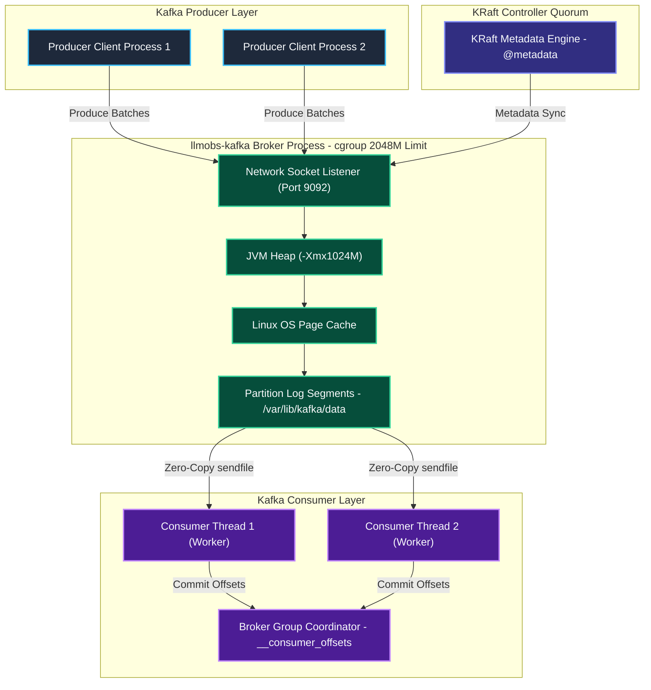

---

### 2.3 System Low-Level Design (LLD) — End-to-End Execution Flow

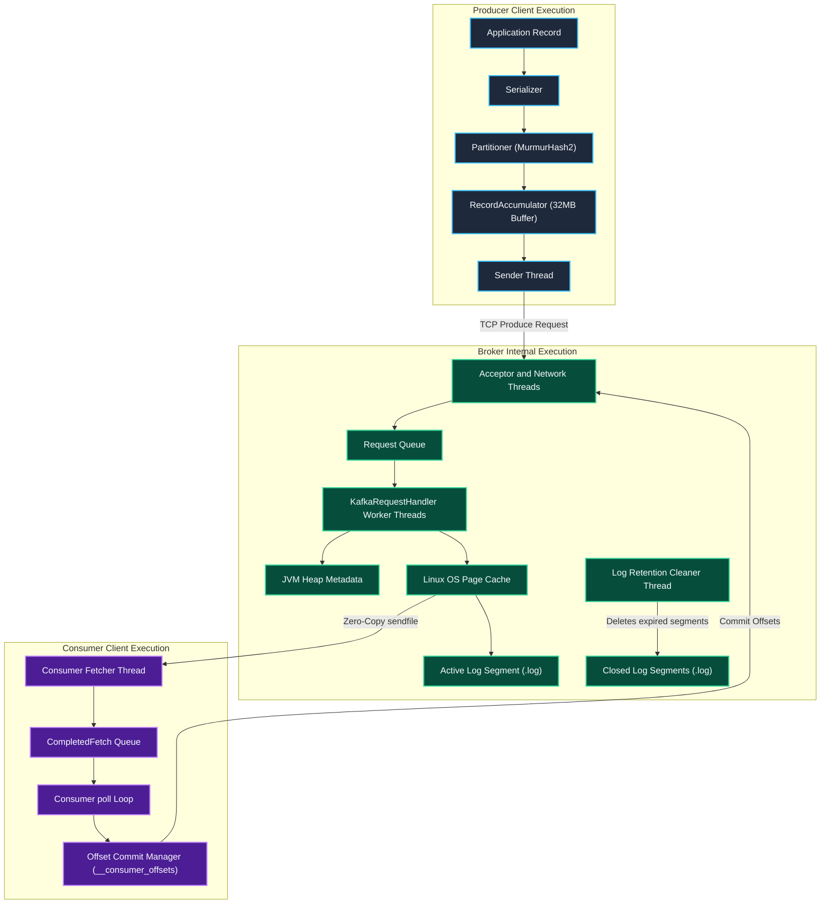

---

## 3. Broker & KRaft Metadata Architecture Deep-Dive

### 3.1 Broker Configuration & Python Admin Code

```properties
node.id=1
process.roles=broker,controller
listeners=PLAINTEXT://0.0.0.0:9092,CONTROLLER://0.0.0.0:9093
advertised.listeners=PLAINTEXT://localhost:31414
num.network.threads=3
num.io.threads=4
socket.send.buffer.bytes=1048576
socket.receive.buffer.bytes=1048576
socket.request.max.bytes=104857600
log.dirs=/var/lib/kafka/data
num.partitions=3
offsets.topic.num.partitions=3
default.replication.factor=1
offsets.topic.replication.factor=1
min.insync.replicas=1
log.segment.bytes=104857600
log.retention.hours=24
log.roll.hours=2
log.retention.check.interval.ms=60000
log.cleaner.enable=true
log.cleaner.threads=2
log.cleaner.dedupe.buffer.size=134217728
```

```python
from confluent_kafka.admin import AdminClient

admin_client = AdminClient({'bootstrap.servers': 'localhost:31414'})
cluster_metadata = admin_client.list_topics(timeout=10)

print(f"Broker Controller Node ID: {cluster_metadata.controller_id}")
for broker_id, broker in cluster_metadata.brokers.items():
    print(f"Active Broker Node: {broker_id} -> {broker.host}:{broker.port}")
```

---

### 3.2 Broker High-Level Design (HLD)

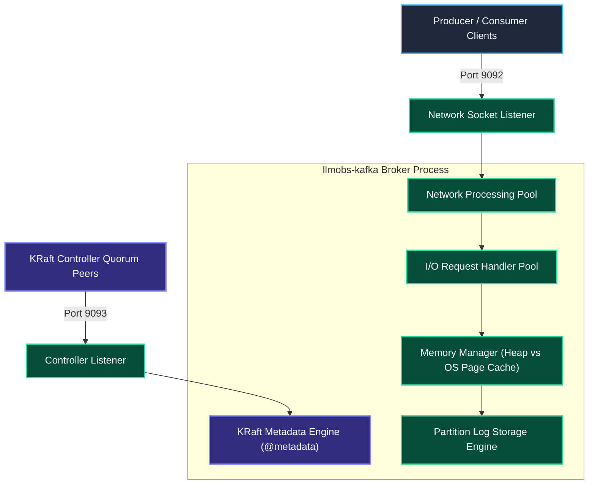

---

### 3.3 Broker Low-Level Design (LLD)

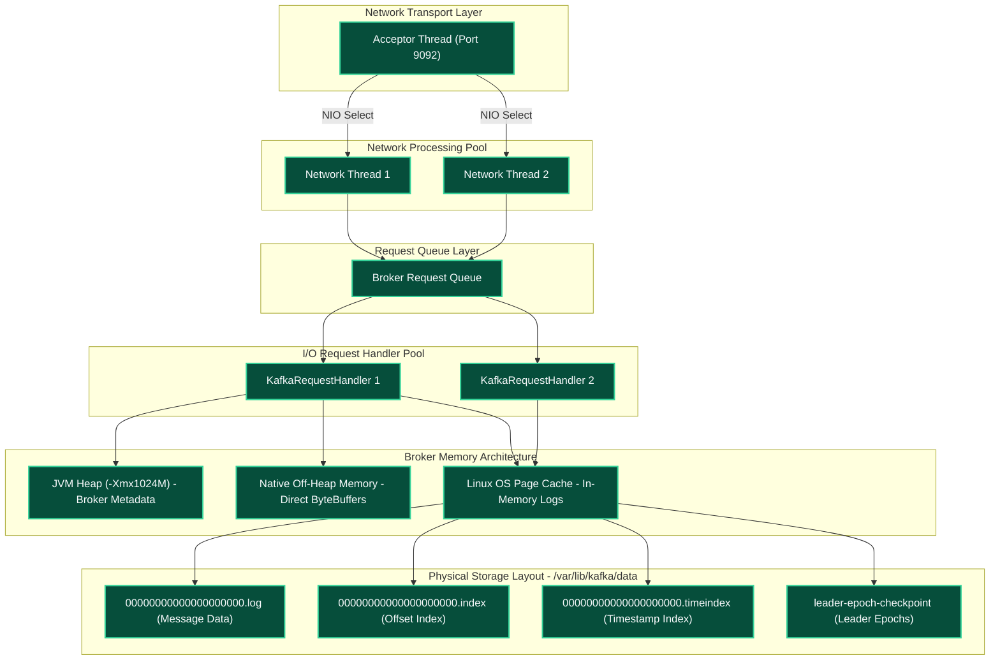

---

### 3.4 Broker Detailed Configuration Breakdown

1. **Parameter**: `KAFKA_HEAP_OPTS` — *See Section 1, Parameter 1 for full definition, expected values, and scaling guidance.*
   - **Broker-Specific Context**: This is the single most impactful broker memory knob. The JVM heap hosts broker metadata caches, active request queues, partition offset indexes, and consumer group coordinator state. The G1GC collector is the default; heap sizes above 6 GB may require explicit `-XX:MaxGCPauseMillis` tuning.

---

2. **Parameter**: `deploy.resources.limits.memory` & `reservations.memory` — *See Section 1, Parameter 2 for full definition, expected values, and scaling guidance.*
   - **Broker-Specific Context**: The broker container is the largest memory consumer in the stack. The formula `Container Limit = JVM Heap (-Xmx) + 1024M` accounts for OS Page Cache (critical for Kafka zero-copy `sendfile()` performance), JVM Metaspace, NIO direct buffers, and socket buffers.

---

3. **Parameter**: `num.network.threads` & `num.io.threads`
   - **Definition**: `num.network.threads` handles incoming TCP NIO network requests. `num.io.threads` handles processing partition disk reads/writes.
   - **Expected Values**: Base Dev (4 Core): `num.network.threads=3`, `num.io.threads=4` | High-Core Prod (16 Core): `num.network.threads=8`, `num.io.threads=16`
   - **Currently Configured Value**: `num.network.threads=3` | `num.io.threads=4` (in `config/kafka/server.properties`)
   - **Outcome / System Impact**: Eliminates broker request queue lock contention under high concurrent producer/consumer connections.
   - **Why & When to Configure It**: `num.io.threads` must match available physical CPU cores or disk spindles. `num.network.threads` should equal 50% CPU core count.
   - **Scaling & Troubleshooting**: Monitor JMX metric `RequestHandlerAvgIdlePercent`. Values < 0.2 indicate thread pool exhaustion.

---

## 4. Producer Architecture & Component Deep-Dive

### 4.1 Producer Configuration & Python Producer Code

```python
from confluent_kafka import Producer
import json, time

def delivery_report(err, msg):
    if err is not None:
        print(f"Message delivery failed: {err}")
    else:
        print(f"Message delivered to {msg.topic()} [{msg.partition()}] at offset {msg.offset()}")

producer = Producer({
    'bootstrap.servers': 'localhost:31414',
    'client.id': 'telemetry-producer-v1',
    'acks': 'all',
    'enable.idempotence': True,
    'linger.ms': 10,
    'batch.size': 16384,
    'max.in.flight.requests.per.connection': 5,
    'compression.type': 'lz4',
    'retries': 5,
    'retry.backoff.ms': 100,
    'buffer.memory': 33554432,
    'max.block.ms': 60000,
    'queue.buffering.max.messages': 100000,
    'queue.buffering.max.kbytes': 1048576
})

for i in range(100):
    payload = json.dumps({'span_id': f's_{i}', 'timestamp': time.time()})
    producer.produce(
        topic='llmobs-spans',
        key=f'trace_{i % 3}',
        value=payload,
        callback=delivery_report
    )
    producer.poll(0)

producer.flush()
```

---

### 4.2 Producer High-Level Design (HLD)

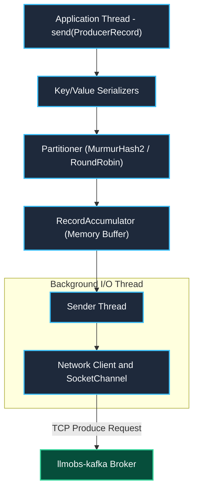

---

### 4.3 Producer Low-Level Design (LLD)

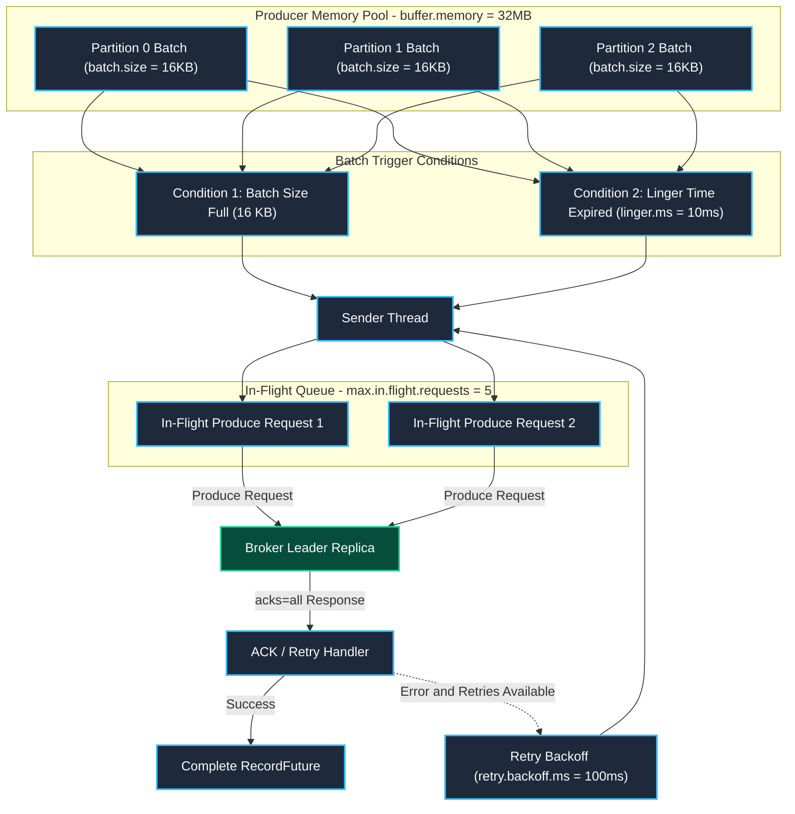

---

### 4.4 Producer Detailed Configuration Breakdown

1. **Parameter**: `acks` / `KAFKA_ACKS`
   - **Definition**: Dictates leader acknowledgment requirements before completing a produce request: `acks=0` (no ACK), `acks=1` (leader ACK only), `acks=all` (leader + all in-sync replicas ACK).
   - **Expected Values**: Low-Latency: `1` | Durability / Prod: `all` (or `-1`)
   - **Currently Configured Value**: `all` (Prod) / `1` (Dev)
   - **Outcome / System Impact**: Guarantees zero message loss during broker failovers when combined with `min.insync.replicas=2`.
   - **Why & When to Configure It**: Setting `acks=all` guarantees that writes are committed to all in-sync replicas before returning success, preventing message loss if the leader broker dies.
   - **Scaling & Troubleshooting**: Keep `acks=all` in production. For ultra-low latency metrics where data loss is acceptable, set `acks=1`.

---

2. **Parameter**: `linger.ms` & `batch.size`
   - **Definition**: `batch.size` sets the maximum byte size per partition batch. `linger.ms` sets the maximum artificial delay to wait for more records to join the batch before sending.
   - **Expected Values**: Low-Latency: `linger.ms=0`, `batch.size=16384` | High-Throughput: `linger.ms=20..50`, `batch.size=65536`
   - **Currently Configured Value**: `linger.ms=10` | `batch.size=16384` (16 KB)
   - **Outcome / System Impact**: Significantly reduces network packet overhead and broker CPU utilization while increasing batch write efficiency 5x.
   - **Why & When to Configure It**: Default `linger.ms=0` sends records immediately, creating thousands of tiny single-record TCP requests. Setting `linger.ms=10` allows records to group into full 16KB batches.
   - **Scaling & Troubleshooting**: Increase `linger.ms` to 20ms–50ms and `batch.size` to 64KB (65536) under high-throughput ingestion (> 10 MB/sec).

---

3. **Parameter**: `buffer.memory` & `max.block.ms`
   - **Definition**: `buffer.memory` sets total RAM available to the producer to buffer unsent batches. `max.block.ms` sets how long `send()` blocks when the buffer is full before throwing an exception.
   - **Expected Values**: Standard: `33554432` (32 MB) | High-Burst: `67108864` (64 MB) or `134217728` (128 MB)
   - **Currently Configured Value**: `buffer.memory=33554432` (32 MB) | `max.block.ms=60000` (60 Seconds)
   - **Outcome / System Impact**: Bounces producer memory usage to 32 MB and throws `TimeoutException` if network outages persist past 60 seconds.
   - **Why & When to Configure It**: Protects producer application memory from un-bounded growth during broker network outages.
   - **Scaling & Troubleshooting**: Increase `buffer.memory` to 64MB or 128MB in high-throughput applications with bursts.

---

4. **Parameter**: `compression.type`
   - **Definition**: Sets the compression codec for producer batch payloads (`none`, `gzip`, `snappy`, `lz4`, `zstd`).
   - **Expected Values**: Telemetry Stream Ingest: `lz4` | High-Ratio Storage: `zstd`
   - **Currently Configured Value**: `lz4`
   - **Outcome / System Impact**: Reduces network traffic and broker storage requirements by up to 70% with negligible CPU overhead.
   - **Why & When to Configure It**: JSON telemetry records contain high redundancy; `lz4` compresses them efficiently before network transmission.
   - **Scaling & Troubleshooting**: Use `lz4` for high throughput; use `zstd` for maximum disk compression ratio.

---

## 5. Consumer Architecture & Component Deep-Dive

### 5.1 Consumer Configuration & Python Consumer Code

```python
from confluent_kafka import Consumer, KafkaError

consumer = Consumer({
    'bootstrap.servers': 'localhost:31414',
    'group.id': 'llmobs-clickhouse-ingest',
    'client.id': 'clickhouse-consumer-worker',
    'auto.offset.reset': 'earliest',
    'enable.auto.commit': False,
    'auto.commit.interval.ms': 5000,
    'max.poll.interval.ms': 300000,
    'max.poll.records': 500,
    'session.timeout.ms': 45000,
    'heartbeat.interval.ms': 3000,
    'fetch.min.bytes': 1048576,
    'fetch.max.wait.ms': 500,
    'max.partition.fetch.bytes': 1048576,
    'isolation.level': 'read_committed',
    'partition.assignment.strategy': 'cooperative-sticky'
})
consumer.subscribe(['llmobs-spans'])

try:
    while True:
        msg_list = consumer.consume(num_messages=100, timeout=1.0)
        if not msg_list:
            continue
        records_to_insert = [m.value() for m in msg_list if not m.error()]
        consumer.commit(asynchronous=False)
except KeyboardInterrupt:
    pass
finally:
    consumer.close()
```

---

### 5.2 Consumer High-Level Design (HLD)

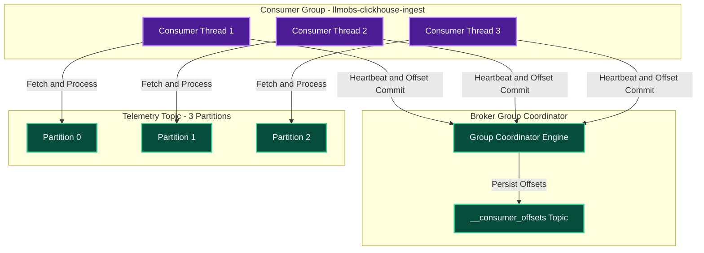

---

### 5.3 Consumer Low-Level Design (LLD)

```mermaid
graph TB
    subgraph ConsumerPollExecution ["Consumer Thread Execution Loop"]
        PollStart["consumer.poll(Duration.ofMillis(100))"] --> CheckQueue{"CompletedFetch Queue Empty?"}
        CheckQueue -->|Yes| Fetcher["Fetcher Thread sends FetchRequest"]
        CheckQueue -->|No| ConsumerRecords["Return ConsumerRecords Batch"]

        Fetcher -->|Zero-Copy TCP Read| BrokerStorage["Broker OS Page Cache"]
        BrokerStorage --> CompletedQueue["CompletedFetch Queue"]

        ConsumerRecords --> AppProcess["Process Batch (e.g. Ingest Records)"]
        AppProcess --> CommitCheck{"enable.auto.commit = false?"}
        CommitCheck -->|Yes| ManualCommit["commitSync() / commitAsync()"]
        CommitCheck -->|No| AutoCommit["Auto Commit (every 5000ms)"]
        ManualCommit --> OffsetWrite["Write to __consumer_offsets"]
        AutoCommit --> OffsetWrite
    end

    subgraph HeartbeatThread ["Background Heartbeat Thread"]
        HBThread["Heartbeat Thread (heartbeat.interval.ms = 3000)"] -->|Send Heartbeat| CoordNode["Group Coordinator"]
        CoordNode -->|Liveness Valid| OK["Keep Partition Assignment"]
        CoordNode -.->|Session Timeout Exceeded 45s| Dead["Mark Consumer Dead and Trigger Rebalance"]
    end

    style PollStart fill:#4c1d95,stroke:#c084fc,stroke-width:2px,color:#f8fafc
    style CheckQueue fill:#4c1d95,stroke:#c084fc,stroke-width:2px,color:#f8fafc
    style Fetcher fill:#4c1d95,stroke:#c084fc,stroke-width:2px,color:#f8fafc
    style ConsumerRecords fill:#4c1d95,stroke:#c084fc,stroke-width:2px,color:#f8fafc
    style CompletedQueue fill:#4c1d95,stroke:#c084fc,stroke-width:2px,color:#f8fafc
    style AppProcess fill:#4c1d95,stroke:#c084fc,stroke-width:2px,color:#f8fafc
    style CommitCheck fill:#4c1d95,stroke:#c084fc,stroke-width:2px,color:#f8fafc
    style ManualCommit fill:#4c1d95,stroke:#c084fc,stroke-width:2px,color:#f8fafc
    style AutoCommit fill:#4c1d95,stroke:#c084fc,stroke-width:2px,color:#f8fafc
    style HBThread fill:#4c1d95,stroke:#c084fc,stroke-width:2px,color:#f8fafc

    style BrokerStorage fill:#064e3b,stroke:#34d399,stroke-width:2px,color:#f8fafc
    style OffsetWrite fill:#064e3b,stroke:#34d399,stroke-width:2px,color:#f8fafc
    style CoordNode fill:#064e3b,stroke:#34d399,stroke-width:2px,color:#f8fafc
    style OK fill:#064e3b,stroke:#34d399,stroke-width:2px,color:#f8fafc
    style Dead fill:#064e3b,stroke:#34d399,stroke-width:2px,color:#f8fafc
```

---

### 5.4 Consumer Detailed Configuration Breakdown

1. **Parameter**: `enable.auto.commit` & `auto.commit.interval.ms`
   - **Definition**: Controls whether consumer offsets are committed automatically in the background on a periodic timer or managed explicitly by application code.
   - **Expected Values**: Analytics & Pipeline DB Sinks: `false` | Stateless Real-Time Alerting: `true`
   - **Currently Configured Value**: `enable.auto.commit=false` (Prod) / `true` (Dev)
   - **Outcome / System Impact**: Guarantees exact telemetry delivery into target sinks without missing records or duplicate insertions.
   - **Why & When to Configure It**: Automatic commit (`true`) risks data loss if the consumer crashes after committing offsets but before completing processing. Setting `false` allows manual commit after processing success (at-least-once delivery).
   - **Scaling & Troubleshooting**: Always set `enable.auto.commit=false` in production data pipelines and call `commitSync()` / `commitAsync()`.

---

2. **Parameter**: `max.poll.interval.ms` & `max.poll.records`
   - **Definition**: `max.poll.records` sets maximum records returned in a single `poll()`. `max.poll.interval.ms` sets maximum time allowed between `poll()` calls before the consumer is marked dead and evicted from the group.
   - **Expected Values**: Fast Ingestion: `max.poll.records=500`, `max.poll.interval.ms=300000` | Heavy Batching: `max.poll.records=100`, `max.poll.interval.ms=600000`
   - **Currently Configured Value**: `max.poll.interval.ms=300000` (5 Min) | `max.poll.records=500`
   - **Outcome / System Impact**: Prevents consumer group rebalance storms during large record batch ingestion operations.
   - **Why & When to Configure It**: If batch processing takes longer than 5 minutes, Kafka assumes the consumer thread is stuck and triggers constant consumer group rebalance storms.
   - **Scaling & Troubleshooting**: If processing high-latency batches, reduce `max.poll.records` to 100 or increase `max.poll.interval.ms` to 600,000ms (10 minutes).

---

3. **Parameter**: `auto.offset.reset`
   - **Definition**: Dictates consumer behavior when no initial offset exists or when offset is out of range: `earliest` (start from oldest available record), `latest` (start from newest incoming record).
   - **Expected Values**: Telemetry Ingestion / Recovery: `earliest` | Real-Time Alerting: `latest`
   - **Currently Configured Value**: `earliest` (Dev/Recovery) / `latest` (Default Ingest)
   - **Outcome / System Impact**: Ensures new ingestion instances process all buffered streams without skipping data.
   - **Why & When to Configure It**: Use `earliest` for new consumer groups that need to process historical buffered streams; use `latest` for real-time dashboard alerting.

---

4. **Parameter**: `session.timeout.ms` & `heartbeat.interval.ms`
   - **Definition**: `session.timeout.ms` sets maximum time group coordinator waits for consumer heartbeat. `heartbeat.interval.ms` sets background heartbeat frequency.
   - **Expected Values**: Standard: `session.timeout.ms=45000`, `heartbeat.interval.ms=3000`
   - **Currently Configured Value**: `session.timeout.ms=45000` | `heartbeat.interval.ms=3000`
   - **Outcome / System Impact**: Eliminates false consumer group rebalances caused by minor network jitter or JVM GC pauses.
   - **Why & When to Configure It**: Rule of thumb is `heartbeat.interval.ms` must be `<= 1/3` of `session.timeout.ms`.

---

## 6. Topic Partitions, Offset Pointers, Watermarks & Rebalancing Deep-Dive

### 6.1 Topic Partitioning & Key Hashing Mechanics

#### Topic Creation & Partition Key Hashing Python Code

```python
from confluent_kafka.admin import AdminClient, NewTopic
import mmh3

admin = AdminClient({'bootstrap.servers': 'localhost:31414'})
new_topic = NewTopic(
    'llmobs-spans',
    num_partitions=3,
    replication_factor=1,
    config={
        'cleanup.policy': 'delete',
        'retention.ms': '86400000',
        'segment.bytes': '104857600',
        'segment.ms': '7200000',
        'min.insync.replicas': '1',
        'compression.type': 'producer'
    }
)
admin.create_topics([new_topic])

def calculate_kafka_partition(key_bytes, num_partitions=3):
    if key_bytes is None:
        return 0
    hash_val = mmh3.hash(key_bytes) & 0x7fffffff
    return hash_val % num_partitions

print(f"Key 'trace_101' maps to Partition: {calculate_kafka_partition(b'trace_101')}")
```

#### Partitioner High-Level Architecture (HLD)

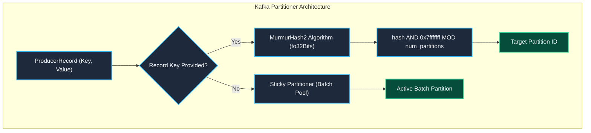

#### Partition Skew & Hashing Mechanics (LLD)

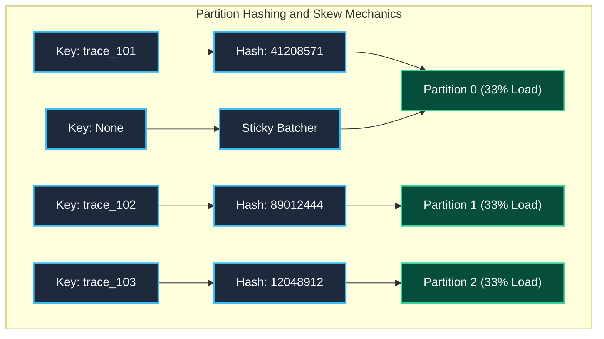

---

### 6.2 Offset Pointers, Log End Offset (LEO), High Watermark (HW) & Leader Epochs

#### Consumer Offset Seeking & Inspection Python Code

```python
from confluent_kafka import Consumer, TopicPartition

consumer = Consumer({
    'bootstrap.servers': 'localhost:31414',
    'group.id': 'offset-inspector-group',
    'auto.offset.reset': 'earliest',
    'enable.auto.commit': False
})

tp = TopicPartition('llmobs-spans', 0)
low_watermark, high_watermark = consumer.get_watermark_offsets(tp)
print(f"Partition 0 Watermarks -> Low: {low_watermark}, High Watermark (HW): {high_watermark}")

consumer.assign([tp])
consumer.seek(TopicPartition('llmobs-spans', 0, 42))

msg = consumer.poll(1.0)
if msg:
    print(f"Read Record at Offset Pointer: {msg.offset()}")

consumer.close()
```

#### Replication Watermarks & High Watermark Sync (HLD)

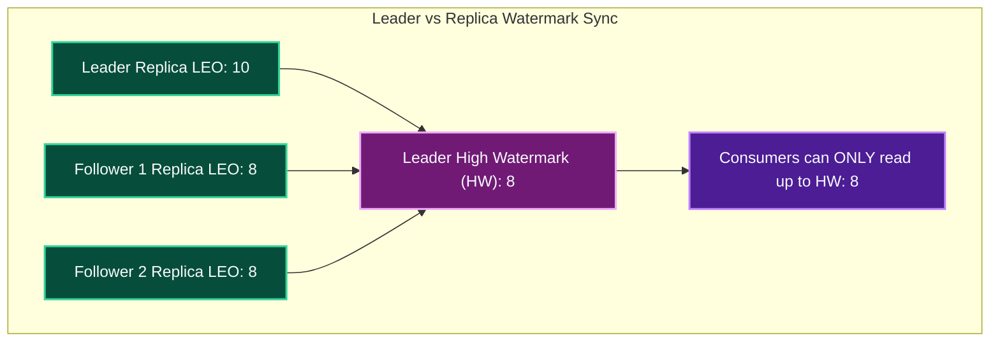

#### Partition Log Offset & Pointer Layout (LLD)

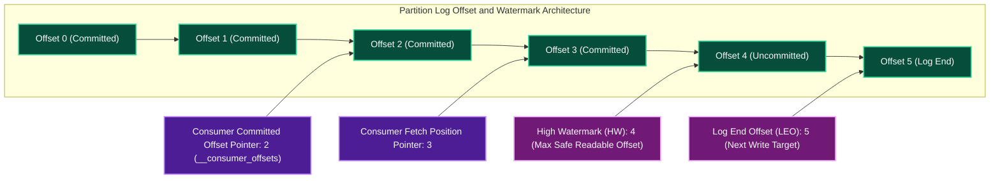

---

### 6.3 Consumer Group Rebalance Protocols & Static Membership

#### Consumer Static Membership Python Code

```python
from confluent_kafka import Consumer

static_consumer = Consumer({
    'bootstrap.servers': 'localhost:31414',
    'group.id': 'llmobs-analytics-cluster',
    'group.instance.id': 'ingest-worker-pod-0',
    'session.timeout.ms': 45000,
    'heartbeat.interval.ms': 3000,
    'enable.auto.commit': False,
    'partition.assignment.strategy': 'cooperative-sticky'
})
static_consumer.subscribe(['llmobs-spans'])
```

#### Cooperative Sticky Rebalance Protocol Architecture (HLD)

```mermaid
graph TD
    subgraph CooperativeRebalance ["Cooperative Sticky Rebalance Protocol"]
        State1["Group State: STABLE"] --> MemberJoin["New Consumer Joins / Departs"]
        MemberJoin --> State2["Group State: PREPARING_REBALANCE"]
        State2 --> RevokeStep["Revoke ONLY Migrating Partitions (Cooperative)"]
        RevokeStep --> State3["Group State: COMPLETING_REBALANCE"]
        State3 --> AssignStep["Assign Revoked Partitions to New Member"]
        AssignStep --> State4["Group State: STABLE (Zero Downtime for Unaffected Partitions)"]
    end

    style State1 fill:#4c1d95,stroke:#c084fc,stroke-width:2px,color:#f8fafc
    style MemberJoin fill:#4c1d95,stroke:#c084fc,stroke-width:2px,color:#f8fafc
    style State2 fill:#4c1d95,stroke:#c084fc,stroke-width:2px,color:#f8fafc
    style RevokeStep fill:#4c1d95,stroke:#c084fc,stroke-width:2px,color:#f8fafc
    style State3 fill:#4c1d95,stroke:#c084fc,stroke-width:2px,color:#f8fafc
    style AssignStep fill:#4c1d95,stroke:#c084fc,stroke-width:2px,color:#f8fafc
    style State4 fill:#4c1d95,stroke:#c084fc,stroke-width:2px,color:#f8fafc
```

#### Group Coordinator Protocol State Machine (LLD)

```mermaid
graph TB
    subgraph RebalanceStateMachine ["Group Coordinator LLD Protocol Execution and Static Membership"]
        ClientInit["Consumer Container Start"] --> JoinReq["Send JoinGroup Request (with group.instance.id)"]
        JoinReq --> CoordEval{"Group Coordinator Check"}

        CoordEval -->|Dynamic Member| DynamicJoin["Generate Dynamic Member ID"]
        CoordEval -->|Static Member| StaticJoin["Lookup Registered group.instance.id"]

        DynamicJoin --> TriggerFullRebalance["Trigger Group Rebalance (PREPARING_REBALANCE)"]
        StaticJoin --> CheckSession{"Rejoin within session.timeout.ms (45s)?"}

        CheckSession -->|Yes| BypassRebalance["Bypass Rebalance - Retain Partition Assignment"]
        CheckSession -->|No| EvictStatic["Evict Static Member and Revoke Partitions"]
        EvictStatic --> TriggerFullRebalance

        TriggerFullRebalance --> LeaderAssign["Group Leader Computes Cooperative Assignment"]
        LeaderAssign --> SyncReq["Send SyncGroup Request"]
        BypassRebalance --> SyncReq
        SyncReq --> ActiveLoop["Transition to STABLE - Resume Fetch Loop and Heartbeat"]
    end

    style ClientInit fill:#4c1d95,stroke:#c084fc,stroke-width:2px,color:#f8fafc
    style JoinReq fill:#4c1d95,stroke:#c084fc,stroke-width:2px,color:#f8fafc
    style CoordEval fill:#064e3b,stroke:#34d399,stroke-width:2px,color:#f8fafc
    style DynamicJoin fill:#4c1d95,stroke:#c084fc,stroke-width:2px,color:#f8fafc
    style StaticJoin fill:#4c1d95,stroke:#c084fc,stroke-width:2px,color:#f8fafc
    style TriggerFullRebalance fill:#064e3b,stroke:#34d399,stroke-width:2px,color:#f8fafc
    style CheckSession fill:#064e3b,stroke:#34d399,stroke-width:2px,color:#f8fafc
    style BypassRebalance fill:#4c1d95,stroke:#c084fc,stroke-width:2px,color:#f8fafc
    style EvictStatic fill:#064e3b,stroke:#34d399,stroke-width:2px,color:#f8fafc
    style LeaderAssign fill:#064e3b,stroke:#34d399,stroke-width:2px,color:#f8fafc
    style SyncReq fill:#4c1d95,stroke:#c084fc,stroke-width:2px,color:#f8fafc
    style ActiveLoop fill:#4c1d95,stroke:#c084fc,stroke-width:2px,color:#f8fafc
```

---

## 7. Topic Segment Lifecycle & Physical Storage Management

### 7.1 Topic Segment Storage Configuration & Code

```python
from confluent_kafka.admin import AdminClient, NewTopic

admin = AdminClient({'bootstrap.servers': 'localhost:31414'})
topic_spec = NewTopic(
    'llmobs-spans',
    num_partitions=3,
    replication_factor=1,
    config={
        'segment.bytes': '104857600',
        'retention.ms': '86400000',
        'segment.ms': '7200000',
        'cleanup.policy': 'delete'
    }
)
admin.create_topics([topic_spec])
```

---

### 7.2 Topic Segment Storage High-Level Design (HLD)

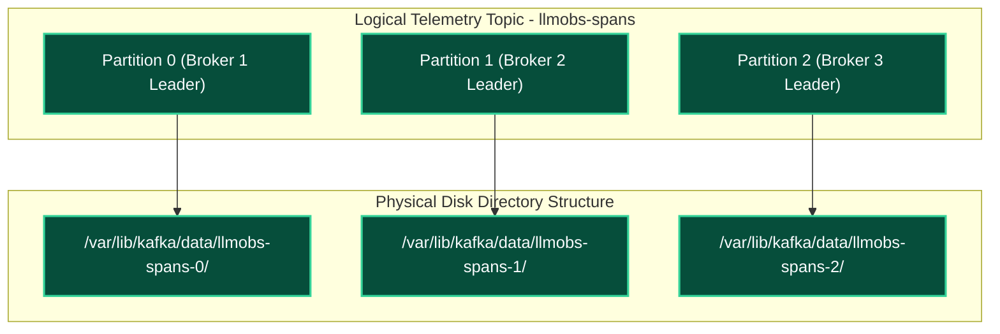

---

### 7.3 Topic Segment Storage Low-Level Design (LLD)

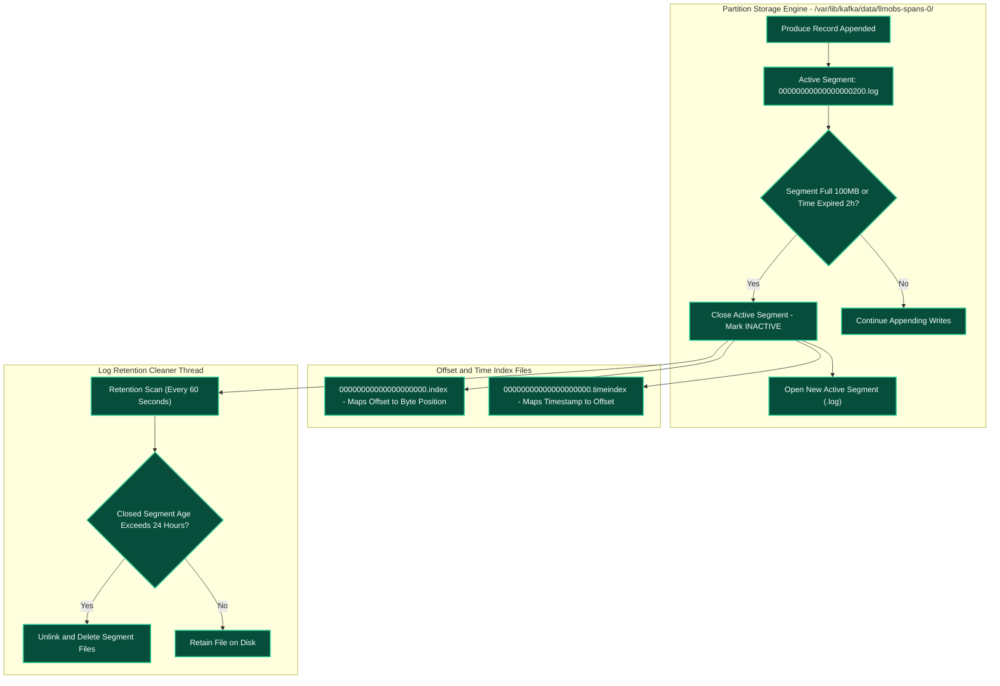

---

### 7.4 Topic Segment Detailed Configuration Breakdown

1. **Parameter**: `log.segment.bytes`
   - **Definition**: Maximum byte size per partition segment file before closing and rolling a new active segment file.
   - **Expected Values**: Low/Dev: `104857600` (100 MB) | Medium Prod: `268435456` (256 MB) | High-Throughput Prod: `536870912` (512 MB) or `1073741824` (1 GB)
   - **Currently Configured Value**: `104857600` (100 MB in `config/kafka/server.properties`)
   - **Outcome / System Impact**: Reclaims ~30 GB of storage space on `/dev/sda2` by preventing inactive topics from holding onto gigabytes of un-purged active segments.
   - **Why & When to Configure It**: Retention rules apply ONLY to closed segments. Active segments are NEVER deleted regardless of age. Setting 100 MB allows low/medium volume topics to close segments rapidly for daily deletion.
   - **Scaling & Troubleshooting**: Increase to 512MB or 1GB in high-throughput production (> 50,000 msgs/sec) to avoid excessive file handle creation.

---

2. **Parameter**: `log.retention.hours`
   - **Definition**: Duration in hours that closed segment files are retained on disk before physical deletion.
   - **Expected Values**: Base Dev: `24` (24 Hours) | Production Buffer: `72` (3 Days) | Long-Buffer Ingest: `168` (7 Days)
   - **Currently Configured Value**: `24` (24 Hours in `config/kafka/server.properties`)
   - **Outcome / System Impact**: Reclaims ~35 GB of disk space on `/dev/sda2` by deleting 1-day-old segments.
   - **Why & When to Configure It**: Kafka is an intermediate buffer. Telemetry data is consumed almost immediately. Retaining 7 days duplicates data and consumes host storage.

---

3. **Parameter**: `log.roll.hours`
   - **Definition**: Maximum time window after which an active segment is forcibly closed, even if segment size is less than 100 MB.
   - **Expected Values**: Low-Volume Topics: `2` (2 Hours) | High-Volume Topics: `12` (12 Hours) or `24` (24 Hours)
   - **Currently Configured Value**: `2` (2 Hours in `config/kafka/server.properties`)
   - **Outcome / System Impact**: Eliminates storage leaks on dormant or low-volume topics.
   - **Why & When to Configure It**: Low-throughput topics take weeks to write 100 MB. Forced rolls every 2 hours guarantee active segments close and become eligible for 24-hour deletion.

---

## 8. Exactly-Once Semantics (EOS), Idempotency & Transactions

### 8.1 Transactional Producer & EOS Python Code

```python
from confluent_kafka import Producer, Consumer

tx_producer = Producer({
    'bootstrap.servers': 'localhost:31414',
    'transactional.id': 'llmobs-producer-tx-1',
    'enable.idempotence': True,
    'transaction.timeout.ms': 900000,
    'acks': 'all',
    'linger.ms': 10,
    'batch.size': 16384,
    'max.in.flight.requests.per.connection': 5
})
tx_producer.init_transactions()

try:
    tx_producer.begin_transaction()
    tx_producer.produce('llmobs-spans', key='t1', value='{"span": 1}')
    tx_producer.produce('llmobs-metrics', key='m1', value='{"metric": 1}')
    tx_producer.commit_transaction()
except Exception as e:
    tx_producer.abort_transaction()

eos_consumer = Consumer({
    'bootstrap.servers': 'localhost:31414',
    'group.id': 'eos-analytics-sink',
    'auto.offset.reset': 'earliest',
    'enable.auto.commit': False,
    'isolation.level': 'read_committed',
    'max.poll.interval.ms': 300000,
    'session.timeout.ms': 45000
})
```

---

### 8.2 Idempotent Producer Mechanics (HLD)

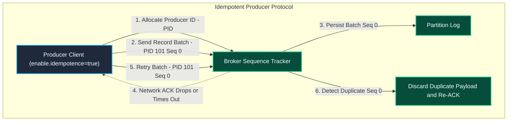

---

### 8.3 Two-Phase Commit Transaction Coordinator Execution Flow (LLD)

```mermaid
graph TB
    subgraph TransactionCoordinatorLLD ["Transactional 2PC State Machine LLD"]
        TxInit["tx_producer.init_transactions()"] --> FindCoord["Locate Transaction Coordinator"]
        FindCoord --> BeginTx["tx_producer.begin_transaction()"]
        BeginTx --> SendData["Produce Records to Partitions"]

        SendData --> CommitReq["tx_producer.commit_transaction()"]
        CommitReq --> WritePrepare["Write PREPARE_COMMIT to __transaction_state"]
        WritePrepare --> WriteMarkers["Write COMMIT Control Markers to Partitions"]
        WriteMarkers --> WriteComplete["Write COMPLETE_COMMIT to __transaction_state"]
        WriteComplete --> TransactionDone["Transaction Complete"]
    end

    style TxInit fill:#1e293b,stroke:#38bdf8,stroke-width:2px,color:#f8fafc
    style FindCoord fill:#064e3b,stroke:#34d399,stroke-width:2px,color:#f8fafc
    style BeginTx fill:#1e293b,stroke:#38bdf8,stroke-width:2px,color:#f8fafc
    style SendData fill:#1e293b,stroke:#38bdf8,stroke-width:2px,color:#f8fafc
    style CommitReq fill:#1e293b,stroke:#38bdf8,stroke-width:2px,color:#f8fafc
    style WritePrepare fill:#064e3b,stroke:#34d399,stroke-width:2px,color:#f8fafc
    style WriteMarkers fill:#064e3b,stroke:#34d399,stroke-width:2px,color:#f8fafc
    style WriteComplete fill:#064e3b,stroke:#34d399,stroke-width:2px,color:#f8fafc
    style TransactionDone fill:#1e293b,stroke:#38bdf8,stroke-width:2px,color:#f8fafc
```

---

### 8.4 EOS Configuration Breakdown

1. **Parameter**: `enable.idempotence`
   - **Definition**: Ensures that the broker processes exactly one copy of a message batch sent by a producer, even if the producer retries due to network timeouts.
   - **Expected Values**: Standard: `true` | Legacy/Disabled: `false`
   - **Currently Configured Value**: `true`
   - **Outcome / System Impact**: Eliminates duplicate record insertions into target sinks.
   - **Why & When to Configure It**: Eliminates duplicate records in telemetry pipelines caused by transient network retries.

---

2. **Parameter**: `isolation.level`
   - **Definition**: Controls whether consumers read uncommitted transactional messages (`read_uncommitted`) or only messages belonging to committed transactions (`read_committed`).
   - **Expected Values**: Non-Transactional: `read_uncommitted` | Transactional Ingest: `read_committed`
   - **Currently Configured Value**: `read_committed` (Prod) / `read_uncommitted` (Default)
   - **Outcome / System Impact**: Filters out uncommitted records before writing to processing targets.
   - **Why & When to Configure It**: Prevents consumers from reading dirty records from aborted producer transactions.

---

## 9. Log Compaction Mechanics & Cleanup Policies (`cleanup.policy`)

### 9.1 State Store Compaction Python Code

```python
from confluent_kafka import Producer

producer = Producer({
    'bootstrap.servers': 'localhost:31414',
    'acks': 'all',
    'enable.idempotence': True,
    'linger.ms': 10,
    'batch.size': 16384
})

producer.produce('user-service-registry', key='service_auth', value='v2.1.0')
producer.produce('user-service-registry', key='service_deprecated', value=None)
producer.flush()
```

---

### 9.2 Log Compaction Lifecycle Design (HLD)

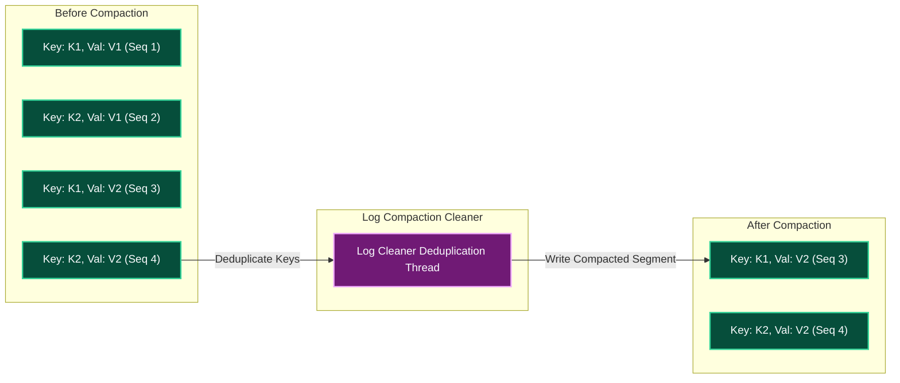

---

### 9.3 Log Compaction Cleaner Thread Execution Flow (LLD)

```mermaid
graph TB
    subgraph LogCleanerLLD ["Log Cleaner Thread Low-Level Execution"]
        ScanTrigger["Cleaner Trigger (dirty ratio GTE 0.5)"] --> BuildMap["Build In-Memory Skimpy Offset Map"]
        BuildMap --> ScanDirty["Scan Dirty Log Segments"]
        ScanDirty --> DedupeKeys["Keep Highest Offset Per Message Key"]
        DedupeKeys --> WriteClean["Write Compacted Records to Clean Segment"]
        WriteClean --> SwapSegments["Atomic File Swap - Replace Dirty Segment"]
        SwapSegments --> PurgeTombstones["Purge Expired Tombstones (delete.retention.ms)"]
    end

    style ScanTrigger fill:#701a75,stroke:#f0abfc,stroke-width:2px,color:#f8fafc
    style BuildMap fill:#064e3b,stroke:#34d399,stroke-width:2px,color:#f8fafc
    style ScanDirty fill:#064e3b,stroke:#34d399,stroke-width:2px,color:#f8fafc
    style DedupeKeys fill:#064e3b,stroke:#34d399,stroke-width:2px,color:#f8fafc
    style WriteClean fill:#064e3b,stroke:#34d399,stroke-width:2px,color:#f8fafc
    style SwapSegments fill:#064e3b,stroke:#34d399,stroke-width:2px,color:#f8fafc
    style PurgeTombstones fill:#064e3b,stroke:#34d399,stroke-width:2px,color:#f8fafc
```

---

### 9.4 Compaction Configuration Breakdown

1. **Parameter**: `cleanup.policy`
   - **Definition**: `delete` purges closed segments based on time/size. `compact` retains the latest record value per message key forever. `compact,delete` compacts by key and enforces time-based expiration.
   - **Expected Values**: Stream Telemetry: `delete` | Key-Value State Store: `compact` | Hybrid Retention: `compact,delete`
   - **Currently Configured Value**: `delete` (Telemetry Streams) / `compact` (State Stores)
   - **Outcome / System Impact**: Prevents unbounded growth on key-value state store topics.
   - **Why & When to Configure It**: Use `delete` for streaming records and access logs. Use `compact` for user profiles, service registries, and stateful application lookup caches.

---

2. **Parameter**: `min.cleanable.dirty.ratio`
   - **Definition**: Controls the percentage of uncompacted ("dirty") records required in a log segment before the compaction cleaner thread executes.
   - **Expected Values**: Standard: `0.5` (50%) | Frequent Compaction: `0.2` (20%)
   - **Currently Configured Value**: `0.5` (50% Dirty Ratio)
   - **Outcome / System Impact**: Keeps state store compaction latency predictable while limiting background CPU usage.
   - **Why & When to Configure It**: Lower values compact state store topics more aggressively at the cost of minor CPU background threads.

---

## 10. Native Kafka Emergency CLI Commands & Incident Runbooks

### 10.1 Emergency Incident 1: Host Disk Storage 100% Full

```bash
docker exec -it llmobs-kafka-broker kafka-logdirs.sh \
  --bootstrap-server localhost:9092 \
  --describe

docker exec -it llmobs-kafka-broker kafka-configs.sh \
  --bootstrap-server localhost:9092 \
  --entity-type topics \
  --entity-name llmobs-spans \
  --alter \
  --add-config retention.ms=3600000

docker exec -it llmobs-kafka-broker kafka-topics.sh \
  --bootstrap-server localhost:9092 \
  --describe \
  --topic llmobs-spans
```

---

### 10.2 Emergency Incident 2: Under-Replicated Partitions (URP)

**Step 1: Identify under-replicated partitions**

```bash
docker exec -it llmobs-kafka-broker kafka-topics.sh \
  --bootstrap-server localhost:9092 \
  --describe \
  --under-replicated-partitions
```

**Step 2: Inspect log directory disk usage per broker**

```bash
docker exec -it llmobs-kafka-broker kafka-logdirs.sh \
  --bootstrap-server localhost:9092 \
  --describe
```

**Step 3: Generate partition reassignment plan**

Create a `topics-to-move.json` file listing the affected topics:

```json
{
  "topics": [
    { "topic": "llmobs-spans" }
  ],
  "version": 1
}
```

```bash
# Generate reassignment plan
docker exec -it llmobs-kafka-broker kafka-reassign-partitions.sh \
  --bootstrap-server localhost:9092 \
  --topics-to-move-json-file /tmp/topics-to-move.json \
  --broker-list "1,2,3" \
  --generate
```

**Step 4: Execute the reassignment**

Save the generated JSON output to `reassignment.json`, then execute:

```bash
# Execute reassignment (throttle to 50 MB/sec to avoid saturating network)
docker exec -it llmobs-kafka-broker kafka-reassign-partitions.sh \
  --bootstrap-server localhost:9092 \
  --reassignment-json-file /tmp/reassignment.json \
  --throttle 52428800 \
  --execute
```

**Step 5: Verify reassignment completion**

```bash
docker exec -it llmobs-kafka-broker kafka-reassign-partitions.sh \
  --bootstrap-server localhost:9092 \
  --reassignment-json-file /tmp/reassignment.json \
  --verify
```

---

### 10.3 Emergency Incident 3: Consumer Group Lag & Offset Reset

> **WARNING**: The `--to-latest` flag **skips all unprocessed messages** and jumps the consumer to the end of the log. This causes **permanent data loss** for any messages not yet consumed. Use `--to-earliest` to safely reprocess from the beginning, or `--to-offset` / `--shift-by` for targeted recovery.

**Step 1: Inspect current consumer group lag**

```bash
docker exec -it llmobs-kafka-broker kafka-consumer-groups.sh \
  --bootstrap-server localhost:9092 \
  --describe \
  --group llmobs-clickhouse-ingest
```

**Step 2: Dry-run offset reset (no changes applied)**

```bash
# ALWAYS dry-run first to preview which offsets will change
docker exec -it llmobs-kafka-broker kafka-consumer-groups.sh \
  --bootstrap-server localhost:9092 \
  --group llmobs-clickhouse-ingest \
  --reset-offsets \
  --to-earliest \
  --dry-run \
  --topic llmobs-spans
```

**Step 3: Execute offset reset (safe reprocess)**

```bash
# Execute only after confirming dry-run output is correct
# NOTE: Consumer group must be STOPPED (no active members) before resetting
docker exec -it llmobs-kafka-broker kafka-consumer-groups.sh \
  --bootstrap-server localhost:9092 \
  --group llmobs-clickhouse-ingest \
  --reset-offsets \
  --to-earliest \
  --execute \
  --topic llmobs-spans
```

**Alternative: Reset to a specific timestamp (targeted recovery)**

```bash
# Reset offsets to messages produced after a specific timestamp
docker exec -it llmobs-kafka-broker kafka-consumer-groups.sh \
  --bootstrap-server localhost:9092 \
  --group llmobs-clickhouse-ingest \
  --reset-offsets \
  --to-datetime 2026-09-07T00:00:00.000 \
  --execute \
  --topic llmobs-spans
```

---

### 10.4 Emergency Operational Workflow High-Level Design (HLD)

```mermaid
graph TD
    subgraph IncidentDetection ["Incident Detection and Alerts"]
        Alert1["Disk Utilization GT 90% Alert"]
        Alert2["Under-Replicated Partitions GT 0 Alert"]
        Alert3["Consumer Lag GT Threshold Alert"]
    end

    subgraph KafkaAdminTooling ["Native Kafka CLI Diagnostic Engine"]
        LogDirsCLI["kafka-logdirs.sh --describe"]
        TopicsCLI["kafka-topics.sh --describe --under-replicated-partitions"]
        ConsumerCLI["kafka-consumer-groups.sh --describe"]
    end

    subgraph RemediationEngine ["Dynamic Remediation and Recovery Execution"]
        ConfigsCLI["kafka-configs.sh --alter --add-config retention.ms"]
        ReassignCLI["kafka-reassign-partitions.sh --execute"]
        ResetOffsetCLI["kafka-consumer-groups.sh --reset-offsets --to-earliest"]
    end

    subgraph ClusterRecovery ["Cluster and Ingest Stabilization"]
        StorageReclaimed["OS Disk Space Purged and Reclaimed"]
        ISRRestored["ISR Pool Fully Synchronized"]
        LagCleared["Ingest Consumer Pipeline Stabilized"]
    end

    Alert1 --> LogDirsCLI
    LogDirsCLI --> ConfigsCLI
    ConfigsCLI --> StorageReclaimed
    Alert2 --> TopicsCLI
    TopicsCLI --> ReassignCLI
    ReassignCLI --> ISRRestored
    Alert3 --> ConsumerCLI
    ConsumerCLI --> ResetOffsetCLI
    ResetOffsetCLI --> LagCleared

    style Alert1 fill:#1e293b,stroke:#38bdf8,stroke-width:2px,color:#f8fafc
    style Alert2 fill:#1e293b,stroke:#38bdf8,stroke-width:2px,color:#f8fafc
    style Alert3 fill:#1e293b,stroke:#38bdf8,stroke-width:2px,color:#f8fafc
    style LogDirsCLI fill:#064e3b,stroke:#34d399,stroke-width:2px,color:#f8fafc
    style TopicsCLI fill:#064e3b,stroke:#34d399,stroke-width:2px,color:#f8fafc
    style ConsumerCLI fill:#064e3b,stroke:#34d399,stroke-width:2px,color:#f8fafc
    style ConfigsCLI fill:#064e3b,stroke:#34d399,stroke-width:2px,color:#f8fafc
    style ReassignCLI fill:#064e3b,stroke:#34d399,stroke-width:2px,color:#f8fafc
    style ResetOffsetCLI fill:#064e3b,stroke:#34d399,stroke-width:2px,color:#f8fafc
    style StorageReclaimed fill:#701a75,stroke:#f0abfc,stroke-width:2px,color:#f8fafc
    style ISRRestored fill:#701a75,stroke:#f0abfc,stroke-width:2px,color:#f8fafc
    style LagCleared fill:#701a75,stroke:#f0abfc,stroke-width:2px,color:#f8fafc
```

---

### 10.5 Incident Remediation Low-Level Design (LLD)

```mermaid
graph TB
    subgraph StorageIncidentLLD ["Incident 1: Disk Exhaustion Remediation Flow"]
        DiskFull["Host Disk Usage 100%"] --> InspectLogDirs["Execute kafka-logdirs.sh"]
        InspectLogDirs --> TargetTopic["Identify Large Log Directories"]
        TargetTopic --> AlterRetention["Execute kafka-configs.sh --add-config retention.ms=3600000"]
        AlterRetention --> TriggerPurge["Broker LogCleaner Thread Scans Inactive Segments"]
        TriggerPurge --> UnlinkFiles["Unlink Closed Segments - Space Reclaimed"]
    end

    subgraph URPIncidentLLD ["Incident 2: Under-Replicated Partitions Remediation Flow"]
        URPAlert["URP Count GT 0 Detected"] --> FindPartition["Execute kafka-topics.sh --under-replicated-partitions"]
        FindPartition --> CheckBroker["Identify Failed Broker / Unhealthy Disk"]
        CheckBroker --> TriggerRebind["Execute kafka-reassign-partitions.sh"]
        TriggerRebind --> ReplicaFetch["Replica Re-Syncs Data from Leader"]
        ReplicaFetch --> ISRJoin["Re-join ISR Pool (URP = 0)"]
    end

    subgraph ConsumerLagLLD ["Incident 3: Emergency Consumer Lag Reset Flow"]
        LagSpike["Unrecoverable Consumer Lag Spike"] --> InspectGroup["Execute kafka-consumer-groups.sh --describe"]
        InspectGroup --> StopConsumer["Stop Consumer Service Container"]
        StopConsumer --> ResetOffsets["Execute --reset-offsets --to-earliest --execute"]
        ResetOffsets --> CommitNewOffset["Write New Offset Pointer to __consumer_offsets"]
        CommitNewOffset --> RestartConsumer["Start Consumer Service Container"]
    end

    style DiskFull fill:#1e293b,stroke:#38bdf8,stroke-width:2px,color:#f8fafc
    style InspectLogDirs fill:#064e3b,stroke:#34d399,stroke-width:2px,color:#f8fafc
    style TargetTopic fill:#064e3b,stroke:#34d399,stroke-width:2px,color:#f8fafc
    style AlterRetention fill:#064e3b,stroke:#34d399,stroke-width:2px,color:#f8fafc
    style TriggerPurge fill:#064e3b,stroke:#34d399,stroke-width:2px,color:#f8fafc
    style UnlinkFiles fill:#701a75,stroke:#f0abfc,stroke-width:2px,color:#f8fafc

    style URPAlert fill:#1e293b,stroke:#38bdf8,stroke-width:2px,color:#f8fafc
    style FindPartition fill:#064e3b,stroke:#34d399,stroke-width:2px,color:#f8fafc
    style CheckBroker fill:#064e3b,stroke:#34d399,stroke-width:2px,color:#f8fafc
    style TriggerRebind fill:#064e3b,stroke:#34d399,stroke-width:2px,color:#f8fafc
    style ReplicaFetch fill:#064e3b,stroke:#34d399,stroke-width:2px,color:#f8fafc
    style ISRJoin fill:#701a75,stroke:#f0abfc,stroke-width:2px,color:#f8fafc

    style LagSpike fill:#1e293b,stroke:#38bdf8,stroke-width:2px,color:#f8fafc
    style InspectGroup fill:#4c1d95,stroke:#c084fc,stroke-width:2px,color:#f8fafc
    style StopConsumer fill:#4c1d95,stroke:#c084fc,stroke-width:2px,color:#f8fafc
    style ResetOffsets fill:#4c1d95,stroke:#c084fc,stroke-width:2px,color:#f8fafc
    style CommitNewOffset fill:#064e3b,stroke:#34d399,stroke-width:2px,color:#f8fafc
    style RestartConsumer fill:#4c1d95,stroke:#c084fc,stroke-width:2px,color:#f8fafc
```

---

## 11. Multi-Broker Scale-Out Architecture (Single-Node to 3-Node KRaft)

### 11.1 Multi-Broker Production Override Configuration & Connection Code

```yaml
services:
  llmobs-kafka-1:
    environment:
      - KAFKA_NODE_ID=1
      - KAFKA_PROCESS_ROLES=broker,controller
      - KAFKA_CONTROLLER_QUORUM_VOTERS=1@llmobs-kafka-1:9093,2@llmobs-kafka-2:9093,3@llmobs-kafka-3:9093
      - KAFKA_HEAP_OPTS=-Xms2048m -Xmx2048m
      - KAFKA_OFFSETS_TOPIC_REPLICATION_FACTOR=3
      - KAFKA_DEFAULT_REPLICATION_FACTOR=3
      - KAFKA_MIN_INSYNC_REPLICAS=2
```

```python
from confluent_kafka import Producer

cluster_producer = Producer({
    'bootstrap.servers': 'kafka1:9092,kafka2:9092,kafka3:9092',
    'client.id': 'multi-node-prod-producer',
    'acks': 'all',
    'enable.idempotence': True,
    'linger.ms': 20,
    'batch.size': 65536,
    'max.in.flight.requests.per.connection': 5,
    'compression.type': 'lz4',
    'retries': 10,
    'retry.backoff.ms': 100
})
```

---

### 11.2 Multi-Broker KRaft Cluster Architecture Design (HLD)

```mermaid
graph LR
    subgraph MultiBrokerCluster ["Multi-Broker KRaft Cluster Architecture"]
        B1["Kafka Broker 1 (Node ID 1) - Heap: 2048M"]
        B2["Kafka Broker 2 (Node ID 2) - Heap: 2048M"]
        B3["Kafka Broker 3 (Node ID 3) - Heap: 2048M"]

        B1 -->|KRaft Sync| B2
        B2 -->|KRaft Sync| B3
        B3 -->|KRaft Sync| B1
    end

    style B1 fill:#064e3b,stroke:#34d399,stroke-width:2px,color:#f8fafc
    style B2 fill:#064e3b,stroke:#34d399,stroke-width:2px,color:#f8fafc
    style B3 fill:#064e3b,stroke:#34d399,stroke-width:2px,color:#f8fafc
```

---

### 11.3 KRaft Consensus Leader & Partition Replication Protocol (LLD)

```mermaid
graph TB
    subgraph KRaftReplicationLLD ["KRaft Leader Election and Quorum Sync LLD"]
        Controller1["Broker 1 (Active Controller Leader)"] -->|Publish Metadata Record| MetadataLog["@metadata Partition Log"]
        MetadataLog -->|Replicate Metadata Record| Controller2["Broker 2 (Controller Follower)"]
        MetadataLog -->|Replicate Metadata Record| Controller3["Broker 3 (Controller Follower)"]
    end

    subgraph PartitionReplication ["Data Partition Leader and ISR Sync"]
        P_Leader["Partition 0 Leader (Broker 1)"] -->|Fetch Replica Request| P_Follower2["Partition 0 Replica (Broker 2)"]
        P_Leader -->|Fetch Replica Request| P_Follower3["Partition 0 Replica (Broker 3)"]
        P_Follower2 -->|Update LEO in Leader| ISR_Quorum["In-Sync Replicas (ISR Pool)"]
        P_Follower3 -->|Update LEO in Leader| ISR_Quorum
        ISR_Quorum --> AdvanceHW["Advance High Watermark (HW)"]
    end

    style Controller1 fill:#312e81,stroke:#818cf8,stroke-width:2px,color:#f8fafc
    style MetadataLog fill:#312e81,stroke:#818cf8,stroke-width:2px,color:#f8fafc
    style Controller2 fill:#312e81,stroke:#818cf8,stroke-width:2px,color:#f8fafc
    style Controller3 fill:#312e81,stroke:#818cf8,stroke-width:2px,color:#f8fafc

    style P_Leader fill:#064e3b,stroke:#34d399,stroke-width:2px,color:#f8fafc
    style P_Follower2 fill:#064e3b,stroke:#34d399,stroke-width:2px,color:#f8fafc
    style P_Follower3 fill:#064e3b,stroke:#34d399,stroke-width:2px,color:#f8fafc
    style ISR_Quorum fill:#064e3b,stroke:#34d399,stroke-width:2px,color:#f8fafc
    style AdvanceHW fill:#701a75,stroke:#f0abfc,stroke-width:2px,color:#f8fafc
```

---

## 12. Security, Authentication and ACL Authorization

### 12.1 Security Configuration and ACL CLI Commands

**Target State Configuration** (add to `server.properties` when migrating from PLAINTEXT):

```properties
# Listener Security Protocol Map — migrate PLAINTEXT to SASL_SSL
listeners=SASL_SSL://0.0.0.0:9092,CONTROLLER://0.0.0.0:9093
advertised.listeners=SASL_SSL://llmobs-kafka:9092
listener.security.protocol.map=CONTROLLER:PLAINTEXT,SASL_SSL:SASL_SSL

# TLS/SSL Certificate Configuration
ssl.keystore.location=/etc/kafka/secrets/kafka.keystore.jks
ssl.keystore.password=${SSL_KEYSTORE_PASSWORD}
ssl.key.password=${SSL_KEY_PASSWORD}
ssl.truststore.location=/etc/kafka/secrets/kafka.truststore.jks
ssl.truststore.password=${SSL_TRUSTSTORE_PASSWORD}
ssl.client.auth=required

# SASL Mechanism
sasl.mechanism.inter.broker.protocol=SCRAM-SHA-512
sasl.enabled.mechanisms=SCRAM-SHA-512

# ACL Authorizer
authorizer.class.name=org.apache.kafka.metadata.authorizer.StandardAuthorizer
super.users=User:admin
allow.everyone.if.no.acl.found=false
```

**ACL Management CLI Commands:**

```bash
# Create producer ACL — allow telemetry-producer to write to llmobs-spans
docker exec -it llmobs-kafka-broker kafka-acls.sh \
  --bootstrap-server localhost:9092 \
  --add \
  --allow-principal User:telemetry-producer \
  --operation Write \
  --operation Describe \
  --topic llmobs-spans

# Create consumer ACL — allow clickhouse-ingest group to read llmobs-spans
docker exec -it llmobs-kafka-broker kafka-acls.sh \
  --bootstrap-server localhost:9092 \
  --add \
  --allow-principal User:clickhouse-consumer \
  --operation Read \
  --operation Describe \
  --topic llmobs-spans \
  --group llmobs-clickhouse-ingest

# List all ACLs
docker exec -it llmobs-kafka-broker kafka-acls.sh \
  --bootstrap-server localhost:9092 \
  --list

# Remove an ACL
docker exec -it llmobs-kafka-broker kafka-acls.sh \
  --bootstrap-server localhost:9092 \
  --remove \
  --allow-principal User:telemetry-producer \
  --operation Write \
  --topic llmobs-spans
```

---

### 12.2 Security Architecture High-Level Design (HLD)

```mermaid
graph TD
    subgraph ClientAuth ["Client Authentication Layer"]
        Producer["Producer Client"] -->|SASL SCRAM-SHA-512 Handshake| SASLAuth["SASL Authenticator"]
        Consumer["Consumer Client"] -->|SASL SCRAM-SHA-512 Handshake| SASLAuth
        SASLAuth -->|TLS 1.3 Encrypted Channel| TLSLayer["TLS/SSL Encryption Layer"]
    end

    subgraph BrokerAuth ["Broker Authorization Engine"]
        ACLEvaluator["ACL Evaluator"]
        ACLEvaluator -->|Lookup| ACLStore["ACL Store (Metadata Log)"]
        ACLEvaluator -->|Allow| BrokerHandler["Request Handler"]
        ACLEvaluator -->|Deny| AuthError["Authorization Error Response"]
    end

    subgraph InterBroker ["Inter-Broker Communication"]
        Broker2["Replica Broker"]
    end

    TLSLayer -->|Authenticated Principal| ACLEvaluator
    BrokerHandler -->|SASL SSL| Broker2

    style Producer fill:#1e293b,stroke:#38bdf8,stroke-width:2px,color:#f8fafc
    style Consumer fill:#1e293b,stroke:#38bdf8,stroke-width:2px,color:#f8fafc
    style SASLAuth fill:#312e81,stroke:#818cf8,stroke-width:2px,color:#f8fafc
    style TLSLayer fill:#312e81,stroke:#818cf8,stroke-width:2px,color:#f8fafc
    style ACLEvaluator fill:#064e3b,stroke:#34d399,stroke-width:2px,color:#f8fafc
    style ACLStore fill:#064e3b,stroke:#34d399,stroke-width:2px,color:#f8fafc
    style BrokerHandler fill:#064e3b,stroke:#34d399,stroke-width:2px,color:#f8fafc
    style AuthError fill:#7f1d1d,stroke:#f87171,stroke-width:2px,color:#f8fafc
    style Broker2 fill:#1e293b,stroke:#38bdf8,stroke-width:2px,color:#f8fafc
```

---

### 12.3 ACL Evaluator Decision Tree Low-Level Design (LLD)

```mermaid
graph TB
    subgraph ACLDecisionTree ["ACL Authorization Decision Engine"]
        Request["Incoming Request"] -->|Extract Principal| CheckSuperUser{"Is Super User?"}
        CheckSuperUser -->|Yes| AllowSuper["ALLOW (Super User Bypass)"]
        CheckSuperUser -->|No| LookupACLs["Lookup ACLs for Resource"]
        LookupACLs --> CheckDeny{"Any DENY ACL Matches?"}
        CheckDeny -->|Yes| DenyResult["DENY (Explicit Deny Rule)"]
        CheckDeny -->|No| CheckAllow{"Any ALLOW ACL Matches?"}
        CheckAllow -->|Yes| AllowResult["ALLOW (Explicit Allow Rule)"]
        CheckAllow -->|No| CheckDefault{"allow.everyone.if.no.acl.found?"}
        CheckDefault -->|true| AllowDefault["ALLOW (No ACL Default)"]
        CheckDefault -->|false| DenyDefault["DENY (No ACL Default)"]
    end

    style Request fill:#1e293b,stroke:#38bdf8,stroke-width:2px,color:#f8fafc
    style CheckSuperUser fill:#1e293b,stroke:#38bdf8,stroke-width:2px,color:#f8fafc
    style AllowSuper fill:#064e3b,stroke:#34d399,stroke-width:2px,color:#f8fafc
    style LookupACLs fill:#312e81,stroke:#818cf8,stroke-width:2px,color:#f8fafc
    style CheckDeny fill:#1e293b,stroke:#38bdf8,stroke-width:2px,color:#f8fafc
    style DenyResult fill:#7f1d1d,stroke:#f87171,stroke-width:2px,color:#f8fafc
    style CheckAllow fill:#1e293b,stroke:#38bdf8,stroke-width:2px,color:#f8fafc
    style AllowResult fill:#064e3b,stroke:#34d399,stroke-width:2px,color:#f8fafc
    style CheckDefault fill:#1e293b,stroke:#38bdf8,stroke-width:2px,color:#f8fafc
    style AllowDefault fill:#064e3b,stroke:#34d399,stroke-width:2px,color:#f8fafc
    style DenyDefault fill:#7f1d1d,stroke:#f87171,stroke-width:2px,color:#f8fafc
```

---

### 12.4 Security Configuration Breakdown

| Parameter | Target Location | Apache Kafka Default | Recommended Value | Criticality | Definition | Impact |
|---|---|---|---|---|---|---|
| `listeners` | `server.properties:3` | `PLAINTEXT://:9092` | `SASL_SSL://:9092` | CRITICAL | Network listener binding with security protocol | Enables encrypted, authenticated connections |
| `ssl.keystore.location` | `server.properties` | None | `/etc/kafka/secrets/kafka.keystore.jks` | CRITICAL | Path to JKS keystore containing broker private key and certificate | Required for TLS encryption |
| `ssl.client.auth` | `server.properties` | `none` | `required` | HIGH | Whether clients must present a certificate | Mutual TLS prevents unauthorized connections |
| `sasl.enabled.mechanisms` | `server.properties` | `GSSAPI` | `SCRAM-SHA-512` | CRITICAL | SASL mechanism for client authentication | SCRAM-SHA-512 provides password-based auth without Kerberos |
| `authorizer.class.name` | `server.properties` | None (no authorization) | `StandardAuthorizer` | CRITICAL | Pluggable authorizer for ACL evaluation | Enables per-topic, per-principal access control |
| `super.users` | `server.properties` | None | `User:admin` | HIGH | Principals that bypass ACL checks entirely | Required for admin operations and broker-to-broker auth |
| `allow.everyone.if.no.acl.found` | `server.properties` | `false` | `false` | CRITICAL | Fallback behavior when no ACL matches a request | Must be `false` in production to deny-by-default |

---

## 13. Monitoring, JMX Metrics and Prometheus Alerting

### 13.1 JMX Exporter Configuration and Prometheus Scrape Setup

**Docker Compose JMX Configuration** (add to `llmobs-kafka` environment):

```yaml
environment:
  - KAFKA_JMX_OPTS=-Dcom.sun.management.jmxremote
    -Dcom.sun.management.jmxremote.port=9101
    -Dcom.sun.management.jmxremote.rmi.port=9101
    -Dcom.sun.management.jmxremote.authenticate=false
    -Dcom.sun.management.jmxremote.ssl=false
    -Djava.rmi.server.hostname=localhost
  - JMX_PORT=9101
```

**JMX Exporter YAML Configuration** (`config/kafka/jmx-exporter.yml`):

```yaml
lowercaseOutputName: true
lowercaseOutputLabelNames: true
rules:
  # Broker Request Metrics
  - pattern: kafka.network<type=RequestMetrics, name=RequestsPerSec, request=(.+)><>Count
    name: kafka_network_requests_per_sec_total
    labels:
      request: "$1"
  - pattern: kafka.network<type=RequestMetrics, name=TotalTimeMs, request=(.+)><>Mean
    name: kafka_network_request_total_time_ms_mean
    labels:
      request: "$1"

  # Under-Replicated Partitions
  - pattern: kafka.server<type=ReplicaManager, name=UnderReplicatedPartitions><>Value
    name: kafka_server_under_replicated_partitions

  # Active Controller Count
  - pattern: kafka.controller<type=KafkaController, name=ActiveControllerCount><>Value
    name: kafka_controller_active_controller_count

  # Bytes In/Out Per Sec
  - pattern: kafka.server<type=BrokerTopicMetrics, name=(BytesInPerSec|BytesOutPerSec), topic=(.+)><>OneMinuteRate
    name: kafka_server_broker_topic_metrics_$1
    labels:
      topic: "$2"

  # Log Segment Count
  - pattern: kafka.log<type=LogManager, name=LogSegmentCount><>Value
    name: kafka_log_segment_count

  # Consumer Group Lag (via consumer coordinator)
  - pattern: kafka.server<type=FetcherLagMetrics, name=ConsumerLag, clientId=(.+), topic=(.+), partition=(.+)><>Value
    name: kafka_consumer_lag
    labels:
      client_id: "$1"
      topic: "$2"
      partition: "$3"
```

**Prometheus Scrape Configuration** (add to `prometheus.yml`):

```yaml
scrape_configs:
  - job_name: 'kafka-broker'
    static_configs:
      - targets: ['llmobs-kafka-broker:9101']
    scrape_interval: 15s
    metrics_path: /metrics
```

---

### 13.2 Monitoring Architecture High-Level Design (HLD)

```mermaid
graph LR
    subgraph KafkaBroker ["Kafka Broker Process"]
        JVMMetrics["JVM MBeans"] --> JMXPort["JMX Port 9101"]
        BrokerMetrics["Broker MBeans"] --> JMXPort
        TopicMetrics["Topic MBeans"] --> JMXPort
    end

    subgraph MetricPipeline ["Metric Collection Pipeline"]
        Exporter["JMX Exporter (Sidecar)"]
        Exporter -->|HTTP metrics endpoint| Prometheus["Prometheus Server"]
        Prometheus -->|PromQL Queries| Grafana["Grafana Dashboard"]
        Prometheus -->|Alert Rules| AlertMgr["Alertmanager"]
        AlertMgr -->|Webhook or Email| OnCall["On-Call Notification"]
    end

    JMXPort -->|JMX Protocol| Exporter

    style JVMMetrics fill:#1e293b,stroke:#38bdf8,stroke-width:2px,color:#f8fafc
    style BrokerMetrics fill:#1e293b,stroke:#38bdf8,stroke-width:2px,color:#f8fafc
    style TopicMetrics fill:#1e293b,stroke:#38bdf8,stroke-width:2px,color:#f8fafc
    style JMXPort fill:#312e81,stroke:#818cf8,stroke-width:2px,color:#f8fafc
    style Exporter fill:#312e81,stroke:#818cf8,stroke-width:2px,color:#f8fafc
    style Prometheus fill:#064e3b,stroke:#34d399,stroke-width:2px,color:#f8fafc
    style Grafana fill:#064e3b,stroke:#34d399,stroke-width:2px,color:#f8fafc
    style AlertMgr fill:#701a75,stroke:#f0abfc,stroke-width:2px,color:#f8fafc
    style OnCall fill:#701a75,stroke:#f0abfc,stroke-width:2px,color:#f8fafc
```

---

### 13.3 Critical Metric Thresholds and Alert Rules Low-Level Design (LLD)

```mermaid
graph LR
    subgraph MetricSource ["Monitored Metrics"]
        URP["kafka_server_under_replicated_partitions"]
        ActiveCtrl["kafka_controller_active_controller_count"]
        DiskUsage["node_filesystem_avail_bytes"]
        BytesIn["kafka_server_broker_topic_metrics_BytesInPerSec"]
        ReqIdle["kafka_network_request_handler_avg_idle_percent"]
        GCPause["jvm_gc_pause_seconds_max"]
        HeapUsed["jvm_memory_used_bytes - Heap RAM"]
        ConsumerLag["kafka_consumer_lag"]
    end

    subgraph CriticalAlerts ["Critical Priority Alerts"]
        URPAlert["CRITICAL: Under-Replicated Partitions"]
        CtrlAlert["CRITICAL: No Active Controller"]
        DiskAlert["CRITICAL: Disk Space Low"]
    end

    subgraph WarningAlerts ["Warning Priority Alerts"]
        ThroughputAlert["WARNING: High Ingestion Rate"]
        ThreadAlert["WARNING: Request Handler Exhaustion"]
        GCAlert["WARNING: Long GC Pauses"]
        HeapAlert["WARNING: High Heap Usage"]
        LagAlert["WARNING: Consumer Lag Growing"]
    end

    URP -->|GT 0 for 2m| URPAlert
    ActiveCtrl -->|NE 1| CtrlAlert
    DiskUsage -->|LT 10 pct free| DiskAlert

    BytesIn -->|GT 50MBps for 5m| ThroughputAlert
    ReqIdle -->|Idle LT 20 pct| ThreadAlert
    GCPause -->|Pause GT 500ms| GCAlert
    HeapUsed -->|GT 80 pct max| HeapAlert
    ConsumerLag -->|Lag GT 10000| LagAlert

    style URP fill:#1e293b,stroke:#38bdf8,stroke-width:2px,color:#f8fafc
    style ActiveCtrl fill:#1e293b,stroke:#38bdf8,stroke-width:2px,color:#f8fafc
    style DiskUsage fill:#1e293b,stroke:#38bdf8,stroke-width:2px,color:#f8fafc
    style BytesIn fill:#1e293b,stroke:#38bdf8,stroke-width:2px,color:#f8fafc
    style ReqIdle fill:#1e293b,stroke:#38bdf8,stroke-width:2px,color:#f8fafc
    style GCPause fill:#1e293b,stroke:#38bdf8,stroke-width:2px,color:#f8fafc
    style HeapUsed fill:#1e293b,stroke:#38bdf8,stroke-width:2px,color:#f8fafc
    style ConsumerLag fill:#1e293b,stroke:#38bdf8,stroke-width:2px,color:#f8fafc

    style URPAlert fill:#7f1d1d,stroke:#f87171,stroke-width:2px,color:#f8fafc
    style CtrlAlert fill:#7f1d1d,stroke:#f87171,stroke-width:2px,color:#f8fafc
    style DiskAlert fill:#7f1d1d,stroke:#f87171,stroke-width:2px,color:#f8fafc

    style ThroughputAlert fill:#92400e,stroke:#fbbf24,stroke-width:2px,color:#f8fafc
    style ThreadAlert fill:#92400e,stroke:#fbbf24,stroke-width:2px,color:#f8fafc
    style GCAlert fill:#92400e,stroke:#fbbf24,stroke-width:2px,color:#f8fafc
    style HeapAlert fill:#92400e,stroke:#fbbf24,stroke-width:2px,color:#f8fafc
    style LagAlert fill:#92400e,stroke:#fbbf24,stroke-width:2px,color:#f8fafc
```

---

### 13.4 Critical JMX Metrics Reference Table

| JMX MBean / Metric Name | Prometheus Metric | Definition | Warning Threshold | Critical Threshold | Recommended Action |
|---|---|---|---|---|---|
| `kafka.server:type=ReplicaManager,name=UnderReplicatedPartitions` | `kafka_server_under_replicated_partitions` | Partitions where follower replicas have fallen out of ISR | N/A | > 0 for 2 min | Check broker health, disk I/O, network connectivity |
| `kafka.controller:type=KafkaController,name=ActiveControllerCount` | `kafka_controller_active_controller_count` | Number of active controllers (must be exactly 1) | N/A | != 1 | Restart failed controller, check KRaft quorum |
| `kafka.server:type=BrokerTopicMetrics,name=BytesInPerSec` | `kafka_server_broker_topic_metrics_BytesInPerSec` | Bytes per second ingested across all topics | > 30 MB/s | > 50 MB/s | Scale partitions, add brokers, increase network threads |
| `kafka.server:type=BrokerTopicMetrics,name=BytesOutPerSec` | `kafka_server_broker_topic_metrics_BytesOutPerSec` | Bytes per second served to consumers | > 50 MB/s | > 100 MB/s | Add read replicas, increase fetch threads |
| `kafka.network:type=RequestMetrics,name=TotalTimeMs,request=Produce` | `kafka_network_request_total_time_ms_mean` | Mean total produce request latency | > 50ms | > 200ms | Check disk I/O, increase `num.io.threads` |
| `kafka.network:type=RequestMetrics,name=RequestQueueSize` | `kafka_network_request_queue_size` | Pending requests waiting for handler threads | > 50 | > 200 | Increase `num.network.threads` and `num.io.threads` |
| `kafka.network:type=SocketServer,name=NetworkProcessorAvgIdlePercent` | `kafka_network_processor_avg_idle_percent` | Fraction of time network threads are idle | < 0.3 | < 0.1 | Increase `num.network.threads` |
| `kafka.server:type=KafkaRequestHandlerPool,name=RequestHandlerAvgIdlePercent` | `kafka_request_handler_avg_idle_percent` | Fraction of time IO handler threads are idle | < 0.3 | < 0.1 | Increase `num.io.threads` |
| `kafka.log:type=LogManager,name=LogFlushRateAndTimeMs` | `kafka_log_flush_rate_time_ms` | Time taken to flush log segments to disk | > 50ms | > 200ms | Check disk throughput, consider SSD migration |
| `kafka.server:type=ReplicaManager,name=IsrShrinksPerSec` | `kafka_server_isr_shrinks_per_sec` | Rate of ISR shrink events per second | > 0.1/s | > 1/s | Follower replicas falling behind; check network/disk |
| `kafka.server:type=ReplicaManager,name=IsrExpandsPerSec` | `kafka_server_isr_expands_per_sec` | Rate of ISR expand events per second | Informational | N/A | Followers catching up after shrink |
| `jvm_gc_pause_seconds_max` | `jvm_gc_pause_seconds_max` | Maximum GC pause duration in the last scrape window | > 0.2s | > 0.5s | Reduce heap size, tune G1GC parameters |
| `jvm_memory_used_bytes{area="heap"}` | `jvm_memory_used_bytes` | Current JVM heap memory usage | > 70% of max | > 85% of max | Increase `-Xmx` or reduce in-memory state |
| `kafka.log:type=LogManager,name=LogSegmentCount` | `kafka_log_segment_count` | Total number of log segment files across all partitions | > 5000 | > 10000 | Reduce retention, increase segment size |
| `kafka.server:type=SessionExpireListener,name=ZooKeeperExpiresPerSec` | N/A (KRaft mode) | ZooKeeper session expiry rate | N/A | N/A | Not applicable in KRaft mode |

---

## 14. Client-Side Failure Handling and Retry Semantics

### 14.1 Producer Retry and Error Handling Python Code

```python
from confluent_kafka import Producer, KafkaException
import time
import logging

logger = logging.getLogger('kafka-producer')

def create_resilient_producer():
    return Producer({
        'bootstrap.servers': 'localhost:31414',
        'client.id': 'telemetry-producer-resilient',
        'acks': 'all',
        'enable.idempotence': True,

        # Retry Configuration
        'retries': 2147483647,          # Infinite retries (bounded by delivery.timeout.ms)
        'retry.backoff.ms': 100,        # Initial backoff between retries
        'delivery.timeout.ms': 120000,  # Total time allowed for delivery (2 minutes)
        'request.timeout.ms': 30000,    # Per-request timeout

        # Reconnection Configuration
        'reconnect.backoff.ms': 50,         # Initial reconnect backoff
        'reconnect.backoff.max.ms': 10000,  # Maximum reconnect backoff (10 seconds)

        # Network Resilience
        'socket.keepalive.enable': True,
        'max.in.flight.requests.per.connection': 5,  # Safe with idempotence enabled

        # Batching
        'linger.ms': 10,
        'batch.size': 16384,
        'compression.type': 'lz4',
        'buffer.memory': 33554432,
        'max.block.ms': 60000,
    })

def delivery_callback(err, msg):
    if err is not None:
        logger.error(f"PERMANENT delivery failure: {err} | topic={msg.topic()} partition={msg.partition()}")
    else:
        logger.debug(f"Delivered: topic={msg.topic()} partition={msg.partition()} offset={msg.offset()}")

producer = create_resilient_producer()

# Application-level retry for non-retriable errors
MAX_APP_RETRIES = 3
for i in range(100):
    payload = f'{{"span_id": "s_{i}", "ts": {time.time()}}}'
    for attempt in range(MAX_APP_RETRIES):
        try:
            producer.produce(
                topic='llmobs-spans',
                key=f'trace_{i % 3}',
                value=payload,
                callback=delivery_callback
            )
            producer.poll(0)
            break
        except KafkaException as e:
            logger.warning(f"Produce attempt {attempt+1} failed: {e}")
            if attempt < MAX_APP_RETRIES - 1:
                time.sleep(2 ** attempt)
            else:
                logger.error(f"All {MAX_APP_RETRIES} attempts exhausted for message {i}")

producer.flush(timeout=30)
```

---

### 14.2 Retry Decision Tree High-Level Design (HLD)

```mermaid
graph TD
    subgraph ClientFlow ["Producer Send Pipeline"]
        SendCall["producer.produce Call"] --> LibQueue["Message Queued in Buffer"]
        LibQueue --> NetSend["Network Send to Broker"]
        NetSend --> BrokerResponse{"Broker Response Type"}
    end

    subgraph ErrorHandling ["Retry and Backoff Handling"]
        CheckTimeout{"delivery.timeout.ms Exceeded?"}
        Backoff["Wait retry.backoff.ms"]
        ReconnectWait["Wait reconnect.backoff.max.ms"]
    end

    subgraph TerminalStates ["Final Delivery Status"]
        DeliverOK["Delivery Callback: Success"]
        DeliverFail["Delivery Callback: Timeout Error"]
        DeliverFatalErr["Delivery Callback: Fatal Error"]
    end

    BrokerResponse -->|Success ACK| DeliverOK
    BrokerResponse -->|Non-Retriable Error| DeliverFatalErr
    BrokerResponse -->|Retriable Error| CheckTimeout
    NetSend -->|Connection Lost| ReconnectWait

    CheckTimeout -->|Yes| DeliverFail
    CheckTimeout -->|No| Backoff
    Backoff -.->|Retry Attempt| NetSend
    ReconnectWait -.->|Reconnect Attempt| NetSend

    style SendCall fill:#1e293b,stroke:#38bdf8,stroke-width:2px,color:#f8fafc
    style LibQueue fill:#1e293b,stroke:#38bdf8,stroke-width:2px,color:#f8fafc
    style NetSend fill:#312e81,stroke:#818cf8,stroke-width:2px,color:#f8fafc
    style BrokerResponse fill:#1e293b,stroke:#38bdf8,stroke-width:2px,color:#f8fafc
    style DeliverOK fill:#064e3b,stroke:#34d399,stroke-width:2px,color:#f8fafc
    style CheckTimeout fill:#1e293b,stroke:#38bdf8,stroke-width:2px,color:#f8fafc
    style Backoff fill:#312e81,stroke:#818cf8,stroke-width:2px,color:#f8fafc
    style ReconnectWait fill:#92400e,stroke:#fbbf24,stroke-width:2px,color:#f8fafc
    style DeliverFail fill:#7f1d1d,stroke:#f87171,stroke-width:2px,color:#f8fafc
    style DeliverFatalErr fill:#7f1d1d,stroke:#f87171,stroke-width:2px,color:#f8fafc
```

---

### 14.3 Timeout Cascade and Backoff Timing Low-Level Design (LLD)

```mermaid
graph TD
    subgraph ConfigHierarchy ["Timeout Parameter Hierarchy"]
        DeliveryTimeout["delivery.timeout.ms = 120000 - 2 Minutes"]
        Constraint["Constraint: delivery.timeout.ms GE linger.ms + request.timeout.ms"]
        LingerMs["linger.ms = 10 - Batch Wait"]
        RequestTimeout["request.timeout.ms = 30000 - Per Request"]
        RetryBackoff["retry.backoff.ms = 100 - Retry Interval"]

        DeliveryTimeout --> Constraint
        LingerMs --> Constraint
        RequestTimeout --> Constraint
        RetryBackoff --> Constraint
    end

    subgraph ExecutionTimeline ["Produce Retry Sequence Timeline"]
        TimelineStart["Batch Initialized at T=0ms"]
        Attempt1["Attempt 1: Send at T=10ms, Timeout at T=30010ms"]
        Wait1["Wait 100ms Backoff"]
        Attempt2["Attempt 2: Send at T=30110ms, Timeout at T=60110ms"]
        Wait2["Wait 100ms Backoff"]
        Attempt3["Attempt 3: Send at T=60210ms, Timeout at T=90210ms"]
        FinalCheck{"Within 120s Delivery Deadline?"}
        Attempt4["Attempt 4: Final Retry within Budget"]
        PermanentFail["Permanent Failure Callback - Timeout"]
    end

    Constraint --> TimelineStart
    TimelineStart --> Attempt1
    Attempt1 -->|Fail| Wait1
    Wait1 --> Attempt2
    Attempt2 -->|Fail| Wait2
    Wait2 --> Attempt3
    Attempt3 -->|Fail| FinalCheck
    FinalCheck -->|Yes| Attempt4
    FinalCheck -->|No| PermanentFail

    style DeliveryTimeout fill:#312e81,stroke:#818cf8,stroke-width:2px,color:#f8fafc
    style Constraint fill:#1e293b,stroke:#38bdf8,stroke-width:2px,color:#f8fafc
    style LingerMs fill:#1e293b,stroke:#38bdf8,stroke-width:2px,color:#f8fafc
    style RequestTimeout fill:#1e293b,stroke:#38bdf8,stroke-width:2px,color:#f8fafc
    style RetryBackoff fill:#1e293b,stroke:#38bdf8,stroke-width:2px,color:#f8fafc
    style TimelineStart fill:#064e3b,stroke:#34d399,stroke-width:2px,color:#f8fafc
    style Attempt1 fill:#064e3b,stroke:#34d399,stroke-width:2px,color:#f8fafc
    style Wait1 fill:#92400e,stroke:#fbbf24,stroke-width:2px,color:#f8fafc
    style Attempt2 fill:#064e3b,stroke:#34d399,stroke-width:2px,color:#f8fafc
    style Wait2 fill:#92400e,stroke:#fbbf24,stroke-width:2px,color:#f8fafc
    style Attempt3 fill:#064e3b,stroke:#34d399,stroke-width:2px,color:#f8fafc
    style FinalCheck fill:#1e293b,stroke:#38bdf8,stroke-width:2px,color:#f8fafc
    style Attempt4 fill:#064e3b,stroke:#34d399,stroke-width:2px,color:#f8fafc
    style PermanentFail fill:#7f1d1d,stroke:#f87171,stroke-width:2px,color:#f8fafc
```

---

### 14.4 Client Failure Handling Configuration Breakdown

| Parameter | Target Location | Apache Kafka Default | Dev Value | Prod Value | Criticality | Definition | Scaling and Troubleshooting |
|---|---|---|---|---|---|---|---|
| `retries` | Producer config | `2147483647` | `5` | `2147483647` | HIGH | Maximum number of times the producer retries a failed send request | Infinite retries with `delivery.timeout.ms` is the recommended pattern; the timeout is the actual bound |
| `retry.backoff.ms` | Producer config | `100` | `100` | `100` | MEDIUM | Milliseconds to wait before retrying a failed request | Increase to 200-500ms if broker is under heavy load to avoid retry storms |
| `delivery.timeout.ms` | Producer config | `120000` | `30000` | `120000` | CRITICAL | Upper bound on total time for a produce request including retries | Must be >= `linger.ms` + `request.timeout.ms`; this is the real retry deadline |
| `request.timeout.ms` | Producer config | `30000` | `30000` | `30000` | HIGH | Time the producer waits for a single broker response before considering the request failed | Increase for high-latency networks or slow brokers |
| `reconnect.backoff.ms` | Client config | `50` | `50` | `50` | MEDIUM | Initial wait time before attempting to reconnect to a broker after connection loss | Exponential backoff up to `reconnect.backoff.max.ms` |
| `reconnect.backoff.max.ms` | Client config | `1000` | `1000` | `10000` | MEDIUM | Maximum wait time between reconnection attempts | 10s in prod prevents aggressive reconnect loops during broker rolling restarts |
| `max.block.ms` | Producer config | `60000` | `60000` | `60000` | HIGH | Maximum time `send()` blocks when buffer is full or metadata unavailable | Throws `TimeoutException` when exceeded; size `buffer.memory` appropriately |
| `socket.keepalive.enable` | Client config | `false` | `true` | `true` | MEDIUM | Enable TCP keepalive on broker connections | Detects dead connections faster; critical in containerized environments with NAT |

---

## 15. Quotas and Rate Limiting

### 15.1 Quota Configuration CLI Commands

```bash
# Set default producer quota: 10 MB/sec per client ID
docker exec -it llmobs-kafka-broker kafka-configs.sh \
  --bootstrap-server localhost:9092 \
  --alter \
  --add-config 'producer_byte_rate=10485760' \
  --entity-type clients \
  --entity-default

# Set default consumer quota: 20 MB/sec per client ID
docker exec -it llmobs-kafka-broker kafka-configs.sh \
  --bootstrap-server localhost:9092 \
  --alter \
  --add-config 'consumer_byte_rate=20971520' \
  --entity-type clients \
  --entity-default

# Set quota for specific client ID
docker exec -it llmobs-kafka-broker kafka-configs.sh \
  --bootstrap-server localhost:9092 \
  --alter \
  --add-config 'producer_byte_rate=5242880,consumer_byte_rate=10485760' \
  --entity-type clients \
  --entity-name telemetry-producer-v1

# Set per-user quota (requires SASL authentication)
docker exec -it llmobs-kafka-broker kafka-configs.sh \
  --bootstrap-server localhost:9092 \
  --alter \
  --add-config 'producer_byte_rate=52428800' \
  --entity-type users \
  --entity-name telemetry-service

# Set request rate quota (percentage of broker request handler threads)
docker exec -it llmobs-kafka-broker kafka-configs.sh \
  --bootstrap-server localhost:9092 \
  --alter \
  --add-config 'request_percentage=25' \
  --entity-type clients \
  --entity-name batch-ingest-client

# Describe current quotas
docker exec -it llmobs-kafka-broker kafka-configs.sh \
  --bootstrap-server localhost:9092 \
  --describe \
  --entity-type clients \
  --entity-default

# Remove a quota
docker exec -it llmobs-kafka-broker kafka-configs.sh \
  --bootstrap-server localhost:9092 \
  --alter \
  --delete-config 'producer_byte_rate' \
  --entity-type clients \
  --entity-name telemetry-producer-v1
```

---

### 15.2 Quota Enforcement Architecture High-Level Design (HLD)

```mermaid
graph TD
    subgraph IngressStage ["Request Ingress"]
        ClientReq["Client Produce or Fetch Request"]
        ReqHandler["Request Handler Thread"]
        QuotaMgr["ClientQuotaManager"]
        ClientReq --> ReqHandler
        ReqHandler --> QuotaMgr
    end

    subgraph EvaluationStage ["Quota Rate Evaluation"]
        LookupQuota["Lookup Quota: User to Client ID to Default"]
        CheckRate{"Current Rate Exceeds Quota?"}
        LookupQuota --> CheckRate
    end

    subgraph OutcomeStage ["Enforcement and Response"]
        ProcessNormal["Process Request Normally"]
        CalcThrottle["Calculate Throttle Time"]
        ThrottleResp["Return ThrottleTimeMs in Response"]
        ClientDelay["Client Delays Next Request by ThrottleTimeMs"]
        CalcThrottle --> ThrottleResp
        ThrottleResp --> ClientDelay
    end

    QuotaMgr --> LookupQuota
    CheckRate -->|No| ProcessNormal
    CheckRate -->|Yes| CalcThrottle

    style ClientReq fill:#1e293b,stroke:#38bdf8,stroke-width:2px,color:#f8fafc
    style ReqHandler fill:#1e293b,stroke:#38bdf8,stroke-width:2px,color:#f8fafc
    style QuotaMgr fill:#312e81,stroke:#818cf8,stroke-width:2px,color:#f8fafc
    style LookupQuota fill:#312e81,stroke:#818cf8,stroke-width:2px,color:#f8fafc
    style CheckRate fill:#1e293b,stroke:#38bdf8,stroke-width:2px,color:#f8fafc
    style ProcessNormal fill:#064e3b,stroke:#34d399,stroke-width:2px,color:#f8fafc
    style CalcThrottle fill:#92400e,stroke:#fbbf24,stroke-width:2px,color:#f8fafc
    style ThrottleResp fill:#92400e,stroke:#fbbf24,stroke-width:2px,color:#f8fafc
    style ClientDelay fill:#92400e,stroke:#fbbf24,stroke-width:2px,color:#f8fafc
```

---

### 15.3 Token Bucket Rate Limiting Mechanics Low-Level Design (LLD)

```mermaid
graph TD
    subgraph BucketConfig ["Token Bucket State and Refill"]
        BucketInit["Token Bucket - Capacity: 10 MB"]
        Refill["Continuous Refill Rate: 10 MB per second"]
        WindowDef["Window: 11 samples over 11 seconds"]
        Refill --> BucketInit
        WindowDef --> BucketInit
    end

    subgraph RequestEvaluation ["Produce Request Evaluation"]
        ProduceReq["Incoming Produce Request - Size: 2 MB"]
        CheckTokens{"Tokens GE Request Size?"}
        BucketInit --> CheckTokens
        ProduceReq --> CheckTokens
    end

    subgraph TokenOutcome ["Throttle Decision and Execution"]
        ConsumeTokens["Consume 2 MB Tokens - Remaining: 8 MB"]
        ProcessReq["Process Request Immediately"]
        CalcDelay["Deficit: 2 MB minus 1 MB = 1 MB"]
        ThrottleTime["Throttle Delay: 100 ms"]
        SendThrottle["Response with throttle_time_ms = 100"]

        CheckTokens -->|Yes| ConsumeTokens
        ConsumeTokens --> ProcessReq

        CheckTokens -->|No| CalcDelay
        CalcDelay --> ThrottleTime
        ThrottleTime --> SendThrottle
    end

    style BucketInit fill:#312e81,stroke:#818cf8,stroke-width:2px,color:#f8fafc
    style Refill fill:#1e293b,stroke:#38bdf8,stroke-width:2px,color:#f8fafc
    style WindowDef fill:#1e293b,stroke:#38bdf8,stroke-width:2px,color:#f8fafc

    style ProduceReq fill:#1e293b,stroke:#38bdf8,stroke-width:2px,color:#f8fafc
    style CheckTokens fill:#1e293b,stroke:#38bdf8,stroke-width:2px,color:#f8fafc

    style ConsumeTokens fill:#064e3b,stroke:#34d399,stroke-width:2px,color:#f8fafc
    style ProcessReq fill:#064e3b,stroke:#34d399,stroke-width:2px,color:#f8fafc
    style CalcDelay fill:#92400e,stroke:#fbbf24,stroke-width:2px,color:#f8fafc
    style ThrottleTime fill:#92400e,stroke:#fbbf24,stroke-width:2px,color:#f8fafc
    style SendThrottle fill:#92400e,stroke:#fbbf24,stroke-width:2px,color:#f8fafc
```

---

### 15.4 Quota Configuration Breakdown

| Parameter | Target Location | Apache Kafka Default | Dev Value | Prod Value | Criticality | Definition | Scaling and Troubleshooting |
|---|---|---|---|---|---|---|---|
| `producer_byte_rate` | Dynamic client config | Unlimited | `10485760` (10 MB/s) | `52428800` (50 MB/s) | HIGH | Maximum bytes per second a producer client can publish | Monitor `kafka.server:type=Produce,name=throttle-time` JMX metric; high values indicate quota is too restrictive |
| `consumer_byte_rate` | Dynamic client config | Unlimited | `20971520` (20 MB/s) | `104857600` (100 MB/s) | HIGH | Maximum bytes per second a consumer client can fetch | Consumers typically need 2-3x the producer quota to keep up with ingestion |
| `request_percentage` | Dynamic client config | Unlimited | `50` | `25` | MEDIUM | Maximum percentage of broker request handler thread time a client can consume | Prevents a single misbehaving client from monopolizing broker CPU |
| `quota.window.num` | `server.properties` | `11` | `11` | `11` | LOW | Number of samples retained in the quota measurement window | Higher values smooth rate measurement but use more memory |
| `quota.window.size.seconds` | `server.properties` | `1` | `1` | `1` | LOW | Duration of each sample window in seconds | Combined with `quota.window.num`, defines the total measurement period (11 seconds) |

---

## 16. ISR Tuning, Unclean Leader Election and Durability Knobs

### 16.1 ISR Configuration and Inspection CLI Commands

```bash
# Describe ISR state for all partitions of a topic
docker exec -it llmobs-kafka-broker kafka-topics.sh \
  --bootstrap-server localhost:9092 \
  --describe \
  --topic llmobs-spans

# Check for under-min-ISR partitions
docker exec -it llmobs-kafka-broker kafka-topics.sh \
  --bootstrap-server localhost:9092 \
  --describe \
  --under-min-isr-partitions

# Dynamically alter min.insync.replicas for a topic
docker exec -it llmobs-kafka-broker kafka-configs.sh \
  --bootstrap-server localhost:9092 \
  --alter \
  --entity-type topics \
  --entity-name llmobs-spans \
  --add-config min.insync.replicas=2

# Disable unclean leader election broker-wide
docker exec -it llmobs-kafka-broker kafka-configs.sh \
  --bootstrap-server localhost:9092 \
  --alter \
  --entity-type brokers \
  --entity-default \
  --add-config unclean.leader.election.enable=false

# Inspect replica lag for troubleshooting ISR shrink
docker exec -it llmobs-kafka-broker kafka-logdirs.sh \
  --bootstrap-server localhost:9092 \
  --describe \
  --topic-list llmobs-spans
```

**ISR Tuning in `server.properties`:**

```properties
# ISR and Replication Durability Knobs
min.insync.replicas=1               # Single-broker dev; set to 2 in multi-broker prod
unclean.leader.election.enable=false  # Never elect out-of-sync replica as leader
replica.lag.time.max.ms=30000        # Max time a follower can lag before removal from ISR
replica.fetch.max.bytes=1048576      # Max bytes per replica fetch request (1 MB)
replica.fetch.wait.max.ms=500        # Max wait time for replica fetch response
num.replica.fetchers=1               # Number of fetcher threads per source broker
```

---

### 16.2 ISR Lifecycle High-Level Design (HLD)

```mermaid
graph TD
    subgraph ISRLifecycle ["In-Sync Replica Lifecycle Architecture"]
        Leader["Partition Leader Broker"] -->|Write Record| LeaderLog["Leader Log (LEO Advances)"]
        LeaderLog -->|Fetch Request| Follower1["Follower Replica 1"]
        LeaderLog -->|Fetch Request| Follower2["Follower Replica 2"]

        Follower1 -->|Fetch Response: Update LEO| ISRCheck{"Follower LEO Within replica.lag.time.max.ms?"}
        Follower2 -->|Fetch Response: Update LEO| ISRCheck

        ISRCheck -->|Yes| ISRPool["In-Sync Replica Pool"]
        ISRCheck -->|No| ISRShrink["ISR Shrink Event"]
        ISRShrink -->|Follower Catches Up| ISRExpand["ISR Expand Event"]
        ISRExpand --> ISRPool

        ISRPool --> HWAdvance["Advance High Watermark"]
    end

    style Leader fill:#1e293b,stroke:#38bdf8,stroke-width:2px,color:#f8fafc
    style LeaderLog fill:#1e293b,stroke:#38bdf8,stroke-width:2px,color:#f8fafc
    style Follower1 fill:#312e81,stroke:#818cf8,stroke-width:2px,color:#f8fafc
    style Follower2 fill:#312e81,stroke:#818cf8,stroke-width:2px,color:#f8fafc
    style ISRCheck fill:#1e293b,stroke:#38bdf8,stroke-width:2px,color:#f8fafc
    style ISRPool fill:#064e3b,stroke:#34d399,stroke-width:2px,color:#f8fafc
    style ISRShrink fill:#7f1d1d,stroke:#f87171,stroke-width:2px,color:#f8fafc
    style ISRExpand fill:#064e3b,stroke:#34d399,stroke-width:2px,color:#f8fafc
    style HWAdvance fill:#064e3b,stroke:#34d399,stroke-width:2px,color:#f8fafc
```

---

### 16.3 Follower Fetch Loop Timing Low-Level Design (LLD)

```mermaid
graph TB
    subgraph FollowerFetchLoop ["Follower Replica Fetch Loop Timing"]
        FetchReq["Follower Sends FetchRequest to Leader"]
        FetchReq --> LeaderCheck{"Leader Has New Data?"}
        LeaderCheck -->|Yes| ImmediateResp["Immediate Response with Records"]
        LeaderCheck -->|No| LongPoll["Wait up to replica.fetch.wait.max.ms (500ms)"]
        LongPoll --> ReturnEmpty["Return Empty Response"]

        ImmediateResp --> AppendFollower["Append Records to Follower Log"]
        AppendFollower --> UpdateLEO["Update Follower LEO"]
        UpdateLEO --> ReportLEO["Report LEO to Leader in Next Fetch"]
        ReportLEO --> LeaderUpdateISR["Leader Updates ISR Membership"]

        LeaderUpdateISR --> CheckLag{"Follower Lag GT replica.lag.time.max.ms?"}
        CheckLag -->|No| StayInISR["Remain in ISR"]
        CheckLag -->|Yes| RemoveISR["Remove from ISR (Shrink Event)"]
        RemoveISR --> ShrinkMetric["Increment IsrShrinksPerSec Metric"]

        ReturnEmpty --> FetchReq
        StayInISR --> FetchReq
    end

    style FetchReq fill:#1e293b,stroke:#38bdf8,stroke-width:2px,color:#f8fafc
    style LeaderCheck fill:#1e293b,stroke:#38bdf8,stroke-width:2px,color:#f8fafc
    style ImmediateResp fill:#064e3b,stroke:#34d399,stroke-width:2px,color:#f8fafc
    style LongPoll fill:#312e81,stroke:#818cf8,stroke-width:2px,color:#f8fafc
    style ReturnEmpty fill:#312e81,stroke:#818cf8,stroke-width:2px,color:#f8fafc
    style AppendFollower fill:#064e3b,stroke:#34d399,stroke-width:2px,color:#f8fafc
    style UpdateLEO fill:#064e3b,stroke:#34d399,stroke-width:2px,color:#f8fafc
    style ReportLEO fill:#064e3b,stroke:#34d399,stroke-width:2px,color:#f8fafc
    style LeaderUpdateISR fill:#312e81,stroke:#818cf8,stroke-width:2px,color:#f8fafc
    style CheckLag fill:#1e293b,stroke:#38bdf8,stroke-width:2px,color:#f8fafc
    style StayInISR fill:#064e3b,stroke:#34d399,stroke-width:2px,color:#f8fafc
    style RemoveISR fill:#7f1d1d,stroke:#f87171,stroke-width:2px,color:#f8fafc
    style ShrinkMetric fill:#7f1d1d,stroke:#f87171,stroke-width:2px,color:#f8fafc
```

---

### 16.4 ISR Configuration Breakdown

| Parameter | Target Location | Apache Kafka Default | Dev Value | Prod Value | Criticality | Definition | Scaling and Troubleshooting |
|---|---|---|---|---|---|---|---|
| `min.insync.replicas` | Topic or broker config | `1` | `1` | `2` | CRITICAL | Minimum ISR count that must ACK a produce request when `acks=all` | With replication factor 3 and `min.insync.replicas=2`, the cluster tolerates 1 broker failure without data loss or write downtime |
| `unclean.leader.election.enable` | `server.properties` | `false` | `false` | `false` | CRITICAL | Whether an out-of-sync replica can become leader if no ISR replicas are available | Setting `true` risks permanent data loss; only enable for availability-over-durability topics |
| `replica.lag.time.max.ms` | `server.properties` | `30000` | `30000` | `30000` | HIGH | Maximum time a follower can lag behind the leader before being removed from ISR | Reduce to 10000ms for faster ISR shrink detection; increase to 60000ms for slow disk/network |
| `replica.fetch.max.bytes` | `server.properties` | `1048576` | `1048576` | `10485760` | MEDIUM | Maximum bytes per replica fetch request | Increase to 10 MB for high-throughput topics to reduce fetch round trips |
| `replica.fetch.wait.max.ms` | `server.properties` | `500` | `500` | `500` | MEDIUM | Maximum time the leader waits for new data before responding to a replica fetch | Lower values reduce replication latency but increase empty fetch responses |
| `num.replica.fetchers` | `server.properties` | `1` | `1` | `2` | MEDIUM | Number of replica fetcher threads per source broker | Increase to 2-4 for brokers hosting many partitions to parallelize replication |

---

## 17. Rack Awareness and Multi-AZ Replica Placement

### 17.1 Rack-Aware Broker Configuration

**Broker Configuration** (add to each broker's `server.properties`):

```properties
# Broker 1 in Availability Zone A
broker.rack=az-a

# Broker 2 in Availability Zone B
# broker.rack=az-b

# Broker 3 in Availability Zone C
# broker.rack=az-c
```

**Consumer Rack-Aware Fetch Configuration:**

```python
from confluent_kafka import Consumer

consumer = Consumer({
    'bootstrap.servers': 'localhost:31414',
    'group.id': 'llmobs-clickhouse-ingest',
    'client.rack': 'az-a',  # Prefer fetching from replicas in same AZ
    'auto.offset.reset': 'earliest',
    'enable.auto.commit': False,
})
```

**Topic Creation with Rack-Aware Placement:**

```bash
# Create topic with replication factor 3 across 3 racks
docker exec -it llmobs-kafka-broker kafka-topics.sh \
  --bootstrap-server localhost:9092 \
  --create \
  --topic llmobs-spans-ha \
  --partitions 6 \
  --replication-factor 3 \
  --config min.insync.replicas=2
```

---

### 17.2 Rack-Aware Replica Distribution High-Level Design (HLD)

```mermaid
graph TD
    subgraph RackAwareCluster ["Multi-AZ Kafka Cluster with Rack Awareness"]
        subgraph AZA ["Availability Zone A - broker.rack=az-a"]
            Broker1["Broker 1: P0-Leader, P1-Replica, P2-Replica"]
        end
        subgraph AZB ["Availability Zone B - broker.rack=az-b"]
            Broker2["Broker 2: P0-Replica, P1-Leader, P2-Replica"]
        end
        subgraph AZC ["Availability Zone C - broker.rack=az-c"]
            Broker3["Broker 3: P0-Replica, P1-Replica, P2-Leader"]
        end
    end

    Broker1 -->|Cross-AZ Replication| Broker2
    Broker1 -->|Cross-AZ Replication| Broker3
    Broker2 -->|Cross-AZ Replication| Broker3

    Consumer1["Consumer (client.rack=az-a)"] -->|Fetch from Local AZ| Broker1

    style Broker1 fill:#064e3b,stroke:#34d399,stroke-width:2px,color:#f8fafc
    style Broker2 fill:#312e81,stroke:#818cf8,stroke-width:2px,color:#f8fafc
    style Broker3 fill:#701a75,stroke:#f0abfc,stroke-width:2px,color:#f8fafc
    style Consumer1 fill:#1e293b,stroke:#38bdf8,stroke-width:2px,color:#f8fafc
```

---

### 17.3 Rack-Aware Partition Assignment Algorithm Low-Level Design (LLD)

```mermaid
graph TB
    subgraph RackAssignment ["Rack-Aware Partition Assignment Algorithm"]
        TopicCreate["Topic Create Request: 3 Partitions, RF=3"] --> SortBrokers["Sort Brokers by Rack ID"]
        SortBrokers --> RoundRobin["Round-Robin Leader Assignment Across Racks"]

        RoundRobin --> P0Leader["P0 Leader: Broker 1 (az-a)"]
        RoundRobin --> P1Leader["P1 Leader: Broker 2 (az-b)"]
        RoundRobin --> P2Leader["P2 Leader: Broker 3 (az-c)"]

        P0Leader --> P0R1["P0 Replica 1: Broker 2 (az-b) - Different Rack"]
        P0R1 --> P0R2["P0 Replica 2: Broker 3 (az-c) - Different Rack"]

        P1Leader --> P1R1["P1 Replica 1: Broker 3 (az-c) - Different Rack"]
        P1R1 --> P1R2["P1 Replica 2: Broker 1 (az-a) - Different Rack"]

        P2Leader --> P2R1["P2 Replica 1: Broker 1 (az-a) - Different Rack"]
        P2R1 --> P2R2["P2 Replica 2: Broker 2 (az-b) - Different Rack"]
    end

    style TopicCreate fill:#1e293b,stroke:#38bdf8,stroke-width:2px,color:#f8fafc
    style SortBrokers fill:#312e81,stroke:#818cf8,stroke-width:2px,color:#f8fafc
    style RoundRobin fill:#312e81,stroke:#818cf8,stroke-width:2px,color:#f8fafc
    style P0Leader fill:#064e3b,stroke:#34d399,stroke-width:2px,color:#f8fafc
    style P1Leader fill:#064e3b,stroke:#34d399,stroke-width:2px,color:#f8fafc
    style P2Leader fill:#064e3b,stroke:#34d399,stroke-width:2px,color:#f8fafc
    style P0R1 fill:#312e81,stroke:#818cf8,stroke-width:2px,color:#f8fafc
    style P0R2 fill:#701a75,stroke:#f0abfc,stroke-width:2px,color:#f8fafc
    style P1R1 fill:#701a75,stroke:#f0abfc,stroke-width:2px,color:#f8fafc
    style P1R2 fill:#064e3b,stroke:#34d399,stroke-width:2px,color:#f8fafc
    style P2R1 fill:#064e3b,stroke:#34d399,stroke-width:2px,color:#f8fafc
    style P2R2 fill:#312e81,stroke:#818cf8,stroke-width:2px,color:#f8fafc
```

---

### 17.4 Rack Awareness Configuration Breakdown

| Parameter | Target Location | Apache Kafka Default | Dev Value | Prod Value | Criticality | Definition | Scaling and Troubleshooting |
|---|---|---|---|---|---|---|---|
| `broker.rack` | `server.properties` | None (rack-unaware) | Not set | `az-a`, `az-b`, `az-c` | HIGH | Identifies the rack or availability zone of this broker | Ensures replicas are distributed across failure domains; must be set on every broker |
| `replica.selector.class` | `server.properties` | `LeaderSelector` | Not set | `RackAwareReplicaSelector` | MEDIUM | Selector class for choosing which replica a consumer fetches from | `RackAwareReplicaSelector` enables consumers to read from the nearest replica |
| `client.rack` | Consumer config | None | Not set | `az-a` (match consumer AZ) | MEDIUM | Identifies the rack of this consumer client for rack-aware fetch | Reduces cross-AZ network traffic and latency; must match a `broker.rack` value |

---

## 18. OS and Kernel Tuning for Kafka

### 18.1 Linux Kernel and OS Configuration

**Sysctl Parameters** (add to `/etc/sysctl.d/99-kafka.conf`):

```bash
# Virtual Memory — Minimize Swapping
vm.swappiness=1                          # Almost never swap; Kafka relies on page cache
vm.dirty_ratio=80                        # Allow 80% of memory to be dirty before forcing sync writes
vm.dirty_background_ratio=5              # Start background flushing at 5% dirty pages
vm.dirty_expire_centisecs=3000           # Dirty pages expire after 30 seconds

# Network Stack — High-Throughput Socket Buffers
net.core.wmem_default=131072             # Default socket write buffer (128 KB)
net.core.rmem_default=131072             # Default socket read buffer (128 KB)
net.core.wmem_max=2097152                # Max socket write buffer (2 MB)
net.core.rmem_max=2097152                # Max socket read buffer (2 MB)
net.ipv4.tcp_window_scaling=1            # Enable TCP window scaling for high bandwidth
net.ipv4.tcp_max_syn_backlog=4096        # Pending connection queue size
net.core.somaxconn=4096                  # Max socket listen backlog
net.core.netdev_max_backlog=5000         # Max packets in input queue before kernel drops

# File Descriptors — Kafka Opens Many Segment Files
fs.file-max=1000000                      # System-wide max open file descriptors
```

**Process Limits** (add to `/etc/security/limits.d/kafka.conf`):

```bash
kafka  soft  nofile  131072
kafka  hard  nofile  131072
kafka  soft  nproc   32768
kafka  hard  nproc   32768
```

**File System Recommendations:**

```bash
# XFS is recommended for Kafka log directories (better large-file sequential I/O)
mkfs.xfs /dev/sdb1
mount -o noatime,nodiratime,nobarrier /dev/sdb1 /var/lib/kafka/data

# Verify mount options
mount | grep kafka
# Expected: /dev/sdb1 on /var/lib/kafka/data type xfs (rw,noatime,nodiratime,nobarrier)
```

---

### 18.2 Linux I/O Path Architecture High-Level Design (HLD)

```mermaid
graph LR
    subgraph KafkaIOPath ["Kafka I/O Path Through Linux Kernel"]
        ProducerWrite["Producer Write Request"] --> BrokerAppend["Broker: Append to Active Segment"]
        BrokerAppend --> PageCache["Linux OS Page Cache (RAM)"]
        PageCache -->|Background Flush dirty_background_ratio| DiskWrite["Disk Write via fsync"]
        PageCache -->|Forced Flush dirty_ratio 80 pct| DiskWrite

        ConsumerRead["Consumer Fetch Request"] --> ZeroCopy["sendfile() System Call"]
        ZeroCopy --> PageCache
        PageCache -->|Cache Hit| SocketBuffer["Network Socket Buffer"]
        PageCache -->|Cache Miss| DiskRead["Disk Read into Page Cache"]
        DiskRead --> SocketBuffer
    end

    style ProducerWrite fill:#1e293b,stroke:#38bdf8,stroke-width:2px,color:#f8fafc
    style BrokerAppend fill:#1e293b,stroke:#38bdf8,stroke-width:2px,color:#f8fafc
    style PageCache fill:#312e81,stroke:#818cf8,stroke-width:2px,color:#f8fafc
    style DiskWrite fill:#701a75,stroke:#f0abfc,stroke-width:2px,color:#f8fafc
    style ConsumerRead fill:#1e293b,stroke:#38bdf8,stroke-width:2px,color:#f8fafc
    style ZeroCopy fill:#064e3b,stroke:#34d399,stroke-width:2px,color:#f8fafc
    style SocketBuffer fill:#064e3b,stroke:#34d399,stroke-width:2px,color:#f8fafc
    style DiskRead fill:#701a75,stroke:#f0abfc,stroke-width:2px,color:#f8fafc
```

---

### 18.3 Dirty Page Flush Timing and Impact Low-Level Design (LLD)

```mermaid
graph TB
    subgraph DirtyPageFlush ["Dirty Page Flush Timing Impact on Kafka"]
        AppWrite["Application Write to Page Cache"] --> DirtyPage["Page Marked Dirty"]
        DirtyPage --> CheckBgRatio{"Dirty Pages GT dirty_background_ratio 5%?"}
        CheckBgRatio -->|No| AccumulateDirty["Accumulate More Dirty Pages"]
        CheckBgRatio -->|Yes| BgFlush["Background pdflush Thread Starts Writing"]

        AccumulateDirty --> CheckHardRatio{"Dirty Pages GT dirty_ratio 80%?"}
        CheckHardRatio -->|No| AccumulateDirty
        CheckHardRatio -->|Yes| SyncWrite["BLOCKING: Writer Stalls Until Pages Flushed"]
        SyncWrite --> LatencySpike["Kafka Produce Latency Spike"]

        BgFlush --> CheckExpiry{"Page Age GT dirty_expire_centisecs 30s?"}
        CheckExpiry -->|Yes| PriorityFlush["Priority Flush Expired Pages"]
        CheckExpiry -->|No| NormalFlush["Normal Background Flush"]

        PriorityFlush --> DiskIO["Sequential Disk I/O"]
        NormalFlush --> DiskIO
    end

    style AppWrite fill:#1e293b,stroke:#38bdf8,stroke-width:2px,color:#f8fafc
    style DirtyPage fill:#1e293b,stroke:#38bdf8,stroke-width:2px,color:#f8fafc
    style CheckBgRatio fill:#1e293b,stroke:#38bdf8,stroke-width:2px,color:#f8fafc
    style AccumulateDirty fill:#312e81,stroke:#818cf8,stroke-width:2px,color:#f8fafc
    style BgFlush fill:#064e3b,stroke:#34d399,stroke-width:2px,color:#f8fafc
    style CheckHardRatio fill:#1e293b,stroke:#38bdf8,stroke-width:2px,color:#f8fafc
    style SyncWrite fill:#7f1d1d,stroke:#f87171,stroke-width:2px,color:#f8fafc
    style LatencySpike fill:#7f1d1d,stroke:#f87171,stroke-width:2px,color:#f8fafc
    style CheckExpiry fill:#1e293b,stroke:#38bdf8,stroke-width:2px,color:#f8fafc
    style PriorityFlush fill:#92400e,stroke:#fbbf24,stroke-width:2px,color:#f8fafc
    style NormalFlush fill:#064e3b,stroke:#34d399,stroke-width:2px,color:#f8fafc
    style DiskIO fill:#701a75,stroke:#f0abfc,stroke-width:2px,color:#f8fafc
```

---

### 18.4 OS and Kernel Configuration Breakdown

| Parameter | Target Location | Linux Default | Kafka Recommended | Criticality | Definition | Impact |
|---|---|---|---|---|---|---|
| `vm.swappiness` | `/etc/sysctl.d/99-kafka.conf` | `60` | `1` | CRITICAL | Aggressiveness of kernel in swapping application memory to disk | Kafka performance degrades catastrophically when page cache or JVM heap is swapped out |
| `vm.dirty_ratio` | `/etc/sysctl.d/99-kafka.conf` | `20` | `80` | HIGH | Percentage of total memory that can be dirty before processes are forced to write synchronously | High values prevent writer stalls; Kafka relies on sequential appends to page cache |
| `vm.dirty_background_ratio` | `/etc/sysctl.d/99-kafka.conf` | `10` | `5` | HIGH | Percentage of total memory at which background flush threads start writing dirty pages | Low values start flushing early, preventing burst accumulation |
| `vm.dirty_expire_centisecs` | `/etc/sysctl.d/99-kafka.conf` | `3000` | `3000` | MEDIUM | Time in centiseconds before dirty pages are eligible for writeback | 30 seconds is appropriate for Kafka log durability |
| `net.core.wmem_max` | `/etc/sysctl.d/99-kafka.conf` | `212992` | `2097152` | HIGH | Maximum socket write buffer size | Larger buffers improve throughput for high-volume replication and client connections |
| `net.core.rmem_max` | `/etc/sysctl.d/99-kafka.conf` | `212992` | `2097152` | HIGH | Maximum socket read buffer size | Matches write buffer for symmetric network I/O |
| `fs.file-max` | `/etc/sysctl.d/99-kafka.conf` | `65536` | `1000000` | CRITICAL | System-wide maximum open file descriptors | Kafka opens 3 file descriptors per partition segment (log, index, timeindex); 100 partitions x 10 segments = 3000 FDs minimum |
| `nofile` (ulimit) | `/etc/security/limits.d/kafka.conf` | `1024` | `131072` | CRITICAL | Per-process open file descriptor limit | Must exceed `fs.file-max` per process; default 1024 causes `Too many open files` errors |
| File system type | Mount config | `ext4` | `xfs` | HIGH | File system for Kafka log directories | XFS provides superior sequential write performance and handles large directories better |
| Mount options | `/etc/fstab` | `defaults` | `noatime,nodiratime` | HIGH | File system mount options | `noatime` eliminates metadata write overhead for every read operation |

---

## 19. Capacity Planning and Sizing Guide

### 19.1 Capacity Planning Formulas

**Disk Capacity Formula:**

```
Daily Disk Usage = (Messages/sec) x (Avg Message Size) x 86400 x (Replication Factor) x (1 + Compression Overhead)

Example for llmobs-spans:
  Messages/sec     = 1000
  Avg Message Size = 2 KB
  Replication Factor = 1 (dev) / 3 (prod)
  Retention Hours  = 24

  Daily Disk (Dev)  = 1000 x 2KB x 86400 x 1 = ~164 GB/day
  Daily Disk (Prod) = 1000 x 2KB x 86400 x 3 = ~493 GB/day (before compression)
  With LZ4 (~40% compression): ~296 GB/day
```

**Network Bandwidth Formula:**

```
Inbound = (Messages/sec) x (Avg Message Size)
Outbound = Inbound x (Replication Factor - 1) + Inbound x (Number of Consumer Groups)

Example:
  Inbound  = 1000 x 2KB = 2 MB/s
  Outbound = 2 MB/s x (3-1) + 2 MB/s x 2 consumer groups = 8 MB/s total outbound
```

**Partition Count Formula:**

```
Partitions = max(
  Target Throughput / Per-Partition Throughput,
  Number of Consumer Instances
)

Example:
  Target Throughput = 50 MB/s
  Per-Partition Throughput = 10 MB/s (SSD) or 5 MB/s (HDD)
  Consumer Instances = 6

  Partitions = max(50/10, 6) = max(5, 6) = 6
```

**Broker Count Formula:**

```
Brokers = max(
  Total Disk / Max Disk per Broker,
  Total Partitions / Max Partitions per Broker,
  Total Network / Max Network per Broker
)
```

---

### 19.2 Capacity Model High-Level Design (HLD)

```mermaid
graph TD
    subgraph CapacityModel ["Kafka Capacity Planning Model"]
        Throughput["Target Throughput (msgs/sec)"] --> DiskCalc["Disk Capacity Calculator"]
        Throughput --> NetCalc["Network Bandwidth Calculator"]
        Throughput --> PartCalc["Partition Count Calculator"]

        MsgSize["Avg Message Size (bytes)"] --> DiskCalc
        MsgSize --> NetCalc

        RetentionHrs["Retention Period (hours)"] --> DiskCalc
        RF["Replication Factor"] --> DiskCalc
        RF --> NetCalc

        ConsumerGroups["Number of Consumer Groups"] --> NetCalc
        ConsumerInstances["Consumer Instances"] --> PartCalc

        DiskCalc --> TotalDisk["Required Disk: X TB"]
        NetCalc --> TotalNet["Required Network: Y MB/s"]
        PartCalc --> TotalPart["Required Partitions: Z"]

        TotalDisk --> BrokerCalc["Broker Count Calculator"]
        TotalNet --> BrokerCalc
        TotalPart --> BrokerCalc
        BrokerCalc --> FinalBrokers["Recommended Broker Count: N"]
    end

    style Throughput fill:#1e293b,stroke:#38bdf8,stroke-width:2px,color:#f8fafc
    style MsgSize fill:#1e293b,stroke:#38bdf8,stroke-width:2px,color:#f8fafc
    style RetentionHrs fill:#1e293b,stroke:#38bdf8,stroke-width:2px,color:#f8fafc
    style RF fill:#1e293b,stroke:#38bdf8,stroke-width:2px,color:#f8fafc
    style ConsumerGroups fill:#1e293b,stroke:#38bdf8,stroke-width:2px,color:#f8fafc
    style ConsumerInstances fill:#1e293b,stroke:#38bdf8,stroke-width:2px,color:#f8fafc
    style DiskCalc fill:#312e81,stroke:#818cf8,stroke-width:2px,color:#f8fafc
    style NetCalc fill:#312e81,stroke:#818cf8,stroke-width:2px,color:#f8fafc
    style PartCalc fill:#312e81,stroke:#818cf8,stroke-width:2px,color:#f8fafc
    style TotalDisk fill:#064e3b,stroke:#34d399,stroke-width:2px,color:#f8fafc
    style TotalNet fill:#064e3b,stroke:#34d399,stroke-width:2px,color:#f8fafc
    style TotalPart fill:#064e3b,stroke:#34d399,stroke-width:2px,color:#f8fafc
    style BrokerCalc fill:#701a75,stroke:#f0abfc,stroke-width:2px,color:#f8fafc
    style FinalBrokers fill:#701a75,stroke:#f0abfc,stroke-width:2px,color:#f8fafc
```

---

### 19.3 Per-Broker Resource Budget Low-Level Design (LLD)

```mermaid
graph TB
    subgraph BrokerBudget ["Per-Broker Resource Budget Breakdown"]
        CPUBudget["CPU Budget"] --> NetworkThreads["num.network.threads: 50% of cores"]
        CPUBudget --> IOThreads["num.io.threads: 100% of cores"]
        CPUBudget --> CompressCPU["Compression CPU: 10-30% overhead (LZ4/ZSTD)"]

        MemBudget["Memory Budget"] --> JVMHeap["JVM Heap: 4-6 GB (max 8 GB)"]
        MemBudget --> PageCache["OS Page Cache: Remaining RAM"]
        MemBudget --> OSOverhead["OS Overhead: 1-2 GB"]

        DiskBudget["Disk Budget"] --> DataDirs["log.dirs: Spread across multiple disks"]
        DiskBudget --> SegmentFiles["Segment Files: 3 FDs per partition segment"]
        DiskBudget --> WriteSpeed["Sequential Write Speed: 100-500 MB/s (SSD)"]

        NetBudget["Network Budget"] --> InboundBW["Inbound: Producer traffic + Replica fetch"]
        NetBudget --> OutboundBW["Outbound: Consumer fetch + Replica push"]
        NetBudget --> MaxUtil["Target Max Utilization: 70% of link capacity"]
    end

    style CPUBudget fill:#312e81,stroke:#818cf8,stroke-width:2px,color:#f8fafc
    style NetworkThreads fill:#1e293b,stroke:#38bdf8,stroke-width:2px,color:#f8fafc
    style IOThreads fill:#1e293b,stroke:#38bdf8,stroke-width:2px,color:#f8fafc
    style CompressCPU fill:#1e293b,stroke:#38bdf8,stroke-width:2px,color:#f8fafc
    style MemBudget fill:#312e81,stroke:#818cf8,stroke-width:2px,color:#f8fafc
    style JVMHeap fill:#1e293b,stroke:#38bdf8,stroke-width:2px,color:#f8fafc
    style PageCache fill:#1e293b,stroke:#38bdf8,stroke-width:2px,color:#f8fafc
    style OSOverhead fill:#1e293b,stroke:#38bdf8,stroke-width:2px,color:#f8fafc
    style DiskBudget fill:#312e81,stroke:#818cf8,stroke-width:2px,color:#f8fafc
    style DataDirs fill:#1e293b,stroke:#38bdf8,stroke-width:2px,color:#f8fafc
    style SegmentFiles fill:#1e293b,stroke:#38bdf8,stroke-width:2px,color:#f8fafc
    style WriteSpeed fill:#1e293b,stroke:#38bdf8,stroke-width:2px,color:#f8fafc
    style NetBudget fill:#312e81,stroke:#818cf8,stroke-width:2px,color:#f8fafc
    style InboundBW fill:#1e293b,stroke:#38bdf8,stroke-width:2px,color:#f8fafc
    style OutboundBW fill:#1e293b,stroke:#38bdf8,stroke-width:2px,color:#f8fafc
    style MaxUtil fill:#1e293b,stroke:#38bdf8,stroke-width:2px,color:#f8fafc
```

---

### 19.4 Throughput Tier Sizing Reference Table

| Throughput Tier | Messages/sec | Avg Msg Size | Partitions | Brokers | CPU Cores/Broker | RAM/Broker | Disk/Broker (24h retention, RF=3) | Network |
|---|---|---|---|---|---|---|---|---|
| Development | 100 | 2 KB | 3 | 1 | 2 | 2 GB | 20 GB | 1 Gbps shared |
| Small Production | 1,000 | 2 KB | 6 | 3 | 4 | 8 GB | 100 GB SSD | 1 Gbps dedicated |
| Medium Production | 10,000 | 2 KB | 12 | 3 | 8 | 16 GB | 500 GB SSD | 10 Gbps |
| Large Production | 100,000 | 2 KB | 30 | 5 | 16 | 32 GB | 2 TB SSD | 10 Gbps |
| Enterprise | 1,000,000 | 1 KB | 100+ | 10+ | 32 | 64 GB | 5 TB NVMe | 25 Gbps |

---

## 20. Backup, Disaster Recovery and MirrorMaker

### 20.1 MirrorMaker 2 Configuration

**MirrorMaker 2 Connect Properties** (`config/kafka/mm2.properties`):

```properties
# Cluster Aliases
clusters=primary,dr
primary.bootstrap.servers=primary-kafka-1:9092,primary-kafka-2:9092,primary-kafka-3:9092
dr.bootstrap.servers=dr-kafka-1:9092,dr-kafka-2:9092,dr-kafka-3:9092

# Replication Flow: Primary -> DR (Active-Passive)
primary->dr.enabled=true
primary->dr.topics=llmobs-spans,llmobs-metrics
primary->dr.groups=llmobs-clickhouse-ingest
primary->dr.emit.heartbeats.enabled=true
primary->dr.emit.checkpoints.enabled=true

# Reverse Flow (Disabled for Active-Passive)
dr->primary.enabled=false

# Replication Tuning
replication.factor=3
offset-syncs.topic.replication.factor=3
heartbeats.topic.replication.factor=3
checkpoints.topic.replication.factor=3

# Converter
key.converter=org.apache.kafka.connect.converters.ByteArrayConverter
value.converter=org.apache.kafka.connect.converters.ByteArrayConverter

# Performance
tasks.max=4
producer.batch.size=65536
producer.linger.ms=20
consumer.auto.offset.reset=earliest
```

**MirrorMaker 2 Startup:**

```bash
# Start MirrorMaker 2 using Kafka Connect distributed mode
docker exec -it llmobs-kafka-broker connect-mirror-maker.sh /etc/kafka/mm2.properties
```

**Backup CLI Commands:**

```bash
# Verify replication lag between primary and DR
docker exec -it dr-kafka-1 kafka-consumer-groups.sh \
  --bootstrap-server dr-kafka-1:9092 \
  --describe \
  --group primary.llmobs-clickhouse-ingest

# Verify heartbeat topic is flowing
docker exec -it dr-kafka-1 kafka-topics.sh \
  --bootstrap-server dr-kafka-1:9092 \
  --describe \
  --topic primary.heartbeats

# Failover: Promote DR cluster to primary
# Step 1: Stop MirrorMaker 2
# Step 2: Update application bootstrap.servers to DR cluster
# Step 3: Reset consumer offsets using translated offsets from checkpoints topic
docker exec -it dr-kafka-1 kafka-consumer-groups.sh \
  --bootstrap-server dr-kafka-1:9092 \
  --group llmobs-clickhouse-ingest \
  --reset-offsets \
  --to-earliest \
  --dry-run \
  --topic primary.llmobs-spans
```

---

### 20.2 DR Topology High-Level Design (HLD)

```mermaid
graph LR
    subgraph PrimaryDC ["Primary Data Center"]
        ProdApp["Producer Applications"] --> PrimaryCluster["Primary Kafka Cluster"]
        PrimaryCluster --> ConsumerPrimary["Consumer Groups (Active)"]
    end

    subgraph DRSetup ["Disaster Recovery Pipeline"]
        MM2["MM2 Connect Workers"]
    end

    subgraph DRDC ["DR Data Center"]
        DRCluster["DR Kafka Cluster"]
        DRCluster --> ConsumerDR["Consumer Groups (Standby)"]
    end

    PrimaryCluster -->|MirrorMaker 2 Replication| MM2
    MM2 -->|Replicated Topics| DRCluster
    MM2 -->|Heartbeat Topic| DRCluster
    MM2 -->|Checkpoint Topic - Offset Translation| DRCluster

    style ProdApp fill:#1e293b,stroke:#38bdf8,stroke-width:2px,color:#f8fafc
    style PrimaryCluster fill:#064e3b,stroke:#34d399,stroke-width:2px,color:#f8fafc
    style ConsumerPrimary fill:#064e3b,stroke:#34d399,stroke-width:2px,color:#f8fafc
    style MM2 fill:#312e81,stroke:#818cf8,stroke-width:2px,color:#f8fafc
    style DRCluster fill:#701a75,stroke:#f0abfc,stroke-width:2px,color:#f8fafc
    style ConsumerDR fill:#701a75,stroke:#f0abfc,stroke-width:2px,color:#f8fafc
```

---

### 20.3 Offset Translation and Checkpoint Mechanics Low-Level Design (LLD)

```mermaid
graph TB
    subgraph OffsetTranslation ["MirrorMaker 2 Offset Translation Mechanics"]
        PrimaryOffset["Primary Cluster: Offset 1000 on llmobs-spans P0"]
        PrimaryOffset --> MM2Consume["MM2 Consumer: Read Record at Offset 1000"]
        MM2Consume --> MM2Produce["MM2 Producer: Write Record to DR Cluster"]
        MM2Produce --> DROffset["DR Cluster: Offset 500 on primary.llmobs-spans P0"]

        MM2Consume --> Checkpoint["Write Checkpoint Record"]
        Checkpoint --> CheckpointTopic["primary.checkpoints Topic"]
        CheckpointTopic --> OffsetMap["Offset Map: Primary:1000 = DR:500"]

        FailoverEvent["DR Failover Triggered"] --> ReadCheckpoints["Read Latest Checkpoint"]
        ReadCheckpoints --> TranslateOffset["Translate Primary Offset 1000 to DR Offset 500"]
        TranslateOffset --> ResetConsumer["Reset DR Consumer to Offset 500"]
        ResetConsumer --> ResumeConsuming["Resume Processing Without Data Loss"]
    end

    style PrimaryOffset fill:#064e3b,stroke:#34d399,stroke-width:2px,color:#f8fafc
    style MM2Consume fill:#312e81,stroke:#818cf8,stroke-width:2px,color:#f8fafc
    style MM2Produce fill:#312e81,stroke:#818cf8,stroke-width:2px,color:#f8fafc
    style DROffset fill:#701a75,stroke:#f0abfc,stroke-width:2px,color:#f8fafc
    style Checkpoint fill:#312e81,stroke:#818cf8,stroke-width:2px,color:#f8fafc
    style CheckpointTopic fill:#1e293b,stroke:#38bdf8,stroke-width:2px,color:#f8fafc
    style OffsetMap fill:#1e293b,stroke:#38bdf8,stroke-width:2px,color:#f8fafc
    style FailoverEvent fill:#7f1d1d,stroke:#f87171,stroke-width:2px,color:#f8fafc
    style ReadCheckpoints fill:#92400e,stroke:#fbbf24,stroke-width:2px,color:#f8fafc
    style TranslateOffset fill:#92400e,stroke:#fbbf24,stroke-width:2px,color:#f8fafc
    style ResetConsumer fill:#92400e,stroke:#fbbf24,stroke-width:2px,color:#f8fafc
    style ResumeConsuming fill:#064e3b,stroke:#34d399,stroke-width:2px,color:#f8fafc
```

---

### 20.4 MirrorMaker 2 Configuration Breakdown

| Parameter | Target Location | Default | Recommended | Criticality | Definition | Scaling and Troubleshooting |
|---|---|---|---|---|---|---|
| `primary->dr.topics` | `mm2.properties` | `.*` (all topics) | Explicit topic list | HIGH | Topics to replicate from primary to DR | Use explicit list to avoid replicating internal topics; regex `llmobs-.*` also works |
| `primary->dr.groups` | `mm2.properties` | `.*` (all groups) | Explicit group list | HIGH | Consumer groups whose offsets are translated | Limits checkpoint overhead to relevant groups |
| `emit.checkpoints.enabled` | `mm2.properties` | `true` | `true` | CRITICAL | Whether MM2 writes offset translation checkpoints | Required for accurate failover offset positioning |
| `emit.heartbeats.enabled` | `mm2.properties` | `true` | `true` | HIGH | Whether MM2 writes heartbeat records to verify liveness | Heartbeat topic absence for > 5 min indicates replication failure |
| `tasks.max` | `mm2.properties` | `1` | `4` | HIGH | Number of MM2 connect tasks (parallelism) | Increase for higher throughput; each task handles a subset of topic partitions |
| `replication.factor` | `mm2.properties` | `3` | `3` | CRITICAL | Replication factor for MM2 internal topics on DR cluster | Must match DR cluster replication factor for durability |

---

## 21. Schema Management and Schema Registry

### 21.1 Schema Registry Configuration and REST API

**Docker Compose Schema Registry Service:**

```yaml
llmobs-schema-registry:
  image: confluentinc/cp-schema-registry:latest
  container_name: llmobs-schema-registry
  ports:
    - "8081:8081"
  environment:
    SCHEMA_REGISTRY_HOST_NAME: llmobs-schema-registry
    SCHEMA_REGISTRY_KAFKASTORE_BOOTSTRAP_SERVERS: llmobs-kafka-broker:9092
    SCHEMA_REGISTRY_KAFKASTORE_TOPIC: _schemas
    SCHEMA_REGISTRY_SCHEMA_COMPATIBILITY_LEVEL: BACKWARD
    SCHEMA_REGISTRY_LISTENERS: http://0.0.0.0:8081
  depends_on:
    - llmobs-kafka
  deploy:
    resources:
      limits:
        memory: 512M
      reservations:
        memory: 256M
```

**Schema Registry REST API Commands:**

```bash
# Register a new Avro schema for llmobs-spans
curl -X POST -H "Content-Type: application/vnd.schemaregistry.v1+json" \
  --data '{
    "schema": "{\"type\":\"record\",\"name\":\"LlmObsSpan\",\"namespace\":\"com.llmobs\",\"fields\":[{\"name\":\"span_id\",\"type\":\"string\"},{\"name\":\"trace_id\",\"type\":\"string\"},{\"name\":\"timestamp\",\"type\":\"long\"},{\"name\":\"model_name\",\"type\":\"string\"},{\"name\":\"input_tokens\",\"type\":\"int\"},{\"name\":\"output_tokens\",\"type\":\"int\"},{\"name\":\"latency_ms\",\"type\":\"double\"}]}"
  }' \
  http://localhost:8081/subjects/llmobs-spans-value/versions

# Get latest schema version
curl http://localhost:8081/subjects/llmobs-spans-value/versions/latest

# List all registered subjects
curl http://localhost:8081/subjects

# Test schema compatibility before registration
curl -X POST -H "Content-Type: application/vnd.schemaregistry.v1+json" \
  --data '{
    "schema": "{\"type\":\"record\",\"name\":\"LlmObsSpan\",\"namespace\":\"com.llmobs\",\"fields\":[{\"name\":\"span_id\",\"type\":\"string\"},{\"name\":\"trace_id\",\"type\":\"string\"},{\"name\":\"timestamp\",\"type\":\"long\"},{\"name\":\"model_name\",\"type\":\"string\"},{\"name\":\"input_tokens\",\"type\":\"int\"},{\"name\":\"output_tokens\",\"type\":\"int\"},{\"name\":\"latency_ms\",\"type\":\"double\"},{\"name\":\"status\",\"type\":[\"null\",\"string\"],\"default\":null}]}"
  }' \
  http://localhost:8081/compatibility/subjects/llmobs-spans-value/versions/latest

# Get compatibility level for a subject
curl http://localhost:8081/config/llmobs-spans-value

# Set compatibility level for a subject
curl -X PUT -H "Content-Type: application/vnd.schemaregistry.v1+json" \
  --data '{"compatibility": "FORWARD"}' \
  http://localhost:8081/config/llmobs-spans-value
```

---

### 21.2 Schema Registry Serialization Flow High-Level Design (HLD)

```mermaid
graph TD
    subgraph SchemaFlow ["Schema Registry Serialization Flow"]
        Producer["Producer Application"] -->|Serialize Record| Serializer["Avro/JSON Schema Serializer"]
        Serializer -->|Register or Lookup Schema| Registry["Schema Registry Port 8081"]
        Registry -->|Return Schema ID| Serializer
        Serializer -->|Magic Byte + Schema ID + Payload| KafkaBroker["Kafka Broker"]

        KafkaBroker -->|Fetch Record| Deserializer["Avro/JSON Schema Deserializer"]
        Deserializer -->|Lookup Schema ID| Registry
        Registry -->|Return Schema| Deserializer
        Deserializer -->|Deserialized Record| Consumer["Consumer Application"]
    end

    subgraph SchemaStore ["Schema Storage"]
        SchemasTopic["_schemas Internal Topic"]
    end

    Registry -->|Persist Schemas| SchemasTopic

    style Producer fill:#1e293b,stroke:#38bdf8,stroke-width:2px,color:#f8fafc
    style Serializer fill:#312e81,stroke:#818cf8,stroke-width:2px,color:#f8fafc
    style Registry fill:#064e3b,stroke:#34d399,stroke-width:2px,color:#f8fafc
    style KafkaBroker fill:#1e293b,stroke:#38bdf8,stroke-width:2px,color:#f8fafc
    style Deserializer fill:#312e81,stroke:#818cf8,stroke-width:2px,color:#f8fafc
    style Consumer fill:#1e293b,stroke:#38bdf8,stroke-width:2px,color:#f8fafc
    style SchemasTopic fill:#701a75,stroke:#f0abfc,stroke-width:2px,color:#f8fafc
```

---

### 21.3 Schema Evolution Compatibility Matrix Low-Level Design (LLD)

```mermaid
graph TB
    subgraph CompatMatrix ["Schema Evolution Compatibility Rules"]
        Backward["BACKWARD Compatibility"] --> BRule1["Consumer uses NEW schema to read OLD data"]
        BRule1 --> BAllowed1["ALLOWED: Add field with default value"]
        BRule1 --> BAllowed2["ALLOWED: Remove field (consumer ignores missing)"]
        BRule1 --> BDenied1["DENIED: Add required field without default"]

        Forward["FORWARD Compatibility"] --> FRule1["Consumer uses OLD schema to read NEW data"]
        FRule1 --> FAllowed1["ALLOWED: Add optional field"]
        FRule1 --> FDenied1["DENIED: Remove field (old consumer expects it)"]

        Full["FULL Compatibility"] --> FullRule["Both BACKWARD and FORWARD must pass"]
        FullRule --> FullAllowed["ALLOWED: Add field with default, no removals"]

        None["NONE (No Validation)"] --> NoneRule["Any schema change accepted"]
        NoneRule --> NoneWarn["WARNING: Risk of runtime deserialization failures"]
    end

    style Backward fill:#064e3b,stroke:#34d399,stroke-width:2px,color:#f8fafc
    style BRule1 fill:#1e293b,stroke:#38bdf8,stroke-width:2px,color:#f8fafc
    style BAllowed1 fill:#064e3b,stroke:#34d399,stroke-width:2px,color:#f8fafc
    style BAllowed2 fill:#064e3b,stroke:#34d399,stroke-width:2px,color:#f8fafc
    style BDenied1 fill:#7f1d1d,stroke:#f87171,stroke-width:2px,color:#f8fafc
    style Forward fill:#312e81,stroke:#818cf8,stroke-width:2px,color:#f8fafc
    style FRule1 fill:#1e293b,stroke:#38bdf8,stroke-width:2px,color:#f8fafc
    style FAllowed1 fill:#064e3b,stroke:#34d399,stroke-width:2px,color:#f8fafc
    style FDenied1 fill:#7f1d1d,stroke:#f87171,stroke-width:2px,color:#f8fafc
    style Full fill:#701a75,stroke:#f0abfc,stroke-width:2px,color:#f8fafc
    style FullRule fill:#1e293b,stroke:#38bdf8,stroke-width:2px,color:#f8fafc
    style FullAllowed fill:#064e3b,stroke:#34d399,stroke-width:2px,color:#f8fafc
    style None fill:#92400e,stroke:#fbbf24,stroke-width:2px,color:#f8fafc
    style NoneRule fill:#1e293b,stroke:#38bdf8,stroke-width:2px,color:#f8fafc
    style NoneWarn fill:#7f1d1d,stroke:#f87171,stroke-width:2px,color:#f8fafc
```

---

### 21.4 Schema Registry Configuration Breakdown

| Parameter | Target Location | Default | Recommended | Criticality | Definition | Scaling and Troubleshooting |
|---|---|---|---|---|---|---|
| `SCHEMA_REGISTRY_KAFKASTORE_TOPIC` | Environment | `_schemas` | `_schemas` | HIGH | Kafka topic where schemas are stored | Do not change unless running multiple registries; topic is compacted |
| `SCHEMA_REGISTRY_SCHEMA_COMPATIBILITY_LEVEL` | Environment | `BACKWARD` | `BACKWARD` | CRITICAL | Default schema compatibility level for all subjects | BACKWARD is safest: consumers can always read old data with new schema |
| `SCHEMA_REGISTRY_LISTENERS` | Environment | `http://0.0.0.0:8081` | `http://0.0.0.0:8081` | HIGH | HTTP listener for REST API | Use HTTPS in production; add `SCHEMA_REGISTRY_SSL_*` configuration |
| `SCHEMA_REGISTRY_HOST_NAME` | Environment | `localhost` | Container hostname | MEDIUM | Hostname advertised to clients | Must be resolvable from producer/consumer containers |

---

## 22. Kafka Streams Configuration and RocksDB Tuning

### 22.1 Kafka Streams Topology Configuration

**Kafka Streams Application (Python via Faust):**

> Note: Kafka Streams is a Java library. For Python-based stream processing in `llm-obs-infra`, use `faust-streaming` or `confluent-kafka` consumer-based processing. The configuration below documents the Java Kafka Streams parameters for reference and future migration.

```java
// Java Kafka Streams Configuration Reference
Properties props = new Properties();
props.put(StreamsConfig.APPLICATION_ID_CONFIG, "llmobs-stream-processor");
props.put(StreamsConfig.BOOTSTRAP_SERVERS_CONFIG, "localhost:31414");

// Processing Guarantees
props.put(StreamsConfig.PROCESSING_GUARANTEE_CONFIG, "exactly_once_v2");
props.put(StreamsConfig.COMMIT_INTERVAL_MS_CONFIG, 100);

// Threading
props.put(StreamsConfig.NUM_STREAM_THREADS_CONFIG, 4);

// State Store
props.put(StreamsConfig.STATE_DIR_CONFIG, "/var/lib/kafka-streams/state");
props.put(StreamsConfig.NUM_STANDBY_REPLICAS_CONFIG, 1);

// Caching (reduces writes to changelog topic)
props.put(StreamsConfig.STATESTORE_CACHE_MAX_BYTES_CONFIG, 10485760); // 10 MB

// RocksDB Tuning (via RocksDBConfigSetter)
props.put(StreamsConfig.ROCKSDB_CONFIG_SETTER_CLASS_CONFIG,
    "com.llmobs.streams.CustomRocksDBConfig");

// Consumer Tuning
props.put(ConsumerConfig.MAX_POLL_RECORDS_CONFIG, 500);
props.put(ConsumerConfig.FETCH_MIN_BYTES_CONFIG, 1048576);

// Producer Tuning
props.put(ProducerConfig.COMPRESSION_TYPE_CONFIG, "lz4");
props.put(ProducerConfig.LINGER_MS_CONFIG, 10);
```

**Custom RocksDB Configuration:**

```java
public class CustomRocksDBConfig implements RocksDBConfigSetter {
    @Override
    public void setConfig(String storeName, Options options, Map<String, Object> configs) {
        BlockBasedTableConfig tableConfig = new BlockBasedTableConfig();
        tableConfig.setBlockCacheSize(67108864);     // 64 MB block cache
        tableConfig.setBlockSize(4096);              // 4 KB block size
        tableConfig.setCacheIndexAndFilterBlocks(true);

        options.setTableFormatConfig(tableConfig);
        options.setWriteBufferSize(16777216);         // 16 MB write buffer
        options.setMaxWriteBufferNumber(3);
        options.setMinWriteBufferNumberToMerge(1);
        options.setCompactionStyle(CompactionStyle.LEVEL);
        options.setMaxBackgroundCompactions(4);
        options.setMaxBackgroundFlushes(2);
    }

    @Override
    public void close(String storeName, Options options) {}
}
```

---

### 22.2 Stream Processing Topology High-Level Design (HLD)

```mermaid
graph LR
    subgraph StreamTopology ["Kafka Streams Processing Topology"]
        SourceTopic["Source Topic: llmobs-spans"] --> StreamThread["Stream Thread 1..N"]
        StreamThread --> FilterProcessor["Filter Processor: Discard Invalid Spans"]
        FilterProcessor --> TransformProcessor["Transform Processor: Enrich Metadata"]
        TransformProcessor --> AggregateProcessor["Aggregate Processor: Count by Model"]
        AggregateProcessor --> StateStore["RocksDB State Store (Local Disk)"]
        AggregateProcessor --> ChangelogTopic["Changelog Topic (Fault Tolerance)"]
        AggregateProcessor --> SinkTopic["Sink Topic: llmobs-aggregated-metrics"]
    end

    subgraph StandbyReplica ["Standby Replica - num.standby.replicas=1"]
        StandbyStore["Standby RocksDB State Store"]
    end

    ChangelogTopic --> StandbyStore

    style SourceTopic fill:#1e293b,stroke:#38bdf8,stroke-width:2px,color:#f8fafc
    style StreamThread fill:#312e81,stroke:#818cf8,stroke-width:2px,color:#f8fafc
    style FilterProcessor fill:#312e81,stroke:#818cf8,stroke-width:2px,color:#f8fafc
    style TransformProcessor fill:#312e81,stroke:#818cf8,stroke-width:2px,color:#f8fafc
    style AggregateProcessor fill:#312e81,stroke:#818cf8,stroke-width:2px,color:#f8fafc
    style StateStore fill:#064e3b,stroke:#34d399,stroke-width:2px,color:#f8fafc
    style ChangelogTopic fill:#701a75,stroke:#f0abfc,stroke-width:2px,color:#f8fafc
    style SinkTopic fill:#064e3b,stroke:#34d399,stroke-width:2px,color:#f8fafc
    style StandbyStore fill:#701a75,stroke:#f0abfc,stroke-width:2px,color:#f8fafc
```

---

### 22.3 RocksDB State Store Internals Low-Level Design (LLD)

```mermaid
graph TB
    subgraph RocksDBInternals ["RocksDB State Store Internals"]
        PutOp["State Store Put Operation"] --> WriteBuffer["Active MemTable (write_buffer_size = 16 MB)"]
        WriteBuffer -->|MemTable Full| ImmutableMem["Immutable MemTable"]
        ImmutableMem -->|Background Flush| Level0["SST Files: Level 0 (Unsorted)"]
        Level0 -->|Compaction Trigger| Level1["SST Files: Level 1 (Sorted, Merged)"]
        Level1 -->|Size Trigger| Level2["SST Files: Level 2+ (Larger, Fewer Files)"]

        GetOp["State Store Get Operation"] --> BlockCache["Block Cache (block_cache_size = 64 MB)"]
        BlockCache -->|Cache Hit| ReturnResult["Return Value"]
        BlockCache -->|Cache Miss| BloomFilter["Bloom Filter Check"]
        BloomFilter -->|May Exist| ReadSST["Read SST File from Disk"]
        BloomFilter -->|Definitely Not Exist| ReturnNull["Return Null"]
        ReadSST --> ReturnResult

        Changelog["Changelog Topic Consumer"] -->|Restore After Failure| WriteBuffer
    end

    style PutOp fill:#1e293b,stroke:#38bdf8,stroke-width:2px,color:#f8fafc
    style WriteBuffer fill:#064e3b,stroke:#34d399,stroke-width:2px,color:#f8fafc
    style ImmutableMem fill:#312e81,stroke:#818cf8,stroke-width:2px,color:#f8fafc
    style Level0 fill:#312e81,stroke:#818cf8,stroke-width:2px,color:#f8fafc
    style Level1 fill:#701a75,stroke:#f0abfc,stroke-width:2px,color:#f8fafc
    style Level2 fill:#701a75,stroke:#f0abfc,stroke-width:2px,color:#f8fafc
    style GetOp fill:#1e293b,stroke:#38bdf8,stroke-width:2px,color:#f8fafc
    style BlockCache fill:#064e3b,stroke:#34d399,stroke-width:2px,color:#f8fafc
    style ReturnResult fill:#064e3b,stroke:#34d399,stroke-width:2px,color:#f8fafc
    style BloomFilter fill:#312e81,stroke:#818cf8,stroke-width:2px,color:#f8fafc
    style ReadSST fill:#701a75,stroke:#f0abfc,stroke-width:2px,color:#f8fafc
    style ReturnNull fill:#1e293b,stroke:#38bdf8,stroke-width:2px,color:#f8fafc
    style Changelog fill:#92400e,stroke:#fbbf24,stroke-width:2px,color:#f8fafc
```

---

### 22.4 Kafka Streams and RocksDB Configuration Breakdown

| Parameter | Target Location | Default | Dev Value | Prod Value | Criticality | Definition | Scaling and Troubleshooting |
|---|---|---|---|---|---|---|---|
| `num.stream.threads` | Streams config | `1` | `2` | `4` (match CPU cores) | HIGH | Number of stream processing threads per application instance | Each thread processes a subset of partitions; cannot exceed total partition count |
| `processing.guarantee` | Streams config | `at_least_once` | `at_least_once` | `exactly_once_v2` | CRITICAL | Processing semantics guarantee | `exactly_once_v2` requires Kafka 2.5+; uses transactions internally |
| `commit.interval.ms` | Streams config | `30000` | `1000` | `100` | HIGH | Frequency of offset commits and state store flushes | Lower values reduce duplicate processing window but increase broker load |
| `state.dir` | Streams config | `/tmp/kafka-streams` | `/tmp/kafka-streams` | `/var/lib/kafka-streams/state` | HIGH | Directory for local RocksDB state stores | Use SSD; must have enough disk for all state stores + compaction headroom |
| `num.standby.replicas` | Streams config | `0` | `0` | `1` | HIGH | Number of standby replicas for state stores | Enables faster failover; standby continuously replays changelog |
| `statestore.cache.max.bytes` | Streams config | `10485760` | `10485760` | `52428800` (50 MB) | MEDIUM | Maximum bytes to buffer before flushing to RocksDB | Larger cache reduces changelog writes but uses more heap |
| `block_cache_size` (RocksDB) | RocksDBConfigSetter | `8 MB` | `16 MB` | `64 MB` | HIGH | Size of RocksDB block cache for SST file reads | Larger cache reduces disk reads for state lookups |
| `write_buffer_size` (RocksDB) | RocksDBConfigSetter | `4 MB` | `8 MB` | `16 MB` | HIGH | Size of RocksDB MemTable before flushing to Level 0 | Larger buffers reduce write amplification but use more memory |
| `max_write_buffer_number` (RocksDB) | RocksDBConfigSetter | `2` | `2` | `3` | MEDIUM | Number of MemTables before blocking writes | More buffers prevent write stalls during compaction |

---

## 23. Rolling Upgrade Path and Version Compatibility

### 23.1 Rolling Upgrade Configuration

**Inter-Broker Protocol Version** (add to `server.properties` during upgrade):

```properties
# Step 1: Set inter.broker.protocol.version to CURRENT version before upgrade
# This ensures new brokers communicate using the old protocol
inter.broker.protocol.version=3.7

# Step 2: After ALL brokers are upgraded, bump to NEW version
# inter.broker.protocol.version=3.8

# Log message format version (controls on-disk record format)
log.message.format.version=3.7
# After ALL brokers upgraded:
# log.message.format.version=3.8
```

**Rolling Upgrade Procedure:**

```bash
# Pre-Upgrade: Verify cluster health
docker exec -it llmobs-kafka-broker kafka-topics.sh \
  --bootstrap-server localhost:9092 \
  --describe \
  --under-replicated-partitions
# Expected output: (empty — no under-replicated partitions)

# Pre-Upgrade: Verify all brokers are in-sync
docker exec -it llmobs-kafka-broker kafka-metadata.sh \
  --snapshot /var/lib/kafka/data/__cluster_metadata-0/00000000000000000000.log \
  --cluster-id

# Step 1: Add inter.broker.protocol.version=CURRENT to server.properties
# Step 2: Stop Broker N (one at a time)
docker compose stop llmobs-kafka

# Step 3: Upgrade Kafka container image
# Update docker-compose.yml: image: apache/kafka:3.8.0

# Step 4: Start upgraded broker
docker compose up -d llmobs-kafka

# Step 5: Wait for ISR recovery
docker exec -it llmobs-kafka-broker kafka-topics.sh \
  --bootstrap-server localhost:9092 \
  --describe \
  --under-replicated-partitions
# Wait until output is empty before proceeding to next broker

# Step 6: Repeat Steps 2-5 for each broker

# Step 7: After ALL brokers upgraded, bump protocol versions
# Edit server.properties:
#   inter.broker.protocol.version=3.8
#   log.message.format.version=3.8

# Step 8: Rolling restart all brokers to pick up new protocol version
docker compose restart llmobs-kafka
```

---

### 23.2 Rolling Upgrade Sequence High-Level Design (HLD)

```mermaid
graph TD
    subgraph UpgradeSequence ["Zero-Downtime Rolling Upgrade Sequence"]
        VerifyHealth["Step 0: Verify Cluster Health (0 URPs)"]
        VerifyHealth --> SetProtocol["Step 1: Pin inter.broker.protocol.version to Current"]
        SetProtocol --> StopBroker1["Step 2: Stop Broker 1"]
        StopBroker1 --> UpgradeBroker1["Step 3: Upgrade Broker 1 Image"]
        UpgradeBroker1 --> StartBroker1["Step 4: Start Broker 1"]
        StartBroker1 --> WaitISR1["Step 5: Wait for ISR Recovery"]
        WaitISR1 --> StopBroker2["Step 6: Stop Broker 2"]
        StopBroker2 --> UpgradeBroker2["Step 7: Upgrade Broker 2 Image"]
        UpgradeBroker2 --> StartBroker2["Step 8: Start Broker 2"]
        StartBroker2 --> WaitISR2["Step 9: Wait for ISR Recovery"]
        WaitISR2 --> StopBroker3["Step 10: Stop Broker 3"]
        StopBroker3 --> UpgradeBroker3["Step 11: Upgrade Broker 3 Image"]
        UpgradeBroker3 --> StartBroker3["Step 12: Start Broker 3"]
        StartBroker3 --> WaitISR3["Step 13: Wait for ISR Recovery"]
        WaitISR3 --> BumpProtocol["Step 14: Bump protocol.version to New"]
        BumpProtocol --> RollingRestart["Step 15: Rolling Restart All Brokers"]
        RollingRestart --> VerifyFinal["Step 16: Verify Cluster Health"]
    end

    style VerifyHealth fill:#064e3b,stroke:#34d399,stroke-width:2px,color:#f8fafc
    style SetProtocol fill:#312e81,stroke:#818cf8,stroke-width:2px,color:#f8fafc
    style StopBroker1 fill:#7f1d1d,stroke:#f87171,stroke-width:2px,color:#f8fafc
    style UpgradeBroker1 fill:#92400e,stroke:#fbbf24,stroke-width:2px,color:#f8fafc
    style StartBroker1 fill:#064e3b,stroke:#34d399,stroke-width:2px,color:#f8fafc
    style WaitISR1 fill:#312e81,stroke:#818cf8,stroke-width:2px,color:#f8fafc
    style StopBroker2 fill:#7f1d1d,stroke:#f87171,stroke-width:2px,color:#f8fafc
    style UpgradeBroker2 fill:#92400e,stroke:#fbbf24,stroke-width:2px,color:#f8fafc
    style StartBroker2 fill:#064e3b,stroke:#34d399,stroke-width:2px,color:#f8fafc
    style WaitISR2 fill:#312e81,stroke:#818cf8,stroke-width:2px,color:#f8fafc
    style StopBroker3 fill:#7f1d1d,stroke:#f87171,stroke-width:2px,color:#f8fafc
    style UpgradeBroker3 fill:#92400e,stroke:#fbbf24,stroke-width:2px,color:#f8fafc
    style StartBroker3 fill:#064e3b,stroke:#34d399,stroke-width:2px,color:#f8fafc
    style WaitISR3 fill:#312e81,stroke:#818cf8,stroke-width:2px,color:#f8fafc
    style BumpProtocol fill:#312e81,stroke:#818cf8,stroke-width:2px,color:#f8fafc
    style RollingRestart fill:#92400e,stroke:#fbbf24,stroke-width:2px,color:#f8fafc
    style VerifyFinal fill:#064e3b,stroke:#34d399,stroke-width:2px,color:#f8fafc
```

---

### 23.3 Protocol Version Negotiation Low-Level Design (LLD)

```mermaid
graph TB
    subgraph ProtocolNegotiation ["Inter-Broker Protocol Version Negotiation"]
        NewBroker["Upgraded Broker (v3.8 Binary)"] -->|ApiVersionsRequest| OldBroker["Old Broker (v3.7 Binary)"]
        OldBroker -->|ApiVersionsResponse: Supported Versions| NewBroker
        NewBroker --> CheckIBP{"inter.broker.protocol.version Setting?"}
        CheckIBP -->|Set to 3.7| UseOldProtocol["Use v3.7 Protocol for Inter-Broker RPCs"]
        CheckIBP -->|Set to 3.8| CheckAllUpgraded{"All Brokers Running v3.8 Binary?"}
        CheckAllUpgraded -->|Yes| UseNewProtocol["Use v3.8 Protocol Features"]
        CheckAllUpgraded -->|No| ProtocolError["ERROR: Old brokers cannot understand v3.8 RPCs"]

        UseOldProtocol --> SafeMixedCluster["Mixed-Version Cluster Operates Safely"]
        UseNewProtocol --> FullFeatures["All New Features Enabled"]
    end

    style NewBroker fill:#064e3b,stroke:#34d399,stroke-width:2px,color:#f8fafc
    style OldBroker fill:#312e81,stroke:#818cf8,stroke-width:2px,color:#f8fafc
    style CheckIBP fill:#1e293b,stroke:#38bdf8,stroke-width:2px,color:#f8fafc
    style UseOldProtocol fill:#312e81,stroke:#818cf8,stroke-width:2px,color:#f8fafc
    style CheckAllUpgraded fill:#1e293b,stroke:#38bdf8,stroke-width:2px,color:#f8fafc
    style UseNewProtocol fill:#064e3b,stroke:#34d399,stroke-width:2px,color:#f8fafc
    style ProtocolError fill:#7f1d1d,stroke:#f87171,stroke-width:2px,color:#f8fafc
    style SafeMixedCluster fill:#064e3b,stroke:#34d399,stroke-width:2px,color:#f8fafc
    style FullFeatures fill:#064e3b,stroke:#34d399,stroke-width:2px,color:#f8fafc
```

---

### 23.4 Upgrade Configuration Breakdown

| Parameter | Target Location | Default | During Upgrade | After Upgrade | Criticality | Definition | Scaling and Troubleshooting |
|---|---|---|---|---|---|---|---|
| `inter.broker.protocol.version` | `server.properties` | Current Kafka version | Pin to CURRENT version | Bump to NEW version | CRITICAL | Protocol version used for inter-broker communication | Must be pinned to old version during upgrade; bump only after ALL brokers are upgraded |
| `log.message.format.version` | `server.properties` | Current Kafka version | Pin to CURRENT version | Bump to NEW version | CRITICAL | On-disk message format version | Controls record batch format; bumping triggers log conversion on next segment roll |
| `message.format.version` | Topic config | Inherits from broker | Do not change | Optional: set per-topic | MEDIUM | Per-topic override for message format version | Use only when specific topics need backward compatibility with old consumers |
