# Apache Kafka Configuration & Operational Deep-Dive Reference Guide

## 1. Executive Architecture Summary & System Context

Apache Kafka serves as the central high-throughput telemetry message broker inside the `llm-obs-infra` observability stack. It acts as an asynchronous buffer positioning between ingest entrypoints (such as OpenTelemetry Collector, Traefik access logs, and application instrumentation) and analytical sinks/engines (such as ClickHouse Analytics and Temporal Workflow Engine).

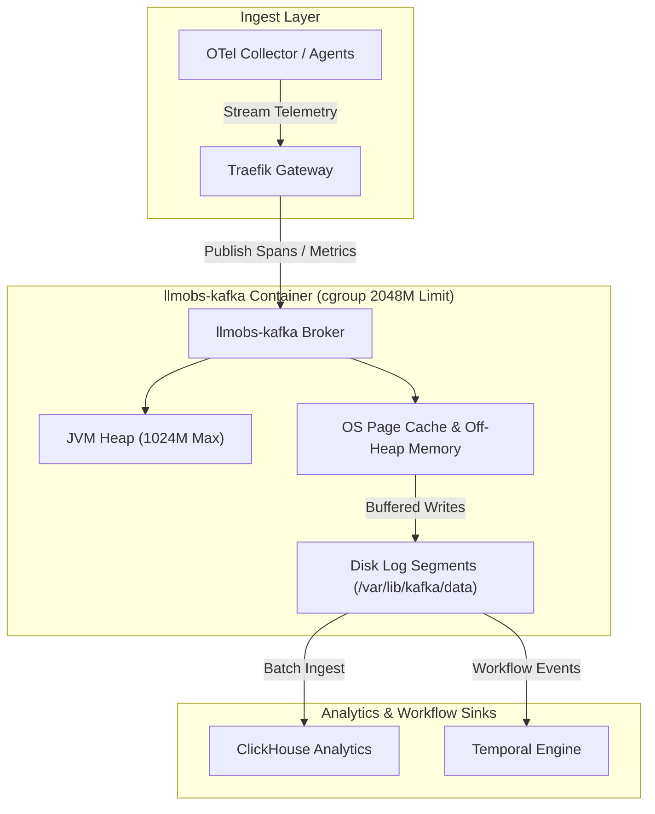

### Resource Constraints & Host Envelope
* **Host Physical RAM**: 15 GB total (~8.7 GB available).
* **Host Storage (`/dev/sda2`)**: 234 GB total (65 GB free / 71% utilized).
* **CPU Capacity**: 4 Virtual Cores.
* **Storage IOPS**: Standard SSD block storage.

Because Kafka relies heavily on both Java Virtual Machine (JVM) heap allocation and the Linux OS Kernel Page Cache for disk I/O, incorrect parameters quickly cause host RAM starvation, unpurged active log segment bloat, or container OOM (Out-Of-Memory) crashes (`Exit 137`). This document provides an exhaustive parameter-by-parameter analysis of Kafka's operational configuration within `llm-obs-infra`.

---

## 2. Exhaustive Configuration Deep-Dive

---

### 2.1 JVM Heap Allocation (`KAFKA_HEAP_OPTS`) & 2.2 Docker Container Memory Boundaries

* **Configuration Key**: `KAFKA_HEAP_OPTS` & `deploy.resources.limits.memory`
* **Configuration Target**: [`docker-compose.yml`](file:///home/btpl-lap-22/live/llm-obs-infra/docker-compose.yml) (Lines 94-99, Line 115)
* **Configured Value**: Heap: `-Xms512m -Xmx1024m` | Container Limit: `2048M` | Reservation: `512M`

#### Memory Layout Diagram

```mermaid
graph TB
    subgraph Host RAM ["15 GB Physical Host Memory"]
        subgraph Container ["llmobs-kafka Container (cgroup Limit: 2048 MB)"]
            subgraph JVM ["JVM Process Memory Boundary"]
                Heap ["JVM Heap (-Xmx1024M Max)<br/>• Broker Metadata<br/>• Request Queues<br/>• Connection Buffers"]
                OffHeap ["Off-Heap Native Memory (~512M)<br/>• Metaspace & Thread Stacks<br/>• Direct ByteBuffers<br/>• JNI Native Allocations"]
            end
            PageCache ["Linux OS Page Cache (~512M)<br/>• In-Memory File Caching<br/>• Disk I/O Acceleration"]
        end
        OtherContainers ["Other Host Containers<br/>(ClickHouse, Temporal, Traefik)"]
    end

    style Host RAM fill:#1a1a2e,color:#fff
    style Container fill:#16213e,color:#fff
    style JVM fill:#0f3460,color:#fff
    style Heap fill:#e94560,color:#fff
    style PageCache fill:#533483,color:#fff
```

#### 1. What It Does (Technical Mechanics)
`KAFKA_HEAP_OPTS` explicitly defines the initial (`-Xms`) and maximum (`-Xmx`) memory allocated to the JVM Heap. Docker container limits (`limits.memory`) enforce a hard Linux `cgroups` boundary around the entire container process (JVM Heap + Off-Heap Native Memory + OS Page Cache).

#### 2. Why We Need to Configure It (Problem & Motivation)
Previously, the stack used `KAFKA_JVM_PERFORMANCE_OPTS`. In Kafka's native launcher script (`kafka-run-class.sh`), `KAFKA_JVM_PERFORMANCE_OPTS` is designed **strictly for JVM Garbage Collection flags**. When heap options were placed inside performance flags, Kafka's startup script ignored them and forced its default hardcoded heap (`-Xmx1G -Xms1G`), or concatenated flags unpredictably. Using `KAFKA_HEAP_OPTS` guarantees that the JVM launcher directly passes the intended memory boundaries.

#### 3. How It Impacts Current System
* **Memory Bounding**: Keeps Kafka's JVM heap strictly between 512 MB and 1024 MB in base environment.
* **Off-Heap Protection**: Leaves ~1 GB of the 2048 MB container limit for non-heap native memory (Metaspace, JVM thread stacks, socket buffers) and Linux OS Page Cache.
* **GC Performance**: Reduces Garbage Collection pause durations on 4-core CPUs by avoiding large 4GB+ heap scans.

#### 4. How & Why to Scale / Increase It
* **Monitoring Triggers**:
  * JVM memory usage exceeding 85% of `-Xmx` consistently.
  * Frequent GC pauses (`jvm_gc_pause_seconds` > 500ms).
  * Error logs containing `java.lang.OutOfMemoryError: Java heap space`.
* **Scaling Formula**: `Container Limit = JVM Max Heap (-Xmx) + 1024MB to 2048MB (Off-Heap Buffer)`.

---

### 2.3 Log Segment Size (`log.segment.bytes`)

* **Configuration Key**: `log.segment.bytes`
* **Configuration Target**: [`config/kafka/server.properties`](file:///home/btpl-lap-22/live/llm-obs-infra/config/kafka/server.properties) (Line 15)
* **Configured Value**: `104857600` (100 MB) *(Default was 1 GB)*

#### Segment Rolling & Deletion Mechanics Diagram

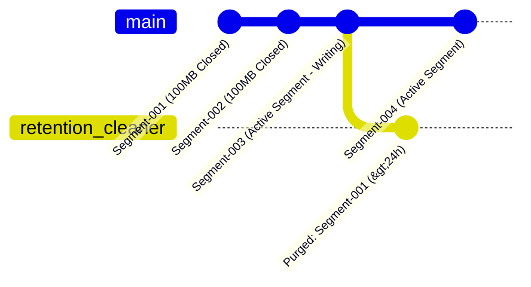

#### Default (1 GB) vs Configured (100 MB) Comparison

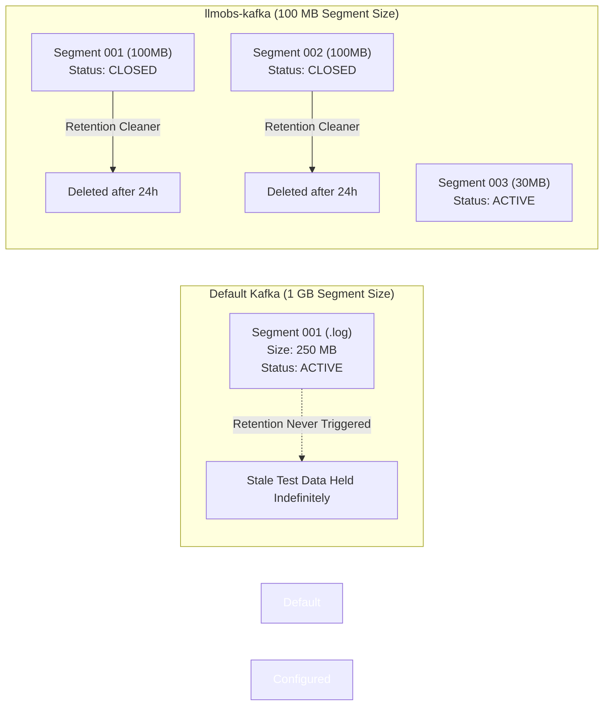

#### 1. What It Does (Technical Mechanics)
Kafka stores topic messages in sequential append-only partition log files divided into "segments" (`.log` payload file, `.index` offset index file, `.timeindex` timestamp index file). `log.segment.bytes` specifies the maximum byte size an active segment file can reach before Kafka closes it and creates a new active segment file.

#### 2. Why We Need to Configure It (Problem & Motivation)
**CRITICAL KAFKA MECHANIC**: **Retention rules (time-based or size-based) apply ONLY to closed (inactive) segments. Active segments are NEVER deleted, regardless of age.**
Under Kafka's default 1 GB segment setting, low-throughput dev/staging topics take weeks to accumulate 1 GB of logs. As a result, the segment remains permanently active, old test data is never deleted, and host storage space (`/dev/sda2`) fills up continuously.

#### 3. How It Impacts Current System
* **Faster File Roll**: Active log files reach 100 MB rapidly and close, allowing Kafka's retention cleaner thread to purge old segments daily.
* **Disk Space Bounding**: Reclaims up to 30 GB of disk space on `/dev/sda2` by preventing tiny/inactive topics from holding onto gigabytes of stale active segments.

#### 4. How & Why to Scale / Increase It
* **When to Increase**: In high-throughput production (> 50,000 messages/sec), set to `536870912` (512 MB) or `1073741824` (1 GB) to prevent excessive open file descriptor creation.

---

### 2.4 Log Retention Duration (`log.retention.hours`)

* **Configuration Key**: `log.retention.hours`
* **Configuration Target**: [`config/kafka/server.properties`](file:///home/btpl-lap-22/live/llm-obs-infra/config/kafka/server.properties) (Line 16)
* **Configured Value**: `24` (24 Hours / 1 Day) *(Default was 168h / 7 Days)*

#### Time-Based Retention Window Diagram

```mermaid
gantt
    title Kafka Log Retention Timeline (24-Hour Window)
    dateFormat HH:mm
    axisFormat %H:%m

    section Active Messages
    Incoming Telemetry Stream       :active, stream, 00:00, 24h
    section Closed Segments
    Segment 001 (0-6h) - Retained   :done, seg1, 00:00, 06:00
    Segment 002 (6-12h) - Retained  :done, seg2, 06:00, 12:00
    Segment 003 (12-18h) - Retained :done, seg3, 12:00, 18:00
    Segment 004 (18-24h) - Retained :done, seg4, 18:00, 24:00
    section Expired Segments
    Segment 000 (>24h) - DELETED   :crit, seg0, 00:00, 01:00
```

#### 1. What It Does (Technical Mechanics)
Determines the maximum age of closed log segments. During log retention checks, Kafka evaluates the timestamp of the last message in each closed segment. If the timestamp is older than `log.retention.hours`, the segment file is marked for deletion and unlinked from disk.

#### 2. Why We Need to Configure It (Problem & Motivation)
Kafka is an **intermediate stream buffer**, not a long-term analytical database. Telemetry data is consumed almost immediately by OpenTelemetry Collector and batch-inserted into ClickHouse. Retaining raw streaming logs in Kafka for 7 days duplicates data already residing in ClickHouse and unnecessarily consumes 40+ GB of host storage on `/dev/sda2`.

#### 3. How It Impacts Current System
* **Storage Footprint**: Bounds Kafka's total disk overhead to approximately **1 day** of streaming data.
* **Disk Space Reclamation**: Frees ~35 GB of disk space compared to the 7-day default on `/dev/sda2`.

---

### 2.5 Log Segment Roll Interval (`log.roll.hours`)

* **Configuration Key**: `log.roll.hours`
* **Configuration Target**: [`config/kafka/server.properties`](file:///home/btpl-lap-22/live/llm-obs-infra/config/kafka/server.properties) (Line 17)
* **Configured Value**: `2` (2 Hours) *(Default was 168h / 7 Days)*

#### Forced Segment Roll Cycle Diagram

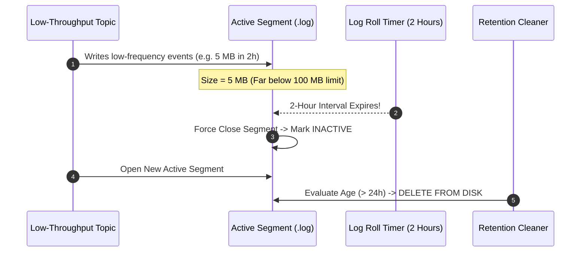

#### 1. What It Does (Technical Mechanics)
Establishes a strict **time-based ceiling** for rolling active log segments. Even if an active segment file has not reached `log.segment.bytes` (100 MB), Kafka forcibly closes the segment after `log.roll.hours` and opens a new active segment file.

#### 2. Why We Need to Configure It (Problem & Motivation)
Certain low-volume topics (audit logs, control-plane heartbeats) generate only a few kilobytes per hour. Without time-based rolling, an active segment on a low-volume topic might take months to reach 100 MB. Because active segments are never deleted, old test records in low-volume topics would bypass time-based retention forever. Setting `log.roll.hours=2` guarantees that every active segment closes within 2 hours regardless of throughput.

#### 3. How It Impacts Current System
* **Guaranteed Deletion Cycle**: Ensures all topics close active segments every 2 hours, making them eligible for deletion within 24–26 hours.
* **Eliminates Storage Leaks**: Prevents dormant topics from holding open segment references indefinitely.

---

### 2.6 Retention Check Interval (`log.retention.check.interval.ms`)

* **Configuration Key**: `log.retention.check.interval.ms`
* **Configuration Target**: [`config/kafka/server.properties`](file:///home/btpl-lap-22/live/llm-obs-infra/config/kafka/server.properties) (Line 18)
* **Configured Value**: `60000` (60 Seconds / 1 Minute) *(Default was 300,000ms / 5 Min)*

#### Retention Cleaner Thread Sequence Diagram

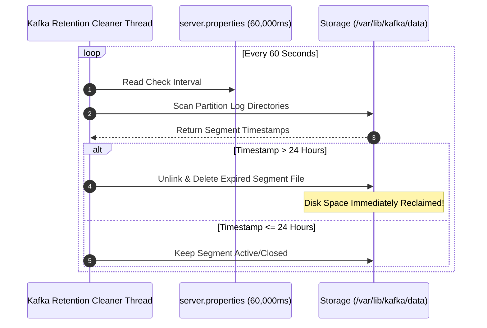

#### 1. What It Does (Technical Mechanics)
Defines how frequently Kafka's background log retention thread iterates through all topic partition directories to evaluate whether closed segments meet deletion criteria (`log.retention.hours`).

#### 2. Why We Need to Configure It (Problem & Motivation)
Default 5-minute intervals introduce a delay between segment expiration and physical deletion. On storage-constrained systems (`/dev/sda2` at 71% capacity), shortening the check interval to 60 seconds ensures expired segments are unlinked almost immediately after reaching their 24-hour limit.

#### 3. How It Impacts Current System
* **Rapid Space Recovery**: Reclaims disk space within 60 seconds of segment expiration.
* **Negligible Overhead**: Checking file metadata once per minute consumes less than 0.1% CPU on 4 cores.

---

### 2.7 Consumer Offsets Partition Count (`offsets.topic.num.partitions`)

* **Configuration Key**: `offsets.topic.num.partitions`
* **Configuration Target**: [`config/kafka/server.properties`](file:///home/btpl-lap-22/live/llm-obs-infra/config/kafka/server.properties) (Line 19)
* **Configured Value**: `3` *(Default was 50)*

#### Partition Folder Allocation Diagram

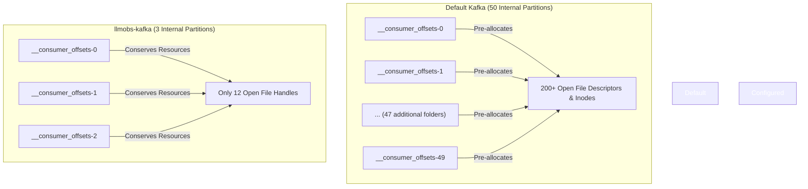

#### 1. What It Does (Technical Mechanics)
Kafka stores consumer group commit progress inside an internal compacted topic named `__consumer_offsets`. `offsets.topic.num.partitions` sets the partition count for this internal topic when it is created on cluster startup.

#### 2. Why We Need to Configure It (Problem & Motivation)
By default, Kafka creates **50 partitions** for `__consumer_offsets`. Each partition creates a separate directory on disk (`__consumer_offsets-0` through `__consumer_offsets-49`), containing its own `.log`, `.index`, `.timeindex`, and `leader-epoch-checkpoint` files. On a single-broker host with only 3–5 consumer groups, 50 partitions pre-allocate 50 open segment files, wasting file descriptors (`nofile`), inode structures, and memory.

#### 3. How It Impacts Current System
* **Directory Footprint**: Cuts internal topic folder bloat from 50 directories down to **3 directories**.
* **File Descriptor Conservation**: Saves 47 directory pointers and ~188 open file handles inside the container.

---

### 2.8 Default Partition Count (`num.partitions`)

* **Configuration Key**: `num.partitions` / `KAFKA_NUM_PARTITIONS`
* **Configuration Target**: [`config/kafka/server.properties`](file:///home/btpl-lap-22/live/llm-obs-infra/config/kafka/server.properties) (Line 12) & [`docker-compose.yml`](file:///home/btpl-lap-22/live/llm-obs-infra/docker-compose.yml) (Line 114)
* **Configured Value**: `3` *(Default was 1)*

#### Topic Partitioning & CPU Core Parallelism Diagram

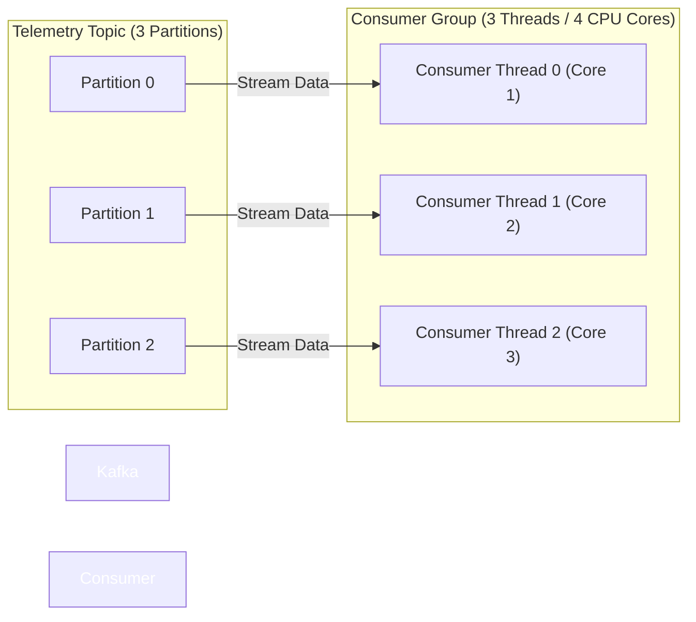

#### 1. What It Does (Technical Mechanics)
Determines the default number of parallel log partitions created when a new topic is created automatically or without explicit partition flags.

#### 2. Why We Need to Configure It (Problem & Motivation)
Kafka's processing model achieves concurrency through partitions: each partition can be read by exactly one consumer thread within a consumer group. Setting `num.partitions=1` limits topic ingestion and processing to a single CPU thread. Setting `num.partitions=3` enables 3-way parallel consumption across consumer threads.

#### 3. How It Impacts Current System
* **Parallel Processing**: Enables parallel data streaming across 3 worker threads.
* **CPU Alignment**: Matches the 4-core host CPU architecture cleanly without context-switching thrash.

---

### 2.9 Replication & High Availability Settings

* **Configuration Keys**: `offsets.topic.replication.factor`, `transaction.state.log.replication.factor`, `transaction.state.log.min.isr`
* **Configuration Target**: [`docker-compose.yml`](file:///home/btpl-lap-22/live/llm-obs-infra/docker-compose.yml) (Lines 110-112) & [`docker-compose.prod.yml`](file:///home/btpl-lap-22/live/llm-obs-infra/docker-compose.prod.yml) (Lines 7-11)

#### Single-Broker vs Multi-Broker HA Architecture Diagram

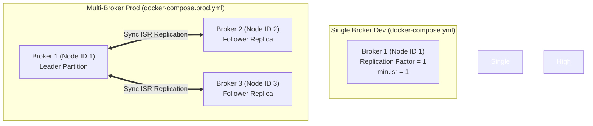

#### 1. What It Does (Technical Mechanics)
Defines how many broker nodes hold duplicate copies of topic partitions (`replication.factor`) and the minimum number of in-sync replicas (`min.isr`) required to acknowledge write transactions safely.

#### 2. Why We Need to Configure It (Problem & Motivation)
In single-node development (`docker-compose.yml`), a replication factor > 1 causes topic creation to fail because only 1 broker exists (`node.id=1`). In multi-node production (`docker-compose.prod.yml`), setting replication factors to `2` or `3` guarantees zero data loss if an individual Kafka container or host node fails.

---

### 2.10 Group Initial Rebalance Delay (`KAFKA_GROUP_INITIAL_REBALANCE_DELAY_MS`)

* **Configuration Key**: `KAFKA_GROUP_INITIAL_REBALANCE_DELAY_MS`
* **Configuration Target**: [`docker-compose.yml`](file:///home/btpl-lap-22/live/llm-obs-infra/docker-compose.yml) (Line 113)
* **Configured Value**: `0` *(Default was 3000ms)*

#### Startup Rebalance Timing Sequence Diagram

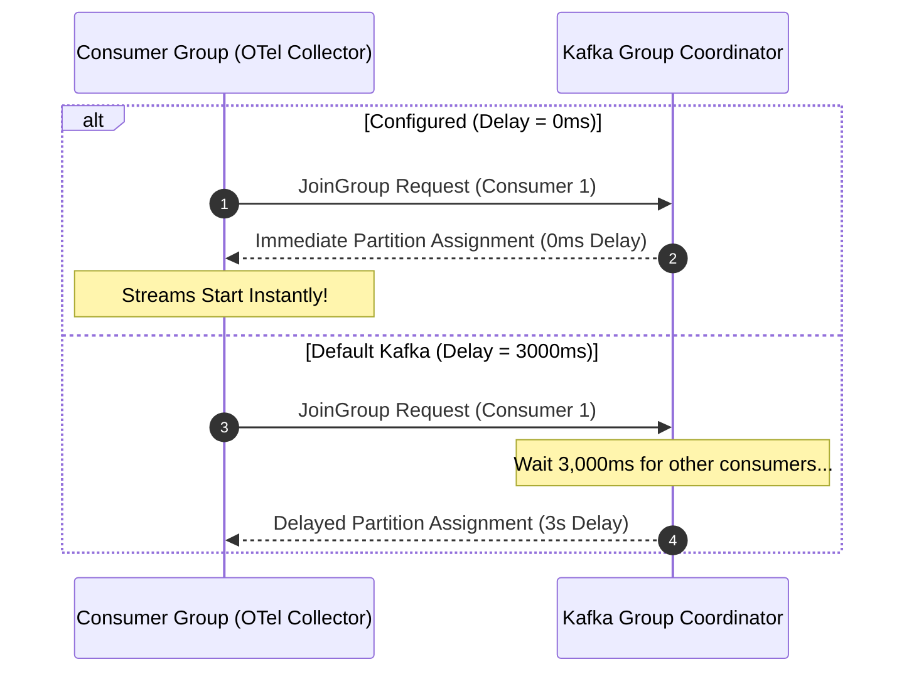

#### 1. What It Does (Technical Mechanics)
The time window Kafka's Group Coordinator waits before initiating a consumer group rebalance while new consumers are joining the group during startup.

#### 2. Why We Need to Configure It (Problem & Motivation)
During stack startup (`docker compose up -d`), telemetry consumers start almost simultaneously. Setting the delay to `0` allows consumer groups to allocate partitions instantly without artificial 3-second startup delays.

---

## 3. Comprehensive Parameter Matrix

| Parameter | Dev / Base Value | Prod Override | Apache Kafka Default | Primary Technical Impact | Scaling Trigger / Rule |
|---|---|---|---|---|---|
| `KAFKA_HEAP_OPTS` | `-Xms512m -Xmx1024m` | `-Xms1024m -Xmx2048m` | `-Xms1G -Xmx1G` | Bounds JVM heap; fixes performance flag launcher bug | Increase when `OOM: Java heap space` or GC pauses > 500ms |
| `limits.memory` | `2048M` | `2048M` | Unbounded | Hard cgroup ceiling; protects host from kernel OOM crash | `Limit = Xmx + 1024M` minimum off-heap buffer |
| `reservations.memory` | `512M` | `512M` | Unbounded | Guarantees host RAM allocation at startup | Increase alongside container limit |
| `log.segment.bytes` | `104857600` (100 MB) | `536870912` (512 MB) | `1073741824` (1 GB) | Closes segments quickly to allow daily deletion | Increase to 512M/1GB under high IOPS / > 50k msgs/sec |
| `log.retention.hours` | `24` (1 Day) | `72` (3 Days) | `168` (7 Days) | Reclaims 35+ GB disk space by purging old data | Increase if downstream ClickHouse ingestion is down > 24h |
| `log.roll.hours` | `2` (2 Hours) | `12` (12 Hours) | `168` (7 Days) | Forces log rolls on dormant topics for deletion eligibility | Increase to 12h-24h if topics write > 100MB continuously |
| `log.retention.check.interval.ms` | `60000` (60s) | `60000` (60s) | `300000` (5 Min) | Checks retention criteria every 60s for immediate cleanup | Increase to 5m if broker manages > 10,000 partitions |
| `offsets.topic.num.partitions` | `3` | `25` | `50` | Reduces internal `__consumer_offsets` folder bloat | Increase to 25-50 in multi-broker production (> 100 consumer groups) |
| `num.partitions` | `3` | `3` | `1` | Enables 3-way parallel consumer throughput | Set equal to available consumer thread cores |
| `KAFKA_GROUP_INITIAL_REBALANCE_DELAY_MS` | `0` | `0` | `3000` (3s) | Eliminates 3s startup delay during consumer group joins | Keep `0` for fast local/container restarts |

---

## 4. Operational Scaling & Multi-Node Cluster Migration Guide

### 4.1 Horizontal Scale-Out Architecture (Single-Broker to 3-Broker KRaft)

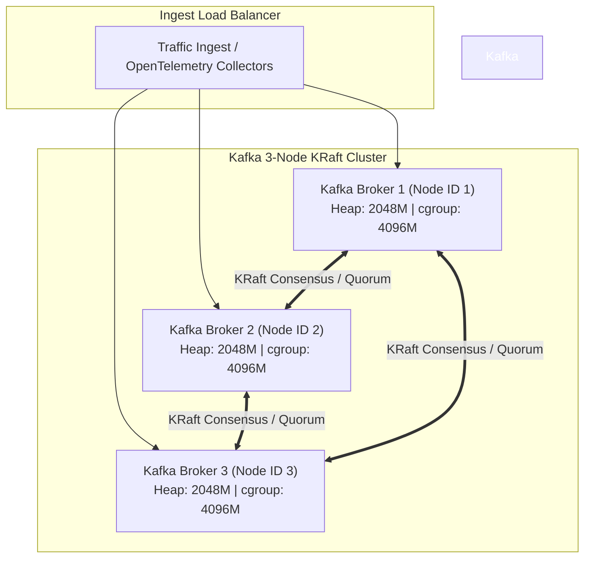

### 4.2 Step-by-Step Cluster Migration Procedure

1. **Update Production Environment Overrides** ([`docker-compose.prod.yml`](file:///home/btpl-lap-22/live/llm-obs-infra/docker-compose.prod.yml)):
   ```yaml
   services:
     llmobs-kafka-1:
       environment:
         - KAFKA_NODE_ID=1
         - KAFKA_PROCESS_ROLES=broker,controller
         - KAFKA_CONTROLLER_QUORUM_VOTERS=1@llmobs-kafka-1:9093,2@llmobs-kafka-2:9093,3@llmobs-kafka-3:9093
         - KAFKA_HEAP_OPTS=-Xms2048m -Xmx2048m
         - KAFKA_OFFSETS_TOPIC_REPLICATION_FACTOR=3
         - KAFKA_DEFAULT_REPLICATION_FACTOR=3
         - KAFKA_MIN_INSYNC_REPLICAS=2

     llmobs-kafka-2:
       # Same configuration with KAFKA_NODE_ID=2

     llmobs-kafka-3:
       # Same configuration with KAFKA_NODE_ID=3
   ```

2. **Adjust Topic Replication for Existing Topics**:
   ```bash
   docker exec -it llmobs-kafka-1 kafka-reassign-partitions.sh \
     --bootstrap-server localhost:9092 \
     --reassignment-json-file /etc/kafka/reassign.json \
     --execute
   ```

3. **Verify Cluster Health & In-Sync Replicas**:
   ```bash
   docker exec -it llmobs-kafka-1 kafka-topics.sh \
     --bootstrap-server localhost:9092 \
     --describe
   ```
