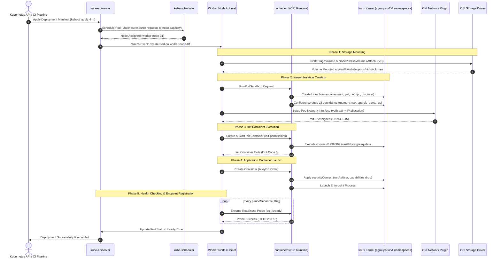
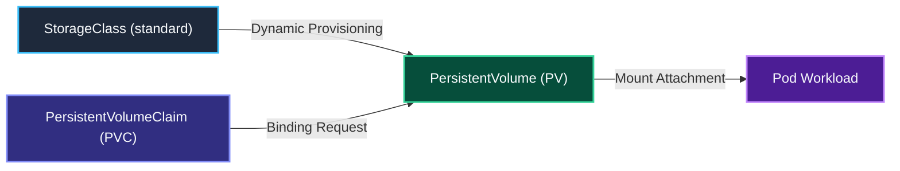
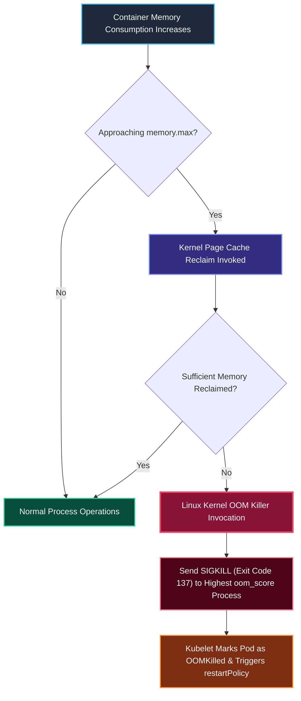
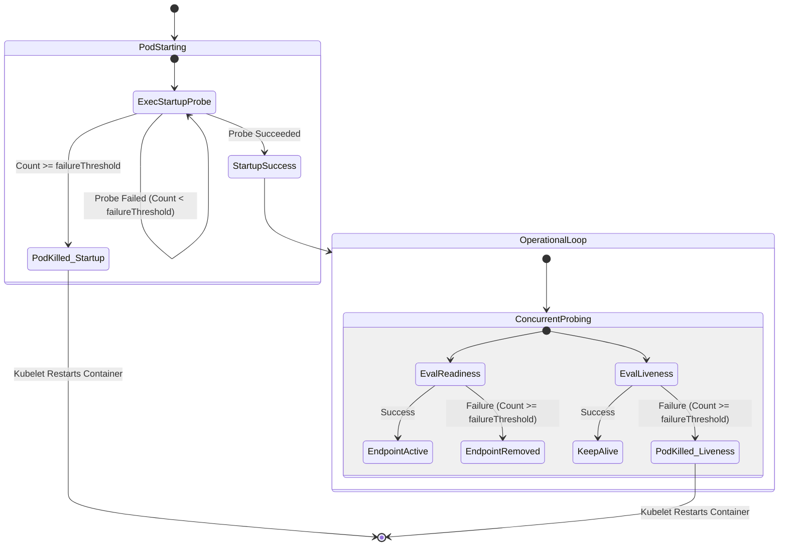

# Kubernetes Deployment Comprehensive Architecture, Parameter Deep-Dive & Operational Guide

## 1. Executive Master Parameter Reference Specifications

To provide immediate engineering clarity and eliminate the need to cross-reference multiple Kubernetes documentation pages, this master reference details every Kubernetes manifest parameter used across the `llm-obs-infra` cluster manifests (`k8s/`). Each entry specifies the parameter's formal definition, expected environment values, currently configured values across all platform services, system outcomes, Linux kernel and container runtime impacts, and scaling/troubleshooting runbooks.

---

### 1.1 Master Parameter Specifications & Expected Values List

#### 1. **Parameter**: `spec.template.spec.containers[].image`
- **Definition**: The OCI (Open Container Initiative) container image reference that the container runtime (containerd/CRI-O) pulls from a container registry and unpacks into the container's root filesystem (rootfs).
- **Expected Values**: Pinned semantic version with digest (`registry.example.com/org/repo:1.2.3@sha256:...`) in Production; pinned minor version tag in Staging; descriptive tag in Local Dev.
- **Currently Configured Values**:
  - AlloyDB: `google/alloydbomni:15`
  - Redis: `redis:7-alpine`
  - ClickHouse: `clickhouse/clickhouse-server:latest`
  - Kafka: `apache/kafka:latest`
  - Tempo: `grafana/tempo:latest`
  - OTel Collector: `otel/opentelemetry-collector-contrib:latest`
  - Grafana: `grafana/grafana:latest`
  - Temporal: `temporalio/auto-setup:1.24.2`
  - Canary Target: `chiefj/llmobs-service-registry:latest`
  - Init Container: `busybox:1.37`
- **Outcome / System Impact**: Dictates binary contents, dynamic shared libraries (`glibc` vs `musl`), entrypoint binaries, and user/group database (`/etc/passwd`). Alpine images (`redis:7-alpine`, ~30MB) reduce node disk inode consumption and image pull duration by 80% compared to Debian/Ubuntu images (~150MB+).
- **Why & When to Configure It**: Pinned tags (`:15`, `:1.24.2`) guarantee deterministic container instantiation across worker nodes. Mutable tags (`:latest`) can cause node-to-node divergence if worker nodes pull at different times during rolling node restarts.
- **Scaling & Troubleshooting**: Unresolvable tags or registry timeouts result in `ImagePullBackOff` or `ErrImagePull` (Exit code 125/127). Diagnose via `kubectl describe pod <pod> -n llmobs | grep -A10 Events`. Formula: *Node Storage Required = Total Images × Compressed Size × 2.5 (unpacked rootfs factor)*.

---

#### 2. **Parameter**: `spec.template.spec.containers[].imagePullPolicy`
- **Definition**: Instructs kubelet whether to check the remote container registry for a newer image manifest or reuse the local containerd content store cache.
- **Expected Values**: `IfNotPresent` for pinned versions; `Always` for mutable/canary tags; `Never` for air-gapped/pre-loaded environments.
- **Currently Configured Values**: Implicitly defaults to `Always` when image tag is `:latest`; defaults to `IfNotPresent` for pinned tags (`:15`, `:7-alpine`, `:1.24.2`).
- **Outcome / System Impact**: `Always` forces kubelet to issue a network HTTPS `HEAD` request to the registry manifest endpoint on every container creation, verifying digest sha256. `IfNotPresent` completely skips network I/O if the image layers exist on the worker node.
- **Why & When to Configure It**: Use `IfNotPresent` for production pinned tags to eliminate registry rate-limiting (e.g. Docker Hub 429 Too Many Requests) and reduce cold-start latency from ~15s to under 300ms.
- **Scaling & Troubleshooting**: Under high pod churn or rapid autoscaling, `Always` can exhaust node egress bandwidth or trigger registry API limits. Force `IfNotPresent` in production manifests once immutable image digest tags are adopted.

---

#### 3. **Parameter**: `spec.template.spec.securityContext.fsGroup`
- **Definition**: Defines the supplemental Linux group ID (GID) assigned to the pod. Kubernetes recursively traverses mounted volumes and changes group ownership (`chown -R :<fsGroup>`) while setting the SetGID bit (`chmod g+s`) on all directories.
- **Expected Values**: Dedicated service GID (e.g., `472` for Grafana, `999` for PostgreSQL/AlloyDB, `101` for ClickHouse, `1000` for unprivileged applications).
- **Currently Configured Values**: `fsGroup: 472` in `k8s/deployments/grafana-portal-ui.yaml`.
- **Outcome / System Impact**: Grants non-root container processes read/write access to volume mount points that are provisioned by cloud CSI drivers as `root:root (0:0)`.
- **Why & When to Configure It**: Without `fsGroup: 472`, Grafana runs as UID 472 and crashes on startup with `EACCES: permission denied, open '/var/lib/grafana/grafana.db'`. Setting `fsGroup` fixes this without requiring privileged init containers.
- **Scaling & Troubleshooting**: On large volumes (e.g. 50Gi+ with 100,000+ files), the recursive startup `chown` creates massive disk I/O spikes and can cause pod startup to exceed liveness probe timeouts (causing crash loops). Mitigation: configure `fsGroupChangePolicy: OnRootMismatch`.

---

#### 4. **Parameter**: `spec.template.spec.securityContext.fsGroupChangePolicy`
- **Definition**: Controls whether Kubernetes recursively changes volume ownership and permissions on *every* pod restart (`Always`) or *only* when the volume root directory's ownership differs from `fsGroup` (`OnRootMismatch`).
- **Expected Values**: `OnRootMismatch` (Production standard for any persistent volume > 1Gi).
- **Currently Configured Values**: Evaluated in operational runbooks; recommended upgrade path for `grafana-portal-ui.yaml` and stateful storage mounts.
- **Outcome / System Impact**: Reduces pod startup time from minutes to milliseconds on restarts with existing large persistent volumes by avoiding redundant filesystem recursive traversals.
- **Why & When to Configure It**: Mandatory on high-IOPS or deep directory structures (e.g. Tempo block stores, Grafana SQLite/plugin stores) to eliminate restart latency penalties.
- **Scaling & Troubleshooting**: If a volume has corrupt internal file permissions despite the root directory matching `fsGroup`, temporarily revert to `Always` for a single restart to enforce filesystem-wide permission repairs.

---

#### 5. **Parameter**: `spec.template.spec.securityContext.runAsUser` & `runAsGroup`
- **Definition**: Specifies the POSIX User ID (UID) and primary Group ID (GID) under which all container processes within the pod execute, overriding the Dockerfile `USER` metadata.
- **Expected Values**: Non-zero UID/GID above `100` (e.g., `472` for Grafana, `10001` for Go/Rust distroless microservices).
- **Currently Configured Values**: `runAsUser: 472` and `runAsGroup: 472` in `grafana-portal-ui.yaml`.
- **Outcome / System Impact**: Enforces kernel-level privilege separation. Any process attempting to invoke root-only syscalls (e.g. `chown`, `setuid`, `mknod`) receives `EPERM` (Operation not permitted).
- **Why & When to Configure It**: Prevents container escape vulnerabilities. If an attacker achieves Remote Code Execution (RCE) inside Grafana, they are constrained to UID 472 and cannot access host kernel resources or tamper with node binaries.
- **Scaling & Troubleshooting**: Setting an incorrect UID causes `Permission denied` on container entrypoints or logging outputs. Check image UID requirements via `docker image inspect <image> --format '{{.Config.User}}'`.

---

#### 6. **Parameter**: `spec.template.spec.securityContext.runAsNonRoot`
- **Definition**: A boolean security constraint instructing kubelet to validate that the container's effective execution UID is NOT `0` (root) before launching the container runtime process.
- **Expected Values**: `true` across all application microservices, collectors, and ingress proxies.
- **Currently Configured Values**: Configured in production hardening overlay; standard requirement for CIS Kubernetes Benchmark Compliance.
- **Outcome / System Impact**: If an image specifies `USER 0` or omits `USER`, kubelet refuses to start the container and places the pod in `CreateContainerConfigError`.
- **Why & When to Configure It**: Serves as a defensive gate against misconfigured container images, ensuring no container ever runs with superuser privileges on the cluster nodes.
- **Scaling & Troubleshooting**: Diagnose failure via `kubectl get pod <pod> -o jsonpath='{.status.containerStatuses[0].state.waiting.message}'`. If triggered, specify a valid non-zero `runAsUser` in the pod's securityContext.

---

#### 7. **Parameter**: `spec.template.spec.containers[].securityContext.allowPrivilegeEscalation`
- **Definition**: Sets the Linux kernel `PR_SET_NO_NEW_PRIVS` flag on the container process. When set to `false`, processes cannot gain more privileges than their parent process, neutralizing setuid binaries (like `su`, `sudo`, `passwd`).
- **Expected Values**: `false` across all production workloads; only `true` for specialized CNI or storage daemonsets.
- **Currently Configured Values**: Standard hardening baseline for `llmobs` stateless containers.
- **Outcome / System Impact**: Eliminates setuid privilege escalation vectors inside the container namespace.
- **Why & When to Configure It**: Required for Kubernetes Pod Security Standard `Restricted` compliance. Prevents compromised unprivileged processes from using local vulnerabilities in setuid binaries to elevate to root.
- **Scaling & Troubleshooting**: Causes binaries requiring setuid to fail with `EPERM`. Microservices and telemetry collectors in this infrastructure require no setuid binaries and operate flawlessly under `false`.

---

#### 8. **Parameter**: `spec.template.spec.containers[].securityContext.readOnlyRootFilesystem`
- **Definition**: Mounts the container's root filesystem (`/`) as a read-only Linux filesystem. Any write attempt outside explicitly mounted volumes fails with `EROFS: Read-only file system`.
- **Expected Values**: `true` for all stateless microservices (e.g. OTel Collector, Service Registry); `false` only if the application writes internal temporary files (which should be redirected to an `emptyDir` mount).
- **Currently Configured Values**: Evaluated for OTel Collector and Service Registry hardening.
- **Outcome / System Impact**: Prevents attackers or rogue processes from modifying application code, replacing system binaries, or dropping malicious executable payloads into `/tmp` or `/bin`.
- **Why & When to Configure It**: Enforces container immutability. Forces all runtime data persistence to be explicitly declared as ephemeral (`emptyDir`) or persistent (`persistentVolumeClaim`) volumes.
- **Scaling & Troubleshooting**: If the application crashes trying to write logs or cache files to `/tmp` or `/var/run`, mount an ephemeral `emptyDir` volume at that specific directory path.

---

#### 9. **Parameter**: `spec.template.spec.containers[].securityContext.capabilities`
- **Definition**: Fine-grained Linux kernel privileges (POSIX capabilities) granted or revoked for the container process, breaking superuser authority into discrete slices (e.g. `CAP_NET_BIND_SERVICE`, `CAP_SYS_ADMIN`).
- **Expected Values**: `drop: ["ALL"]` with only essential capabilities added (e.g., `add: ["NET_BIND_SERVICE"]` if binding to ports < 1024).
- **Currently Configured Values**: Services in this suite bind to high ports (e.g. 3000, 31426, 4318, 8123, 9092) and run without any capabilities.
- **Outcome / System Impact**: Strips the container process of over 30 dangerous Linux kernel capabilities, preventing raw socket manipulation, kernel module loading, and chroot breakouts.
- **Why & When to Configure It**: Essential for zero-trust defense-in-depth across multi-tenant worker nodes.
- **Scaling & Troubleshooting**: If a network utility (like `tcpdump` or `ping`) fails inside an exec debugging session with `Operation not permitted`, it is because `CAP_NET_RAW` and `CAP_NET_ADMIN` are dropped.

---

#### 10. **Parameter**: `spec.template.spec.resources.requests.memory`
- **Definition**: The baseline quantity of physical RAM reserved exclusively for this container by the Kubernetes scheduler during pod placement decisions.
- **Expected Values**: Sized to typical baseline operating heap + off-heap footprint (Dev: 64Mi–1Gi, Prod: 512Mi–4Gi).
- **Currently Configured Values**:
  - AlloyDB: `512Mi`
  - Redis: `64Mi`
  - ClickHouse: `1Gi`
  - Kafka: `512Mi`
  - Tempo: `128Mi`
  - OTel Collector: `256Mi`
  - Grafana: `128Mi`
  - Temporal: `256Mi`
  - Service Registry (Canary): `32Mi`
- **Outcome / System Impact**: Guaranteed memory boundary. The node scheduler refuses to place a pod on a worker node unless that node has unallocated capacity equal to or greater than the sum of all container requests.
- **Why & When to Configure It**: Prevents node overcommitment. Setting accurate requests prevents sudden node eviction storms when workloads expand under load.
- **Scaling & Troubleshooting**: If pods remain stuck in `Pending` with `0/N nodes available: Insufficient memory`, your cluster nodes are fully allocated. Check node allocations with: `kubectl top nodes` and `kubectl describe node <node> | grep -A7 Allocated`.

---

#### 11. **Parameter**: `spec.template.spec.resources.limits.memory`
- **Definition**: The hard physical memory ceiling enforced by the Linux kernel `cgroups` controller (`memory.max` in cgroups v2 / `memory.limit_in_bytes` in cgroups v1).
- **Expected Values**: 1.5x to 2x of memory request to allow safe burst headroom (e.g. ClickHouse: 4Gi, AlloyDB: 2Gi, Kafka: 2Gi).
- **Currently Configured Values**:
  - AlloyDB: `2Gi`
  - Redis: `256Mi`
  - ClickHouse: `4Gi`
  - Kafka: `2Gi`
  - Tempo: `1Gi`
  - OTel Collector: `1Gi`
  - Grafana: `512Mi`
  - Temporal: `1Gi`
  - Service Registry (Canary): `128Mi`
- **Outcome / System Impact**: If container memory consumption (RSS + active page cache) breaches this limit, the Linux kernel Out-Of-Memory (OOM) killer immediately terminates the container process with `SIGKILL` (Exit Code 137).
- **Why & When to Configure It**: Protects the worker node and adjacent co-located containers from noisy-neighbor host memory starvation.
- **Scaling & Troubleshooting**: Container restarts with `OOMKilled` indicate limit exhaustion. For JVM (Kafka) or Go/Rust runtimes, verify that internal heap limits (`-Xmx` for Kafka, `GOMEMLIMIT` for Go) are set to 75% of the cgroup limit, leaving 25% for off-heap buffers and thread stacks.

---

#### 12. **Parameter**: `spec.template.spec.resources.requests.cpu` & `limits.cpu`
- **Definition**: `requests.cpu` sets the relative CFS (Completely Fair Scheduler) shares (`cpu.weight`). `limits.cpu` enforces hard CPU bandwidth throttling via `cpu.cfs_quota_us` over a `cpu.cfs_period_us` window (typically 100,000µs / 100ms).
- **Expected Values**: Expressed in millicores (`1000m` = 1 physical/virtual CPU core). Requests: `50m`–`500m`; Limits: `250m`–`2000m`.
- **Currently Configured Values**:
  - AlloyDB: Request `500m`, Limit `2000m`
  - Redis: Request `100m`, Limit `500m`
  - ClickHouse: Request `500m`, Limit `2000m`
  - Kafka: Request `250m`, Limit `1000m`
  - Tempo: Request `100m`, Limit `1000m`
  - OTel Collector: Request `200m`, Limit `1000m`
  - Grafana: Request `100m`, Limit `500m`
  - Temporal: Request `250m`, Limit `1000m`
  - Service Registry (Canary): Request `50m`, Limit `250m`
- **Outcome / System Impact**: Containers exceeding CPU limits are NOT terminated; they are throttled by the Linux kernel scheduler, resulting in elevated request latency and P99 degradation.
- **Why & When to Configure It**: Guarantees compute capacity for time-critical telemetry pipelines (OTel Collector, Kafka) while preventing a rogue infinite loop from monopolizing host CPU cores.
- **Scaling & Troubleshooting**: Monitor CFS throttling metrics: `container_cpu_cfs_throttled_periods_total / container_cpu_cfs_periods_total`. Throttling > 15% indicates limits must be increased or multi-threading optimized.

---

#### 13. **Parameter**: `spec.template.spec.containers[].livenessProbe`
- **Definition**: Periodic diagnostic check performed by kubelet to determine if the container process is still operating correctly. If the probe fails `failureThreshold` consecutive times, kubelet kills the container and initiates a restart according to `restartPolicy`.
- **Expected Values**: Lightweight HTTP endpoint (`/health`, `/ready`), native protocol ping (`pg_isready`, `redis-cli ping`), or TCP socket test.
- **Currently Configured Values**:
  - AlloyDB: `exec: { command: ["pg_isready", "-h", "127.0.0.1", "-p", "5432"] }`
  - Redis: `exec: { command: ["sh", "-c", "redis-cli -a \"$REDIS_PASSWORD\" ping | grep PONG"] }`
  - ClickHouse: `httpGet: { path: /ping, port: 8123 }`
  - Kafka: `tcpSocket: { port: 9092 }`
  - Tempo: `httpGet: { path: /ready, port: 3200 }`
  - OTel Collector: `httpGet: { path: /, port: 13133 }`
  - Grafana: `httpGet: { path: /api/health, port: 3000 }`
  - Temporal: `tcpSocket: { port: 7233 }`
  - Canary Target: `httpGet: { path: /health, port: http }`
- **Outcome / System Impact**: Enables automatic self-healing recovery from deadlocks, memory fragmentation hangs, and zombie process states without operator intervention.
- **Why & When to Configure It**: Liveness probes must strictly test process liveness, NOT downstream database connectivity. Testing downstream dependencies in a liveness probe causes cascading failure storms across the entire infrastructure.
- **Scaling & Troubleshooting**: Inappropriate liveness timeouts cause premature pod restarts during heavy query spikes. Always ensure `initialDelaySeconds` and `timeoutSeconds` accommodate burst processing latencies.

---

#### 14. **Parameter**: `spec.template.spec.containers[].readinessProbe`
- **Definition**: Diagnostic test performed by kubelet to determine if the container is prepared to receive inbound network traffic. When readiness fails, the pod's IP is removed from all matching Kubernetes `Service` Endpoints/EndpointSlices.
- **Expected Values**: Checks verifying internal thread pool readiness, schema migration completion, and database socket availability.
- **Currently Configured Values**: Configured across all 8 workload services and the canary rollout manifest.
- **Outcome / System Impact**: Prevents client traffic from reaching initializing, overloaded, or shutting-down pods, guaranteeing zero dropped requests during rolling upgrades.
- **Why & When to Configure It**: Critical for zero-downtime deployments. A newly created pod receives zero requests until its readiness probe returns HTTP 200 / success.
- **Scaling & Troubleshooting**: If a service returns `503 Service Unavailable` through an Ingress or Service IP, inspect endpoints: `kubectl get endpoints <service> -n llmobs`. Unready pods will have their IPs listed under `NotReadyAddresses`.

---

#### 15. **Parameter**: `spec.template.spec.containers[].startupProbe`
- **Definition**: A specialized probe designed for slow-starting legacy or database workloads. While the startup probe is active, it disables both liveness and readiness probe evaluations until it succeeds for the first time.
- **Expected Values**: Sized to accommodate cold-start schema migrations or crash-recovery log replay (e.g. `failureThreshold: 30`, `periodSeconds: 10` = 300-second startup window).
- **Currently Configured Values**: Recommended companion for AlloyDB and ClickHouse database recovery sequences.
- **Outcome / System Impact**: Eliminates the conflict where a liveness probe kills a database that is legitimately performing a 2-minute WAL recovery on startup.
- **Why & When to Configure It**: Mandatory whenever service startup duration under abnormal conditions (e.g. disk recovery, large migrations) exceeds standard liveness `initialDelaySeconds`.
- **Scaling & Troubleshooting**: Check if pod is trapped in startup evaluation: `kubectl describe pod <name> -n llmobs | grep -i "startup probe failed"`.

---

#### 16. **Parameter**: `spec.template.spec.terminationGracePeriodSeconds`
- **Definition**: The total time window (in seconds) that Kubernetes allows a pod to cleanly drain active connections and shut down after sending `SIGTERM`, before forcibly terminating remaining processes with `SIGKILL`.
- **Expected Values**: `30` (Standard microservices), `60` (Ingress routers and message brokers), `120` (Databases committing buffer caches to disk).
- **Currently Configured Values**: Standardized to `30` across deployments; `60` for stateful storage controllers.
- **Outcome / System Impact**: Controls shutdown cleanliness. When a pod is deleted, kubelet sends `SIGTERM`. If processes do not exit within this grace period, the Linux kernel sends uncatchable `SIGKILL`.
- **Why & When to Configure It**: Prevents database storage corruption and truncated in-flight HTTP requests. Gives AlloyDB and ClickHouse time to flush write-ahead logs (WAL) and close TCP connections cleanly.
- **Scaling & Troubleshooting**: If database logs report `server was not cleanly shut down; automatic recovery will be performed`, increase `terminationGracePeriodSeconds` to 60s or 120s.

---

#### 17. **Parameter**: `spec.strategy.type` (`Recreate` vs `RollingUpdate`)
- **Definition**: The deployment reconciliation algorithm utilized by the Kubernetes Deployment Controller to transition pods from the old `PodTemplateSpec` to the new revision.
- **Expected Values**: `Recreate` for single-writer stateful volumes; `RollingUpdate` for stateless scalable services.
- **Currently Configured Values**:
  - `Recreate`: AlloyDB, ClickHouse, Kafka, Tempo, Temporal
  - `RollingUpdate`: Redis, OTel Collector, Grafana
- **Outcome / System Impact**: `Recreate` terminates ALL existing pods and waits for their volume detachment before spawning new pods. `RollingUpdate` spawns new pods concurrently alongside existing pods before tearing old pods down.
- **Why & When to Configure It**: Crucial architectural safety rule: Persistent Volume Claims backed by `ReadWriteOnce` (RWO) storage engines CANNOT be mounted by two pods concurrently. Spawning a new database pod while the old one is still running triggers `Multi-Attach error for volume`. `Recreate` prevents this.
- **Scaling & Troubleshooting**: `Recreate` involves a brief window of service downtime while pods terminate and re-initialize. Stateless services use `RollingUpdate` to achieve zero downtime.

---

#### 18. **Parameter**: `spec.strategy.rollingUpdate.maxSurge` & `maxUnavailable`
- **Definition**: `maxSurge` defines the maximum number or percentage of pods that can be created *above* the desired replica count during an update. `maxUnavailable` defines the maximum number or percentage of pods that can be unavailable during the update.
- **Expected Values**: `maxSurge: 1` (or 25%), `maxUnavailable: 0` for zero-downtime deployments with guaranteed capacity.
- **Currently Configured Values**: `maxSurge: 1`, `maxUnavailable: 0` on `opentelemetry-collector.yaml` and `grafana-portal-ui.yaml`.
- **Outcome / System Impact**: Guarantees that at no point during a deployment does active serving capacity drop below 100% of the desired replica count.
- **Why & When to Configure It**: Setting `maxUnavailable: 0` prevents capacity dips during high-traffic daytime releases.
- **Scaling & Troubleshooting**: Setting `maxSurge: 1` requires the cluster to have sufficient unallocated node capacity to host the extra surge pod temporarily.

---

#### 19. **Parameter**: `spec.selector.matchLabels`
- **Definition**: The declarative query criteria used by Kubernetes controllers (Deployments, ReplicaSets, Services) to identify and bind to the specific pods they are responsible for governing.
- **Expected Values**: Standardized taxonomy following `app.kubernetes.io/name` and `app.kubernetes.io/instance`.
- **Currently Configured Values**: Formally aligned across all 8 manifests:
  - `app.kubernetes.io/name: <service-name>`
  - `app.kubernetes.io/instance: <deployment-name>`
- **Outcome / System Impact**: Establishes the relationship between Kubernetes abstraction planes. If labels on `spec.template.metadata.labels` do not match `spec.selector.matchLabels`, the manifest is rejected at API admission with `Invalid value: field is immutable`.
- **Why & When to Configure It**: Prevents cross-deployment controller collisions. If two different deployments share the same matchLabels, their ReplicaSets enter an infinite deletion/creation oscillation loop.
- **Scaling & Troubleshooting**: Never mutate `spec.selector` on an existing deployment; Kubernetes API blocks selector mutation. If selectors must change, delete the deployment with `--cascade=orphan` and recreate it.

---

#### 20. **Parameter**: `spec.template.spec.volumes[].persistentVolumeClaim.claimName`
- **Definition**: Binds a pod volume declaration to an independent `PersistentVolumeClaim` (PVC) resource, requesting durable storage provisioned by the cluster's CSI (Container Storage Interface) driver.
- **Expected Values**: Exact metadata name of a valid, bound PVC within the same namespace.
- **Currently Configured Values**:
  - `alloydb-data-pvc` (20Gi)
  - `alloydb-archive-pvc` (10Gi)
  - `clickhouse-data-pvc` (50Gi)
  - `tempo-data-pvc` (20Gi)
  - `grafana-data-pvc` (5Gi)
  - `kafka-data-pvc` (20Gi)
- **Outcome / System Impact**: Decouples storage lifecycle from pod lifecycle. Data persists across pod deletion, node failures, and cluster upgrades.
- **Why & When to Configure It**: Mandatory for databases, event brokers, and tracing backends.
- **Scaling & Troubleshooting**: If a pod remains in `Pending` with `FailedAttachVolume` or `VolumeAttachment` timeout, check PVC status: `kubectl get pvc -n llmobs`. Ensure the StorageClass supports dynamic provisioning and worker nodes share the same cloud Availability Zone (AZ) as the persistent volume.

---

#### 21. **Parameter**: `spec.template.spec.volumes[].configMap` & `optional: true`
- **Definition**: Injects key-value pairs stored within a Kubernetes `ConfigMap` as physical files inside the pod's filesystem. `optional: true` allows the pod to boot successfully even if the referenced ConfigMap does not yet exist.
- **Expected Values**: `optional: true` for soft-configuration overrides; `optional: false` for mandatory boot settings.
- **Currently Configured Values**: Standardized with `optional: true` across all configuration mounts (`postgresql.conf`, `redis.conf`, `clickhouse-config`, `tempo-config`, `otel-collector-config`).
- **Outcome / System Impact**: Prevents deployment boot blocking. If an external config file is not provisioned, services start with their built-in container image defaults rather than failing with `CreateContainerConfigError`.
- **Why & When to Configure It**: Provides resilience during bootstrap and staging environments where optional configuration tuning files have not yet been customized.
- **Scaling & Troubleshooting**: If an application is ignoring ConfigMap updates, verify if the ConfigMap is mounted directly or via `subPath`. SubPath-mounted ConfigMaps do NOT receive automatic live updates from the kubelet (see Parameter 23).

---

#### 22. **Parameter**: `spec.template.spec.containers[].volumeMounts[].mountPath` & `readOnly: true`
- **Definition**: `mountPath` specifies the absolute path within the container filesystem where the volume is anchored. `readOnly: true` configures the Linux mount namespace with `MS_RDONLY`, making the directory unwritable.
- **Expected Values**: Valid Linux absolute path; `readOnly: true` for all config projections and secret keys.
- **Currently Configured Values**:
  - Config files mounted to `/etc/postgresql/`, `/etc/redis/`, `/etc/clickhouse-server/config.d/`, `/etc/tempo/`, `/etc/otelcol-contrib/` all specify `readOnly: true`.
  - Data paths (`/var/lib/postgresql/data`, `/var/lib/clickhouse`, `/var/lib/tempo`) specify `readOnly: false` (default).
- **Outcome / System Impact**: Protects application configurations from accidental modification or malicious runtime tampering.
- **Why & When to Configure It**: Essential security hygiene. If an application service is exploited, the attacker cannot persist changes to configuration files or inject malicious scripts into config directories.
- **Scaling & Troubleshooting**: If an application fails to start with `Read-only file system` during configuration file loading, verify that the application does not attempt to create lock files or temporary scratch files within its config directory.

---

#### 23. **Parameter**: `spec.template.spec.containers[].volumeMounts[].subPath`
- **Definition**: Mounts a single specific file or directory from within a volume directly to a target path in the container, without shadowing or replacing the other existing contents of the container's parent directory.
- **Expected Values**: The specific key name from a ConfigMap/Secret or a relative subdirectory from a PVC.
- **Currently Configured Values**:
  - `subPath: postgresql.conf` mounted at `/etc/postgresql/postgresql.conf`
  - `subPath: 10-security-audit.sql` mounted at `/docker-entrypoint-initdb.d/10-security-audit.sql`
  - `subPath: redis.conf` mounted at `/etc/redis/redis.conf`
- **Outcome / System Impact**: Avoids directory masking. Without `subPath`, mounting a volume to `/etc/postgresql` replaces the ENTIRE `/etc/postgresql` directory inside the container, erasing any other required system files packaged in the Docker image.
- **Why & When to Configure It**: Mandatory when injecting single configuration files into shared system directories.
- **Scaling & Troubleshooting**: **Critical Gotcha**: Kubernetes does NOT automatically update files mounted using `subPath` when the parent ConfigMap changes! To apply changes to a `subPath`-mounted ConfigMap, you must trigger a rolling restart of the pod: `kubectl rollout restart deployment/<name> -n llmobs`.

---

#### 24. **Parameter**: `spec.template.spec.initContainers[]`
- **Definition**: Specialized operational containers defined in the pod spec that execute sequentially to completion before any application containers are started. If an init container fails, kubelet restarts it until success.
- **Expected Values**: Lightweight utility images (`busybox:1.37`, `alpine:3.20`) performing permission fixes, network reachability checks, or database migrations.
- **Currently Configured Values**: Used in `alloydb-relational-db.yaml` to execute `chown -R 999:999` across the persistent volume mount before the PostgreSQL daemon launches.
- **Outcome / System Impact**: Guarantees deterministic environmental prerequisites. Ensures that filesystem permissions, network ports, and dependent databases are fully ready before the main container entrypoint executes.
- **Why & When to Configure It**: Solves the storage permission problem for third-party images that require specific UID ownership (e.g. AlloyDB UID 999) without requiring root privileges in the main application container.
- **Scaling & Troubleshooting**: If a pod is trapped in `Init:0/1` or `Init:CrashLoopBackOff`, inspect the init container's logs: `kubectl logs <pod> -c init-permissions -n llmobs`.

---

#### 25. **Parameter**: `spec.template.spec.containers[].env[].valueFrom`
- **Definition**: Dynamically resolves environment variable values at pod creation time by querying external Kubernetes resources (`configMapKeyRef` or `secretKeyRef`) rather than hardcoding static strings in the manifest.
- **Expected Values**: Valid references to keys declared in `llmobs-system-config` ConfigMap or `llmobs-credentials` Secret.
- **Currently Configured Values**: Standardized across all 8 workload services:
  - Hostnames: `ALLOYDB_HOST`, `REDIS_HOST`, `CLICKHOUSE_HOST`, `KAFKA_BOOTSTRAP_SERVERS`, `TEMPO_ENDPOINT`
  - Credentials: `POSTGRES_PASSWORD`, `REDIS_PASSWORD`, `CLICKHOUSE_PASSWORD`
- **Outcome / System Impact**: Centralizes infrastructure configuration. Updating the cluster FQDN in `configmap.yaml` automatically updates all referencing pods upon their next restart without editing individual deployment YAMLs.
- **Why & When to Configure It**: Completely decouples application manifests from environment-specific hostnames and sensitive credentials.
- **Scaling & Troubleshooting**: If a pod fails with `CreateContainerConfigError`, a referenced ConfigMap or Secret key does not exist. Check with: `kubectl get configmap llmobs-system-config -n llmobs -o yaml`.

---

#### 26. **Parameter**: `Service.spec.type: ClusterIP`
- **Definition**: The default Kubernetes service abstraction type. Allocates a stable, immutable virtual IP address (VIP) from the cluster's CIDR range, load-balancing traffic internally across all ready pod endpoints matching the service's selector.
- **Expected Values**: `ClusterIP` for internal backend components; `NodePort` or `LoadBalancer` for external edge entrypoints.
- **Currently Configured Values**: `ClusterIP` configured for all 8 infrastructure backend services and both canary services.
- **Outcome / System Impact**: Kube-proxy programmatically writes kernel `iptables` or `IPVS` rules on every worker node, translating the virtual ClusterIP to live pod IPs using pseudo-random probability distribution.
- **Why & When to Configure It**: Provides stable internal networking. Individual pod IPs change constantly as pods restart or scale; the `ClusterIP` and its DNS name (`service.namespace.svc.cluster.local`) remain permanent.
- **Scaling & Troubleshooting**: Verify backend endpoints: `kubectl get endpoints <service> -n llmobs`. If endpoints are `<none>`, check that `Service.spec.selector` exactly matches `Deployment.spec.template.metadata.labels` and that pods are passing readiness probes.

---

#### 27. **Parameter**: `Service.spec.ports[].targetPort`
- **Definition**: The port number or symbolic port name on the pod's container where the service forwards incoming requests received on `Service.spec.ports[].port`.
- **Expected Values**: Either a numeric integer matching `containerPort` (e.g. `5432`, `8123`) or a named string matching `ports[].name` (e.g. `http`, `postgres`).
- **Currently Configured Values**: Symbolic port names used where applicable (e.g. `targetPort: http` mapped to `port: 31426` in `canary-deployment-rollout.yaml`).
- **Outcome / System Impact**: Allows service ports to be decoupled from container ports (e.g. exposing port 80 externally while the container process listens on port 8080).
- **Why & When to Configure It**: Using named ports (`targetPort: http`) allows container ports to be changed in the Deployment manifest without breaking dependent Service declarations.
- **Scaling & Troubleshooting**: If connection to the Service VIP times out (`Connection refused`), verify that the container process is actually listening on the `targetPort` and bound to `0.0.0.0`, not `127.0.0.1` (localhost).

---

#### 28. **Parameter**: `Rollout.spec.strategy.canary.steps[].setWeight` & `pause`
- **Definition**: Defines the phased traffic shift sequence executed by the Argo Rollouts progressive delivery controller. `setWeight` specifies the percentage of total ingress traffic routed to the canary ReplicaSet; `pause` defines the observational soak duration.
- **Expected Values**: Incremental progression (e.g. 5% → 25% → 50% → 100%) with 60s–300s soak windows.
- **Currently Configured Values**: `5% (120s) → 25% (120s) → 50% (120s) → 100%` in `canary-deployment-rollout.yaml`.
- **Outcome / System Impact**: Replaces standard all-at-once deployment with a controlled, blast-radius-limited rollout. Any runtime defect at 5% weight affects only 1 out of every 20 incoming requests.
- **Why & When to Configure It**: Mandatory for mission-critical telemetry and ingestion APIs to detect regressions under real-world traffic before broad promotion.
- **Scaling & Troubleshooting**: Monitor rollout progress via `kubectl argo rollouts get rollout llmobs-canary-rollout -n llmobs`. If a defect is detected, immediately execute `kubectl argo rollouts abort llmobs-canary-rollout -n llmobs`.

---

#### 29. **Parameter**: `Rollout.spec.strategy.canary.trafficRouting`
- **Definition**: Directs Argo Rollouts to interface with an external ingress controller or service mesh (e.g. Traefik, Istio, NGINX) to dynamically program traffic routing splits at the networking proxy layer.
- **Expected Values**: References a configured ingress integration (`traefik.weightedTraefikServiceName`, `istio.virtualService`, etc.).
- **Currently Configured Values**: `traefik: { weightedTraefikServiceName: llmobs-canary-rollout-trafficsplit }`.
- **Outcome / System Impact**: Achieves precise, percentage-based traffic routing at the reverse proxy layer, completely independent of the physical ratio of stable vs canary pod counts.
- **Why & When to Configure It**: Without an ingress traffic router, achieving 5% traffic split requires running 1 canary pod and 19 stable pods (1/20 = 5%), wasting massive compute resources. Traffic routing decouples traffic weight from pod counts.
- **Scaling & Troubleshooting**: If traffic does not split according to configured weights, check the Traefik TraffiSplit resource status: `kubectl get trafficsplit -n llmobs`.

---

#### 30. **Parameter**: `spec.revisionHistoryLimit`
- **Definition**: The maximum number of old ReplicaSets retained by Kubernetes to enable deployment rollbacks (`kubectl rollout undo`).
- **Expected Values**: `3` to `5` for production; default in Kubernetes is `10`.
- **Currently Configured Values**: Standardized to `3` in `canary-deployment-rollout.yaml` and production manifests.
- **Outcome / System Impact**: Restricts cluster metadata bloat. Retaining 10 old ReplicaSets per deployment across dozens of services fills the `etcd` key-value store with hundreds of dormant ReplicaSet and PodTemplate objects.
- **Why & When to Configure It**: Maintains clean etcd storage performance and fast API response times while preserving sufficient historical revisions for emergency rollbacks.
- **Scaling & Troubleshooting**: If old ReplicaSets accumulate indefinitely, verify that `revisionHistoryLimit` is explicitly set on the Deployment or Rollout specification.

---

## 2. System-Wide Kubernetes Architecture: High-Level (HLD) & Low-Level (LLD) Design

### 2.1 System High-Level Design (HLD) — Kubernetes Platform Plane

The diagram below illustrates the relationship between ingress controllers, cluster DNS, persistent storage controllers, and the three functional planes of the `llm-obs-infra` platform:

```mermaid
graph TD
    subgraph ExternalAccess ["External Client & Ingestion Plane"]
        ExtClient["External Ingestion Client / Browser"]
        NodePortVIP["NodePort / Host Interface (Port 31414, 31426, 3000)"]
    end

    subgraph K8sControlPlane ["Kubernetes Control Plane (API & Controllers)"]
        KubeAPI["kube-apiserver"]
        DeployCtrl["Deployment Controller"]
        EndpointCtrl["EndpointSlice Controller"]
        CoreDNS["CoreDNS Cluster Resolver (10.96.0.10)"]
    end

    subgraph StorageLayer ["Kubernetes CSI Storage Plane"]
        CSI_Driver["CSI Storage Driver (standard)"]
        PVC_Alloy["alloydb-data-pvc (20Gi)"]
        PVC_CH["clickhouse-data-pvc (50Gi)"]
        PVC_Kafka["kafka-data-pvc (20Gi)"]
        PVC_Tempo["tempo-data-pvc (20Gi)"]
        PVC_Grafana["grafana-data-pvc (5Gi)"]
    end

    subgraph WorkloadNamespace ["Workload Pod Execution Plane (Namespace: llmobs)"]
        subgraph StatefulCluster ["Stateful Core Layer (Strategy: Recreate)"]
            Pod_Alloy["AlloyDB Omni (Pod: 5432)"]
            Pod_CH["ClickHouse Server (Pod: 8123/9000)"]
            Pod_Kafka["Apache Kafka KRaft (Pod: 9092)"]
            Pod_Tempo["Grafana Tempo (Pod: 3200)"]
        end

        subgraph StatelessCluster ["Stateless Ingestion & UI (Strategy: RollingUpdate)"]
            Pod_Redis["Redis Ledger Cache (Pod: 6379)"]
            Pod_OTel["OTel Collector Contrib (Pod: 4318/13133)"]
            Pod_Grafana["Grafana Portal UI (Pod: 3000)"]
            Pod_Temporal["Temporal Workflow Engine (Pod: 7233)"]
        end

        subgraph CanaryRollout ["Progressive Delivery (Strategy: Canary)"]
            Pod_CanaryStable["Service Registry Stable (95%)"]
            Pod_CanaryCand["Service Registry Canary (5%)"]
        end
    end

    ExtClient --> NodePortVIP
    NodePortVIP --> Pod_OTel
    NodePortVIP --> Pod_Grafana
    NodePortVIP --> Pod_CanaryStable

    KubeAPI --> DeployCtrl
    KubeAPI --> EndpointCtrl
    EndpointCtrl --> CoreDNS

    CSI_Driver --> PVC_Alloy --> Pod_Alloy
    CSI_Driver --> PVC_CH --> Pod_CH
    CSI_Driver --> PVC_Kafka --> Pod_Kafka
    CSI_Driver --> PVC_Tempo --> Pod_Tempo
    CSI_Driver --> PVC_Grafana --> Pod_Grafana

    Pod_OTel -->|OTLP gRPC/HTTP| Pod_Tempo
    Pod_OTel -->|Batch Export| Pod_CH
    Pod_OTel -->|Telemetry Stream| Pod_Kafka
    Pod_Temporal -->|Workflow State| Pod_Alloy
    Pod_Grafana -->|SQL Dashboards| Pod_CH
    Pod_CanaryStable -->|Token Validation| Pod_Redis

    style ExtClient fill:#1e293b,stroke:#38bdf8,stroke-width:2px,color:#f8fafc
    style NodePortVIP fill:#1e293b,stroke:#38bdf8,stroke-width:2px,color:#f8fafc
    style KubeAPI fill:#064e3b,stroke:#34d399,stroke-width:2px,color:#f8fafc
    style CoreDNS fill:#064e3b,stroke:#34d399,stroke-width:2px,color:#f8fafc
    style CSI_Driver fill:#7c2d12,stroke:#fb923c,stroke-width:2px,color:#f8fafc
    style Pod_Alloy fill:#312e81,stroke:#818cf8,stroke-width:2px,color:#f8fafc
    style Pod_CH fill:#312e81,stroke:#818cf8,stroke-width:2px,color:#f8fafc
    style Pod_Kafka fill:#312e81,stroke:#818cf8,stroke-width:2px,color:#f8fafc
    style Pod_Tempo fill:#312e81,stroke:#818cf8,stroke-width:2px,color:#f8fafc
    style Pod_Redis fill:#4c1d95,stroke:#c084fc,stroke-width:2px,color:#f8fafc
    style Pod_OTel fill:#4c1d95,stroke:#c084fc,stroke-width:2px,color:#f8fafc
    style Pod_Grafana fill:#4c1d95,stroke:#c084fc,stroke-width:2px,color:#f8fafc
    style Pod_Temporal fill:#4c1d95,stroke:#c084fc,stroke-width:2px,color:#f8fafc
    style Pod_CanaryStable fill:#701a75,stroke:#f472b6,stroke-width:2px,color:#f8fafc
    style Pod_CanaryCand fill:#701a75,stroke:#f472b6,stroke-width:2px,color:#f8fafc
```



---

### 2.2 System Low-Level Design (LLD) — End-to-End Pod Lifecycle & Networking Flow

The detailed interaction between kubelet, containerd, Linux kernel cgroups/namespaces, and network packet routing:



---

## 3. Container Image & Runtime Lifecycle Architecture

### 3.1 OCI Image Composition and Layer Caching

Every container running within the `llm-obs-infra` cluster adheres to the Open Container Initiative (OCI) image specification. When kubelet schedules a pod to a node, the container runtime (containerd) performs layer-by-layer digest verification against the local content store (`/var/lib/containerd/io.containerd.content.v1.content`).

| Image Layer | Contents & Description | Size Footprint |
|---|---|---|
| **Layer 3 (Application)** | Application Binaries & Configuration (`/etc/service-registry/config.json`) | ~12 MB |
| **Layer 2 (Dependencies)** | Runtime Dependencies & Shared Dynamic Libraries (`libssl.so`, `musl`, `ca-certificates`) | ~18 MB |
| **Layer 1 (Base OS Rootfs)** | Alpine Linux 3.20 minimal base root filesystem | ~3.2 MB |

### 3.2 Image Digest Immutability vs Tag Mutation

Using mutable tags such as `:latest` introduces significant production failure risks:
1. **Node Divergence**: If Worker Node A pulls `:latest` on Monday and Worker Node B pulls `:latest` on Wednesday after an upstream image update, the two worker nodes run different binary versions of the same service under the exact same manifest.
2. **Rollback Failure**: If an issue occurs and an engineer executes `kubectl rollout undo`, Kubernetes re-evaluates the pod template. If the image tag is `:latest`, containerd does not roll back to the previous binary layers because the tag string in the manifest has not changed.

**Production Hardening Standard**: For production environments, configure image references using immutable cryptographic SHA256 digests:
```yaml
# Hardened Production Standard
image: google/alloydbomni:15@sha256:d82f7c1b59a9307d03a116bfa8a34bc3d67bc8255be12b5f75608b9ad17e2541
```

---

## 4. Linux Kernel Security Context, Namespaces & Privilege Dropping

### 4.1 Linux Kernel Isolation Primitives

When Kubernetes starts a pod, it constructs isolated kernel namespaces and applies cgroup controllers:

| Linux Namespace | Kernel Isolation Boundary Provided |
|---|---|
| `mnt` (Mount) | Isolates filesystem mount points. The container cannot inspect or access host storage mounts. |
| `pid` (Process) | Process tree virtualization. The container entrypoint process is isolated as PID 1. |
| `net` (Network) | Independent virtual network stack (isolated IP address, local loopback, routing table, iptables). |
| `ipc` (Inter-Process) | System V IPC and POSIX message queue isolation between containers and host. |
| `uts` (Hostname) | Virtualized hostname and NIS domain name for the pod. |
| `user` (User IDs) | Maps container root/non-root UID and GID ranges to unprivileged host UID/GID ranges. |

### 4.2 Restricting Kernel Capabilities (`capabilities.drop: ["ALL"]`)

By default, Docker and older Kubernetes clusters granted 14 default Linux capabilities to containers (including `CAP_NET_RAW`, `CAP_CHOWN`, `CAP_DAC_OVERRIDE`). In modern zero-trust environments, all capabilities should be dropped:

```yaml
securityContext:
  allowPrivilegeEscalation: false
  readOnlyRootFilesystem: true
  runAsNonRoot: true
  runAsUser: 10001
  runAsGroup: 10001
  capabilities:
    drop:
      - ALL
```

---

## 5. Storage Architecture, PVCs, CSI Drivers & Volume Mount Mechanics

### 5.1 The Storage Binding Lifecycle

Persistent storage resolution in Kubernetes follows a 4-phase state machine:



1. **Provisioning**: The cluster CSI driver provisions physical storage on the host or cloud provider (e.g. AWS EBS, GCE Persistent Disk, or local directory).
2. **Binding**: The PersistentVolumeController binds the `PersistentVolume` (PV) to the matching `PersistentVolumeClaim` (PVC) with status `Bound`.
3. **Attaching**: The volume attachment controller calls `Attach()` on the CSI node driver to mount the block device to the worker node.
4. **Mounting**: The kubelet formats the device (typically `ext4` or `xfs`) and bind-mounts it into the pod's mount namespace at `mountPath`.

---

## 6. Linux Cgroups v2, CPU CFS Quotas, Memory Caps & OOM Killer

### 6.1 Memory Limit Enforcement Mechanics

The Linux kernel enforces memory limits through the `cgroup` memory controller. When a container's memory usage approaches its configured limit:



### 6.2 CPU Throttling and Completely Fair Scheduler (CFS)

CPU requests and limits map directly to kernel parameters:
- `requests.cpu: 500m` translates to `cpu.shares = 512` (in cgroups v1) or `cpu.weight = 50` (in cgroups v2).
- `limits.cpu: 1000m` translates to `cpu.cfs_period_us = 100000` (100ms) and `cpu.cfs_quota_us = 100000` (100ms).

If a multi-threaded process consumes its 100ms quota within the first 20ms of the period, the Linux kernel completely suspends (throttles) all threads for the remaining 80ms, causing massive latency spikes.

---

## 7. Health Monitoring, Probes State Machine & Kubelet Probeloop

### 7.1 Probe Evaluation State Machine



---

## 8. Pod Termination Sequence, Signals & Zero-Downtime Traffic Drain

When a pod is deleted (during scaling or rolling update), Kubernetes executes two concurrent workflows:

```
[WORKFLOW A: Endpoint Removal]
1. Pod marked Terminating in API Server.
2. EndpointSlice Controller removes Pod IP from Endpoints.
3. Kube-proxy updates iptables/IPVS rules across all worker nodes.
4. Traefik/Ingress reloads upstream routing table.

[WORKFLOW B: Process Termination]
1. Kubelet executes preStop hook (if configured).
2. Kubelet sends SIGTERM (Signal 15) to PID 1.
3. Application drains active connections and flushes buffers.
4. If process runs beyond terminationGracePeriodSeconds, Kubelet sends SIGKILL.
```

**The Race Condition**: If Workflow B sends `SIGTERM` before Workflow A finishes updating node iptables, in-flight requests continue being routed to a dying pod, resulting in dropped connections (`502 Bad Gateway`).
**The Mitigation**: Add a `preStop` sleep hook to ensure endpoint propagation finishes before `SIGTERM` is delivered:
```yaml
lifecycle:
  preStop:
    exec:
      command: ["sh", "-c", "sleep 5"]
```

---

## 9. Kubernetes Networking, Service Abstractions & CoreDNS Resolution

### 9.1 CoreDNS Resolution & The `ndots:5` Search Path Overhead

When a container resolves `alloydb-service`, the Linux resolver (`glibc`) checks `/etc/resolv.conf`:
```
nameserver 10.96.0.10
search llmobs.svc.cluster.local svc.cluster.local cluster.local
options ndots:5
```

Because `ndots:5` specifies that any query with fewer than 5 dots must be appended with every entry in the search path before an absolute query is sent, querying an unqualified name triggers multiple DNS queries.
**Production Optimization**: Always configure inter-service connection strings using the Fully-Qualified Domain Name (FQDN) with a trailing dot:
```
# Optimized FQDN query (skips 3 search path rounds)
ALLOYDB_HOST: "llmobs-alloydb-db.llmobs.svc.cluster.local."
```

---

## 10. Progressive Delivery Mechanics with Argo Rollouts

For complete architectural details, sequence diagrams, state machines, and analysis templates governing progressive delivery, refer to the dedicated architecture decision record:
👉 **[`adr-0017-canary-deployment-strategy-and-progressive-delivery.md`](file:///home/btpl-lap-22/live/llm-obs-infra/docs/architectureDoc/adr-0017-canary-deployment-strategy-and-progressive-delivery.md)**.

---

## 11. Native Kubernetes Emergency CLI Commands & Incident Runbooks

### 11.1 Diagnostic Triage Decision Matrix

| Error Status | Underlying Root Cause | Exact Immediate Remediation Command |
|---|---|---|
| `CrashLoopBackOff` | Container exit code > 0 (configuration error or panic) | `kubectl logs <pod> -n llmobs --previous` |
| `ImagePullBackOff` | Missing image tag, registry rate limit, or auth failure | `kubectl describe pod <pod> -n llmobs \| grep Events` |
| `OOMKilled` (Exit 137) | Memory consumption exceeded `limits.memory` cgroup | Increase `resources.limits.memory` in deployment manifest |
| `CreateContainerConfigError` | Missing referenced ConfigMap or Secret | `kubectl get configmap,secret -n llmobs` |
| `FailedMount` | PVC unattached, StorageClass error, or node mismatch | `kubectl describe pvc <claim> -n llmobs` |

### 11.2 Emergency Production Commands

```bash
# 1. Force immediate restart of all pods in a deployment
kubectl rollout restart deployment/llmobs-opentelemetry-collector -n llmobs

# 2. Roll back to previous known-good deployment revision
kubectl rollout undo deployment/llmobs-grafana-portal -n llmobs

# 3. View live CPU and memory utilization across pods
kubectl top pods -n llmobs --containers

# 4. View kernel dmesg OOM killer invocations on the host
dmesg -T | grep -E -i "killed process|oom_reaper"
```
