# OpenTelemetry Collector Comprehensive Architecture, Component Deep-Dive and Operational Guide

> **Validated against OpenTelemetry Collector Contrib `v0.100.0+`** (`otel/opentelemetry-collector-contrib:latest`), running under the production `1024M` cgroup with Go runtime heap pacing (`GOMEMLIMIT=858993459`).
>
> Architecture Decision Record: [`docs/architectureDoc/adr-0013-otel-collector-configuration.md`](file:///home/btpl-lap-22/live/llm-obs-infra/docs/architectureDoc/adr-0013-otel-collector-configuration.md)
>
> Companion System Optimization: [`docs/architectureDoc/adr-0011-infrastructure-resource-optimization.md`](file:///home/btpl-lap-22/live/llm-obs-infra/docs/architectureDoc/adr-0011-infrastructure-resource-optimization.md)

---

## 0. How to Read the Diagrams

Every diagram in this guide uses one consistent color language to enable tracing execution paths and state transitions by color alone. Diagrams avoid HTML line breaks, undirected links, and pipe characters inside node labels to ensure clean rendering on standard GitHub and GitLab Mermaid runtimes. All subgraphs are declared as flat sibling blocks to prevent layout engine calculation errors.

| Color | Meaning | Used For |
|---|---|---|
| **Slate / Blue (`#1e293b`, `#3b82f6`)** | Input or Ingestion | Client traces, HTTP/gRPC requests, incoming telemetry, TLS handshakes |
| **Indigo (`#1e1b4b`, `#6366f1`)** | Core Pipeline Processing | Batching, OTTL PII redaction, attribute enrichment, AST transformation |
| **Purple (`#3b0764`, `#a855f7`)** | Memory and Buffers | In-memory queues, Go heap arenas, mcache/mcentral, GC pacing boundaries |
| **Magenta (`#4a044e`, `#d946ef`)** | Decision Gates | Memory limiter checks, backpressure triggers, soft/hard capacity drops |
| **Green (`#064e3b`, `#10b981`)** | Safe / Successful Path | Healthy routing, successful Tempo export, bounded memory execution |
| **Amber (`#451a03`, `#f59e0b`)** | Warning / Degraded State | Soft limiter drops (429 / ResourceExhausted), queue retries, cache misses |
| **Red (`#450a0a`, `#ef4444`)** | Critical Failure | Linux OOM Killer (Exit 137), downstream connection refusal, TLS failure |

---

## 1. Executive Master Parameter Reference Specifications

This section provides an exhaustive, unified reference for every OpenTelemetry Collector parameter configured across the platform infrastructure. To support operational clarity and systematic troubleshooting, parameters are formatted as structured specifications rather than abbreviated tables.

### 1.1 Master Parameter Specifications and Operating Boundaries List

1. **Parameter**: `deploy.resources.limits.memory` and `deploy.resources.reservations.memory`
   - **Definition**: Establishes the hard Linux kernel control group (cgroup v2 `memory.max`) enforcement boundary around the OpenTelemetry Collector container, along with the Docker engine minimum memory reservation (`memory.min` / `memory.low`).
   - **Expected Values**: Development / Single-Node: `1024M` limit, `256M` reservation | High-Throughput Production: `2048M` limit, `512M` reservation | Enterprise Multi-Tenant Gateway: `4096M`+ limit, `1024M` reservation.
   - **Currently Configured Value**: Limit: `1024M` (1,073,741,824 bytes), Reservation: `256M` (268,435,456 bytes) in `docker-compose.yml`.
   - **Outcome / System Impact**: Prevents a burst of uncompressed telemetry traces from consuming unbounded host memory and triggering the Linux Out-Of-Memory (OOM) Killer against co-resident database systems (Kafka, ClickHouse, AlloyDB) on the 15 GB shared host.
   - **Why and When to Configure It**: The unconstrained default allows the container process to expand memory allocation until the host exhausts physical RAM and swap space. Setting `1024M` bounds the Collector footprint while providing sufficient ceiling for Go runtime heap, execution stacks, and in-flight batches.
   - **Scaling and Troubleshooting**: All internal Collector memory thresholds (`limit_mib`, `spike_limit_mib`, `GOMEMLIMIT`) are mathematically derived from this container limit. If this value is changed, internal limits must be recalculated. Monitored via `docker stats llmobs-otel-collector` or kernel telemetry `dmesg -T | grep -i oom`. Exit code 137 indicates the container breached this ceiling.

---

2. **Parameter**: `GOMEMLIMIT`
   - **Definition**: Configures the Go runtime memory limit (introduced in Go 1.19), instructing the Go Garbage Collector (GC) to run aggressively when total memory allocation approaches the target ceiling, preventing heap-driven container terminations.
   - **Expected Values**: Set to 80% to 85% of the cgroup memory limit in bytes. For a `1024M` container: `858993459` bytes (819.2 MiB) | For a `2048M` container: `1717986918` bytes (1638.4 MiB).
   - **Currently Configured Value**: `858993459` (80% of 1024 MiB in bytes) passed as a container environment variable in `docker-compose.yml`.
   - **Outcome / System Impact**: Eliminates uncoordinated Go heap expansion. Without `GOMEMLIMIT`, Go garbage collection operates purely based on `GOGC=100` (doubling heap size between GC cycles), which frequently overshoots the Docker cgroup limit during traffic spikes, causing abrupt `Exit 137` crashes.
   - **Why and When to Configure It**: Crucial for containerized Go applications. While the Collector's internal `memory_limiter` processor manages application-level telemetry shedding, `GOMEMLIMIT` manages runtime-level memory allocation, thread stacks, and runtime metadata.
   - **Scaling and Troubleshooting**: If the Collector encounters continuous CPU throttling due to excessive GC cycles ("GC thrashing"), verify whether ingestion throughput exceeds container capacity. Observe Go runtime GC activity through internal Prometheus metrics `otelcol_process_runtime_heap_alloc_bytes` and `otelcol_process_runtime_total_sys_memory_bytes`.

---

3. **Parameter**: `processors.memory_limiter.limit_mib`
   - **Definition**: The hard ceiling at which the OpenTelemetry Collector's `memory_limiter` processor initiates data rejection, returning immediate retryable errors (HTTP 429 Too Many Requests, gRPC status code 14 / `RESOURCE_EXHAUSTED`) to upstream SDKs and agents.
   - **Expected Values**: 75% to 80% of the total container memory ceiling. For a `1024M` container: `800` MiB (838,860,800 bytes) | For a `2048M` container: `1600` MiB | For a `512M` container: `400` MiB.
   - **Currently Configured Value**: `800` (800 MiB) in `config/otel-collector/otel-collector-config.yaml`.
   - **Outcome / System Impact**: Acts as the primary application-level defense against memory exhaustion. By rejecting incoming spans when allocated heap approaches 800 MiB, the Collector preserves 224 MiB of safety buffer for off-heap buffers, active network sockets, and Go runtime internals before the 1024 MiB kernel cgroup is reached.
   - **Why and When to Configure It**: Setting `limit_mib` too low (such as the legacy value of 512 MiB in a 1536 MiB container) triggers false backpressure while container RAM sits idle. Setting it too high (>90% of container limit) causes kernel OOM kills before the limiter can shed load.
   - **Scaling and Troubleshooting**: Must be positioned as the very first processor in every pipeline definition. Monitor `otelcol_processor_refused_spans` and `otelcol_processor_dropped_spans`. If refusal rates exceed 0.1% during normal traffic, scale the Collector vertically or horizontally.

---

4. **Parameter**: `processors.memory_limiter.spike_limit_mib`
   - **Definition**: The soft threshold safety margin below `limit_mib`. When memory allocation exceeds `limit_mib - spike_limit_mib`, the processor starts shedding data proportionally to absorb sudden telemetry traffic bursts before hitting the hard limit.
   - **Expected Values**: 15% to 20% of `limit_mib`. For an 800 MiB limit: `160` MiB (soft limit activates at 640 MiB) | For a 1600 MiB limit: `320` MiB | Minimum recommended value: `64` MiB.
   - **Currently Configured Value**: `160` (160 MiB) in `config/otel-collector/otel-collector-config.yaml`.
   - **Outcome / System Impact**: Creates an elastic buffer zone between 640 MiB and 800 MiB. Spikes generated by large JSON trace payloads or bulk flushes from multi-threaded LLM agent runners are throttled smoothly rather than causing sudden hard pipeline collapses.
   - **Why and When to Configure It**: In microservice environments with bursty asynchronous traffic, trace volume can triple within a single 1-second check interval. A 160 MiB buffer gives the Go GC sufficient time to reclaim memory before the hard ceiling is breached.
   - **Scaling and Troubleshooting**: If upstream clients frequently receive intermittent HTTP 429 status codes during minor traffic variations, inspect if `spike_limit_mib` is overly aggressive or if batch sizes from clients are too large.

---

5. **Parameter**: `processors.memory_limiter.check_interval`
   - **Definition**: The frequency at which the memory limiter queries the Go runtime memory allocator (`runtime.ReadMemStats` or `debug.ReadGCStats`) to evaluate current heap allocation against configured limits.
   - **Expected Values**: Low-Throughput / Dev: `1s` | High-Throughput Production: `500ms` | High-Density Burst Gateways: `250ms` (increases CPU overhead slightly).
   - **Currently Configured Value**: `1s` in `config/otel-collector/otel-collector-config.yaml`.
   - **Outcome / System Impact**: Balances CPU utilization with responsiveness to memory expansion. A 1-second interval ensures minimal CPU overhead during routine telemetry processing while reacting quickly enough to protect the container.
   - **Why and When to Configure It**: Shortening the interval below 100ms incurs measurable CPU cost due to runtime memory inspection locks. Setting it above 5s leaves the Collector vulnerable to fast memory spikes that trigger container OOM before the next check.
   - **Scaling and Troubleshooting**: If traffic spikes consistently trigger kernel OOM kills within sub-second intervals before the limiter can reject traffic, decrease `check_interval` to `500ms` and increase `spike_limit_mib`.

---

6. **Parameter**: `processors.batch.send_batch_size`
   - **Definition**: The target number of telemetry spans, metric data points, or log records gathered into a single batch before the batch is forwarded to downstream processors and exporters.
   - **Expected Values**: Lightweight Development: `512` to `1024` items | High-Throughput Production: `8192` to `16384` items | High-Volume Ingest Gateway: `32768` items.
   - **Currently Configured Value**: `1024` in `config/otel-collector/otel-collector-config.yaml`.
   - **Outcome / System Impact**: Drastically reduces network round-trips and downstream serialization overhead by consolidating fine-grained spans into combined payloads destined for Grafana Tempo. Keeps memory consumption bounded to approximately 2 MB to 5 MB per in-flight batch.
   - **Why and When to Configure It**: Without batching, every incoming span triggers an independent gRPC serialization and network transmission to Tempo, causing excessive TCP overhead and downstream connection saturation.
   - **Scaling and Troubleshooting**: If downstream Tempo indicates write pressure or gRPC connection starvation, increase `send_batch_size` to `4096` or `8192`. Monitor `otelcol_processor_batch_batch_send_size`.

---

7. **Parameter**: `processors.batch.timeout`
   - **Definition**: The maximum duration to hold buffered telemetry items while waiting for `send_batch_size` to be reached before forcing a flush to downstream exporters.
   - **Expected Values**: Real-Time Streaming / Interactive Debugging: `200ms` to `1s` | Production High-Throughput: `1s` to `5s` | Cost-Optimized Batching: `10s`.
   - **Currently Configured Value**: `1s` in `config/otel-collector/otel-collector-config.yaml`.
   - **Outcome / System Impact**: Enforces an upper bound on latency. Telemetry data appears in Grafana Tempo within 1 second of generation even under minimal traffic conditions when `send_batch_size` (1024 items) takes longer to fill.
   - **Why and When to Configure It**: Balances trace timeliness with batch efficiency. Under development and operational debugging, engineers require immediate trace visibility to evaluate LLM prompts and agent spans.
   - **Scaling and Troubleshooting**: If trace visualizations in Grafana lag behind system events under low load, inspect this setting. Monitored via `otelcol_processor_batch_timeout_trigger_send`.

---

8. **Parameter**: `receivers.otlp.protocols.grpc.endpoint` and `receivers.otlp.protocols.http.endpoint`
   - **Definition**: The network socket interfaces and TCP port bindings on which the Collector listens for OpenTelemetry Protocol (OTLP) data across binary gRPC and JSON/Protobuf HTTP transports.
   - **Expected Values**: gRPC: `0.0.0.0:4317` | HTTP: `0.0.0.0:4318`.
   - **Currently Configured Value**: gRPC: `0.0.0.0:4317`, HTTP: `0.0.0.0:4318` mapped respectively to external host ports `31418` (gRPC) and `31417` (HTTP) via `docker-compose.yml`.
   - **Outcome / System Impact**: Provides standardized dual-protocol ingress. Upstream backend microservices (Go, Python, Node.js) utilize high-performance HTTP/2 gRPC connections on 4317, while browser clients and edge gateways push trace events over HTTP/1.1 or HTTP/2 on 4318.
   - **Why and When to Configure It**: Standardizes platform ingestion across the OTLP v1 specification. Port mapping to `31417` and `31418` prevents port collisions with local developer workstations.
   - **Scaling and Troubleshooting**: Verified via `curl -k https://localhost:31417/v1/traces` or gRPC health checks. Ensure network policies permit bidirectional traffic between client containers and `llmobs-otel-collector`.

---

9. **Parameter**: `receivers.otlp.protocols.grpc.tls` and `receivers.otlp.protocols.http.tls`
   - **Definition**: Enforces Transport Layer Security (TLS 1.3 / 1.2) encryption on all incoming OTLP connections, verifying cryptographic server identities using pre-generated X.509 certificates and keys.
   - **Expected Values**: Production: Valid PEM certificate (`server.pem`) and private key (`server-key.pem`) | Mutual TLS (mTLS): Certificate, key, and `client_ca_file`.
   - **Currently Configured Value**: `cert_file: /etc/otel-collector/certs/server.pem`, `key_file: /etc/otel-collector/certs/server-key.pem` mounted read-only from `./config/certs`.
   - **Outcome / System Impact**: Prevents man-in-the-middle inspection and tampering of sensitive telemetry payloads (LLM system prompts, completion text, agent execution graphs) traversing network boundaries.
   - **Why and When to Configure It**: Mandatory for security compliance under ADR-0008 and ADR-0011. Even internal container networks carrying telemetry must enforce encryption to adhere to zero-trust architecture standards.
   - **Scaling and Troubleshooting**: If client requests fail with `certificate signed by unknown authority` or `remote error: tls: bad certificate`, verify certificate SAN extensions and ensure client SDKs load the matching root CA certificate.

---

10. **Parameter**: `processors.transform/pii_redaction.error_mode`
    - **Definition**: Dictates the error handling behavior of the OpenTelemetry Transformation Language (OTTL) processor when a transformation statement encounters missing fields, null attributes, or regex parsing exceptions.
    - **Expected Values**: Production / Resilient Pipeline: `ignore` | Strict Validation / Development Testing: `propagate` | Silent Filtering: `silent`.
    - **Currently Configured Value**: `ignore` in `config/otel-collector/otel-collector-config.yaml`.
    - **Outcome / System Impact**: Ensures pipeline continuity. If an unconventional span attribute or missing dictionary key fails to match an OTTL redaction rule, the error is logged and bypassed rather than dropping the entire span batch.
    - **Why and When to Configure It**: In large-scale LLM telemetry pipelines, schema deviations and arbitrary metadata fields are common. Setting `error_mode: ignore` prevents pipeline halts caused by schema discrepancies.
    - **Scaling and Troubleshooting**: If data leakage is suspected, test regex rules in staging with `error_mode: propagate` to identify failing expressions.

---

11. **Parameter**: `exporters.otlp/tempo.endpoint`
    - **Definition**: The network target destination for Grafana Tempo's OTLP gRPC ingestion receiver.
    - **Expected Values**: Internal Docker Network: `"llmobs-tempo:4317"` | Remote Tempo Distributed: `"tempo-distributor.monitoring.svc:4317"`.
    - **Currently Configured Value**: `"llmobs-tempo:4317"` with `tls.insecure: true` (internal trusted Docker bridge network `llmobs-network`).
    - **Outcome / System Impact**: Routes all sanitized, batched trace spans directly into Grafana Tempo for indexed columnar block storage and rapid trace timeline retrieval.
    - **Why and When to Configure It**: Establishes the primary export channel for distributed tracing. Using gRPC over internal container DNS provides high-throughput streaming with minimal protocol overhead.
    - **Scaling and Troubleshooting**: Monitored via `otelcol_exporter_sent_spans` and `otelcol_exporter_enqueue_failed_spans`. If connections drop, verify Tempo container health via `docker logs llmobs-tempo`.

---

## 2. End-to-End Collector Architecture and Pipeline Topology

The OpenTelemetry Collector operates as a high-performance telemetry processing pipeline built on a decoupled modular architecture consisting of Receivers, Processors, Exporters, and Extensions. In the `llm-obs-infra` stack, it serves as the central security and sanitization gateway for all LLM interaction traces.

### 2.1 Complete Production Configuration

```yaml
# config/otel-collector/otel-collector-config.yaml
receivers:
  otlp:
    protocols:
      grpc:
        endpoint: 0.0.0.0:4317
        tls:
          cert_file: /etc/otel-collector/certs/server.pem
          key_file: /etc/otel-collector/certs/server-key.pem
      http:
        endpoint: 0.0.0.0:4318
        tls:
          cert_file: /etc/otel-collector/certs/server.pem
          key_file: /etc/otel-collector/certs/server-key.pem
        cors:
          allowed_origins:
            - "http://localhost:31400"
            - "http://localhost:3000"
            - "http://127.0.0.1:31400"
            - "http://127.0.0.1:3000"
            - "*"
          allowed_headers:
            - "*"

processors:
  # 1. First line of defense: Memory Limiter
  memory_limiter:
    check_interval: 1s
    limit_mib: 800
    spike_limit_mib: 160

  # 2. Security and Data Privacy: OTTL PII Redaction
  transform/pii_redaction:
    error_mode: ignore
    trace_statements:
      - context: resource
        statements:
          - replace_all_patterns(resource.attributes, "value", "sk-[a-zA-Z0-9_-]{20,}", "[REDACTED_API_KEY]")
          - replace_all_patterns(resource.attributes, "value", "AKIA[0-9A-Z]{16}", "[REDACTED_AWS_KEY]")
      - context: span
        statements:
          - replace_all_patterns(span.attributes, "value", "sk-[a-zA-Z0-9_-]{20,}", "[REDACTED_API_KEY]")
          - replace_all_patterns(span.attributes, "value", "AKIA[0-9A-Z]{16}", "[REDACTED_AWS_KEY]")
          - replace_all_patterns(span.attributes, "value", "eyJ[A-Za-z0-9-_=]+\\.[A-Za-z0-9-_=]+\\.[A-Za-z0-9-_=]*", "[REDACTED_JWT]")
          - replace_all_patterns(span.attributes, "value", "-----BEGIN [A-Z ]+KEY-----", "[REDACTED_PRIVATE_KEY]")
          - replace_all_patterns(span.attributes, "value", "Bearer\\s+[a-zA-Z0-9._\\-]+", "Bearer [REDACTED_TOKEN]")
          - replace_all_patterns(span.attributes, "value", "[a-zA-Z0-9._%+-]+@[a-zA-Z0-9.-]+\\.[a-zA-Z]{2,}", "[REDACTED_EMAIL]")
          - replace_all_patterns(span.attributes, "value", "\\b(?:4[0-9]{12}(?:[0-9]{3})?|5[1-5][0-9]{14}|3[47][0-9]{13})\\b", "[REDACTED_CARD]")
      - context: spanevent
        statements:
          - replace_all_patterns(spanevent.attributes, "value", "sk-[a-zA-Z0-9_-]{20,}", "[REDACTED_API_KEY]")
          - replace_all_patterns(spanevent.attributes, "value", "AKIA[0-9A-Z]{16}", "[REDACTED_AWS_KEY]")
          - replace_all_patterns(spanevent.attributes, "value", "eyJ[A-Za-z0-9-_=]+\\.[A-Za-z0-9-_=]+\\.[A-Za-z0-9-_=]*", "[REDACTED_JWT]")

  # 3. Standardization and Metadata Enrichment
  attributes:
    actions:
      - key: deployment.environment
        value: development
        action: upsert
      - key: service.namespace
        value: llmobs-platform
        action: upsert
      - key: network.transport
        value: tcp
        action: upsert
      - key: network.protocol.name
        value: otlp
        action: upsert

  resource:
    attributes:
      - key: infra.stack
        value: llm-obs-infra
        action: upsert
      - key: infra.network
        value: llmobs-network
        action: upsert
      - key: telemetry.sdk.language
        value: collector
        action: upsert

  # 4. Aggregation and Network Optimization: Batch Processor
  batch:
    timeout: 1s
    send_batch_size: 1024

exporters:
  otlp/tempo:
    endpoint: "llmobs-tempo:4317"
    tls:
      insecure: true

  debug:
    verbosity: basic

service:
  pipelines:
    traces:
      receivers: [otlp]
      processors: [memory_limiter, transform/pii_redaction, batch]
      exporters: [otlp/tempo, debug]
```

```yaml
# docker-compose.yml (Service Definition Fragment)
  llmobs-otel-collector:
    image: otel/opentelemetry-collector-contrib:latest
    container_name: llmobs-otel-collector
    restart: unless-stopped
    logging: *default-logging
    deploy:
      resources:
        limits:
          memory: 1024M
        reservations:
          memory: 256M
    command: ["--config=/etc/otel-collector-config.yaml"]
    environment:
      - OTEL_SERVICE_NAME=llmobs-otel-collector
      - GOMEMLIMIT=858993459
    volumes:
      - ./config/otel-collector/otel-collector-config.yaml:/etc/otel-collector-config.yaml:ro
      - ./config/certs:/etc/otel-collector/certs:ro
    ports:
      - "${PORT_OTEL_HTTP:-31417}:4318"
      - "${PORT_OTEL_GRPC:-31418}:4317"
    networks:
      - llmobs-network
    labels:
      - "traefik.enable=true"
      - "traefik.http.routers.otel.rule=Host(`llmobs.otel`) || Host(`otel.llmobs.local`)"
      - "traefik.http.routers.otel.entrypoints=websecure"
      - "traefik.http.routers.otel.tls=true"
      - "traefik.http.routers.otel.middlewares=security-headers@file,rate-limit-ingest@file,payload-limit@file"
      - "traefik.http.services.otel.loadbalancer.server.port=4318"
      - "traefik.http.services.otel.loadbalancer.server.scheme=https"
    depends_on:
      - llmobs-tempo
```

---

### 2.2 High-Level Design (HLD): End-to-End Ingestion Topology

The high-level architecture routes client telemetry across secure ingress endpoints into a serialized pipeline that applies memory protection, redaction, and batching before fan-out to long-term storage and local inspection.

```mermaid
graph LR
    subgraph ClientLayer ["Client Ingestion Sources"]
        SDKClient["LLM SDK and LangChain Clients"]
        EdgeAgent["Service Sidecars and Gateway Proxies"]
    end

    subgraph CollectorIngress ["Collector Ingress (Port 4317 and 4318)"]
        GRPCReceiver["OTLP gRPC Receiver (Port 4317 TLS)"]
        HTTPReceiver["OTLP HTTP Receiver (Port 4318 TLS)"]
    end

    subgraph PipelineCore ["Trace Pipeline Engine"]
        MemLimiter["1. Memory Limiter Processor (800 MiB / 160 MiB)"]
        PIIRedaction["2. Transform OTTL PII Redaction"]
        Batcher["3. Batch Processor (1024 items / 1s)"]
    end

    subgraph ExportLayer ["Downstream Export Sinks"]
        TempoExporter["OTLP gRPC Exporter (llmobs-tempo:4317)"]
        DebugExporter["Debug Console Exporter (stdout)"]
        TempoStore["Grafana Tempo Trace Engine"]
    end

    SDKClient -->|gRPC TLS| GRPCReceiver
    EdgeAgent -->|HTTP/JSON TLS| HTTPReceiver

    GRPCReceiver --> MemLimiter
    HTTPReceiver --> MemLimiter

    MemLimiter -->|Pass Threshold| PIIRedaction
    PIIRedaction -->|Sanitized Spans| Batcher

    Batcher -->|Flush Batch| TempoExporter
    Batcher -->|Sampled Spans| DebugExporter
    TempoExporter -->|Streaming gRPC| TempoStore

    style SDKClient fill:#1e293b,stroke:#3b82f6,stroke-width:2px,color:#f8fafc
    style EdgeAgent fill:#1e293b,stroke:#3b82f6,stroke-width:2px,color:#f8fafc
    style GRPCReceiver fill:#1e293b,stroke:#3b82f6,stroke-width:2px,color:#f8fafc
    style HTTPReceiver fill:#1e293b,stroke:#3b82f6,stroke-width:2px,color:#f8fafc
    style MemLimiter fill:#4a044e,stroke:#d946ef,stroke-width:2px,color:#f8fafc
    style PIIRedaction fill:#1e1b4b,stroke:#6366f1,stroke-width:2px,color:#f8fafc
    style Batcher fill:#1e1b4b,stroke:#6366f1,stroke-width:2px,color:#f8fafc
    style TempoExporter fill:#064e3b,stroke:#10b981,stroke-width:2px,color:#f8fafc
    style DebugExporter fill:#064e3b,stroke:#10b981,stroke-width:2px,color:#f8fafc
    style TempoStore fill:#3b0764,stroke:#a855f7,stroke-width:2px,color:#f8fafc
```

---

### 2.3 Low-Level Design (LLD): Internal Data Flow and Memory Execution Lifecycle

The Collector processes telemetry as `pdata.Traces` protobuf structures in memory. Every span traverses Go runtime allocation arenas, undergoes string replacement in OTTL, and is held in ring buffers until flushed by the batch processor.

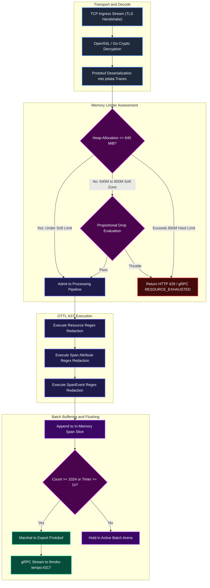

---

## 3. Ingestion Receiver Layer Deep-Dive (OTLP gRPC 4317 and HTTP 4318)

The receiver layer ingests telemetry across two primary transport protocols: binary gRPC over HTTP/2 and JSON/Protobuf over HTTP/1.1 or HTTP/2.

### 3.1 Receiver Configuration Block

```yaml
receivers:
  otlp:
    protocols:
      grpc:
        endpoint: 0.0.0.0:4317
        tls:
          cert_file: /etc/otel-collector/certs/server.pem
          key_file: /etc/otel-collector/certs/server-key.pem
      http:
        endpoint: 0.0.0.0:4318
        tls:
          cert_file: /etc/otel-collector/certs/server.pem
          key_file: /etc/otel-collector/certs/server-key.pem
        cors:
          allowed_origins:
            - "http://localhost:31400"
            - "http://localhost:3000"
            - "http://127.0.0.1:31400"
            - "http://127.0.0.1:3000"
            - "*"
          allowed_headers:
            - "*"
```

---

### 3.2 High-Level Design (HLD): Ingestion Protocols and Network Boundary

The receiver layer binds to all network interfaces (`0.0.0.0`) inside the container and is exposed via Traefik edge routing and direct Docker port bridges.

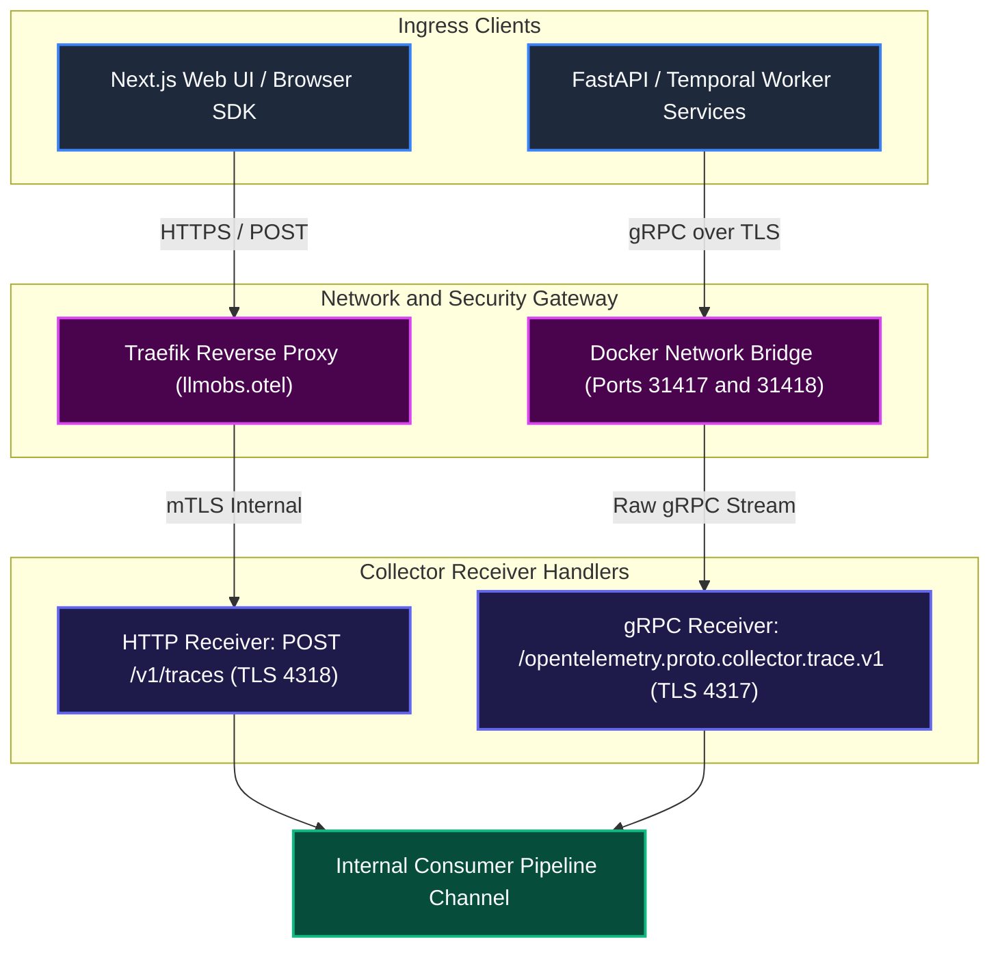

---

### 3.3 Low-Level Design (LLD): Protocol Parsing, TLS Handshake, and Ingress Concurrency

When an upstream client opens a connection, the Go TLS listener completes the cryptographic handshake, validates the ALPN protocol negotiation (h2 for gRPC, http/1.1 or h2 for HTTP), and allocates an active worker goroutine.

```mermaid
graph LR
    subgraph HandshakePhase ["TLS Handshake and Socket Initiation"]
        ClientHello["Client Hello (ALPN: h2, http/1.1)"] --> CertValidation["Server Certificate Presentation"]
        CertValidation --> SessionKey["ECDHE Ephemeral Key Exchange"]
        SessionKey --> EstablishedSocket["Encrypted TLS 1.3 Transport"]
    end

    subgraph StreamDemux ["Framing and Deserialization"]
        EstablishedSocket --> HTTP2Framer["HTTP/2 Frame Parser (Go x/net/http2)"]
        HTTP2Framer --> ContentTypeCheck{"Content-Type Header"}
        ContentTypeCheck -->|application/x-protobuf| ProtoFastPath["Binary Protobuf Fast Parser"]
        ContentTypeCheck -->|application/json| JSONSlowPath["JSON Reflection Unmarshaler"]
    end

    subgraph InternalAllocation ["pdata Memory Instantiation"]
        ProtoFastPath --> PdataGen["Create pdata.Traces (Zero-Copy Slices)"]
        JSONSlowPath --> PdataGen
        PdataGen --> ForwardNext["Dispatch to First Processor (memory_limiter)"]
    end

    style ClientHello fill:#1e293b,stroke:#3b82f6,stroke-width:2px,color:#f8fafc
    style CertValidation fill:#1e293b,stroke:#3b82f6,stroke-width:2px,color:#f8fafc
    style SessionKey fill:#1e293b,stroke:#3b82f6,stroke-width:2px,color:#f8fafc
    style EstablishedSocket fill:#064e3b,stroke:#10b981,stroke-width:2px,color:#f8fafc
    style HTTP2Framer fill:#1e1b4b,stroke:#6366f1,stroke-width:2px,color:#f8fafc
    style ContentTypeCheck fill:#4a044e,stroke:#d946ef,stroke-width:2px,color:#f8fafc
    style ProtoFastPath fill:#064e3b,stroke:#10b981,stroke-width:2px,color:#f8fafc
    style JSONSlowPath fill:#451a03,stroke:#f59e0b,stroke-width:2px,color:#f8fafc
    style PdataGen fill:#3b0764,stroke:#a855f7,stroke-width:2px,color:#f8fafc
    style ForwardNext fill:#064e3b,stroke:#10b981,stroke-width:2px,color:#f8fafc
```

---

### 3.4 Ingestion Receiver Parameter Reference Specifications

1. **Parameter**: `receivers.otlp.protocols.http.cors.allowed_origins`
   - **Definition**: Configures Cross-Origin Resource Sharing (CORS) access control headers (`Access-Control-Allow-Origin`) for web applications sending spans directly from browsers.
   - **Expected Values**: Strict domain lists: `["https://app.llmobs.com", "https://analytics.llmobs.com"]` | Development: Specific localhost ports and wildcard `*`.
   - **Currently Configured Value**: `["http://localhost:31400", "http://localhost:3000", "http://127.0.0.1:31400", "http://127.0.0.1:3000", "*"]`.
   - **Outcome / System Impact**: Allows browser-based single-page applications (Next.js client portals) to push user-interaction telemetry directly to the Collector without triggering browser CORS cross-origin blocks.
   - **Why and When to Configure It**: Essential for frontend LLM playground tracing where prompt completions are monitored in real time from browser environments.
   - **Scaling and Troubleshooting**: In production environments, replace wildcard `"*"` with specific domain FQDNs to prevent unauthorized third-party domains from injecting fabricated trace spans.

---

2. **Parameter**: `receivers.otlp.protocols.grpc.tls.cert_file` and `key_file`
   - **Definition**: Filesystem paths pointing to the X.509 server certificate and unencrypted private key utilized for mutual and server-authenticated TLS session negotiation.
   - **Expected Values**: Standard UNIX paths mounted in container: `/etc/otel-collector/certs/server.pem` and `/etc/otel-collector/certs/server-key.pem`.
   - **Currently Configured Value**: Certified files mounted read-only from host `./config/certs` via Docker Compose volume mount.
   - **Outcome / System Impact**: Guarantees that communication across the gRPC interface is protected with high-grade cryptography (AES-GCM or ChaCha20-Poly1305).
   - **Why and When to Configure It**: Protects API keys and user prompts in transit. Required by enterprise security standards.
   - **Scaling and Troubleshooting**: Verify certificate expiration using OpenSSL: `openssl x509 -in config/certs/server.pem -noout -dates`. Renew before expiration to prevent immediate pipeline disconnects.

---

## 4. Memory Limiter Processor Deep-Dive (Decision 3 Remediation)

The `memory_limiter` processor is the single most critical component ensuring container stability and host resilience. It bridges the gap between the Go runtime memory model and the Linux kernel cgroup enforcer.

### 4.1 Configuration and Mathematics Block

```yaml
# config/otel-collector/otel-collector-config.yaml
processors:
  memory_limiter:
    check_interval: 1s
    limit_mib: 800
    spike_limit_mib: 160
```

```yaml
# docker-compose.yml
    deploy:
      resources:
        limits:
          memory: 1024M
        reservations:
          memory: 256M
    environment:
      - GOMEMLIMIT=858993459
```

#### Mathematical Proof and Headroom Derivation:
```text
Total Container Memory Ceiling (Docker cgroup v2 memory.max):
  1024 MiB = 1,073,741,824 bytes

Go Runtime Memory Limit (GOMEMLIMIT):
  80% of 1024 MiB = 819.2 MiB = 858,993,459 bytes

Collector Application Hard Limit (limit_mib):
  800 MiB = 838,860,800 bytes (78.125% of cgroup ceiling)

Collector Application Soft Limit Threshold (limit_mib - spike_limit_mib):
  800 MiB - 160 MiB = 640 MiB (62.5% of cgroup ceiling)

Unallocated Safety Headroom (Reserved for Kernel Stacks, Netty buffers, Off-Heap Go runtime):
  1024 MiB - 800 MiB = 224 MiB (21.875% of container ceiling)
```

---

### 4.2 High-Level Design (HLD): Memory Threshold Gatekeeper Topology

The memory limiter evaluates allocated heap at recurring intervals, defining three operational operational zones: Normal Ingestion, Soft Backpressure Zone, and Hard Shedding.

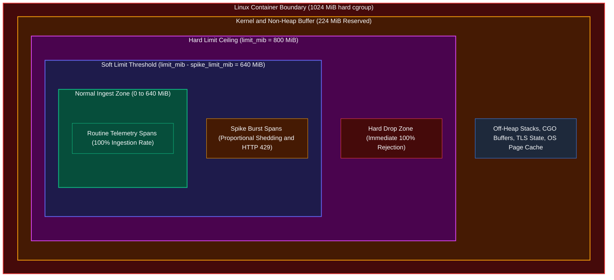

---

### 4.3 Low-Level Design (LLD): Go GC Pacing vs Collector Limiter Soft and Hard Drops

The dual mechanism of Go's runtime memory limiter (`GOMEMLIMIT`) and the Collector's application memory limiter (`memory_limiter`) creates a self-stabilizing feedback loop that prevents memory-related crashes.

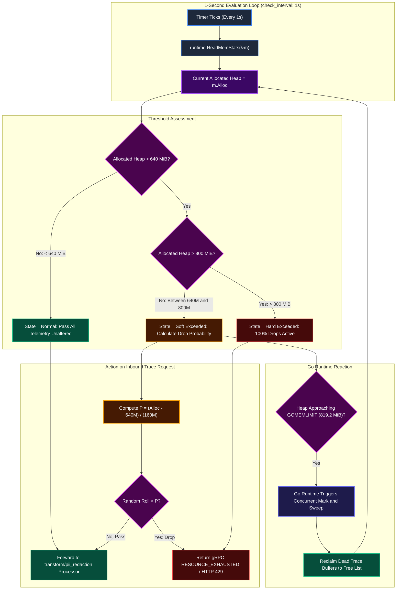

---

### 4.4 Why Decision 3 Fixes Legacy Architecture Instability

In the prior configuration before ADR-0011/ADR-0013, the following architectural flaws existed:

1. **The 33% Sizing Disconnect**: The container limit was configured at `1536M`, but `limit_mib` was hardcoded at `512` with `spike_limit_mib: 128`. The limiter activated soft shedding at `512 - 128 = 384 MiB` (25% of container RAM) and hard shedding at `512 MiB` (33% of container RAM). Upstream clients received HTTP 429 throttling while over 1 GB of container RAM sat unused.
2. **Unbounded Go GC Spikes**: Without `GOMEMLIMIT`, if a sudden traffic wave arrived between the 1-second check intervals, the Go runtime heap expanded past 1536 MiB before Go's standard GC cycle triggered, causing Docker to kill the container with `Exit 137`.
3. **Optimized Calibration**: Sizing the container at `1024M`, `limit_mib: 800`, `spike_limit_mib: 160`, and `GOMEMLIMIT=858993459` harmonizes all components:
   - Soft shedding begins at `640 MiB` (62.5%).
   - Hard shedding begins at `800 MiB` (78.1%).
   - Go GC enforces aggressive heap collection at `819.2 MiB` (80.0%).
   - A `224 MiB` safety margin shields against kernel OOM terminations.
   - Saves 512 MB of physical host RAM for Kafka and ClickHouse.

---

## 5. Batch Processor Deep-Dive

The batch processor aggregates incoming spans into larger batches, optimizing transport overhead and indexing efficiency in downstream systems like Grafana Tempo.

### 5.1 Batch Processor Configuration Block

```yaml
processors:
  batch:
    timeout: 1s
    send_batch_size: 1024
```

---

### 5.2 High-Level Design (HLD): Aggregation Topology

The batch processor operates after memory filtering and redaction, serving as the staging area before downstream export.

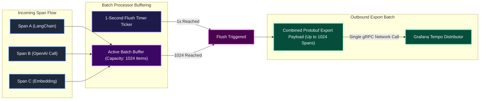

---

### 5.3 Low-Level Design (LLD): Timer Ticker vs Item Count Flush Mechanics

Internally, the batch processor runs a dedicated worker goroutine managing an in-memory slice of `pdata.Traces`.

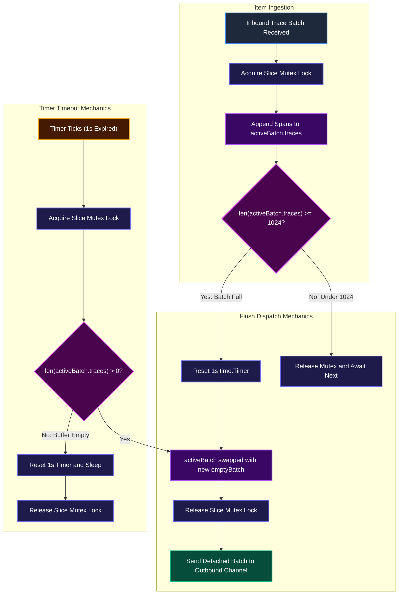

---

## 6. Transform and OTTL PII Redaction Processor Deep-Dive

The `transform` processor uses the OpenTelemetry Transformation Language (OTTL) to parse and redact sensitive credentials, tokens, and PII from trace resources, span attributes, and span events.

### 6.1 Redaction Statements Configuration Block

```yaml
processors:
  transform/pii_redaction:
    error_mode: ignore
    trace_statements:
      - context: resource
        statements:
          - replace_all_patterns(resource.attributes, "value", "sk-[a-zA-Z0-9_-]{20,}", "[REDACTED_API_KEY]")
          - replace_all_patterns(resource.attributes, "value", "AKIA[0-9A-Z]{16}", "[REDACTED_AWS_KEY]")
      - context: span
        statements:
          - replace_all_patterns(span.attributes, "value", "sk-[a-zA-Z0-9_-]{20,}", "[REDACTED_API_KEY]")
          - replace_all_patterns(span.attributes, "value", "AKIA[0-9A-Z]{16}", "[REDACTED_AWS_KEY]")
          - replace_all_patterns(span.attributes, "value", "eyJ[A-Za-z0-9-_=]+\\.[A-Za-z0-9-_=]+\\.[A-Za-z0-9-_=]*", "[REDACTED_JWT]")
          - replace_all_patterns(span.attributes, "value", "-----BEGIN [A-Z ]+KEY-----", "[REDACTED_PRIVATE_KEY]")
          - replace_all_patterns(span.attributes, "value", "Bearer\\s+[a-zA-Z0-9._\\-]+", "Bearer [REDACTED_TOKEN]")
          - replace_all_patterns(span.attributes, "value", "[a-zA-Z0-9._%+-]+@[a-zA-Z0-9.-]+\\.[a-zA-Z]{2,}", "[REDACTED_EMAIL]")
          - replace_all_patterns(span.attributes, "value", "\\b(?:4[0-9]{12}(?:[0-9]{3})?|5[1-5][0-9]{14}|3[47][0-9]{13})\\b", "[REDACTED_CARD]")
      - context: spanevent
        statements:
          - replace_all_patterns(spanevent.attributes, "value", "sk-[a-zA-Z0-9_-]{20,}", "[REDACTED_API_KEY]")
          - replace_all_patterns(spanevent.attributes, "value", "AKIA[0-9A-Z]{16}", "[REDACTED_AWS_KEY]")
          - replace_all_patterns(spanevent.attributes, "value", "eyJ[A-Za-z0-9-_=]+\\.[A-Za-z0-9-_=]+\\.[A-Za-z0-9-_=]*", "[REDACTED_JWT]")
```

---

### 6.2 High-Level Design (HLD): Sanitization Context Architecture

OTTL executes across three hierarchical contexts in OpenTelemetry trace schemas: `resource`, `span`, and `spanevent`.

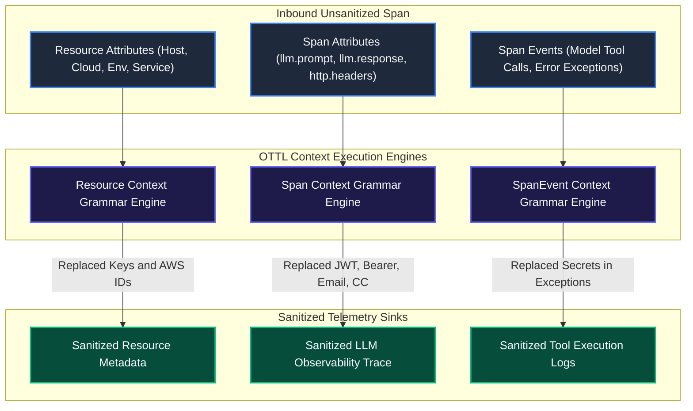

---

### 6.3 Low-Level Design (LLD): Regex Compilation and Abstract Syntax Tree Execution

The OTTL engine compiles regular expressions during Collector initialization, preventing regex compilation overhead on the request path.

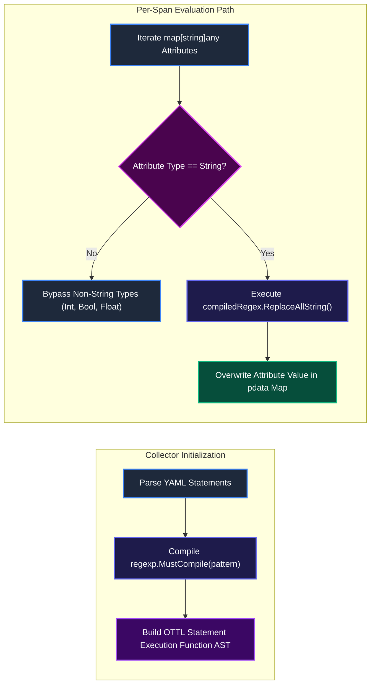

---

### 6.4 Sanitization Patterns Reference

1. **OpenAI / Anthropic API Key Pattern**:
   - Statement: `replace_all_patterns(..., "value", "sk-[a-zA-Z0-9_-]{20,}", "[REDACTED_API_KEY]")`
   - Purpose: Neutralizes leaked LLM provider credentials captured in LangChain metadata or HTTP authorization headers.
2. **AWS Access Key ID Pattern**:
   - Statement: `replace_all_patterns(..., "value", "AKIA[0-9A-Z]{16}", "[REDACTED_AWS_KEY]")`
   - Purpose: Redacts AWS credentials present in Bedrock or SageMaker model invocations.
3. **JSON Web Token (JWT) Pattern**:
   - Statement: `replace_all_patterns(..., "value", "eyJ[A-Za-z0-9-_=]+\\.[A-Za-z0-9-_=]+\\.[A-Za-z0-9-_=]*", "[REDACTED_JWT]")`
   - Purpose: Removes user identity claims, session cookies, and authentication headers.
4. **Credit Card Number (Luhn-Compliant Structural Formats)**:
   - Statement: `replace_all_patterns(..., "value", "\\b(?:4[0-9]{12}(?:[0-9]{3})?|5[1-5][0-9]{14}|3[47][0-9]{13})\\b", "[REDACTED_CARD]")`
   - Purpose: PCI-DSS compliance enforcement across customer prompts.

---

## 7. Attributes and Resource Processors Deep-Dive

The `attributes` and `resource` processors inject organizational and deployment metadata into telemetry before downstream storage.

### 7.1 Configuration Block

```yaml
processors:
  attributes:
    actions:
      - key: deployment.environment
        value: development
        action: upsert
      - key: service.namespace
        value: llmobs-platform
        action: upsert
      - key: network.transport
        value: tcp
        action: upsert
      - key: network.protocol.name
        value: otlp
        action: upsert

  resource:
    attributes:
      - key: infra.stack
        value: llm-obs-infra
        action: upsert
      - key: infra.network
        value: llmobs-network
        action: upsert
      - key: telemetry.sdk.language
        value: collector
        action: upsert
```

---

### 7.2 High-Level Design (HLD): Attribute Enrichment Pipeline

Telemetry entering from heterogeneous microservices often lacks standardized platform tags. The attributes processor ensures consistent indexing labels for Grafana Tempo queries.

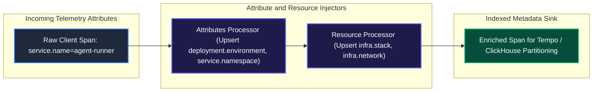

---

## 8. Exporter Layer and Downstream Routing Deep-Dive

The exporter layer transmits processed telemetry to downstream analytical stores and monitoring backends.

### 8.1 Exporters Configuration Block

```yaml
exporters:
  otlp/tempo:
    endpoint: "llmobs-tempo:4317"
    tls:
      insecure: true

  debug:
    verbosity: basic

service:
  pipelines:
    traces:
      receivers: [otlp]
      processors: [memory_limiter, transform/pii_redaction, batch]
      exporters: [otlp/tempo, debug]
```

---

### 8.2 High-Level Design (HLD): Export Topology and Multiplexing

The pipeline fans out processed spans to Grafana Tempo for persistent storage and the debug exporter for local terminal inspection.

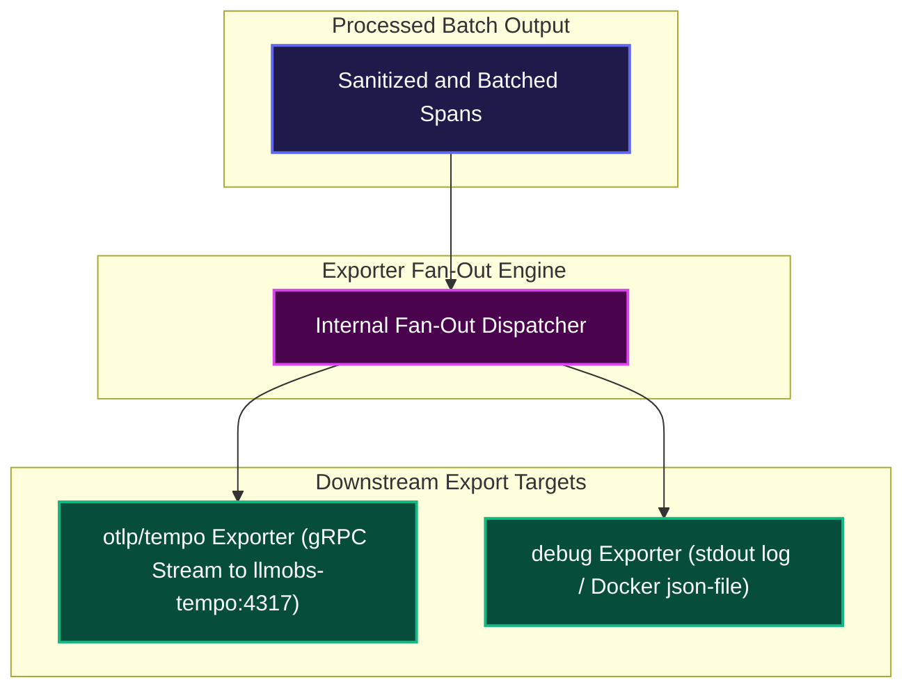

---

### 8.3 Low-Level Design (LLD): gRPC Streaming and Connection Lifecycle

The `otlp/tempo` exporter uses HTTP/2 multiplexed gRPC connections over the internal Docker network (`llmobs-network`), maintaining persistent channels with keepalive pings.

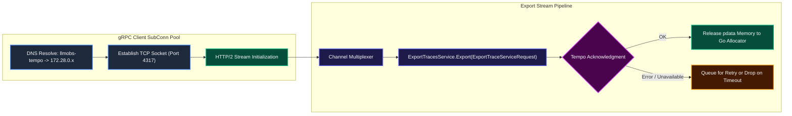

---

## 9. Queuing, Retries, and Backpressure Mechanics

When downstream storage encounters performance degradation or temporary network partitions, the Collector implements controlled buffering and backpressure to protect in-flight data.

### 9.1 Advanced Queuing Configuration Template

```yaml
exporters:
  otlp/tempo:
    endpoint: "llmobs-tempo:4317"
    tls:
      insecure: true
    sending_queue:
      enabled: true
      num_consumers: 4
      queue_size: 1000
    retry_on_failure:
      enabled: true
      initial_interval: 5s
      max_interval: 30s
      max_elapsed_time: 5m
```

---

### 9.2 High-Level Design (HLD): End-to-End Backpressure Cascade

Backpressure propagates upstream through the entire pipeline: when Tempo throttles writes, exporter buffers fill, halting batch dispatch, triggering the memory limiter, and causing upstream receivers to reject traffic with HTTP 429.

```mermaid
graph RL
    subgraph DownstreamStorage ["Storage Layer"]
        TempoEngine["Grafana Tempo Engine (Disk I/O Saturated)"]
    end

    subgraph ExporterQueue ["Exporter Buffer"]
        SendingQueue["Exporter Queue (queue_size: 1000) Full"]
    end

    subgraph PipelineStall ["Pipeline Buffer"]
        BatchStall["Batch Processor Buffers Retained"]
        MemGrow["Heap Allocation Surpasses 640M and 800M"]
    end

    subgraph IngressBackpressure ["Ingress Throttling"]
        LimiterBlock["Memory Limiter Hard Shedding"]
        HTTP429["Return HTTP 429 / RESOURCE_EXHAUSTED"]
        ClientBackoff["Client SDK Exponential Backoff and Local Spooling"]
    end

    TempoEngine -->|Slow Responses| SendingQueue
    SendingQueue -->|Queue Full: Block Exporter| BatchStall
    BatchStall -->|Memory Accumulation| MemGrow
    MemGrow -->|Trips Memory Gate| LimiterBlock
    LimiterBlock -->|Reject Incoming Requests| HTTP429
    HTTP429 -->|Propagate Upstream| ClientBackoff

    style TempoEngine fill:#450a0a,stroke:#ef4444,stroke-width:2px,color:#f8fafc
    style SendingQueue fill:#451a03,stroke:#f59e0b,stroke-width:2px,color:#f8fafc
    style BatchStall fill:#451a03,stroke:#f59e0b,stroke-width:2px,color:#f8fafc
    style MemGrow fill:#4a044e,stroke:#d946ef,stroke-width:2px,color:#f8fafc
    style LimiterBlock fill:#4a044e,stroke:#d946ef,stroke-width:2px,color:#f8fafc
    style HTTP429 fill:#450a0a,stroke:#ef4444,stroke-width:2px,color:#f8fafc
    style ClientBackoff fill:#1e293b,stroke:#3b82f6,stroke-width:2px,color:#f8fafc
```

---

## 10. Collector Health, Metrics, and Self-Observability

Operating the OpenTelemetry Collector in production requires real-time insight into its internal memory, throughput, and queue metrics.

### 10.1 Extensions and Telemetry Configuration Block

```yaml
extensions:
  health_check:
    endpoint: 0.0.0.0:13133
  zpages:
    endpoint: 0.0.0.0:55679

service:
  extensions: [health_check, zpages]
  telemetry:
    logs:
      level: info
    metrics:
      address: 0.0.0.0:8888
```

---

### 10.2 Key Internal Prometheus Metrics for Operational Monitoring

| Metric Name | Type | Description | Alert Threshold |
|---|---|---|---|
| `otelcol_process_runtime_heap_alloc_bytes` | Gauge | Current bytes of allocated heap memory | `> 800 * 1024 * 1024` (800 MiB) |
| `otelcol_processor_refused_spans` | Counter | Number of spans rejected by the memory limiter | Rate `> 0` for 2 consecutive minutes |
| `otelcol_processor_dropped_spans` | Counter | Number of spans dropped within pipelines | Rate `> 0` |
| `otelcol_receiver_refused_spans` | Counter | Spans rejected at receiver due to backpressure | Rate `> 10 / sec` |
| `otelcol_exporter_enqueue_failed_spans` | Counter | Spans dropped due to full export sending queue | Rate `> 0` |
| `otelcol_exporter_sent_spans` | Counter | Successfully transmitted spans to downstream targets | Baseline tracking |

---

## 11. Native Emergency CLI Runbooks and Incident Playbooks

This section outlines step-by-step diagnostic and remediation procedures for common production incidents.

### 11.1 Incident 1: Container OOM Kill (Exit 137) Diagnostics and Triage

- **Symptom**: Container restarts unexpectedly. `docker ps -a` reports `Exited (137)`.
- **Root Cause**: Memory allocation exceeded the 1024M Docker cgroup boundary, triggering the Linux kernel OOM killer.
- **Immediate Diagnostic Commands**:
  ```bash
  # Check container exit code and termination timestamp
  docker inspect llmobs-otel-collector --format='ExitCode: {{.State.ExitCode}}, OOMKilled: {{.State.OOMKilled}}'

  # Inspect kernel dmesg logs for OOM invocation
  dmesg -T | grep -i -E "oom[- ]killer|llmobs-otel" | tail -n 20

  # Check current real-time memory usage
  docker stats --no-stream llmobs-otel-collector
  ```
- **Remediation Steps**:
  1. Verify whether `GOMEMLIMIT=858993459` is present in container environment:
     ```bash
     docker exec llmobs-otel-collector env | grep GOMEMLIMIT
     ```
  2. If missing, update `docker-compose.yml` to include `GOMEMLIMIT=858993459` and redeploy.
  3. Verify `limit_mib` is set to `800` (not exceeding 80% of container limit):
     ```bash
     grep -A 4 "memory_limiter" config/otel-collector/otel-collector-config.yaml
     ```
  4. If trace volume legitimately exceeds single-container throughput, scale out using the multi-instance production profile (`docker-compose.prod.yml`).

---

### 11.2 Incident 2: Ingestion Backpressure and HTTP 429 Storms

- **Symptom**: Client SDKs report `HTTP 429 Too Many Requests` or gRPC `Status 14 RESOURCE_EXHAUSTED`.
- **Root Cause**: Collector memory exceeded `640 MiB` (`limit_mib - spike_limit_mib`), triggering the memory limiter's protective load shedding.
- **Immediate Diagnostic Commands**:
  ```bash
  # Check internal Prometheus refusal metrics
  curl -s http://localhost:8888/metrics | grep -E "otelcol_processor_refused|otelcol_processor_dropped"

  # Inspect Collector logs for limiter warnings
  docker logs --tail 100 llmobs-otel-collector | grep -i "memory_limiter"
  ```
- **Remediation Steps**:
  1. Check downstream Tempo health: if Tempo is slow or unreachable, spans buffer in the Collector until memory limits are hit.
  2. Temporarily increase batch send frequency by reducing `send_batch_size` to `512` and `timeout` to `500ms` to flush buffered items faster.
  3. Restart the container to clear fragmented heap if Go runtime memory retention is elevated:
     ```bash
     docker compose restart llmobs-otel-collector
     ```

---

### 11.3 Incident 3: Downstream Tempo Outage and Connection Failure

- **Symptom**: Collector logs report `connection refused` or `context deadline exceeded` when exporting to `llmobs-tempo:4317`.
- **Root Cause**: Grafana Tempo container is stopped, crashing, or experiencing disk volume write stalls.
- **Immediate Diagnostic Commands**:
  ```bash
  # Check Tempo container state
  docker ps -f name=llmobs-tempo

  # Test gRPC connectivity from inside the Collector container
  docker exec -it llmobs-otel-collector nc -zv llmobs-tempo 4317
  ```
- **Remediation Steps**:
  1. Restart Tempo and verify volume write permissions:
     ```bash
     docker compose restart llmobs-tempo
     docker logs --tail 50 llmobs-tempo
     ```
  2. If Tempo requires an extended maintenance window, update `otel-collector-config.yaml` to temporarily disable the `otlp/tempo` exporter or route spans to the `debug` exporter to prevent container memory exhaustion.

---

### 11.4 Incident 4: TLS Certificate Expiry and Mutual Authentication Failures

- **Symptom**: Upstream SDK clients report `tls: bad certificate` or `x509: certificate has expired`.
- **Root Cause**: Certificates in `config/certs/` have passed their validity expiration date.
- **Immediate Diagnostic Commands**:
  ```bash
  # Inspect certificate expiration date
  openssl x509 -in config/certs/server.pem -noout -enddate -subject

  # Test local TLS handshake over OTLP port
  openssl s_client -connect localhost:31417 -servername llmobs.otel < /dev/null
  ```
- **Remediation Steps**:
  1. Regenerate server certificates using the platform certificate generation script.
  2. Reload certificates in the running Collector:
     ```bash
     docker compose restart llmobs-otel-collector
     ```

---

## 12. Multi-Instance High-Availability and Production Scale-Out Architecture

Under high-throughput production workloads exceeding 5,000 spans per second, a single Collector instance may saturate its allocated CPU core or memory ceiling. The platform provides a production override (`docker-compose.prod.yml`) that scales the Collector horizontally behind Traefik.

### 12.1 Production High-Availability Override Topology

```yaml
# docker-compose.prod.yml (OTel Collector Override)
services:
  llmobs-otel-collector:
    deploy:
      replicas: 2
      resources:
        limits:
          memory: 2048M
        reservations:
          memory: 512M
    environment:
      - GOMEMLIMIT=1717986918  # 80% of 2048 MiB in bytes
```

When operating with 2048M container ceilings, the memory limiter must be calibrated accordingly:
- `limit_mib: 1600` (80% of 2048 MiB)
- `spike_limit_mib: 320` (20% of 1600 MiB)
- Soft backpressure triggers at `1280 MiB` (`1600 - 320`)

---

### 12.2 High-Availability Load-Balanced Deployment Topology

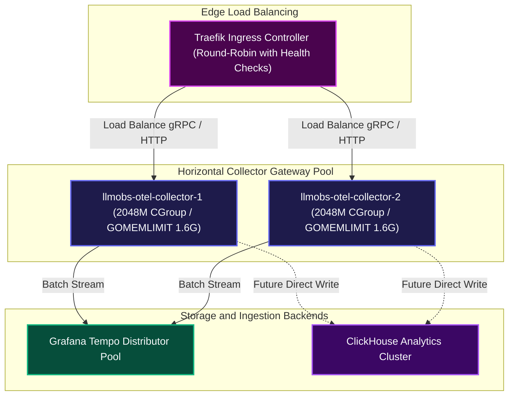

---

## 13. Verification and Operational Runbook

To confirm that the OpenTelemetry Collector is operating with correct memory boundaries and healthy pipeline stages, execute the following verification commands:

```bash
# 1. Verify container runtime memory limit and GOMEMLIMIT environment variable
docker inspect llmobs-otel-collector --format='Memory Limit: {{.HostConfig.Memory}} bytes, GOMEMLIMIT: {{range .Config.Env}}{{println .}}{{end}}' | grep -E "Memory Limit|GOMEMLIMIT"

# 2. Check live memory utilization against configured limits
docker stats --no-stream llmobs-otel-collector

# 3. Test OTLP HTTP receiver availability over TLS
curl -k -v https://localhost:31417/v1/traces -H "Content-Type: application/json" -d '{"resourceSpans":[]}'

# 4. Verify memory limiter initialization in container startup logs
docker logs llmobs-otel-collector 2>&1 | grep -i -E "memory_limiter|running"
```
