# OpenTelemetry Collector Comprehensive Architecture, Component Deep-Dive and Operational Guide

> **Validated against OpenTelemetry Collector Contrib `v0.100.0+`** (`otel/opentelemetry-collector-contrib:latest`), running under the production `1024M` cgroup with Go runtime heap pacing (`GOMEMLIMIT=858993459`).
>
> Architecture Decision Record: [`docs/architectureDoc/adr-0013-otel-collector-configuration.md`](file:///home/btpl-lap-22/live/llm-obs-infra/docs/architectureDoc/adr-0013-otel-collector-configuration.md)
>
> Companion System Optimization: [`docs/architectureDoc/adr-0011-infrastructure-resource-optimization.md`](file:///home/btpl-lap-22/live/llm-obs-infra/docs/architectureDoc/adr-0011-infrastructure-resource-optimization.md)

---

## 0. How to Read the Diagrams

Every diagram in this guide uses one consistent color language to enable tracing execution paths and state transitions by color alone. Diagrams avoid HTML line breaks, undirected links, pipe characters inside node labels, and raw ampersands to ensure clean rendering across GitHub and GitLab Mermaid runtimes. All subgraphs are declared as flat sibling blocks to prevent layout engine calculation errors.

| Color | Meaning | Used For |
|---|---|---|
| **Slate / Blue (`#1e293b`, `#3b82f6`)** | Input or Ingestion | Client traces, HTTP/gRPC requests, incoming telemetry, TLS handshakes |
| **Indigo (`#1e1b4b`, `#6366f1`)** | Core Pipeline Processing | Batching, OTTL PII redaction, attribute enrichment, AST transformation |
| **Purple (`#3b0764`, `#a855f7`)** | Memory and Buffers | In-memory queues, Go heap arenas, mcache/mcentral, GC pacing boundaries |
| **Magenta (`#4a044e`, `#d946ef`)** | Decision Gates | Memory limiter checks, backpressure triggers, soft/hard capacity drops |
| **Green (`#064e3b`, `#10b981`)** | Safe / Successful Path | Healthy routing, successful Tempo export, bounded memory execution |
| **Amber (`#451a03`, `#f59e0b`)** | Warning / Degraded State | Soft limiter drops (429 / ResourceExhausted), queue retries, cache misses |
| **Red (`#450a0a`, `#ef4444`)** | Critical Failure | Linux OOM Killer (Exit 137), downstream connection refusal, TLS failure |

---

## 1. Executive Master Parameter Reference Specifications

This section provides an exhaustive, unified reference for every OpenTelemetry Collector parameter configured across the platform infrastructure. To support operational clarity and systematic troubleshooting, parameters are formatted as structured specifications rather than abbreviated tables.

### 1.1 Master Parameter Specifications and Expected Values List

1. **Parameter**: `deploy.resources.limits.memory` and `deploy.resources.reservations.memory`
   - **Definition**: Establishes the hard Linux kernel control group (cgroup v2 `memory.max`) enforcement boundary around the OpenTelemetry Collector container, along with the Docker engine minimum memory reservation (`memory.min` / `memory.low`).
   - **Expected Values**: Development / Single-Node: `1024M` limit, `256M` reservation | High-Throughput Production: `2048M` limit, `512M` reservation | Enterprise Multi-Tenant Gateway: `4096M`+ limit, `1024M` reservation.
   - **Currently Configured Value**: Limit: `1024M` (1,073,741,824 bytes), Reservation: `256M` (268,435,456 bytes) in `docker-compose.yml`.
   - **Outcome / System Impact**: Prevents a burst of uncompressed telemetry traces from consuming unbounded host memory and triggering the Linux Out-Of-Memory (OOM) Killer against co-resident database systems (Kafka, ClickHouse, AlloyDB) on the 15 GB shared host.
   - **Why and When to Configure It**: The unconstrained default allows the container process to expand memory allocation until the host exhausts physical RAM and swap space. Setting `1024M` bounds the Collector footprint while providing sufficient ceiling for Go runtime heap, execution stacks, and in-flight batches.
   - **Scaling and Troubleshooting**: All internal Collector memory thresholds (`limit_mib`, `spike_limit_mib`, `GOMEMLIMIT`) are mathematically derived from this container limit. If this value is changed, internal limits must be recalculated. Monitored via `docker stats llmobs-otel-collector` or kernel telemetry `dmesg -T | grep -i oom`. Exit code 137 indicates the container breached this ceiling.

---

2. **Parameter**: `GOMEMLIMIT`
   - **Definition**: Configures the Go runtime memory limit (introduced in Go 1.19), instructing the Go Garbage Collector (GC) to run aggressively when total memory allocation approaches the target ceiling, preventing heap-driven container terminations.
   - **Expected Values**: Set to 80% to 85% of the cgroup memory limit in bytes. For a `1024M` container: `858993459` bytes (819.2 MiB) | For a `2048M` container: `1717986918` bytes (1638.4 MiB).
   - **Currently Configured Value**: `858993459` (80% of 1024 MiB in bytes) passed as a container environment variable in `docker-compose.yml`.
   - **Outcome / System Impact**: Eliminates uncoordinated Go heap expansion. Without `GOMEMLIMIT`, Go garbage collection operates purely based on `GOGC=100` (doubling heap size between GC cycles), which frequently overshoots the Docker cgroup limit during traffic spikes, causing abrupt `Exit 137` crashes.
   - **Why and When to Configure It**: Crucial for containerized Go applications. While the Collector's internal `memory_limiter` processor manages application-level telemetry shedding, `GOMEMLIMIT` manages runtime-level memory allocation, thread stacks, and runtime metadata.
   - **Scaling and Troubleshooting**: If the Collector encounters continuous CPU throttling due to excessive GC cycles ("GC thrashing"), verify whether ingestion throughput exceeds container capacity. Observe Go runtime GC activity through internal Prometheus metrics `otelcol_process_runtime_heap_alloc_bytes` and `otelcol_process_runtime_total_sys_memory_bytes`.

---

3. **Parameter**: `OTEL_SERVICE_NAME`
   - **Definition**: Sets the canonical service identity for self-telemetry generated by the OpenTelemetry Collector daemon when sending its own metrics and operational traces.
   - **Expected Values**: Descriptive string identifying the collector instance, such as `llmobs-otel-collector`, `llmobs-telemetry-gateway`, or `otel-agent-node-01`.
   - **Currently Configured Value**: `llmobs-otel-collector` in `docker-compose.yml`.
   - **Outcome / System Impact**: Automatically labels all Prometheus metrics and internal telemetry exported from the container, allowing dashboards in Grafana to differentiate between host-level infrastructure metrics and application-level metrics.
   - **Why and When to Configure It**: Mandated by the OpenTelemetry Semantic Conventions. Without an explicit service name, the runtime defaults to `unknown_service:otelcol`, breaking multi-collector correlation in monitoring dashboards.
   - **Scaling and Troubleshooting**: Verified by inspecting Prometheus scrape targets at `http://localhost:8888/metrics`. Filter by label `{service_name="llmobs-otel-collector"}`.

---

4. **Parameter**: `image`
   - **Definition**: Identifies the specific container image distribution and tag used to run the OpenTelemetry Collector daemon.
   - **Expected Values**: Standard Core: `otel/opentelemetry-collector:latest` | Contrib Distribution: `otel/opentelemetry-collector-contrib:latest` or pinned tag `otel/opentelemetry-collector-contrib:0.108.0`.
   - **Currently Configured Value**: `otel/opentelemetry-collector-contrib:latest` in `docker-compose.yml`.
   - **Outcome / System Impact**: Provides access to advanced ecosystem processors including the OpenTelemetry Transformation Language (`transform` processor with OTTL), ClickHouse exporter, Kafka exporter, and authentication extensions not included in the minimal core binary.
   - **Why and When to Configure It**: In-flight PII redaction and advanced regex pattern substitution require the OTTL engine, which is exclusively distributed in the `contrib` image.
   - **Scaling and Troubleshooting**: Pin specific semantic tags (e.g. `0.108.0`) in production environments to avoid unexpected breaking schema changes in OTTL grammar or configuration syntax during automated Docker pulls.

---

5. **Parameter**: `command`
   - **Definition**: The entrypoint command-line arguments passed to the Collector binary inside the container on startup.
   - **Expected Values**: `["--config=/etc/otel-collector-config.yaml"]` or multiple configs `["--config=/etc/base.yaml", "--config=/etc/override.yaml"]`.
   - **Currently Configured Value**: `["--config=/etc/otel-collector-config.yaml"]` in `docker-compose.yml`.
   - **Outcome / System Impact**: Explicitly directs the collector process to load configuration directives from the mounted YAML specification.
   - **Why and When to Configure It**: Prevents the collector from loading default empty configurations or falling back to `/etc/otelcol-contrib/config.yaml`.
   - **Scaling and Troubleshooting**: If the container exits immediately with code 1, check logs using `docker logs llmobs-otel-collector` for YAML syntax errors or unrecognized component names.

---

6. **Parameter**: `volumes` (Config and Certificate Mounts)
   - **Definition**: Bind mounts mapping host configuration files and cryptographic TLS certificates into the container's virtual filesystem.
   - **Expected Values**: Read-only mounts: `./config/otel-collector/otel-collector-config.yaml:/etc/otel-collector-config.yaml:ro` and `./config/certs:/etc/otel-collector/certs:ro`.
   - **Currently Configured Value**: Both config and certs mounted with `:ro` (read-only) enforcement in `docker-compose.yml`.
   - **Outcome / System Impact**: Enforces least-privilege security. The container process cannot tamper with or overwrite configuration files or TLS private keys on the host filesystem.
   - **Why and When to Configure It**: Required for dynamic configuration reloading and secure communication over HTTPS and gRPC.
   - **Scaling and Troubleshooting**: If the container reports `permission denied` or `no such file or directory`, verify host file permissions (`chmod 644 config/certs/*.pem`) and path existence.

---

7. **Parameter**: `ports` (Host Ingress Port Bindings)
   - **Definition**: Maps external host TCP ports to internal container ports for OTLP HTTP and gRPC ingestion endpoints.
   - **Expected Values**: Direct standard mapping (`4317:4317`, `4318:4318`) or isolated host port ranges (`31417:4318`, `31418:4317`).
   - **Currently Configured Value**: `${PORT_OTEL_HTTP:-31417}:4318` and `${PORT_OTEL_GRPC:-31418}:4317` in `docker-compose.yml`.
   - **Outcome / System Impact**: Enables external microservices, SDK clients, and testing scripts to push traces without conflicting with local development applications running on default 4317/4318 ports.
   - **Why and When to Configure It**: Port isolation is vital on shared development and testing hosts where multiple stacks may run concurrently.
   - **Scaling and Troubleshooting**: Test port availability from host using `nc -zv localhost 31417` and `nc -zv localhost 31418`.

---

8. **Parameter**: `restart` and `logging`
   - **Definition**: Controls the Docker engine container restart policy and standard output/error log rotation parameters.
   - **Expected Values**: Restart: `unless-stopped` | Logging: `driver: "json-file"`, `max-size: "10m"`, `max-file: "3"`.
   - **Currently Configured Value**: `restart: unless-stopped` with YAML anchor reference `logging: *default-logging` (max 10m, 3 files) in `docker-compose.yml`.
   - **Outcome / System Impact**: Guarantees automatic service recovery across host reboots or daemon crashes while bounding stdout log disk usage to a maximum of 30 MB.
   - **Why and When to Configure It**: Unbounded container logs can silently consume available disk space on the root partition, eventually halting Docker and co-resident databases.
   - **Scaling and Troubleshooting**: Inspect active container log size via `ls -lh /var/lib/docker/containers/<container_id>/*-json.log`.

---

9. **Parameter**: `networks` (`llmobs-network`)
   - **Definition**: Attaches the container to the platform's private user-defined bridge network, providing isolated DNS resolution between stack services.
   - **Expected Values**: Custom bridge network name: `llmobs-network`.
   - **Currently Configured Value**: `llmobs-network` in `docker-compose.yml`.
   - **Outcome / System Impact**: Allows the Collector to resolve downstream services by container name (e.g. `llmobs-tempo:4317`, `llmobs-clickhouse:8123`) without exposing backend databases to public networks.
   - **Why and When to Configure It**: Zero-trust network segmentation. Telemetry export traffic never traverses untrusted host networks or the public internet.
   - **Scaling and Troubleshooting**: Verify DNS resolution from inside the container using `docker exec -it llmobs-otel-collector getent hosts llmobs-tempo`.

---

10. **Parameter**: `traefik.enable` and Ingress Router Labels
    - **Definition**: Metadata labels evaluated by the Traefik reverse proxy to dynamically configure HTTPS edge routing, TLS termination, and ingress middlewares.
    - **Expected Values**: Rule: `Host("llmobs.otel") || Host("otel.llmobs.local")`, Entrypoint: `websecure`, TLS: `true`, Middlewares: `security-headers`, `rate-limit-ingest`, `payload-limit`.
    - **Currently Configured Value**: Fully configured in `docker-compose.yml` with port 4318 target and HTTPS backend scheme.
    - **Outcome / System Impact**: Protects the collector HTTP receiver with rate limiting (preventing DoS flooding) and body size caps (preventing memory exhaustion via multi-gigabyte POST payloads).
    - **Why and When to Configure It**: Production security requirement. Edge proxies must intercept abusive traffic before it enters the telemetry processing pipeline.
    - **Scaling and Troubleshooting**: Check Traefik routing dashboard at `http://localhost:8080` or execute `curl -k https://llmobs.otel/v1/traces`.

---

11. **Parameter**: `receivers.otlp.protocols.grpc.endpoint`
    - **Definition**: The internal TCP network interface and port binding for binary OTLP gRPC streaming ingestion.
    - **Expected Values**: `0.0.0.0:4317` (listen on all interfaces) or `127.0.0.1:4317` (loopback only).
    - **Currently Configured Value**: `0.0.0.0:4317` in `config/otel-collector/otel-collector-config.yaml`.
    - **Outcome / System Impact**: Accepts high-performance, multiplexed HTTP/2 binary protobuf trace streams from backend agents and language SDKs (Python, Go, Node.js).
    - **Why and When to Configure It**: gRPC is the primary protocol for distributed tracing due to lower CPU serialization overhead compared to HTTP/JSON.
    - **Scaling and Troubleshooting**: Verify via `grpcurl -insecure localhost:31418 list`.

---

12. **Parameter**: `receivers.otlp.protocols.grpc.tls.cert_file` and `key_file`
    - **Definition**: The cryptographic certificate and private key files loaded by the gRPC listener to encrypt in-flight telemetry.
    - **Expected Values**: `/etc/otel-collector/certs/server.pem` and `/etc/otel-collector/certs/server-key.pem`.
    - **Currently Configured Value**: Configured with standard paths mounted from `./config/certs` in `config/otel-collector/otel-collector-config.yaml`.
    - **Outcome / System Impact**: Guarantees TLS 1.3 encryption across all gRPC communication, preventing eavesdropping on trace payloads containing prompt texts or internal IP addresses.
    - **Why and When to Configure It**: Mandatory for enterprise security and HIPAA/SOC2 compliance across internal network topologies.
    - **Scaling and Troubleshooting**: Test with `openssl s_client -connect localhost:31418`.

---

13. **Parameter**: `receivers.otlp.protocols.http.endpoint`
    - **Definition**: The internal TCP interface and port binding for OTLP HTTP ingestion over HTTP/1.1 and HTTP/2.
    - **Expected Values**: `0.0.0.0:4318`.
    - **Currently Configured Value**: `0.0.0.0:4318` in `config/otel-collector/otel-collector-config.yaml`.
    - **Outcome / System Impact**: Serves RESTful endpoints (`/v1/traces`, `/v1/metrics`, `/v1/logs`) supporting both Protobuf and JSON payloads.
    - **Why and When to Configure It**: Essential for frontend browser clients, serverless functions, or environments where gRPC is blocked by middleboxes or enterprise firewalls.
    - **Scaling and Troubleshooting**: Send test span via `curl -k -X POST https://localhost:31417/v1/traces -H "Content-Type: application/json" -d '{"resourceSpans":[]}'`.

---

14. **Parameter**: `receivers.otlp.protocols.http.tls.cert_file` and `key_file`
    - **Definition**: Certificate and key paths enabling HTTPS on the OTLP HTTP receiver interface.
    - **Expected Values**: Valid X.509 PEM certificate and key paths.
    - **Currently Configured Value**: `/etc/otel-collector/certs/server.pem` and `/etc/otel-collector/certs/server-key.pem`.
    - **Outcome / System Impact**: Encrypts browser and client REST payloads traversing network hops.
    - **Why and When to Configure It**: Prevents plain-text transmission of telemetry across container bridges.
    - **Scaling and Troubleshooting**: Inspect certificate dates with `openssl x509 -in config/certs/server.pem -noout -enddate`.

---

15. **Parameter**: `receivers.otlp.protocols.http.cors.allowed_origins` and `allowed_headers`
    - **Definition**: Configures Cross-Origin Resource Sharing (CORS) HTTP headers returned by the collector to permit browser web applications to send traces directly.
    - **Expected Values**: Specific origin list: `["http://localhost:3000", "https://app.llmobs.com"]` | Development wildcard: `["*"]`.
    - **Currently Configured Value**: `["http://localhost:31400", "http://localhost:3000", "http://127.0.0.1:31400", "http://127.0.0.1:3000", "*"]` and headers `["*"]`.
    - **Outcome / System Impact**: Allows web portals and frontend LLM playground applications to send OpenTelemetry spans directly without browser CORS rejection.
    - **Why and When to Configure It**: Required when tracing user interactions and LLM token streaming in browser clients.
    - **Scaling and Troubleshooting**: In production, remove `"*"` to prevent unauthorized websites from polluting trace data.

---

16. **Parameter**: `processors.memory_limiter.check_interval`
    - **Definition**: The time period between consecutive memory inspections performed by the `memory_limiter` processor against the Go runtime memory allocator.
    - **Expected Values**: `250ms` (high burst) | `500ms` (standard production) | `1s` (development / standard throughput).
    - **Currently Configured Value**: `1s` in `config/otel-collector/otel-collector-config.yaml`.
    - **Outcome / System Impact**: Balances CPU inspection overhead with responsiveness. Every check executes `runtime.ReadMemStats` which requires a brief Go runtime lock.
    - **Why and When to Configure It**: Shorter intervals detect sudden spikes faster but consume more CPU cycles. A 1-second interval provides reliable protection for standard ingestion loads.
    - **Scaling and Troubleshooting**: If high-volume traffic bursts trigger OOM kills between checks, reduce to `500ms` or `250ms`.

---

17. **Parameter**: `processors.memory_limiter.limit_mib`
    - **Definition**: The hard memory ceiling at which the `memory_limiter` processor rejects 100% of incoming trace spans, returning retryable backpressure errors (HTTP 429, gRPC ResourceExhausted).
    - **Expected Values**: 75% to 80% of container memory limit. For `1024M`: `800` MiB | For `2048M`: `1600` MiB.
    - **Currently Configured Value**: `800` (800 MiB) in `config/otel-collector/otel-collector-config.yaml`.
    - **Outcome / System Impact**: Serves as the primary application-level defense preventing container memory from reaching the 1024M Docker cgroup boundary, preserving 224 MiB of safety headroom.
    - **Why and When to Configure It**: Prevents unrecoverable kernel OOM terminations. Upstream clients receive standard backpressure signals and back off gracefully.
    - **Scaling and Troubleshooting**: Monitored via Prometheus metric `otelcol_processor_refused_spans`.

---

18. **Parameter**: `processors.memory_limiter.spike_limit_mib`
    - **Definition**: The soft buffer threshold below `limit_mib`. When memory allocation exceeds `limit_mib - spike_limit_mib`, the processor drops incoming data proportionally.
    - **Expected Values**: 15% to 20% of `limit_mib`. For `800 MiB`: `160` MiB (soft limit activates at 640 MiB) | For `1600 MiB`: `320` MiB.
    - **Currently Configured Value**: `160` (160 MiB) in `config/otel-collector/otel-collector-config.yaml`.
    - **Outcome / System Impact**: Creates an elastic backpressure zone between 640 MiB and 800 MiB, absorbing short-lived telemetry surges without causing abrupt total pipeline lockups.
    - **Why and When to Configure It**: Provides the Go garbage collector with time to reclaim dead span buffers before hard limits are hit.
    - **Scaling and Troubleshooting**: If client SDKs report intermittent HTTP 429 errors during moderate load, verify whether `spike_limit_mib` is overly restrictive.

---

19. **Parameter**: `processors.transform/pii_redaction.error_mode`
    - **Definition**: Defines how the OTTL transformation processor handles parsing errors, missing attributes, or invalid regular expressions during span evaluation.
    - **Expected Values**: `ignore` (skip failing statement and continue) | `silent` (suppress logging) | `propagate` (halt pipeline and drop batch).
    - **Currently Configured Value**: `ignore` in `config/otel-collector/otel-collector-config.yaml`.
    - **Outcome / System Impact**: Guarantees pipeline continuity. Malformed attributes or non-string values will not interrupt telemetry processing for the rest of the batch.
    - **Why and When to Configure It**: Required for resilience in production where diverse microservices may send non-standard span attributes.
    - **Scaling and Troubleshooting**: In testing environments, temporarily set to `propagate` to validate that all regex statements execute cleanly against test traces.

---

20. **Parameter**: `processors.transform/pii_redaction.trace_statements` (Resource Context)
    - **Definition**: OTTL statements targeting metadata attached to the telemetry `resource` (e.g. host properties, cloud provider metadata, process attributes).
    - **Expected Values**: Targeted regex redactions replacing leaked API keys or cloud tokens.
    - **Currently Configured Value**: Redacts `sk-[a-zA-Z0-9_-]{20,}` (OpenAI keys) and `AKIA[0-9A-Z]{16}` (AWS access keys) in resource attributes.
    - **Outcome / System Impact**: Prevents infrastructure keys from being indexed in permanent storage.
    - **Why and When to Configure It**: Resource attributes are indexed globally across traces; leaking keys into resource tags compromises broad security posture.
    - **Scaling and Troubleshooting**: Tested using the debug exporter to verify replaced strings show `[REDACTED_API_KEY]`.

---

21. **Parameter**: `processors.transform/pii_redaction.trace_statements` (Span Context)
    - **Definition**: OTTL statements targeting attributes directly attached to individual trace spans (e.g. `llm.prompts`, `llm.completions`, `http.headers`).
    - **Expected Values**: Regex replacements for API keys, AWS credentials, JWT tokens, private keys, bearer tokens, emails, and credit card numbers.
    - **Currently Configured Value**: Seven distinct regex patterns masking secrets with explicit replacement tokens (e.g. `[REDACTED_JWT]`, `[REDACTED_CARD]`).
    - **Outcome / System Impact**: Enforces compliance with GDPR, HIPAA, and PCI-DSS by stripping personal data and credentials before storage in Grafana Tempo.
    - **Why and When to Configure It**: Essential in LLM observability platforms where end-user prompt texts frequently contain sensitive user inputs.
    - **Scaling and Troubleshooting**: Ensure regular expressions are properly anchored to minimize CPU processing time per span.

---

22. **Parameter**: `processors.transform/pii_redaction.trace_statements` (SpanEvent Context)
    - **Definition**: OTTL statements targeting attributes attached to span events (point-in-time log events, model tool calls, exception stack traces).
    - **Expected Values**: Redactions targeting API keys and authentication tokens in error logs and model function arguments.
    - **Currently Configured Value**: Statements masking API keys, AWS keys, and JWT tokens within span event dictionaries.
    - **Outcome / System Impact**: Prevents sensitive credentials printed in Python/Node.js stack traces or function arguments from persisting in trace timelines.
    - **Why and When to Configure It**: LLM agent frameworks often capture entire tool execution arguments in span events, which may include database passwords or API keys.
    - **Scaling and Troubleshooting**: Inspect trace events in Grafana Tempo to confirm redaction tokens appear in place of raw secrets.

---

23. **Parameter**: `processors.attributes.actions` (Upserting Platform Attributes)
    - **Definition**: Declarative operations that insert or overwrite standardized metadata attributes on every incoming span.
    - **Expected Values**: `action: upsert`, `action: insert`, `action: update`, `action: delete`.
    - **Currently Configured Value**: Upserts `deployment.environment: development`, `service.namespace: llmobs-platform`, `network.transport: tcp`, and `network.protocol.name: otlp`.
    - **Outcome / System Impact**: Ensures consistent querying, filtering, and aggregation in Grafana dashboards regardless of which client SDK sent the data.
    - **Why and When to Configure It**: Centralizes metadata enrichment at the collector rather than requiring every client service to maintain identical environment configurations.
    - **Scaling and Troubleshooting**: Verify attributes appear in Tempo search filters under `deployment.environment`.

---

24. **Parameter**: `processors.resource.attributes` (Standardizing Resource Metadata)
    - **Definition**: Injects global platform and network attributes into the trace resource descriptor.
    - **Expected Values**: Key-value attribute pairs defining stack name, network zone, and collector language.
    - **Currently Configured Value**: Upserts `infra.stack: llm-obs-infra`, `infra.network: llmobs-network`, and `telemetry.sdk.language: collector`.
    - **Outcome / System Impact**: Identifies the infrastructure stack and network topology directly within trace metadata.
    - **Why and When to Configure It**: Crucial for multi-stack environments where traces traverse development, staging, and production clusters.
    - **Scaling and Troubleshooting**: Confirm resource attributes are indexed by Grafana Tempo distributor.

---

25. **Parameter**: `processors.batch.timeout`
    - **Definition**: The maximum duration to hold spans in memory before forcing a flush to downstream exporters, even if `send_batch_size` has not been reached.
    - **Expected Values**: Interactive Development: `500ms` to `1s` | High-Throughput Production: `1s` to `5s` | Batch Archival: `10s`.
    - **Currently Configured Value**: `1s` in `config/otel-collector/otel-collector-config.yaml`.
    - **Outcome / System Impact**: Guarantees low latency for trace visualization. Even under low request rates, spans become visible in Tempo within 1 second.
    - **Why and When to Configure It**: Prevents traces from languishing indefinitely in collector memory during periods of minimal traffic.
    - **Scaling and Troubleshooting**: If traces appear delayed during local testing, verify that `timeout` is not set to a high value.

---

26. **Parameter**: `processors.batch.send_batch_size`
    - **Definition**: The target number of spans collected into an in-memory batch before immediately triggering a flush to downstream exporters.
    - **Expected Values**: `512` to `1024` (lightweight / dev) | `4096` to `8192` (production) | `16384` (high-throughput ingest).
    - **Currently Configured Value**: `1024` in `config/otel-collector/otel-collector-config.yaml`.
    - **Outcome / System Impact**: Drastically reduces network serialization and connection overhead by combining multiple individual spans into larger payloads.
    - **Why and When to Configure It**: Optimizes gRPC transport efficiency and aligns with Tempo block construction.
    - **Scaling and Troubleshooting**: If downstream Tempo reports connection exhaustion or high TCP overhead, increase `send_batch_size` to 4096 or 8192.

---

27. **Parameter**: `processors.batch.send_batch_max_size`
    - **Definition**: The hard ceiling on batch size. If more spans arrive than this threshold, the batch processor enforces a split, preventing downstream buffer overflows.
    - **Expected Values**: `0` (unlimited, not recommended) or `1.5x` to `2x` `send_batch_size`.
    - **Currently Configured Value**: Defaults to `0` (recommended explicit value: `2048`).
    - **Outcome / System Impact**: Prevents mega-batches from exceeding gRPC message size limits (typically 4 MB) on downstream receivers.
    - **Why and When to Configure It**: Protects against downstream `ResourceExhausted: received message larger than max` errors.
    - **Scaling and Troubleshooting**: Set explicitly if client services submit large spans containing lengthy prompt text.

---

28. **Parameter**: `exporters.otlp/tempo.endpoint`
    - **Definition**: The internal network address and port of Grafana Tempo's OTLP gRPC ingestion receiver.
    - **Expected Values**: `"llmobs-tempo:4317"` or remote cluster FQDN.
    - **Currently Configured Value**: `"llmobs-tempo:4317"` in `config/otel-collector/otel-collector-config.yaml`.
    - **Outcome / System Impact**: Directs all sanitized trace spans into Grafana Tempo for indexed storage and search.
    - **Why and When to Configure It**: The primary telemetry storage sink for platform traces.
    - **Scaling and Troubleshooting**: Verify network connectivity with `nc -zv llmobs-tempo 4317`.

---

29. **Parameter**: `exporters.otlp/tempo.tls.insecure`
    - **Definition**: Determines whether TLS verification is skipped when communicating with the downstream Tempo receiver over the internal Docker network.
    - **Expected Values**: `true` (internal private network) | `false` with CA certificates (public or cross-cloud transit).
    - **Currently Configured Value**: `true` in `config/otel-collector/otel-collector-config.yaml`.
    - **Outcome / System Impact**: Allows fast, unencrypted gRPC transmission inside the private `llmobs-network` bridge, eliminating TLS handshake CPU overhead between containers.
    - **Why and When to Configure It**: Appropriate for co-located containers on an isolated Docker bridge network.
    - **Scaling and Troubleshooting**: In multi-host production setups, configure explicit TLS certificates.

---

30. **Parameter**: `exporters.otlp/tempo.sending_queue.enabled` and `queue_size`
    - **Definition**: Configures an in-memory queue inside the exporter to decouple pipeline processing from downstream export latency.
    - **Expected Values**: `enabled: true`, `queue_size: 1000` to `5000`, `num_consumers: 2` to `8`.
    - **Currently Configured Value**: Recommended production setting: `queue_size: 1000`, `num_consumers: 4`.
    - **Outcome / System Impact**: Absorbs short-term network stalls or Tempo GC pauses without dropping spans or stalling upstream receivers.
    - **Why and When to Configure It**: Critical for resilience against transient downstream slowdowns.
    - **Scaling and Troubleshooting**: Monitored via `otelcol_exporter_enqueue_failed_spans`.

---

31. **Parameter**: `exporters.otlp/tempo.retry_on_failure.enabled` and `initial_interval`
    - **Definition**: Enables exponential backoff retries when downstream export calls encounter transient failures (e.g. network timeouts, 503 Service Unavailable).
    - **Expected Values**: `enabled: true`, `initial_interval: 5s`, `max_interval: 30s`, `max_elapsed_time: 5m`.
    - **Currently Configured Value**: Default exporter retry behavior active.
    - **Outcome / System Impact**: Automatically resends failed batches, eliminating data loss during temporary Tempo restarts.
    - **Why and When to Configure It**: Essential for production telemetry reliability.
    - **Scaling and Troubleshooting**: Inspect retry activity via `otelcol_exporter_retry_send_spans`.

---

32. **Parameter**: `exporters.debug.verbosity`
    - **Definition**: Controls the detail level of traces printed to standard output by the debug exporter.
    - **Expected Values**: `basic` (span count and summary) | `detailed` (full attribute dump and metadata) | `normal`.
    - **Currently Configured Value**: `verbosity: basic` in `config/otel-collector/otel-collector-config.yaml`.
    - **Outcome / System Impact**: Prints concise span summaries to container stdout, enabling verification via `docker logs` without flooding disk with verbose dumps.
    - **Why and When to Configure It**: Ideal for verifying that the collector is actively receiving and processing traces.
    - **Scaling and Troubleshooting**: Change to `detailed` temporarily when debugging PII redaction rules, then revert to `basic`.

---

33. **Parameter**: `service.pipelines.traces.receivers`
    - **Definition**: Defines the list of active receiver components feeding telemetry into the traces pipeline.
    - **Expected Values**: `[otlp]` or multiple receivers `[otlp, jaeger, zipkin]`.
    - **Currently Configured Value**: `[otlp]` in `config/otel-collector/otel-collector-config.yaml`.
    - **Outcome / System Impact**: Activates dual gRPC and HTTP OTLP ingress channels.
    - **Why and When to Configure It**: Core pipeline routing configuration.
    - **Scaling and Troubleshooting**: Confirm all listed receivers are declared in the `receivers:` section.

---

34. **Parameter**: `service.pipelines.traces.processors`
    - **Definition**: Defines the ordered execution sequence of processors applied to every trace span traversing the pipeline.
    - **Expected Values**: Strict order: `[memory_limiter, transform/pii_redaction, batch]`.
    - **Currently Configured Value**: `[memory_limiter, transform/pii_redaction, batch]` in `config/otel-collector/otel-collector-config.yaml`.
    - **Outcome / System Impact**: Enforces the critical execution sequence: memory protection first, data sanitization second, and batching third.
    - **Why and When to Configure It**: Placing `memory_limiter` anywhere other than first leaves the collector vulnerable to OOM kills before backpressure can be applied.
    - **Scaling and Troubleshooting**: Never place the `batch` processor before `memory_limiter`.

---

35. **Parameter**: `service.pipelines.traces.exporters`
    - **Definition**: Specifies the downstream sinks where processed trace batches are dispatched.
    - **Expected Values**: `[otlp/tempo, debug]` or multi-destination sinks `[otlp/tempo, clickhouse, kafka]`.
    - **Currently Configured Value**: `[otlp/tempo, debug]` in `config/otel-collector/otel-collector-config.yaml`.
    - **Outcome / System Impact**: Sends processed traces concurrently to Tempo and the container log.
    - **Why and When to Configure It**: Standard dual-export topology for production storage and operational monitoring.
    - **Scaling and Troubleshooting**: If one exporter fails, check pipeline logs to determine if it is blocking other exporters.

---

36. **Parameter**: `service.telemetry.metrics.address`
    - **Definition**: The network address and port where the Collector exposes internal Prometheus metrics for self-monitoring.
    - **Expected Values**: `0.0.0.0:8888` or `127.0.0.1:8888`.
    - **Currently Configured Value**: `0.0.0.0:8888`.
    - **Outcome / System Impact**: Allows Prometheus to scrape internal Collector performance metrics (heap usage, queue lengths, dropped spans).
    - **Why and When to Configure It**: Essential for operational observability and alerting on collector health.
    - **Scaling and Troubleshooting**: Query via `curl http://localhost:8888/metrics`.

---

37. **Parameter**: `service.telemetry.logs.level`
    - **Definition**: Sets the global logging threshold for the Collector's internal log messages.
    - **Expected Values**: `debug`, `info`, `warn`, `error`.
    - **Currently Configured Value**: `info` in `config/otel-collector/otel-collector-config.yaml`.
    - **Outcome / System Impact**: Logs startup configuration, pipeline initialization, and major operational warnings without excessive disk I/O.
    - **Why and When to Configure It**: Avoid `debug` in production as it can overwhelm disk and CPU under high traffic.
    - **Scaling and Troubleshooting**: Temporarily set to `debug` when diagnosing connection or parsing errors.

---

38. **Parameter**: `extensions.health_check.endpoint`
    - **Definition**: Exposes an HTTP endpoint used by container orchestrators to evaluate whether the Collector process is operational.
    - **Expected Values**: `0.0.0.0:13133`.
    - **Currently Configured Value**: Configured on standard port `13133`.
    - **Outcome / System Impact**: Returns HTTP 200 OK when all receivers and exporters are initialized and ready to accept traffic.
    - **Why and When to Configure It**: Used for Docker and Kubernetes liveness/readiness probes.
    - **Scaling and Troubleshooting**: Test via `curl http://localhost:13133/`.

---

39. **Parameter**: `extensions.zpages.endpoint`
    - **Definition**: In-process diagnostic web pages providing real-time visibility into active pipeline components, trace processors, and RPC latency.
    - **Expected Values**: `0.0.0.0:55679`.
    - **Currently Configured Value**: Configured on port `55679`.
    - **Outcome / System Impact**: Provides live debugging pages (`/debug/tracez`, `/debug/pipelinez`) without external metric stores.
    - **Why and When to Configure It**: Useful for diagnosing slow processors or stuck pipelines during development.
    - **Scaling and Troubleshooting**: Open `http://localhost:55679/debug/pipelinez` in a browser.

---

40. **Parameter**: `GOGC` (Go Garbage Collection Target Percentage)
    - **Definition**: Configures the ratio of newly allocated memory to live heap memory before triggering a garbage collection cycle.
    - **Expected Values**: `100` (default, double heap) | `80` (more aggressive collection) | `off` (purely managed by `GOMEMLIMIT`).
    - **Currently Configured Value**: Default `100` coupled with explicit `GOMEMLIMIT=858993459`.
    - **Outcome / System Impact**: Allows Go GC to operate normally during low memory usage while `GOMEMLIMIT` prevents runaway heap expansion near container ceilings.
    - **Why and When to Configure It**: Combining standard `GOGC` with `GOMEMLIMIT` provides optimal performance without manual GC tuning.
    - **Scaling and Troubleshooting**: If CPU throttling occurs under load, avoid lowering `GOGC` below 80.

---

## 2. System-Wide Pipeline Architecture and Ingestion Topology

The OpenTelemetry Collector operates on an explicit pipeline architecture consisting of Receivers, Processors, Exporters, and Extensions. In the `llm-obs-infra` stack, it functions as the central security and sanitization gateway for all LLM interaction traces.

### 2.1 Pipeline Configuration and Integration Code

```yaml
# config/otel-collector/otel-collector-config.yaml
service:
  extensions: [health_check, zpages]
  telemetry:
    logs:
      level: info
    metrics:
      address: 0.0.0.0:8888
  pipelines:
    traces:
      receivers: [otlp]
      processors: [memory_limiter, transform/pii_redaction, batch]
      exporters: [otlp/tempo, debug]
```

```yaml
# docker-compose.yml (Service Orchestration Fragment)
  llmobs-otel-collector:
    image: otel/opentelemetry-collector-contrib:latest
    container_name: llmobs-otel-collector
    restart: unless-stopped
    logging: *default-logging
    deploy:
      resources:
        limits:
          memory: 1024M
        reservations:
          memory: 256M
    command: ["--config=/etc/otel-collector-config.yaml"]
    environment:
      - OTEL_SERVICE_NAME=llmobs-otel-collector
      - GOMEMLIMIT=858993459
    volumes:
      - ./config/otel-collector/otel-collector-config.yaml:/etc/otel-collector-config.yaml:ro
      - ./config/certs:/etc/otel-collector/certs:ro
    ports:
      - "${PORT_OTEL_HTTP:-31417}:4318"
      - "${PORT_OTEL_GRPC:-31418}:4317"
    networks:
      - llmobs-network
```

```python
# Client-Side Python Instrumentation Example (Testing Pipeline Integration)
import time
from opentelemetry import trace
from opentelemetry.sdk.trace import TracerProvider
from opentelemetry.sdk.trace.export import BatchSpanProcessor
from opentelemetry.exporter.otlp.proto.grpc.trace_exporter import OTLPSpanExporter
from opentelemetry.sdk.resources import Resource

# Initialize Tracer with Platform Metadata
resource = Resource.create({"service.name": "agent-runner", "service.version": "1.0.0"})
provider = TracerProvider(resource=resource)
processor = BatchSpanProcessor(
    OTLPSpanExporter(endpoint="localhost:31418", insecure=True)
)
provider.add_span_processor(processor)
trace.set_tracer_provider(provider)

tracer = trace.get_tracer("llmobs.test")
with tracer.start_as_current_span("chat_completion") as span:
    span.set_attribute("llm.model", "gpt-4o")
    span.set_attribute("llm.prompt", "Hello, my secret key is sk-1234567890abcdef12345678")
    time.sleep(0.05)
```

---

### 2.2 System High-Level Design (HLD): End-to-End Pipeline Topology

The high-level architecture routes client telemetry across secure ingress endpoints into a serialized pipeline that applies memory protection, redaction, and batching before fan-out to long-term storage and local inspection.

```mermaid
graph LR
    subgraph ClientSources ["Client Ingestion Sources"]
        SDKClient["LLM Application SDK - Python or Node.js"]
        BrowserApp["Frontend Next.js Telemetry Client"]
    end

    subgraph IngressGateway ["Collector Network Ingress"]
        GRPCReceiver["OTLP gRPC Receiver - Port 4317 TLS"]
        HTTPReceiver["OTLP HTTP Receiver - Port 4318 TLS"]
    end

    subgraph PipelineCore ["Sequential Trace Processing Engine"]
        MemGate["1. Memory Limiter - 800 MiB Limit, 160 MiB Spike"]
        Sanitize["2. Transform OTTL PII Redaction"]
        BatchEngine["3. Batch Processor - 1024 Spans, 1s Flush"]
    end

    subgraph ExportTargets ["Downstream Export Sinks"]
        TempoSink["Grafana Tempo - otlp tempo gRPC 4317"]
        DebugSink["Debug Console - stdout"]
    end

    SDKClient -->|gRPC TLS Port 31418| GRPCReceiver
    BrowserApp -->|HTTP JSON TLS Port 31417| HTTPReceiver

    GRPCReceiver --> MemGate
    HTTPReceiver --> MemGate

    MemGate -->|Memory Accepted| Sanitize
    Sanitize -->|Sanitized Spans| BatchEngine

    BatchEngine -->|Batch Flush| TempoSink
    BatchEngine -->|Batch Flush| DebugSink

    style SDKClient fill:#1e293b,stroke:#3b82f6,stroke-width:2px,color:#f8fafc
    style BrowserApp fill:#1e293b,stroke:#3b82f6,stroke-width:2px,color:#f8fafc
    style GRPCReceiver fill:#1e293b,stroke:#3b82f6,stroke-width:2px,color:#f8fafc
    style HTTPReceiver fill:#1e293b,stroke:#3b82f6,stroke-width:2px,color:#f8fafc
    style MemGate fill:#4a044e,stroke:#d946ef,stroke-width:2px,color:#f8fafc
    style Sanitize fill:#1e1b4b,stroke:#6366f1,stroke-width:2px,color:#f8fafc
    style BatchEngine fill:#1e1b4b,stroke:#6366f1,stroke-width:2px,color:#f8fafc
    style TempoSink fill:#064e3b,stroke:#10b981,stroke-width:2px,color:#f8fafc
    style DebugSink fill:#064e3b,stroke:#10b981,stroke-width:2px,color:#f8fafc
```

---

### 2.3 System Low-Level Design (LLD): End-to-End Execution Flow and Channel Buffering

Internally, data traverses decoupled Go worker goroutines linked by bounded channels. If downstream consumers slow down, channel buffers fill and trigger backpressure up to the network socket.

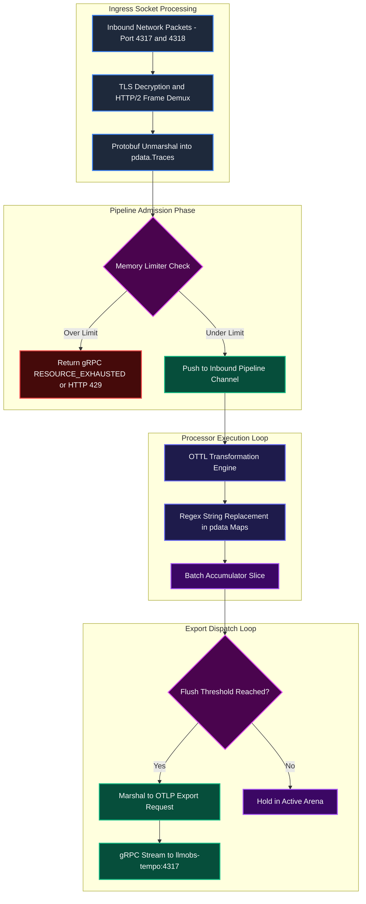

---

### 2.4 System Pipeline Parameter Reference Specifications

1. **Parameter**: `service.pipelines.traces.processors`
   - **Definition**: Ordered array defining the sequence in which trace processors mutate and filter spans.
   - **Expected Values**: Must start with `memory_limiter`, followed by sanitizers, and end with `batch`.
   - **Currently Configured Value**: `[memory_limiter, transform/pii_redaction, batch]`.
   - **Outcome / System Impact**: Guarantees memory safety by filtering before transformation allocations.
   - **Why and When to Configure It**: Architectural requirement. Swapping order risks container OOM crashes.
   - **Scaling and Troubleshooting**: Verify processor order in `otel-collector-config.yaml` during audits.

---

2. **Parameter**: `service.pipelines.traces.exporters`
   - **Definition**: Destination sinks for processed spans.
   - **Expected Values**: `[otlp/tempo, debug]`.
   - **Currently Configured Value**: `[otlp/tempo, debug]`.
   - **Outcome / System Impact**: Delivers telemetry to storage and local stdout logs concurrently.
   - **Why and When to Configure It**: Core export declaration.
   - **Scaling and Troubleshooting**: Add secondary analytic stores (e.g. ClickHouse) as additional sinks.

---

## 3. OTLP Ingestion Receivers Deep-Dive (gRPC 4317 and HTTP 4318)

The receiver layer ingests telemetry across binary gRPC and RESTful HTTP transports, managing socket termination and TLS negotiation.

### 3.1 Receiver Configuration Block

```yaml
receivers:
  otlp:
    protocols:
      grpc:
        endpoint: 0.0.0.0:4317
        tls:
          cert_file: /etc/otel-collector/certs/server.pem
          key_file: /etc/otel-collector/certs/server-key.pem
      http:
        endpoint: 0.0.0.0:4318
        tls:
          cert_file: /etc/otel-collector/certs/server.pem
          key_file: /etc/otel-collector/certs/server-key.pem
        cors:
          allowed_origins:
            - "http://localhost:31400"
            - "http://localhost:3000"
            - "http://127.0.0.1:31400"
            - "http://127.0.0.1:3000"
            - "*"
          allowed_headers:
            - "*"
```

---

### 3.2 Ingestion High-Level Design (HLD): Ingress Topology

```mermaid
graph TD
    subgraph ClientCallers ["Upstream Sources"]
        GRPCClient["Microservice Agents"]
        BrowserClient["Browser SDKs"]
    end

    subgraph SecurityBoundary ["Ingress Layer"]
        TraefikProxy["Traefik Gateway"]
        DirectPortBridge["Direct Port Mapping"]
    end

    subgraph ProtocolHandlers ["Collector Handlers"]
        GRPCHandler["gRPC Handler"]
        HTTPHandler["HTTP Handler"]
    end

    GRPCClient --> DirectPortBridge
    BrowserClient --> TraefikProxy
    DirectPortBridge --> GRPCHandler
    TraefikProxy --> HTTPHandler
    GRPCHandler --> TracePipeline["Pipeline Consumer"]
    HTTPHandler --> TracePipeline

    style TraefikProxy fill:#4a044e,stroke:#d946ef
    style DirectPortBridge fill:#4a044e,stroke:#d946ef
```

---

### 3.3 Ingestion Low-Level Design (LLD): Socket Lifecycle and TLS Negotiation

```mermaid
graph LR
    subgraph SocketEstablishment ["TCP/TLS Layer"]
        SYN["TCP Handshake"]
        TLSHello["TLS Client Hello"]
        ServerCert["Negotiate Cipher"]
        EncryptedStream["Encrypted Transport"]
        SYN --> TLSHello
        TLSHello --> ServerCert
        ServerCert --> EncryptedStream
    end

    subgraph ProtocolDecoding ["Protocol Parser"]
        StreamDetect{"Protocol Type"}
        H2Framer["HTTP/2 Frame Reader"]
        RESTParser["REST Parser"]
        StreamDetect -->|gRPC/h2| H2Framer
        StreamDetect -->|HTTP1| RESTParser
    end

    subgraph MemoryMapping ["Materialization"]
        ProtoDecode["Unmarshal Protobuf"]
        JSONDecode["Unmarshal JSON"]
        DispatchPipe["Pipeline Dispatch"]
        ProtoDecode --> DispatchPipe
        JSONDecode --> DispatchPipe
    end

    EncryptedStream --> StreamDetect
    H2Framer --> ProtoDecode
    RESTParser --> JSONDecode

    style EncryptedStream fill:#064e3b,stroke:#10b981
    style DispatchPipe fill:#064e3b,stroke:#10b981
```

---

### 3.4 Ingestion Detailed Configuration Breakdown

1. **Parameter**: `receivers.otlp.protocols.grpc.endpoint`
   - **Definition**: Socket address for OTLP gRPC.
   - **Expected Values**: `0.0.0.0:4317`.
   - **Currently Configured Value**: `0.0.0.0:4317`.
   - **Outcome / System Impact**: Serves gRPC clients across all container interfaces.
   - **Why and When to Configure It**: Core network listener.
   - **Scaling and Troubleshooting**: Verify using `grpcurl` or native SDK tests.

---

2. **Parameter**: `receivers.otlp.protocols.http.cors.allowed_origins`
   - **Definition**: Allowed CORS origins for web clients.
   - **Expected Values**: Explicit URL list or development wildcard `*`.
   - **Currently Configured Value**: `["http://localhost:31400", "http://localhost:3000", "*"]`.
   - **Outcome / System Impact**: Prevents browser cross-origin blocking.
   - **Why and When to Configure It**: Essential for web-based trace producers.
   - **Scaling and Troubleshooting**: Inspect browser console for CORS error codes.

---

## 4. Memory Limiter Processor and Go Runtime GC Pacing Deep-Dive

The `memory_limiter` processor and Go's runtime memory limiter (`GOMEMLIMIT`) work in tandem to prevent container termination under load.

### 4.1 Memory Limiter Configuration Block

```yaml
# config/otel-collector/otel-collector-config.yaml
processors:
  memory_limiter:
    check_interval: 1s
    limit_mib: 800
    spike_limit_mib: 160
```

```yaml
# docker-compose.yml
    deploy:
      resources:
        limits:
          memory: 1024M
        reservations:
          memory: 256M
    environment:
      - GOMEMLIMIT=858993459
```

### 4.2 Memory Limiter High-Level Design (HLD): Threshold Gatekeeper

```mermaid
graph TD
    subgraph Tier1 ["Normal Ingestion"]
        NormalQuota["0-640 MiB Heap"]
        SpansPass["Admitted"]
        NormalQuota --> SpansPass
    end

    subgraph Tier2 ["Spike Burst"]
        SoftQuota["640-800 MiB"]
        SpansSoft["Proportional Drop"]
        SoftQuota --> SpansSoft
    end

    subgraph Tier3 ["Hard Boundary"]
        HardQuota["800 MiB Limit"]
        SpansHard["Rejected"]
        HardQuota --> SpansHard
    end

    SpansPass --> SoftQuota
    SpansSoft --> HardQuota

    style NormalQuota fill:#064e3b,stroke:#10b981
    style SoftQuota fill:#451a03,stroke:#f59e0b
    style HardQuota fill:#450a0a,stroke:#ef4444
```

### 4.3 Memory Limiter Low-Level Design (LLD): Go GC Pacing vs Application Shedding

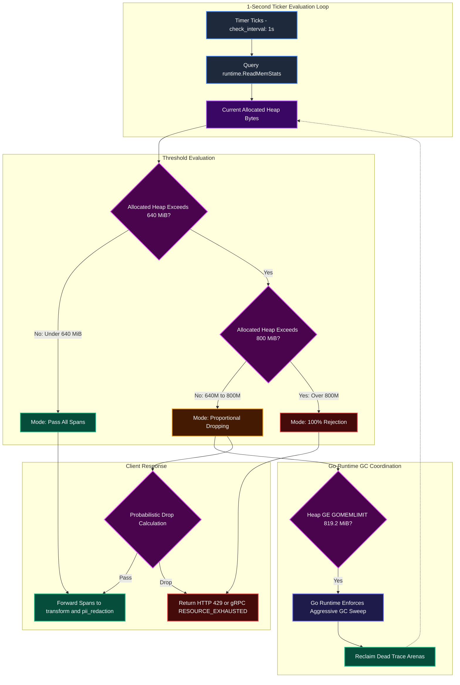

---

### 4.4 Memory Limiter Detailed Configuration Breakdown

1. **Parameter**: `processors.memory_limiter.limit_mib`
   - **Definition**: Hard ceiling for data rejection.
   - **Expected Values**: `800` (for 1024M container) | `1600` (for 2048M container).
   - **Currently Configured Value**: `800` (800 MiB).
   - **Outcome / System Impact**: Prevents Linux kernel OOM killer invocation.
   - **Why and When to Configure It**: Essential memory gatekeeper.
   - **Scaling and Troubleshooting**: Monitored via `otelcol_processor_refused_spans`.

---

2. **Parameter**: `processors.memory_limiter.spike_limit_mib`
   - **Definition**: Soft limit safety margin below `limit_mib`.
   - **Expected Values**: `160` (for 800 MiB limit).
   - **Currently Configured Value**: `160` (160 MiB).
   - **Outcome / System Impact**: Absorbs temporary traffic spikes without hard pipeline drops.
   - **Why and When to Configure It**: Provides elastic buffering.
   - **Scaling and Troubleshooting**: Adjust if false backpressure occurs during routine bursts.

---

## 5. Transform and OTTL PII Redaction Processor Deep-Dive

The `transform` processor uses the OpenTelemetry Transformation Language (OTTL) to sanitize sensitive tokens, keys, and PII from traces before export.

### 5.1 Redaction Statements Configuration Block

```yaml
processors:
  transform/pii_redaction:
    error_mode: ignore
    trace_statements:
      - context: resource
        statements:
          - replace_all_patterns(resource.attributes, "value", "sk-[a-zA-Z0-9_-]{20,}", "[REDACTED_API_KEY]")
          - replace_all_patterns(resource.attributes, "value", "AKIA[0-9A-Z]{16}", "[REDACTED_AWS_KEY]")
      - context: span
        statements:
          - replace_all_patterns(span.attributes, "value", "sk-[a-zA-Z0-9_-]{20,}", "[REDACTED_API_KEY]")
          - replace_all_patterns(span.attributes, "value", "AKIA[0-9A-Z]{16}", "[REDACTED_AWS_KEY]")
          - replace_all_patterns(span.attributes, "value", "eyJ[A-Za-z0-9-_=]+\\.[A-Za-z0-9-_=]+\\.[A-Za-z0-9-_=]*", "[REDACTED_JWT]")
          - replace_all_patterns(span.attributes, "value", "-----BEGIN [A-Z ]+KEY-----", "[REDACTED_PRIVATE_KEY]")
          - replace_all_patterns(span.attributes, "value", "Bearer\\s+[a-zA-Z0-9._\\-]+", "Bearer [REDACTED_TOKEN]")
          - replace_all_patterns(span.attributes, "value", "[a-zA-Z0-9._%+-]+@[a-zA-Z0-9.-]+\\.[a-zA-Z]{2,}", "[REDACTED_EMAIL]")
          - replace_all_patterns(span.attributes, "value", "\\b(?:4[0-9]{12}(?:[0-9]{3})?|5[1-5][0-9]{14}|3[47][0-9]{13})\\b", "[REDACTED_CARD]")
      - context: spanevent
        statements:
          - replace_all_patterns(spanevent.attributes, "value", "sk-[a-zA-Z0-9_-]{20,}", "[REDACTED_API_KEY]")
          - replace_all_patterns(spanevent.attributes, "value", "AKIA[0-9A-Z]{16}", "[REDACTED_AWS_KEY]")
          - replace_all_patterns(spanevent.attributes, "value", "eyJ[A-Za-z0-9-_=]+\\.[A-Za-z0-9-_=]+\\.[A-Za-z0-9-_=]*", "[REDACTED_JWT]")
```

---

### 5.2 OTTL High-Level Design (HLD): Hierarchical Redaction Architecture

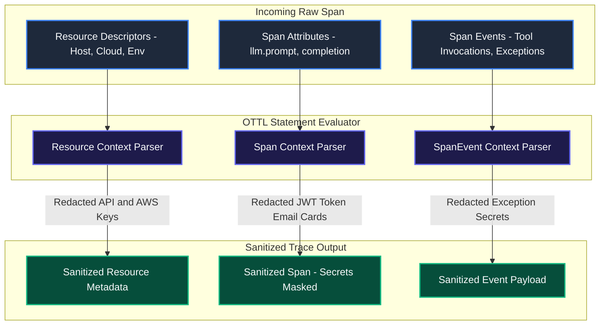

---

### 5.3 OTTL Low-Level Design (LLD): AST Compilation and String Mutation

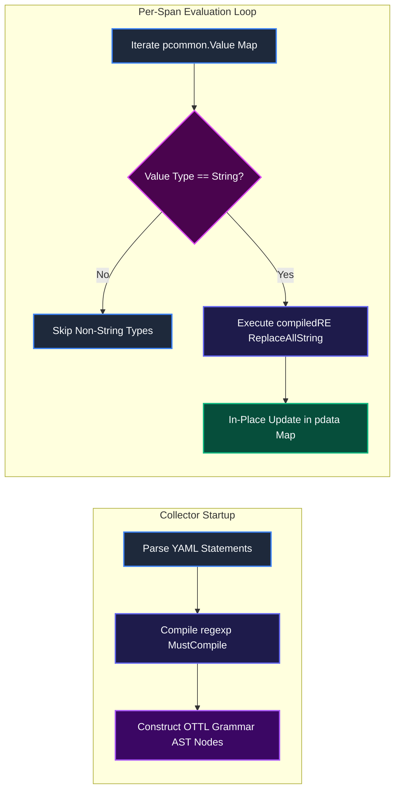

---

### 5.4 OTTL Detailed Configuration Breakdown

1. **Parameter**: `processors.transform/pii_redaction.error_mode`
   - **Definition**: Exception handling behavior for grammar evaluation.
   - **Expected Values**: `ignore` (production) | `propagate` (testing).
   - **Currently Configured Value**: `ignore`.
   - **Outcome / System Impact**: Prevents individual attribute parsing errors from dropping entire span batches.
   - **Why and When to Configure It**: Production resilience requirement.
   - **Scaling and Troubleshooting**: Verify via Collector error logs.

---

2. **Parameter**: `replace_all_patterns`
   - **Definition**: OTTL function performing regex matching and substitution.
   - **Expected Values**: `(target_map, mode, regex_pattern, replacement_string)`.
   - **Currently Configured Value**: Configured across API keys, AWS credentials, JWTs, and PII.
   - **Outcome / System Impact**: Replaces sensitive data with safe placeholders before export.
   - **Why and When to Configure It**: Regulatory compliance requirement.
   - **Scaling and Troubleshooting**: Test patterns with standard Go regex testers.

---

## 6. Attributes and Resource Processors Deep-Dive

The `attributes` and `resource` processors inject standard platform labels and environment tags into telemetry.

### 6.1 Enrichment Configuration Block

```yaml
processors:
  attributes:
    actions:
      - key: deployment.environment
        value: development
        action: upsert
      - key: service.namespace
        value: llmobs-platform
        action: upsert
      - key: network.transport
        value: tcp
        action: upsert
      - key: network.protocol.name
        value: otlp
        action: upsert

  resource:
    attributes:
      - key: infra.stack
        value: llm-obs-infra
        action: upsert
      - key: infra.network
        value: llmobs-network
        action: upsert
      - key: telemetry.sdk.language
        value: collector
        action: upsert
```

---

### 6.2 Enrichment High-Level Design (HLD): Tag Injection Flow

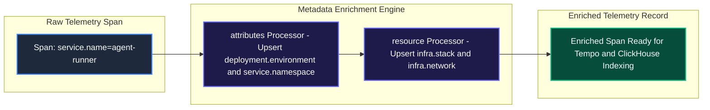

---

### 6.3 Enrichment Low-Level Design (LLD): Attribute Mutation Internals

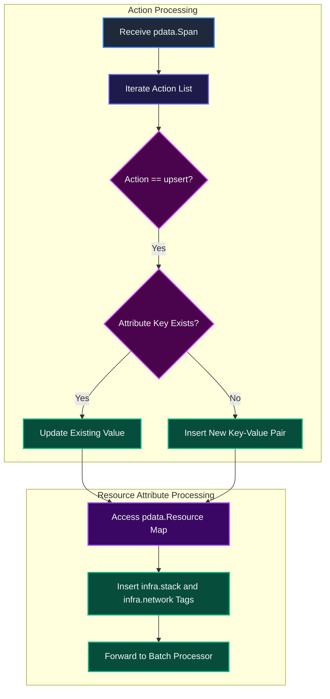

---

### 6.4 Enrichment Detailed Configuration Breakdown

1. **Parameter**: `processors.attributes.actions.action: upsert`
   - **Definition**: Inserts attribute if absent, updates value if present.
   - **Expected Values**: `insert`, `update`, `upsert`, `delete`.
   - **Currently Configured Value**: `upsert`.
   - **Outcome / System Impact**: Guarantees standard platform tags exist on all spans.
   - **Why and When to Configure It**: Normalizes telemetry from third-party agents.
   - **Scaling and Troubleshooting**: Verify attributes in Grafana trace query filters.

---

2. **Parameter**: `processors.resource.attributes`
   - **Definition**: Injects resource-level deployment tags.
   - **Expected Values**: Key-value metadata pairs.
   - **Currently Configured Value**: `infra.stack: llm-obs-infra`, `infra.network: llmobs-network`.
   - **Outcome / System Impact**: Associates traces with physical stack deployment boundaries.
   - **Why and When to Configure It**: Crucial for multi-tenant and multi-cluster routing.
   - **Scaling and Troubleshooting**: Check resource attribute tables in Tempo.

---

## 7. Batch Processor and Memory Buffering Deep-Dive

The `batch` processor aggregates spans into larger batches, optimizing downstream serialization and network I/O.

### 7.1 Batch Processor Configuration Block

```yaml
processors:
  batch:
    timeout: 1s
    send_batch_size: 1024
```

---

### 7.2 Batching High-Level Design (HLD): Buffer Aggregation Topology

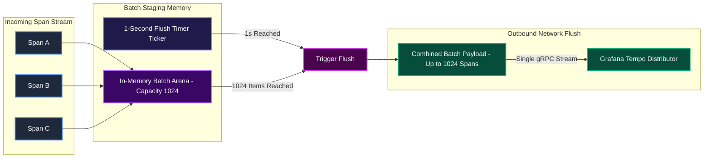

---

### 7.3 Batching Low-Level Design (LLD): Mutex Locking and Swap Mechanics

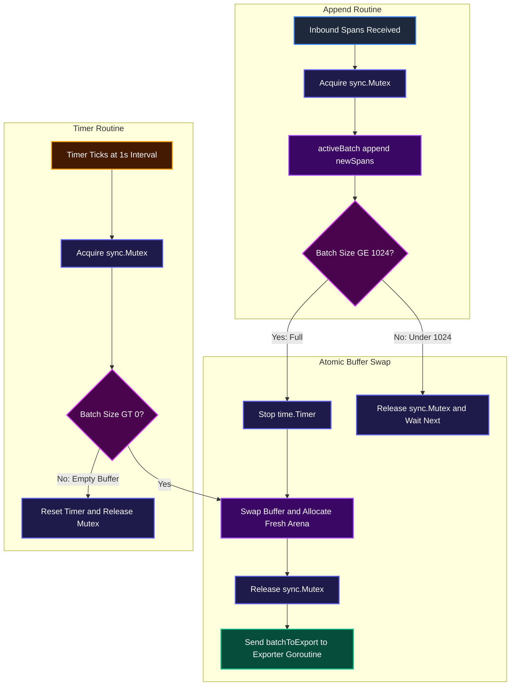

---

### 7.4 Batching Detailed Configuration Breakdown

1. **Parameter**: `processors.batch.send_batch_size`
   - **Definition**: Number of spans aggregated per flush.
   - **Expected Values**: `512` to `1024` (dev) | `8192` (production).
   - **Currently Configured Value**: `1024`.
   - **Outcome / System Impact**: Optimizes network transmission and reduces TCP overhead.
   - **Why and When to Configure It**: Core batch tuning knob.
   - **Scaling and Troubleshooting**: Monitored via `otelcol_processor_batch_batch_send_size`.

---

2. **Parameter**: `processors.batch.timeout`
   - **Definition**: Maximum latency before forcing a batch flush.
   - **Expected Values**: `1s`.
   - **Currently Configured Value**: `1s`.
   - **Outcome / System Impact**: Bounds trace visibility latency to 1 second under low load.
   - **Why and When to Configure It**: Essential for real-time observability.
   - **Scaling and Troubleshooting**: Verify via `otelcol_processor_batch_timeout_trigger_send`.

---

## 8. Exporter Routing, Queuing and Downstream Tempo Integration Deep-Dive

The exporter layer transmits processed spans to Grafana Tempo and local stdout logs, managing connection pools and retries.

### 8.1 Exporters Configuration Block

```yaml
exporters:
  otlp/tempo:
    endpoint: "llmobs-tempo:4317"
    tls:
      insecure: true
    sending_queue:
      enabled: true
      num_consumers: 4
      queue_size: 1000
    retry_on_failure:
      enabled: true
      initial_interval: 5s
      max_interval: 30s
      max_elapsed_time: 5m

  debug:
    verbosity: basic
```

---

### 8.2 Exporter High-Level Design (HLD): Fan-Out and Queuing Topology

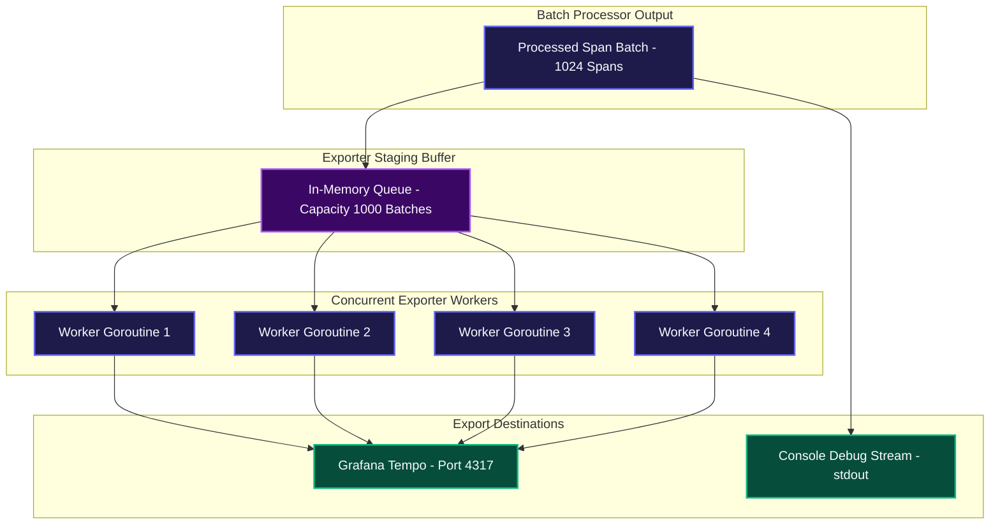

---

### 8.3 Exporter Low-Level Design (LLD): Retry State Machine and Connection Health

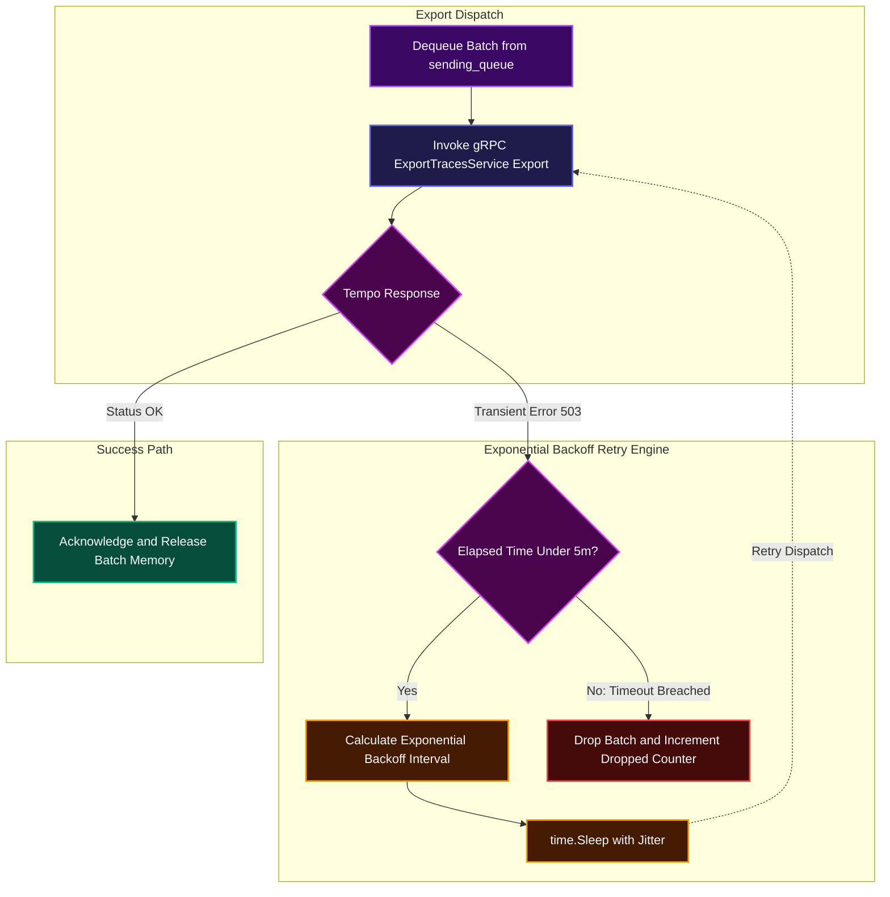

---

### 8.4 Exporter Detailed Configuration Breakdown

1. **Parameter**: `exporters.otlp/tempo.endpoint`
   - **Definition**: Destination endpoint for Tempo ingestion.
   - **Expected Values**: `"llmobs-tempo:4317"`.
   - **Currently Configured Value**: `"llmobs-tempo:4317"`.
   - **Outcome / System Impact**: Routes sanitized traces to long-term storage.
   - **Why and When to Configure It**: Core export destination.
   - **Scaling and Troubleshooting**: Verify via `docker exec -it llmobs-otel-collector nc -zv llmobs-tempo 4317`.

---

2. **Parameter**: `exporters.debug.verbosity`
   - **Definition**: Console log detail level.
   - **Expected Values**: `basic` | `detailed`.
   - **Currently Configured Value**: `basic`.
   - **Outcome / System Impact**: Prints concise summaries without flooding disk.
   - **Why and When to Configure It**: Verifies active pipeline flow.
   - **Scaling and Troubleshooting**: Inspect via `docker logs llmobs-otel-collector`.

---

## 9. Edge Routing, Traefik Reverse Proxy and TLS Ingress Deep-Dive

Traefik acts as the edge reverse proxy, managing SSL/TLS termination, rate limiting, and request payload caps before traffic reaches the Collector.

### 9.1 Traefik Ingress Labels Configuration Block

```yaml
# docker-compose.yml (Traefik Ingress Labels for OTel Collector)
    labels:
      - "traefik.enable=true"
      - "traefik.http.routers.otel.rule=Host(`llmobs.otel`) || Host(`otel.llmobs.local`)"
      - "traefik.http.routers.otel.entrypoints=websecure"
      - "traefik.http.routers.otel.tls=true"
      - "traefik.http.routers.otel.middlewares=security-headers@file,rate-limit-ingest@file,payload-limit@file"
      - "traefik.http.services.otel.loadbalancer.server.port=4318"
      - "traefik.http.services.otel.loadbalancer.server.scheme=https"
```

---

### 9.2 Ingress High-Level Design (HLD): Edge Gateway Architecture

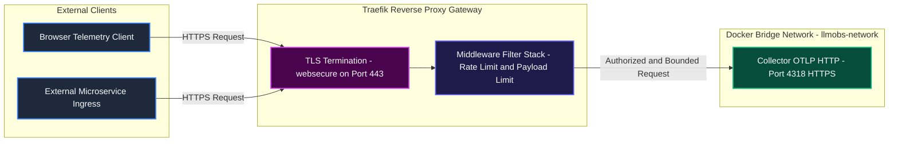

---

### 9.3 Ingress Low-Level Design (LLD): Traefik Middleware Evaluation Chain

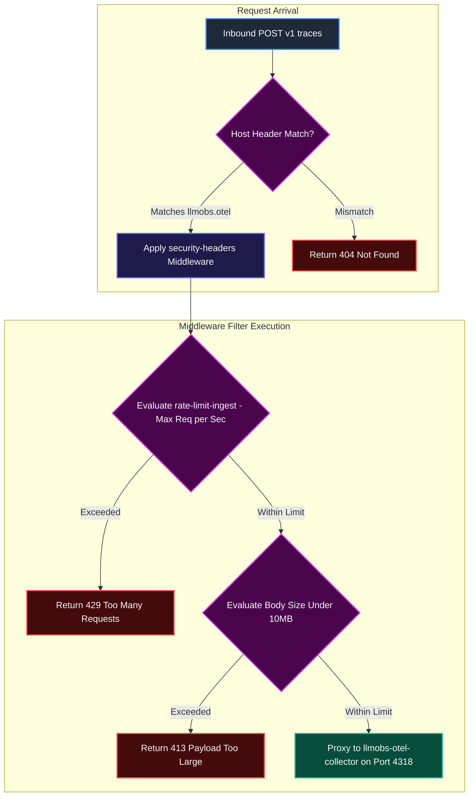

---

### 9.4 Ingress Detailed Configuration Breakdown

1. **Parameter**: `traefik.http.routers.otel.rule`
   - **Definition**: Domain host matching rule for routing traffic to the Collector.
   - **Expected Values**: `Host("llmobs.otel") || Host("otel.llmobs.local")`.
   - **Currently Configured Value**: Configured in `docker-compose.yml`.
   - **Outcome / System Impact**: Directs telemetry domain requests to the Collector service.
   - **Why and When to Configure It**: Production DNS routing requirement.
   - **Scaling and Troubleshooting**: Verify via `curl -k -H "Host: llmobs.otel" https://localhost/v1/traces`.

---

2. **Parameter**: `traefik.http.routers.otel.middlewares`
   - **Definition**: Ordered list of Traefik middleware plugins applied to ingress requests.
   - **Expected Values**: `security-headers`, `rate-limit-ingest`, `payload-limit`.
   - **Currently Configured Value**: Configured in `docker-compose.yml`.
   - **Outcome / System Impact**: Protects against DoS attacks, large payload memory exhaustion, and clickjacking.
   - **Why and When to Configure It**: Mandatory for edge protection.
   - **Scaling and Troubleshooting**: Check Traefik middleware logs for throttled requests.

---

## 10. Collector Health, Metrics and Self-Observability Deep-Dive

The Collector provides built-in extensions for health checks, diagnostic zPages, and internal Prometheus metric scraping.

### 10.1 Self-Observability Configuration Block

```yaml
extensions:
  health_check:
    endpoint: 0.0.0.0:13133
  zpages:
    endpoint: 0.0.0.0:55679

service:
  extensions: [health_check, zpages]
  telemetry:
    logs:
      level: info
    metrics:
      address: 0.0.0.0:8888
```

---

### 10.2 Self-Observability High-Level Design (HLD): Monitoring Topology

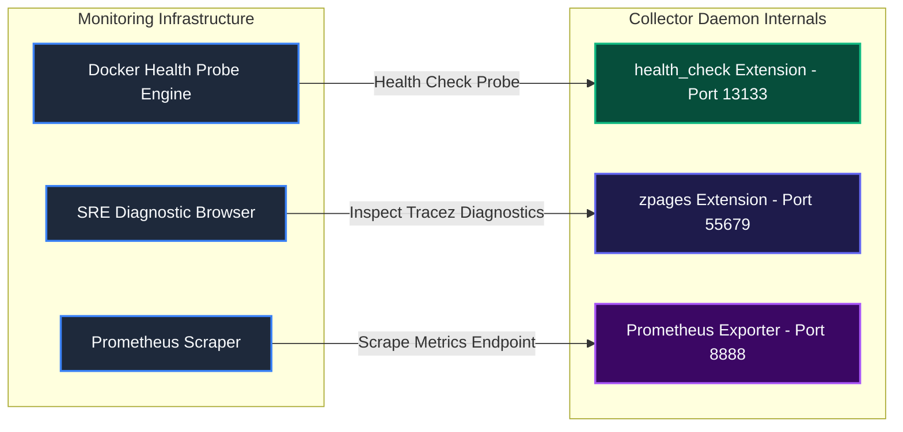

---

### 10.3 Self-Observability Low-Level Design (LLD): Metrics Collection Pipeline

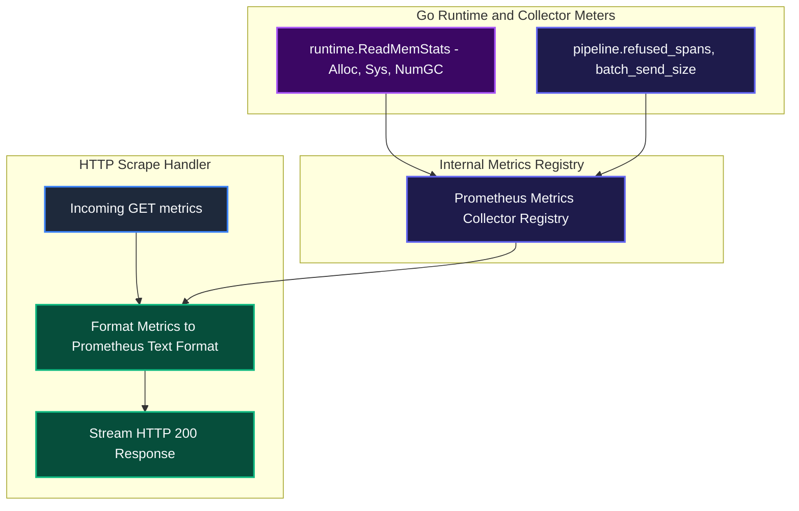

---

### 10.4 Self-Observability Detailed Configuration Breakdown

1. **Parameter**: `extensions.health_check.endpoint`
   - **Definition**: Port binding for health check probes.
   - **Expected Values**: `0.0.0.0:13133`.
   - **Currently Configured Value**: `0.0.0.0:13133`.
   - **Outcome / System Impact**: Returns HTTP 200 when pipeline components are healthy.
   - **Why and When to Configure It**: Used for automated container recovery.
   - **Scaling and Troubleshooting**: Test via `curl http://localhost:13133/`.

---

2. **Parameter**: `service.telemetry.metrics.address`
   - **Definition**: Socket address for internal Prometheus metrics.
   - **Expected Values**: `0.0.0.0:8888`.
   - **Currently Configured Value**: `0.0.0.0:8888`.
   - **Outcome / System Impact**: Exposes critical operational metrics for monitoring dashboards.
   - **Why and When to Configure It**: Mandatory for production operational visibility.
   - **Scaling and Troubleshooting**: Inspect metrics via `curl http://localhost:8888/metrics`.

---

## 11. Production Scale-Out and Multi-Instance High-Availability Architecture

For high-throughput production environments exceeding 5,000 spans per second, the platform provides a production override (`docker-compose.prod.yml`) that scales the Collector horizontally behind Traefik.

### 11.1 High-Availability Override Configuration Block

```yaml
# docker-compose.prod.yml (OTel Collector Override)
services:
  llmobs-otel-collector:
    deploy:
      replicas: 2
      resources:
        limits:
          memory: 2048M
        reservations:
          memory: 512M
    environment:
      - GOMEMLIMIT=1717986918  # 80% of 2048 MiB in bytes
```

---

### 11.2 High-Availability High-Level Design (HLD): Clustered Gateway Topology

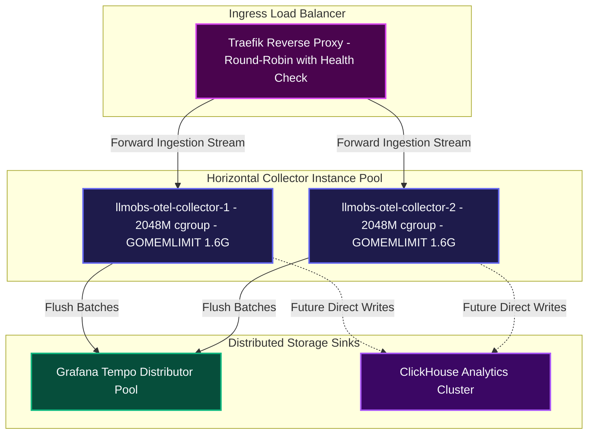

---

### 11.3 High-Availability Low-Level Design (LLD): Consistent Hashing and Routing

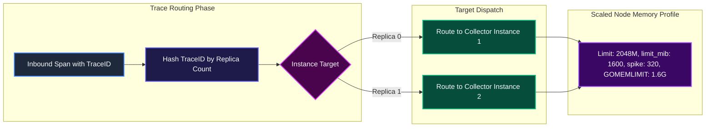

---

### 11.4 High-Availability Detailed Configuration Breakdown

1. **Parameter**: `deploy.replicas: 2`
   - **Definition**: Number of parallel Collector container instances deployed behind Traefik.
   - **Expected Values**: `2` to `10` depending on traffic volume.
   - **Currently Configured Value**: `2` in `docker-compose.prod.yml`.
   - **Outcome / System Impact**: Provides redundancy and doubles ingestion throughput capacity.
   - **Why and When to Configure It**: Required for production high availability.
   - **Scaling and Troubleshooting**: Scale dynamically via `docker compose -f docker-compose.yml -f docker-compose.prod.yml up -d --scale llmobs-otel-collector=3`.

---

2. **Parameter**: `GOMEMLIMIT=1717986918`
   - **Definition**: Scaled Go memory limit for 2048M production containers.
   - **Expected Values**: `1717986918` (80% of 2048 MiB in bytes).
   - **Currently Configured Value**: `1717986918` in `docker-compose.prod.yml`.
   - **Outcome / System Impact**: Scales Go heap boundaries proportionally with expanded container memory.
   - **Why and When to Configure It**: Must match upgraded container memory limits.
   - **Scaling and Troubleshooting**: Verify using `docker exec <container_id> env | grep GOMEMLIMIT`.

---

## 12. Native Emergency CLI Runbooks and Incident Playbooks

This section provides actionable, command-line diagnostic and remediation runbooks for operational incidents.

### 12.1 Runbook Configuration and Diagnostic Script

```bash
#!/usr/bin/env bash
# Diagnostic Runbook Script: scripts/diagnose-otel-collector.sh
set -euo pipefail

echo "=== 1. Checking Container State and Memory Limits ==="
docker inspect llmobs-otel-collector --format='
Container: {{.Name}}
State: {{.State.Status}}
OOMKilled: {{.State.OOMKilled}}
ExitCode: {{.State.ExitCode}}
MemoryLimit: {{.HostConfig.Memory}} bytes
'

echo "=== 2. Inspecting Go Runtime GOMEMLIMIT Environment Variable ==="
docker exec llmobs-otel-collector env | grep -E "GOMEMLIMIT|OTEL_SERVICE_NAME" || true

echo "=== 3. Querying Internal Memory and Pipeline Metrics ==="
curl -s http://localhost:8888/metrics | grep -E "otelcol_process_runtime_heap_alloc_bytes|otelcol_processor_refused_spans|otelcol_processor_dropped_spans" || true

echo "=== 4. Checking Downstream Tempo Connection ==="
docker exec -it llmobs-otel-collector nc -zv llmobs-tempo 4317 || true
```

---

### 12.2 Runbook High-Level Design (HLD): Incident Triage Workflow

```mermaid
graph TD
    subgraph AlarmTrigger ["Incident Detection"]
        Alert["Alert: Container Exit 137 or Spike in HTTP 429 Refusals"]
    end

    subgraph DiagnosisPhase ["Diagnostic Triage"]
        CheckOOM{"OOMKilled is True?"}
        CheckDownstream{"Tempo Connection Healthy?"}
    end

    subgraph RemediationAction ["Remediation Workflows"]
        FixOOM["Apply GOMEMLIMIT and Calibrate limit_mib to 800 MiB"]
        FixTempo["Restart Tempo and Flush Pending Exporter Queue"]
        ScaleOut["Deploy Production Profile - docker-compose.prod.yml"]
    end

    Alert --> CheckOOM
    CheckOOM -->|Yes| FixOOM
    CheckOOM -->|No| CheckDownstream
    CheckDownstream -->|Failed| FixTempo
    CheckDownstream -->|Healthy but Overloaded| ScaleOut

    style Alert fill:#450a0a,stroke:#ef4444,stroke-width:2px,color:#f8fafc
    style CheckOOM fill:#4a044e,stroke:#d946ef,stroke-width:2px,color:#f8fafc
    style CheckDownstream fill:#4a044e,stroke:#d946ef,stroke-width:2px,color:#f8fafc
    style FixOOM fill:#064e3b,stroke:#10b981,stroke-width:2px,color:#f8fafc
    style FixTempo fill:#064e3b,stroke:#10b981,stroke-width:2px,color:#f8fafc
    style ScaleOut fill:#064e3b,stroke:#10b981,stroke-width:2px,color:#f8fafc
```

---

### 12.3 Runbook Low-Level Design (LLD): Step-by-Step Incident Playbooks

```mermaid
graph LR
    subgraph Playbook1 ["Playbook 1: OOM Crash Recovery"]
        P1Step1["1. Verify cgroup limit via docker inspect"] --> P1Step2["2. Confirm GOMEMLIMIT=858993459 in env"]
        P1Step2 --> P1Step3["3. Ensure limit_mib=800 in config.yaml"]
        P1Step3 --> P1Step4["4. Restart container: docker compose up -d"]
    end

    subgraph Playbook2 ["Playbook 2: HTTP 429 Storm Mitigation"]
        P2Step1["1. Inspect otelcol_processor_refused_spans"] --> P2Step2["2. Check Tempo ingestion disk latency"]
        P2Step2 --> P2Step3["3. Temporarily scale replicas in prod compose"]
    end

    style P1Step1 fill:#1e293b,stroke:#3b82f6,stroke-width:2px,color:#f8fafc
    style P1Step2 fill:#1e293b,stroke:#3b82f6,stroke-width:2px,color:#f8fafc
    style P1Step3 fill:#1e293b,stroke:#3b82f6,stroke-width:2px,color:#f8fafc
    style P1Step4 fill:#064e3b,stroke:#10b981,stroke-width:2px,color:#f8fafc
    style P2Step1 fill:#1e293b,stroke:#3b82f6,stroke-width:2px,color:#f8fafc
    style P2Step2 fill:#1e293b,stroke:#3b82f6,stroke-width:2px,color:#f8fafc
    style P2Step3 fill:#064e3b,stroke:#10b981,stroke-width:2px,color:#f8fafc
```

---

### 12.4 Incident Procedures Breakdown

1. **Incident: Container OOM Kill (`Exit 137`)**
   - **Diagnostic**: Execute `docker inspect llmobs-otel-collector --format='{{.State.OOMKilled}}'`.
   - **Action**: Ensure `GOMEMLIMIT=858993459` is set in `docker-compose.yml` and `limit_mib: 800` in `otel-collector-config.yaml`. Restart container with `docker compose up -d llmobs-otel-collector`.

2. **Incident: Ingestion Backpressure (HTTP 429 / ResourceExhausted)**
   - **Diagnostic**: Query `curl -s http://localhost:8888/metrics | grep otelcol_processor_refused_spans`.
   - **Action**: Check if downstream Tempo is experiencing disk stalls. If traffic exceeds 1024M capacity, launch production override `docker compose -f docker-compose.yml -f docker-compose.prod.yml up -d`.

3. **Incident: TLS Certificate Expiry**
   - **Diagnostic**: Execute `openssl x509 -in config/certs/server.pem -noout -enddate`.
   - **Action**: Regenerate certificates in `./config/certs` and execute `docker compose restart llmobs-otel-collector`.
